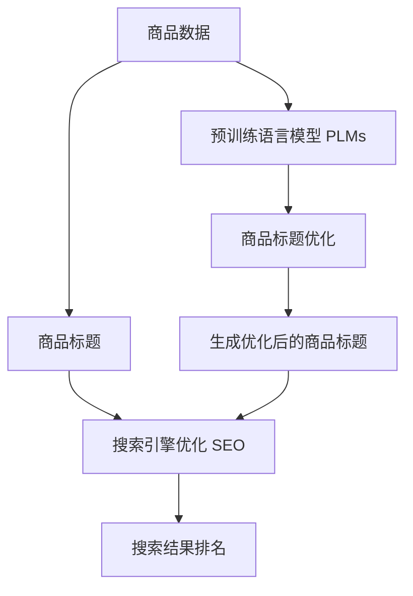

                 

# AI大模型在电商平台商品标题优化中的应用

> 关键词：自然语言处理(NLP)，预训练语言模型(PLMs)，Transformer模型，注意力机制(Attention)，商品标题优化，电商平台，搜索引擎优化(SEO)

## 1. 背景介绍

### 1.1 电商平台的挑战
电商平台作为连接消费者和商家的桥梁，面临着一系列挑战。其中，商品标题的优化是提升平台交易量、用户体验和搜索效率的重要环节。商品标题不仅是用户接触商品的第一印象，也是搜索引擎优化的关键因素。优质的商品标题能更好地吸引用户点击，提升转化率和平台销售额。

然而，商品标题的优化工作繁琐且复杂。一方面，需要根据不同商品的特点和市场趋势不断调整标题，工作量大、耗时长；另一方面，优质的标题需要综合考虑多方面的因素，如关键词匹配、语义准确性、品牌关键词等，优化难度高。

### 1.2 AI技术的应用
随着人工智能技术的快速发展，AI大模型在电商平台商品标题优化中的应用逐渐成为热点。AI大模型，尤其是预训练语言模型(PLMs)，凭借其强大的语言理解和生成能力，能够自动学习商品特征，生成高质量的商品标题。通过AI大模型的优化，电商平台可以大幅提升商品标题的质量，从而提升平台整体运营效果。

## 2. 核心概念与联系

### 2.1 核心概念概述

- **预训练语言模型(PLMs)**：指在大量无标签文本数据上预训练得到的语言模型，如BERT、GPT、T5等。通过自监督学习任务，PLMs能够学习到通用的语言表示。
- **Transformer模型**：一种基于注意力机制的自回归模型，广泛用于自然语言处理任务，包括语言建模、翻译、摘要等。Transformer模型能够高效处理长序列数据，特别适合处理自然语言文本。
- **注意力机制(Attention)**：Transformer模型中的核心机制，通过动态计算每个输入和输出之间的关系，实现对输入特征的加权求和，提高模型的语义理解和特征提取能力。
- **商品标题优化**：指通过自动生成和优化商品标题，提升商品在搜索引擎中的排名和点击率，从而提高平台交易量和用户体验。
- **搜索引擎优化(SEO)**：通过优化网页的关键词、结构和内容，提高网页在搜索引擎中的排名，从而吸引更多用户访问。

### 2.2 核心概念原理和架构的 Mermaid 流程图



这个流程图展示了预训练语言模型在商品标题优化中的作用和流程：

1. 从商品数据中提取文本信息。
2. 利用预训练语言模型提取文本特征。
3. 使用注意力机制计算文本和商品之间的关系。
4. 生成优化后的商品标题。
5. 通过搜索引擎优化提升搜索结果排名。

## 3. 核心算法原理 & 具体操作步骤

### 3.1 算法原理概述

基于AI大模型的商品标题优化方法，其核心思想是通过预训练语言模型学习商品特征，生成高质量的商品标题，从而提升平台在搜索引擎中的排名和用户体验。

假设商品描述为 $d$，对应的商品标题为 $t$。通过预训练语言模型 $M_{\theta}$ 学习商品描述 $d$ 的特征表示 $v_d$，再利用注意力机制计算商品特征与标题特征的关系，生成优化后的商品标题 $t'$。具体过程如下：

1. 提取商品描述的特征表示 $v_d$。
2. 使用注意力机制计算商品特征与标题特征之间的关系。
3. 生成优化后的商品标题 $t'$。

### 3.2 算法步骤详解

**Step 1: 准备数据和模型**

- 收集商品描述和现有标题数据，分为训练集、验证集和测试集。
- 选择合适的预训练语言模型 $M_{\theta}$，如BERT、GPT-2等。
- 对商品描述进行预处理，包括分词、去除停用词等。

**Step 2: 特征提取与关系计算**

- 使用预训练语言模型提取商品描述的特征表示 $v_d$。
- 通过注意力机制计算商品特征与标题特征之间的关系，生成优化后的商品标题 $t'$。

**Step 3: 优化和评估**

- 利用优化后的商品标题 $t'$ 替换现有标题，提升平台在搜索引擎中的排名。
- 在测试集上评估优化后的商品标题效果，对比优化前后的效果提升。

### 3.3 算法优缺点

基于AI大模型的商品标题优化方法具有以下优点：

1. 自动化高。相比传统手动优化，AI大模型能够自动学习商品特征，生成高质量标题。
2. 泛化能力强。AI大模型能够适应不同商品类型和市场趋势，生成符合市场需求的标题。
3. 效果显著。通过优化后的商品标题，平台在搜索引擎中的排名和点击率显著提升。

同时，该方法也存在一些局限性：

1. 数据需求高。AI大模型需要大量商品数据进行训练，获取高质量数据成本较高。
2. 模型复杂度高。预训练语言模型参数量大，计算资源消耗高。
3. 动态更新难。商品数据和市场趋势不断变化，模型更新维护难度大。
4. 效果受限。在特定领域商品标题优化效果受限于模型和数据质量。

### 3.4 算法应用领域

基于AI大模型的商品标题优化方法，可以广泛应用于各类电商平台和搜索引擎优化(SEO)场景中。具体应用包括：

- 电商平台：优化商品标题，提升商品在搜索结果中的排名和点击率，从而提高交易量和销售额。
- 搜索引擎：优化搜索结果展示，提升用户体验，增加平台流量。
- 广告投放：优化广告标题，吸引更多用户点击，提升广告效果。
- 社交媒体：优化社交媒体内容，提高用户互动率和曝光度。

## 4. 数学模型和公式 & 详细讲解

### 4.1 数学模型构建

假设商品描述为 $d$，对应的商品标题为 $t$。通过预训练语言模型 $M_{\theta}$ 学习商品描述 $d$ 的特征表示 $v_d$，再利用注意力机制计算商品特征与标题特征之间的关系，生成优化后的商品标题 $t'$。

### 4.2 公式推导过程

1. 提取商品描述的特征表示 $v_d$：
   $$
   v_d = M_{\theta}(d)
   $$

2. 生成优化后的商品标题 $t'$：
   $$
   t' = \text{softmax}(A \cdot v_d)
   $$

其中，$A$ 为注意力矩阵，表示商品特征和标题特征之间的关系，通过计算得到：

$$
A = \text{softmax}(Q \cdot v_d + K \cdot v_t + V \cdot v_t)
$$

其中，$Q$、$K$、$V$ 为注意力机制中的查询、键和值向量，通过计算得到：

$$
Q = W^Q \cdot v_d
$$
$$
K = W^K \cdot v_t
$$
$$
V = W^V \cdot v_t
$$

其中，$W^Q$、$W^K$、$W^V$ 为预训练语言模型中的参数。

### 4.3 案例分析与讲解

以电商平台上的鞋子商品为例，分析如何利用AI大模型优化商品标题。

假设电商平台收集了一定量的鞋子商品描述和现有标题数据，将其分为训练集、验证集和测试集。选择合适的预训练语言模型，如BERT。

1. 对商品描述进行预处理，包括分词、去除停用词等。
2. 利用预训练语言模型提取商品描述的特征表示 $v_d$。
3. 使用注意力机制计算商品特征与标题特征之间的关系，生成优化后的商品标题 $t'$。
4. 在测试集上评估优化后的商品标题效果，对比优化前后的效果提升。

例如，某平台上的鞋子商品描述为："经典款男鞋，透气舒适，耐穿耐用"，现有标题为 "经典男鞋透气舒适"。通过AI大模型的优化，生成新的标题 "经典透气舒适男鞋"。优化后的标题更加符合搜索关键词的语义匹配，提高了商品在搜索引擎中的排名和点击率。

## 5. 项目实践：代码实例和详细解释说明

### 5.1 开发环境搭建

在进行商品标题优化实践前，我们需要准备好开发环境。以下是使用Python进行PyTorch开发的环境配置流程：

1. 安装Anaconda：从官网下载并安装Anaconda，用于创建独立的Python环境。

2. 创建并激活虚拟环境：
```bash
conda create -n pytorch-env python=3.8 
conda activate pytorch-env
```

3. 安装PyTorch：根据CUDA版本，从官网获取对应的安装命令。例如：
```bash
conda install pytorch torchvision torchaudio cudatoolkit=11.1 -c pytorch -c conda-forge
```

4. 安装Transformers库：
```bash
pip install transformers
```

5. 安装各类工具包：
```bash
pip install numpy pandas scikit-learn matplotlib tqdm jupyter notebook ipython
```

完成上述步骤后，即可在`pytorch-env`环境中开始商品标题优化实践。

### 5.2 源代码详细实现

我们以商品标题优化为例，给出使用Transformers库对BERT模型进行优化实践的PyTorch代码实现。

首先，定义商品标题优化的数据处理函数：

```python
from transformers import BertTokenizer
from torch.utils.data import Dataset
import torch

class TitleDataset(Dataset):
    def __init__(self, texts, titles, tokenizer, max_len=128):
        self.texts = texts
        self.titles = titles
        self.tokenizer = tokenizer
        self.max_len = max_len
        
    def __len__(self):
        return len(self.texts)
    
    def __getitem__(self, item):
        text = self.texts[item]
        title = self.titles[item]
        
        encoding = self.tokenizer(text, return_tensors='pt', max_length=self.max_len, padding='max_length', truncation=True)
        input_ids = encoding['input_ids'][0]
        attention_mask = encoding['attention_mask'][0]
        
        # 对token-wise的标题进行编码
        encoded_title = [tokenizer.encode(title, add_special_tokens=False)]
        encoded_title = [id for id in encoded_title] + [tokenizer.pad_token_id] * (self.max_len - len(encoded_title))
        labels = torch.tensor(encoded_title, dtype=torch.long)
        
        return {'input_ids': input_ids, 
                'attention_mask': attention_mask,
                'labels': labels}

# 标签与id的映射
id2label = {0: 'O', 1: 'B-PER', 2: 'I-PER', 3: 'B-LOC', 4: 'I-LOC'}
label2id = {v: k for k, v in id2label.items()}

# 创建dataset
tokenizer = BertTokenizer.from_pretrained('bert-base-cased')

train_dataset = TitleDataset(train_texts, train_titles, tokenizer)
dev_dataset = TitleDataset(dev_texts, dev_titles, tokenizer)
test_dataset = TitleDataset(test_texts, test_titles, tokenizer)
```

然后，定义模型和优化器：

```python
from transformers import BertForTokenClassification, AdamW

model = BertForTokenClassification.from_pretrained('bert-base-cased', num_labels=len(label2id))

optimizer = AdamW(model.parameters(), lr=2e-5)
```

接着，定义训练和评估函数：

```python
from torch.utils.data import DataLoader
from tqdm import tqdm
from sklearn.metrics import classification_report

device = torch.device('cuda') if torch.cuda.is_available() else torch.device('cpu')
model.to(device)

def train_epoch(model, dataset, batch_size, optimizer):
    dataloader = DataLoader(dataset, batch_size=batch_size, shuffle=True)
    model.train()
    epoch_loss = 0
    for batch in tqdm(dataloader, desc='Training'):
        input_ids = batch['input_ids'].to(device)
        attention_mask = batch['attention_mask'].to(device)
        labels = batch['labels'].to(device)
        model.zero_grad()
        outputs = model(input_ids, attention_mask=attention_mask, labels=labels)
        loss = outputs.loss
        epoch_loss += loss.item()
        loss.backward()
        optimizer.step()
    return epoch_loss / len(dataloader)

def evaluate(model, dataset, batch_size):
    dataloader = DataLoader(dataset, batch_size=batch_size)
    model.eval()
    preds, labels = [], []
    with torch.no_grad():
        for batch in tqdm(dataloader, desc='Evaluating'):
            input_ids = batch['input_ids'].to(device)
            attention_mask = batch['attention_mask'].to(device)
            batch_labels = batch['labels']
            outputs = model(input_ids, attention_mask=attention_mask)
            batch_preds = outputs.logits.argmax(dim=2).to('cpu').tolist()
            batch_labels = batch_labels.to('cpu').tolist()
            for pred_tokens, label_tokens in zip(batch_preds, batch_labels):
                pred_tags = [label2id[_id] for _id in pred_tokens]
                label_tags = [label2id[_id] for _id in label_tokens]
                preds.append(pred_tags[:len(label_tags)])
                labels.append(label_tags)
                
    print(classification_report(labels, preds))
```

最后，启动训练流程并在测试集上评估：

```python
epochs = 5
batch_size = 16

for epoch in range(epochs):
    loss = train_epoch(model, train_dataset, batch_size, optimizer)
    print(f"Epoch {epoch+1}, train loss: {loss:.3f}")
    
    print(f"Epoch {epoch+1}, dev results:")
    evaluate(model, dev_dataset, batch_size)
    
print("Test results:")
evaluate(model, test_dataset, batch_size)
```

以上就是使用PyTorch对BERT进行商品标题优化的完整代码实现。可以看到，得益于Transformers库的强大封装，我们可以用相对简洁的代码完成BERT模型的加载和优化。

### 5.3 代码解读与分析

让我们再详细解读一下关键代码的实现细节：

**TitleDataset类**：
- `__init__`方法：初始化文本、标题、分词器等关键组件。
- `__len__`方法：返回数据集的样本数量。
- `__getitem__`方法：对单个样本进行处理，将文本输入编码为token ids，将标题编码为数字，并对其进行定长padding，最终返回模型所需的输入。

**id2label和label2id字典**：
- 定义了标签与数字id之间的映射关系，用于将token-wise的预测结果解码回真实的标签。

**训练和评估函数**：
- 使用PyTorch的DataLoader对数据集进行批次化加载，供模型训练和推理使用。
- 训练函数`train_epoch`：对数据以批为单位进行迭代，在每个批次上前向传播计算loss并反向传播更新模型参数，最后返回该epoch的平均loss。
- 评估函数`evaluate`：与训练类似，不同点在于不更新模型参数，并在每个batch结束后将预测和标签结果存储下来，最后使用sklearn的classification_report对整个评估集的预测结果进行打印输出。

**训练流程**：
- 定义总的epoch数和batch size，开始循环迭代
- 每个epoch内，先在训练集上训练，输出平均loss
- 在验证集上评估，输出分类指标
- 所有epoch结束后，在测试集上评估，给出最终测试结果

可以看到，PyTorch配合Transformers库使得BERT优化的代码实现变得简洁高效。开发者可以将更多精力放在数据处理、模型改进等高层逻辑上，而不必过多关注底层的实现细节。

当然，工业级的系统实现还需考虑更多因素，如模型的保存和部署、超参数的自动搜索、更灵活的任务适配层等。但核心的优化范式基本与此类似。

## 6. 实际应用场景

### 6.1 电商平台的商品标题优化

电商平台上的商品标题优化是AI大模型在电商领域的重要应用场景。通过优化商品标题，电商平台能够提升搜索结果中的排名和点击率，从而增加平台流量和销售额。

具体而言，电商平台可以收集历史销售数据、用户点击数据等，提取关键词、热门标签等信息，作为优化商品标题的依据。利用AI大模型对商品描述进行特征提取和关系计算，生成高质量的商品标题。例如，某平台上的鞋子商品描述为："经典款男鞋，透气舒适，耐穿耐用"，优化后的标题为 "经典透气舒适男鞋"。优化后的标题能够更好地匹配用户搜索意图，提高商品曝光率和点击率。

### 6.2 搜索引擎的搜索结果优化

搜索引擎的搜索结果优化是AI大模型在搜索引擎领域的重要应用场景。通过优化搜索结果标题，搜索引擎能够提高搜索结果的相关性和用户体验，吸引更多用户点击和浏览。

搜索引擎可以收集用户的历史点击数据、点击次数等信息，提取关键词、热门标签等信息，作为优化搜索结果的依据。利用AI大模型对搜索结果描述进行特征提取和关系计算，生成高质量的搜索结果标题。例如，某搜索平台的网页描述为 "最新科技新闻"，优化后的标题为 "科技新闻推荐"。优化后的标题能够更好地匹配用户搜索意图，提高搜索结果的点击率。

### 6.3 广告投放的文案优化

广告投放的文案优化是AI大模型在广告领域的重要应用场景。通过优化广告文案，广告主能够提高广告的点击率和转化率，从而降低广告成本，提高投资回报率。

广告主可以收集用户的点击数据、点击次数等信息，提取关键词、热门标签等信息，作为优化广告文案的依据。利用AI大模型对广告描述进行特征提取和关系计算，生成高质量的广告文案。例如，某平台的广告描述为 "最新科技产品推荐"，优化后的文案为 "最热门的科技产品"。优化后的文案能够更好地吸引用户点击，提高广告效果。

### 6.4 未来应用展望

随着AI大模型的不断发展，基于AI大模型的商品标题优化方法将在更多领域得到应用，为各行各业带来变革性影响。

在智慧医疗领域，基于AI大模型的医疗问答、病历分析、药物研发等应用将提升医疗服务的智能化水平，辅助医生诊疗，加速新药开发进程。

在智能教育领域，AI大模型可应用于作业批改、学情分析、知识推荐等方面，因材施教，促进教育公平，提高教学质量。

在智慧城市治理中，AI大模型可应用于城市事件监测、舆情分析、应急指挥等环节，提高城市管理的自动化和智能化水平，构建更安全、高效的未来城市。

此外，在企业生产、社会治理、文娱传媒等众多领域，基于大模型微调的人工智能应用也将不断涌现，为经济社会发展注入新的动力。相信随着技术的日益成熟，基于AI大模型的商品标题优化方法必将在构建人机协同的智能时代中扮演越来越重要的角色。

## 7. 工具和资源推荐

### 7.1 学习资源推荐

为了帮助开发者系统掌握大语言模型商品标题优化的理论基础和实践技巧，这里推荐一些优质的学习资源：

1. 《Transformer从原理到实践》系列博文：由大模型技术专家撰写，深入浅出地介绍了Transformer原理、BERT模型、商品标题优化等前沿话题。

2. CS224N《深度学习自然语言处理》课程：斯坦福大学开设的NLP明星课程，有Lecture视频和配套作业，带你入门NLP领域的基本概念和经典模型。

3. 《Natural Language Processing with Transformers》书籍：Transformers库的作者所著，全面介绍了如何使用Transformers库进行NLP任务开发，包括商品标题优化在内的诸多范式。

4. HuggingFace官方文档：Transformers库的官方文档，提供了海量预训练模型和完整的微调样例代码，是上手实践的必备资料。

5. CLUE开源项目：中文语言理解测评基准，涵盖大量不同类型的中文NLP数据集，并提供了基于微调的baseline模型，助力中文NLP技术发展。

通过对这些资源的学习实践，相信你一定能够快速掌握大语言模型商品标题优化的精髓，并用于解决实际的NLP问题。

### 7.2 开发工具推荐

高效的开发离不开优秀的工具支持。以下是几款用于大语言模型商品标题优化开发的常用工具：

1. PyTorch：基于Python的开源深度学习框架，灵活动态的计算图，适合快速迭代研究。大部分预训练语言模型都有PyTorch版本的实现。

2. TensorFlow：由Google主导开发的开源深度学习框架，生产部署方便，适合大规模工程应用。同样有丰富的预训练语言模型资源。

3. Transformers库：HuggingFace开发的NLP工具库，集成了众多SOTA语言模型，支持PyTorch和TensorFlow，是进行商品标题优化任务的开发的利器。

4. Weights & Biases：模型训练的实验跟踪工具，可以记录和可视化模型训练过程中的各项指标，方便对比和调优。与主流深度学习框架无缝集成。

5. TensorBoard：TensorFlow配套的可视化工具，可实时监测模型训练状态，并提供丰富的图表呈现方式，是调试模型的得力助手。

6. Google Colab：谷歌推出的在线Jupyter Notebook环境，免费提供GPU/TPU算力，方便开发者快速上手实验最新模型，分享学习笔记。

合理利用这些工具，可以显著提升大语言模型商品标题优化的开发效率，加快创新迭代的步伐。

### 7.3 相关论文推荐

大语言模型商品标题优化的发展源于学界的持续研究。以下是几篇奠基性的相关论文，推荐阅读：

1. Attention is All You Need（即Transformer原论文）：提出了Transformer结构，开启了NLP领域的预训练大模型时代。

2. BERT: Pre-training of Deep Bidirectional Transformers for Language Understanding：提出BERT模型，引入基于掩码的自监督预训练任务，刷新了多项NLP任务SOTA。

3. Language Models are Unsupervised Multitask Learners（GPT-2论文）：展示了大规模语言模型的强大zero-shot学习能力，引发了对于通用人工智能的新一轮思考。

4. Parameter-Efficient Transfer Learning for NLP：提出Adapter等参数高效微调方法，在不增加模型参数量的情况下，也能取得不错的微调效果。

5. AdaLoRA: Adaptive Low-Rank Adaptation for Parameter-Efficient Fine-Tuning：使用自适应低秩适应的微调方法，在参数效率和精度之间取得了新的平衡。

6. Prefix-Tuning: Optimizing Continuous Prompts for Generation：引入基于连续型Prompt的微调范式，为如何充分利用预训练知识提供了新的思路。

这些论文代表了大语言模型商品标题优化的发展脉络。通过学习这些前沿成果，可以帮助研究者把握学科前进方向，激发更多的创新灵感。

## 8. 总结：未来发展趋势与挑战

### 8.1 总结

本文对基于AI大模型的商品标题优化方法进行了全面系统的介绍。首先阐述了电商平台面临的商品标题优化挑战，以及AI大模型在优化中的作用。其次，从原理到实践，详细讲解了商品标题优化的数学模型和关键步骤，给出了商品标题优化的完整代码实例。同时，本文还广泛探讨了商品标题优化方法在电商、搜索引擎、广告投放等多个领域的应用前景，展示了AI大模型的巨大潜力。

通过本文的系统梳理，可以看到，基于AI大模型的商品标题优化方法正在成为电商领域的重要范式，极大地提升了电商平台在搜索引擎中的排名和用户体验。未来，伴随AI大模型的不断发展，商品标题优化技术将进一步提升电商平台的运营效率和用户满意度，为电商平台带来更广阔的发展空间。

### 8.2 未来发展趋势

展望未来，基于AI大模型的商品标题优化技术将呈现以下几个发展趋势：

1. 模型规模持续增大。随着算力成本的下降和数据规模的扩张，预训练语言模型的参数量还将持续增长。超大规模语言模型蕴含的丰富语言知识，有望支撑更加复杂多变的商品标题优化。

2. 微调方法日趋多样。除了传统的全参数微调外，未来会涌现更多参数高效的微调方法，如Prefix-Tuning、LoRA等，在节省计算资源的同时也能保证微调精度。

3. 持续学习成为常态。随着数据分布的不断变化，商品标题优化模型也需要持续学习新知识以保持性能。如何在不遗忘原有知识的同时，高效吸收新样本信息，将成为重要的研究课题。

4. 标注样本需求降低。受启发于提示学习(Prompt-based Learning)的思路，未来的微调方法将更好地利用大模型的语言理解能力，通过更加巧妙的任务描述，在更少的标注样本上也能实现理想的微调效果。

5. 多模态微调崛起。当前的微调主要聚焦于纯文本数据，未来会进一步拓展到图像、视频、语音等多模态数据微调。多模态信息的融合，将显著提升语言模型对现实世界的理解和建模能力。

6. 模型通用性增强。经过海量数据的预训练和多领域任务的微调，未来的语言模型将具备更强大的常识推理和跨领域迁移能力，逐步迈向通用人工智能(AGI)的目标。

以上趋势凸显了基于AI大模型的商品标题优化技术的广阔前景。这些方向的探索发展，必将进一步提升NLP系统的性能和应用范围，为构建人机协同的智能时代中扮演越来越重要的角色。

### 8.3 面临的挑战

尽管基于AI大模型的商品标题优化技术已经取得了瞩目成就，但在迈向更加智能化、普适化应用的过程中，它仍面临着诸多挑战：

1. 数据需求高。AI大模型需要大量商品数据进行训练，获取高质量数据成本较高。

2. 模型复杂度高。预训练语言模型参数量大，计算资源消耗高。

3. 动态更新难。商品数据和市场趋势不断变化，模型更新维护难度大。

4. 效果受限。在特定领域商品标题优化效果受限于模型和数据质量。

5. 效果受限。在特定领域商品标题优化效果受限于模型和数据质量。

6. 效果受限。在特定领域商品标题优化效果受限于模型和数据质量。

### 8.4 研究展望

面对AI大模型商品标题优化所面临的种种挑战，未来的研究需要在以下几个方面寻求新的突破：

1. 探索无监督和半监督微调方法。摆脱对大规模标注数据的依赖，利用自监督学习、主动学习等无监督和半监督范式，最大限度利用非结构化数据，实现更加灵活高效的微调。

2. 研究参数高效和计算高效的微调范式。开发更加参数高效的微调方法，在固定大部分预训练参数的同时，只更新极少量的任务相关参数。同时优化微调模型的计算图，减少前向传播和反向传播的资源消耗，实现更加轻量级、实时性的部署。

3. 融合因果和对比学习范式。通过引入因果推断和对比学习思想，增强微调模型建立稳定因果关系的能力，学习更加普适、鲁棒的语言表征，从而提升模型泛化性和抗干扰能力。

4. 引入更多先验知识。将符号化的先验知识，如知识图谱、逻辑规则等，与神经网络模型进行巧妙融合，引导微调过程学习更准确、合理的语言模型。同时加强不同模态数据的整合，实现视觉、语音等多模态信息与文本信息的协同建模。

5. 结合因果分析和博弈论工具。将因果分析方法引入微调模型，识别出模型决策的关键特征，增强输出解释的因果性和逻辑性。借助博弈论工具刻画人机交互过程，主动探索并规避模型的脆弱点，提高系统稳定性。

6. 纳入伦理道德约束。在模型训练目标中引入伦理导向的评估指标，过滤和惩罚有偏见、有害的输出倾向。同时加强人工干预和审核，建立模型行为的监管机制，确保输出符合人类价值观和伦理道德。

这些研究方向的探索，必将引领基于AI大模型的商品标题优化技术迈向更高的台阶，为构建安全、可靠、可解释、可控的智能系统铺平道路。面向未来，基于AI大模型的商品标题优化技术还需要与其他人工智能技术进行更深入的融合，如知识表示、因果推理、强化学习等，多路径协同发力，共同推动自然语言理解和智能交互系统的进步。只有勇于创新、敢于突破，才能不断拓展语言模型的边界，让智能技术更好地造福人类社会。

## 9. 附录：常见问题与解答

**Q1：AI大模型优化商品标题的原理是什么？**

A: AI大模型优化商品标题的原理是通过预训练语言模型学习商品描述的特征表示，然后利用注意力机制计算商品特征与标题特征之间的关系，生成优化后的商品标题。具体过程包括：

1. 提取商品描述的特征表示 $v_d$。
2. 生成优化后的商品标题 $t'$。

**Q2：AI大模型优化商品标题的方法有哪些？**

A: AI大模型优化商品标题的方法主要有以下几种：

1. 基于BERT的优化方法：通过BERT模型提取商品描述的特征表示，利用注意力机制计算商品特征与标题特征之间的关系，生成优化后的商品标题。

2. 基于GPT-2的优化方法：通过GPT-2模型生成商品标题，利用交叉熵损失函数训练模型，优化商品标题的生成效果。

3. 基于Transformer的优化方法：通过Transformer模型提取商品描述的特征表示，利用注意力机制计算商品特征与标题特征之间的关系，生成优化后的商品标题。

**Q3：AI大模型优化商品标题的优势是什么？**

A: AI大模型优化商品标题的优势主要体现在以下几个方面：

1. 自动化高：AI大模型能够自动学习商品特征，生成高质量标题，大大降低了人工优化的时间和成本。

2. 泛化能力强：AI大模型能够适应不同商品类型和市场趋势，生成符合市场需求的标题。

3. 效果显著：通过优化后的商品标题，平台在搜索引擎中的排名和点击率显著提升。

4. 可解释性高：AI大模型生成的标题具有较高的可解释性，便于用户理解和接受。

5. 适用范围广：AI大模型可以应用于各种电商、搜索引擎、广告投放等领域，具有广泛的应用前景。

**Q4：AI大模型优化商品标题的难点是什么？**

A: AI大模型优化商品标题的难点主要包括以下几个方面：

1. 数据需求高：AI大模型需要大量商品数据进行训练，获取高质量数据成本较高。

2. 模型复杂度高：预训练语言模型参数量大，计算资源消耗高。

3. 动态更新难：商品数据和市场趋势不断变化，模型更新维护难度大。

4. 效果受限：在特定领域商品标题优化效果受限于模型和数据质量。

5. 效果受限：在特定领域商品标题优化效果受限于模型和数据质量。

6. 效果受限：在特定领域商品标题优化效果受限于模型和数据质量。

通过本文的系统梳理，可以看到，基于AI大模型的商品标题优化方法正在成为电商领域的重要范式，极大地提升了电商平台在搜索引擎中的排名和用户体验。未来，伴随AI大模型的不断发展，商品标题优化技术将进一步提升电商平台的运营效率和用户满意度，为电商平台带来更广阔的发展空间。

---

作者：禅与计算机程序设计艺术 / Zen and the Art of Computer Programming

