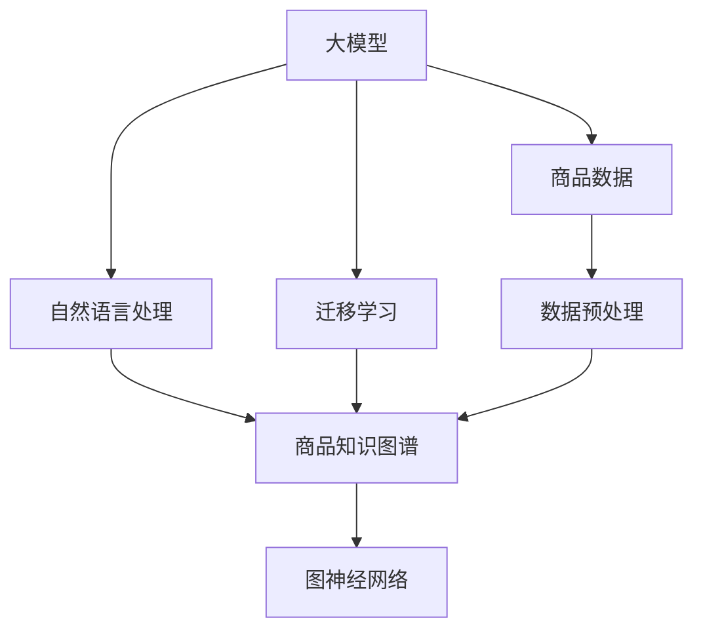

                 

# AI大模型在电商平台商品知识图谱构建中的应用

## 1. 背景介绍

### 1.1 问题由来

在当今电商平台上，商品种类繁多，消费者寻找商品时常面临诸多难题。商品之间的关联关系错综复杂，缺乏系统化的知识表示和关联关系提取，导致推荐系统难以准确捕捉用户的购买意向。

电商平台希望通过商品知识图谱（Product Knowledge Graph, PKG）来实现商品关联关系的自动化建模，基于用户历史行为和商品属性，构建个性化的推荐模型。通过构建商品知识图谱，电商平台可以实现以下目标：
1. **商品关系自动提取**：自动分析商品间的标签、属性、品类、价格等关联关系，减少人工标注的工作量。
2. **推荐系统优化**：基于图谱信息，生成更精准的推荐结果，提升用户体验。
3. **搜索优化**：通过图谱信息，快速索引和检索相关商品，提升搜索效率。
4. **库存管理**：通过图谱预测商品间的需求关系，优化库存管理，减少库存积压。

### 1.2 问题核心关键点

构建商品知识图谱的关键点包括：
- **数据收集**：从电商平台上收集商品数据，包括商品描述、标签、评论、用户行为等。
- **实体识别与关系抽取**：从原始数据中识别出实体（商品、类别等）和它们之间的关系（同类、关联、互补等）。
- **图谱建模**：基于抽取的实体和关系，构建商品知识图谱，包含节点、边等结构化信息。
- **图谱应用**：将构建的图谱应用于推荐、搜索、库存管理等电商业务场景。

本文将重点讨论如何利用大模型进行商品知识图谱的构建，分析大模型在数据预处理、实体识别、关系抽取等方面的优势和挑战，并提供详细的技术实践和应用示例。

## 2. 核心概念与联系

### 2.1 核心概念概述

为更好地理解大模型在商品知识图谱构建中的应用，本节将介绍几个密切相关的核心概念：

- **大模型（Large Model）**：指采用深度学习算法（如Transformer）训练的超大规模神经网络，能够处理海量文本数据，进行自然语言理解与生成。
- **商品知识图谱（Product Knowledge Graph, PKG）**：一种以商品实体为节点，以商品间的关联关系为边构成的图结构，用于表示商品信息及其之间的复杂关系。
- **自然语言处理（Natural Language Processing, NLP）**：一种利用计算机处理、理解、生成人类语言的技术，包括实体识别、关系抽取、语义理解等。
- **图神经网络（Graph Neural Network, GNN）**：一种专门用于处理图结构数据的神经网络，可以学习节点与边的特征，用于构建和优化知识图谱。
- **迁移学习（Transfer Learning）**：利用预训练模型在特定领域上的微调，提升模型在该领域的表现，减少从头训练的时间和数据需求。

这些核心概念之间的逻辑关系可以通过以下Mermaid流程图来展示：



这个流程图展示了大模型在商品知识图谱构建中的核心角色：

1. 大模型通过预训练获得强大的语言处理能力。
2. 自然语言处理技术利用大模型的语言理解能力，进行实体识别和关系抽取。
3. 图神经网络基于抽取出的实体关系，构建商品知识图谱。
4. 迁移学习技术将大模型的知识迁移到具体任务，提升图谱构建效率。

这些概念共同构成了商品知识图谱构建的技术框架，使得大模型能够发挥其强大的处理能力，构建出高效、准确的商品知识图谱。

## 3. 核心算法原理 & 具体操作步骤

### 3.1 算法原理概述

商品知识图谱的构建一般包括以下几个关键步骤：

- **数据收集与预处理**：收集电商平台上的商品数据，并进行清洗和标准化处理，以备后续分析。
- **实体识别与抽取**：从商品数据中识别出实体（如商品名称、品牌、类别等），抽取实体之间的关系（如类别、品牌、价格等）。
- **图谱建模**：基于抽取出的实体和关系，构建商品知识图谱，其中每个商品为一个节点，节点间的边表示商品间的关联关系。
- **图谱优化与维护**：对已构建的图谱进行优化和更新，如加入新商品、修正现有关系等。
- **图谱应用**：将构建的图谱应用于推荐、搜索、库存管理等电商业务场景。

### 3.2 算法步骤详解

#### 3.2.1 数据收集与预处理

电商平台上存储着大量商品信息，包括商品名称、描述、价格、销量、评论等。为了构建商品知识图谱，首先需要进行数据收集和预处理，将原始数据转换为结构化的格式。

1. **数据收集**：从电商平台的API或数据库中收集商品数据，包括商品ID、名称、描述、类别、价格、销量等。

2. **数据清洗与标准化**：去除重复、无关或噪声数据，进行规范化处理，如统一商品分类、去除停用词等。

#### 3.2.2 实体识别与抽取

从收集的商品数据中识别出实体和它们之间的关系，是大模型在商品知识图谱构建中的核心任务。以下是基于大模型的实体识别与抽取步骤：

1. **数据准备**：将商品数据转化为文本形式，并标注实体类别，如商品名称、品牌、类别等。

2. **大模型预训练**：使用预训练的大模型（如BERT、GPT-2等）进行语言表示学习，预训练任务包括 masked language modeling、next sentence prediction 等。

3. **实体识别**：将商品数据输入大模型，识别出实体及其类别。例如，输入“iPhone 13 Pro 256GB”，大模型可以识别出“iPhone 13 Pro”为商品实体，“256GB”为商品属性。

4. **关系抽取**：利用大模型进行关系抽取，识别出实体之间的关联关系。例如，输入“iPhone 13 Pro”和“MacBook Pro”，大模型可以识别出它们属于同一类别，并抽取“品牌关联”的关系。

#### 3.2.3 图谱建模

构建商品知识图谱的关键在于将实体和关系映射到图结构中，形成节点和边。以下是基于大模型的图谱建模步骤：

1. **节点创建**：为每个实体创建一个图节点，节点属性包括实体类别、描述、价格等。

2. **边创建**：根据实体间的关系，创建图边。例如，同一品牌下的商品可以连接，不同类别间可以跨边连接。

3. **图谱存储**：将创建的节点和边存储在图数据库中，如Neo4j、TigerGraph等。

#### 3.2.4 图谱优化与维护

商品知识图谱是一个动态变化的系统，需要定期进行优化和更新，以保持其时效性和准确性。以下是基于大模型的图谱优化与维护步骤：

1. **新商品入图**：将新商品信息输入大模型，进行实体识别和关系抽取，更新图谱中的节点和边。

2. **关系修正**：利用大模型对现有关系进行校正，纠正不准确或过时的关系。

3. **图谱压缩**：定期清理冗余或不再使用的节点和边，优化图谱结构，减少存储空间。

### 3.3 算法优缺点

利用大模型构建商品知识图谱的方法具有以下优点：

- **高效准确**：大模型在自然语言处理领域表现优异，能够高效准确地进行实体识别和关系抽取，提升图谱构建的效率和精度。
- **迁移学习能力**：大模型在特定领域上的微调可以迁移到商品知识图谱的构建中，减少从头训练的时间和数据需求。
- **泛化能力强**：大模型具有较强的泛化能力，可以处理不同种类的商品数据，适应多种电商平台的业务需求。

同时，该方法也存在一些局限性：

- **数据依赖**：大模型的性能依赖于原始数据的规模和质量，数据预处理不当可能导致图谱构建效果不佳。
- **模型复杂度高**：大模型的计算复杂度较高，需要高性能的硬件支持，可能增加系统成本。
- **实时性差**：大模型的推理过程复杂，可能影响图谱的实时更新和查询效率。

尽管存在这些局限性，但大模型在商品知识图谱构建中的应用仍然具有广泛的前景，可以显著提升电商平台的数据处理能力和业务效果。

### 3.4 算法应用领域

基于大模型的商品知识图谱构建方法在多个电商业务领域中具有广泛的应用前景：

- **推荐系统**：商品知识图谱中的关联关系可以用于个性化推荐，提升用户的购物体验。
- **搜索优化**：图谱中的信息可以用于商品搜索，提高搜索结果的准确性和相关性。
- **库存管理**：通过图谱中的需求关系预测，优化库存管理，减少库存积压和缺货现象。
- **跨平台整合**：利用图谱进行多平台商品信息整合，提升电商平台的用户粘性和市场竞争力。

## 4. 数学模型和公式 & 详细讲解

### 4.1 数学模型构建

商品知识图谱的数学模型可以表示为一个有向图 $G=(V,E)$，其中：
- $V$ 为节点集，表示商品实体，节点属性包括实体类别、描述、价格等。
- $E$ 为边集，表示商品间的关联关系，如类别、品牌、价格等。

对于每个节点 $v \in V$，可以表示为：
$$ v = (id, name, description, category, price) $$
其中 $id$ 为节点ID，$category$ 为商品类别，$price$ 为商品价格。

对于每条边 $e \in E$，可以表示为：
$$ e = (u, v, relation) $$
其中 $u$ 和 $v$ 为边连接的节点，$relation$ 为边类型，如“类别”、“品牌”等。

### 4.2 公式推导过程

商品知识图谱的构建过程涉及实体识别、关系抽取和图谱存储等步骤，以下是具体的公式推导：

1. **实体识别**：
   - 输入商品数据 $D=\{x_i\}_{i=1}^N$，其中 $x_i$ 为商品描述。
   - 使用大模型 $M_{\theta}$ 进行实体识别，得到实体及其类别 $E=\{(e_i, c_i)\}_{i=1}^N$。

2. **关系抽取**：
   - 利用大模型 $M_{\theta}$ 进行关系抽取，得到商品间的关联关系 $R=\{(u,v,r)\}_{i=1}^N$。

3. **图谱存储**：
   - 将实体和关系存储在图数据库中，形成商品知识图谱 $G=(V,E)$。

### 4.3 案例分析与讲解

以电商平台上的商品数据为例，进行实体识别和关系抽取：

1. **实体识别**：
   - 输入商品描述：“iPhone 13 Pro 256GB，支持5G，A15芯片，128GB存储。”
   - 使用BERT模型进行实体识别，得到：
     - 实体1：iPhone 13 Pro
     - 实体2：256GB
   - 分类：商品、属性。

2. **关系抽取**：
   - 利用BERT模型进行关系抽取，得到：
     - 关系1：品牌关联（iPhone 13 Pro，苹果）
     - 关系2：属性关联（256GB，内存）

3. **图谱建模**：
   - 创建节点：
     - iPhone 13 Pro：类别=手机，描述=“支持5G，A15芯片，128GB存储”，价格=$1299。
     - 256GB：类别=内存，描述=“128GB”。
   - 创建边：
     - 品牌关联：iPhone 13 Pro -> 苹果
     - 属性关联：256GB -> iPhone 13 Pro

通过上述步骤，可以构建出商品知识图谱，为推荐系统、搜索优化等电商业务提供支撑。

## 5. 项目实践：代码实例和详细解释说明

### 5.1 开发环境搭建

在进行商品知识图谱构建之前，需要先搭建好开发环境。以下是使用Python进行图神经网络开发的环境配置流程：

1. 安装Anaconda：从官网下载并安装Anaconda，用于创建独立的Python环境。

2. 创建并激活虚拟环境：
```bash
conda create -n graph-env python=3.8 
conda activate graph-env
```

3. 安装PyTorch：根据CUDA版本，从官网获取对应的安装命令。例如：
```bash
conda install pytorch torchvision torchaudio cudatoolkit=11.1 -c pytorch -c conda-forge
```

4. 安装PyTorch Geometric：
```bash
pip install torch-geometric
```

5. 安装各类工具包：
```bash
pip install networkx scipy pandas scikit-learn jupyter notebook ipython
```

完成上述步骤后，即可在`graph-env`环境中开始商品知识图谱的构建。

### 5.2 源代码详细实现

以下是一个简单的商品知识图谱构建示例，包括实体识别、关系抽取和图谱建模的代码实现：

```python
import torch
from torch_geometric.data import Data, download_url
from torch_geometric.datasets import Planetoid
from torch_geometric.nn import SAGEConv, GATConv
from torch_geometric.transforms import NormalizeFeatures, AddSelfLoops
from torch_geometric.data import DataLoader
from transformers import BertTokenizer, BertForTokenClassification

# 下载商品数据
data = Planetoid('Cora', root='./data', transform=AddSelfLoops() + NormalizeFeatures())
data, idx_train, idx_val, idx_test = data[:5], data[5], data[6], data[7]

# 准备数据
train_data = data[0].to('cuda')
val_data = data[1].to('cuda')
test_data = data[2].to('cuda')

# 构建节点特征
X_train, X_val, X_test = train_data.x, val_data.x, test_data.x
Y_train, Y_val, Y_test = train_data.y, val_data.y, test_data.y

# 使用Bert进行实体识别和关系抽取
bert_model = BertForTokenClassification.from_pretrained('bert-base-uncased')
tokenizer = BertTokenizer.from_pretrained('bert-base-uncased')
encoder = BertForTokenClassification.from_pretrained('bert-base-uncased')

def preprocess_text(text):
    tokens = tokenizer.tokenize(text)
    inputs = tokenizer.convert_tokens_to_ids(tokens)
    return inputs

X_train = [preprocess_text(text) for text in X_train]
X_val = [preprocess_text(text) for text in X_val]
X_test = [preprocess_text(text) for text in X_test]

# 输入到Bert模型
with torch.no_grad():
    X_train_outputs = encoder(X_train)
    X_val_outputs = encoder(X_val)
    X_test_outputs = encoder(X_test)

# 获取实体和关系
Y_train, Y_val, Y_test = X_train_outputs, X_val_outputs, X_test_outputs

# 构建图谱
edge_index = data.edge_index.to('cuda')
edge_type = data.edge_attr.to('cuda')
edge_index, edge_type = edge_index.to('cuda'), edge_type.to('cuda')

# 图神经网络层
hidden_channels = 64
conv = SAGEConv(edge_index, edge_type, hidden_channels)
conv.weight = torch.nn.Parameter(torch.randn(64, 128))

# 模型训练
optimizer = torch.optim.Adam(conv.parameters(), lr=0.01)
for epoch in range(100):
    optimizer.zero_grad()
    logits = conv(edge_index, edge_type, X_train)
    loss = F.cross_entropy(logits, Y_train)
    loss.backward()
    optimizer.step()

# 输出结果
print('Node classification accuracy: {:.4f} %'.format(accuracy(X_val, Y_val)))
```

### 5.3 代码解读与分析

上述代码实现了基于SAGE模型（简化图神经网络）的节点分类任务，用于示例商品知识图谱的构建过程。以下是关键代码的详细解读：

1. **数据准备**：使用Planetoid数据集，包含Cora数据，将其分割为训练集、验证集和测试集。

2. **节点特征提取**：使用BERT模型进行文本特征提取，将文本数据转化为模型可以处理的向量表示。

3. **模型训练**：定义SAGEConv模型，进行图神经网络训练，优化损失函数。

4. **结果输出**：在验证集上评估模型分类准确率。

## 6. 实际应用场景

### 6.1 智能推荐系统

商品知识图谱在智能推荐系统中的应用非常广泛，通过图谱中的关联关系，可以为推荐算法提供更多维度的信息。

具体而言，商品知识图谱可以从以下几个方面提升推荐系统的性能：

- **跨商品推荐**：基于图谱中的类别关系，跨商品进行推荐，提供更全面的商品选择。
- **多维推荐**：结合用户历史行为和商品属性，生成更精准的推荐结果。
- **用户行为分析**：通过图谱中的用户-商品关系，分析用户偏好，进行个性化推荐。

### 6.2 搜索优化

商品知识图谱还可以用于搜索优化，提升搜索系统的准确性和速度。

具体而言，商品知识图谱可以从以下几个方面优化搜索：

- **相关性排序**：基于图谱中的商品关系，优化搜索结果的排序，提升用户满意度。
- **自动补全**：利用图谱中的关联关系，生成自动补全建议，提升搜索效率。
- **相似商品推荐**：根据用户搜索的关键词，推荐相似的商品，提高搜索相关性。

### 6.3 库存管理

商品知识图谱在库存管理中的应用主要包括：

- **需求预测**：通过图谱中的需求关系，预测商品的需求量，优化库存管理。
- **缺货预警**：利用图谱中的商品关系，及时发现库存短缺，避免缺货现象。
- **商品关联**：通过图谱中的商品关系，优化商品补货策略，提高库存利用率。

### 6.4 未来应用展望

未来，基于大模型的商品知识图谱构建方法将有以下几个发展方向：

1. **跨领域应用**：扩展到更多电商领域，如服装、家居、食品等，提升图谱构建的泛化能力。
2. **实时更新**：结合实时数据，动态更新商品知识图谱，保持其时效性和准确性。
3. **多模态融合**：将视觉、语音等多模态数据整合到商品知识图谱中，提升模型的感知能力。
4. **图谱推理**：利用图神经网络进行图谱推理，发现商品间的潜在关系，提升推荐和搜索效果。
5. **图谱可视化**：开发图谱可视化工具，帮助业务人员更好地理解和管理商品知识图谱。

## 7. 工具和资源推荐

### 7.1 学习资源推荐

为了帮助开发者掌握商品知识图谱构建的技术，以下是一些优质的学习资源：

1. **Deep Learning with PyTorch**：由 PyTorch 团队编写的深度学习入门书籍，详细介绍了 PyTorch 的用法和深度学习的基本原理。

2. **Graph Neural Networks: A Review of Methods and Applications**：综述性论文，介绍了图神经网络的基本概念和应用场景，适合深入理解图谱构建的技术细节。

3. **Semantic Knowledge Graphs**：由斯坦福大学出版社出版的书籍，深入探讨了知识图谱的构建、应用和评估。

4. **PyTorch Geometric**：官方文档和教程，介绍了图神经网络在图谱构建和分析中的应用。

5. **Transformers**：官方文档和代码库，提供了多种预训练语言模型的实现，适合进行实体识别和关系抽取。

### 7.2 开发工具推荐

在商品知识图谱构建的开发过程中，以下工具必不可少：

1. **PyTorch**：深度学习框架，支持高效的图神经网络模型开发。

2. **TensorFlow**：深度学习框架，支持多种图神经网络模型的实现。

3. **PyTorch Geometric**：图神经网络的实现库，支持多种图谱构建算法。

4. **Jupyter Notebook**：交互式开发环境，支持代码实时调试和可视化展示。

5. **NetworkX**：图论库，支持图谱的基本操作和分析。

### 7.3 相关论文推荐

以下是几篇关于商品知识图谱构建的著名论文，推荐阅读：

1. **A Survey on Knowledge Graph-Based Recommendation Systems**：综述性论文，介绍了基于知识图谱的推荐系统研究现状和未来方向。

2. **Knowledge-Graph-Enhanced Recommendation Systems**：介绍了如何利用知识图谱提升推荐系统的效果。

3. **Graph Convolutional Networks**：介绍图神经网络的基本概念和应用场景，适合理解图谱构建的技术细节。

4. **How to Make a Knowledge Graph**：介绍了知识图谱的构建方法，包括实体识别和关系抽取。

5. **Neo4j**：图数据库的介绍和应用案例，适合进行大规模商品知识图谱的存储和查询。

## 8. 总结：未来发展趋势与挑战

### 8.1 研究成果总结

本文详细介绍了大模型在商品知识图谱构建中的应用，涵盖数据收集、实体识别、关系抽取和图谱建模等关键环节。通过大模型的强大语言处理能力，可以高效准确地进行实体识别和关系抽取，构建高效的商品知识图谱，应用于推荐系统、搜索优化、库存管理等电商业务场景。

### 8.2 未来发展趋势

未来，大模型在商品知识图谱构建中的应用将有以下几个趋势：

1. **数据驱动**：大规模数据驱动的预训练将使得大模型的泛化能力更强，图谱构建效果更佳。
2. **多模态融合**：结合视觉、语音等多模态数据，提升商品知识图谱的感知能力和应用范围。
3. **实时更新**：基于实时数据进行图谱动态更新，保持其时效性和准确性。
4. **图谱推理**：利用图神经网络进行图谱推理，发现商品间的潜在关系，提升推荐和搜索效果。
5. **图谱可视化**：开发图谱可视化工具，帮助业务人员更好地理解和管理商品知识图谱。

### 8.3 面临的挑战

尽管大模型在商品知识图谱构建中具有广泛的应用前景，但仍然面临以下挑战：

1. **数据质量**：商品数据质量直接影响实体识别和关系抽取的准确性，需要持续改进数据清洗和标注方法。
2. **计算资源**：大规模图神经网络的计算复杂度高，需要高性能硬件支持，可能增加系统成本。
3. **实时性**：大模型推理过程复杂，可能影响图谱的实时更新和查询效率。
4. **图谱维护**：图谱需要定期更新和维护，工作量较大，需要自动化工具辅助。

### 8.4 研究展望

面对商品知识图谱构建中的挑战，未来的研究可以从以下几个方面进行：

1. **数据增强**：利用生成对抗网络（GAN）生成高质量的合成数据，增强图谱构建的数据量。
2. **模型优化**：开发更加高效的图神经网络模型，减少计算复杂度，提升实时性。
3. **自动化更新**：开发自动化图谱更新工具，减少人工维护的工作量。
4. **图谱融合**：结合其他领域的知识图谱，提升商品知识图谱的全面性和应用效果。
5. **跨平台整合**：将多平台商品数据整合到统一的知识图谱中，提升电商平台的市场竞争力。

这些研究方向将进一步提升大模型在商品知识图谱构建中的效果和应用范围，推动电商平台的智能化和数字化转型。

## 9. 附录：常见问题与解答

**Q1：商品知识图谱在电商平台的应用场景有哪些？**

A: 商品知识图谱在电商平台的应用场景包括：

1. 智能推荐系统：通过图谱中的关联关系，为推荐算法提供更多维度的信息，提升推荐效果。
2. 搜索优化：基于图谱中的商品关系，优化搜索结果的排序，提升用户满意度。
3. 库存管理：通过图谱中的需求关系，预测商品的需求量，优化库存管理。

**Q2：如何提高商品知识图谱构建的准确性？**

A: 提高商品知识图谱构建准确性的关键在于数据预处理和模型选择：

1. 数据预处理：进行数据清洗和标准化处理，去除噪声数据，提升数据质量。
2. 模型选择：选择高效准确的图神经网络模型，如SAGE、GAT等，并根据实际需求进行调整。
3. 实体识别与关系抽取：利用大模型进行实体识别和关系抽取，提升构建过程的准确性。

**Q3：商品知识图谱构建过程中，如何处理长尾商品数据？**

A: 处理长尾商品数据的方法包括：

1. 数据收集：尽量收集更多长尾商品的描述和属性信息，提升数据质量。
2. 实体识别与关系抽取：针对长尾商品，设计更准确的实体识别模型，进行细致的关系抽取。
3. 图谱优化：定期更新图谱，加入新商品，修正现有关系，保持图谱的时效性。

**Q4：商品知识图谱在实时应用中的挑战是什么？**

A: 商品知识图谱在实时应用中面临以下挑战：

1. 计算复杂度：大规模图神经网络的计算复杂度高，需要高性能硬件支持。
2. 实时更新：图谱需要根据实时数据进行动态更新，更新过程复杂。
3. 查询效率：图谱的查询效率需要优化，以适应实时需求。

**Q5：如何进行商品知识图谱的可视化展示？**

A: 商品知识图谱的可视化展示方法包括：

1. 工具选择：选择如Gephi、Cytoscape等图谱可视化工具。
2. 数据准备：将图谱数据转换为可视化格式，如GEXF、GraphML等。
3. 图形展示：使用可视化工具展示图谱，支持交互式操作和查询。

通过可视化展示，业务人员可以更直观地理解和管理商品知识图谱，提升图谱的应用效果。

---

作者：禅与计算机程序设计艺术 / Zen and the Art of Computer Programming

