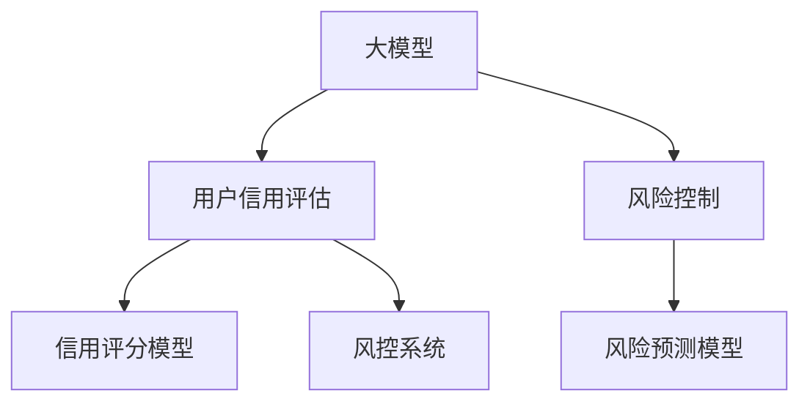

                 

# AI大模型在电商平台用户信用评估与风险控制中的作用

> 关键词：AI大模型,用户信用评估,风险控制,电商平台,深度学习,自然语言处理,NLP,信用评分模型,风险预测模型,风控系统

## 1. 背景介绍

### 1.1 问题由来

在当今数字化时代，电商平台已经成为了人们日常生活和商业活动的重要组成部分。随着电商平台的快速发展，用户数量持续增长，随之而来的用户信用评估与风险控制问题也愈发显著。如何准确、高效地评估用户的信用等级，并有效地进行风险控制，是电商平台亟待解决的关键问题。

传统的信用评估和风险控制方法，如基于规则的信用评分模型，往往依赖于人工设计的规则，难以应对快速变化的业务场景和数据。而大数据技术和大模型技术的兴起，为电商平台的信用评估和风险控制提供了全新的解决方案。

### 1.2 问题核心关键点

大模型技术在信用评估与风险控制中的应用，关键在于利用大模型的强大学习和泛化能力，从大量历史数据中学习用户的信用特征和行为规律。与传统规则引擎不同，大模型可以自动发现和利用数据中的隐含关系，提升评估和控制的效果。

具体而言，大模型在信用评估与风险控制中的应用主要体现在以下几个方面：
1. 数据处理：利用大模型的自监督学习能力，从原始数据中自动提取有用的特征，减少对手工特征工程的依赖。
2. 模型构建：使用大模型作为特征提取器，构建适用于电商平台的信用评分和风险预测模型。
3. 动态更新：通过持续学习新数据，大模型能够自动更新和优化，保持模型的实时性和适应性。

### 1.3 问题研究意义

电商平台的信用评估与风险控制，直接影响到平台的用户体验、商业信誉和交易安全性。利用大模型技术，可以更高效、精准地进行用户信用评估与风险控制，保障平台和用户的利益。

具体而言，大模型在信用评估与风险控制中的应用具有以下几方面的意义：
1. 提升用户体验：通过精准的用户信用评估，提供个性化的服务和推荐，提升用户的购物体验。
2. 保障交易安全：通过准确的风险预测，识别潜在欺诈行为，保护平台和用户的资产安全。
3. 优化商业决策：利用大模型预测用户行为和市场趋势，帮助电商平台优化业务策略和资源配置。
4. 促进金融创新：结合大模型和金融科技，推动电商平台的金融服务创新，扩展商业模式和盈利渠道。

## 2. 核心概念与联系

### 2.1 核心概念概述

为更好地理解大模型在电商平台用户信用评估与风险控制中的应用，本节将介绍几个关键概念及其相互联系：

- **大模型**：指基于深度学习技术训练的大型神经网络模型，如BERT、GPT等。通过在大型语料库上进行预训练，大模型具备强大的语言理解和生成能力。
- **用户信用评估**：指对电商平台用户的行为数据进行分析和评估，以确定用户的信用等级。高信用等级用户可以享受更多的优惠和服务，而低信用等级用户则需要承担更高的风险。
- **风险控制**：指通过评估和监控用户行为，识别和防止潜在的欺诈、违约等风险行为，保障平台和用户的安全。
- **深度学习**：一种基于神经网络结构的机器学习方法，通过多层非线性变换，自动从数据中学习特征和模式。
- **自然语言处理(NLP)**：指使用计算机处理、理解和生成人类语言的技术，涉及文本分类、命名实体识别、情感分析等多种任务。
- **信用评分模型**：通过机器学习算法，对用户的历史行为数据进行分析，预测其未来的信用风险，生成信用评分。
- **风险预测模型**：利用机器学习算法，对用户的交易行为进行监控，预测潜在的欺诈或违约风险，提供风险预警。
- **风控系统**：将信用评分和风险预测模型集成到电商平台中，实现对用户行为的全流程监控和风险控制。

这些概念之间的逻辑关系可以通过以下Mermaid流程图来展示：



该流程图展示了大模型在电商平台用户信用评估与风险控制中的应用框架：大模型通过自监督预训练，提取用户行为特征，用于构建信用评分和风险预测模型，并通过风控系统实时监控和控制风险，最终提升用户体验和平台安全性。

## 3. 核心算法原理 & 具体操作步骤

### 3.1 算法原理概述

大模型在电商平台用户信用评估与风险控制中的应用，主要依赖于深度学习模型和自然语言处理技术。其核心思想是：利用大模型强大的特征提取能力，自动从用户行为数据中学习到丰富的信用特征和风险规律，并通过构建信用评分和风险预测模型，实现对用户信用等级和风险行为的预测和控制。

具体而言，大模型的应用包括以下几个关键步骤：
1. **数据预处理**：清洗、标准化、归一化用户行为数据，确保数据的可用性和一致性。
2. **特征提取**：利用大模型自动提取用户行为的特征，识别和提取有意义的特征信息。
3. **模型训练**：使用预训练模型作为特征提取器，构建适用于电商平台的信用评分和风险预测模型，并进行训练和优化。
4. **风险监控**：在用户进行交易时，利用模型实时预测和监控用户行为，识别潜在的欺诈或违约风险，并进行预警和控制。
5. **模型评估与优化**：定期评估模型的预测效果和准确性，根据新数据进行模型更新和优化，保持模型的实时性和适应性。

### 3.2 算法步骤详解

以下是基于大模型的电商平台用户信用评估与风险控制的主要操作步骤：

**Step 1: 数据预处理**

电商平台的数据来源多样，包括用户浏览记录、交易记录、评价记录等。为了提高模型的训练效果，需要对数据进行清洗和标准化处理。具体步骤如下：
1. 去除无效数据：删除缺失、异常、重复等无效数据。
2. 特征提取：将文本数据转化为数值特征，如TF-IDF、词嵌入等。
3. 数据归一化：对数值特征进行归一化处理，确保数据在模型中的权重一致。
4. 数据划分：将数据划分为训练集、验证集和测试集，确保模型在未知数据上的泛化能力。

**Step 2: 特征提取**

利用大模型强大的特征提取能力，自动从原始数据中提取有用的特征。以下是常用的特征提取方法：
1. BERT特征提取：将用户行为数据转化为BERT序列，提取文本中的语义特征。
2. Transformer特征提取：使用Transformer模型，自动学习用户行为的序列依赖关系。
3. Attention机制特征提取：通过Attention机制，捕捉用户行为中最重要的特征。
4. 时间序列特征提取：利用时间序列模型，提取用户行为的时间依赖关系。

**Step 3: 模型训练**

构建适用于电商平台的信用评分和风险预测模型，并进行训练和优化。以下是常见的模型构建方法：
1. 信用评分模型：使用线性回归、逻辑回归等传统机器学习模型，构建用户信用评分模型。
2. 风险预测模型：使用随机森林、神经网络等机器学习模型，构建用户风险预测模型。
3. 集成模型：将多种模型的预测结果进行集成，提升模型的准确性和鲁棒性。

**Step 4: 风险监控**

在用户进行交易时，利用模型实时预测和监控用户行为，识别潜在的欺诈或违约风险，并进行预警和控制。具体步骤如下：
1. 实时预测：根据用户行为数据，实时预测用户的信用评分和风险等级。
2. 风险预警：根据预测结果，设置风险预警阈值，对高风险用户进行预警。
3. 交易控制：根据风险预警结果，采取交易限制、拒绝交易等措施，控制风险行为。

**Step 5: 模型评估与优化**

定期评估模型的预测效果和准确性，根据新数据进行模型更新和优化，保持模型的实时性和适应性。具体步骤如下：
1. 评估指标：选择适当的评估指标，如AUC、ROC、F1-score等，评估模型的预测效果。
2. 模型调优：根据评估结果，调整模型的参数和结构，提升模型的准确性和泛化能力。
3. 模型迭代：定期收集新数据，重新训练和优化模型，保持模型的实时性和适应性。

### 3.3 算法优缺点

基于大模型的电商平台用户信用评估与风险控制方法，具有以下优点：
1. 自动化特征提取：利用大模型的自监督学习能力，自动从原始数据中提取有用的特征，减少对手工特征工程的依赖。
2. 高泛化能力：大模型能够学习到数据中的隐含关系，提升模型的泛化能力和预测准确性。
3. 实时性：通过实时预测和监控，及时识别和控制风险行为，保障平台和用户的安全。
4. 动态更新：大模型能够持续学习新数据，不断更新和优化模型，保持模型的实时性和适应性。

同时，该方法也存在一定的局限性：
1. 依赖高质量数据：模型的训练效果依赖于高质量的数据，需要花费大量时间和成本进行数据收集和处理。
2. 模型复杂度高：大模型参数量庞大，需要高性能计算资源进行训练和推理，增加了系统复杂度和成本。
3. 数据隐私问题：用户行为数据涉及隐私，需要遵守数据隐私保护法规，确保用户数据的安全。
4. 模型可解释性不足：大模型通常是"黑盒"系统，难以解释其内部工作机制和决策逻辑，可能降低用户信任度。

尽管存在这些局限性，但大模型在电商平台用户信用评估与风险控制中的应用，已经展现出了巨大的潜力和优势，成为电商平台风险控制的重要手段。

### 3.4 算法应用领域

基于大模型的电商平台用户信用评估与风险控制方法，已经被广泛应用于电商平台的多个领域，如：

- **用户信用评估**：利用大模型自动提取用户行为特征，构建用户信用评分模型，准确评估用户信用等级。
- **交易欺诈检测**：利用大模型实时预测用户交易行为，识别潜在的欺诈行为，保障交易安全。
- **违约风险预警**：利用大模型预测用户违约风险，及时进行预警和控制，避免平台损失。
- **信用评分与推荐**：结合大模型和推荐系统，生成个性化的信用评分和推荐结果，提升用户体验。
- **客户流失预警**：利用大模型预测用户流失风险，提前采取措施，降低客户流失率。

除了上述这些典型应用外，大模型还被创新性地应用到更多场景中，如用户行为分析、市场趋势预测、智能客服等，为电商平台的业务发展提供强大的技术支持。

## 4. 数学模型和公式 & 详细讲解  
### 4.1 数学模型构建

本节将使用数学语言对基于大模型的电商平台用户信用评估与风险控制过程进行更加严格的刻画。

记电商平台用户行为数据集为 $D=\{(x_i,y_i)\}_{i=1}^N, x_i \in \mathcal{X}, y_i \in \mathcal{Y}$，其中 $\mathcal{X}$ 为输入特征空间，$\mathcal{Y}$ 为输出标签空间。假设用户信用评分模型为 $M_{\theta}(x)$，其中 $\theta$ 为模型参数。则用户信用评分的经验风险为：

$$
\mathcal{L}(\theta) = \frac{1}{N} \sum_{i=1}^N \ell(M_{\theta}(x_i),y_i)
$$

其中 $\ell$ 为损失函数，用于衡量模型预测与真实标签之间的差异。

风险预测模型的数学模型构建与信用评分模型类似，假设风险预测模型为 $R_{\phi}(x)$，其中 $\phi$ 为模型参数。则风险预测的经验风险为：

$$
\mathcal{L}(\phi) = \frac{1}{N} \sum_{i=1}^N \ell(R_{\phi}(x_i),y_i)
$$

对于风险预测模型，常用的损失函数包括二分类交叉熵损失、对数损失等。

### 4.2 公式推导过程

以信用评分模型为例，假设模型 $M_{\theta}$ 为线性回归模型，即 $M_{\theta}(x) = \theta^Tx$，其中 $\theta \in \mathbb{R}^d$ 为模型参数，$x \in \mathbb{R}^d$ 为输入特征。假设标签 $y \in \{1,0\}$，则二分类交叉熵损失函数为：

$$
\ell(M_{\theta}(x),y) = -y\log M_{\theta}(x) - (1-y)\log (1-M_{\theta}(x))
$$

将其代入经验风险公式，得：

$$
\mathcal{L}(\theta) = -\frac{1}{N}\sum_{i=1}^N [y_i\log M_{\theta}(x_i)+(1-y_i)\log(1-M_{\theta}(x_i))]
$$

根据链式法则，损失函数对参数 $\theta_k$ 的梯度为：

$$
\frac{\partial \mathcal{L}(\theta)}{\partial \theta_k} = -\frac{1}{N}\sum_{i=1}^N (\frac{y_i}{M_{\theta}(x_i)}-\frac{1-y_i}{1-M_{\theta}(x_i)}) x_{ik}
$$

其中 $x_{ik}$ 为输入特征 $x_i$ 的第 $k$ 个特征值。

在得到损失函数的梯度后，即可带入优化算法，完成模型的迭代优化。重复上述过程直至收敛，最终得到适应电商平台用户行为数据的信用评分模型参数 $\theta^*$。

## 5. 项目实践：代码实例和详细解释说明
### 5.1 开发环境搭建

在进行电商平台用户信用评估与风险控制的项目实践前，我们需要准备好开发环境。以下是使用Python进行TensorFlow开发的环境配置流程：

1. 安装Anaconda：从官网下载并安装Anaconda，用于创建独立的Python环境。

2. 创建并激活虚拟环境：
```bash
conda create -n tensorflow-env python=3.8 
conda activate tensorflow-env
```

3. 安装TensorFlow：根据CUDA版本，从官网获取对应的安装命令。例如：
```bash
conda install tensorflow==2.6.0
```

4. 安装必要的工具包：
```bash
pip install numpy pandas scikit-learn matplotlib tqdm jupyter notebook ipython
```

完成上述步骤后，即可在`tensorflow-env`环境中开始项目实践。

### 5.2 源代码详细实现

下面我们以电商平台用户信用评估为例，给出使用TensorFlow进行信用评分模型开发的PyTorch代码实现。

首先，定义模型和损失函数：

```python
import tensorflow as tf
from tensorflow.keras import layers

class CreditScoringModel(tf.keras.Model):
    def __init__(self, input_dim):
        super(CreditScoringModel, self).__init__()
        self.dense1 = layers.Dense(64, activation='relu')
        self.dense2 = layers.Dense(1, activation='sigmoid')

    def call(self, x):
        x = self.dense1(x)
        x = self.dense2(x)
        return x

model = CreditScoringModel(input_dim)
loss = tf.keras.losses.BinaryCrossentropy()

# 定义数据预处理函数
def preprocess_data(data):
    # 数据清洗、标准化、归一化
    # 返回处理后的数据
    pass

# 定义模型训练函数
def train_model(model, loss, optimizer, train_dataset, epochs, batch_size):
    for epoch in range(epochs):
        total_loss = 0.0
        for batch in train_dataset:
            x, y = batch
            with tf.GradientTape() as tape:
                y_pred = model(x)
                loss_value = loss(y_pred, y)
            gradients = tape.gradient(loss_value, model.trainable_variables)
            optimizer.apply_gradients(zip(gradients, model.trainable_variables))
            total_loss += loss_value
        print(f"Epoch {epoch+1}, loss: {total_loss/N}")
```

然后，准备训练数据和测试数据：

```python
# 定义训练数据集
train_dataset = tf.data.Dataset.from_tensor_slices((train_features, train_labels))
train_dataset = train_dataset.shuffle(buffer_size=10000).batch(batch_size)

# 定义测试数据集
test_dataset = tf.data.Dataset.from_tensor_slices((test_features, test_labels))
test_dataset = test_dataset.batch(batch_size)

# 定义预处理函数
def preprocess_data(data):
    # 数据清洗、标准化、归一化
    # 返回处理后的数据
    pass
```

最后，启动模型训练：

```python
# 定义超参数
epochs = 100
batch_size = 128

# 加载数据并进行预处理
train_features, train_labels = preprocess_data(train_data)
test_features, test_labels = preprocess_data(test_data)

# 训练模型
optimizer = tf.keras.optimizers.Adam(learning_rate=0.001)
train_model(model, loss, optimizer, train_dataset, epochs, batch_size)

# 评估模型
test_loss = loss(model(test_features), test_labels)
print(f"Test loss: {test_loss}")
```

以上就是使用TensorFlow进行电商平台用户信用评估的完整代码实现。可以看到，TensorFlow提供了一整套简单易用的API，可以方便地进行模型构建、训练和评估。

### 5.3 代码解读与分析

让我们再详细解读一下关键代码的实现细节：

**CreditScoringModel类**：
- `__init__`方法：初始化模型结构，包括输入层、隐藏层和输出层。
- `call`方法：定义模型的前向传播过程，输入数据通过两个全连接层进行特征提取和输出。

**train_model函数**：
- 使用TensorFlow的Data API加载训练数据集和测试数据集。
- 对数据进行批次化处理，支持高效的训练。
- 在每个epoch内，对每个批次数据进行前向传播和反向传播，更新模型参数。
- 打印每个epoch的平均损失，评估模型训练效果。

**preprocess_data函数**：
- 定义数据的预处理函数，包括数据清洗、标准化、归一化等操作，确保数据在模型中的可用性和一致性。

通过以上代码，可以看出使用TensorFlow进行电商平台的信用评分模型的实现相对简单，开发者可以专注于模型的训练和优化，而不必过多关注底层实现细节。

## 6. 实际应用场景

### 6.1 智能客服系统

电商平台智能客服系统通过大模型进行用户信用评估与风险控制，可以提供更加精准和个性化的服务。智能客服系统通过收集用户的浏览、购买、评价等行为数据，构建用户信用评分模型，实时评估用户的信用等级和风险行为，从而提供个性化的服务和推荐，提升用户满意度。

例如，当用户进行下单时，智能客服系统可以根据用户的历史行为数据，实时评估用户的信用等级，判断是否进行交易。对于信用等级较高的用户，系统可以提供优惠服务和快速结算；对于信用等级较低的用户，系统可以提示用户进行风险提示，建议其提供担保或延迟交易。

### 6.2 金融产品推荐

电商平台金融产品推荐系统通过大模型进行用户信用评估与风险控制，可以精准匹配用户的金融需求，推荐合适的金融产品。金融产品推荐系统通过收集用户的交易记录、评价记录等行为数据，构建用户信用评分模型，评估用户的信用等级和风险行为，从而推荐适合的金融产品。

例如，当用户浏览金融产品页面时，系统可以根据用户的历史行为数据，实时评估用户的信用等级，推荐适合的金融产品。对于信用等级较高的用户，系统可以推荐高收益的金融产品；对于信用等级较低的用户，系统可以推荐风险较低的金融产品，避免用户因过度投资而承担过高的风险。

### 6.3 客户流失预警

电商平台客户流失预警系统通过大模型进行用户信用评估与风险控制，可以及时发现并挽留流失用户。客户流失预警系统通过收集用户的购物频率、交易金额、评价反馈等行为数据，构建用户信用评分模型，实时评估用户的流失风险，从而及时采取挽留措施。

例如，当用户长时间未进行购物行为时，系统可以实时评估用户的流失风险，通过发送优惠券、推荐商品等方式，吸引用户重新购物。对于流失风险较高的用户，系统可以采用更积极的挽留策略，如直接联系用户、提供专享服务等。

### 6.4 未来应用展望

随着大模型技术的发展，未来电商平台用户信用评估与风险控制将呈现出以下几个趋势：

1. **多模态融合**：未来电商平台将更多地融合语音、图像、视频等多种模态数据，构建多模态信用评分和风险预测模型，提升模型的准确性和鲁棒性。
2. **实时性增强**：随着计算资源的提升，未来电商平台将更多地利用实时数据进行信用评估与风险控制，提供更加实时和精准的服务。
3. **模型可解释性**：未来电商平台将更加关注模型的可解释性，通过因果推断、解释模型等方法，增强用户对模型输出的理解和信任。
4. **跨领域应用**：未来电商平台将更多地将大模型技术应用于其他垂直行业，如金融、医疗、教育等，拓展大模型技术的应用边界。
5. **隐私保护**：未来电商平台将更加注重用户数据隐私保护，通过差分隐私、联邦学习等技术，保护用户数据的安全。

这些趋势将进一步推动大模型技术在电商平台的应用和发展，为电商平台提供更高效、更精准、更安全的信用评估与风险控制服务。

## 7. 工具和资源推荐
### 7.1 学习资源推荐

为了帮助开发者系统掌握大模型在电商平台用户信用评估与风险控制中的应用，这里推荐一些优质的学习资源：

1. 《深度学习基础》课程：由斯坦福大学开设的深度学习基础课程，系统讲解深度学习的基本概念和经典模型。

2. TensorFlow官方文档：TensorFlow官方文档，提供丰富的API文档和教程，是快速上手TensorFlow的好资源。

3. PyTorch官方文档：PyTorch官方文档，提供详细的API文档和教程，是深度学习开发者常用的工具库。

4. HuggingFace官方文档：HuggingFace官方文档，提供丰富的预训练模型和微调样例代码，是进行自然语言处理任务开发的必备资源。

5. Kaggle竞赛：Kaggle平台上的机器学习竞赛，涵盖各种NLP和金融领域的任务，提供了大量的数据集和模型样例，帮助开发者实践大模型技术。

通过对这些资源的学习实践，相信你一定能够快速掌握大模型在电商平台用户信用评估与风险控制中的应用，并用于解决实际的电商问题。

### 7.2 开发工具推荐

高效的开发离不开优秀的工具支持。以下是几款用于电商平台用户信用评估与风险控制开发的常用工具：

1. TensorFlow：由Google主导开发的开源深度学习框架，生产部署方便，适合大规模工程应用。提供丰富的API和工具，支持深度学习模型的训练和推理。

2. PyTorch：基于Python的开源深度学习框架，灵活动态的计算图，适合快速迭代研究。提供丰富的预训练模型和工具，支持深度学习模型的训练和推理。

3. Scikit-learn：基于Python的机器学习库，提供丰富的算法和工具，支持传统机器学习模型的训练和评估。

4. Jupyter Notebook：交互式Python开发环境，支持代码编写、数据处理、模型训练等全流程开发，方便开发者进行快速迭代和实验。

5. Weights & Biases：模型训练的实验跟踪工具，可以记录和可视化模型训练过程中的各项指标，方便对比和调优。

6. Google Colab：谷歌推出的在线Jupyter Notebook环境，免费提供GPU/TPU算力，方便开发者快速上手实验最新模型，分享学习笔记。

合理利用这些工具，可以显著提升电商平台的信用评估与风险控制任务的开发效率，加快创新迭代的步伐。

### 7.3 相关论文推荐

大模型在电商平台用户信用评估与风险控制的应用，已经引起了学界的广泛关注。以下是几篇奠基性的相关论文，推荐阅读：

1. Attention is All You Need：提出Transformer结构，开启NLP领域的预训练大模型时代。

2. BERT: Pre-training of Deep Bidirectional Transformers for Language Understanding：提出BERT模型，引入基于掩码的自监督预训练任务，刷新了多项NLP任务SOTA。

3. Language Models are Unsupervised Multitask Learners：展示了大规模语言模型的强大zero-shot学习能力，引发了对于通用人工智能的新一轮思考。

4. Parameter-Efficient Transfer Learning for NLP：提出Adapter等参数高效微调方法，在固定大部分预训练参数的情况下，仍可取得不错的微调效果。

5. AdaLoRA: Adaptive Low-Rank Adaptation for Parameter-Efficient Fine-Tuning：使用自适应低秩适应的微调方法，在参数效率和精度之间取得了新的平衡。

这些论文代表了大模型在电商平台用户信用评估与风险控制的应用基础，通过学习这些前沿成果，可以帮助研究者把握学科前进方向，激发更多的创新灵感。

## 8. 总结：未来发展趋势与挑战

### 8.1 研究成果总结

本文对大模型在电商平台用户信用评估与风险控制中的应用进行了系统介绍。首先阐述了大模型在电商平台用户信用评估与风险控制中的应用背景和意义，明确了用户信用评估与风险控制的实际需求和挑战。其次，从原理到实践，详细讲解了基于大模型的电商平台用户信用评估与风险控制的数学模型和关键步骤，给出了电商平台信用评分模型的完整代码实现。同时，本文还广泛探讨了大模型在电商平台的应用场景，展示了其广阔的应用前景。

通过本文的系统梳理，可以看到，大模型在电商平台用户信用评估与风险控制中的应用，已经展现出了巨大的潜力和优势，成为电商平台风险控制的重要手段。未来，随着大模型技术的不断发展和优化，其在电商平台中的应用将更加广泛和深入。

### 8.2 未来发展趋势

展望未来，大模型在电商平台用户信用评估与风险控制中的应用将呈现以下几个发展趋势：

1. **数据规模增大**：随着电商平台的快速发展，用户数据规模持续增大，大模型将从更大规模的数据中学习到更加丰富的信用特征和行为规律。

2. **模型结构优化**：未来将更多地采用先进的深度学习架构，如Transformer、BERT等，提升模型的精度和泛化能力。

3. **动态更新机制**：未来将采用更加灵活的动态更新机制，及时利用新数据进行模型更新，保持模型的实时性和适应性。

4. **多模态融合**：未来将更多地融合语音、图像、视频等多种模态数据，构建多模态信用评分和风险预测模型，提升模型的准确性和鲁棒性。

5. **实时性增强**：随着计算资源的提升，未来将更多地利用实时数据进行信用评估与风险控制，提供更加实时和精准的服务。

6. **模型可解释性**：未来将更加关注模型的可解释性，通过因果推断、解释模型等方法，增强用户对模型输出的理解和信任。

这些趋势将进一步推动大模型技术在电商平台的应用和发展，为电商平台提供更高效、更精准、更安全的信用评估与风险控制服务。

### 8.3 面临的挑战

尽管大模型在电商平台用户信用评估与风险控制中的应用已经取得了显著进展，但在迈向更加智能化、普适化应用的过程中，它仍面临着诸多挑战：

1. **数据隐私问题**：用户行为数据涉及隐私，需要遵守数据隐私保护法规，确保用户数据的安全。

2. **模型复杂度高**：大模型参数量庞大，需要高性能计算资源进行训练和推理，增加了系统复杂度和成本。

3. **模型可解释性不足**：大模型通常是"黑盒"系统，难以解释其内部工作机制和决策逻辑，可能降低用户信任度。

4. **实时性要求高**：电商平台对信用评估与风险控制的实时性要求较高，如何在保证模型精度的同时，提升模型的实时性，仍然是一个挑战。

5. **动态数据变化**：电商平台用户行为数据快速变化，需要模型能够实时更新和优化，以适应新的数据分布。

6. **跨领域应用**：电商平台如何将大模型技术应用于其他垂直行业，如金融、医疗、教育等，仍需进行跨领域的数据和模型迁移。

正视这些挑战，积极应对并寻求突破，将是大模型在电商平台用户信用评估与风险控制中走向成熟的必由之路。

### 8.4 研究展望

面对大模型在电商平台用户信用评估与风险控制中面临的诸多挑战，未来的研究需要在以下几个方面寻求新的突破：

1. **数据隐私保护**：探索差分隐私、联邦学习等技术，保护用户数据隐私，确保数据安全和合规。

2. **模型压缩与优化**：开发更加高效、轻量级的模型压缩和优化算法，提升模型的实时性和推理效率。

3. **模型可解释性增强**：研究模型解释性方法，增强用户对模型输出的理解和信任，提升模型的可靠性和可用性。

4. **多模态融合**：结合语音、图像、视频等多种模态数据，构建多模态信用评分和风险预测模型，提升模型的准确性和鲁棒性。

5. **跨领域应用**：将大模型技术应用于其他垂直行业，如金融、医疗、教育等，拓展大模型技术的应用边界。

6. **动态数据更新**：开发动态更新机制，及时利用新数据进行模型更新，保持模型的实时性和适应性。

这些研究方向的探索，将引领大模型技术在电商平台用户信用评估与风险控制中的应用不断深入和发展，为电商平台的业务发展和用户服务提供更加强大和可靠的技术支持。

## 9. 附录：常见问题与解答

**Q1：大模型在电商平台用户信用评估与风险控制中的应用有哪些？**

A: 大模型在电商平台用户信用评估与风险控制中的应用主要体现在以下几个方面：
1. 用户信用评估：利用大模型自动提取用户行为特征，构建用户信用评分模型，准确评估用户信用等级。
2. 交易欺诈检测：利用大模型实时预测用户交易行为，识别潜在的欺诈行为，保障交易安全。
3. 违约风险预警：利用大模型预测用户违约风险，及时进行预警和控制，避免平台损失。
4. 信用评分与推荐：结合大模型和推荐系统，生成个性化的信用评分和推荐结果，提升用户体验。
5. 客户流失预警：利用大模型预测用户流失风险，提前采取措施，降低客户流失率。

**Q2：大模型在电商平台用户信用评估与风险控制中的训练过程包括哪些步骤？**

A: 大模型在电商平台用户信用评估与风险控制中的训练过程主要包括以下几个步骤：
1. 数据预处理：清洗、标准化、归一化用户行为数据，确保数据的可用性和一致性。
2. 特征提取：利用大模型自动提取用户行为的特征，识别和提取有意义的特征信息。
3. 模型训练：使用预训练模型作为特征提取器，构建适用于电商平台的信用评分和风险预测模型，并进行训练和优化。
4. 风险监控：在用户进行交易时，利用模型实时预测和监控用户行为，识别潜在的欺诈或违约风险，并进行预警和控制。
5. 模型评估与优化：定期评估模型的预测效果和准确性，根据新数据进行模型更新和优化，保持模型的实时性和适应性。

**Q3：大模型在电商平台用户信用评估与风险控制中的常见问题有哪些？**

A: 大模型在电商平台用户信用评估与风险控制中常见的有以下问题：
1. 数据隐私问题：用户行为数据涉及隐私，需要遵守数据隐私保护法规，确保用户数据的安全。
2. 模型复杂度高：大模型参数量庞大，需要高性能计算资源进行训练和推理，增加了系统复杂度和成本。
3. 模型可解释性不足：大模型通常是"黑盒"系统，难以解释其内部工作机制和决策逻辑，可能降低用户信任度。
4. 实时性要求高：电商平台对信用评估与风险控制的实时性要求较高，如何在保证模型精度的同时，提升模型的实时性，仍然是一个挑战。
5. 动态数据变化：电商平台用户行为数据快速变化，需要模型能够实时更新和优化，以适应新的数据分布。

**Q4：大模型在电商平台用户信用评估与风险控制中的应用前景如何？**

A: 大模型在电商平台用户信用评估与风险控制中的应用前景非常广阔，具体表现在以下几个方面：
1. 提升用户体验：通过精准的用户信用评估，提供个性化的服务和推荐，提升用户满意度。
2. 保障交易安全：通过准确的风险预测，识别潜在的欺诈行为，保障交易安全。
3. 优化商业决策：利用大模型预测用户行为和市场趋势，帮助电商平台优化业务策略和资源配置。
4. 促进金融创新：结合大模型和金融科技，推动电商平台的金融服务创新，扩展商业模式和盈利渠道。
5. 跨领域应用：将大模型技术应用于其他垂直行业，如金融、医疗、教育等，拓展大模型技术的应用边界。

**Q5：大模型在电商平台用户信用评估与风险控制中的应用有哪些技术难点？**

A: 大模型在电商平台用户信用评估与风险控制中的应用有以下技术难点：
1. 数据隐私问题：用户行为数据涉及隐私，需要遵守数据隐私保护法规，确保用户数据的安全。
2. 模型复杂度高：大模型参数量庞大，需要高性能计算资源进行训练和推理，增加了系统复杂度和成本。
3. 模型可解释性不足：大模型通常是"黑盒"系统，难以解释其内部工作机制和决策逻辑，可能降低用户信任度。
4. 实时性要求高：电商平台对信用评估与风险控制的实时性要求较高，需要在保证模型精度的同时，提升模型的实时性。
5. 动态数据变化：电商平台用户行为数据快速变化，需要模型能够实时更新和优化，以适应新的数据分布。

通过本文的系统梳理，可以看到，大模型在电商平台用户信用评估与风险控制中的应用，已经展现出了巨大的潜力和优势，成为电商平台风险控制的重要手段。未来，随着大模型技术的不断发展和优化，其在电商平台中的应用将更加广泛和深入。

---

作者：禅与计算机程序设计艺术 / Zen and the Art of Computer Programming

