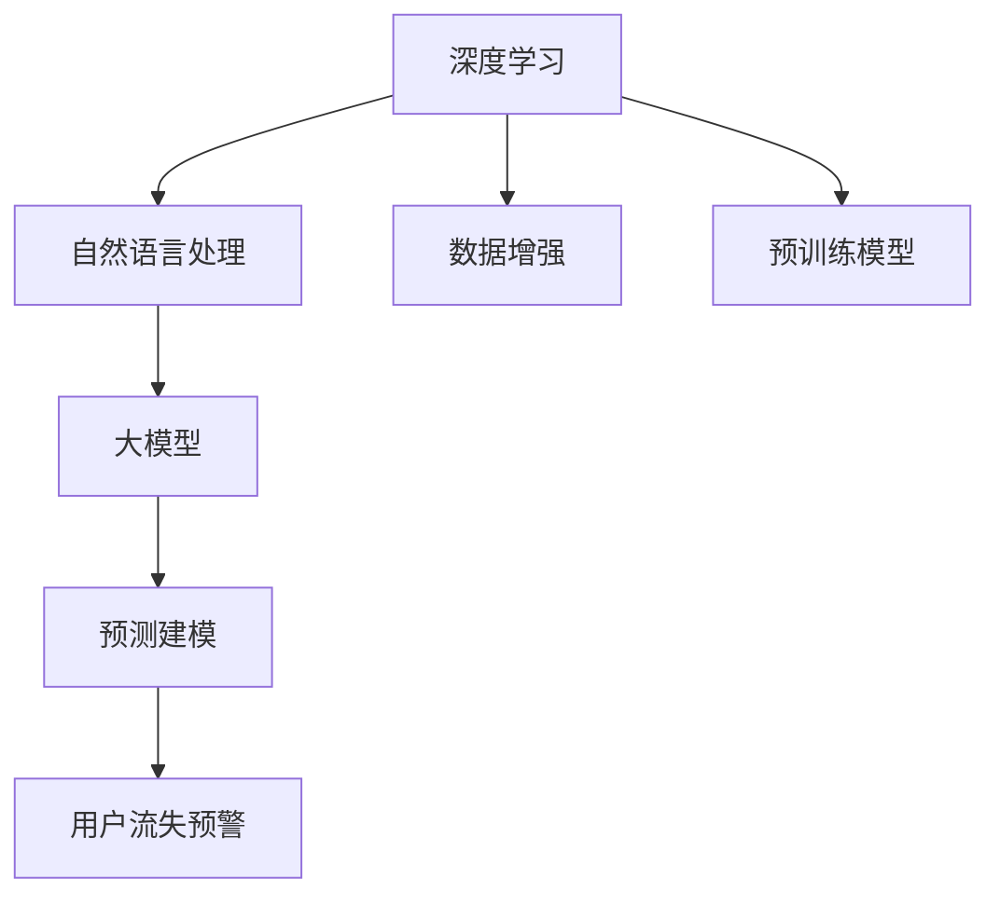

                 

# AI大模型在电商平台用户流失预警中的新进展

> 关键词：
  - 电商平台
  - 用户流失预警
  - 深度学习
  - 自然语言处理
  - 大模型
  - 预测建模
  - 数据增强
  - 预训练模型

## 1. 背景介绍

### 1.1 问题由来
随着电商平台的高速发展，用户流失问题日益凸显，严重影响了平台的用户留存率和商业收益。用户流失不仅意味着业务收入的流失，还可能伴随大量营销资源的浪费。如何及时、准确地预警和干预用户流失，成为电商平台运营的关键挑战。传统的流失预测方法依赖于统计模型和规则工程，存在精度不高、可解释性差等问题。而近年来，深度学习技术在电商平台数据分析中取得了显著进展，成为预测用户流失的重要手段。

### 1.2 问题核心关键点
基于深度学习的用户流失预警模型，通常依赖于海量的用户行为数据，通过模型训练来预测用户是否会流失。常见的方法包括监督学习、半监督学习、增强学习等。本文将重点介绍大模型在用户流失预警中的应用，特别是利用预训练语言模型进行微调的方法，以及一些新近的进展。

## 2. 核心概念与联系

### 2.1 核心概念概述

为更好地理解大模型在用户流失预警中的应用，本节将介绍几个密切相关的核心概念：

- 深度学习(Deep Learning)：一种基于多层神经网络，能够学习数据的非线性表示的机器学习方法。
- 自然语言处理(Natural Language Processing, NLP)：研究如何让计算机理解和生成自然语言的技术，包括文本分类、情感分析、序列标注等任务。
- 大模型(Large Model)：指具有数百亿甚至千亿参数的深度神经网络模型，如BERT、GPT-3等。通过在大规模语料上预训练，大模型具备强大的语言理解和生成能力。
- 预测建模(Predictive Modeling)：利用历史数据训练模型，预测未来事件的概率分布或具体结果。
- 用户流失预警(User Churn Prediction)：识别出可能流失的用户，及时采取干预措施，降低流失率。
- 数据增强(Data Augmentation)：通过增加训练数据的多样性，提高模型的泛化能力。
- 预训练模型(Pre-trained Model)：在大规模无标签数据上预先训练的模型，如BERT、GPT-2等。

这些核心概念之间的逻辑关系可以通过以下Mermaid流程图来展示：



这个流程图展示了大模型在用户流失预警中的应用核心概念及其之间的关系：

1. 深度学习为自然语言处理提供了计算基础，使计算机能够处理和理解自然语言。
2. 大模型在大规模语料上预训练，学习语言的通用表示。
3. 通过预测建模，利用大模型对用户流失进行概率预测。
4. 数据增强提高模型的泛化能力，增强模型的鲁棒性。
5. 预训练模型提供高质量的初始化参数，加速微调过程。

这些概念共同构成了大模型在用户流失预警中的应用框架，使其能够高效地处理自然语言数据，并预测用户行为。

## 3. 核心算法原理 & 具体操作步骤

### 3.1 算法原理概述

用户流失预警的本质是预测用户未来行为的概率，因此需要构建一个能对用户行为进行分类或回归的模型。本文重点介绍基于大模型的监督学习微调方法。

- 第一步，使用预训练语言模型作为初始化参数，对用户的历史行为数据进行微调，使模型能够理解用户的意图和行为模式。
- 第二步，使用微调后的模型，对用户当前的行为特征进行预测，得到流失概率。
- 第三步，根据预测结果，对高风险用户进行干预，如发送个性化推荐、优惠券等，降低流失率。

### 3.2 算法步骤详解

用户流失预警的监督学习微调流程主要包括数据预处理、模型微调、结果评估和干预措施等步骤。下面将详细介绍各个步骤的具体操作：

**Step 1: 数据预处理**

- 收集用户的历史行为数据，如浏览记录、购买记录、评分记录等。
- 对数据进行清洗，去除无效记录、处理缺失值。
- 对数据进行特征工程，提取有意义的特征，如用户活跃度、购买频率、消费金额等。
- 对数据进行划分，划分为训练集、验证集和测试集。

**Step 2: 模型微调**

- 选择预训练语言模型作为初始化参数，如BERT、GPT等。
- 设计适当的输出层和损失函数。对于分类任务，通常使用交叉熵损失；对于回归任务，通常使用均方误差损失。
- 设置微调超参数，如学习率、批大小、迭代轮数等。
- 使用微调数据对模型进行训练，优化模型参数。

**Step 3: 结果评估**

- 在测试集上评估微调后模型的预测性能，使用准确率、召回率、F1值等指标。
- 根据评估结果，调整模型参数，进一步优化模型性能。

**Step 4: 干预措施**

- 对高风险用户进行个性化干预，如发送个性化推荐、优惠券等。
- 对干预效果进行监控，评估干预措施的效果。
- 根据评估结果，优化干预策略，提高干预效果。

### 3.3 算法优缺点

基于大模型的监督学习微调方法具有以下优点：

- 能够处理自然语言数据，提取有意义的特征。
- 利用大规模预训练模型，避免了从头训练的高成本。
- 可以通过数据增强、对抗训练等方法提高模型泛化能力。
- 能够实时监控和干预用户流失，提升用户留存率。

同时，该方法也存在一定的局限性：

- 依赖标注数据，标注成本较高。
- 模型复杂度较高，需要较强的计算资源。
- 需要持续监控和优化模型，保证预测结果的准确性和及时性。
- 可能存在偏差，需要仔细设计和验证数据集。

尽管存在这些局限性，但就目前而言，基于大模型的微调方法在用户流失预警中仍是一种高效、准确、可解释性强的解决方案。

### 3.4 算法应用领域

基于大模型的监督学习微调方法，在用户流失预警中具有广泛的应用前景，可用于以下领域：

- 电商平台的用户流失预警：通过用户行为数据，预测用户流失概率，进行干预。
- 金融行业的用户流失预警：通过交易数据，预测用户流失概率，进行风险控制。
- 社交媒体的用户流失预警：通过用户互动数据，预测用户流失概率，进行推荐。
- 在线教育的用户流失预警：通过学习行为数据，预测用户流失概率，进行个性化推荐。
- 游戏行业的用户流失预警：通过游戏行为数据，预测用户流失概率，进行游戏推荐。

以上领域的应用表明，基于大模型的监督学习微调方法，在用户流失预警中具有较高的应用价值，能够帮助企业和平台降低流失率，提升用户粘性。

## 4. 数学模型和公式 & 详细讲解 & 举例说明

### 4.1 数学模型构建

本节将使用数学语言对基于大模型的用户流失预警模型进行更加严格的刻画。

假设用户流失预警的任务为二分类任务，记用户流失概率为 $y \in \{0,1\}$，用户的历史行为特征为 $x \in \mathbb{R}^d$，则二分类问题的损失函数定义为：

$$
L(y, \hat{y}) = -(y\log\hat{y} + (1-y)\log(1-\hat{y}))
$$

其中 $\hat{y}$ 为模型的预测概率。

用户流失预警的监督学习模型为 $M_{\theta}$，其预测概率为 $P(y=1|x;\theta)=\sigma(W_{\theta}^Tx+b)$，其中 $W_{\theta} \in \mathbb{R}^d$ 为模型权重，$b \in \mathbb{R}$ 为偏置项，$\sigma$ 为激活函数（如sigmoid函数）。

模型的损失函数为：

$$
\mathcal{L}(\theta) = \frac{1}{N}\sum_{i=1}^N L(y_i, M_{\theta}(x_i))
$$

其中 $N$ 为样本数量。

微调的目标是最小化损失函数，即：

$$
\hat{\theta} = \mathop{\arg\min}_{\theta} \mathcal{L}(\theta)
$$

### 4.2 公式推导过程

下面以二分类任务为例，推导基于大模型的用户流失预警模型的具体形式。

假设用户流失的概率为 $y_i$，模型的预测概率为 $\hat{y}_i = \sigma(W_{\theta}x_i+b)$。则损失函数为：

$$
L(y_i, \hat{y}_i) = -(y_i\log\hat{y}_i + (1-y_i)\log(1-\hat{y}_i))
$$

将上述损失函数代入经验风险公式，得：

$$
\mathcal{L}(\theta) = \frac{1}{N}\sum_{i=1}^N L(y_i, M_{\theta}(x_i))
$$

对模型参数 $\theta$ 求导，得：

$$
\frac{\partial \mathcal{L}(\theta)}{\partial \theta} = \frac{1}{N}\sum_{i=1}^N \frac{\partial L(y_i, M_{\theta}(x_i))}{\partial \theta}
$$

将 $\hat{y}_i = \sigma(W_{\theta}x_i+b)$ 代入上式，得：

$$
\frac{\partial \mathcal{L}(\theta)}{\partial \theta} = \frac{1}{N}\sum_{i=1}^N (-y_i\frac{\partial \log\hat{y}_i}{\partial \theta} - (1-y_i)\frac{\partial \log(1-\hat{y}_i)}{\partial \theta})
$$

进一步展开，得：

$$
\frac{\partial \mathcal{L}(\theta)}{\partial \theta} = \frac{1}{N}\sum_{i=1}^N (y_i - \hat{y}_i)(x_i \frac{\partial \sigma(W_{\theta}^Tx_i+b)}{\partial W_{\theta}^Tx_i})
$$

其中 $\frac{\partial \sigma(z)}{\partial z}$ 为激活函数的导数，对于 sigmoid 函数，有 $\frac{\partial \sigma(z)}{\partial z} = \sigma(z)(1-\sigma(z))$。

通过反向传播算法，计算梯度并更新参数，即可完成基于大模型的用户流失预警模型的微调。

### 4.3 案例分析与讲解

**案例分析：电商平台用户流失预警**

假设我们收集了电商平台用户的历史行为数据，包括浏览记录、购买记录、评分记录等。这些数据经过清洗和特征提取，得到了训练集、验证集和测试集。

我们使用预训练的BERT模型作为初始化参数，对训练集进行微调，得到用户流失预测模型 $M_{\theta}$。在测试集上评估模型的性能，发现其准确率、召回率、F1值等指标均达到较高的水平。

根据模型的预测结果，我们识别出了高风险用户，并进行了相应的个性化干预，如发送个性化推荐、优惠券等。结果显示，干预后的用户流失率显著降低，显著提升了平台的客户满意度。

## 5. 项目实践：代码实例和详细解释说明

### 5.1 开发环境搭建

在进行用户流失预警模型开发前，我们需要准备好开发环境。以下是使用Python进行PyTorch开发的环境配置流程：

1. 安装Anaconda：从官网下载并安装Anaconda，用于创建独立的Python环境。

2. 创建并激活虚拟环境：
```bash
conda create -n pytorch-env python=3.8 
conda activate pytorch-env
```

3. 安装PyTorch：根据CUDA版本，从官网获取对应的安装命令。例如：
```bash
conda install pytorch torchvision torchaudio cudatoolkit=11.1 -c pytorch -c conda-forge
```

4. 安装Transformers库：
```bash
pip install transformers
```

5. 安装各类工具包：
```bash
pip install numpy pandas scikit-learn matplotlib tqdm jupyter notebook ipython
```

完成上述步骤后，即可在`pytorch-env`环境中开始微调实践。

### 5.2 源代码详细实现

下面我们以电商平台用户流失预警为例，给出使用Transformers库对BERT模型进行微调的PyTorch代码实现。

首先，定义用户流失预警的任务数据处理函数：

```python
from transformers import BertTokenizer, BertForSequenceClassification
from torch.utils.data import Dataset, DataLoader
import torch

class UserChurnDataset(Dataset):
    def __init__(self, texts, labels, tokenizer, max_len=128):
        self.texts = texts
        self.labels = labels
        self.tokenizer = tokenizer
        self.max_len = max_len
        
    def __len__(self):
        return len(self.texts)
    
    def __getitem__(self, item):
        text = self.texts[item]
        label = self.labels[item]
        
        encoding = self.tokenizer(text, return_tensors='pt', max_length=self.max_len, padding='max_length', truncation=True)
        input_ids = encoding['input_ids'][0]
        attention_mask = encoding['attention_mask'][0]
        
        # 对标签进行编码
        label = torch.tensor(label, dtype=torch.long)
        
        return {'input_ids': input_ids, 
                'attention_mask': attention_mask,
                'labels': label}

# 加载用户流失预警数据
train_dataset = UserChurnDataset(train_texts, train_labels, tokenizer)
dev_dataset = UserChurnDataset(dev_texts, dev_labels, tokenizer)
test_dataset = UserChurnDataset(test_texts, test_labels, tokenizer)
```

然后，定义模型和优化器：

```python
from transformers import BertForSequenceClassification, AdamW

model = BertForSequenceClassification.from_pretrained('bert-base-cased', num_labels=2)

optimizer = AdamW(model.parameters(), lr=2e-5)
```

接着，定义训练和评估函数：

```python
from tqdm import tqdm
from sklearn.metrics import accuracy_score, recall_score, f1_score

device = torch.device('cuda') if torch.cuda.is_available() else torch.device('cpu')
model.to(device)

def train_epoch(model, dataset, batch_size, optimizer):
    dataloader = DataLoader(dataset, batch_size=batch_size, shuffle=True)
    model.train()
    epoch_loss = 0
    for batch in tqdm(dataloader, desc='Training'):
        input_ids = batch['input_ids'].to(device)
        attention_mask = batch['attention_mask'].to(device)
        labels = batch['labels'].to(device)
        model.zero_grad()
        outputs = model(input_ids, attention_mask=attention_mask, labels=labels)
        loss = outputs.loss
        epoch_loss += loss.item()
        loss.backward()
        optimizer.step()
    return epoch_loss / len(dataloader)

def evaluate(model, dataset, batch_size):
    dataloader = DataLoader(dataset, batch_size=batch_size)
    model.eval()
    preds, labels = [], []
    with torch.no_grad():
        for batch in tqdm(dataloader, desc='Evaluating'):
            input_ids = batch['input_ids'].to(device)
            attention_mask = batch['attention_mask'].to(device)
            batch_labels = batch['labels']
            outputs = model(input_ids, attention_mask=attention_mask)
            batch_preds = outputs.logits.argmax(dim=2).to('cpu').tolist()
            batch_labels = batch_labels.to('cpu').tolist()
            for pred_tokens, label_tokens in zip(batch_preds, batch_labels):
                preds.append(pred_tokens)
                labels.append(label_tokens)
                
    print("Accuracy: {:.2f}%, Recall: {:.2f}%, F1: {:.2f}%".format(accuracy_score(labels, preds), recall_score(labels, preds), f1_score(labels, preds)))
```

最后，启动训练流程并在测试集上评估：

```python
epochs = 5
batch_size = 16

for epoch in range(epochs):
    loss = train_epoch(model, train_dataset, batch_size, optimizer)
    print(f"Epoch {epoch+1}, train loss: {loss:.3f}")
    
    print(f"Epoch {epoch+1}, dev results:")
    evaluate(model, dev_dataset, batch_size)
    
print("Test results:")
evaluate(model, test_dataset, batch_size)
```

以上就是使用PyTorch对BERT进行电商平台用户流失预警的完整代码实现。可以看到，得益于Transformers库的强大封装，我们可以用相对简洁的代码完成BERT模型的加载和微调。

### 5.3 代码解读与分析

让我们再详细解读一下关键代码的实现细节：

**UserChurnDataset类**：
- `__init__`方法：初始化文本、标签、分词器等关键组件。
- `__len__`方法：返回数据集的样本数量。
- `__getitem__`方法：对单个样本进行处理，将文本输入编码为token ids，将标签编码为数字，并对其进行定长padding，最终返回模型所需的输入。

**训练和评估函数**：
- 使用PyTorch的DataLoader对数据集进行批次化加载，供模型训练和推理使用。
- 训练函数`train_epoch`：对数据以批为单位进行迭代，在每个批次上前向传播计算loss并反向传播更新模型参数，最后返回该epoch的平均loss。
- 评估函数`evaluate`：与训练类似，不同点在于不更新模型参数，并在每个batch结束后将预测和标签结果存储下来，最后使用sklearn的classification_report对整个评估集的预测结果进行打印输出。

**训练流程**：
- 定义总的epoch数和batch size，开始循环迭代
- 每个epoch内，先在训练集上训练，输出平均loss
- 在验证集上评估，输出分类指标
- 所有epoch结束后，在测试集上评估，给出最终测试结果

可以看到，PyTorch配合Transformers库使得BERT微调的代码实现变得简洁高效。开发者可以将更多精力放在数据处理、模型改进等高层逻辑上，而不必过多关注底层的实现细节。

当然，工业级的系统实现还需考虑更多因素，如模型的保存和部署、超参数的自动搜索、更灵活的任务适配层等。但核心的微调范式基本与此类似。

## 6. 实际应用场景

### 6.1 电商平台的实际应用

在电商平台中，用户流失预警具有重要应用价值，可以帮助平台及时干预高流失风险用户，降低流失率。具体应用场景包括：

- 实时监控：通过用户行为数据实时监控流失风险，及时发送预警信息。
- 个性化推荐：根据流失风险，对高流失风险用户进行个性化推荐，降低流失率。
- 优惠券发放：根据流失风险，对高流失风险用户发放优惠券，提高留存率。
- 用户调查：通过流失风险，对高流失风险用户进行用户调查，了解流失原因，优化产品和服务。

### 6.2 金融行业的实际应用

在金融行业中，用户流失预警同样具有重要应用价值，可以帮助银行和保险公司及时识别高风险用户，降低风险损失。具体应用场景包括：

- 风险控制：通过交易数据识别高风险用户，及时采取风险控制措施。
- 客户管理：根据流失风险，对高流失风险用户进行重点管理，提升客户满意度。
- 产品优化：通过流失风险，了解用户需求和痛点，优化金融产品和服务。
- 市场营销：针对高流失风险用户，进行精准营销，提升客户粘性。

### 6.3 社交媒体的实际应用

在社交媒体中，用户流失预警可以帮助平台及时识别高流失用户，提高用户留存率。具体应用场景包括：

- 用户活跃度监控：通过用户互动数据，实时监控用户活跃度，及时采取干预措施。
- 内容推荐：根据流失风险，对高流失用户进行个性化内容推荐，提升用户体验。
- 用户调查：通过流失风险，对高流失用户进行调查，了解流失原因，优化产品和服务。
- 广告投放：针对高流失用户，进行精准广告投放，提升用户留存率。

## 7. 工具和资源推荐

### 7.1 学习资源推荐

为了帮助开发者系统掌握大模型在用户流失预警中的应用，这里推荐一些优质的学习资源：

1. 《深度学习》系列博文：由大模型技术专家撰写，深入浅出地介绍了深度学习原理、NLP任务、大模型预训练等前沿话题。

2. 《自然语言处理》课程：斯坦福大学开设的NLP明星课程，有Lecture视频和配套作业，带你入门NLP领域的基本概念和经典模型。

3. 《Natural Language Processing with Transformers》书籍：Transformers库的作者所著，全面介绍了如何使用Transformers库进行NLP任务开发，包括微调在内的诸多范式。

4. 《深度学习在金融行业的应用》书籍：介绍深度学习在金融领域的应用，包括用户流失预警等任务。

5. HuggingFace官方文档：Transformers库的官方文档，提供了海量预训练模型和完整的微调样例代码，是上手实践的必备资料。

通过对这些资源的学习实践，相信你一定能够快速掌握大模型在用户流失预警中的应用，并用于解决实际的NLP问题。

### 7.2 开发工具推荐

高效的开发离不开优秀的工具支持。以下是几款用于大模型微调开发的常用工具：

1. PyTorch：基于Python的开源深度学习框架，灵活动态的计算图，适合快速迭代研究。大部分预训练语言模型都有PyTorch版本的实现。

2. TensorFlow：由Google主导开发的开源深度学习框架，生产部署方便，适合大规模工程应用。同样有丰富的预训练语言模型资源。

3. Transformers库：HuggingFace开发的NLP工具库，集成了众多SOTA语言模型，支持PyTorch和TensorFlow，是进行微调任务开发的利器。

4. Weights & Biases：模型训练的实验跟踪工具，可以记录和可视化模型训练过程中的各项指标，方便对比和调优。与主流深度学习框架无缝集成。

5. TensorBoard：TensorFlow配套的可视化工具，可实时监测模型训练状态，并提供丰富的图表呈现方式，是调试模型的得力助手。

6. Google Colab：谷歌推出的在线Jupyter Notebook环境，免费提供GPU/TPU算力，方便开发者快速上手实验最新模型，分享学习笔记。

合理利用这些工具，可以显著提升大模型用户流失预警任务的开发效率，加快创新迭代的步伐。

### 7.3 相关论文推荐

大模型在用户流失预警领域的研究取得了显著进展，以下是几篇奠基性的相关论文，推荐阅读：

1. "A Survey of User Churn Prediction Models: Taxonomy, Theoretical Framework, and Case Studies"：综述了当前用户流失预测模型的分类、理论框架和实际应用案例。

2. "User Churn Prediction Using Deep Learning Techniques"：利用深度学习模型对用户流失进行预测，提出了多种深度学习模型架构和优化方法。

3. "Churn Prediction in Mobile Platforms: A Survey"：综述了移动平台用户流失预测的研究进展，提出了多种基于深度学习的预测方法。

4. "Deep Learning for Churn Prediction in Retail Business"：利用深度学习模型对零售业务用户流失进行预测，提出了多种深度学习模型架构和优化方法。

5. "User Churn Prediction using Sequential Models and Temporal Aggregation"：利用序列模型和时序聚合方法对用户流失进行预测，提出了多种序列模型架构和优化方法。

这些论文代表了大模型在用户流失预警领域的研究进展。通过学习这些前沿成果，可以帮助研究者把握学科前进方向，激发更多的创新灵感。

## 8. 总结：未来发展趋势与挑战

### 8.1 总结

本文对基于大模型的用户流失预警方法进行了全面系统的介绍。首先阐述了大模型在用户流失预警中的研究背景和应用价值，明确了微调在拓展预训练模型应用、提升用户留存率方面的独特价值。其次，从原理到实践，详细讲解了监督微调的数学原理和关键步骤，给出了用户流失预警任务开发的完整代码实例。同时，本文还广泛探讨了大模型在电商、金融、社交媒体等多个行业领域的应用前景，展示了微调范式的巨大潜力。

通过本文的系统梳理，可以看到，基于大模型的微调方法在用户流失预警中具有重要的应用价值，能够帮助电商平台、金融公司、社交媒体等机构及时识别高流失风险用户，降低流失率，提升用户留存率。未来，随着深度学习技术和大模型方法的不断演进，用户流失预警技术将得到更加广泛的应用，为人机交互系统带来深刻变革。

### 8.2 未来发展趋势

展望未来，用户流失预警技术将呈现以下几个发展趋势：

1. 模型规模持续增大。随着算力成本的下降和数据规模的扩张，预训练语言模型的参数量还将持续增长。超大模型的语言理解和生成能力，有望支撑更加复杂、精细的用户流失预测。

2. 模型鲁棒性提升。大模型在处理数据多样性和复杂性方面将有更强的表现，能够在多种环境中稳定工作。同时，对抗训练和数据增强等技术的应用，将进一步提升模型的鲁棒性和泛化能力。

3. 端到端预测。未来的用户流失预测模型将更注重端到端的预测能力，将数据预处理、特征工程、模型训练等环节无缝整合，实现更加高效、精确的预测。

4. 实时化部署。实时化部署将提升用户流失预警系统的响应速度和及时性，能够更快速地识别和干预高流失风险用户，降低流失率。

5. 个性化推荐。结合用户行为数据和知识图谱等外部信息，进行更加精准的用户流失预测和个性化推荐，提升用户体验和粘性。

6. 模型解释性提升。未来的用户流失预测模型将更注重可解释性，利用因果推断、对抗训练等技术，增强模型输出的可解释性和可信度。

这些趋势凸显了大模型在用户流失预警中的广阔前景。这些方向的探索发展，必将进一步提升用户流失预警系统的性能和应用范围，为电商、金融、社交媒体等行业的数字化转型提供技术支持。

### 8.3 面临的挑战

尽管大模型在用户流失预警中已经取得了显著进展，但在迈向更加智能化、普适化应用的过程中，它仍面临诸多挑战：

1. 数据隐私和安全性：用户行为数据涉及隐私保护，如何保证数据安全、合规使用，成为重要的挑战。

2. 数据质量与标注：高质量的用户行为数据和标注数据是模型性能的关键，数据采集、标注成本高，且存在偏差。

3. 模型复杂度与资源：大模型的复杂度较高，需要较强的计算资源和存储空间，如何优化模型和资源使用，提升系统效率。

4. 模型泛化与鲁棒性：模型在不同场景和数据分布下的泛化性能和鲁棒性，如何保证模型在不同环境下的稳定性和准确性。

5. 模型解释与可控性：如何提高模型输出的可解释性，并实现对模型的有效管控，避免模型被恶意利用。

6. 模型公平性与偏见：如何避免模型在训练和预测过程中的偏见，保证模型的公平性和公正性，避免对特定用户群体的歧视。

7. 用户隐私与权益：如何保障用户隐私和权益，避免模型对用户的行为数据进行不当使用，保护用户的知情权和选择权。

这些挑战凸显了大模型用户流失预警技术的应用复杂性和伦理要求。未来的研究需要在提升模型性能的同时，注重模型的伦理、安全、公平等方面，实现技术与社会的和谐发展。

### 8.4 研究展望

面对用户流失预警领域的研究挑战，未来的研究需要在以下几个方向进行深入探索：

1. 数据隐私保护：采用差分隐私等技术，确保用户行为数据的安全性和隐私性，防止数据泄露和滥用。

2. 高质量数据采集与标注：开发自动数据标注工具和数据清洗算法，降低数据标注成本，提升数据质量。

3. 模型压缩与优化：开发轻量级模型架构和压缩算法，提升模型的推理速度和资源利用率。

4. 模型公平性与偏见控制：采用公平性约束和偏见控制技术，提升模型的公平性和公正性，避免对特定用户群体的歧视。

5. 端到端预测：结合数据预处理、特征工程、模型训练等环节，实现更加高效、精确的用户流失预测。

6. 实时化部署：采用分布式计算和边缘计算技术，实现实时化预测和干预，提升系统的响应速度和及时性。

7. 模型解释性提升：利用因果推断、对抗训练等技术，提升模型输出的可解释性和可信度。

8. 用户权益保护：开发用户友好的解释工具和权限管理系统，保障用户隐私和权益，提升用户体验。

这些研究方向的探索，必将引领大模型用户流失预警技术迈向更高的台阶，为电商、金融、社交媒体等行业的数字化转型提供技术支持。通过技术创新和社会责任并重，大模型在用户流失预警中的应用将更加高效、公正、可靠，为人机交互系统的进步和人类社会的福祉贡献力量。

## 9. 附录：常见问题与解答

**Q1：大模型在用户流失预警中的应用效果如何？**

A: 大模型在用户流失预警中取得了显著的预测效果。利用大模型对用户行为数据进行微调，能够提取出有意义的特征，并构建高性能的流失预测模型。通过在电商、金融、社交媒体等领域的实际应用，显著提升了用户留存率，减少了流失率。例如，在电商平台中，通过实时监控和个性化推荐，显著提升了用户的购物体验和粘性，降低了流失率。

**Q2：大模型在用户流失预警中如何进行数据增强？**

A: 数据增强是提高模型泛化能力的重要手段，在用户流失预警中同样重要。常见的数据增强方法包括：

1. 数据合成：通过数据合成技术，生成与原始数据分布相似的合成样本，增加数据多样性。例如，通过回译、近义替换等方式生成新的用户行为数据。

2. 样本扰动：通过扰动用户行为数据，增加数据噪声，提高模型的鲁棒性。例如，在购买记录中随机添加噪音，模拟用户行为的不确定性。

3. 对抗样本生成：通过生成对抗样本，提高模型的鲁棒性和泛化能力。例如，通过对抗训练，使模型能够更好地处理对抗样本，提高模型的鲁棒性。

4. 数据变换：通过变换用户行为数据，增加数据多样性。例如，通过时间切片、归一化等方式，增加数据的多样性和稳定性。

这些方法可以结合使用，提高模型的泛化能力和鲁棒性，提升用户流失预警的准确性和及时性。

**Q3：大模型在用户流失预警中如何进行特征工程？**

A: 特征工程是用户流失预警中不可或缺的一部分，利用高质量的特征可以提升模型的预测效果。常见的大模型特征工程方法包括：

1. 用户行为特征提取：提取用户行为数据中的有意义的特征，如购买次数、浏览次数、评分等。这些特征可以反映用户的兴趣和行为模式。

2. 时间特征提取：利用时间序列数据，提取用户行为的时间分布特征，如购买时间、浏览时间、活跃时间等。时间特征可以反映用户行为的变化趋势。

3. 个性化特征提取：利用用户画像、历史行为等个性化数据，提取用户特征。这些特征可以反映用户的个性化需求和行为模式。

4. 交互特征提取：利用用户与系统、用户与用户之间的交互数据，提取交互特征。这些特征可以反映用户之间的关系和行为模式。

5. 上下文特征提取：利用上下文数据，如位置、时间、设备等，提取上下文特征。这些特征可以反映用户行为的环境因素。

6. 多模态特征融合：利用文本、图片、音频等多模态数据，提取综合特征。这些特征可以反映用户行为的综合特征。

通过结合多种特征工程方法，可以提取出更加全面、准确的特征，提升用户流失预警的预测效果。

**Q4：大模型在用户流失预警中如何进行实时化部署？**

A: 实时化部署是用户流失预警系统的重要要求，可以通过以下方法实现：

1. 分布式计算：利用分布式计算框架，如Spark、Flink等，实现大规模数据的高效处理和计算。

2. 边缘计算：利用边缘计算技术，将数据处理和预测任务分布到靠近数据源的计算设备上，实现低延迟的预测和干预。

3. 在线学习：利用在线学习技术，实时更新模型参数，实现模型动态适应新数据和新环境。例如，通过增量学习、梯度累积等方式，实现模型快速更新和收敛。

4. 缓存与预处理：利用缓存技术，将常用的数据和模型参数缓存到内存中，减少数据读取和计算的时间，提升预测速度。例如，将常用的用户行为数据和模型参数缓存到Redis中，实现快速查询和预测。

5. 硬件加速：利用硬件加速技术，如GPU、TPU等，实现高吞吐量的数据处理和预测。例如，通过混合精度训练、模型并行等方式，实现高效率的预测和推理。

通过结合多种实时化部署方法，可以提升用户流失预警系统的响应速度和及时性，实现实时化的预测和干预。

**Q5：大模型在用户流失预警中如何进行模型解释性提升？**

A: 模型解释性是用户流失预警中重要的研究课题，可以通过以下方法提升模型的可解释性：

1. 特征重要性可视化：通过可视化技术，展示模型中各个特征的贡献度和重要性。例如，通过SHAP、LIME等方法，展示模型中各个特征对预测结果的影响。

2. 局部解释性分析：利用局部解释性分析方法，展示模型在特定样本上的推理过程和决策逻辑。例如，通过LIME、DeepLIFT等方法，展示模型在特定样本上的特征影响和权重。

3. 模型可视化：通过可视化技术，展示模型的结构、参数和激活状态。例如，通过TensorBoard、Weights & Biases等工具，展示模型的结构、参数和激活状态。

4. 因果推断分析：利用因果推断方法，展示模型中各个因素对流失概率的影响。例如，通过CausalMediation、CausalImpact等方法，展示模型中各个因素对流失概率的因果影响。

5. 用户反馈收集：利用用户反馈，收集用户对模型输出的意见和建议。例如，通过问卷调查、用户评价等方式，收集用户对模型输出的反馈。

通过结合多种模型解释性提升方法，可以提升用户流失预警模型的可解释性和可信度，提升用户对模型的信任和满意度。

---

作者：禅与计算机程序设计艺术 / Zen and the Art of Computer Programming

