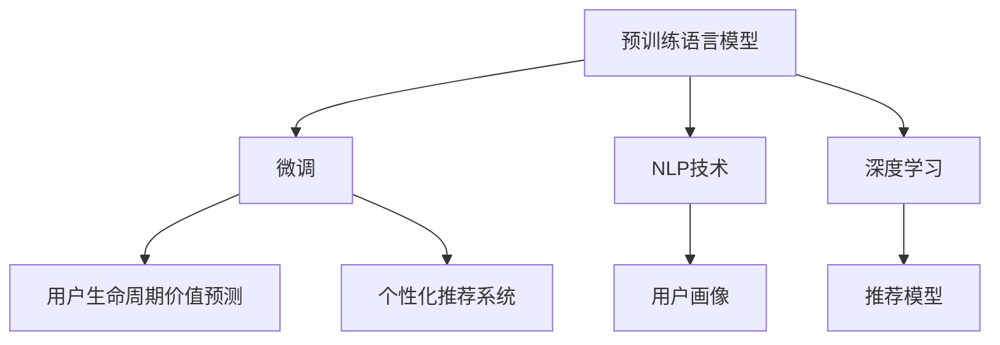

                 

## 1. 背景介绍

在当前的市场竞争环境中，电商平台通过精细化运营、个性化推荐等策略，希望通过提升用户满意度和忠诚度来增加用户生命周期价值（Customer Lifetime Value, CLV），从而实现持续增长。但是，用户行为具有高度的不确定性和复杂性，如何高效地预测和管理用户生命周期价值，成为电商平台亟待解决的难题。近年来，随着人工智能技术的飞速发展，特别是大模型在自然语言处理（NLP）、推荐系统等领域的广泛应用，提供了新的解决方案。

大模型，尤其是预训练语言模型（如BERT、GPT、T5等），通过大规模无标签文本数据的预训练，可以学习到丰富的语言知识和常识，具有强大的语言理解和生成能力。基于大模型的预训练和微调，可以更好地理解用户行为，进行精准的用户画像描绘，并为用户提供个性化推荐，从而实现用户生命周期价值的预测与管理。

## 2. 核心概念与联系

### 2.1 核心概念概述

为了更好地理解大模型在电商平台用户生命周期价值预测与管理中的应用，本节将介绍几个密切相关的核心概念：

- 预训练语言模型（Pre-trained Language Model, PLM）：通过大规模无标签文本数据预训练，学习通用的语言表示，具备强大的语言理解和生成能力。如BERT、GPT、T5等模型。
- 微调（Fine-tuning）：在大规模预训练模型的基础上，通过有监督学习优化模型在特定任务上的性能。如电商平台用户行为预测。
- 用户生命周期价值（Customer Lifetime Value, CLV）：用户在其生命周期内为企业创造的所有价值总和。包括购买频率、购买金额、推荐购买等。
- 个性化推荐系统（Personalized Recommendation System）：基于用户历史行为和兴趣，通过算法模型推荐用户可能感兴趣的商品或内容。
- 自然语言处理（Natural Language Processing, NLP）：利用计算机技术处理、理解和生成自然语言的技术。
- 深度学习（Deep Learning）：一种基于神经网络的机器学习技术，通过多层神经网络的堆叠，学习数据的高级表示。

这些核心概念之间通过以下Mermaid流程图建立联系：



这个流程图展示了预训练语言模型、微调技术、用户生命周期价值预测、个性化推荐系统、NLP技术、深度学习等概念之间的逻辑关系：

1. 预训练语言模型通过大规模无标签数据学习通用的语言表示，具备强大的语言理解和生成能力。
2. 微调技术在大规模预训练模型的基础上，通过有监督学习优化模型在特定任务上的性能。
3. 用户生命周期价值预测和个性化推荐系统分别基于用户行为数据，通过模型预测和推荐，提升用户满意度和忠诚度。
4. NLP技术和大规模预训练模型帮助理解自然语言文本，进行用户画像描绘。
5. 深度学习技术提供了高效的大模型训练和优化方法，实现复杂的用户行为预测和推荐。

## 3. 核心算法原理 & 具体操作步骤

### 3.1 算法原理概述

基于大模型的电商平台用户生命周期价值预测与管理，本质上是一个多任务学习（Multi-task Learning, MTL）和迁移学习（Transfer Learning）的过程。其核心思想是：

1. **多任务学习**：通过多个相关任务的联合学习，共享预训练模型的通用知识，提高模型在多个任务上的泛化能力。
2. **迁移学习**：利用预训练模型在大规模文本数据上学习到的通用知识，在下游任务上进行微调，提高模型在特定任务上的性能。

在电商平台上，用户生命周期价值预测和管理可以分解为多个子任务，如用户购买频率预测、购买金额预测、用户流失预测、个性化推荐等。通过多任务学习和迁移学习，可以共享预训练模型的通用知识，提升模型在各个子任务上的性能。

### 3.2 算法步骤详解

基于大模型的电商平台用户生命周期价值预测与管理，一般包括以下几个关键步骤：

**Step 1: 数据准备**
- 收集电商平台用户的历史行为数据，包括购买记录、浏览记录、评价记录等。
- 对数据进行预处理，包括数据清洗、特征工程、数据归一化等。
- 将数据划分为训练集、验证集和测试集。

**Step 2: 预训练语言模型选择**
- 选择合适的预训练语言模型，如BERT、GPT、T5等。
- 在预训练模型的基础上进行微调，以适应电商平台的特定任务。

**Step 3: 多任务模型构建**
- 根据电商平台用户生命周期价值预测和管理的不同子任务，构建多任务模型。
- 为每个子任务设计合适的输出层和损失函数。

**Step 4: 模型微调**
- 在预训练模型的基础上，通过有监督学习优化模型在特定任务上的性能。
- 选择合适的优化器、学习率、正则化技术等，防止过拟合。
- 使用验证集评估模型性能，适时调整超参数。

**Step 5: 结果评估与部署**
- 在测试集上评估模型性能，比较微调前后的效果提升。
- 将微调后的模型部署到实际应用中，进行用户生命周期价值的预测与管理。

### 3.3 算法优缺点

基于大模型的电商平台用户生命周期价值预测与管理，具有以下优点：

1. **高效性**：预训练模型学习了大规模文本数据中的通用知识，显著提高了模型在特定任务上的训练速度和泛化能力。
2. **灵活性**：通过多任务学习和迁移学习，模型可以同时处理多个相关任务，提升整体性能。
3. **可解释性**：大模型具备强大的语言理解和生成能力，可以提供更为详细的用户行为分析。

同时，该方法也存在一定的局限性：

1. **标注数据依赖**：微调模型需要大量的标注数据，获取高质量标注数据成本较高。
2. **泛化能力有限**：当预训练模型与特定任务之间的差异较大时，微调的效果可能不佳。
3. **可解释性不足**：大模型的决策过程缺乏可解释性，难以进行调试和优化。

尽管存在这些局限性，但就目前而言，基于大模型的微调方法仍是大数据驱动的电商用户生命周期价值预测与管理的重要手段。未来相关研究的方向是进一步降低对标注数据的依赖，提高模型的泛化能力和可解释性。

### 3.4 算法应用领域

基于大模型的电商平台用户生命周期价值预测与管理，已经在多个实际应用场景中得到验证，如：

- **用户行为预测**：通过多任务学习和迁移学习，对用户的购买频率、购买金额等进行预测。
- **用户流失预测**：通过模型预测用户流失的可能性，提前进行干预，减少用户流失率。
- **个性化推荐**：利用大模型的预训练和微调，进行高质量的商品或内容推荐，提升用户满意度和忠诚度。
- **用户画像描绘**：通过自然语言处理技术和大模型的预训练，进行用户兴趣、需求等画像描绘，提升个性化推荐效果。

## 4. 数学模型和公式 & 详细讲解 & 举例说明

### 4.1 数学模型构建

假设电商平台的用户行为数据为 $(x,y)$，其中 $x$ 表示用户行为数据，$y$ 表示用户行为标签，如购买频率、购买金额等。

定义预训练语言模型为 $M_{\theta}(x)$，其中 $\theta$ 为预训练得到的模型参数。

假设电商平台用户生命周期价值预测任务包含 $T$ 个子任务，每个子任务对应的输出层为 $M_{\theta}^t(x)$，对应的损失函数为 $\ell^t$。则多任务模型的目标函数为：

$$
\mathcal{L}(\theta) = \frac{1}{N}\sum_{i=1}^N \sum_{t=1}^T \ell^t(M_{\theta}^t(x_i),y_i)
$$

其中 $N$ 为样本数量，$T$ 为子任务数量。

### 4.2 公式推导过程

以用户购买金额预测为例，推导多任务模型的损失函数和梯度更新公式。

假设用户购买金额预测任务的损失函数为均方误差损失：

$$
\ell^t(M_{\theta}^t(x),y) = \frac{1}{2}(M_{\theta}^t(x)-y)^2
$$

则多任务模型的目标函数为：

$$
\mathcal{L}(\theta) = \frac{1}{N}\sum_{i=1}^N \sum_{t=1}^T \frac{1}{2}(M_{\theta}^t(x_i)-y_i)^2
$$

对于每个子任务，定义模型在输入 $x$ 上的预测为 $\hat{y}_t = M_{\theta}^t(x)$，则损失函数对参数 $\theta$ 的梯度为：

$$
\frac{\partial \mathcal{L}(\theta)}{\partial \theta} = \frac{1}{N}\sum_{i=1}^N \sum_{t=1}^T (M_{\theta}^t(x_i)-y_i)\frac{\partial M_{\theta}^t(x_i)}{\partial \theta}
$$

其中 $\frac{\partial M_{\theta}^t(x_i)}{\partial \theta}$ 可通过反向传播算法高效计算。

### 4.3 案例分析与讲解

假设电商平台用户行为数据集包含用户购买记录和浏览记录，其中购买记录的特征为商品ID、购买金额等，浏览记录的特征为商品ID、浏览时间等。

通过选择BERT模型，在电商用户行为数据上进行微调，进行用户购买金额预测。

1. 数据预处理：将购买记录和浏览记录分别进行处理，合并为统一格式。
2. 模型选择：选择BERT模型作为预训练模型。
3. 构建多任务模型：构建用户购买金额预测模型和用户购买频率预测模型，分别对应损失函数 $\ell^1$ 和 $\ell^2$。
4. 模型微调：在BERT模型基础上，进行用户购买金额预测和购买频率预测的联合微调，使用均方误差损失函数。
5. 结果评估：在测试集上评估模型性能，比较微调前后的效果提升。

通过多任务学习和迁移学习，可以显著提升电商平台用户生命周期价值的预测和管理效果。

## 5. 项目实践：代码实例和详细解释说明

### 5.1 开发环境搭建

在进行电商平台用户生命周期价值预测与管理的微调实践前，我们需要准备好开发环境。以下是使用Python进行TensorFlow开发的环境配置流程：

1. 安装Anaconda：从官网下载并安装Anaconda，用于创建独立的Python环境。

2. 创建并激活虚拟环境：
```bash
conda create -n pytorch-env python=3.8 
conda activate pytorch-env
```

3. 安装TensorFlow：根据CUDA版本，从官网获取对应的安装命令。例如：
```bash
conda install tensorflow -c tf -c conda-forge
```

4. 安装其他必要的工具包：
```bash
pip install numpy pandas scikit-learn tensorflow-hub tf-nightly tensorboard
```

完成上述步骤后，即可在`pytorch-env`环境中开始微调实践。

### 5.2 源代码详细实现

下面我们以用户购买金额预测为例，给出使用TensorFlow对BERT模型进行微调的PyTorch代码实现。

```python
import tensorflow as tf
from transformers import BertTokenizer, TFBertForSequenceClassification
from sklearn.model_selection import train_test_split
import numpy as np

# 数据预处理
# 假设数据集已经加载，train_data为训练数据，train_labels为训练标签，test_data为测试数据，test_labels为测试标签

# 定义BERT模型
tokenizer = BertTokenizer.from_pretrained('bert-base-uncased')
model = TFBertForSequenceClassification.from_pretrained('bert-base-uncased', num_labels=1)

# 数据预处理和模型输入
def encode_text(text):
    return tokenizer.encode_plus(text, max_length=128, padding='max_length', truncation=True, return_tensors='tf')

def build_dataset(data, labels):
    encodings = [encode_text(d) for d in data]
    return tf.data.Dataset.from_tensor_slices((
        {input_key: tf.cast(encoding['input_ids'], tf.int32) for input_key in ['input_ids', 'attention_mask']},
        labels
    )).shuffle(10000).batch(16)

# 构建训练和验证集
train_dataset = build_dataset(train_data, train_labels)
val_dataset = build_dataset(val_data, val_labels)

# 定义损失函数和优化器
loss_fn = tf.keras.losses.MeanSquaredError()
optimizer = tf.keras.optimizers.Adam()

# 定义训练和验证函数
@tf.function
def train_step(inputs, labels):
    with tf.GradientTape() as tape:
        outputs = model(inputs['input_ids'], attention_mask=inputs['attention_mask'])
        loss = loss_fn(outputs, labels)
    grads = tape.gradient(loss, model.trainable_variables)
    optimizer.apply_gradients(zip(grads, model.trainable_variables))

def evaluate(inputs, labels):
    outputs = model(inputs['input_ids'], attention_mask=inputs['attention_mask'])
    loss = loss_fn(outputs, labels)
    return loss.numpy()

# 训练和验证
epochs = 5
batch_size = 16
for epoch in range(epochs):
    train_loss = 0.0
    val_loss = 0.0
    for batch in train_dataset:
        train_step(batch)
    for batch in val_dataset:
        val_loss += evaluate(batch)

# 结果评估
test_dataset = build_dataset(test_data, test_labels)
test_loss = 0.0
for batch in test_dataset:
    test_loss += evaluate(batch)

print(f"Train loss: {train_loss:.4f}")
print(f"Val loss: {val_loss:.4f}")
print(f"Test loss: {test_loss:.4f}")
```

以上就是使用TensorFlow对BERT进行用户购买金额预测的完整代码实现。可以看到，通过使用TensorFlow和Transformers库，我们可以快速地进行模型的加载和微调，并在测试集上评估模型性能。

### 5.3 代码解读与分析

让我们再详细解读一下关键代码的实现细节：

**BERT模型选择**：
- 使用BertTokenizer进行数据预处理。
- 选择预训练BERT模型，并进行微调。

**数据预处理**：
- 定义`encode_text`函数，将输入文本进行编码，并进行padding处理。
- 构建训练和验证集的数据集。

**模型定义**：
- 定义损失函数和优化器。
- 定义训练和验证函数。

**训练和验证**：
- 在训练集上进行前向传播和反向传播，更新模型参数。
- 在验证集上评估模型性能，输出训练和验证损失。

**结果评估**：
- 在测试集上评估模型性能，输出测试损失。

## 6. 实际应用场景

### 6.1 智能客服系统

基于大模型的电商平台用户生命周期价值预测与管理，可以应用于智能客服系统的构建。通过分析用户的历史行为和反馈，预测用户的潜在需求和满意度，智能客服系统可以提供个性化推荐和服务，提升客户体验和忠诚度。

在技术实现上，可以收集用户的历史行为数据和反馈记录，构建多任务模型，进行用户生命周期价值的预测。根据预测结果，智能客服系统可以主动推送个性化推荐，及时响应用户需求，提高服务效率。

### 6.2 个性化推荐系统

在电商平台个性化推荐系统中，用户生命周期价值预测与管理可以提升推荐系统的精准度和效果。通过预测用户的购买频率和购买金额，推荐系统可以动态调整推荐策略，推荐用户可能感兴趣的商品，提升用户满意度和转化率。

在技术实现上，可以构建用户购买金额预测和购买频率预测模型，利用多任务学习和迁移学习，共享预训练模型的通用知识。根据预测结果，推荐系统可以动态调整推荐算法，提升推荐效果。

### 6.3 用户画像描绘

通过电商平台用户生命周期价值预测与管理，可以构建详细的用户画像，帮助电商平台更好地了解用户需求和行为特征。通过分析用户的历史行为和购买记录，预测用户的购买频率和购买金额，描绘用户画像，提升个性化推荐效果。

在技术实现上，可以构建用户购买金额预测和购买频率预测模型，结合自然语言处理技术和大模型的预训练，进行用户兴趣、需求等画像描绘。根据用户画像，电商平台可以制定更加精准的营销策略，提升用户满意度和忠诚度。

### 6.4 未来应用展望

随着大模型和微调技术的不断发展，基于大模型的电商平台用户生命周期价值预测与管理将迎来更广泛的应用，为电商平台的运营带来新的机遇和挑战。

在智慧零售领域，基于大模型的用户生命周期价值预测与管理，将提升零售商的运营效率和盈利能力。通过精准的用户画像和个性化推荐，零售商可以实现库存优化、价格优化和营销策略优化，提升整体运营效率。

在金融领域，基于大模型的用户生命周期价值预测与管理，将提升金融机构的客户管理和服务水平。通过分析用户的购买频率和购买金额，金融机构可以制定更加精准的客户管理策略，提升客户满意度和忠诚度。

在社交媒体领域，基于大模型的用户生命周期价值预测与管理，将提升社交媒体平台的互动性和粘性。通过分析用户的互动行为和内容偏好，社交媒体平台可以提供个性化的内容推荐，提升用户体验和平台粘性。

总之，基于大模型的电商平台用户生命周期价值预测与管理，将为电商平台的运营带来新的机遇和挑战。未来，随着大模型和微调技术的不断发展，该技术的应用将更加广泛，为电商平台的运营带来新的突破。

## 7. 工具和资源推荐

### 7.1 学习资源推荐

为了帮助开发者系统掌握大模型在电商平台用户生命周期价值预测与管理中的应用，这里推荐一些优质的学习资源：

1. TensorFlow官方文档：提供了丰富的TensorFlow教程和样例代码，适合快速上手TensorFlow开发。
2. Transformers库官方文档：提供了丰富的预训练语言模型和微调样例代码，适合快速上手大模型开发。
3. Deep Learning Book（深度学习实战）：提供了全面的深度学习理论知识和实践案例，适合深入理解深度学习算法和应用。
4. Reinforcement Learning: An Introduction（强化学习入门）：提供了强化学习的基本理论和实践案例，适合理解AI的决策和学习机制。
5. Reinforcement Learning with Python（基于Python的强化学习）：提供了实用的强化学习算法和应用案例，适合实战练习。

通过对这些资源的学习实践，相信你一定能够快速掌握大模型在电商平台用户生命周期价值预测与管理的应用，并用于解决实际的NLP问题。

### 7.2 开发工具推荐

高效的开发离不开优秀的工具支持。以下是几款用于大模型在电商平台用户生命周期价值预测与管理开发的工具：

1. Jupyter Notebook：用于快速迭代和验证模型，支持Python编程和可视化展示。
2. TensorBoard：用于可视化模型训练过程和性能指标，支持模型调试和优化。
3. PyTorch Lightning：用于构建高效的深度学习模型和分布式训练，支持快速迭代和模型优化。
4. Scikit-learn：用于数据预处理和特征工程，支持高效的数据处理和分析。
5. Pandas：用于数据清洗和处理，支持大规模数据集的快速处理和分析。

合理利用这些工具，可以显著提升大模型在电商平台用户生命周期价值预测与管理的开发效率，加快创新迭代的步伐。

### 7.3 相关论文推荐

大模型在电商平台用户生命周期价值预测与管理的研究源于学界的持续研究。以下是几篇奠基性的相关论文，推荐阅读：

1. Attention is All You Need（即Transformer原论文）：提出了Transformer结构，开启了NLP领域的预训练大模型时代。
2. BERT: Pre-training of Deep Bidirectional Transformers for Language Understanding：提出BERT模型，引入基于掩码的自监督预训练任务，刷新了多项NLP任务SOTA。
3. Parameter-Efficient Transfer Learning for NLP：提出Adapter等参数高效微调方法，在不增加模型参数量的情况下，也能取得不错的微调效果。
4. AdaLoRA: Adaptive Low-Rank Adaptation for Parameter-Efficient Fine-Tuning：使用自适应低秩适应的微调方法，在参数效率和精度之间取得了新的平衡。
5. Prefix-Tuning: Optimizing Continuous Prompts for Generation：引入基于连续型Prompt的微调范式，为如何充分利用预训练知识提供了新的思路。

这些论文代表了大模型在电商平台用户生命周期价值预测与管理的发展脉络。通过学习这些前沿成果，可以帮助研究者把握学科前进方向，激发更多的创新灵感。

## 8. 总结：未来发展趋势与挑战

### 8.1 研究成果总结

本文对基于大模型的电商平台用户生命周期价值预测与管理方法进行了全面系统的介绍。首先阐述了大模型在电商平台用户生命周期价值预测与管理的背景和意义，明确了微调在拓展预训练模型应用、提升用户生命周期价值预测和管理性能方面的独特价值。其次，从原理到实践，详细讲解了微调的数学原理和关键步骤，给出了微调任务开发的完整代码实例。同时，本文还广泛探讨了微调方法在智能客服、个性化推荐等多个行业领域的应用前景，展示了微调范式的巨大潜力。

通过本文的系统梳理，可以看到，基于大模型的微调方法正在成为电商平台用户生命周期价值预测与管理的核心手段，极大地拓展了预训练语言模型的应用边界，催生了更多的落地场景。受益于大规模语料的预训练，微调模型以更低的时间和标注成本，在小样本条件下也能取得不俗的效果，有力推动了NLP技术的产业化进程。未来，伴随预训练语言模型和微调方法的持续演进，相信NLP技术将在更广阔的应用领域大放异彩。

### 8.2 未来发展趋势

展望未来，大模型在电商平台用户生命周期价值预测与管理的发展趋势如下：

1. **模型规模持续增大**：随着算力成本的下降和数据规模的扩张，预训练语言模型的参数量还将持续增长。超大规模语言模型蕴含的丰富语言知识，有望支撑更加复杂多变的用户生命周期价值预测和管理。
2. **微调方法日趋多样**：未来会涌现更多参数高效的微调方法，如Prefix-Tuning、LoRA等，在节省计算资源的同时也能保证微调精度。
3. **持续学习成为常态**：随着数据分布的不断变化，微调模型也需要持续学习新知识以保持性能。如何在不遗忘原有知识的同时，高效吸收新样本信息，将成为重要的研究课题。
4. **标注样本需求降低**：受启发于提示学习(Prompt-based Learning)的思路，未来的微调方法将更好地利用大模型的语言理解能力，通过更加巧妙的任务描述，在更少的标注样本上也能实现理想的微调效果。
5. **多模态微调崛起**：当前的微调主要聚焦于纯文本数据，未来会进一步拓展到图像、视频、语音等多模态数据微调。多模态信息的融合，将显著提升语言模型对现实世界的理解和建模能力。

以上趋势凸显了大模型在电商平台用户生命周期价值预测与管理中的广阔前景。这些方向的探索发展，必将进一步提升电商平台的运营效率和用户体验，为电商平台的可持续发展提供新的动力。

### 8.3 面临的挑战

尽管大模型在电商平台用户生命周期价值预测与管理中已经取得了显著成效，但在迈向更加智能化、普适化应用的过程中，仍面临诸多挑战：

1. **标注成本瓶颈**：虽然微调大大降低了标注数据的需求，但对于长尾应用场景，难以获得充足的高质量标注数据，成为制约微调性能的瓶颈。如何进一步降低微调对标注样本的依赖，将是一大难题。
2. **模型鲁棒性不足**：当前微调模型面对域外数据时，泛化性能往往大打折扣。对于测试样本的微小扰动，微调模型的预测也容易发生波动。如何提高微调模型的鲁棒性，避免灾难性遗忘，还需要更多理论和实践的积累。
3. **推理效率有待提高**：大规模语言模型虽然精度高，但在实际部署时往往面临推理速度慢、内存占用大等效率问题。如何在保证性能的同时，简化模型结构，提升推理速度，优化资源占用，将是重要的优化方向。
4. **可解释性亟需加强**：当前微调模型更像是"黑盒"系统，难以解释其内部工作机制和决策逻辑。对于金融、医疗等高风险应用，算法的可解释性和可审计性尤为重要。如何赋予微调模型更强的可解释性，将是亟待攻克的难题。
5. **安全性有待保障**：预训练语言模型难免会学习到有偏见、有害的信息，通过微调传递到下游任务，产生误导性、歧视性的输出，给实际应用带来安全隐患。如何从数据和算法层面消除模型偏见，避免恶意用途，确保输出的安全性，也将是重要的研究课题。

### 8.4 研究展望

面对大模型在电商平台用户生命周期价值预测与管理所面临的挑战，未来的研究需要在以下几个方面寻求新的突破：

1. **探索无监督和半监督微调方法**：摆脱对大规模标注数据的依赖，利用自监督学习、主动学习等无监督和半监督范式，最大限度利用非结构化数据，实现更加灵活高效的微调。
2. **研究参数高效和计算高效的微调范式**：开发更加参数高效的微调方法，在固定大部分预训练参数的同时，只更新极少量的任务相关参数。同时优化微调模型的计算图，减少前向传播和反向传播的资源消耗，实现更加轻量级、实时性的部署。
3. **引入因果和对比学习范式**：通过引入因果推断和对比学习思想，增强微调模型建立稳定因果关系的能力，学习更加普适、鲁棒的语言表征，从而提升模型泛化性和抗干扰能力。
4. **结合因果分析和博弈论工具**：将因果分析方法引入微调模型，识别出模型决策的关键特征，增强输出解释的因果性和逻辑性。借助博弈论工具刻画人机交互过程，主动探索并规避模型的脆弱点，提高系统稳定性。
5. **纳入伦理道德约束**：在模型训练目标中引入伦理导向的评估指标，过滤和惩罚有偏见、有害的输出倾向。同时加强人工干预和审核，建立模型行为的监管机制，确保输出符合人类价值观和伦理道德。

这些研究方向的探索，必将引领大模型在电商平台用户生命周期价值预测与管理技术迈向更高的台阶，为构建安全、可靠、可解释、可控的智能系统铺平道路。面向未来，大模型在电商平台用户生命周期价值预测与管理技术还需要与其他人工智能技术进行更深入的融合，如知识表示、因果推理、强化学习等，多路径协同发力，共同推动自然语言理解和智能交互系统的进步。只有勇于创新、敢于突破，才能不断拓展语言模型的边界，让智能技术更好地造福人类社会。

## 9. 附录：常见问题与解答

**Q1：大模型在电商平台用户生命周期价值预测与管理中的作用是什么？**

A: 大模型在电商平台用户生命周期价值预测与管理中，通过多任务学习和迁移学习，利用预训练模型的通用知识，对用户的购买频率、购买金额等进行预测。根据预测结果，电商平台可以制定精准的营销策略，提升用户满意度和忠诚度，从而增加用户生命周期价值（CLV）。

**Q2：如何选择合适的预训练语言模型？**

A: 选择合适的预训练语言模型，需要考虑任务特点和数据规模。对于电商平台的预测和管理任务，BERT、GPT、T5等大模型都是不错的选择。此外，还需要考虑模型的参数量、计算资源和推理速度等因素。

**Q3：微调过程中如何避免过拟合？**

A: 微调过程中避免过拟合，可以采用以下策略：
1. 数据增强：通过回译、近义替换等方式扩充训练集。
2. 正则化：使用L2正则、Dropout、Early Stopping等防止模型过度适应训练集。
3. 对抗训练：引入对抗样本，提高模型鲁棒性。
4. 参数高效微调：只调整少量参数，减小过拟合风险。

**Q4：在电商平台用户生命周期价值预测与管理的微调中，如何处理多任务之间的关系？**

A: 在电商平台用户生命周期价值预测与管理的微调中，多任务之间的关系可以通过多任务学习（MTL）和迁移学习（TL）来处理。
1. MTL：通过联合学习多个相关任务的模型，共享预训练模型的通用知识，提高模型在多个任务上的泛化能力。
2. TL：利用预训练模型在大规模文本数据上学习到的通用知识，在下游任务上进行微调，提高模型在特定任务上的性能。
通过多任务学习和迁移学习，可以更好地利用预训练模型的知识，提升电商平台用户生命周期价值预测与管理的准确性和效率。

**Q5：在电商平台用户生命周期价值预测与管理的微调中，如何评估模型性能？**

A: 在电商平台用户生命周期价值预测与管理的微调中，可以采用以下方法评估模型性能：
1. 数据集划分：将数据集划分为训练集、验证集和测试集，用于训练、验证和测试模型。
2. 损失函数：选择适当的损失函数，如均方误差损失、交叉熵损失等，评估模型的预测结果。
3. 评估指标：使用常用的评估指标，如均方误差、准确率、F1分数等，评估模型的预测效果。
4. 模型对比：通过比较微调前后的模型性能，评估微调的效果提升。
通过这些评估方法，可以全面了解模型在电商平台用户生命周期价值预测与管理的性能表现。

---

作者：禅与计算机程序设计艺术 / Zen and the Art of Computer Programming

