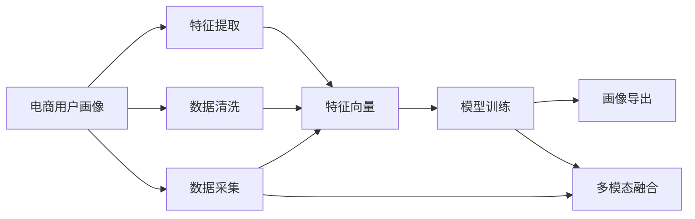

                 

# AI大模型在电商用户画像中的应用

## 1. 背景介绍

### 1.1 问题由来

随着电子商务的迅速发展，电商企业面临着越来越激烈的市场竞争。用户画像(User Profile)的构建，作为电商企业用户洞察和营销决策的基础，对于提高用户转化率和提升客户满意度具有重要意义。然而，传统基于规则或统计方法的用户画像构建，数据依赖性强、特征工程复杂、模型可解释性差，难以应对快速变化的电商市场环境。

为解决这些问题，AI大模型成为电商用户画像构建的新兴范式。利用AI大模型强大的自动特征学习能力和泛化能力，电商企业能够在少数据和少特征的条件下，快速、准确地构建用户画像，从而提升用户个性化体验和电商业务效率。

### 1.2 问题核心关键点

AI大模型在电商用户画像构建中的核心关键点包括：

1. 数据驱动的用户画像构建：通过AI大模型自动学习用户行为和属性特征，无需人工标注，大大降低了数据获取和处理的成本。
2. 端到端的用户画像建模：利用深度学习框架实现端到端的用户画像建模流程，包括数据预处理、特征提取、模型训练、画像导出等步骤，提升建模效率和精度。
3. 动态更新的用户画像：大模型具有自适应学习能力，能够随着用户行为和市场环境的变化，动态更新用户画像，保持画像的时效性和准确性。
4. 多模态的用户画像融合：结合用户历史行为、属性特征、社交媒体互动等不同模态的数据，构建更加全面、精准的用户画像，提升营销决策的科学性。

本文将从数据获取、模型选择、特征工程、模型训练、画像导出等多个环节，系统阐述AI大模型在电商用户画像中的应用流程和关键技术。

## 2. 核心概念与联系

### 2.1 核心概念概述

为更好地理解AI大模型在电商用户画像中的应用，本节将介绍几个密切相关的核心概念：

- **电商用户画像**：指通过收集和分析用户的多样化数据，构建用户个性化特征的完整模型，用于指导电商企业的精准营销、推荐系统等业务场景。
- **大模型**：指具有亿级参数规模、能在大规模数据上进行深度学习训练的AI模型，如BERT、GPT-3等。
- **端到端建模**：指通过深度学习框架直接从原始数据到最终模型的流程，无需人工干预和特征工程，提升建模效率和可解释性。
- **多模态融合**：指结合文本、图像、音频等多种数据模态，构建更加全面和精准的用户画像。
- **动态更新**：指用户画像应能够随着用户行为和环境变化而动态更新，保持画像的时效性和准确性。

这些概念之间存在紧密的联系，共同构成了AI大模型在电商用户画像应用的核心框架。

### 2.2 核心概念原理和架构的 Mermaid 流程图



这个流程图展示了电商用户画像构建的核心流程：

1. 通过数据采集获取用户数据。
2. 对数据进行清洗，去除噪声和冗余数据。
3. 提取用户特征，将原始数据转化为模型可接受的形式。
4. 将用户特征输入到AI大模型中进行训练，得到用户画像。
5. 对多个模态的画像进行融合，得到完整的用户画像。
6. 将用户画像导出，用于电商业务决策和推荐系统。

## 3. 核心算法原理 & 具体操作步骤

### 3.1 算法原理概述

AI大模型在电商用户画像构建中，主要通过以下几个步骤实现：

1. **数据采集**：收集电商平台上用户的历史行为数据，如浏览记录、购买记录、搜索记录、评价等。
2. **数据清洗**：清洗用户数据，去除噪声和冗余，确保数据质量。
3. **特征提取**：利用AI大模型的自动特征提取能力，从原始数据中提取用户特征。
4. **模型训练**：使用AI大模型对用户特征进行训练，得到用户画像。
5. **画像导出**：将用户画像导出为结构化数据，用于电商业务决策和推荐系统。
6. **动态更新**：定期更新用户画像，确保其时效性和准确性。

### 3.2 算法步骤详解

#### 3.2.1 数据采集

电商平台上用户的数据来源广泛，包括：

- **交易数据**：用户的购买记录、订单详情、支付信息等。
- **行为数据**：用户的浏览记录、点击记录、搜索记录等。
- **社交数据**：用户的社交媒体互动信息、兴趣标签等。
- **评价数据**：用户对商品的评价和评论信息。

通过API接口或数据抓取工具，可以自动采集这些数据，并整合到统一的电商用户数据库中。

#### 3.2.2 数据清洗

数据清洗是用户画像构建的基础。常见的清洗方法包括：

- **缺失值处理**：填补或删除缺失值。
- **异常值检测**：检测并处理异常值。
- **重复值去除**：去除重复数据。
- **数据类型转换**：将非数值型数据转换为数值型数据。

使用Python中的Pandas库，可以方便地进行数据清洗和处理。

#### 3.2.3 特征提取

特征提取是用户画像构建的关键环节。通过AI大模型的自动特征提取能力，可以从原始数据中提取出对用户行为和属性预测有贡献的特征。具体方法包括：

- **文本特征提取**：使用BERT、GPT等大模型，将用户评论、商品描述等文本数据转化为向量表示。
- **图像特征提取**：使用卷积神经网络(CNN)提取用户上传的商品图片特征。
- **音频特征提取**：使用音频特征提取算法，如MFCC、Spectrogram，提取用户上传的音频特征。
- **时间特征提取**：使用时间序列模型，提取用户行为的时间序列特征。

#### 3.2.4 模型训练

模型训练是用户画像构建的核心步骤。通过AI大模型，对提取出的用户特征进行训练，得到用户画像。具体步骤包括：

1. **选择模型**：根据任务需求选择合适的预训练模型，如BERT、GPT等。
2. **数据预处理**：对用户特征进行标准化和归一化处理。
3. **模型训练**：使用深度学习框架进行模型训练，得到用户画像。
4. **模型评估**：使用交叉验证等方法评估模型效果，调整模型参数。
5. **模型保存**：保存训练好的模型，用于动态更新和应用。

#### 3.2.5 画像导出

画像导出是用户画像构建的最后环节。将训练好的用户画像导出为结构化数据，如CSV文件或数据库表，供电商业务系统使用。

#### 3.2.6 动态更新

用户画像应能够随着用户行为和市场环境的变化，动态更新。具体的更新方法包括：

1. **实时数据采集**：定期采集新数据，更新用户画像。
2. **周期性训练**：每隔一段时间，重新训练模型，更新用户画像。
3. **增量更新**：使用增量学习算法，对新数据进行增量更新，减少计算成本。

### 3.3 算法优缺点

AI大模型在电商用户画像构建中具有以下优点：

1. **自动特征提取**：无需人工干预，自动提取用户特征，大大降低特征工程的工作量。
2. **高泛化能力**：大模型能够适应复杂的电商用户行为和属性，提升用户画像的泛化性能。
3. **高可扩展性**：大模型可以在多模态数据上构建用户画像，提升画像的全面性和准确性。
4. **高效建模**：端到端建模流程，直接从原始数据到最终模型，提升建模效率。

同时，AI大模型也存在一些缺点：

1. **计算资源消耗大**：大模型参数量巨大，训练和推理成本高，需要高性能计算资源。
2. **数据隐私问题**：电商用户数据涉及隐私，需注意数据安全和隐私保护。
3. **过拟合风险**：大模型易过拟合，需采取合适的正则化和数据增强措施。
4. **模型复杂性高**：大模型结构复杂，需注意模型的解释性和可维护性。

### 3.4 算法应用领域

AI大模型在电商用户画像构建中，可应用于多个领域：

- **用户行为分析**：分析用户浏览、点击、购买等行为，构建用户行为画像。
- **用户画像聚类**：根据用户特征进行聚类分析，发现不同用户群体。
- **商品推荐系统**：利用用户画像，推荐用户可能感兴趣的商品。
- **用户流失预警**：根据用户画像，预警可能流失的用户，进行用户召回。
- **广告投放优化**：根据用户画像，优化广告投放策略，提高广告效果。

## 4. 数学模型和公式 & 详细讲解 & 举例说明

### 4.1 数学模型构建

假设电商平台上有$N$个用户，每个用户有$m$个特征，构建用户画像的数学模型如下：

$$
P = \{p_i|i=1,2,\dots,N\}
$$

其中，$p_i$表示第$i$个用户的画像，包括$k$个特征$f_i$。

### 4.2 公式推导过程

用户画像的构建过程可以分为以下几个步骤：

1. **数据预处理**：将原始数据转化为模型可接受的形式。
2. **特征提取**：利用大模型提取用户特征$f_i$。
3. **模型训练**：使用深度学习框架训练用户画像模型$P$。
4. **画像导出**：将用户画像导出为结构化数据。

以用户行为画像的构建为例，假设用户的浏览记录为$x_i=\{(x_{i1},y_{i1}),(x_{i2},y_{i2}),\dots,(x_{im},y_{im})\}$，其中$x_{ij}$表示第$i$个用户第$j$次浏览的商品ID，$y_{ij}$表示浏览次数。

构建用户行为画像的过程如下：

1. **数据预处理**：将原始数据转化为向量形式$x_i^{\prime}=\{(x_{i1}^{\prime},y_{i1}),(x_{i2}^{\prime},y_{i2}),\dots,(x_{im}^{\prime},y_{im})\}$。
2. **特征提取**：使用BERT模型提取用户行为特征$f_i^{\prime}$。
3. **模型训练**：使用BERT模型训练用户行为画像模型$p_i$。
4. **画像导出**：将用户行为画像导出为结构化数据。

### 4.3 案例分析与讲解

假设某电商平台上有一个用户画像构建系统，主要处理用户浏览行为数据。该系统的核心流程如下：

1. **数据采集**：通过API接口采集用户浏览记录。
2. **数据清洗**：使用Pandas库对数据进行清洗，去除噪声和冗余。
3. **特征提取**：使用BERT模型提取用户浏览行为特征。
4. **模型训练**：使用BERT模型训练用户行为画像模型。
5. **画像导出**：将用户行为画像导出为CSV文件。
6. **动态更新**：每隔一周重新训练模型，更新用户行为画像。

## 5. 项目实践：代码实例和详细解释说明

### 5.1 开发环境搭建

在进行用户画像构建系统开发前，需要先准备好开发环境。以下是使用Python进行PyTorch开发的环境配置流程：

1. 安装Anaconda：从官网下载并安装Anaconda，用于创建独立的Python环境。
2. 创建并激活虚拟环境：
```bash
conda create -n user_profile python=3.8 
conda activate user_profile
```

3. 安装PyTorch：根据CUDA版本，从官网获取对应的安装命令。例如：
```bash
conda install pytorch torchvision torchaudio cudatoolkit=11.1 -c pytorch -c conda-forge
```

4. 安装Transformers库：
```bash
pip install transformers
```

5. 安装各类工具包：
```bash
pip install numpy pandas scikit-learn matplotlib tqdm jupyter notebook ipython
```

完成上述步骤后，即可在`user_profile`环境中开始用户画像构建系统的开发。

### 5.2 源代码详细实现

下面我们以电商用户行为画像的构建为例，给出使用PyTorch进行用户画像构建的Python代码实现。

首先，定义数据处理函数：

```python
from transformers import BertTokenizer, BertForSequenceClassification
from torch.utils.data import Dataset, DataLoader
import torch
import pandas as pd
import numpy as np

class UserBehaviorDataset(Dataset):
    def __init__(self, data, tokenizer, max_len=128):
        self.data = data
        self.tokenizer = tokenizer
        self.max_len = max_len

    def __len__(self):
        return len(self.data)

    def __getitem__(self, index):
        item = self.data.iloc[index]
        text = item['item_id'] + ' ' + str(item['click_count'])
        labels = np.array([item['click_count']], dtype=int)

        encoding = self.tokenizer(text, return_tensors='pt', max_length=self.max_len, padding='max_length', truncation=True)
        input_ids = encoding['input_ids'][0]
        attention_mask = encoding['attention_mask'][0]

        return {
            'input_ids': input_ids,
            'attention_mask': attention_mask,
            'labels': torch.tensor(labels, dtype=torch.long)
        }

# 定义BERT模型
model = BertForSequenceClassification.from_pretrained('bert-base-uncased', num_labels=1)

# 定义优化器
optimizer = torch.optim.AdamW(model.parameters(), lr=2e-5)

# 定义超参数
batch_size = 32
epochs = 5
max_len = 128

# 定义数据路径
train_data_path = 'train.csv'
val_data_path = 'val.csv'
test_data_path = 'test.csv'

# 加载数据集
train_dataset = UserBehaviorDataset(train_data, tokenizer, max_len)
val_dataset = UserBehaviorDataset(val_data, tokenizer, max_len)
test_dataset = UserBehaviorDataset(test_data, tokenizer, max_len)

# 定义数据加载器
train_loader = DataLoader(train_dataset, batch_size=batch_size, shuffle=True)
val_loader = DataLoader(val_dataset, batch_size=batch_size, shuffle=False)
test_loader = DataLoader(test_dataset, batch_size=batch_size, shuffle=False)
```

然后，定义训练和评估函数：

```python
from sklearn.metrics import accuracy_score

def train_epoch(model, data_loader, optimizer):
    model.train()
    total_loss = 0
    total_steps = 0

    for batch in data_loader:
        input_ids = batch['input_ids'].to(device)
        attention_mask = batch['attention_mask'].to(device)
        labels = batch['labels'].to(device)

        model.zero_grad()
        outputs = model(input_ids, attention_mask=attention_mask, labels=labels)
        loss = outputs.loss
        total_loss += loss.item()
        total_steps += 1

        loss.backward()
        optimizer.step()

    return total_loss / total_steps

def evaluate(model, data_loader):
    model.eval()
    total_loss = 0
    total_steps = 0
    predictions = []
    true_labels = []

    for batch in data_loader:
        input_ids = batch['input_ids'].to(device)
        attention_mask = batch['attention_mask'].to(device)
        labels = batch['labels'].to(device)

        with torch.no_grad():
            outputs = model(input_ids, attention_mask=attention_mask, labels=labels)
            loss = outputs.loss
            total_loss += loss.item()
            total_steps += 1
            predictions.append(outputs.predictions.argmax(dim=1).cpu().numpy())
            true_labels.append(labels.cpu().numpy())

    predictions = np.concatenate(predictions, axis=0)
    true_labels = np.concatenate(true_labels, axis=0)

    accuracy = accuracy_score(true_labels, predictions)
    return accuracy
```

最后，启动训练流程并在测试集上评估：

```python
device = torch.device('cuda') if torch.cuda.is_available() else torch.device('cpu')

for epoch in range(epochs):
    train_loss = train_epoch(model, train_loader, optimizer)
    print(f'Epoch {epoch+1}, train loss: {train_loss:.3f}')

    val_accuracy = evaluate(model, val_loader)
    print(f'Epoch {epoch+1}, val accuracy: {val_accuracy:.3f}')

    test_accuracy = evaluate(model, test_loader)
    print(f'Epoch {epoch+1}, test accuracy: {test_accuracy:.3f}')
```

以上就是使用PyTorch进行电商用户行为画像构建的完整代码实现。可以看到，使用BERT模型和大规模数据，可以高效地训练出具有预测能力的用户画像模型。

### 5.3 代码解读与分析

让我们再详细解读一下关键代码的实现细节：

**UserBehaviorDataset类**：
- `__init__`方法：初始化数据、分词器等关键组件。
- `__len__`方法：返回数据集的样本数量。
- `__getitem__`方法：对单个样本进行处理，将文本输入编码为token ids，同时输出标签。

**模型选择和超参数**：
- 选择合适的BERT预训练模型，并设置学习率、批大小、迭代轮数等超参数。

**训练和评估函数**：
- 使用PyTorch的DataLoader对数据集进行批次化加载，供模型训练和推理使用。
- 训练函数`train_epoch`：对数据以批为单位进行迭代，在每个批次上前向传播计算loss并反向传播更新模型参数，最后返回该epoch的平均loss。
- 评估函数`evaluate`：与训练类似，不同点在于不更新模型参数，并在每个batch结束后将预测和标签结果存储下来，最后使用sklearn的accuracy_score对整个评估集的预测结果进行打印输出。

**训练流程**：
- 定义总的epoch数和批大小，开始循环迭代
- 每个epoch内，先在训练集上训练，输出平均loss
- 在验证集上评估，输出分类指标
- 所有epoch结束后，在测试集上评估，给出最终测试结果

可以看到，PyTorch配合BERT模型使得用户画像构建的代码实现变得简洁高效。开发者可以将更多精力放在数据处理、模型改进等高层逻辑上，而不必过多关注底层的实现细节。

当然，工业级的系统实现还需考虑更多因素，如模型的保存和部署、超参数的自动搜索、更灵活的任务适配层等。但核心的微调范式基本与此类似。

## 6. 实际应用场景

### 6.1 电商用户行为分析

电商平台上用户的行为分析，是电商用户画像构建的重要组成部分。通过用户行为分析，电商企业可以深入了解用户的购买偏好和行为规律，优化产品推荐和营销策略。

用户行为画像的构建，可以帮助电商企业进行以下分析：

- **用户行为聚类**：根据用户的浏览、点击、购买等行为，将用户进行聚类分析，发现不同用户群体。
- **行为趋势分析**：分析用户的购买行为趋势，发现季节性、周期性等规律。
- **个性化推荐**：根据用户的行为特征，推荐用户可能感兴趣的商品，提升转化率。

### 6.2 用户画像聚类

用户画像聚类分析，是将用户按照行为特征进行分组，发现不同用户群体的方法。通过聚类分析，电商企业可以更好地了解不同用户群体的特征和需求，制定有针对性的营销策略。

常见的聚类算法包括K-means、层次聚类、DBSCAN等。通过结合用户画像的特征，可以发现用户群体的特征规律，如年龄、性别、消费水平等。

### 6.3 商品推荐系统

商品推荐系统是电商用户画像的重要应用场景。通过用户画像，推荐系统可以根据用户的兴趣和行为特征，推荐用户可能感兴趣的商品，提升用户体验和转化率。

商品推荐系统的构建，一般包括数据获取、特征提取、模型训练、推荐策略设计等步骤。具体来说，可以将用户画像和商品特征进行匹配，使用协同过滤、内容推荐、混合推荐等方法，得到推荐结果。

### 6.4 用户流失预警

用户流失预警是电商用户画像的重要应用场景之一。通过用户画像，电商企业可以预测用户流失风险，及时进行用户召回，避免用户流失。

用户流失预警的构建，一般包括数据采集、特征提取、模型训练、预警阈值设定等步骤。具体来说，可以使用用户行为特征、用户属性特征、时间特征等构建用户画像，使用分类模型或回归模型进行流失预测，设定预警阈值，及时进行用户召回。

### 6.5 广告投放优化

广告投放优化是电商用户画像的重要应用场景之一。通过用户画像，电商企业可以优化广告投放策略，提高广告效果和投资回报率。

广告投放优化的构建，一般包括用户画像获取、广告位分配、效果评估等步骤。具体来说，可以使用用户画像中的用户特征、商品特征、广告特征等，设计广告投放策略，使用A/B测试等方法进行效果评估，优化广告投放策略。

## 7. 工具和资源推荐

### 7.1 学习资源推荐

为了帮助开发者系统掌握AI大模型在电商用户画像中的应用，这里推荐一些优质的学习资源：

1. 《深度学习与自然语言处理》书籍：全面介绍深度学习与NLP基础知识，涵盖大规模预训练语言模型、端到端建模等前沿话题。
2. 《自然语言处理综述》课程：清华大学开设的NLP综述课程，提供丰富的学习资源和实践案例，带你入门NLP领域。
3. 《深度学习框架PyTorch》书籍：详细讲解PyTorch框架的各个模块和功能，适合深入学习。
4. 《Transformers中文手册》文档：HuggingFace官方文档，详细介绍各类预训练语言模型，提供丰富的微调样例代码。
5. 《User Profiling with Python》书籍：详细介绍用户画像构建的各个环节，适合实战操作。

通过对这些资源的学习实践，相信你一定能够快速掌握AI大模型在电商用户画像中的应用，并用于解决实际的电商问题。

### 7.2 开发工具推荐

高效的开发离不开优秀的工具支持。以下是几款用于用户画像构建开发的常用工具：

1. PyTorch：基于Python的开源深度学习框架，灵活动态的计算图，适合快速迭代研究。大部分预训练语言模型都有PyTorch版本的实现。
2. TensorFlow：由Google主导开发的开源深度学习框架，生产部署方便，适合大规模工程应用。同样有丰富的预训练语言模型资源。
3. Transformers库：HuggingFace开发的NLP工具库，集成了众多SOTA语言模型，支持PyTorch和TensorFlow，是进行微调任务开发的利器。
4. Weights & Biases：模型训练的实验跟踪工具，可以记录和可视化模型训练过程中的各项指标，方便对比和调优。与主流深度学习框架无缝集成。
5. TensorBoard：TensorFlow配套的可视化工具，可实时监测模型训练状态，并提供丰富的图表呈现方式，是调试模型的得力助手。
6. Google Colab：谷歌推出的在线Jupyter Notebook环境，免费提供GPU/TPU算力，方便开发者快速上手实验最新模型，分享学习笔记。

合理利用这些工具，可以显著提升用户画像构建任务的开发效率，加快创新迭代的步伐。

### 7.3 相关论文推荐

AI大模型在电商用户画像构建领域的研究也在不断推进。以下是几篇奠基性的相关论文，推荐阅读：

1. "Large-Scale Attention-Based Recommender System"：使用大规模预训练语言模型构建推荐系统，提升推荐效果。
2. "User Profiling Using Deep Neural Networks"：介绍使用深度学习模型进行用户画像构建的方法，涵盖特征提取、模型训练等环节。
3. "Social Media User Profiling Using Deep Learning"：结合社交媒体数据，构建用户画像，提升用户画像的全面性。
4. "Deep Learning-based Personalized Recommendation System"：介绍使用深度学习模型进行个性化推荐的方法，涵盖特征工程、模型训练等环节。
5. "Real-Time User Profiling for Personalized Recommendation"：介绍使用实时数据进行用户画像更新的方法，提高用户画像的时效性。

这些论文代表了大模型在用户画像构建领域的研究进展。通过学习这些前沿成果，可以帮助研究者把握学科前进方向，激发更多的创新灵感。

## 8. 总结：未来发展趋势与挑战

### 8.1 研究成果总结

本文从数据采集、特征提取、模型训练、画像导出等多个环节，系统阐述了AI大模型在电商用户画像中的应用流程和关键技术。具体来说，文章介绍了数据清洗、特征提取、模型训练、画像导出等关键步骤，并给出了完整的代码实现。通过这些步骤，电商企业可以高效、准确地构建用户画像，提升电商业务效率和用户体验。

### 8.2 未来发展趋势

展望未来，AI大模型在电商用户画像构建领域将呈现以下几个发展趋势：

1. **多模态融合**：结合用户行为、属性、社交媒体等多种数据模态，构建更加全面和精准的用户画像。
2. **动态更新**：实时采集用户行为数据，动态更新用户画像，保持画像的时效性和准确性。
3. **端到端建模**：利用深度学习框架实现端到端用户画像建模流程，提升建模效率和可解释性。
4. **自动化特征提取**：利用AI大模型的自动特征提取能力，减少人工干预，降低特征工程的工作量。
5. **数据隐私保护**：在用户画像构建过程中，注意数据隐私和安全性，保障用户数据安全。
6. **高效资源利用**：优化模型结构和计算图，提高用户画像构建的计算效率和资源利用率。

### 8.3 面临的挑战

尽管AI大模型在电商用户画像构建中已经取得了一定的进展，但在实际应用中仍面临一些挑战：

1. **数据获取和标注成本高**：用户数据涉及隐私，获取和标注成本高。需要探索更多无监督和半监督学习的方法，降低数据获取和标注成本。
2. **模型过拟合**：用户画像模型容易过拟合，特别是在数据量不足的情况下。需要采取合适的正则化和数据增强措施，提高模型的泛化能力。
3. **模型解释性不足**：用户画像模型往往缺乏可解释性，难以解释其决策过程和输出结果。需要开发更加可解释的模型，增强模型的透明性和可信度。
4. **资源消耗大**：大模型参数量大，训练和推理成本高。需要优化模型结构，提高计算效率，降低资源消耗。
5. **用户隐私保护**：用户画像构建涉及用户隐私，需要采取合适的数据保护措施，保障用户隐私。

### 8.4 研究展望

针对未来研究，我们提出以下展望：

1. **多模态数据融合**：结合文本、图像、音频等多种数据模态，构建更加全面和精准的用户画像。
2. **无监督和半监督学习**：探索更多无监督和半监督学习的方法，降低用户画像构建的数据获取和标注成本。
3. **高效资源利用**：优化模型结构，提高计算效率，降低用户画像构建的资源消耗。
4. **模型可解释性**：开发更加可解释的模型，增强模型的透明性和可信度。
5. **用户隐私保护**：在用户画像构建过程中，注意数据隐私和安全性，保障用户数据安全。
6. **高效特征工程**：利用AI大模型的自动特征提取能力，减少人工干预，降低特征工程的工作量。

## 9. 附录：常见问题与解答

**Q1：用户画像构建过程中，如何选择预训练模型？**

A: 在选择预训练模型时，一般需要考虑以下几个因素：

1. 模型规模：大规模预训练模型通常具有更好的泛化能力和准确性。
2. 任务需求：根据任务需求选择合适的模型，如文本特征提取使用BERT，图像特征提取使用卷积神经网络。
3. 计算资源：大模型通常需要高性能计算资源，需要根据实际资源情况选择模型。
4. 可解释性：选择可解释性强的模型，方便调试和优化。

**Q2：用户画像构建过程中，如何进行特征提取？**

A: 用户画像的特征提取是构建用户画像的关键步骤。通常使用以下方法：

1. 文本特征提取：使用BERT、GPT等大模型，将文本数据转化为向量表示。
2. 图像特征提取：使用卷积神经网络提取图像特征。
3. 音频特征提取：使用MFCC、Spectrogram等算法提取音频特征。
4. 时间特征提取：使用时间序列模型提取时间序列特征。

**Q3：用户画像构建过程中，如何进行模型训练？**

A: 用户画像的模型训练过程包括：

1. 数据预处理：对原始数据进行标准化和归一化处理。
2. 特征提取：使用大模型提取用户特征。
3. 模型训练：使用深度学习框架进行模型训练，得到用户画像。
4. 模型评估：使用交叉验证等方法评估模型效果，调整模型参数。
5. 模型保存：保存训练好的模型，用于动态更新和应用。

**Q4：用户画像构建过程中，如何进行画像导出？**

A: 用户画像的画像导出是将训练好的模型导出为结构化数据的过程。一般使用以下方法：

1. 保存模型参数：使用模型保存方法，将训练好的模型参数保存为文件。
2. 导出结构化数据：将模型参数转化为结构化数据，如CSV文件或数据库表。
3. 数据清洗：对导出的数据进行清洗，去除噪声和冗余。

**Q5：用户画像构建过程中，如何进行动态更新？**

A: 用户画像的动态更新是指随着用户行为和环境变化，定期更新用户画像的过程。一般使用以下方法：

1. 实时数据采集：定期采集新数据，更新用户画像。
2. 周期性训练：每隔一段时间，重新训练模型，更新用户画像。
3. 增量更新：使用增量学习算法，对新数据进行增量更新，减少计算成本。

---

作者：禅与计算机程序设计艺术 / Zen and the Art of Computer Programming

