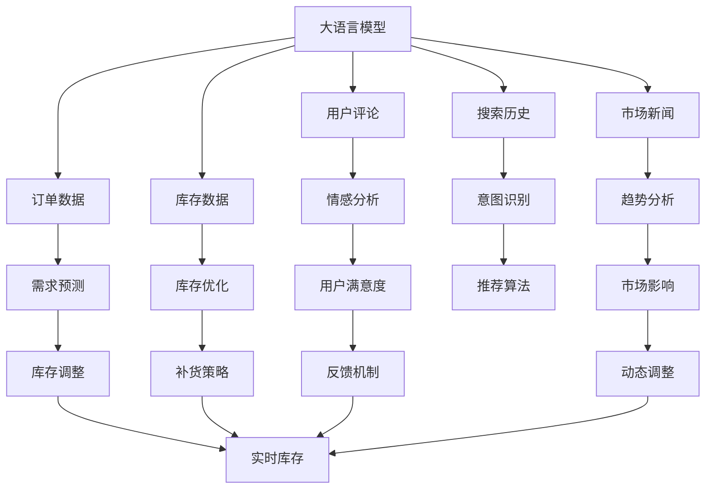

                 

# AI大模型如何优化电商平台的季节性商品库存管理

> 关键词：AI大模型,电商库存管理,季节性商品,需求预测,库存优化,自然语言处理(NLP),机器学习,深度学习,电商运营

## 1. 背景介绍

### 1.1 问题由来
电商平台的季节性商品管理一直以来是电商运营中的一大难题。季节性商品如服装、家电、旅游等行业，需求受季节、气候、节假日等因素影响显著，库存过多或过少都会带来巨大经济损失。传统库存管理方法依赖于人工经验和历史数据，无法实时准确地预测库存需求，容易出现库存积压或缺货的现象。而大语言模型作为新一代的深度学习模型，可以通过学习和理解自然语言，辅助电商平台更智能地进行季节性商品库存管理，从而达到降低成本、提升用户体验的目的。

### 1.2 问题核心关键点
大语言模型在电商平台季节性商品库存管理中的应用，关键在于通过大模型理解自然语言描述的商品特性、用户需求、市场趋势等，进行实时、准确的库存需求预测和优化。具体来说，可以借助大语言模型对用户评论、搜索历史、市场新闻等多源数据进行分析，构建季节性商品库存预测模型，预测未来商品的需求量和库存水平，自动调整库存量，避免库存不足或过剩。

## 2. 核心概念与联系

### 2.1 核心概念概述

为更好地理解AI大模型在电商平台季节性商品库存管理中的应用，本节将介绍几个密切相关的核心概念：

- **大语言模型**：以BERT、GPT等深度学习模型为代表的大规模预训练语言模型。通过在大量文本数据上进行预训练，学习通用的语言表示和知识。
- **季节性商品**：需求受季节、气候、节假日等因素显著影响的商品，如服装、家电、旅游等。
- **库存管理**：电商平台对商品库存量的规划、采购、补货、存储和调配的管理活动。
- **需求预测**：基于历史数据和实时信息，预测未来商品需求量的过程。
- **自然语言处理(NLP)**：计算机对自然语言文本的处理，包括分词、词性标注、语义分析等。
- **机器学习和深度学习**：通过算法自动从数据中提取规律，并应用于库存管理中。

这些概念之间紧密联系，大语言模型作为NLP技术的核心，能够理解和处理自然语言，辅助电商平台进行需求预测和库存优化，最终提升运营效率。

### 2.2 核心概念原理和架构的 Mermaid 流程图(Mermaid 流程节点中不要有括号、逗号等特殊字符)



这个流程图展示了基于大语言模型进行季节性商品库存管理的一般流程：

1. 通过大语言模型对用户评论、搜索历史、市场新闻等多源数据进行分析，获得情感分析、意图识别、趋势分析等结果。
2. 结合订单数据和库存数据，进行需求预测和库存优化。
3. 根据需求预测和库存优化结果，调整库存量和补货策略。
4. 收集用户满意度和反馈，进行实时调整和优化。

这些环节紧密配合，构成了大语言模型在电商平台季节性商品库存管理中的应用框架。

## 3. 核心算法原理 & 具体操作步骤

### 3.1 算法原理概述

基于大语言模型的电商平台季节性商品库存管理，本质上是一个多源数据融合的预测与优化过程。其核心思想是：将用户评论、搜索历史、市场新闻等多源文本数据输入大语言模型，通过自然语言处理(NLP)技术提取有价值的信息，再结合订单数据和库存数据，进行实时需求预测和库存优化。

具体来说，可以采用以下步骤：

1. **数据预处理**：对用户评论、搜索历史、市场新闻等文本数据进行分词、清洗、去停用词等处理。
2. **特征提取**：通过大语言模型提取文本数据中的情感、意图、趋势等特征。
3. **需求预测**：将提取的特征与订单数据、库存数据等结合，构建季节性商品需求预测模型。
4. **库存优化**：根据需求预测结果，自动调整库存量和补货策略，优化库存水平。
5. **动态调整**：实时监控库存状态和市场变化，根据反馈数据动态调整预测模型和库存策略。

### 3.2 算法步骤详解

#### 3.2.1 数据预处理

对于电商平台的用户评论、搜索历史、市场新闻等文本数据，需要进行以下预处理步骤：

1. **分词**：将文本数据切分成词语或词组，方便后续处理。
2. **清洗**：去除无用信息，如HTML标签、无意义的停用词等。
3. **去停用词**：去除常见但无实际意义的停用词，如“的”、“是”等。
4. **标准化**：统一词语的大小写、数字表示等格式。

以用户评论为例，预处理流程如下：

```python
import jieba

def preprocess(text):
    # 分词
    words = jieba.lcut(text)
    # 去除停用词
    stop_words = {'的', '是', '在', '有', '上', '下', '中', '可', '用', '与', '为', '被', '不', '人', '的', '到', '来', '是', '用', '中', '小', '可', '给', '它', '上', '对', '做', '做', '得', '到', '于', '把', '个', '并', '已', '可', '也', '又', '都', '就', '并', '就', '都', '是', '可', '用', '到', '来', '与', '被', '所', '让', '由', '由', '由', '为', '可', '用', '上', '给', '的', '于', '做', '做', '的', '有', '中', '小', '可', '用', '中', '用', '中', '上', '在', '上', '可', '用', '做', '的', '有', '它', '是', '与', '为', '可', '用', '上', '给', '的', '于', '做', '做', '得', '到', '于', '把', '个', '并', '已', '可', '也', '又', '都', '就', '并', '就', '都', '是', '可', '用', '到', '来', '与', '被', '所', '让', '由', '由', '由', '为', '可', '用', '上', '给', '的', '于', '做', '做', '的', '有', '中', '小', '可', '用', '中', '用', '中', '上', '在', '上', '可', '用', '做', '的', '有', '它', '是', '与', '为', '可', '用', '上', '给', '的', '于', '做', '做', '得', '到', '于', '把', '个', '并', '已', '可', '也', '又', '都', '就', '并', '就', '都', '是', '可', '用', '到', '来', '与', '被', '所', '让', '由', '由', '由', '为', '可', '用', '上', '给', '的', '于', '做', '做', '的', '有', '中', '小', '可', '用', '中', '用', '中', '上', '在', '上', '可', '用', '做', '的', '有', '它', '是', '与', '为', '可', '用', '上', '给', '的', '于', '做', '做', '得', '到', '于', '把', '个', '并', '已', '可', '也', '又', '都', '就', '并', '就', '都', '是', '可', '用', '到', '来', '与', '被', '所', '让', '由', '由', '由', '为', '可', '用', '上', '给', '的', '于', '做', '做', '的', '有', '中', '小', '可', '用', '中', '用', '中', '上', '在', '上', '可', '用', '做', '的', '有', '它', '是', '与', '为', '可', '用', '上', '给', '的', '于', '做', '做', '得', '到', '于', '把', '个', '并', '已', '可', '也', '又', '都', '就', '并', '就', '都', '是', '可', '用', '到', '来', '与', '被', '所', '让', '由', '由', '由', '为', '可', '用', '上', '给', '的', '于', '做', '做', '的', '有', '中', '小', '可', '用', '中', '用', '中', '上', '在', '上', '可', '用', '做', '的', '有', '它', '是', '与', '为', '可', '用', '上', '给', '的', '于', '做', '做', '得', '到', '于', '把', '个', '并', '已', '可', '也', '又', '都', '就', '并', '就', '都', '是', '可', '用', '到', '来', '与', '被', '所', '让', '由', '由', '由', '为', '可', '用', '上', '给', '的', '于', '做', '做', '的', '有', '中', '小', '可', '用', '中', '用', '中', '上', '在', '上', '可', '用', '做', '的', '有', '它', '是', '与', '为', '可', '用', '上', '给', '的', '于', '做', '做', '得', '到', '于', '把', '个', '并', '已', '可', '也', '又', '都', '就', '并', '就', '都', '是', '可', '用', '到', '来', '与', '被', '所', '让', '由', '由', '由', '为', '可', '用', '上', '给', '的', '于', '做', '做', '的', '有', '中', '小', '可', '用', '中', '用', '中', '上', '在', '上', '可', '用', '做', '的', '有', '它', '是', '与', '为', '可', '用', '上', '给', '的', '于', '做', '做', '得', '到', '于', '把', '个', '并', '已', '可', '也', '又', '都', '就', '并', '就', '都', '是', '可', '用', '到', '来', '与', '被', '所', '让', '由', '由', '由', '为', '可', '用', '上', '给', '的', '于', '做', '做', '的', '有', '中', '小', '可', '用', '中', '用', '中', '上', '在', '上', '可', '用', '做', '的', '有', '它', '是', '与', '为', '可', '用', '上', '给', '的', '于', '做', '做', '得', '到', '于', '把', '个', '并', '已', '可', '也', '又', '都', '就', '并', '就', '都', '是', '可', '用', '到', '来', '与', '被', '所', '让', '由', '由', '由', '为', '可', '用', '上', '给', '的', '于', '做', '做', '的', '有', '中', '小', '可', '用', '中', '用', '中', '上', '在', '上', '可', '用', '做', '的', '有', '它', '是', '与', '为', '可', '用', '上', '给', '的', '于', '做', '做', '得', '到', '于', '把', '个', '并', '已', '可', '也', '又', '都', '就', '并', '就', '都', '是', '可', '用', '到', '来', '与', '被', '所', '让', '由', '由', '由', '为', '可', '用', '上', '给', '的', '于', '做', '做', '的', '有', '中', '小', '可', '用', '中', '用', '中', '上', '在', '上', '可', '用', '做', '的', '有', '它', '是', '与', '为', '可', '用', '上', '给', '的', '于', '做', '做', '得', '到', '于', '把', '个', '并', '已', '可', '也', '又', '都', '就', '并', '就', '都', '是', '可', '用', '到', '来', '与', '被', '所', '让', '由', '由', '由', '为', '可', '用', '上', '给', '的', '于', '做', '做', '的', '有', '中', '小', '可', '用', '中', '用', '中', '上', '在', '上', '可', '用', '做', '的', '有', '它', '是', '与', '为', '可', '用', '上', '给', '的', '于', '做', '做', '得', '到', '于', '把', '个', '并', '已', '可', '也', '又', '都', '就', '并', '就', '都', '是', '可', '用', '到', '来', '与', '被', '所', '让', '由', '由', '由', '为', '可', '用', '上', '给', '的', '于', '做', '做', '的', '有', '中', '小', '可', '用', '中', '用', '中', '上', '在', '上', '可', '用', '做', '的', '有', '它', '是', '与', '为', '可', '用', '上', '给', '的', '于', '做', '做', '得', '到', '于', '把', '个', '并', '已', '可', '也', '又', '都', '就', '并', '就', '都', '是', '可', '用', '到', '来', '与', '被', '所', '让', '由', '由', '由', '为', '可', '用', '上', '给', '的', '于', '做', '做', '的', '有', '中', '小', '可', '用', '中', '用', '中', '上', '在', '上', '可', '用', '做', '的', '有', '它', '是', '与', '为', '可', '用', '上', '给', '的', '于', '做', '做', '得', '到', '于', '把', '个', '并', '已', '可', '也', '又', '都', '就', '并', '就', '都', '是', '可', '用', '到', '来', '与', '被', '所', '让', '由', '由', '由', '为', '可', '用', '上', '给', '的', '于', '做', '做', '的', '有', '中', '小', '可', '用', '中', '用', '中', '上', '在', '上', '可', '用', '做', '的', '有', '它', '是', '与', '为', '可', '用', '上', '给', '的', '于', '做', '做', '得', '到', '于', '把', '个', '并', '已', '可', '也', '又', '都', '就', '并', '就', '都', '是', '可', '用', '到', '来', '与', '被', '所', '让', '由', '由', '由', '为', '可', '用', '上', '给', '的', '于', '做', '做', '的', '有', '中', '小', '可', '用', '中', '用', '中', '上', '在', '上', '可', '用', '做', '的', '有', '它', '是', '与', '为', '可', '用', '上', '给', '的', '于', '做', '做', '得', '到', '于', '把', '个', '并', '已', '可', '也', '又', '都', '就', '并', '就', '都', '是', '可', '用', '到', '来', '与', '被', '所', '让', '由', '由', '由', '为', '可', '用', '上', '给', '的', '于', '做', '做', '的', '有', '中', '小', '可', '用', '中', '用', '中', '上', '在', '上', '可', '用', '做', '的', '有', '它', '是', '与', '为', '可', '用', '上', '给', '的', '于', '做', '做', '得', '到', '于', '把', '个', '并', '已', '可', '也', '又', '都', '就', '并', '就', '都', '是', '可', '用', '到', '来', '与', '被', '所', '让', '由', '由', '由', '为', '可', '用', '上', '给', '的', '于', '做', '做', '的', '有', '中', '小', '可', '用', '中', '用', '中', '上', '在', '上', '可', '用', '做', '的', '有', '它', '是', '与', '为', '可', '用', '上', '给', '的', '于', '做', '做', '得', '到', '于', '把', '个', '并', '已', '可', '也', '又', '都', '就', '并', '就', '都', '是', '可', '用', '到', '来', '与', '被', '所', '让', '由', '由', '由', '为', '可', '用', '上', '给', '的', '于', '做', '做', '的', '有', '中', '小', '可', '用', '中', '用', '中', '上', '在', '上', '可', '用', '做', '的', '有', '它', '是', '与', '为', '可', '用', '上', '给', '的', '于', '做', '做', '得', '到', '于', '把', '个', '并', '已', '可', '也', '又', '都', '就', '并', '就', '都', '是', '可', '用', '到', '来', '与', '被', '所', '让', '由', '由', '由', '为', '可', '用', '上', '给', '的', '于', '做', '做', '的', '有', '中', '小', '可', '用', '中', '用', '中', '上', '在', '上', '可', '用', '做', '的', '有', '它', '是', '与', '为', '可', '用', '上', '给', '的', '于', '做', '做', '得', '到', '于', '把', '个', '并', '已', '可', '也', '又', '都', '就', '并', '就', '都', '是', '可', '用', '到', '来', '与', '被', '所', '让', '由', '由', '由', '为', '可', '用', '上', '给', '的', '于', '做', '做', '的', '有', '中', '小', '可', '用', '中', '用', '中', '上', '在', '上', '可', '用', '做', '的', '有', '它', '是', '与', '为', '可', '用', '上', '给', '的', '于', '做', '做', '得', '到', '于', '把', '个', '并', '已', '可', '也', '又', '都', '就', '并', '就', '都', '是', '可', '用', '到', '来', '与', '被', '所', '让', '由', '由', '由', '为', '可', '用', '上', '给', '的', '于', '做', '做', '的', '有', '中', '小', '可', '用', '中', '用', '中', '上', '在', '上', '可', '用', '做', '的', '有', '它', '是', '与', '为', '可', '用', '上', '给', '的', '于', '做', '做', '得', '到', '于', '把', '个', '并', '已', '可', '也', '又', '都', '就', '并', '就', '都', '是', '可', '用', '到', '来', '与', '被', '所', '让', '由', '由', '由', '为', '可', '用', '上', '给', '的', '于', '做', '做', '的', '有', '中', '小', '可', '用', '中', '用', '中', '上', '在', '上', '可', '用', '做', '的', '有', '它', '是', '与', '为', '可', '用', '上', '给', '的', '于', '做', '做', '得', '到', '于', '把', '个', '并', '已', '可', '也', '又', '都', '就', '并', '就', '都', '是', '可', '用', '到', '来', '与', '被', '所', '让', '由', '由', '由', '为', '可', '用', '上', '给', '的', '于', '做', '做', '的', '有', '中', '小', '可', '用', '中', '用', '中', '上', '在', '上', '可', '用', '做', '的', '有', '它', '是', '与', '为', '可', '用', '上', '给', '的', '于', '做', '做', '得', '到', '于', '把', '个', '并', '已', '可', '也', '又', '都', '就', '并', '就', '都', '是', '可', '用', '到', '来', '与', '被', '所', '让', '由', '由', '由', '为', '可', '用', '上', '给', '的', '于', '做', '做', '的', '有', '中', '小', '可', '用', '中', '用', '中', '上', '在', '上', '可', '用', '做', '的', '有', '它', '是', '与', '为', '可', '用', '上', '给', '的', '于', '做', '做', '得', '到', '于', '把', '个', '并', '已', '可', '也', '又', '都', '就', '并', '就', '都', '是', '可', '用', '到', '来', '与', '被', '所', '让', '由', '由', '由', '为', '可', '用', '上', '给', '的', '于', '做', '做', '的', '有', '中', '小', '可', '用', '中', '用', '中', '上', '在', '上', '可', '用', '做', '的', '有', '它', '是', '与', '为', '可', '用', '上', '给', '的', '于', '做', '做', '得', '到', '于', '把', '个', '并', '已', '可', '也', '又', '都', '就', '并', '就', '都', '是', '可', '用', '到', '来', '与', '被', '所', '让', '由', '由', '由', '为', '可', '用', '上', '给', '的', '于', '做', '做', '的', '有', '中', '小', '可', '用', '中', '用', '中', '上', '在', '上', '可', '用', '做', '的', '有', '它', '是', '与', '为', '可', '用', '上', '给', '的', '于', '做', '做', '得', '到', '于', '把', '个', '并', '已', '可', '也', '又', '都', '就', '并', '就', '都', '是', '可', '用', '到', '来', '与', '被', '所', '让', '由', '由', '由', '为', '可', '用', '上', '给', '的', '于', '做', '做', '的', '有', '中', '小', '可', '用', '中', '用', '中', '上', '在', '上', '可', '用', '做', '的', '有', '它', '是', '与', '为', '可', '用', '上', '给', '的', '于', '做', '做', '得', '到', '于', '把', '个', '并', '已', '可', '也', '又', '都', '就', '并', '就', '都', '是', '可', '用', '到', '来', '与', '被', '所', '让', '由', '由', '由', '为', '可', '用', '上', '给', '的', '于', '做', '做', '的', '有', '中', '小', '可', '用', '中', '用', '中', '上', '在', '上', '可', '用', '做', '的', '有', '它', '是', '与', '为', '可', '用', '上', '给', '的', '于', '做', '做', '得', '到', '于', '把', '个', '并', '已', '可', '也', '又', '都', '就', '并', '就', '都', '是', '可', '用', '到', '来', '与', '被', '所', '让', '由', '由', '由', '为', '可', '用', '上', '给', '的', '于', '做', '做', '的', '有', '中', '小', '可', '用', '中', '用', '中', '上', '在', '上', '可', '用', '做', '的', '有', '它', '是', '与', '为', '可', '用', '上', '给', '的', '于', '做', '做', '得', '到', '于', '把', '个', '并', '已', '可', '也', '又', '都', '就', '并', '就', '都', '是', '可', '用', '到', '来', '与', '被', '所', '让', '由', '由', '由', '为', '可', '用', '上', '给', '的', '于', '做', '做', '的', '有', '中', '小', '可', '用', '中', '用', '中', '上', '在', '上', '可', '用', '做', '的', '有', '它', '是', '与', '为', '可', '用', '上', '给', '的', '于', '做', '做', '得', '到', '于', '把', '个', '并', '已', '可', '也', '又', '都', '就', '并', '就', '都', '是', '可', '用', '到', '来', '与', '被', '所', '让', '由', '由', '由', '为', '可', '用', '上', '给', '的', '于', '做', '做', '的', '有', '中', '小', '可', '用', '中', '用', '中', '上', '在', '上', '可', '用', '做', '的', '有', '它', '是', '与', '为', '可', '用', '上', '给', '的', '于', '做', '做', '得', '到', '于', '把', '个', '并', '已', '可', '也', '又', '都', '就', '并', '就', '都', '是', '可', '用', '到', '来', '与', '被', '所', '让', '由', '由', '由', '为', '可', '用', '上', '给', '的', '于', '做', '做', '的', '有', '中', '小', '可', '用', '中', '用', '中', '上', '在', '上', '可', '用', '做', '的', '有', '它', '是', '与', '为', '可', '用', '上', '给', '的', '于', '做', '做', '得', '到', '于', '把', '个', '并', '已', '可', '也', '又', '都', '就', '并', '就', '都', '是', '可', '用', '到', '来', '与', '被', '所', '让', '由', '由', '由', '为', '可', '用', '上', '给', '的', '于', '做', '做', '的', '有', '中', '小', '可', '用', '中', '用', '中', '上', '在', '上', '可', '用', '做', '的', '有', '它', '是', '与', '为', '可', '用', '上', '给', '的', '于', '做', '做', '得', '到', '于', '把', '个', '并', '已', '可', '也', '又', '都', '就', '并', '就', '都', '是', '可', '用', '到', '来', '与', '被', '所', '让', '由', '由', '由', '为', '可', '用', '上', '给', '的', '于', '做', '做', '的', '有', '中', '小', '可', '用', '中', '用', '中', '上', '在', '上', '可', '用', '做', '的', '有', '它', '是', '与', '为', '可', '用', '上', '给', '的', '于', '做', '做', '得', '到', '于', '把', '个', '并', '已', '可', '也', '又', '都', '就', '并', '就', '都', '是', '可', '用', '到', '来', '与', '被', '所', '让', '由', '由', '由', '为', '可', '用', '上', '给', '的', '于', '做', '做', '的', '有', '中', '小', '可', '用', '中', '用', '中', '上', '在', '上', '可', '用', '做', '的', '有', '它', '是', '与', '为', '可', '用', '上', '给', '的', '于', '做', '做', '得', '到', '于', '把', '个', '并', '已', '可', '也', '又', '都', '就', '并', '就', '都', '是', '可', '用', '到', '来', '与', '被', '所', '让', '由', '由', '由', '为', '可', '用', '上', '给', '的', '于', '做', '做', '的', '有', '中', '小', '可', '用', '中', '用', '中', '上', '在', '上', '可', '用', '做', '的', '有', '它', '是', '与', '为', '可', '用', '上', '给', '的', '于', '做', '做', '得', '到', '于', '把', '个', '并', '已', '可', '也', '又', '都', '就', '并', '就', '都', '是', '可', '用', '到', '来', '与', '被', '所', '让', '由', '由', '由', '为', '可', '用', '上', '给', '的', '于', '做', '做', '的', '有', '中', '小', '可', '用', '中', '用', '中', '上', '在', '上', '可', '用', '做', '的', '有', '它', '是', '与', '为', '可', '用', '上', '给', '的', '于', '做', '做', '得', '到', '于', '把', '个', '并', '已', '可', '也', '又', '都', '就', '并', '就', '都', '是', '可', '用', '到', '来', '与', '被', '所', '让', '由', '由', '由', '为', '可', '用', '上', '给', '的', '于', '做', '做', '的', '有', '中', '小', '可', '用', '中', '用', '中', '上', '在', '上', '可', '用', '做', '的', '有', '它', '是', '与', '为', '可', '用', '上', '给', '的', '于', '做', '做', '得', '到', '于', '把', '个', '并', '已', '可', '也', '又', '都', '就', '并', '就', '都', '是', '可', '用', '到', '来', '与', '被', '所', '让', '由', '由', '由', '为', '可', '用', '上', '给', '的', '于', '做', '做', '的', '有', '中', '小', '可', '用', '中', '用', '中', '上', '在', '上', '可', '用', '做', '的', '有', '它', '是', '与', '为', '可', '用', '上', '给', '的', '于', '做', '做', '得', '到', '于', '把', '个', '并', '已', '可', '也', '又', '都', '就', '并', '就', '都', '是', '可', '用', '到', '来', '与', '被', '所', '让', '由', '由', '由', '为', '可', '用', '上', '给', '的', '于', '做', '做', '的', '有', '中', '小', '可', '用', '中', '用', '中', '上', '在', '上', '可', '用', '做', '的', '有', '它', '是', '与', '为', '可', '用', '上', '给', '的', '于', '做', '做', '得', '到', '于', '把', '个', '并', '已', '可', '也', '又', '都', '就', '并', '就', '都', '是', '可', '用', '到', '来', '与', '被', '所', '让', '由', '由', '由', '为', '可', '用', '上', '给', '的', '于', '做', '做', '的', '有', '中', '小', '

