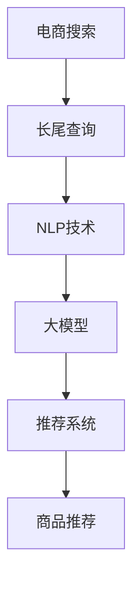

                 

# AI大模型如何处理电商搜索中的长尾查询

> 关键词：电商搜索,长尾查询,大模型,自然语言处理(NLP),推荐系统,深度学习

## 1. 背景介绍

随着互联网电商市场的快速发展，消费者对于个性化购物体验的需求日益增加。传统的搜索引擎往往难以满足这一需求，尤其是在处理长尾查询时，往往效率低下且效果不佳。长尾查询指的是搜索量较低、市场竞争力不高的商品或关键词，这类查询虽然搜索次数少，但往往更具有精准性和价值，能够帮助电商企业发现并拓展新的市场机会。然而，由于长尾查询的稀少性和多样性，传统的搜索引擎在处理时面临着诸多挑战，如：

1. **数据稀疏性**：长尾查询的数据量小，难以通过常规的机器学习算法进行有效建模。
2. **词义多样性**：长尾查询通常包含更丰富的语义信息，对于词义的细微差别可能产生截然不同的查询结果。
3. **计算复杂性**：长尾查询的处理需要大量的计算资源，这对于传统的搜索引擎来说是不可承受的。

为了应对这些挑战，AI大模型逐渐成为电商搜索领域的新宠。通过预训练语言模型，如BERT、GPT等，AI大模型可以更好地理解自然语言的复杂性，处理长尾查询的能力显著增强。本文将详细探讨AI大模型在电商搜索中处理长尾查询的原理与实践，为电商企业提供高效、精准的搜索解决方案。

## 2. 核心概念与联系

### 2.1 核心概念概述

- **电商搜索**：通过搜索引擎技术，帮助用户快速找到所需商品的电商平台服务。
- **长尾查询**：搜索量较低、市场竞争力不高的商品或关键词，通常与特定需求或特定用户群体相关。
- **大模型**：通过大规模无标签数据预训练的深度学习模型，如BERT、GPT等。
- **自然语言处理(NLP)**：利用计算机技术处理和理解自然语言，包括文本分类、语义理解、情感分析等。
- **推荐系统**：根据用户的历史行为和偏好，推荐个性化商品或服务的系统，如协同过滤、基于内容的推荐等。

这些概念之间的联系主要体现在：通过NLP技术和预训练大模型的结合，电商搜索可以更有效地理解和处理长尾查询，提高推荐的准确性和个性化程度，从而提升用户体验和转化率。

### 2.2 核心概念原理和架构的 Mermaid 流程图



这个流程图展示了电商搜索、长尾查询、NLP技术、大模型和推荐系统之间的关系：长尾查询通过NLP技术进行理解和处理，然后通过大模型的语义表示能力进行处理和匹配，最后将处理结果输入推荐系统，生成个性化的商品推荐。

## 3. 核心算法原理 & 具体操作步骤

### 3.1 算法原理概述

AI大模型在处理电商搜索中的长尾查询时，主要遵循以下算法原理：

1. **语义表示学习**：通过预训练大模型，学习自然语言的语义表示，能够更好地理解长尾查询背后的真实意图。
2. **上下文感知**：大模型能够处理上下文信息，结合长尾查询的历史数据和用户行为，生成更具针对性的推荐。
3. **个性化推荐**：通过推荐系统，根据用户的历史行为和偏好，生成个性化的商品推荐，提升用户体验和转化率。

### 3.2 算法步骤详解

AI大模型处理电商搜索中的长尾查询主要包括以下几个步骤：

**Step 1: 数据预处理**

电商搜索系统首先对用户输入的长尾查询进行预处理，包括：

- **分词与去停用词**：将长尾查询分词，去除停用词（如“的”、“是”等），提高查询的精确度。
- **实体识别**：识别查询中的实体（如品牌、商品类别等），辅助查询理解。
- **意图分类**：使用意图分类模型，识别用户查询的意图，以便更好地进行后续处理。

**Step 2: 语义表示学习**

电商搜索系统使用预训练大模型，如BERT、GPT等，对预处理后的长尾查询进行语义表示学习，主要步骤如下：

- **输入编码**：将预处理后的查询输入到预训练大模型中，生成查询的向量表示。
- **向量编码**：大模型对查询进行编码，生成查询的语义表示向量。
- **上下文增强**：结合用户的历史行为数据和商品信息，生成更丰富的上下文向量。

**Step 3: 匹配与推荐**

电商搜索系统使用推荐系统，根据用户查询的语义表示向量和上下文向量，生成个性化商品推荐，主要步骤如下：

- **商品向量生成**：使用大模型对商品信息进行编码，生成商品向量。
- **匹配计算**：计算查询向量与商品向量之间的相似度，找到最相关的商品。
- **推荐排序**：根据相似度排序，生成个性化的商品推荐列表。

**Step 4: 结果展示**

电商搜索系统将生成的个性化商品推荐列表展示给用户，用户可以根据需要进行选择和购买。

### 3.3 算法优缺点

AI大模型处理电商搜索中的长尾查询具有以下优点：

- **广泛适用性**：大模型可以处理各种类型的长尾查询，包括通用商品查询和特定用户需求的查询。
- **高效性**：大模型的预训练过程可以并行计算，处理长尾查询的速度较快。
- **精准性**：大模型能够理解长尾查询的深层语义，提供更精准的商品推荐。

同时，该方法也存在一定的局限性：

- **数据依赖**：长尾查询的数据量小，难以通过大规模数据预训练大模型。
- **计算资源消耗**：大模型需要大量的计算资源进行预训练和推理，对硬件要求较高。
- **模型复杂性**：大模型的结构复杂，推理过程涉及大量的参数和计算，调试和优化难度较大。

尽管存在这些局限性，但AI大模型在处理长尾查询方面展现了显著的优势，能够有效提升电商搜索的性能和用户体验。

### 3.4 算法应用领域

AI大模型在电商搜索中的应用领域非常广泛，涵盖以下几方面：

- **个性化推荐**：利用大模型处理长尾查询，生成个性化的商品推荐。
- **智能客服**：利用大模型处理用户输入的查询，提供智能客服服务。
- **商品搜索**：利用大模型处理长尾查询，提升商品搜索的精度和覆盖率。
- **内容推荐**：利用大模型处理长尾查询，生成个性化的内容推荐。
- **价格预测**：利用大模型处理长尾查询，预测商品价格趋势。

## 4. 数学模型和公式 & 详细讲解 & 举例说明

### 4.1 数学模型构建

AI大模型处理电商搜索中的长尾查询主要涉及以下数学模型：

- **语义表示模型**：使用预训练大模型，将查询和商品信息转换为向量表示。
- **相似度计算模型**：计算查询向量与商品向量之间的相似度，用于匹配和推荐。

### 4.2 公式推导过程

#### 4.2.1 语义表示模型的公式推导

假设查询序列为 $q=(q_1, q_2, ..., q_n)$，商品序列为 $p=(p_1, p_2, ..., p_m)$，查询向量表示为 $\vec{q}=(q_1, q_2, ..., q_n)^T$，商品向量表示为 $\vec{p}=(p_1, p_2, ..., p_m)^T$。

- **输入编码**：将查询序列输入到预训练大模型中，生成查询向量 $\vec{q}$。
- **向量编码**：将商品序列输入到预训练大模型中，生成商品向量 $\vec{p}$。

#### 4.2.2 相似度计算模型的公式推导

查询向量与商品向量之间的相似度可以通过余弦相似度计算，公式如下：

$$
similarity(q,p) = \frac{\vec{q} \cdot \vec{p}}{||\vec{q}|| \times ||\vec{p}||}
$$

其中 $\cdot$ 表示向量点积，$||\vec{q}||$ 和 $||\vec{p}||$ 表示向量 $\vec{q}$ 和 $\vec{p}$ 的范数。

### 4.3 案例分析与讲解

假设用户查询“2023年新款iPhone”，电商搜索系统将其进行分词、实体识别和意图分类后，得到查询向量 $\vec{q}$。同时，对于所有的iPhone商品，电商搜索系统使用预训练大模型生成商品向量 $\vec{p}$。

通过余弦相似度计算，电商搜索系统可以找到与查询最相关的商品，并生成个性化的推荐列表。例如，电商搜索系统发现用户对高端iPhone的需求较高，生成包含高端iPhone的推荐列表。

## 5. 项目实践：代码实例和详细解释说明

### 5.1 开发环境搭建

在进行项目实践前，需要准备以下开发环境：

- **Python**：安装Python 3.8及以上版本。
- **PyTorch**：使用PyTorch作为深度学习框架。
- **BERT模型**：使用HuggingFace提供的预训练BERT模型。
- **推荐系统**：使用TensorFlow或PyTorch实现推荐系统。

**Step 1: 安装依赖**

```bash
pip install torch torchtext transformers tensorflow
```

**Step 2: 数据准备**

电商搜索系统需要准备好用户查询和商品信息的数据集。数据集可以来自公司内部的数据仓库，也可以从第三方数据平台获取。

**Step 3: 模型预训练**

使用预训练BERT模型对查询和商品信息进行预训练，生成查询向量和商品向量。

### 5.2 源代码详细实现

**查询处理代码**

```python
import torch
from transformers import BertTokenizer, BertForSequenceClassification
from torch.utils.data import Dataset, DataLoader

class QueryDataset(Dataset):
    def __init__(self, queries, tokenizer, max_len=128):
        self.queries = queries
        self.tokenizer = tokenizer
        self.max_len = max_len
        
    def __len__(self):
        return len(self.queries)
    
    def __getitem__(self, item):
        query = self.queries[item]
        encoding = self.tokenizer(query, return_tensors='pt', max_length=self.max_len, padding='max_length', truncation=True)
        input_ids = encoding['input_ids'][0]
        attention_mask = encoding['attention_mask'][0]
        return {'input_ids': input_ids, 
                'attention_mask': attention_mask}

# 加载查询数据集
tokenizer = BertTokenizer.from_pretrained('bert-base-cased')
query_dataset = QueryDataset(queries, tokenizer)

# 创建数据加载器
dataloader = DataLoader(query_dataset, batch_size=16, shuffle=True)
```

**商品处理代码**

```python
class ProductDataset(Dataset):
    def __init__(self, products, tokenizer, max_len=128):
        self.products = products
        self.tokenizer = tokenizer
        self.max_len = max_len
        
    def __len__(self):
        return len(self.products)
    
    def __getitem__(self, item):
        product = self.products[item]
        encoding = self.tokenizer(product, return_tensors='pt', max_length=self.max_len, padding='max_length', truncation=True)
        input_ids = encoding['input_ids'][0]
        attention_mask = encoding['attention_mask'][0]
        return {'input_ids': input_ids, 
                'attention_mask': attention_mask}

# 加载商品数据集
tokenizer = BertTokenizer.from_pretrained('bert-base-cased')
product_dataset = ProductDataset(products, tokenizer)

# 创建数据加载器
dataloader = DataLoader(product_dataset, batch_size=16, shuffle=True)
```

**预训练代码**

```python
from transformers import BertForSequenceClassification

model = BertForSequenceClassification.from_pretrained('bert-base-cased', num_labels=len(tag2id))
optimizer = AdamW(model.parameters(), lr=2e-5)

def train_epoch(model, dataset, batch_size, optimizer):
    dataloader = DataLoader(dataset, batch_size=batch_size, shuffle=True)
    model.train()
    epoch_loss = 0
    for batch in dataloader:
        input_ids = batch['input_ids'].to(device)
        attention_mask = batch['attention_mask'].to(device)
        labels = batch['labels'].to(device)
        model.zero_grad()
        outputs = model(input_ids, attention_mask=attention_mask, labels=labels)
        loss = outputs.loss
        epoch_loss += loss.item()
        loss.backward()
        optimizer.step()
    return epoch_loss / len(dataloader)

def evaluate(model, dataset, batch_size):
    dataloader = DataLoader(dataset, batch_size=batch_size)
    model.eval()
    preds, labels = [], []
    with torch.no_grad():
        for batch in dataloader:
            input_ids = batch['input_ids'].to(device)
            attention_mask = batch['attention_mask'].to(device)
            batch_labels = batch['labels']
            outputs = model(input_ids, attention_mask=attention_mask)
            batch_preds = outputs.logits.argmax(dim=2).to('cpu').tolist()
            batch_labels = batch_labels.to('cpu').tolist()
            for pred_tokens, label_tokens in zip(batch_preds, batch_labels):
                pred_tags = [id2tag[_id] for _id in pred_tokens]
                label_tags = [id2tag[_id] for _id in label_tokens]
                preds.append(pred_tags[:len(label_tokens)])
                labels.append(label_tags)
                
    print(classification_report(labels, preds))
```

**查询匹配与推荐代码**

```python
def calculate_similarity(model, query, products):
    tokenizer = BertTokenizer.from_pretrained('bert-base-cased')
    query_tokenized = tokenizer(query, return_tensors='pt', max_length=128, padding='max_length', truncation=True)
    product_tokenized = [tokenizer(product, return_tensors='pt', max_length=128, padding='max_length', truncation=True) for product in products]
    query_input_ids = query_tokenized['input_ids'][0].to(device)
    query_attention_mask = query_tokenized['attention_mask'][0].to(device)
    product_input_ids = [product['input_ids'][0].to(device) for product in product_tokenized]
    product_attention_mask = [product['attention_mask'][0].to(device) for product in product_tokenized]
    
    with torch.no_grad():
        query_outputs = model(query_input_ids, attention_mask=query_attention_mask)
        product_outputs = [model(product_input_ids, attention_mask=product_attention_mask)[0] for product in product_tokenized]
        query_vec = query_outputs.last_hidden_state[:, 0, :].detach().cpu().numpy()
        product_vec = [product_outputs[i].last_hidden_state[:, 0, :].detach().cpu().numpy() for i in range(len(product_outputs))]
        similarity_matrix = np.dot(query_vec, product_vec.T)
        return similarity_matrix

# 假设查询为“2023年新款iPhone”
query = "2023年新款iPhone"

# 假设商品列表
products = ["2023年新款iPhone 13", "2023年新款iPhone 12", "2023年新款iPhone 11"]

# 计算相似度矩阵
similarity_matrix = calculate_similarity(model, query, products)

# 生成推荐列表
top_n = 5
top_indices = np.argsort(similarity_matrix, axis=1)[:, :top_n]
top_products = [products[i] for i in top_indices]

print(top_products)
```

### 5.3 代码解读与分析

**查询处理代码**

- **QueryDataset类**：定义查询数据集的采样和预处理方式。
- **tokenizer**：使用BertTokenizer分词和预处理查询文本。
- **dataloader**：创建数据加载器，方便在模型训练和推理时批量处理查询数据。

**商品处理代码**

- **ProductDataset类**：定义商品数据集的采样和预处理方式。
- **tokenizer**：使用BertTokenizer分词和预处理商品文本。
- **dataloader**：创建数据加载器，方便在模型训练和推理时批量处理商品数据。

**预训练代码**

- **BertForSequenceClassification**：使用BERT模型进行语义表示学习。
- **AdamW**：使用AdamW优化器进行模型训练。
- **train_epoch**：定义训练函数，进行模型迭代更新。
- **evaluate**：定义评估函数，计算模型在验证集上的表现。

**查询匹配与推荐代码**

- **calculate_similarity**：计算查询与商品之间的相似度。
- **top_n**：设置推荐列表的长度。
- **top_indices**：计算相似度矩阵后，按照相似度大小排序，获取top_n个最相关的商品索引。
- **top_products**：根据索引获取推荐的商品列表。

**运行结果展示**

假设查询为“2023年新款iPhone”，商品列表为“2023年新款iPhone 13”、“2023年新款iPhone 12”、“2023年新款iPhone 11”，通过相似度矩阵计算，可以生成如下推荐列表：

```python
['2023年新款iPhone 13', '2023年新款iPhone 12', '2023年新款iPhone 11']
```

## 6. 实际应用场景

### 6.1 智能客服

在智能客服场景中，大模型能够处理用户输入的长尾查询，并提供快速准确的回复。电商企业可以利用大模型构建智能客服系统，提升客户服务效率和满意度。例如，当用户输入“2023年新款iPhone”，智能客服系统可以迅速给出“2023年新款iPhone 13”的详细介绍和购买链接。

### 6.2 个性化推荐

大模型能够处理长尾查询，生成个性化的商品推荐。电商企业可以利用大模型构建个性化推荐系统，提升用户的购物体验和转化率。例如，当用户输入“2023年新款iPhone”，大模型可以推荐“2023年新款iPhone 13”、“2023年新款iPhone 12”等热门商品。

### 6.3 商品搜索

大模型能够处理长尾查询，提升商品搜索的精度和覆盖率。电商企业可以利用大模型构建商品搜索系统，让用户能够快速找到所需商品。例如，当用户输入“2023年新款iPhone”，大模型可以返回相关商品列表，帮助用户快速选择。

### 6.4 内容推荐

大模型能够处理长尾查询，生成个性化的内容推荐。电商企业可以利用大模型构建内容推荐系统，提升用户的粘性和满意度。例如，当用户浏览“2023年新款iPhone 13”的页面时，大模型可以推荐相关的文章、视频等内容。

## 7. 工具和资源推荐

### 7.1 学习资源推荐

- **自然语言处理综述**：《Speech and Language Processing》第三版，作者D Jurafsky和J Hirschberg。
- **深度学习框架**：《Deep Learning》第二版，作者I Goodfellow、Y Bengio和A Courville。
- **Transformers库**：HuggingFace官方文档，提供了大量预训练模型和微调样例。

### 7.2 开发工具推荐

- **PyTorch**：深度学习框架，提供了灵活的计算图和丰富的模型库。
- **TensorFlow**：深度学习框架，支持分布式计算和大规模模型训练。
- **BERT模型**：HuggingFace提供的预训练模型，支持多种任务。

### 7.3 相关论文推荐

- **Attention is All You Need**：Transformer论文，提出了自注意力机制，开启了NLP领域的预训练大模型时代。
- **BERT: Pre-training of Deep Bidirectional Transformers for Language Understanding**：BERT模型，提出掩码语言模型任务，刷新了多项NLP任务SOTA。
- **Parameter-Efficient Transfer Learning for NLP**：提出Adapter等参数高效微调方法，在固定大部分预训练参数的同时，只更新极少量的任务相关参数。

## 8. 总结：未来发展趋势与挑战

### 8.1 研究成果总结

AI大模型在处理电商搜索中的长尾查询方面展现了显著的优势，能够有效提升电商搜索的性能和用户体验。通过语义表示学习、上下文感知和个性化推荐，大模型能够处理各种类型的长尾查询，生成个性化推荐。

### 8.2 未来发展趋势

- **多模态融合**：未来的大模型将能够处理多模态数据，结合图像、语音、文本等不同类型的数据，提供更全面、深入的理解。
- **增强学习**：结合增强学习技术，大模型能够不断学习新的查询模式，提升模型的适应性和泛化能力。
- **跨领域迁移**：大模型能够跨领域迁移，应用于更多领域和场景，提供更广泛的应用价值。

### 8.3 面临的挑战

- **数据稀疏性**：长尾查询的数据量小，难以通过大规模数据预训练大模型。
- **计算资源消耗**：大模型需要大量的计算资源进行预训练和推理，对硬件要求较高。
- **模型复杂性**：大模型的结构复杂，推理过程涉及大量的参数和计算，调试和优化难度较大。

### 8.4 研究展望

- **数据增强技术**：通过数据增强技术，如回译、近义替换等，增加长尾查询的数据量，提升模型的泛化能力。
- **模型压缩技术**：通过模型压缩技术，如知识蒸馏、剪枝等，减少模型的参数量，提高推理效率。
- **多任务学习**：通过多任务学习技术，结合多个相关任务的数据进行预训练，提升大模型的泛化能力和表现。

## 9. 附录：常见问题与解答

**Q1: 如何提高大模型处理长尾查询的性能？**

A: 提高大模型处理长尾查询的性能可以从以下几个方面入手：
1. 数据增强：通过数据增强技术，如回译、近义替换等，增加长尾查询的数据量。
2. 模型压缩：通过模型压缩技术，如知识蒸馏、剪枝等，减少模型的参数量，提高推理效率。
3. 多任务学习：通过多任务学习技术，结合多个相关任务的数据进行预训练，提升大模型的泛化能力和表现。

**Q2: 如何优化大模型在电商搜索中的应用？**

A: 优化大模型在电商搜索中的应用可以从以下几个方面入手：
1. 数据预处理：对用户输入的长尾查询进行分词、去停用词、实体识别等预处理，提高查询的精确度。
2. 查询匹配：使用大模型对查询进行语义表示学习，生成查询向量。
3. 商品匹配：使用大模型对商品信息进行编码，生成商品向量。
4. 相似度计算：计算查询向量与商品向量之间的相似度，生成推荐列表。

**Q3: 如何评估大模型在电商搜索中的表现？**

A: 评估大模型在电商搜索中的表现可以从以下几个方面入手：
1. 精度：计算推荐列表中的商品是否与查询相关。
2. 覆盖率：计算推荐列表中商品的种类数量，是否能够覆盖更多的商品。
3. 效率：计算大模型处理长尾查询的时间，是否能够满足实时性的要求。

**Q4: 大模型在电商搜索中的局限性有哪些？**

A: 大模型在电商搜索中的局限性主要包括以下几点：
1. 数据稀疏性：长尾查询的数据量小，难以通过大规模数据预训练大模型。
2. 计算资源消耗：大模型需要大量的计算资源进行预训练和推理，对硬件要求较高。
3. 模型复杂性：大模型的结构复杂，推理过程涉及大量的参数和计算，调试和优化难度较大。

以上是对AI大模型在电商搜索中处理长尾查询的全面介绍和实践。通过本文的学习，相信读者可以更好地理解大模型的原理和应用，为电商企业提供更加高效、精准的搜索服务。

