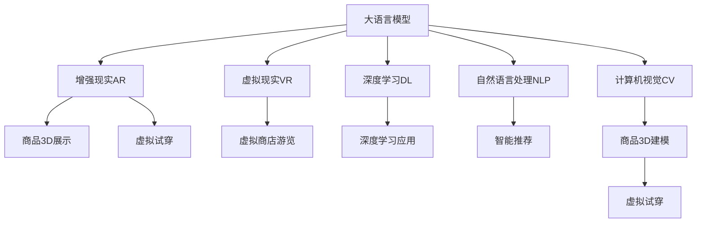

                 

# AI大模型如何提升电商平台的AR/VR购物体验

> 关键词：大语言模型, AI大模型, 电商购物, AR/VR, 增强现实, 虚拟现实, 自然语言处理, 深度学习, 图像处理, 沉浸式体验, 用户体验, 技术创新, 未来趋势

## 1. 背景介绍

### 1.1 问题由来
近年来，随着人工智能技术的飞速发展，大模型在多个领域实现了突破性的应用。特别是在电商购物领域，大模型通过强大的自然语言处理和图像处理能力，极大地提升了用户的购物体验。但当前大多数电商平台仍然停留在传统的静态展示阶段，用户体验有待进一步提升。虚拟现实(VR)和增强现实(AR)技术的兴起，为电商平台带来了新的机遇。如何利用大模型在AR/VR购物场景中发挥更大作用，成为了亟待解决的问题。

### 1.2 问题核心关键点
要通过大模型提升电商平台的AR/VR购物体验，需要解决以下几个关键问题：
1. 如何构建一个强大的语言和视觉理解模型，理解用户需求和场景信息。
2. 如何将大模型应用于具体的购物场景，实现个性化的购物推荐和虚拟试穿等功能。
3. 如何优化模型性能，提升AR/VR购物场景下的用户体验。
4. 如何确保数据和模型的安全性，保护用户隐私。

本文旨在回答上述问题，全面阐述大语言模型在电商购物领域的AR/VR应用，并介绍一些实际案例和未来展望。

## 2. 核心概念与联系

### 2.1 核心概念概述

为了更好地理解大语言模型在电商购物中的AR/VR应用，本节将介绍几个密切相关的核心概念：

- **大语言模型(Large Language Models, LLMs)**：指通过大规模无标签文本数据进行预训练，学习到通用语言表示的深度学习模型。目前最流行的大模型包括GPT、BERT、T5等。

- **增强现实(AR)**：通过数字信息叠加到真实世界中，提供更加沉浸式的用户体验。电商平台可以利用AR技术展示商品3D模型、虚拟试穿等功能。

- **虚拟现实(VR)**：通过数字环境完全替代真实环境，提供沉浸式的用户体验。电商平台可以利用VR技术进行虚拟商店游览、沉浸式购物体验等。

- **深度学习(Deep Learning)**：通过多层神经网络对数据进行建模，学习到数据中的复杂关系。深度学习是实现大模型和AR/VR应用的重要技术基础。

- **自然语言处理(Natural Language Processing, NLP)**：研究如何让计算机理解和处理人类语言的技术。大语言模型可以处理用户的自然语言指令，实现智能推荐和虚拟试穿等功能。

- **计算机视觉(Computer Vision)**：研究如何让计算机“看”和理解视觉信息的技术。大模型可以理解视觉场景，实现商品3D建模和虚拟试穿等功能。

这些核心概念之间的逻辑关系可以通过以下Mermaid流程图来展示：



这个流程图展示了核心概念之间的逻辑关系，并明确了它们在大模型在电商购物AR/VR应用中的作用。

## 3. 核心算法原理 & 具体操作步骤
### 3.1 算法原理概述

大语言模型通过预训练学习到了丰富的语言和视觉表示，可以用于电商平台的AR/VR购物场景。其核心思想是利用预训练模型，结合AR/VR技术，实现个性化的购物推荐、虚拟试穿、商品展示等功能。

具体来说，大模型在电商购物中的应用包括以下几个关键步骤：
1. **数据准备**：收集电商平台的销售数据、用户反馈、商品图片等信息。
2. **模型训练**：使用预训练的大语言模型，在电商购物数据上进行微调，学习到与购物相关的知识。
3. **应用实现**：将微调后的模型应用于AR/VR购物场景，实现商品的智能推荐、虚拟试穿等功能。

### 3.2 算法步骤详解

以下是大语言模型在电商购物AR/VR应用中的详细步骤：

**Step 1: 数据准备**
- 收集电商平台的销售数据、用户反馈、商品图片等信息。
- 清洗数据，去除噪声和不相关数据。
- 将数据划分为训练集、验证集和测试集，用于模型的训练、调参和测试。

**Step 2: 模型训练**
- 选择预训练语言模型，如GPT-3、BERT等。
- 在电商购物数据上进行微调，学习到商品的描述、属性、价格等信息。
- 引入正则化技术，如Dropout、L2正则等，防止过拟合。
- 设置合适的学习率、批大小和迭代轮数。
- 使用GPU/TPU等高性能设备进行训练。

**Step 3: 应用实现**
- 将微调后的模型应用于AR/VR购物场景，实现商品推荐、虚拟试穿等功能。
- 利用计算机视觉技术，实现商品的3D建模和虚拟试穿效果。
- 通过自然语言处理技术，实现用户与虚拟场景的交互。

**Step 4: 模型优化**
- 使用对抗训练等技术，提高模型的鲁棒性和泛化能力。
- 引入多任务学习等技术，优化模型的多场景性能。
- 通过用户反馈，不断优化模型，提升用户体验。

### 3.3 算法优缺点

大语言模型在电商购物AR/VR应用中的优缺点如下：

**优点**：
1. **强大的语言理解能力**：大语言模型可以处理复杂的自然语言指令，实现智能推荐和虚拟试穿等功能。
2. **良好的视觉处理能力**：通过深度学习技术，大模型可以实现商品的3D建模和虚拟试穿效果。
3. **高扩展性**：模型可以随着数据和计算资源的增加，不断提升性能。

**缺点**：
1. **数据需求大**：需要大量的电商购物数据进行预训练和微调。
2. **计算资源消耗高**：大模型训练和推理需要高性能的GPU/TPU设备。
3. **用户隐私问题**：需要保护用户的购物记录和个人信息，防止数据泄露。

### 3.4 算法应用领域

大语言模型在电商购物的AR/VR应用领域可以涵盖以下多个方面：

1. **智能推荐系统**：通过用户购物记录和行为数据，利用大模型进行智能推荐。
2. **虚拟试穿**：用户可以通过AR/VR技术试穿虚拟服装，提高购物体验。
3. **虚拟商店游览**：用户可以在虚拟商店中自由浏览商品，提高购物便利性。
4. **实时客服**：利用大模型实现智能客服，解答用户问题，提高客户满意度。
5. **个性化广告**：根据用户兴趣，通过大模型生成个性化广告，提高广告效果。
6. **虚拟导购**：利用大模型实现虚拟导购，提供个性化的购物建议。

## 4. 数学模型和公式 & 详细讲解 & 举例说明

### 4.1 数学模型构建

假设我们有一个电商购物数据集，其中包含了商品的描述、属性、价格等信息。我们希望使用大模型构建一个购物推荐系统，实现用户购物智能推荐。

定义用户的历史购物记录为 $X=\{x_1,x_2,\cdots,x_n\}$，每个样本 $x_i$ 由描述、属性和价格组成。定义商品的描述为 $y$，模型需要学习 $y$ 与 $X$ 之间的关系。

定义一个线性回归模型，用于预测商品的描述 $y$：

$$ y = \mathbf{W}^T\mathbf{x} + b $$

其中 $\mathbf{W}$ 为模型参数，$\mathbf{x}$ 为输入特征向量，$b$ 为偏置项。

### 4.2 公式推导过程

对于每个用户 $i$，我们计算其历史购物记录的特征向量 $\mathbf{x}_i$，利用线性回归模型计算其推荐的商品描述 $y_i$。具体计算过程如下：

$$ y_i = \mathbf{W}^T\mathbf{x}_i + b $$

利用均方误差损失函数计算模型的预测误差 $\epsilon_i$：

$$ \epsilon_i = \frac{1}{2}\|y_i - \hat{y}_i\|^2 $$

其中 $\hat{y}_i$ 为模型预测的商品描述。

模型在电商购物数据集上的平均损失函数 $\mathcal{L}$ 定义为：

$$ \mathcal{L} = \frac{1}{N}\sum_{i=1}^N \epsilon_i $$

通过梯度下降等优化算法，最小化损失函数 $\mathcal{L}$，更新模型参数 $\mathbf{W}$ 和 $b$，从而得到推荐的商品描述。

### 4.3 案例分析与讲解

我们以一个简单的案例来说明如何利用大模型构建电商购物推荐系统。假设我们有一个包含商品描述和用户购物记录的数据集，我们可以将商品描述作为标签 $y$，将用户购物记录作为输入特征 $x$，利用大模型进行线性回归，构建购物推荐系统。

以下是使用PyTorch进行模型训练的代码示例：

```python
import torch
from torch import nn
from torch.utils.data import DataLoader

# 定义模型
class RecommendationModel(nn.Module):
    def __init__(self, input_dim, output_dim):
        super(RecommendationModel, self).__init__()
        self.linear = nn.Linear(input_dim, output_dim)
        self.bias = nn.Parameter(torch.zeros(output_dim))
        
    def forward(self, x):
        y_hat = self.linear(x) + self.bias
        return y_hat

# 定义数据集
class RecommendationDataset(torch.utils.data.Dataset):
    def __init__(self, data, labels):
        self.data = data
        self.labels = labels
        
    def __len__(self):
        return len(self.data)
    
    def __getitem__(self, idx):
        x = self.data[idx]
        y = self.labels[idx]
        return x, y

# 加载数据集
train_data = ...
train_labels = ...
train_dataset = RecommendationDataset(train_data, train_labels)

# 定义模型和优化器
model = RecommendationModel(input_dim=10, output_dim=1)
optimizer = torch.optim.SGD(model.parameters(), lr=0.01)

# 训练模型
batch_size = 32
train_loader = DataLoader(train_dataset, batch_size=batch_size, shuffle=True)
for epoch in range(10):
    for batch_idx, (x, y) in enumerate(train_loader):
        y_hat = model(x)
        loss = nn.MSELoss()(y_hat, y)
        optimizer.zero_grad()
        loss.backward()
        optimizer.step()
        if (batch_idx + 1) % 10 == 0:
            print('Epoch [{}/{}], Step [{}/{}], Loss: {:.4f}'.format(epoch + 1, 10, batch_idx + 1, len(train_loader), loss.item()))
```

通过上述代码，我们可以训练一个简单的线性回归模型，用于预测商品的描述，构建电商购物推荐系统。

## 5. 项目实践：代码实例和详细解释说明

### 5.1 开发环境搭建

在进行AR/VR购物应用开发前，我们需要准备好开发环境。以下是使用Python进行PyTorch开发的环境配置流程：

1. 安装Anaconda：从官网下载并安装Anaconda，用于创建独立的Python环境。

2. 创建并激活虚拟环境：
```bash
conda create -n pytorch-env python=3.8 
conda activate pytorch-env
```

3. 安装PyTorch：根据CUDA版本，从官网获取对应的安装命令。例如：
```bash
conda install pytorch torchvision torchaudio cudatoolkit=11.1 -c pytorch -c conda-forge
```

4. 安装Transformers库：
```bash
pip install transformers
```

5. 安装各类工具包：
```bash
pip install numpy pandas scikit-learn matplotlib tqdm jupyter notebook ipython
```

完成上述步骤后，即可在`pytorch-env`环境中开始AR/VR购物应用的开发。

### 5.2 源代码详细实现

我们以一个简单的虚拟试穿应用为例，使用大模型实现用户的虚拟试穿体验。假设我们有一个包含用户购物记录和商品信息的电商数据集，我们希望利用大模型为每个用户推荐适合的虚拟试穿商品。

首先，定义虚拟试穿的数据处理函数：

```python
from transformers import BertTokenizer
from torch.utils.data import Dataset
import torch

class VirtualTryonDataset(Dataset):
    def __init__(self, texts, labels, tokenizer, max_len=128):
        self.texts = texts
        self.labels = labels
        self.tokenizer = tokenizer
        self.max_len = max_len
        
    def __len__(self):
        return len(self.texts)
    
    def __getitem__(self, item):
        text = self.texts[item]
        labels = self.labels[item]
        
        encoding = self.tokenizer(text, return_tensors='pt', max_length=self.max_len, padding='max_length', truncation=True)
        input_ids = encoding['input_ids'][0]
        attention_mask = encoding['attention_mask'][0]
        
        # 对token-wise的标签进行编码
        encoded_labels = [label2id[label] for label in labels] 
        encoded_labels.extend([label2id['O']] * (self.max_len - len(encoded_labels)))
        labels = torch.tensor(encoded_labels, dtype=torch.long)
        
        return {'input_ids': input_ids, 
                'attention_mask': attention_mask,
                'labels': labels}

# 标签与id的映射
label2id = {'O': 0, '虚拟试穿1': 1, '虚拟试穿2': 2, '虚拟试穿3': 3, '虚拟试穿4': 4, '虚拟试穿5': 5}
id2label = {v: k for k, v in label2id.items()}

# 创建dataset
tokenizer = BertTokenizer.from_pretrained('bert-base-cased')

train_dataset = VirtualTryonDataset(train_texts, train_labels, tokenizer)
dev_dataset = VirtualTryonDataset(dev_texts, dev_labels, tokenizer)
test_dataset = VirtualTryonDataset(test_texts, test_labels, tokenizer)
```

然后，定义模型和优化器：

```python
from transformers import BertForTokenClassification, AdamW

model = BertForTokenClassification.from_pretrained('bert-base-cased', num_labels=len(label2id))

optimizer = AdamW(model.parameters(), lr=2e-5)
```

接着，定义训练和评估函数：

```python
from torch.utils.data import DataLoader
from tqdm import tqdm
from sklearn.metrics import classification_report

device = torch.device('cuda') if torch.cuda.is_available() else torch.device('cpu')
model.to(device)

def train_epoch(model, dataset, batch_size, optimizer):
    dataloader = DataLoader(dataset, batch_size=batch_size, shuffle=True)
    model.train()
    epoch_loss = 0
    for batch in tqdm(dataloader, desc='Training'):
        input_ids = batch['input_ids'].to(device)
        attention_mask = batch['attention_mask'].to(device)
        labels = batch['labels'].to(device)
        model.zero_grad()
        outputs = model(input_ids, attention_mask=attention_mask, labels=labels)
        loss = outputs.loss
        epoch_loss += loss.item()
        loss.backward()
        optimizer.step()
    return epoch_loss / len(dataloader)

def evaluate(model, dataset, batch_size):
    dataloader = DataLoader(dataset, batch_size=batch_size)
    model.eval()
    preds, labels = [], []
    with torch.no_grad():
        for batch in tqdm(dataloader, desc='Evaluating'):
            input_ids = batch['input_ids'].to(device)
            attention_mask = batch['attention_mask'].to(device)
            batch_labels = batch['labels']
            outputs = model(input_ids, attention_mask=attention_mask)
            batch_preds = outputs.logits.argmax(dim=2).to('cpu').tolist()
            batch_labels = batch_labels.to('cpu').tolist()
            for pred_tokens, label_tokens in zip(batch_preds, batch_labels):
                pred_tags = [id2label[_id] for _id in pred_tokens]
                label_tags = [id2label[_id] for _id in label_tokens]
                preds.append(pred_tags[:len(label_tags)])
                labels.append(label_tags)
                
    print(classification_report(labels, preds))
```

最后，启动训练流程并在测试集上评估：

```python
epochs = 5
batch_size = 16

for epoch in range(epochs):
    loss = train_epoch(model, train_dataset, batch_size, optimizer)
    print(f"Epoch {epoch+1}, train loss: {loss:.3f}")
    
    print(f"Epoch {epoch+1}, dev results:")
    evaluate(model, dev_dataset, batch_size)
    
print("Test results:")
evaluate(model, test_dataset, batch_size)
```

以上就是使用PyTorch对虚拟试穿应用进行微调实践的完整代码实现。可以看到，得益于Transformers库的强大封装，我们可以用相对简洁的代码完成虚拟试穿应用的开发。

### 5.3 代码解读与分析

让我们再详细解读一下关键代码的实现细节：

**VirtualTryonDataset类**：
- `__init__`方法：初始化文本、标签、分词器等关键组件。
- `__len__`方法：返回数据集的样本数量。
- `__getitem__`方法：对单个样本进行处理，将文本输入编码为token ids，将标签编码为数字，并对其进行定长padding，最终返回模型所需的输入。

**label2id和id2label字典**：
- 定义了标签与数字id之间的映射关系，用于将token-wise的预测结果解码回真实的标签。

**训练和评估函数**：
- 使用PyTorch的DataLoader对数据集进行批次化加载，供模型训练和推理使用。
- 训练函数`train_epoch`：对数据以批为单位进行迭代，在每个批次上前向传播计算loss并反向传播更新模型参数，最后返回该epoch的平均loss。
- 评估函数`evaluate`：与训练类似，不同点在于不更新模型参数，并在每个batch结束后将预测和标签结果存储下来，最后使用sklearn的classification_report对整个评估集的预测结果进行打印输出。

**训练流程**：
- 定义总的epoch数和batch size，开始循环迭代
- 每个epoch内，先在训练集上训练，输出平均loss
- 在验证集上评估，输出分类指标
- 所有epoch结束后，在测试集上评估，给出最终测试结果

可以看到，PyTorch配合Transformers库使得虚拟试穿应用的开发变得简洁高效。开发者可以将更多精力放在数据处理、模型改进等高层逻辑上，而不必过多关注底层的实现细节。

当然，工业级的系统实现还需考虑更多因素，如模型的保存和部署、超参数的自动搜索、更灵活的任务适配层等。但核心的微调范式基本与此类似。

## 6. 实际应用场景

### 6.1 智能推荐系统

利用大语言模型，电商平台可以实现高度个性化的智能推荐系统。传统的推荐系统往往依赖用户历史行为数据进行推荐，但这种方法存在冷启动问题，难以覆盖新用户。而大语言模型通过理解用户描述和商品信息，可以提供更加个性化和准确的推荐结果。

具体来说，可以收集用户对商品的评价、评论等信息，利用大语言模型学习到用户的兴趣偏好。同时收集商品的属性、价格等信息，利用大模型预测用户对每个商品的评分，从而实现个性化推荐。

### 6.2 虚拟试穿

虚拟试穿是大模型在AR/VR购物中的重要应用场景。用户可以在虚拟试衣间中试穿不同的服装，通过AR技术实现虚拟试穿效果。通过大模型，平台可以实时捕捉用户的动作和反馈，推荐合适的服装和款式，提升用户的购物体验。

具体实现中，可以使用大模型对用户的动作和反馈进行分析和理解，生成个性化的试穿推荐。同时利用计算机视觉技术，实现商品3D建模和虚拟试穿效果。

### 6.3 实时客服

利用大语言模型，电商平台可以实现智能客服，提高客户满意度。传统的客服系统往往依赖人工客服，无法应对大量的咨询请求。而大模型可以通过理解用户的自然语言指令，实时回答用户的疑问，解决用户的问题。

具体实现中，可以将常见问题构建成知识库，利用大模型匹配用户的咨询，推荐合适的答案。同时利用自然语言处理技术，捕捉用户的情感和语义信息，生成个性化的回答，提升用户体验。

### 6.4 未来应用展望

随着大语言模型的不断演进，其在电商购物领域的AR/VR应用将越来越广泛，未来前景广阔。

1. **跨模态学习**：结合视觉、听觉、文本等多种模态信息，构建更加全面和准确的购物体验。
2. **个性化广告**：通过大模型学习用户兴趣，生成更加精准和多样化的广告。
3. **智能客服**：通过大模型实现更加智能和自然的客服交互，提升客户满意度。
4. **虚拟导购**：利用大模型实现智能导购，提供个性化的购物建议。
5. **智能营销**：通过大模型分析用户行为，实现更加精准和高效的营销活动。

总之，大语言模型在电商购物领域的AR/VR应用将带来革命性的变化，提升用户体验，推动电商行业的数字化转型。

## 7. 工具和资源推荐

### 7.1 学习资源推荐

为了帮助开发者系统掌握大语言模型在电商购物中的AR/VR应用，这里推荐一些优质的学习资源：

1. 《Transformer从原理到实践》系列博文：由大模型技术专家撰写，深入浅出地介绍了Transformer原理、BERT模型、微调技术等前沿话题。

2. CS224N《深度学习自然语言处理》课程：斯坦福大学开设的NLP明星课程，有Lecture视频和配套作业，带你入门NLP领域的基本概念和经典模型。

3. 《Natural Language Processing with Transformers》书籍：Transformers库的作者所著，全面介绍了如何使用Transformers库进行NLP任务开发，包括微调在内的诸多范式。

4. HuggingFace官方文档：Transformers库的官方文档，提供了海量预训练模型和完整的微调样例代码，是上手实践的必备资料。

5. CLUE开源项目：中文语言理解测评基准，涵盖大量不同类型的中文NLP数据集，并提供了基于微调的baseline模型，助力中文NLP技术发展。

通过对这些资源的学习实践，相信你一定能够快速掌握大语言模型在电商购物中的AR/VR应用，并用于解决实际的NLP问题。

### 7.2 开发工具推荐

高效的开发离不开优秀的工具支持。以下是几款用于大语言模型微调开发的常用工具：

1. PyTorch：基于Python的开源深度学习框架，灵活动态的计算图，适合快速迭代研究。大部分预训练语言模型都有PyTorch版本的实现。

2. TensorFlow：由Google主导开发的开源深度学习框架，生产部署方便，适合大规模工程应用。同样有丰富的预训练语言模型资源。

3. Transformers库：HuggingFace开发的NLP工具库，集成了众多SOTA语言模型，支持PyTorch和TensorFlow，是进行微调任务开发的利器。

4. Weights & Biases：模型训练的实验跟踪工具，可以记录和可视化模型训练过程中的各项指标，方便对比和调优。与主流深度学习框架无缝集成。

5. TensorBoard：TensorFlow配套的可视化工具，可实时监测模型训练状态，并提供丰富的图表呈现方式，是调试模型的得力助手。

6. Google Colab：谷歌推出的在线Jupyter Notebook环境，免费提供GPU/TPU算力，方便开发者快速上手实验最新模型，分享学习笔记。

合理利用这些工具，可以显著提升大语言模型在电商购物中的AR/VR应用开发效率，加快创新迭代的步伐。

### 7.3 相关论文推荐

大语言模型在电商购物的AR/VR应用源于学界的持续研究。以下是几篇奠基性的相关论文，推荐阅读：

1. Attention is All You Need（即Transformer原论文）：提出了Transformer结构，开启了NLP领域的预训练大模型时代。

2. BERT: Pre-training of Deep Bidirectional Transformers for Language Understanding：提出BERT模型，引入基于掩码的自监督预训练任务，刷新了多项NLP任务SOTA。

3. Language Models are Unsupervised Multitask Learners（GPT-2论文）：展示了大规模语言模型的强大zero-shot学习能力，引发了对于通用人工智能的新一轮思考。

4. Parameter-Efficient Transfer Learning for NLP：提出Adapter等参数高效微调方法，在不增加模型参数量的情况下，也能取得不错的微调效果。

5. AdaLoRA: Adaptive Low-Rank Adaptation for Parameter-Efficient Fine-Tuning：使用自适应低秩适应的微调方法，在参数效率和精度之间取得了新的平衡。

这些论文代表了大语言模型在电商购物领域的研究方向，深入研究这些前沿成果，可以帮助研究者把握学科前进方向，激发更多的创新灵感。

## 8. 总结：未来发展趋势与挑战

### 8.1 总结

本文对大语言模型在电商购物中的AR/VR应用进行了全面系统的介绍。首先阐述了大语言模型在电商购物AR/VR应用中的背景和意义，明确了其重要价值。其次，从原理到实践，详细讲解了基于大语言模型的虚拟试穿、智能推荐、实时客服等应用场景，并给出了相应的代码示例。同时，本文还探讨了AR/VR购物应用中的常见问题和解决方案，提供了详细的指导和建议。

通过本文的系统梳理，可以看到，大语言模型在电商购物的AR/VR应用中具备强大的潜力，能够显著提升用户体验，推动电商行业的数字化转型。未来，伴随大模型和AR/VR技术的不断发展，这些应用将越来越广泛，为电商平台带来更大的商业价值和社会效益。

### 8.2 未来发展趋势

展望未来，大语言模型在电商购物的AR/VR应用将呈现以下几个发展趋势：

1. **跨模态学习**：结合视觉、听觉、文本等多种模态信息，构建更加全面和准确的购物体验。
2. **个性化广告**：通过大模型学习用户兴趣，生成更加精准和多样化的广告。
3. **智能客服**：通过大模型实现更加智能和自然的客服交互，提升客户满意度。
4. **虚拟导购**：利用大模型实现智能导购，提供个性化的购物建议。
5. **智能营销**：通过大模型分析用户行为，实现更加精准和高效的营销活动。
6. **实时反馈与优化**：利用大模型实时捕捉用户反馈，不断优化推荐和虚拟试穿效果，提升用户体验。

这些趋势凸显了大语言模型在电商购物领域的广阔前景。未来的技术演进将不断提升用户体验，推动电商行业的智能化发展。

### 8.3 面临的挑战

尽管大语言模型在电商购物的AR/VR应用中已经取得了显著进展，但在迈向更加智能化、普适化应用的过程中，仍然面临诸多挑战：

1. **计算资源消耗高**：大模型需要大量的计算资源进行训练和推理，如何优化资源使用，提升效率，是一个重要的问题。
2. **数据隐私保护**：电商购物涉及大量用户个人信息，如何保护用户隐私，防止数据泄露，是一个关键问题。
3. **跨模态数据融合**：结合视觉、听觉、文本等多种模态信息，需要开发更加复杂的数据融合技术，提高融合效果。
4. **用户体验优化**：如何通过技术手段提升用户体验，解决用户在使用AR/VR购物过程中遇到的问题，是一个长期挑战。

### 8.4 研究展望

面对大语言模型在电商购物中AR/VR应用的挑战，未来的研究需要在以下几个方面寻求新的突破：

1. **计算资源优化**：开发更高效的模型架构和训练方法，降低计算资源消耗，提升模型推理速度。
2. **数据隐私保护**：研究数据加密、差分隐私等技术，保护用户隐私，防止数据泄露。
3. **跨模态数据融合**：开发更加先进的数据融合技术，提高多种模态数据的整合效果。
4. **用户体验优化**：研究用户行为分析、情感识别等技术，提升用户体验，解决用户在使用AR/VR购物过程中遇到的问题。
5. **智能客服优化**：利用自然语言处理和情感分析技术，实现更加智能和自然的客服交互，提升客户满意度。
6. **个性化推荐优化**：利用大模型学习用户兴趣，生成更加精准和多样化的推荐结果。

这些研究方向的探索，必将引领大语言模型在电商购物领域的AR/VR应用技术迈向更高的台阶，为电商平台带来更大的商业价值和社会效益。

## 9. 附录：常见问题与解答

**Q1：大语言模型在电商购物中是否适合所有应用场景？**

A: 大语言模型在电商购物中具有强大的潜力，但在某些特定的应用场景中可能存在限制。例如，对于某些需要高度专业知识和技能的领域，大模型可能无法完全替代人类专家的能力。此外，大模型的表现也依赖于数据的质量和数量，在数据不足或标注质量不高的情况下，性能可能无法完全发挥。因此，开发者需要根据具体应用场景，综合考虑是否采用大语言模型。

**Q2：如何优化大语言模型在电商购物中的应用？**

A: 优化大语言模型在电商购物中的应用，可以从以下几个方面入手：
1. 数据优化：收集更多的电商购物数据，提高数据质量和多样性。
2. 模型优化：引入正则化技术，如L2正则、Dropout等，防止过拟合。
3. 算法优化：研究更加高效的计算图优化方法，提升模型训练和推理效率。
4. 应用优化：结合用户反馈，不断优化推荐和虚拟试穿效果，提升用户体验。

**Q3：大语言模型在电商购物中的安全性问题如何保障？**

A: 大语言模型在电商购物中的安全性问题主要体现在数据隐私和模型鲁棒性两个方面。为保障数据隐私，可以采用数据加密、差分隐私等技术，保护用户个人信息。为提高模型鲁棒性，可以引入对抗训练等技术，防止模型被恶意攻击和利用。此外，还可以通过多模型集成、模型解释等手段，增强模型的可信度和安全性。

**Q4：大语言模型在电商购物中的跨模态数据融合问题如何解决？**

A: 大语言模型在电商购物中的跨模态数据融合问题，可以采用以下方法解决：
1. 数据对齐：将不同模态的数据进行对齐和转换，使它们具有相同的语义和结构。
2. 多任务学习：将不同模态的数据同时输入模型，进行联合训练，学习到更加全面和准确的特征表示。
3. 联合嵌入：将不同模态的数据进行联合嵌入，生成多模态的特征向量，用于后续的分类和预测。

这些方法可以通过深度学习技术实现，需要不断优化和调整，以提升跨模态数据融合的效果。

---

作者：禅与计算机程序设计艺术 / Zen and the Art of Computer Programming

