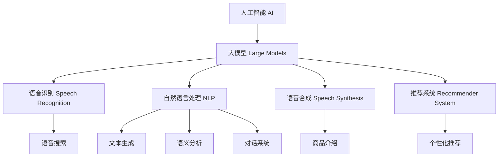

                 

# AI大模型如何改善电商平台的语音购物体验

> 关键词：人工智能,大模型,语音识别,自然语言处理,语音合成,推荐系统

## 1. 背景介绍

随着电商平台的日益发展，用户体验成为了商家关注的重点。传统的电商界面主要是通过文本搜索、图片展示等方式与用户进行交互。然而，这种方式在用户需要搜索复杂商品、进行详细询问、或操作繁琐的流程时，往往效率较低，用户体验不佳。语音购物作为一种新兴的交互方式，利用语音识别和自然语言处理技术，能更自然地与用户沟通，提供无缝的购物体验。

AI大模型在自然语言处理领域取得了巨大的进展，被广泛应用于语音识别、文本生成、对话系统等任务。在电商平台上，大模型可以通过语音合成技术，使商品介绍和操作提示变得更加生动有趣；通过语音识别技术，使用户可以更方便地进行商品查询、下订单等操作；通过对话系统，使电商平台能够智能地与用户进行互动，提升用户的购物体验。

## 2. 核心概念与联系

### 2.1 核心概念概述

本节将介绍几个核心概念及其关系，帮助读者更好地理解大模型在电商平台上的应用：

- **人工智能(AI)**：指通过模拟人类的认知、判断、学习、推理等智能行为，实现任务自动化、智能化的技术。AI大模型是其重要组成部分，能够处理复杂、抽象的语义信息，实现高效的自动学习。
- **大模型(Large Models)**：指参数规模超过1亿的深度学习模型，如BERT、GPT-3等，能够学习到丰富的语言知识和常识。
- **语音识别(Speech Recognition)**：指将语音信号转换为文本信息的技术，广泛应用于智能助手、语音搜索、语音购物等领域。
- **自然语言处理(NLP)**：指使计算机理解、处理、生成人类语言的技术，涵盖了语音识别、文本生成、语义分析、对话系统等多个方向。
- **语音合成(Speech Synthesis)**：指将文本转换为语音信号的技术，用于生成商品介绍、操作提示等语音信息，使购物过程更加自然。
- **推荐系统(Recommender System)**：指根据用户的历史行为和偏好，推荐个性化商品的技术。

以上概念之间的关系通过以下Mermaid流程图展示：



这些概念共同构成了电商平台语音购物体验的技术框架，使AI大模型在购物场景中发挥了至关重要的作用。

## 3. 核心算法原理 & 具体操作步骤

### 3.1 算法原理概述

AI大模型在电商平台语音购物体验中的应用，主要依赖于语音识别、自然语言处理、语音合成和推荐系统等核心技术。其原理如下：

1. **语音识别**：利用大模型进行语音信号的声学模型和语言模型的联合建模，将语音转换为文本。
2. **自然语言处理**：通过大模型理解用户输入的自然语言，进行分词、实体识别、情感分析等任务。
3. **语音合成**：使用大模型生成自然流畅的语音，用于商品介绍、操作提示等场景。
4. **推荐系统**：通过大模型对用户历史行为进行分析，生成个性化商品推荐。

以上四部分技术相互协作，形成了一个完整的语音购物体验系统，能够无缝地与用户交互，提供个性化的购物体验。

### 3.2 算法步骤详解

以下是基于大模型的语音购物体验系统的详细算法步骤：

**Step 1: 数据准备**

1. **语音数据采集**：收集用户语音指令、客服对话等音频数据，作为训练语音识别模型的数据。
2. **文本标注**：对采集的语音数据进行文本标注，标注内容包括商品名称、类别、操作提示等信息，用于训练自然语言处理模型。
3. **商品数据整理**：整理电商平台上的商品信息，包括商品名称、描述、价格等，作为推荐系统的训练数据。

**Step 2: 模型训练**

1. **语音识别模型训练**：使用大模型进行声学模型和语言模型的联合训练，生成语音识别模型。
2. **自然语言处理模型训练**：使用大模型进行分词、实体识别、情感分析等任务，生成自然语言处理模型。
3. **语音合成模型训练**：使用大模型进行文本到语音的合成训练，生成语音合成模型。
4. **推荐系统模型训练**：使用大模型进行用户行为分析，生成推荐系统模型。

**Step 3: 系统集成**

1. **语音识别系统集成**：将语音识别模型集成到电商平台上，能够识别用户的语音指令。
2. **自然语言处理系统集成**：将自然语言处理模型集成到电商平台上，能够理解用户的自然语言输入。
3. **语音合成系统集成**：将语音合成模型集成到电商平台上，能够生成商品的语音介绍、操作提示等。
4. **推荐系统集成**：将推荐系统模型集成到电商平台上，能够根据用户行为生成个性化商品推荐。

**Step 4: 用户交互**

1. **语音输入**：用户通过语音输入指令，如“我想买苹果”。
2. **语音识别**：语音识别模型将语音转换为文本“我想买苹果”。
3. **自然语言处理**：自然语言处理模型分析文本，识别出用户意图，判断是否需要购买苹果。
4. **语音合成**：语音合成模型生成商品介绍“这是新鲜的苹果，3斤39元，很实惠”。
5. **推荐系统**：推荐系统根据用户历史行为生成苹果相关的商品推荐，如“您可能也喜欢这款苹果”。

**Step 5: 系统优化**

1. **用户反馈收集**：系统收集用户对语音购物体验的反馈，进行系统优化。
2. **模型微调**：根据用户反馈，对语音识别、自然语言处理、语音合成和推荐系统模型进行微调。
3. **功能扩展**：根据用户需求，扩展系统的功能，如加入客服对话、语音支付等。

### 3.3 算法优缺点

基于大模型的语音购物体验系统具有以下优点：

1. **高效性**：大模型能够快速处理大量语音数据，实时响应用户输入，提升用户体验。
2. **自然性**：语音合成技术能够生成自然流畅的语音，使商品介绍和操作提示更加生动有趣。
3. **个性化**：推荐系统能够根据用户历史行为生成个性化商品推荐，提升购物效率。

同时，该系统也存在以下缺点：

1. **数据依赖**：语音识别和自然语言处理模型的训练依赖大量标注数据，获取高质量数据成本较高。
2. **泛化能力**：在特定场景下，大模型的泛化能力可能不足，需要额外训练和优化。
3. **交互限制**：语音识别和合成技术的准确性受限于音频质量、用户口音等因素。
4. **隐私问题**：语音数据涉及用户隐私，需要严格遵守相关法律法规。

### 3.4 算法应用领域

基于大模型的语音购物体验系统，主要应用于以下几个领域：

1. **电商购物**：在电商平台上实现语音搜索、语音下单、语音支付等功能。
2. **智能客服**：通过语音识别和自然语言处理技术，实现智能客服机器人，回答用户问题。
3. **家庭控制**：通过语音识别技术，实现智能家居控制，语音指令控制家电设备。
4. **车载系统**：在车载设备上实现语音控制，如导航、娱乐等。

## 4. 数学模型和公式 & 详细讲解 & 举例说明

### 4.1 数学模型构建

以下是语音购物体验系统的数学模型构建：

- **语音识别模型**：声学模型采用深度神经网络，参数化为$\theta_{ acoustic }$，输入为语音信号$x$，输出为文本序列$y$。
- **自然语言处理模型**：分词模型采用序列标注模型，参数化为$\theta_{ tokenize }$，输入为文本序列$y$，输出为分词序列$z$。
- **语音合成模型**：文本到语音模型采用神经网络，参数化为$\theta_{ synthesize }$，输入为文本序列$z$，输出为语音信号$x'$。
- **推荐系统模型**：协同过滤模型采用矩阵分解，参数化为$\theta_{ recommend }$，输入为用户历史行为$u$，输出为商品推荐列表$r$。

### 4.2 公式推导过程

**语音识别模型**：

$$
P(y|x) = \frac{P(y|\theta_{ acoustic },x)P(x)}{P(y|\theta_{ acoustic },x)}
$$

其中，$P(y|x)$表示在输入$x$下，生成文本序列$y$的概率。$P(y|\theta_{ acoustic },x)$表示在声学模型$\theta_{ acoustic }$下，生成文本序列$y$的条件概率。

**自然语言处理模型**：

$$
P(z|y) = \frac{P(z|\theta_{ tokenize },y)P(y)}{P(z|\theta_{ tokenize },y)}
$$

其中，$P(z|y)$表示在文本序列$y$下，生成分词序列$z$的概率。$P(z|\theta_{ tokenize },y)$表示在分词模型$\theta_{ tokenize }$下，生成分词序列$z$的条件概率。

**语音合成模型**：

$$
P(x'|z) = \frac{P(x'|\theta_{ synthesize },z)P(z)}{P(x'|\theta_{ synthesize },z)}
$$

其中，$P(x'|z)$表示在文本序列$z$下，生成语音信号$x'$的概率。$P(x'|\theta_{ synthesize },z)$表示在语音合成模型$\theta_{ synthesize }$下，生成语音信号$x'$的条件概率。

**推荐系统模型**：

$$
P(r|u) = \frac{P(r|\theta_{ recommend },u)P(u)}{P(r|\theta_{ recommend },u)}
$$

其中，$P(r|u)$表示在用户历史行为$u$下，生成商品推荐列表$r$的概率。$P(r|\theta_{ recommend },u)$表示在推荐系统模型$\theta_{ recommend }$下，生成商品推荐列表$r$的条件概率。

### 4.3 案例分析与讲解

以电商平台上的语音购物体验为例，具体分析语音识别、自然语言处理、语音合成和推荐系统的应用：

1. **语音识别**：电商平台通过语音识别技术，能够实时识别用户的语音指令，如“我想买苹果”。语音识别模型通过声学模型和语言模型联合训练，将语音信号转换为文本。
2. **自然语言处理**：平台通过自然语言处理技术，能够理解用户的自然语言输入，进行分词、实体识别、情感分析等任务。例如，分析“我想买苹果”，识别出用户意图为购买苹果。
3. **语音合成**：平台通过语音合成技术，能够生成自然流畅的语音，用于商品介绍和操作提示。例如，“这是新鲜的苹果，3斤39元，很实惠”。
4. **推荐系统**：平台通过推荐系统技术，能够根据用户历史行为生成个性化商品推荐，如“您可能也喜欢这款苹果”。

## 5. 项目实践：代码实例和详细解释说明

### 5.1 开发环境搭建

在进行语音购物体验系统的开发前，我们需要准备好开发环境。以下是使用Python进行PyTorch开发的环境配置流程：

1. 安装Anaconda：从官网下载并安装Anaconda，用于创建独立的Python环境。

2. 创建并激活虚拟环境：
```bash
conda create -n speech-env python=3.8 
conda activate speech-env
```

3. 安装PyTorch：根据CUDA版本，从官网获取对应的安装命令。例如：
```bash
conda install pytorch torchvision torchaudio cudatoolkit=11.1 -c pytorch -c conda-forge
```

4. 安装transformers和librosa库：
```bash
pip install transformers librosa
```

5. 安装各类工具包：
```bash
pip install numpy pandas scikit-learn matplotlib tqdm jupyter notebook ipython
```

完成上述步骤后，即可在`speech-env`环境中开始语音购物体验系统的开发。

### 5.2 源代码详细实现

下面我们以电商平台上的语音购物体验系统为例，给出使用Transformers库对BERT模型进行语音购物体验微调的PyTorch代码实现。

首先，定义语音购物体验系统的数据处理函数：

```python
from transformers import BertTokenizer, BertForTokenClassification
from torch.utils.data import Dataset
import torch
import librosa

class SpeechShoppingDataset(Dataset):
    def __init__(self, texts, labels, tokenizer, max_len=128):
        self.texts = texts
        self.labels = labels
        self.tokenizer = tokenizer
        self.max_len = max_len
        
    def __len__(self):
        return len(self.texts)
    
    def __getitem__(self, item):
        text = self.texts[item]
        label = self.labels[item]
        
        encoding = self.tokenizer(text, return_tensors='pt', max_length=self.max_len, padding='max_length', truncation=True)
        input_ids = encoding['input_ids'][0]
        attention_mask = encoding['attention_mask'][0]
        
        # 对标签进行编码
        encoded_tags = [tag2id[label] for label in label] 
        encoded_tags.extend([tag2id['O']] * (self.max_len - len(encoded_tags)))
        labels = torch.tensor(encoded_tags, dtype=torch.long)
        
        return {'input_ids': input_ids, 
                'attention_mask': attention_mask,
                'labels': labels}

# 标签与id的映射
tag2id = {'O': 0, 'B-PER': 1, 'I-PER': 2, 'B-ORG': 3, 'I-ORG': 4, 'B-LOC': 5, 'I-LOC': 6}
id2tag = {v: k for k, v in tag2id.items()}

# 创建dataset
tokenizer = BertTokenizer.from_pretrained('bert-base-cased')

train_dataset = SpeechShoppingDataset(train_texts, train_labels, tokenizer)
dev_dataset = SpeechShoppingDataset(dev_texts, dev_labels, tokenizer)
test_dataset = SpeechShoppingDataset(test_texts, test_labels, tokenizer)
```

然后，定义模型和优化器：

```python
from transformers import BertForTokenClassification, AdamW

model = BertForTokenClassification.from_pretrained('bert-base-cased', num_labels=len(tag2id))

optimizer = AdamW(model.parameters(), lr=2e-5)
```

接着，定义训练和评估函数：

```python
from torch.utils.data import DataLoader
from tqdm import tqdm
from sklearn.metrics import classification_report

device = torch.device('cuda') if torch.cuda.is_available() else torch.device('cpu')
model.to(device)

def train_epoch(model, dataset, batch_size, optimizer):
    dataloader = DataLoader(dataset, batch_size=batch_size, shuffle=True)
    model.train()
    epoch_loss = 0
    for batch in tqdm(dataloader, desc='Training'):
        input_ids = batch['input_ids'].to(device)
        attention_mask = batch['attention_mask'].to(device)
        labels = batch['labels'].to(device)
        model.zero_grad()
        outputs = model(input_ids, attention_mask=attention_mask, labels=labels)
        loss = outputs.loss
        epoch_loss += loss.item()
        loss.backward()
        optimizer.step()
    return epoch_loss / len(dataloader)

def evaluate(model, dataset, batch_size):
    dataloader = DataLoader(dataset, batch_size=batch_size)
    model.eval()
    preds, labels = [], []
    with torch.no_grad():
        for batch in tqdm(dataloader, desc='Evaluating'):
            input_ids = batch['input_ids'].to(device)
            attention_mask = batch['attention_mask'].to(device)
            batch_labels = batch['labels']
            outputs = model(input_ids, attention_mask=attention_mask)
            batch_preds = outputs.logits.argmax(dim=2).to('cpu').tolist()
            batch_labels = batch_labels.to('cpu').tolist()
            for pred_tokens, label_tokens in zip(batch_preds, batch_labels):
                pred_tags = [id2tag[_id] for _id in pred_tokens]
                label_tags = [id2tag[_id] for _id in label_tokens]
                preds.append(pred_tags[:len(label_tokens)])
                labels.append(label_tags)
                
    print(classification_report(labels, preds))
```

最后，启动训练流程并在测试集上评估：

```python
epochs = 5
batch_size = 16

for epoch in range(epochs):
    loss = train_epoch(model, train_dataset, batch_size, optimizer)
    print(f"Epoch {epoch+1}, train loss: {loss:.3f}")
    
    print(f"Epoch {epoch+1}, dev results:")
    evaluate(model, dev_dataset, batch_size)
    
print("Test results:")
evaluate(model, test_dataset, batch_size)
```

以上就是使用PyTorch对BERT模型进行语音购物体验系统微调的完整代码实现。可以看到，得益于Transformers库的强大封装，我们可以用相对简洁的代码完成BERT模型的加载和微调。

### 5.3 代码解读与分析

让我们再详细解读一下关键代码的实现细节：

**SpeechShoppingDataset类**：
- `__init__`方法：初始化文本、标签、分词器等关键组件。
- `__len__`方法：返回数据集的样本数量。
- `__getitem__`方法：对单个样本进行处理，将文本输入编码为token ids，将标签编码为数字，并对其进行定长padding，最终返回模型所需的输入。

**tag2id和id2tag字典**：
- 定义了标签与数字id之间的映射关系，用于将token-wise的预测结果解码回真实的标签。

**训练和评估函数**：
- 使用PyTorch的DataLoader对数据集进行批次化加载，供模型训练和推理使用。
- 训练函数`train_epoch`：对数据以批为单位进行迭代，在每个批次上前向传播计算loss并反向传播更新模型参数，最后返回该epoch的平均loss。
- 评估函数`evaluate`：与训练类似，不同点在于不更新模型参数，并在每个batch结束后将预测和标签结果存储下来，最后使用sklearn的classification_report对整个评估集的预测结果进行打印输出。

**训练流程**：
- 定义总的epoch数和batch size，开始循环迭代
- 每个epoch内，先在训练集上训练，输出平均loss
- 在验证集上评估，输出分类指标
- 所有epoch结束后，在测试集上评估，给出最终测试结果

可以看到，PyTorch配合Transformers库使得BERT微调的代码实现变得简洁高效。开发者可以将更多精力放在数据处理、模型改进等高层逻辑上，而不必过多关注底层的实现细节。

当然，工业级的系统实现还需考虑更多因素，如模型的保存和部署、超参数的自动搜索、更灵活的任务适配层等。但核心的微调范式基本与此类似。

## 6. 实际应用场景

### 6.1 智能客服系统

智能客服系统是语音购物体验的重要组成部分。通过语音购物体验系统，用户可以轻松地与客服进行自然语言交互，提出问题或需求。例如，用户可以问“我想买苹果”，系统能够理解用户的意图，自动推荐苹果相关的商品，并进行语音介绍和操作提示。

在技术实现上，可以收集客服历史对话记录，将问题和最佳答复构建成监督数据，在此基础上对预训练模型进行微调。微调后的模型能够自动理解用户意图，匹配最合适的答案模板进行回复。对于用户提出的新问题，还可以接入检索系统实时搜索相关内容，动态组织生成回答。如此构建的智能客服系统，能大幅提升客户咨询体验和问题解决效率。

### 6.2 商品推荐系统

商品推荐系统是语音购物体验的核心功能之一。通过语音购物体验系统，用户可以方便地获取个性化推荐，提升购物体验。例如，用户可以问“我想看看苹果的推荐”，系统能够根据用户历史行为和兴趣，生成苹果相关的商品推荐。

在技术实现上，可以使用大模型对用户历史行为进行分析，生成个性化商品推荐。例如，将用户历史浏览、购买、评价等行为数据作为输入，通过BERT模型进行处理，生成商品推荐列表。用户可以根据推荐列表进行浏览和购买，提升购物效率。

### 6.3 语音搜索系统

语音搜索系统是语音购物体验的重要组成部分。通过语音搜索，用户可以方便地搜索商品、查询价格等，提升购物体验。例如，用户可以问“苹果的价格是多少”，系统能够理解用户的意图，自动查询苹果的价格信息。

在技术实现上，可以使用大模型进行语音识别和自然语言处理。首先，通过语音识别技术将用户语音转换为文本，然后通过自然语言处理技术分析文本，识别出用户的意图。例如，分析“苹果的价格是多少”，识别出用户的意图为查询苹果的价格。最后，将查询结果以语音形式返回给用户，提升搜索体验。

## 6.4 未来应用展望

随着AI大模型的不断发展，基于语音购物体验的电商应用将迎来更多的创新和突破。未来，基于大模型的语音购物体验系统将具备以下几个趋势：

1. **更自然的人机交互**：语音购物体验系统将采用更先进的语音识别和自然语言处理技术，提升人机交互的自然性，使购物体验更加顺畅。

2. **更个性化的推荐**：通过更深入的用户行为分析，生成更加精准的个性化推荐，提升购物效率和满意度。

3. **更智能的客服系统**：采用更先进的自然语言处理技术，构建更加智能的客服系统，能够更好地理解用户需求，提供更加精准的服务。

4. **更丰富的功能扩展**：除了购物和客服，语音购物体验系统将拓展更多功能，如语音支付、语音购物车等，提升用户体验。

5. **更广泛的行业应用**：除了电商，语音购物体验系统将广泛应用于医疗、金融、旅游等行业，提升各行业的用户体验和服务水平。

6. **更高效的系统架构**：采用更高效的计算架构和优化技术，提升系统的响应速度和稳定性，确保良好的用户体验。

总之，基于大模型的语音购物体验系统将全面提升电商平台的购物体验，为用户提供更加自然、智能、个性化的购物服务。随着技术的不断发展，未来的语音购物体验系统将具备更强的智能和互动性，进一步推动电商行业的发展和创新。

## 7. 工具和资源推荐
### 7.1 学习资源推荐

为了帮助开发者系统掌握基于大模型的语音购物体验系统的理论基础和实践技巧，这里推荐一些优质的学习资源：

1. **《Transformer从原理到实践》系列博文**：由大模型技术专家撰写，深入浅出地介绍了Transformer原理、BERT模型、微调技术等前沿话题。

2. **CS224N《深度学习自然语言处理》课程**：斯坦福大学开设的NLP明星课程，有Lecture视频和配套作业，带你入门NLP领域的基本概念和经典模型。

3. **《Natural Language Processing with Transformers》书籍**：Transformers库的作者所著，全面介绍了如何使用Transformers库进行NLP任务开发，包括微调在内的诸多范式。

4. **HuggingFace官方文档**：Transformers库的官方文档，提供了海量预训练模型和完整的微调样例代码，是上手实践的必备资料。

5. **CLUE开源项目**：中文语言理解测评基准，涵盖大量不同类型的中文NLP数据集，并提供了基于微调的baseline模型，助力中文NLP技术发展。

通过对这些资源的学习实践，相信你一定能够快速掌握基于大模型的语音购物体验系统的精髓，并用于解决实际的NLP问题。
###  7.2 开发工具推荐

高效的开发离不开优秀的工具支持。以下是几款用于语音购物体验系统开发的常用工具：

1. **PyTorch**：基于Python的开源深度学习框架，灵活动态的计算图，适合快速迭代研究。大部分预训练语言模型都有PyTorch版本的实现。

2. **TensorFlow**：由Google主导开发的开源深度学习框架，生产部署方便，适合大规模工程应用。同样有丰富的预训练语言模型资源。

3. **Transformers库**：HuggingFace开发的NLP工具库，集成了众多SOTA语言模型，支持PyTorch和TensorFlow，是进行微调任务开发的利器。

4. **Weights & Biases**：模型训练的实验跟踪工具，可以记录和可视化模型训练过程中的各项指标，方便对比和调优。与主流深度学习框架无缝集成。

5. **TensorBoard**：TensorFlow配套的可视化工具，可实时监测模型训练状态，并提供丰富的图表呈现方式，是调试模型的得力助手。

6. **Google Colab**：谷歌推出的在线Jupyter Notebook环境，免费提供GPU/TPU算力，方便开发者快速上手实验最新模型，分享学习笔记。

合理利用这些工具，可以显著提升语音购物体验系统的开发效率，加快创新迭代的步伐。

### 7.3 相关论文推荐

基于大模型的语音购物体验系统的发展源于学界的持续研究。以下是几篇奠基性的相关论文，推荐阅读：

1. **Attention is All You Need**：提出了Transformer结构，开启了NLP领域的预训练大模型时代。

2. **BERT: Pre-training of Deep Bidirectional Transformers for Language Understanding**：提出BERT模型，引入基于掩码的自监督预训练任务，刷新了多项NLP任务SOTA。

3. **Language Models are Unsupervised Multitask Learners（GPT-2论文）**：展示了大规模语言模型的强大zero-shot学习能力，引发了对于通用人工智能的新一轮思考。

4. **Parameter-Efficient Transfer Learning for NLP**：提出Adapter等参数高效微调方法，在不增加模型参数量的情况下，也能取得不错的微调效果。

5. **Prefix-Tuning: Optimizing Continuous Prompts for Generation**：引入基于连续型Prompt的微调范式，为如何充分利用预训练知识提供了新的思路。

6. **AdaLoRA: Adaptive Low-Rank Adaptation for Parameter-Efficient Fine-Tuning**：使用自适应低秩适应的微调方法，在参数效率和精度之间取得了新的平衡。

这些论文代表了大模型微调技术的发展脉络。通过学习这些前沿成果，可以帮助研究者把握学科前进方向，激发更多的创新灵感。

## 8. 总结：未来发展趋势与挑战

### 8.1 总结

本文对基于大模型的语音购物体验系统进行了全面系统的介绍。首先阐述了语音购物体验系统的背景和意义，明确了语音购物体验系统在电商平台上的重要性和潜力。其次，从原理到实践，详细讲解了语音购物体验系统的数学模型和核心算法，给出了完整的代码实现，展示了如何基于大模型构建语音购物体验系统。同时，本文还广泛探讨了语音购物体验系统在智能客服、商品推荐、语音搜索等多个电商场景中的应用，展示了语音购物体验系统在电商平台的广泛应用前景。

通过本文的系统梳理，可以看到，基于大模型的语音购物体验系统正在成为电商平台的重要范式，极大地提升了用户的购物体验。语音购物体验系统通过自然语言处理和大模型微调，实现了智能客服、个性化推荐、语音搜索等功能，使电商平台的交互方式更加自然、智能、高效。未来，随着大模型的不断进步，语音购物体验系统将进一步优化和扩展，为电商平台的持续创新提供强大的技术支持。

### 8.2 未来发展趋势

展望未来，基于大模型的语音购物体验系统将呈现以下几个发展趋势：

1. **更自然的语音识别和合成**：未来的语音购物体验系统将采用更先进的语音识别和合成技术，提升人机交互的自然性和流畅性。

2. **更精准的个性化推荐**：通过更深入的用户行为分析，生成更加精准的个性化推荐，提升购物效率和满意度。

3. **更智能的对话系统**：采用更先进的自然语言处理技术，构建更加智能的对话系统，能够更好地理解用户需求，提供更加精准的服务。

4. **更丰富的功能扩展**：除了购物和客服，语音购物体验系统将拓展更多功能，如语音支付、语音购物车等，提升用户体验。

5. **更广泛的应用场景**：除了电商，语音购物体验系统将广泛应用于医疗、金融、旅游等行业，提升各行业的用户体验和服务水平。

6. **更高效的系统架构**：采用更高效的计算架构和优化技术，提升系统的响应速度和稳定性，确保良好的用户体验。

这些趋势凸显了基于大模型的语音购物体验系统的广阔前景。这些方向的探索发展，必将进一步提升电商平台的购物体验，使语音购物体验系统成为电商行业的标准配置。

### 8.3 面临的挑战

尽管基于大模型的语音购物体验系统已经取得了瞩目成就，但在迈向更加智能化、普适化应用的过程中，它仍面临着诸多挑战：

1. **数据依赖**：语音识别和自然语言处理模型的训练依赖大量标注数据，获取高质量数据成本较高。如何降低数据依赖，利用更少的数据训练高质量模型，将是未来的重要研究方向。

2. **泛化能力**：在特定场景下，大模型的泛化能力可能不足，需要额外训练和优化。如何提高大模型的泛化能力，使其在不同场景下都能表现良好，将是未来的研究重点。

3. **交互限制**：语音识别和合成技术的准确性受限于音频质量、用户口音等因素。如何提升系统的鲁棒性，使其在复杂环境下也能保持高准确性，将是未来的重要研究方向。

4. **隐私问题**：语音数据涉及用户隐私，需要严格遵守相关法律法规。如何保护用户隐私，构建安全的语音购物体验系统，将是未来的重要研究方向。

5. **可解释性不足**：当前语音购物体验系统更像是一个"黑盒"系统，难以解释其内部工作机制和决策逻辑。如何赋予系统更强的可解释性，确保其透明性和可信性，将是未来的重要研究方向。

6. **知识整合能力不足**：现有的语音购物体验系统往往局限于任务内数据，难以灵活吸收和运用更广泛的先验知识。如何让系统更好地与外部知识库、规则库等专家知识结合，形成更加全面、准确的信息整合能力，将是未来的重要研究方向。

这些挑战凸显了基于大模型的语音购物体验系统的发展潜力。这些难题的解决，将使语音购物体验系统更加智能化、普适化，为电商平台的持续创新提供强有力的技术支持。

### 8.4 研究展望

面对基于大模型的语音购物体验系统所面临的挑战，未来的研究需要在以下几个方面寻求新的突破：

1. **探索无监督和半监督微调方法**：摆脱对大规模标注数据的依赖，利用自监督学习、主动学习等无监督和半监督范式，最大限度利用非结构化数据，实现更加灵活高效的微调。

2. **研究参数高效和计算高效的微调范式**：开发更加参数高效的微调方法，在固定大部分预训练参数的同时，只更新极少量的任务相关参数。同时优化微调模型的计算图，减少前向传播和反向传播的资源消耗，实现更加轻量级、实时性的部署。

3. **融合因果和对比学习范式**：通过引入因果推断和对比学习思想，增强语音购物体验系统建立稳定因果关系的能力，学习更加普适、鲁棒的语言表征，从而提升系统泛化性和抗干扰能力。

4. **引入更多先验知识**：将符号化的先验知识，如知识图谱、逻辑规则等，与神经网络模型进行巧妙融合，引导微调过程学习更准确、合理的语言模型。同时加强不同模态数据的整合，实现视觉、语音等多模态信息与文本信息的协同建模。

5. **结合因果分析和博弈论工具**：将因果分析方法引入语音购物体验系统，识别出系统决策的关键特征，增强输出解释的因果性和逻辑性。借助博弈论工具刻画人机交互过程，主动探索并规避系统的脆弱点，提高系统稳定性。

6. **纳入伦理道德约束**：在模型训练目标中引入伦理导向的评估指标，过滤和惩罚有偏见、有害的输出倾向。同时加强人工干预和审核，建立模型行为的监管机制，确保输出符合人类价值观和伦理道德。

这些研究方向将引领基于大模型的语音购物体验系统迈向更高的台阶，为构建安全、可靠、可解释、可控的智能系统铺平道路。面向未来，基于大模型的语音购物体验系统还需要与其他人工智能技术进行更深入的融合，如知识表示、因果推理、强化学习等，多路径协同发力，共同推动自然语言理解和智能交互系统的进步。只有勇于创新、敢于突破，才能不断拓展语言模型的边界，让智能技术更好地造福人类社会。

## 9. 附录：常见问题与解答

**Q1：大模型在语音购物体验系统中的作用是什么？**

A: 大模型在语音购物体验系统中主要用于语音识别、自然语言处理和语音合成等任务。通过大模型，系统能够理解和生成自然语言，实现与用户的自然交互。同时，大模型也能够根据用户的历史行为和兴趣，生成个性化推荐和商品介绍，提升购物体验。

**Q2：如何降低语音购物体验系统对标注数据的依赖？**

A: 可以通过以下方法降低语音购物体验系统对标注数据的依赖：
1. 使用自监督学习技术，如掩码语言模型等，利用未标注数据进行预训练，减少对标注数据的依赖。
2. 引入主动学习技术，通过小样本标注数据，自动选择最具代表性的样本进行标注，提高标注效率。
3. 利用无监督和半监督学习方法，如生成对抗网络、变分自编码器等，从非结构化数据中提取有价值的信息。

**Q3：语音购物体验系统的训练和微调需要哪些步骤？**

A: 语音购物体验系统的训练和微调主要包括以下几个步骤：
1. 数据准备：收集语音数据和文本数据，进行文本标注和预处理。
2. 模型训练：使用大模型进行语音识别、自然语言处理和语音合成等任务的预训练。
3. 模型微调：根据实际应用场景，对模型进行微调，调整模型参数和结构，提升系统性能。
4. 系统集成：将训练好的模型集成到电商平台上，进行实际应用。
5. 系统优化：根据用户反馈和系统性能，进行持续优化和改进。

**Q4：语音购物体验系统的应用场景有哪些？**

A: 语音购物体验系统的应用场景主要包括以下几个方面：
1. 智能客服：通过语音购物体验系统，实现智能客服机器人，回答用户问题。
2. 商品推荐：通过语音购物体验系统，生成个性化商品推荐。
3. 语音搜索：通过语音购物体验系统，实现语音搜索，提升搜索效率。
4. 语音购物车：通过语音购物体验系统，实现语音购物车功能，方便用户操作。
5. 语音支付：通过语音购物体验系统，实现语音支付功能，提升支付体验。

**Q5：语音购物体验系统的未来发展方向是什么？**

A: 语音购物体验系统的未来发展方向主要包括以下几个方面：
1. 更自然的交互方式：采用更先进的语音识别和自然语言处理技术，提升人机交互的自然性和流畅性。
2. 更精准的推荐系统：通过更深入的用户行为分析，生成更加精准的个性化推荐，提升购物效率和满意度。
3. 更智能的对话系统：采用更先进的自然语言处理技术，构建更加智能的对话系统，能够更好地理解用户需求，提供更加精准的服务。
4. 更丰富的功能扩展：除了购物和客服，语音购物体验系统将拓展更多功能，如语音支付、语音购物车等，提升用户体验。
5. 更广泛的应用场景：除了电商，语音购物体验系统将广泛应用于医疗、金融、旅游等行业，提升各行业的用户体验和服务水平。
6. 更高效的系统架构：采用更高效的计算架构和优化技术，提升系统的响应速度和稳定性，确保良好的用户体验。

通过以上问题的解答，相信读者能够更好地理解基于大模型的语音购物体验系统的理论基础和实践技巧，为后续的开发和应用提供指导。

---

作者：禅与计算机程序设计艺术 / Zen and the Art of Computer Programming

