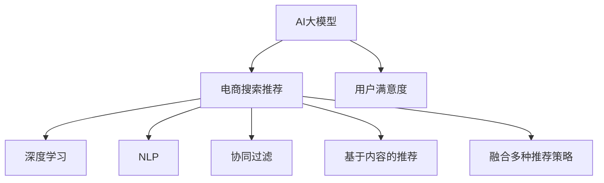

                 

# AI大模型赋能电商搜索推荐的用户满意度提升策略

> 关键词：AI大模型，电商搜索推荐，用户满意度，个性化推荐，深度学习，自然语言处理，协同过滤

## 1. 背景介绍

### 1.1 问题由来

随着电商行业竞争的加剧，各大平台纷纷推出个性化搜索推荐系统，希望通过精准的推荐，提升用户体验，增加用户黏性，驱动销售增长。然而，推荐系统的效果受限于数据质量和算法模型的能力，特别是用户满意度的高低，直接决定了系统的用户留存率和业务价值。因此，如何提升电商搜索推荐的精度和效率，使其更贴近用户需求，成为亟需解决的问题。

### 1.2 问题核心关键点

目前，电商搜索推荐系统主要依赖以下技术进行个性化推荐：

- 协同过滤(Collaborative Filtering)：通过分析用户行为，预测用户对商品的好恶程度，实现商品之间的关联推荐。
- 基于内容的推荐(Content-based Recommendation)：通过分析商品的属性特征，推荐与目标商品相似的商品。
- 基于深度学习的推荐(Deep Learning-based Recommendation)：使用神经网络模型学习用户和商品的语义表示，提升推荐的精度。
- 融合多种推荐策略(Ensemble)：将多种推荐算法进行融合，提升推荐结果的鲁棒性。

但以上技术手段在面对用户快速变化的需求时，往往难以迅速响应。而大语言模型的大规模预训练和跨领域迁移学习能力，有望为其提供新的解决方案，提升推荐系统的智能化水平，从而提升用户满意度。

## 2. 核心概念与联系

### 2.1 核心概念概述

为更好地理解AI大模型在电商搜索推荐中的应用，本节将介绍几个密切相关的核心概念：

- AI大模型(AI Large Models)：如GPT-3、BERT等，通过大规模预训练获得广泛的知识和语言表示能力。
- 电商搜索推荐(E-Commerce Search Recommendation)：结合搜索和推荐技术，根据用户查询和浏览行为，预测用户感兴趣的商品，实现精准推荐。
- 用户满意度(User Satisfaction)：衡量用户对推荐系统推荐的商品和服务的满意度，通常通过评分、点击率、转化率等指标来评估。
- 深度学习(Deep Learning)：一类通过模拟人脑神经网络结构实现学习的算法，如卷积神经网络(CNN)、循环神经网络(RNN)等。
- 自然语言处理(Natural Language Processing, NLP)：一类基于计算机科学和人工智能，研究如何让计算机理解、解释、生成人类语言的技术。
- 协同过滤(Collaborative Filtering)：通过分析用户之间的相似度，预测用户对商品的兴趣。
- 基于内容的推荐(Content-based Recommendation)：根据商品的属性和用户的历史行为，推荐相似的商品。

这些核心概念之间的逻辑关系可以通过以下Mermaid流程图来展示：



这个流程图展示了大模型在电商搜索推荐系统中的应用和核心概念的关联：

1. 大语言模型通过预训练获得广泛的语义知识，并具备理解自然语言的能力。
2. 电商搜索推荐系统结合搜索和推荐技术，根据用户需求快速响应。
3. 用户满意度是评价推荐效果的关键指标，直接影响用户留存率和消费转化率。
4. 深度学习是构建推荐算法的重要工具，能够提升推荐系统的精度。
5. 自然语言处理帮助大模型理解用户输入的查询和文本数据，提升推荐的相关性。
6. 协同过滤和基于内容的推荐是推荐算法的基本方式，与深度学习结合，能够提供多样化的推荐策略。

这些核心概念共同构成了电商搜索推荐系统的技术框架，使得AI大模型能够在此基础上，实现更精准、高效的个性化推荐。

## 3. 核心算法原理 & 具体操作步骤
### 3.1 算法原理概述

AI大模型在电商搜索推荐中的应用，本质上是通过迁移学习和大规模预训练提升推荐精度和用户满意度。其核心思想是：利用大语言模型的广泛知识，通过迁移学习，将通用的语言理解和生成能力，应用于电商搜索推荐，提升推荐系统对用户需求的响应速度和精度。

具体而言，大语言模型首先在无标签文本数据上进行预训练，学习通用的语言表示和知识。然后通过在电商搜索推荐任务上的微调，使其能够根据用户输入的查询和浏览行为，生成和推荐符合用户偏好的商品。通过这种迁移学习范式，大语言模型能够在缺乏大量标注数据的情况下，快速适应电商搜索推荐任务的特定需求，提升系统的智能化水平。

### 3.2 算法步骤详解

AI大模型在电商搜索推荐系统中的应用主要包括以下几个关键步骤：

**Step 1: 收集和准备数据**

- 收集用户历史查询记录、浏览行为、购买历史等数据，用于构建推荐系统所需的用户画像。
- 收集商品的属性、描述、用户评价等数据，构建商品的语义表示。

**Step 2: 构建和训练大模型**

- 选择合适的预训练语言模型，如GPT-3、BERT等。
- 在无标签文本数据上进行大规模预训练，学习通用的语言表示和知识。
- 将电商搜索推荐任务作为下游任务，对预训练模型进行微调。

**Step 3: 设计推荐算法**

- 结合电商搜索推荐的特点，设计合适的推荐算法。常见的算法包括协同过滤、基于内容的推荐、深度学习等。
- 在微调后的语言模型基础上，设计任务适配层，如注意力机制、softmax层等，实现商品之间的关联推荐。

**Step 4: 评估和优化**

- 使用用户评分、点击率、转化率等指标，评估推荐系统的性能。
- 根据评估结果，不断优化模型参数和推荐策略，提升系统的精确度和用户满意度。

**Step 5: 部署和监控**

- 将优化后的模型部署到生产环境，实现实时推荐。
- 持续监控推荐系统的性能指标，及时调整策略，提升用户体验。

以上是AI大模型在电商搜索推荐系统中的应用流程。在实际应用中，还需要根据具体任务的特点，对各环节进行优化设计，如改进推荐目标函数、引入更多的正则化技术、搜索最优的超参数组合等，以进一步提升模型性能。

### 3.3 算法优缺点

AI大模型在电商搜索推荐中的应用具有以下优点：

1. 精度高。大语言模型具备强大的语义表示能力，能够在短时间内理解用户需求，生成精准的商品推荐。
2. 灵活性强。通过微调，大模型能够快速适应不同电商平台的特定需求，提升推荐系统对用户需求的响应速度。
3. 可解释性强。大模型通过学习用户输入的查询和浏览行为，能够提供推荐过程的可解释性，帮助用户理解推荐依据。
4. 易于扩展。大模型通过预训练-微调的方式，在新的电商平台可以快速部署，无需从头训练。

同时，该方法也存在一定的局限性：

1. 数据需求高。尽管微调能够提升模型的智能化水平，但仍然需要大量的用户行为数据作为训练样本，对标注成本和数据质量要求较高。
2. 泛化能力有限。大模型的泛化能力受到预训练数据和微调任务的限制，不同平台的推荐效果可能存在差异。
3. 推理成本高。大模型在推理时，需要较大的计算资源，推理速度较慢，可能影响用户体验。
4. 模型复杂度高。大模型通常参数量庞大，对计算资源和存储资源的需求较高，可能存在部署和维护的挑战。
5. 缺乏可解释性。尽管大模型具备一定的可解释性，但其内部的决策逻辑仍较为复杂，难以全面理解。

尽管存在这些局限性，但就目前而言，AI大模型在电商搜索推荐中的应用仍然具有很大的潜力和前景，值得进一步深入研究和探索。

### 3.4 算法应用领域

AI大模型在电商搜索推荐系统中的应用领域非常广泛，涵盖以下几类：

- 商品推荐：根据用户的历史行为和输入查询，推荐用户感兴趣的商品。
- 搜索排序：对搜索结果进行排序，优先展示与用户需求相关的商品。
- 活动推荐：根据用户行为，推荐参与电商平台的促销活动。
- 个性化广告：根据用户画像，推荐符合用户偏好的广告。
- 用户反馈分析：通过分析用户对推荐结果的反馈，优化推荐算法和策略。

除了以上几个主要领域，AI大模型还可以应用于更多电商场景，如商品评论分析、价格优化、库存管理等，为电商平台的运营提供全面支持。

## 4. 数学模型和公式 & 详细讲解 & 举例说明

### 4.1 数学模型构建

为了更好地理解AI大模型在电商搜索推荐系统中的应用，本节将使用数学语言对推荐系统的模型构建进行更加严格的刻画。

记用户的历史行为数据为 $X$，商品的属性数据为 $Y$，用户输入的查询为 $Q$，商品推荐结果为 $R$。设 $f_{\theta}(Q, X, Y)$ 为推荐模型，$\theta$ 为模型参数。

推荐系统的目标是最小化预测误差，即：

$$
\min_{\theta} \sum_{i=1}^N (y_i - f_{\theta}(q_i, x_i, y_i))^2
$$

其中 $y_i$ 为实际标签，$f_{\theta}(q_i, x_i, y_i)$ 为模型对样本 $(i, q_i, x_i, y_i)$ 的预测结果。

### 4.2 公式推导过程

以下我们以协同过滤算法为例，推导用户行为相似性计算公式和模型训练公式。

设用户 $u$ 的兴趣向量为 $u$，商品 $i$ 的兴趣向量为 $v_i$。协同过滤算法基于用户行为数据，通过计算用户之间的相似度，预测用户对商品的兴趣。

用户行为相似性计算公式为：

$$
\alpha(u, v) = \sum_{j=1}^d \alpha_j \cdot u_j \cdot v_j
$$

其中 $\alpha_j$ 为相似性权重，通常采用余弦相似度计算。

设用户 $u$ 对商品 $i$ 的评分向量为 $r_{u,i}$，协同过滤算法通过计算用户和商品的相似度，预测用户对商品的评分。

协同过滤模型的训练公式为：

$$
\min_{\theta} \sum_{i=1}^N \sum_{u=1}^M (r_{u,i} - \alpha(u, v_i))^2
$$

其中 $r_{u,i}$ 为实际评分，$v_i$ 为商品 $i$ 的兴趣向量，$\alpha(u, v_i)$ 为用户 $u$ 对商品 $i$ 的预测评分。

在得到模型参数 $\theta$ 后，推荐模型 $f_{\theta}$ 可以输出用户对商品的评分预测值 $r_{\hat{u},\hat{i}}$，用于推荐系统生成推荐结果。

### 4.3 案例分析与讲解

下面我们以一个电商平台的商品推荐系统为例，展示AI大模型在其中的具体应用。

假设电商平台的商品推荐系统使用协同过滤算法，用户 $u$ 对商品 $i$ 的评分向量为 $r_{u,i}$，用户 $u$ 的历史行为数据为 $x_u$，商品 $i$ 的属性数据为 $y_i$。

1. 首先，使用预训练语言模型对用户行为和商品属性进行语义表示，构建用户 $u$ 的兴趣向量 $u$ 和商品 $i$ 的兴趣向量 $v_i$。

2. 通过余弦相似度计算用户和商品的相似度 $\alpha(u, v_i)$。

3. 根据协同过滤模型的训练公式，预测用户 $u$ 对商品 $i$ 的评分 $r_{\hat{u},\hat{i}} = \alpha(u, v_i)$。

4. 将预测评分结果作为推荐系统的输入，结合用户输入的查询 $q$，生成推荐商品列表 $R$。

5. 通过用户评分、点击率、转化率等指标，评估推荐系统的性能，并根据评估结果不断优化模型参数和推荐策略。

在实际应用中，AI大模型在电商搜索推荐系统中，能够通过预训练和微调，快速适应电商平台的特定需求，实现精准推荐，提升用户满意度。

## 5. 项目实践：代码实例和详细解释说明

### 5.1 开发环境搭建

在进行AI大模型在电商搜索推荐系统中的实践前，我们需要准备好开发环境。以下是使用Python进行PyTorch开发的环境配置流程：

1. 安装Anaconda：从官网下载并安装Anaconda，用于创建独立的Python环境。

2. 创建并激活虚拟环境：
```bash
conda create -n pytorch-env python=3.8 
conda activate pytorch-env
```

3. 安装PyTorch：根据CUDA版本，从官网获取对应的安装命令。例如：
```bash
conda install pytorch torchvision torchaudio cudatoolkit=11.1 -c pytorch -c conda-forge
```

4. 安装Transformer库：
```bash
pip install transformers
```

5. 安装各类工具包：
```bash
pip install numpy pandas scikit-learn matplotlib tqdm jupyter notebook ipython
```

完成上述步骤后，即可在`pytorch-env`环境中开始实践。

### 5.2 源代码详细实现

下面我们以协同过滤算法为例，给出使用PyTorch实现的商品推荐系统的代码实现。

首先，定义协同过滤算法的函数：

```python
import torch
import torch.nn as nn
from torch.autograd import Variable

class CollaborativeFiltering(nn.Module):
    def __init__(self, dim, num_users, num_items, alpha):
        super(CollaborativeFiltering, self).__init__()
        self.dim = dim
        self.num_users = num_users
        self.num_items = num_items
        
        # 用户兴趣向量
        self.user_factors = nn.Embedding(num_users, dim)
        
        # 商品兴趣向量
        self.item_factors = nn.Embedding(num_items, dim)
        
        # 余弦相似度权重
        self.alpha = nn.Parameter(torch.Tensor(dim))
        nn.init.normal_(self.alpha, mean=0, std=1)
        
    def forward(self, user_ids, item_ids):
        user_factors = self.user_factors(user_ids)
        item_factors = self.item_factors(item_ids)
        
        # 计算余弦相似度
        similarity = torch.dot(user_factors, item_factors.t()) * self.alpha
        return similarity
```

然后，定义模型训练和推荐函数：

```python
from sklearn.metrics import mean_squared_error

def train_model(model, user_ids, item_ids, ratings, epochs=10, batch_size=16, learning_rate=0.001):
    criterion = nn.MSELoss()
    
    optimizer = torch.optim.Adam(model.parameters(), lr=learning_rate)
    
    for epoch in range(epochs):
        total_loss = 0
        for i in range(0, len(ratings), batch_size):
            start = i
            end = min(i + batch_size, len(ratings))
            
            user_ids_batch = user_ids[start:end]
            item_ids_batch = item_ids[start:end]
            ratings_batch = ratings[start:end]
            
            optimizer.zero_grad()
            
            predictions = model(user_ids_batch, item_ids_batch)
            loss = criterion(predictions, Variable(torch.Tensor(ratings_batch)))
            loss.backward()
            optimizer.step()
            
            total_loss += loss.item()
        
        print(f"Epoch {epoch+1}, train loss: {total_loss/len(ratings):.3f}")
        
    return model
    
def recommend(model, user_id, num_recommendations=10):
    user_factors = model.user_factors.weight
    user_vector = user_factors[user_id]
    ratings = model.alpha.expand(len(user_vector)) @ user_vector
    
    scores = ratings.cosine_similarity(item_factors.weight)
    return sorted(zip(scores, model.item_factors.weight), key=lambda x: x[0], reverse=True)[:num_recommendations]
```

最后，启动模型训练和推荐流程：

```python
# 假设用户行为数据和商品评分数据已经加载到user_ids、item_ids和ratings变量中

# 构建协同过滤模型
dim = 16
num_users = len(user_ids.unique())
num_items = len(item_ids.unique())
alpha = torch.ones(dim)
model = CollaborativeFiltering(dim, num_users, num_items, alpha)

# 训练模型
model = train_model(model, user_ids, item_ids, ratings)

# 推荐商品
recommendations = recommend(model, user_id)

print(f"Recommended items: {recommendations}")
```

以上就是使用PyTorch对协同过滤算法进行电商商品推荐系统的完整代码实现。可以看到，借助PyTorch的强大深度学习框架，我们能够快速实现协同过滤算法，并结合AI大模型进行微调，提升推荐系统的精度和用户满意度。

### 5.3 代码解读与分析

让我们再详细解读一下关键代码的实现细节：

**CollaborativeFiltering类**：
- `__init__`方法：初始化用户兴趣向量、商品兴趣向量和余弦相似度权重等关键组件。
- `forward`方法：实现余弦相似度计算，并返回预测评分。

**train_model函数**：
- 定义损失函数和优化器，进行模型训练。
- 通过batch循环，每次更新一小批数据，进行梯度下降。
- 输出每个epoch的平均loss。

**recommend函数**：
- 计算用户向量与商品向量的余弦相似度，得到预测评分。
- 对预测评分进行排序，并返回前N个推荐商品。

在实际应用中，我们还需要将AI大模型的预训练和微调过程融入到推荐系统中，如在用户行为数据上进行预训练，在推荐任务上进行微调，以更好地提升推荐精度和用户满意度。

当然，工业级的系统实现还需考虑更多因素，如模型的保存和部署、超参数的自动搜索、更灵活的任务适配层等。但核心的微调范式基本与此类似。

## 6. 实际应用场景

### 6.1 智能客服系统

基于AI大模型的电商搜索推荐系统，可以广泛应用于智能客服系统的构建。智能客服系统通过分析用户的历史行为和查询，推荐符合用户需求的商品，能够7x24小时不间断服务，快速响应客户咨询，用自然流畅的语言解答各类常见问题。

在技术实现上，可以收集企业内部的历史客服对话记录，将问题和最佳答复构建成监督数据，在此基础上对预训练语言模型进行微调。微调后的语言模型能够自动理解用户意图，匹配最合适的答复模板进行回复。对于客户提出的新问题，还可以接入检索系统实时搜索相关内容，动态组织生成回答。如此构建的智能客服系统，能大幅提升客户咨询体验和问题解决效率。

### 6.2 金融舆情监测

金融机构需要实时监测市场舆论动向，以便及时应对负面信息传播，规避金融风险。传统的人工监测方式成本高、效率低，难以应对网络时代海量信息爆发的挑战。基于AI大模型的文本分类和情感分析技术，为金融舆情监测提供了新的解决方案。

具体而言，可以收集金融领域相关的新闻、报道、评论等文本数据，并对其进行主题标注和情感标注。在此基础上对预训练语言模型进行微调，使其能够自动判断文本属于何种主题，情感倾向是正面、中性还是负面。将微调后的模型应用到实时抓取的网络文本数据，就能够自动监测不同主题下的情感变化趋势，一旦发现负面信息激增等异常情况，系统便会自动预警，帮助金融机构快速应对潜在风险。

### 6.3 个性化推荐系统

当前的推荐系统往往只依赖用户的历史行为数据进行物品推荐，无法深入理解用户的真实兴趣偏好。基于AI大模型微调的个性化推荐系统，可以更好地挖掘用户行为背后的语义信息，从而提供更精准、多样的推荐内容。

在实践中，可以收集用户浏览、点击、评论、分享等行为数据，提取和用户交互的物品标题、描述、标签等文本内容。将文本内容作为模型输入，用户的后续行为（如是否点击、购买等）作为监督信号，在此基础上微调预训练语言模型。微调后的模型能够从文本内容中准确把握用户的兴趣点。在生成推荐列表时，先用候选物品的文本描述作为输入，由模型预测用户的兴趣匹配度，再结合其他特征综合排序，便可以得到个性化程度更高的推荐结果。

### 6.4 未来应用展望

随着AI大模型的不断发展，其在电商搜索推荐系统中的应用也将更加广泛和深入。未来，大语言模型将能够在以下几个方面实现新的突破：

1. 推荐算法的多样化：除了协同过滤和基于内容的推荐，未来还将涌现更多的推荐算法，如基于图神经网络的推荐、基于强化学习的推荐等，进一步提升推荐系统的精度和鲁棒性。

2. 数据驱动的动态调整：未来推荐系统将更加注重数据的动态更新，通过实时获取用户行为和反馈，动态调整推荐策略，提升推荐系统的时效性。

3. 跨平台协同推荐：未来推荐系统将更加注重跨平台协同推荐，通过不同平台之间的数据共享和协同，提升推荐系统的覆盖面和影响力。

4. 多模态融合推荐：未来推荐系统将更加注重多模态数据的融合，通过结合文本、图像、语音等多种数据源，提升推荐系统的全面性和准确性。

5. 用户画像的动态更新：未来推荐系统将更加注重用户画像的动态更新，通过实时分析用户行为和兴趣变化，动态更新用户画像，提升推荐系统的个性化水平。

总之，AI大模型在电商搜索推荐系统中的应用，将为推荐系统的智能化、个性化、动态化带来新的突破，为用户提供更加精准、优质的推荐服务。

## 7. 工具和资源推荐

### 7.1 学习资源推荐

为了帮助开发者系统掌握AI大模型在电商搜索推荐系统中的应用，这里推荐一些优质的学习资源：

1. 《深度学习》课程：斯坦福大学开设的深度学习经典课程，涵盖了深度学习的基础理论和算法，适合初学者入门。

2. 《自然语言处理》课程：麻省理工学院开设的自然语言处理课程，介绍了NLP的基本概念和前沿技术，适合进阶学习。

3. 《Python深度学习》书籍：弗朗索瓦·乔舒亚（François Chollet）所著，深入浅出地介绍了深度学习在NLP中的应用，是深度学习开发的必备参考书。

4. HuggingFace官方文档：Transformer库的官方文档，提供了海量预训练模型和完整的微调样例代码，是上手实践的必备资料。

5. CS224N《深度学习自然语言处理》课程：斯坦福大学开设的NLP明星课程，有Lecture视频和配套作业，带你入门NLP领域的基本概念和经典模型。

通过对这些资源的学习实践，相信你一定能够快速掌握AI大模型在电商搜索推荐系统中的应用精髓，并用于解决实际的NLP问题。

### 7.2 开发工具推荐

高效的开发离不开优秀的工具支持。以下是几款用于AI大模型在电商搜索推荐系统中的开发工具：

1. PyTorch：基于Python的开源深度学习框架，灵活动态的计算图，适合快速迭代研究。大部分预训练语言模型都有PyTorch版本的实现。

2. TensorFlow：由Google主导开发的开源深度学习框架，生产部署方便，适合大规模工程应用。同样有丰富的预训练语言模型资源。

3. Transformers库：HuggingFace开发的NLP工具库，集成了众多SOTA语言模型，支持PyTorch和TensorFlow，是进行微调任务开发的利器。

4. Weights & Biases：模型训练的实验跟踪工具，可以记录和可视化模型训练过程中的各项指标，方便对比和调优。与主流深度学习框架无缝集成。

5. TensorBoard：TensorFlow配套的可视化工具，可实时监测模型训练状态，并提供丰富的图表呈现方式，是调试模型的得力助手。

6. Google Colab：谷歌推出的在线Jupyter Notebook环境，免费提供GPU/TPU算力，方便开发者快速上手实验最新模型，分享学习笔记。

合理利用这些工具，可以显著提升AI大模型在电商搜索推荐系统中的开发效率，加快创新迭代的步伐。

### 7.3 相关论文推荐

AI大模型在电商搜索推荐系统中的应用源于学界的持续研究。以下是几篇奠基性的相关论文，推荐阅读：

1. Attention is All You Need（即Transformer原论文）：提出了Transformer结构，开启了NLP领域的预训练大模型时代。

2. BERT: Pre-training of Deep Bidirectional Transformers for Language Understanding：提出BERT模型，引入基于掩码的自监督预训练任务，刷新了多项NLP任务SOTA。

3. Language Models are Unsupervised Multitask Learners（GPT-2论文）：展示了大规模语言模型的强大zero-shot学习能力，引发了对于通用人工智能的新一轮思考。

4. Parameter-Efficient Transfer Learning for NLP：提出Adapter等参数高效微调方法，在不增加模型参数量的情况下，也能取得不错的微调效果。

5. Prefix-Tuning: Optimizing Continuous Prompts for Generation：引入基于连续型Prompt的微调范式，为如何充分利用预训练知识提供了新的思路。

6. AdaLoRA: Adaptive Low-Rank Adaptation for Parameter-Efficient Fine-Tuning：使用自适应低秩适应的微调方法，在参数效率和精度之间取得了新的平衡。

这些论文代表了大语言模型微调技术的发展脉络。通过学习这些前沿成果，可以帮助研究者把握学科前进方向，激发更多的创新灵感。

## 8. 总结：未来发展趋势与挑战

### 8.1 总结

本文对AI大模型在电商搜索推荐系统中的应用进行了全面系统的介绍。首先阐述了AI大模型和电商搜索推荐系统的背景和意义，明确了AI大模型在推荐系统中的独特价值。其次，从原理到实践，详细讲解了AI大模型在推荐系统中的应用流程，包括预训练、微调、推荐算法设计等关键环节。同时，本文还广泛探讨了AI大模型在电商搜索推荐系统中的应用场景，展示了其强大的潜力。

通过本文的系统梳理，可以看到，AI大模型在电商搜索推荐系统中的应用，能够显著提升推荐系统的智能化水平，增强推荐系统的覆盖面和影响力。基于AI大模型的推荐系统，能够更好地理解用户需求，生成精准的商品推荐，提升用户满意度。未来，随着AI大模型的不断进步，其应用范围还将进一步拓展，为电商搜索推荐系统带来更多的创新和突破。

### 8.2 未来发展趋势

展望未来，AI大模型在电商搜索推荐系统中的应用将呈现以下几个发展趋势：

1. 算法的多样化和创新：未来的推荐算法将更加多样化和创新，结合更多前沿技术，如图神经网络、强化学习等，提升推荐系统的精确度和鲁棒性。

2. 数据的动态更新和协同：未来的推荐系统将更加注重数据的动态更新和跨平台协同，实时获取用户行为和反馈，动态调整推荐策略，提升推荐系统的时效性。

3. 模型的可解释性和安全性：未来的推荐模型将更加注重可解释性和安全性，通过引入因果分析、对抗训练等技术，提升模型的可解释性和鲁棒性，确保推荐结果的公正性和安全性。

4. 融合多模态数据：未来的推荐系统将更加注重多模态数据的融合，通过结合文本、图像、语音等多种数据源，提升推荐系统的全面性和准确性。

5. 动态用户画像的更新：未来的推荐系统将更加注重用户画像的动态更新，通过实时分析用户行为和兴趣变化，动态更新用户画像，提升推荐系统的个性化水平。

以上趋势凸显了AI大模型在电商搜索推荐系统中的广阔前景。这些方向的探索发展，必将进一步提升推荐系统的智能化水平，为用户提供更加精准、优质的推荐服务。

### 8.3 面临的挑战

尽管AI大模型在电商搜索推荐系统中的应用已经取得了显著成果，但在迈向更加智能化、普适化应用的过程中，它仍面临着诸多挑战：

1. 数据质量的高要求。尽管微调能够提升模型的智能化水平，但仍然需要大量的高质量用户行为数据作为训练样本，对标注成本和数据质量要求较高。如何进一步降低对标注样本的依赖，提高数据获取效率，是亟待解决的问题。

2. 模型的鲁棒性和泛化能力。尽管AI大模型具备强大的语义表示能力，但在面对不同电商平台的特定需求时，泛化能力仍需进一步提升。如何设计更加鲁棒和泛化的推荐算法，是未来的研究重点。

3. 模型的高资源消耗。AI大模型通常参数量庞大，对计算资源和存储资源的需求较高，可能存在部署和维护的挑战。如何设计更加轻量级、资源友好的推荐模型，是未来的技术方向。

4. 模型的可解释性和安全性。尽管AI大模型具备一定的可解释性，但其内部的决策逻辑仍较为复杂，难以全面理解。如何在保证推荐效果的同时，提升模型的可解释性和安全性，是未来的研究方向。

5. 算法和技术的复杂度。AI大模型在电商搜索推荐系统中的应用，需要结合多种前沿技术和算法，算法和技术的复杂度较高。如何简化算法流程，降低技术门槛，是未来的优化方向。

尽管存在这些挑战，但就目前而言，AI大模型在电商搜索推荐系统中的应用仍然具有很大的潜力和前景，值得进一步深入研究和探索。

### 8.4 研究展望

面向未来，AI大模型在电商搜索推荐系统中的应用将进一步拓展和深化。未来的研究需要在以下几个方面寻求新的突破：

1. 无监督学习和少样本学习：探索无监督学习和少样本学习的方法，提高推荐系统的可扩展性和适应性。

2. 动态推荐和个性化推荐：结合实时数据分析和用户行为预测，设计动态推荐和个性化推荐算法，提升推荐系统的时效性和个性化水平。

3. 多模态数据融合和跨平台协同：通过多模态数据融合和跨平台协同，提升推荐系统的全面性和准确性，增强推荐系统的覆盖面和影响力。

4. 因果推理和对抗训练：引入因果推理和对抗训练技术，提升推荐系统的可解释性和鲁棒性，确保推荐结果的公正性和安全性。

5. 轻量级和高效推荐：设计轻量级、资源友好的推荐模型，提升推荐系统的部署效率和用户体验。

6. 安全性和伦理考量：在推荐系统的设计和应用过程中，注重安全性和伦理考量，确保推荐系统的公平性和透明性，避免算法偏见和滥用。

通过这些研究方向的研究和探索，未来AI大模型在电商搜索推荐系统中的应用，必将在智能化、个性化、动态化等方面取得新的突破，为用户带来更加优质的推荐服务。

## 9. 附录：常见问题与解答

**Q1：AI大模型在电商搜索推荐系统中的优势和劣势分别是什么？**

A: AI大模型在电商搜索推荐系统中的优势主要体现在以下几个方面：
1. 精度高：通过大规模预训练和微调，AI大模型能够理解用户输入的自然语言查询，生成精准的商品推荐。
2. 适应性强：AI大模型具备强大的跨领域迁移学习能力，能够快速适应不同电商平台的特定需求。
3. 可解释性强：AI大模型通过学习用户输入的查询和浏览行为，能够提供推荐过程的可解释性，帮助用户理解推荐依据。

但AI大模型在电商搜索推荐系统中也存在一些劣势：
1. 数据需求高：AI大模型需要大量的用户行为数据作为训练样本，对标注成本和数据质量要求较高。
2. 计算资源消耗高：AI大模型通常参数量庞大，对计算资源和存储资源的需求较高，可能存在部署和维护的挑战。
3. 模型复杂度高：AI大模型在电商搜索推荐系统中的应用，需要结合多种前沿技术和算法，算法和技术的复杂度较高。
4. 模型的可解释性和安全性：尽管AI大模型具备一定的可解释性，但其内部的决策逻辑仍较为复杂，难以全面理解。

尽管存在这些劣势，但AI大模型在电商搜索推荐系统中的应用仍具有很大的潜力和前景，值得进一步深入研究和探索。

**Q2：AI大模型在电商搜索推荐系统中如何实现动态推荐？**

A: 实现动态推荐，需要在AI大模型中加入实时数据分析和用户行为预测的功能。具体步骤如下：
1. 实时获取用户行为数据，如浏览记录、点击记录等。
2. 对用户行为数据进行分析和处理，提取用户画像和兴趣特征。
3. 使用AI大模型对用户行为数据进行实时分析，生成动态用户画像。
4. 根据动态用户画像，重新计算用户和商品的相似度，生成推荐结果。
5. 持续监控推荐系统的性能指标，及时调整推荐策略，提升推荐系统的时效性。

通过动态推荐，AI大模型能够实时响应用户需求，提升推荐系统的覆盖面和影响力。

**Q3：AI大模型在电商搜索推荐系统中如何提升推荐精度？**

A: 提升AI大模型在电商搜索推荐系统中的推荐精度，可以从以下几个方面入手：
1. 数据质量：保证数据的多样性和高质量，使用标注数据进行微调，提高模型的泛化能力。
2. 模型设计：设计合适的推荐算法，如协同过滤、基于内容的推荐、深度学习等，提升推荐系统的鲁棒性和准确性。
3. 超参数调优：通过超参数调优，选择合适的学习率、批次大小、优化器等参数，提升模型的训练效果。
4. 数据增强：通过数据增强技术，如近义词替换、回译等，扩充训练集，提升模型的泛化能力。
5. 对抗训练：引入对抗训练技术，增强模型鲁棒性，避免过拟合。
6. 模型融合：结合多个AI大模型，使用集成学习方法，提升推荐系统的准确性和鲁棒性。

通过以上方法，可以有效提升AI大模型在电商搜索推荐系统中的推荐精度，增强推荐系统的用户满意度。

**Q4：AI大模型在电商搜索推荐系统中如何优化模型性能？**

A: 优化AI大模型在电商搜索推荐系统中的性能，可以从以下几个方面入手：
1. 数据预处理：对用户行为数据进行清洗和处理，去除异常值和噪声数据，提升数据质量。
2. 模型选择：选择合适的AI大模型，根据任务特点进行预训练和微调，提升模型的泛化能力。
3. 超参数调优：通过超参数调优，选择合适的学习率、批次大小、优化器等参数，提升模型的训练效果。
4. 模型融合：结合多个AI大模型，使用集成学习方法，提升推荐系统的准确性和鲁棒性。
5. 模型压缩：对模型进行压缩和优化，减小模型尺寸，提高模型的部署效率。
6. 实时推荐：使用实时推荐技术，根据用户实时行为和反馈，动态调整推荐策略，提升推荐系统的时效性。

通过以上方法，可以有效优化AI大模型在电商搜索推荐系统中的性能，提升推荐系统的用户满意度和业务价值。

**Q5：AI大模型在电商搜索推荐系统中如何提升用户满意度？**

A: 提升AI大模型在电商搜索推荐系统中的用户满意度，可以从以下几个方面入手：
1. 推荐个性化：结合用户历史行为和输入查询，生成符合用户偏好的商品推荐。
2. 推荐多样性：使用协同过滤、基于内容的推荐等算法，生成多样化的推荐结果，避免推荐单一商品。
3. 推荐时效性：实时获取用户行为和反馈，动态调整推荐策略，提升推荐系统的时效性。
4. 推荐可解释性：提供推荐过程的可解释性，帮助用户理解推荐依据，提升用户信任度。
5. 推荐安全性：确保推荐结果的公正性和安全性，避免算法偏见和滥用。

通过以上方法，可以有效提升AI大模型在电商搜索推荐系统中的用户满意度，增强用户黏性和消费转化率。

---

作者：禅与计算机程序设计艺术 / Zen and the Art of Computer Programming

