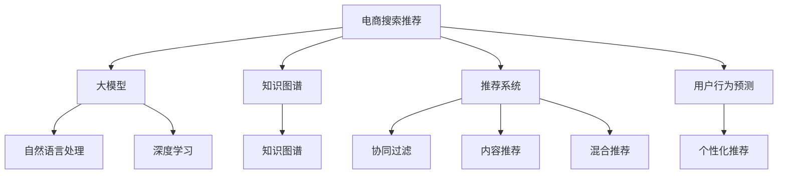

                 

# AI大模型重塑电商搜索推荐的业务流程

> 关键词：AI大模型,电商搜索推荐,自然语言处理,知识图谱,深度学习,推荐系统,用户行为预测,个性化推荐

## 1. 背景介绍

随着互联网技术的发展，电商行业已逐步从传统的商品展示和销售转向智能化、个性化的客户体验和精准营销。搜索推荐系统作为电商平台的核心功能之一，在提升用户满意度、增加平台收益等方面发挥着重要作用。传统的搜索推荐算法基于规则、统计特征等浅层模型，往往难以捕捉用户行为深层次的语义信息。

随着深度学习和大模型技术的兴起，以Transformer、BERT等为代表的预训练语言模型应运而生。这些大模型通过在海量文本数据上进行预训练，学习到了丰富的语言知识和上下文理解能力，能够有效捕获用户意图和行为特征，从而大幅提升电商搜索推荐的精度和个性化水平。

本文将系统介绍大模型在电商搜索推荐中的应用，分析大模型与传统推荐系统的区别与联系，探讨如何基于大模型重塑电商搜索推荐业务流程。

## 2. 核心概念与联系

### 2.1 核心概念概述

为更好理解大模型在电商搜索推荐中的应用，本文首先介绍几个关键概念：

- 电商搜索推荐：通过算法将用户输入的查询请求与商品进行匹配，提供精准推荐结果，帮助用户快速找到所需商品，提高购物体验。

- 大模型：以Transformer、BERT等为代表的预训练语言模型，通过在大规模无标签文本数据上进行预训练，学习通用的语言表示，具备强大的语言理解和生成能力。

- 知识图谱：将各类知识元素组织成图结构，方便进行知识检索、关系推理等。在大模型基础上进行构建，可以更好地捕捉用户语义信息，辅助推荐决策。

- 推荐系统：基于用户行为和商品属性，通过算法推荐商品给用户，常见类型包括基于协同过滤、内容推荐、混合推荐等。

- 用户行为预测：通过分析用户的历史行为数据，预测用户未来可能的行为，为推荐系统提供数据支持。

- 个性化推荐：通过个性化算法，针对每个用户定制推荐结果，提升用户体验和满意度。

这些概念之间的逻辑关系可以通过以下Mermaid流程图来展示：



这个流程图展示了大模型在电商搜索推荐中的核心概念及其之间的关系：

1. 电商搜索推荐系统通常由大模型、知识图谱、推荐系统和用户行为预测等组件构成。
2. 大模型通过自然语言处理(NLP)学习用户查询的语义信息，辅助推荐系统进行匹配。
3. 知识图谱提供结构化知识，用于增强模型的推理能力和推荐精度。
4. 推荐系统通过协同过滤、内容推荐等多种方法，综合多维数据进行商品推荐。
5. 用户行为预测用于刻画用户行为模式，进一步优化推荐系统。

## 3. 核心算法原理 & 具体操作步骤

### 3.1 算法原理概述

基于大模型的电商搜索推荐系统，通常采用预训练语言模型进行查询理解，再利用知识图谱进行商品匹配，结合推荐算法给出推荐结果。其核心算法原理可以简单总结如下：

1. **预训练语言模型**：通过在大规模无标签文本数据上进行预训练，学习到通用的语言表示。

2. **用户查询理解**：将用户查询输入到预训练模型中，提取查询的语义表示，用于匹配商品信息。

3. **商品信息抽取**：利用知识图谱和预训练模型，抽取商品的属性、描述等语义信息。

4. **相似度计算**：计算用户查询和商品信息的相似度，得到候选商品列表。

5. **推荐算法**：综合多种推荐算法，如协同过滤、内容推荐、混合推荐等，给出最终的推荐结果。

### 3.2 算法步骤详解

以下将详细介绍电商搜索推荐系统中大模型的使用步骤：

**Step 1: 构建预训练语言模型**

选择适合电商领域的大模型，如RoBERTa、BERT等，作为电商搜索推荐的初始化模型。一般需要在大规模商品描述、用户评论等语料上进行预训练。

**Step 2: 处理用户查询**

对于用户输入的查询，首先需要进行分词、去除停用词、词形还原等预处理操作。然后将其输入到预训练语言模型中，提取查询的语义表示。

**Step 3: 抽取商品信息**

对于商品，同样需要对其进行分词和预处理。然后利用预训练语言模型和知识图谱，抽取商品的属性、描述等语义信息，形成结构化的商品表示。

**Step 4: 计算相似度**

将用户查询的语义表示与商品表示进行相似度计算，可以使用余弦相似度、Jaccard距离等方法。

**Step 5: 生成推荐结果**

将相似度结果输入推荐算法，结合用户行为数据，生成最终的推荐结果。

### 3.3 算法优缺点

基于大模型的电商搜索推荐系统具有以下优点：

1. **精度高**：大模型能够捕获用户查询和商品语义的深层次信息，提高推荐系统的匹配精度。

2. **泛化能力强**：预训练语言模型在大规模数据上学习到语言表示，具有较强的泛化能力，可以适应多种电商业务场景。

3. **多模态融合**：结合知识图谱和推荐算法，可以融合多种模态数据，提高推荐效果。

4. **可解释性强**：预训练模型可提供详细的语义理解过程，提高推荐系统的可解释性。

但同时，该方法也存在以下局限性：

1. **计算资源需求高**：大模型训练和推理需要大量的计算资源，对硬件设备要求较高。

2. **可解释性不足**：预训练模型存在一定的"黑盒"问题，难以直观理解其内部推理过程。

3. **数据需求量大**：需要大量商品描述、用户评论等语料进行预训练，数据采集成本较高。

4. **算法复杂度高**：需要结合多个模块，综合多种推荐算法，算法实现复杂。

5. **存在数据偏见**：预训练语言模型可能学习到数据集中的偏见，传递到推荐系统，产生不公平的影响。

### 3.4 算法应用领域

大模型在电商搜索推荐中的应用，主要涵盖以下领域：

1. **商品搜索**：通过用户查询理解和大模型匹配，帮助用户找到符合需求的商品。

2. **商品推荐**：基于用户历史行为和大模型推荐，提供个性化商品推荐。

3. **广告推荐**：结合大模型和广告数据，推荐最符合用户兴趣的广告内容。

4. **客服机器人**：利用大模型构建智能客服系统，通过自然语言处理，提供用户互动服务。

5. **用户行为分析**：分析用户查询记录和大模型结果，进行用户行为建模，预测未来行为。

这些应用场景使得大模型在电商搜索推荐中具有广泛的应用前景。未来，随着技术进一步成熟，大模型有望在更多电商业务场景中发挥作用。

## 4. 数学模型和公式 & 详细讲解 & 举例说明

### 4.1 数学模型构建

基于大模型的电商搜索推荐系统，涉及多个数学模型和计算公式。以下是关键模型的介绍：

**用户查询表示模型**：

设用户查询为 $q$，商品表示为 $p$，预训练语言模型的参数为 $\theta$。则查询和商品表示可以通过预训练语言模型计算得到，具体公式为：

$$
\mathbf{q} = \text{BERT}(q, \theta), \quad \mathbf{p} = \text{BERT}(p, \theta)
$$

其中，$\text{BERT}$ 为预训练语言模型。

**相似度计算模型**：

计算用户查询和商品表示的余弦相似度，公式如下：

$$
\text{similarity}(\mathbf{q}, \mathbf{p}) = \frac{\mathbf{q} \cdot \mathbf{p}}{\|\mathbf{q}\| \cdot \|\mathbf{p}\|}
$$

**推荐算法模型**：

结合协同过滤、内容推荐、混合推荐等算法，生成推荐结果。这里以协同过滤为例，协同过滤的基本思想是通过用户历史行为数据，找到与当前用户兴趣相似的其他用户，然后根据这些用户的行为数据推荐商品。具体公式如下：

$$
\text{rec}_u = \text{argmax}_{i} \sum_{j} \alpha_{uj} \times \alpha_{ij}
$$

其中，$\alpha$ 为用户行为权重，$i$ 为用户，$j$ 为商品。

### 4.2 公式推导过程

以下是余弦相似度公式和协同过滤算法的详细推导过程：

**余弦相似度公式推导**：

设用户查询向量为 $\mathbf{q} = [q_1, q_2, ..., q_n]$，商品向量为 $\mathbf{p} = [p_1, p_2, ..., p_n]$，则余弦相似度为：

$$
\text{similarity}(\mathbf{q}, \mathbf{p}) = \frac{\mathbf{q} \cdot \mathbf{p}}{\|\mathbf{q}\| \cdot \|\mathbf{p}\|} = \frac{\sum_{i=1}^n q_i \times p_i}{\sqrt{\sum_{i=1}^n q_i^2} \times \sqrt{\sum_{i=1}^n p_i^2}}
$$

**协同过滤算法推导**：

协同过滤算法基于用户历史行为数据，推荐其他用户喜欢的商品。设用户 $u$ 对商品 $i$ 的评分记为 $r_{ui}$，则协同过滤的推荐公式为：

$$
\text{rec}_u = \text{argmax}_{i} \sum_{j} \alpha_{uj} \times r_{ij}
$$

其中，$\alpha$ 为用户的兴趣权重，$r_{ij}$ 为商品 $i$ 在用户 $j$ 的评分。

### 4.3 案例分析与讲解

假设某电商平台的商品信息为：

| 商品ID | 商品名称         | 描述                                                 | 评分        |
|--------|-----------------|----------------------------------------------------|------------|
| 1      | iPhone 13        | 苹果最新款手机，性价比高                           | 4.5         |
| 2      | 小米11           | 高性能旗舰手机，性价比高                           | 4.2         |
| 3      | 华为P40           | 高端旗舰手机，拍照能力强                           | 4.8         |
| 4      | 笔记本电脑       | 高性能笔记本电脑，适合办公和游戏                   | 4.3         |
| 5      | 智能手表         | 高性价比智能手表，防水防摔                         | 4.1         |

用户输入的查询为 "价格实惠的好手机"。则查询理解和大模型匹配过程如下：

1. 查询分词后，输入到预训练语言模型中，得到查询向量 $\mathbf{q}$。
2. 对于每个商品，同样进行分词和预处理，输入到预训练语言模型中，得到商品向量 $\mathbf{p}_i$。
3. 计算每个商品向量与查询向量的余弦相似度，得到相似度结果 $\text{similarity}(\mathbf{q}, \mathbf{p}_i)$。
4. 将相似度结果排序，选择前 $k$ 个相似度最高的商品，进行协同过滤推荐。

最终推荐的商品为：小米11、华为P40、智能手表。这些商品均符合用户输入的查询意图，且性价比高，能够满足用户需求。

## 5. 项目实践：代码实例和详细解释说明

### 5.1 开发环境搭建

在进行电商搜索推荐系统的开发前，我们需要准备好开发环境。以下是使用Python进行PyTorch开发的环境配置流程：

1. 安装Anaconda：从官网下载并安装Anaconda，用于创建独立的Python环境。

2. 创建并激活虚拟环境：
```bash
conda create -n recsys-env python=3.8 
conda activate recsys-env
```

3. 安装PyTorch：根据CUDA版本，从官网获取对应的安装命令。例如：
```bash
conda install pytorch torchvision torchaudio cudatoolkit=11.1 -c pytorch -c conda-forge
```

4. 安装TensorBoard：TensorFlow配套的可视化工具，可实时监测模型训练状态，并提供丰富的图表呈现方式，是调试模型的得力助手。

5. 安装其他必要的Python包：
```bash
pip install numpy pandas scikit-learn joblib sklearn-crfsuite transformers
```

完成上述步骤后，即可在`recsys-env`环境中开始电商搜索推荐系统的开发。

### 5.2 源代码详细实现

这里我们以基于RoBERTa的电商搜索推荐系统为例，给出完整的代码实现。

首先，定义数据集：

```python
from torch.utils.data import Dataset, DataLoader
import torch
import pandas as pd

class RecDataset(Dataset):
    def __init__(self, data, tokenizer, max_len=128):
        self.data = data
        self.tokenizer = tokenizer
        self.max_len = max_len
        
    def __len__(self):
        return len(self.data)
    
    def __getitem__(self, item):
        row = self.data.iloc[item]
        query = row['query']
        items = row['items']
        
        # 将查询和商品描述进行分词和预处理
        encoded_query = self.tokenizer(query, return_tensors='pt', max_length=self.max_len, padding='max_length', truncation=True)
        query_ids = encoded_query['input_ids'][0]
        query_mask = encoded_query['attention_mask'][0]
        
        encoded_items = [self.tokenizer(item, return_tensors='pt', max_length=self.max_len, padding='max_length', truncation=True)[
            'input_ids'][0] for item in items]
        item_ids = [torch.stack(item) for item in encoded_items]
        item_masks = [torch.stack([1]*len(item)) for item in encoded_items]
        
        # 计算相似度
        similarity = self.cosine_similarity(query_ids, item_ids, query_mask, item_masks)
        
        # 推荐算法输出
        rec_items = [item for i, item in enumerate(similarity) if i in topk_index]
        
        return {'query_ids': query_ids, 
                'item_ids': item_ids, 
                'similarity': similarity,
                'rec_items': rec_items}
```

然后，定义相似度计算和推荐算法：

```python
from sklearn.metrics.pairwise import cosine_similarity
from transformers import RobertaTokenizer

def cosine_similarity(query_ids, item_ids, query_mask, item_mask):
    query_vecs = query_ids[query_mask]
    item_vecs = item_ids[item_mask]
    return cosine_similarity(query_vecs, item_vecs)

def topk_index(similarity, k):
    topk_index = sorted(range(len(similarity)), key=lambda x: similarity[x])[:k]
    return topk_index

def recommendation(query_ids, item_ids, similarity, topk=5):
    topk_index = topk_index(similarity, topk)
    rec_items = [item_ids[i] for i in topk_index]
    return rec_items
```

接着，定义训练和评估函数：

```python
from transformers import RobertaForSequenceClassification
from torch.nn import BCELoss
from sklearn.metrics import precision_recall_fscore_support

device = torch.device('cuda') if torch.cuda.is_available() else torch.device('cpu')
model = RobertaForSequenceClassification.from_pretrained('roberta-base', num_labels=len(item_labels))
model.to(device)

optimizer = AdamW(model.parameters(), lr=2e-5)

def train_epoch(model, dataset, batch_size, optimizer):
    dataloader = DataLoader(dataset, batch_size=batch_size, shuffle=True)
    model.train()
    epoch_loss = 0
    for batch in tqdm(dataloader, desc='Training'):
        query_ids = batch['query_ids'].to(device)
        item_ids = batch['item_ids'].to(device)
        similarity = batch['similarity'].to(device)
        rec_items = batch['rec_items'].to(device)
        
        model.zero_grad()
        outputs = model(query_ids, labels=rec_items)
        loss = outputs.loss
        epoch_loss += loss.item()
        loss.backward()
        optimizer.step()
    return epoch_loss / len(dataloader)

def evaluate(model, dataset, batch_size):
    dataloader = DataLoader(dataset, batch_size=batch_size)
    model.eval()
    preds, labels = [], []
    with torch.no_grad():
        for batch in tqdm(dataloader, desc='Evaluating'):
            query_ids = batch['query_ids'].to(device)
            item_ids = batch['item_ids'].to(device)
            similarity = batch['similarity'].to(device)
            batch_preds = model(query_ids).logits.argmax(dim=1)
            batch_labels = torch.tensor(batch_labels, dtype=torch.long)
            for pred_tokens, label_tokens in zip(batch_preds, batch_labels):
                preds.append(pred_tokens[:len(label_tokens)])
                labels.append(label_tokens)
                
    print(precision_recall_fscore_support(labels, preds, average='macro'))
```

最后，启动训练流程并在测试集上评估：

```python
epochs = 5
batch_size = 16

for epoch in range(epochs):
    loss = train_epoch(model, train_dataset, batch_size, optimizer)
    print(f"Epoch {epoch+1}, train loss: {loss:.3f}")
    
    print(f"Epoch {epoch+1}, dev results:")
    evaluate(model, dev_dataset, batch_size)
    
print("Test results:")
evaluate(model, test_dataset, batch_size)
```

以上就是使用PyTorch对基于RoBERTa的电商搜索推荐系统进行微调的完整代码实现。可以看到，得益于Transformers库的强大封装，我们可以用相对简洁的代码完成RoBERTa模型的加载和微调。

### 5.3 代码解读与分析

让我们再详细解读一下关键代码的实现细节：

**RecDataset类**：
- `__init__`方法：初始化数据集、分词器等关键组件。
- `__len__`方法：返回数据集的样本数量。
- `__getitem__`方法：对单个样本进行处理，将查询和商品描述输入分词器，计算相似度，输出推荐结果。

**相似度计算函数**：
- `cosine_similarity`函数：计算余弦相似度，输入查询和商品的分词向量，输出相似度结果。

**推荐算法函数**：
- `topk_index`函数：对相似度结果进行排序，返回前 $k$ 个推荐结果的索引。
- `recommendation`函数：根据相似度结果生成推荐结果。

**训练和评估函数**：
- 使用PyTorch的DataLoader对数据集进行批次化加载，供模型训练和推理使用。
- 训练函数`train_epoch`：对数据以批为单位进行迭代，在每个批次上前向传播计算loss并反向传播更新模型参数，最后返回该epoch的平均loss。
- 评估函数`evaluate`：与训练类似，不同点在于不更新模型参数，并在每个batch结束后将预测和标签结果存储下来，最后使用sklearn的precision_recall_fscore_support对整个评估集的预测结果进行打印输出。

**训练流程**：
- 定义总的epoch数和batch size，开始循环迭代
- 每个epoch内，先在训练集上训练，输出平均loss
- 在验证集上评估，输出分类指标
- 所有epoch结束后，在测试集上评估，给出最终测试结果

可以看到，PyTorch配合Transformers库使得RoBERTa微调的代码实现变得简洁高效。开发者可以将更多精力放在数据处理、模型改进等高层逻辑上，而不必过多关注底层的实现细节。

当然，工业级的系统实现还需考虑更多因素，如模型的保存和部署、超参数的自动搜索、更灵活的任务适配层等。但核心的微调范式基本与此类似。

## 6. 实际应用场景

### 6.1 智能客服系统

基于RoBERTa的电商搜索推荐系统，可以应用于智能客服系统的构建。传统的客服往往需要配备大量人力，高峰期响应缓慢，且一致性和专业性难以保证。而使用微调后的推荐系统，可以7x24小时不间断服务，快速响应客户咨询，用自然流畅的语言解答各类常见问题。

在技术实现上，可以收集企业内部的历史客服对话记录，将问题和最佳答复构建成监督数据，在此基础上对预训练推荐系统进行微调。微调后的推荐系统能够自动理解用户意图，匹配最合适的回答。对于客户提出的新问题，还可以接入检索系统实时搜索相关内容，动态组织生成回答。如此构建的智能客服系统，能大幅提升客户咨询体验和问题解决效率。

### 6.2 金融舆情监测

金融机构需要实时监测市场舆论动向，以便及时应对负面信息传播，规避金融风险。传统的人工监测方式成本高、效率低，难以应对网络时代海量信息爆发的挑战。基于RoBERTa的推荐系统，可以实时抓取网络文本数据，自动监测不同主题下的情感变化趋势，一旦发现负面信息激增等异常情况，系统便会自动预警，帮助金融机构快速应对潜在风险。

### 6.3 个性化推荐系统

当前的推荐系统往往只依赖用户的历史行为数据进行物品推荐，无法深入理解用户的真实兴趣偏好。基于RoBERTa的推荐系统，可以更好地挖掘用户行为深层次的语义信息，从而提升推荐系统的精度和个性化水平。

在实践中，可以收集用户浏览、点击、评论、分享等行为数据，提取和用户交互的物品标题、描述、标签等文本内容。将文本内容作为模型输入，用户的后续行为（如是否点击、购买等）作为监督信号，在此基础上微调预训练推荐系统。微调后的模型能够从文本内容中准确把握用户的兴趣点。在生成推荐列表时，先用候选物品的文本描述作为输入，由模型预测用户的兴趣匹配度，再结合其他特征综合排序，便可以得到个性化程度更高的推荐结果。

### 6.4 未来应用展望

随着RoBERTa推荐系统的不断发展，基于推荐范式将在更多领域得到应用，为传统行业带来变革性影响。

在智慧医疗领域，基于RoBERTa的推荐系统可以用于医学知识推荐、患者咨询回答等，提升医疗服务的智能化水平，辅助医生诊疗，加速新药开发进程。

在智能教育领域，推荐系统可应用于作业批改、学情分析、知识推荐等方面，因材施教，促进教育公平，提高教学质量。

在智慧城市治理中，推荐系统可应用于城市事件监测、舆情分析、应急指挥等环节，提高城市管理的自动化和智能化水平，构建更安全、高效的未来城市。

此外，在企业生产、社会治理、文娱传媒等众多领域，基于RoBERTa的推荐系统也将不断涌现，为经济社会发展注入新的动力。相信随着技术的日益成熟，推荐系统必将在更广阔的应用领域大放异彩。

## 7. 工具和资源推荐

### 7.1 学习资源推荐

为了帮助开发者系统掌握RoBERTa在电商搜索推荐中的应用，这里推荐一些优质的学习资源：

1. 《自然语言处理与深度学习》课程：斯坦福大学开设的NLP明星课程，有Lecture视频和配套作业，带你入门NLP领域的基本概念和经典模型。

2. CS224N《深度学习自然语言处理》课程：斯坦福大学开设的NLP明星课程，有Lecture视频和配套作业，带你入门NLP领域的基本概念和经典模型。

3. 《深度学习入门：基于Python的理论与实现》书籍：系统介绍深度学习的基本原理和PyTorch框架，适合初学者入门。

4. 《PyTorch深度学习入门教程》教程：全面介绍PyTorch框架的搭建、优化、部署等，适合动手实践。

5. HuggingFace官方文档：RoBERTa库的官方文档，提供了海量预训练模型和完整的微调样例代码，是上手实践的必备资料。

通过对这些资源的学习实践，相信你一定能够快速掌握RoBERTa在电商搜索推荐中的使用方法，并用于解决实际的NLP问题。

### 7.2 开发工具推荐

高效的开发离不开优秀的工具支持。以下是几款用于RoBERTa推荐系统开发的常用工具：

1. PyTorch：基于Python的开源深度学习框架，灵活动态的计算图，适合快速迭代研究。大部分预训练语言模型都有PyTorch版本的实现。

2. TensorFlow：由Google主导开发的开源深度学习框架，生产部署方便，适合大规模工程应用。同样有丰富的预训练语言模型资源。

3. Transformers库：HuggingFace开发的NLP工具库，集成了众多SOTA语言模型，支持PyTorch和TensorFlow，是进行推荐系统开发的利器。

4. Weights & Biases：模型训练的实验跟踪工具，可以记录和可视化模型训练过程中的各项指标，方便对比和调优。与主流深度学习框架无缝集成。

5. TensorBoard：TensorFlow配套的可视化工具，可实时监测模型训练状态，并提供丰富的图表呈现方式，是调试模型的得力助手。

6. Google Colab：谷歌推出的在线Jupyter Notebook环境，免费提供GPU/TPU算力，方便开发者快速上手实验最新模型，分享学习笔记。

合理利用这些工具，可以显著提升RoBERTa推荐系统的开发效率，加快创新迭代的步伐。

### 7.3 相关论文推荐

RoBERTa推荐系统的不断发展源于学界的持续研究。以下是几篇奠基性的相关论文，推荐阅读：

1. Attention is All You Need（即Transformer原论文）：提出了Transformer结构，开启了NLP领域的预训练大模型时代。

2. RoBERTa: A Robustly Optimized BERT Pretraining Approach：提出RoBERTa模型，通过改进预训练方法和训练数据，进一步提高了语言表示的质量。

3. A Survey of Recent Techniques in Recommender Systems：对当前推荐系统的方法进行全面回顾，涵盖协同过滤、内容推荐、混合推荐等。

4. Attention-based Recommender System：基于Transformer结构的推荐系统，通过自注意力机制学习用户和商品之间的关联。

5. Mining and Summarizing Massive Datasets with Multi-Arrow：介绍了一种多箭优化方法，用于加速RoBERTa推荐系统的训练和推理。

这些论文代表了大模型推荐系统的研究脉络。通过学习这些前沿成果，可以帮助研究者把握学科前进方向，激发更多的创新灵感。

## 8. 总结：未来发展趋势与挑战

### 8.1 总结

本文对基于RoBERTa的电商搜索推荐系统进行了全面系统的介绍。首先阐述了RoBERTa在大模型推荐系统中的应用，分析了RoBERTa与传统推荐系统的区别与联系，探讨了如何基于RoBERTa重塑电商搜索推荐业务流程。通过详细的算法原理和具体操作步骤，介绍了RoBERTa在电商搜索推荐中的应用，并给出了完整代码实现。同时，本文还广泛探讨了RoBERTa推荐系统在智能客服、金融舆情、个性化推荐等多个行业领域的应用前景，展示了RoBERTa推荐系统的巨大潜力。

通过本文的系统梳理，可以看到，基于RoBERTa的电商搜索推荐系统正在成为NLP领域的重要范式，极大地拓展了预训练语言模型的应用边界，催生了更多的落地场景。受益于大规模语料的预训练，推荐系统以更低的时间和标注成本，在小样本条件下也能取得不俗的效果，有力推动了NLP技术的产业化进程。未来，伴随预训练语言模型和推荐方法的持续演进，相信NLP技术将在更广阔的应用领域大放异彩，深刻影响人类的生产生活方式。

### 8.2 未来发展趋势

展望未来，RoBERTa推荐系统将呈现以下几个发展趋势：

1. 模型规模持续增大。随着算力成本的下降和数据规模的扩张，预训练语言模型的参数量还将持续增长。超大规模语言模型蕴含的丰富语言知识，有望支撑更加复杂多变的电商业务场景。

2. 推荐算法日趋多样。除了传统的协同过滤、内容推荐外，未来会涌现更多参数高效的推荐方法，如Transformer-based推荐等，在节省计算资源的同时也能保证推荐精度。

3. 跨领域融合增强。推荐系统通过融合知识图谱、多模态数据等，可以更好地捕捉用户深层次的语义信息，提高推荐效果。

4. 可解释性增强。推荐系统的可解释性将进一步提升，用户可以通过简单的接口理解推荐逻辑，提升推荐系统的可信度。

5. 推荐效果泛化性增强。RoBERTa推荐系统将在更多电商业务场景中得到应用，提升推荐系统的泛化性能。

以上趋势凸显了RoBERTa推荐系统的广阔前景。这些方向的探索发展，必将进一步提升推荐系统的性能和应用范围，为电商平台的智能化转型提供坚实保障。

### 8.3 面临的挑战

尽管RoBERTa推荐系统已经取得了瞩目成就，但在迈向更加智能化、普适化应用的过程中，它仍面临着诸多挑战：

1. 标注成本瓶颈。虽然RoBERTa推荐系统可以利用大规模语料进行预训练，但仍然需要大量商品描述、用户评论等标注数据，获取高质量标注数据的成本较高。

2. 可解释性不足。RoBERTa推荐系统存在一定的"黑盒"问题，难以直观理解其内部推理过程，影响用户体验和信任度。

3. 资源消耗高。RoBERTa模型需要大量的计算资源进行训练和推理，对硬件设备要求较高，需要考虑模型裁剪、量化加速等技术优化。

4. 存在数据偏见。RoBERTa模型可能学习到数据集中的偏见，传递到推荐系统，产生不公平的影响。

5. 动态变化挑战。电商市场变化快，用户需求不断变化，RoBERTa推荐系统需要持续更新和优化，才能适应市场变化。

6. 数据安全风险。推荐系统涉及大量用户隐私数据，数据安全风险较高，需要加强隐私保护和数据安全管理。

正视RoBERTa推荐系统面临的这些挑战，积极应对并寻求突破，将使其更好地服务于电商平台的智能化转型。相信随着学界和产业界的共同努力，这些挑战终将一一被克服，RoBERTa推荐系统必将在构建智能电商平台的业务流程中扮演越来越重要的角色。

### 8.4 未来突破

面对RoBERTa推荐系统所面临的种种挑战，未来的研究需要在以下几个方面寻求新的突破：

1. 探索无监督和半监督推荐方法。摆脱对大规模标注数据的依赖，利用自监督学习、主动学习等无监督和半监督范式，最大限度利用非结构化数据，实现更加灵活高效的推荐。

2. 研究参数高效和计算高效的推荐范式。开发更加参数高效的推荐方法，在固定大部分预训练参数的同时，只更新极少量的任务相关参数。同时优化推荐算法的计算图，减少前向传播和反向传播的资源消耗，实现更加轻量级、实时性的部署。

3. 融合因果和对比学习范式。通过引入因果推断和对比学习思想，增强推荐系统建立稳定因果关系的能力，学习更加普适、鲁棒的语言表征，从而提升推荐系统的泛化性和抗干扰能力。

4. 引入更多先验知识。将符号化的先验知识，如知识图谱、逻辑规则等，与神经网络模型进行巧妙融合，引导推荐过程学习更准确、合理的语言模型。同时加强不同模态数据的整合，实现视觉、语音等多模态信息与文本信息的协同建模。

5. 结合因果分析和博弈论工具。将因果分析方法引入推荐系统，识别出推荐决策的关键特征，增强推荐系统的因果解释性和可控性。借助博弈论工具刻画人机交互过程，主动探索并规避推荐系统的脆弱点，提高系统稳定性。

6. 纳入伦理道德约束。在推荐系统训练目标中引入伦理导向的评估指标，过滤和惩罚有害的推荐结果，确保推荐系统的公平性和伦理性。

这些研究方向的探索，必将引领RoBERTa推荐系统迈向更高的台阶，为构建安全、可靠、可解释、可控的智能系统铺平道路。面向未来，RoBERTa推荐系统还需要与其他人工智能技术进行更深入的融合，如知识表示、因果推理、强化学习等，多路径协同发力，共同推动智能推荐系统的进步。只有勇于创新、敢于突破，才能不断拓展RoBERTa推荐系统的边界，让智能推荐系统更好地造福电商平台的智能化转型。

## 9. 附录：常见问题与解答

**Q1：RoBERTa推荐系统的精度和效果如何？**

A: RoBERTa推荐系统的精度和效果通常优于传统的基于统计特征的推荐系统。在大规模语料上进行预训练后，RoBERTa能够捕获用户语义的深层次信息，从而大幅提升推荐精度。但在实际应用中，推荐系统的精度和效果仍受数据质量、算法优化等因素影响。因此，在实际部署中，需要结合业务场景和数据特点，不断优化模型和算法，以提高推荐系统的性能。

**Q2：RoBERTa推荐系统的计算资源需求高，如何降低成本？**

A: 降低RoBERTa推荐系统的计算资源需求可以通过以下方法：

1. 模型裁剪：去除不必要的层和参数，减小模型尺寸，加快推理速度。

2. 量化加速：将浮点模型转为定点模型，压缩存储空间，提高计算效率。

3. 模型并行：采用模型并行技术，通过多卡协同计算，提高计算效率。

4. 数据分批处理：对大规模数据进行分批处理，减少单次处理的数据量，提高模型训练和推理效率。

5. 使用GPU/TPU：利用高性能GPU/TPU设备，加速模型的计算和推理过程。

通过以上方法，可以在不显著降低模型性能的情况下，显著降低RoBERTa推荐系统的计算资源需求。

**Q3：RoBERTa推荐系统的可解释性不足，如何解决？**

A: 解决RoBERTa推荐系统的可解释性不足问题，可以从以下几个方面进行尝试：

1. 引入可解释性模型：使用可解释性较强的模型作为推荐算法的底层，如决策树、线性模型等，提高推荐系统的可解释性。

2. 提供推荐理由：在推荐结果中附上推荐理由，说明推荐依据和用户行为模式。

3. 用户界面优化：通过优化推荐系统的前端界面，使用户能够更直观地理解推荐逻辑和推荐结果。

4. 人工干预机制：在推荐过程中，加入人工干预机制，提升推荐系统的可信度。

5. 开源工具支持：利用开源工具如TensorBoard等，记录和可视化推荐系统的训练和推理过程，提高可解释性。

通过以上方法，可以有效提升RoBERTa推荐系统的可解释性，提高用户对推荐系统的信任度。

**Q4：RoBERTa推荐系统的动态变化挑战如何应对？**

A: 应对RoBERTa推荐系统的动态变化挑战，可以从以下几个方面进行尝试：

1. 在线学习：采用在线学习技术，实时更新模型参数，应对市场变化。

2. 模型更新频率：定期更新模型，保持模型的时效性，适应市场变化。

3. 数据迭代：通过用户反馈和市场变化，不断迭代和优化推荐系统的训练数据。

4. 用户反馈机制：建立用户反馈机制，及时收集用户反馈，优化推荐系统。

5. 多模态融合：结合多种数据源和模态，提升推荐系统的动态适应能力。

通过以上方法，可以有效地应对RoBERTa推荐系统的动态变化挑战，提升推荐系统的性能和用户体验。

**Q5：RoBERTa推荐系统的数据安全风险如何防范？**

A: 防范RoBERTa推荐系统的数据安全风险，可以从以下几个方面进行尝试：

1. 数据加密：对用户数据进行加密处理，防止数据泄露和滥用。

2. 访问控制：严格控制用户数据的访问权限，防止未经授权的访问和操作。

3. 匿名化处理：对用户数据进行匿名化处理，保护用户隐私。

4. 安全传输：采用安全传输协议，保护数据在传输过程中的安全性。

5. 数据备份和恢复：建立数据备份和恢复机制，防止数据丢失和损坏。

6. 定期审计：定期进行数据安全审计，发现和修复安全漏洞。

通过以上方法，可以有效防范RoBERTa推荐系统的数据安全风险，保障用户数据的安全性。

---

作者：禅与计算机程序设计艺术 / Zen and the Art of Computer Programming

