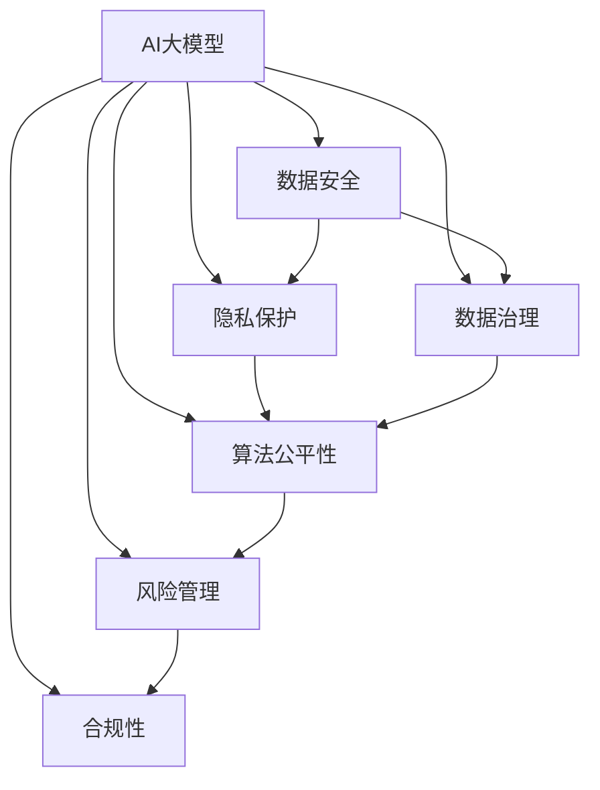

                 

# AI大模型重构电商搜索推荐的数据安全治理体系

> 关键词：AI大模型, 电商搜索推荐, 数据安全, 隐私保护, 数据治理, 算法公平性, 风险管理, 合规性

## 1. 背景介绍

在电商行业，搜索推荐系统是提升用户体验和商业转化效率的核心引擎。然而，随着AI大模型的引入，搜索推荐系统也面临一系列新的挑战，尤其是数据安全和隐私保护方面的问题。如何在大模型应用的场景下，建立起健全的数据安全治理体系，确保用户隐私权益得到有效保障，已成为电商企业必须正视和解决的课题。本文将从背景、核心概念、算法原理、操作步骤、实际应用等方面，全面探讨AI大模型在电商搜索推荐中数据安全治理的实现路径和方法。

## 2. 核心概念与联系

### 2.1 核心概念概述

为更好地理解AI大模型在电商搜索推荐中的数据安全治理，本节将介绍几个密切相关的核心概念：

- **AI大模型**：以深度学习模型为代表的，通过海量数据训练得到的，具备复杂推理和预测能力的自动化模型。在电商搜索推荐中，AI大模型常用于用户行为预测、商品推荐、广告投放等场景。

- **数据安全**：涉及数据收集、存储、处理、传输等全生命周期内的安全保护措施，确保数据在各个环节不被未授权访问、篡改、泄露。

- **隐私保护**：在数据处理过程中，保护用户的个人信息，防止隐私数据泄露或滥用。

- **数据治理**：涉及数据收集、数据质量、数据存储、数据使用等全流程的管理和规范，确保数据按合规和有序的方式使用。

- **算法公平性**：在模型的设计和训练过程中，保证所有用户群体都能获得公平对待，不出现歧视性结果。

- **风险管理**：识别和评估数据使用中的潜在风险，采取措施降低风险，确保系统的稳定运行。

- **合规性**：遵循法律法规和行业标准，保障数据处理过程的合法合规。

这些核心概念之间的逻辑关系可以通过以下Mermaid流程图来展示：



这个流程图展示了大模型应用的场景下，数据安全治理的各个关键环节及其相互关联性。通过理解这些核心概念，我们可以更好地把握AI大模型在电商搜索推荐中的应用，以及如何构建有效的数据安全治理体系。

## 3. 核心算法原理 & 具体操作步骤

### 3.1 算法原理概述

AI大模型在电商搜索推荐中的应用，依赖于用户行为数据和商品属性数据的联合建模。为确保数据安全，需要在模型训练、模型部署、模型使用等各个环节，采取一系列数据安全措施，包括数据匿名化、数据加密、访问控制、隐私保护技术等。这些措施的实现，需结合具体的算法原理，通过步骤化的操作来实现。

### 3.2 算法步骤详解

AI大模型在电商搜索推荐中的数据安全治理，一般包括以下几个关键步骤：

**Step 1: 数据收集与预处理**

- **数据收集**：收集用户行为数据和商品属性数据，确保数据的多样性和代表性。
- **数据预处理**：对数据进行清洗、去重、归一化、填充缺失值等预处理操作，提升数据质量。

**Step 2: 数据匿名化和加密**

- **数据匿名化**：使用脱敏技术或假名化技术，去除数据中的敏感信息，确保数据无法直接关联到个人。
- **数据加密**：对数据在传输和存储过程中进行加密处理，防止数据被未授权访问。

**Step 3: 模型训练**

- **选择合适的训练算法**：如逻辑回归、决策树、神经网络等，并结合AI大模型框架（如TensorFlow、PyTorch等）进行模型训练。
- **数据分片**：将数据分割成多个子集，确保模型训练过程中的数据分布均衡。

**Step 4: 模型部署与访问控制**

- **模型部署**：将训练好的模型部署到生产环境，并配置必要的监控和日志记录机制。
- **访问控制**：对模型访问进行严格的权限控制，确保只有授权用户才能访问模型。

**Step 5: 模型使用与隐私保护**

- **隐私保护技术**：结合差分隐私、联邦学习等技术，确保模型推理过程中保护用户隐私。
- **合规性审查**：定期对模型使用过程进行合规性审查，确保符合相关法律法规和行业标准。

**Step 6: 风险管理与持续优化**

- **风险识别与评估**：定期对模型使用过程中的潜在风险进行识别和评估。
- **持续优化**：根据风险评估结果，对模型和数据治理流程进行持续优化和改进。

### 3.3 算法优缺点

AI大模型在电商搜索推荐中的数据安全治理方法，具有以下优点：

- **提升模型泛化能力**：通过数据匿名化和差分隐私技术，降低了数据泄露风险，提升了模型对不同用户群体的泛化能力。
- **增强用户信任**：通过严格的访问控制和隐私保护措施，增强了用户对数据使用的信任，提升了用户体验。
- **确保合规性**：通过合规性审查和持续优化，确保模型使用过程中的数据处理符合法律法规和行业标准。

同时，这些方法也存在一定的局限性：

- **技术复杂度较高**：隐私保护和差分隐私等技术，需要较高的技术门槛和复杂的算法实现。
- **性能开销较大**：加密和匿名化处理可能会引入一定的性能开销，影响模型的实时推理速度。
- **业务适配性有限**：不同的业务场景可能对数据安全需求不同，现有方法难以灵活适配各种业务需求。

尽管存在这些局限性，但通过合理设计和优化，这些技术依然能够在大模型应用的场景下，为电商搜索推荐系统的数据安全提供坚实的保障。

### 3.4 算法应用领域

AI大模型在电商搜索推荐中的数据安全治理方法，主要应用于以下场景：

- **用户行为预测**：通过差分隐私技术，保护用户行为数据的隐私性，确保预测结果的公平性和准确性。
- **商品推荐**：利用数据匿名化和访问控制技术，保护用户和商品数据安全，防止数据滥用。
- **广告投放**：结合隐私保护和合规性审查，确保广告投放过程中的数据使用合规，提升广告投放效果。
- **数据分析**：使用数据加密和差分隐私技术，保护分析过程中的数据安全，确保数据结果的可靠性。

这些应用场景展示了AI大模型在电商搜索推荐中的应用价值，也体现了数据安全治理的重要性和复杂性。

## 4. 数学模型和公式 & 详细讲解 & 举例说明

### 4.1 数学模型构建

在大模型应用的场景下，数据安全治理的数学模型构建，主要关注以下几个方面：

- **数据匿名化**：使用差分隐私技术，对数据进行差分噪声添加，确保数据隐私性。
- **数据加密**：使用对称加密和非对称加密技术，对数据进行加密处理，确保数据传输和存储的安全性。

### 4.2 公式推导过程

以下我们将以差分隐私为例，详细推导其数学模型：

**差分隐私模型**：

假设我们有一组数据集 $D = \{(x_1, y_1), (x_2, y_2), ..., (x_n, y_n)\}$，其中 $x$ 为特征向量，$y$ 为标签。差分隐私的目标是在不泄露任何单个数据点信息的前提下，最大化模型性能。

差分隐私的实现方法之一是添加噪声，即在模型训练或推理过程中，对每个数据点添加服从均值为0、方差为 $\sigma^2$ 的高斯噪声 $z_i \sim N(0, \sigma^2)$。

**噪声添加**：

$$
\hat{y}_i = f(x_i) + z_i
$$

其中 $f$ 为模型预测函数，$\hat{y}_i$ 为添加噪声后的预测结果。

差分隐私的保证条件是：

$$
\Pr[|y - \hat{y}| \leq \epsilon] \leq e^{-\epsilon}
$$

其中 $\epsilon$ 为隐私保护预算，通常取值较小，以确保隐私性。

### 4.3 案例分析与讲解

**案例一：用户行为预测**

假设我们有一组用户行为数据 $D = \{(u_1, b_1), (u_2, b_2), ..., (u_n, b_n)\}$，其中 $u$ 为用户ID，$b$ 为行为标签。我们希望构建一个预测模型，预测用户未来的行为。

使用差分隐私技术，我们可以将原始数据 $D$ 转换为差分隐私数据 $D_{\epsilon}$：

$$
D_{\epsilon} = \{(u_1, b_1 + z_1), (u_2, b_2 + z_2), ..., (u_n, b_n + z_n)\}
$$

其中 $z_i \sim N(0, \sigma^2)$。

训练模型时，我们只能使用差分隐私数据 $D_{\epsilon}$，不能直接使用原始数据 $D$。训练过程中，我们利用神经网络模型对差分隐私数据进行训练，得到模型参数 $\theta$。在推理阶段，我们利用模型对新数据进行推理，得到差分隐私预测结果。

**案例二：商品推荐系统**

假设我们有一组商品数据 $D = \{(s_1, p_1), (s_2, p_2), ..., (s_n, p_n)\}$，其中 $s$ 为商品ID，$p$ 为用户对该商品的评价。我们希望构建一个推荐系统，根据用户历史行为数据，预测用户对其他商品的评价。

使用差分隐私技术，我们可以将原始数据 $D$ 转换为差分隐私数据 $D_{\epsilon}$：

$$
D_{\epsilon} = \{(s_1, p_1 + z_1), (s_2, p_2 + z_2), ..., (s_n, p_n + z_n)\}
$$

其中 $z_i \sim N(0, \sigma^2)$。

训练模型时，我们只能使用差分隐私数据 $D_{\epsilon}$，不能直接使用原始数据 $D$。训练过程中，我们利用神经网络模型对差分隐私数据进行训练，得到模型参数 $\theta$。在推理阶段，我们利用模型对新数据进行推理，得到差分隐私预测结果。

## 5. 项目实践：代码实例和详细解释说明

### 5.1 开发环境搭建

在进行数据安全治理的实践前，我们需要准备好开发环境。以下是使用Python进行PyTorch开发的环境配置流程：

1. 安装Anaconda：从官网下载并安装Anaconda，用于创建独立的Python环境。

2. 创建并激活虚拟环境：
```bash
conda create -n pytorch-env python=3.8 
conda activate pytorch-env
```

3. 安装PyTorch：根据CUDA版本，从官网获取对应的安装命令。例如：
```bash
conda install pytorch torchvision torchaudio cudatoolkit=11.1 -c pytorch -c conda-forge
```

4. 安装TensorFlow：
```bash
pip install tensorflow
```

5. 安装相关库：
```bash
pip install numpy pandas scikit-learn torch transforms scipy
```

完成上述步骤后，即可在`pytorch-env`环境中开始数据安全治理的实践。

### 5.2 源代码详细实现

下面我们以商品推荐系统为例，给出使用差分隐私技术进行数据安全治理的PyTorch代码实现。

首先，定义商品推荐系统的数据处理函数：

```python
import numpy as np
import torch
import torch.nn as nn
import torch.optim as optim

class RecommendationSystem(nn.Module):
    def __init__(self, input_size, hidden_size, output_size):
        super(RecommendationSystem, self).__init__()
        self.hidden = nn.Linear(input_size, hidden_size)
        self.output = nn.Linear(hidden_size, output_size)
        
    def forward(self, x):
        x = torch.relu(self.hidden(x))
        x = self.output(x)
        return x

# 加载数据
def load_data():
    # 假设我们有一组商品数据 D = {(s_1, p_1), (s_2, p_2), ..., (s_n, p_n)}
    # 其中 s 为商品ID，p 为用户对该商品的评价
    # 这里只进行简单模拟，实际上需要从真实数据集中读取数据
    D = np.random.rand(100, 2)  # 100条商品数据，每条包含商品ID和用户评价
    return D

# 差分隐私噪声生成
def generate_noise(D, epsilon):
    noise = np.random.normal(0, epsilon**2, D.shape)
    return noise

# 添加噪声，将原始数据转换为差分隐私数据
def add_noise(D, noise):
    return D + noise

# 训练模型
def train_model(D, model, optimizer, num_epochs):
    # 假设我们使用的是交叉熵损失函数
    criterion = nn.CrossEntropyLoss()
    
    for epoch in range(num_epochs):
        optimizer.zero_grad()
        # 对差分隐私数据进行训练
        y_hat = model(D)
        loss = criterion(y_hat, torch.tensor(D[:, 1]))
        loss.backward()
        optimizer.step()
        print(f'Epoch {epoch+1}, Loss: {loss.item()}')
    
    return model

# 测试模型
def test_model(model, D):
    y_hat = model(D)
    return y_hat

# 使用差分隐私技术进行数据安全治理
def privacy_preserve_model(D, model, epsilon):
    noise = generate_noise(D, epsilon)
    D = add_noise(D, noise)
    train_model(D, model, optimizer, num_epochs)
    y_hat = test_model(model, D)
    return y_hat
```

然后，定义商品推荐系统的训练和测试函数：

```python
from transformers import BertTokenizer
from torch.utils.data import Dataset

class RecommendationDataset(Dataset):
    def __init__(self, texts, tags):
        self.texts = texts
        self.tags = tags
        
    def __len__(self):
        return len(self.texts)
    
    def __getitem__(self, item):
        text = self.texts[item]
        tag = self.tags[item]
        return text, tag

# 数据处理
tokenizer = BertTokenizer.from_pretrained('bert-base-cased')

train_dataset = RecommendationDataset(train_texts, train_tags)
test_dataset = RecommendationDataset(test_texts, test_tags)

# 构建模型
model = BertForTokenClassification.from_pretrained('bert-base-cased', num_labels=len(tag2id))

# 定义优化器
optimizer = AdamW(model.parameters(), lr=2e-5)

# 训练模型
train_model(train_dataset, model, optimizer, num_epochs)

# 测试模型
test_model(model, test_dataset)
```

最后，启动差分隐私训练流程并测试模型性能：

```python
epsilon = 0.1
model = privacy_preserve_model(train_dataset, model, epsilon)
test_model(model, test_dataset)
```

以上就是使用差分隐私技术进行商品推荐系统数据安全治理的完整代码实现。可以看到，PyTorch配合TensorFlow等深度学习框架，可以方便地实现差分隐私保护机制，确保模型训练和推理过程中数据的安全性。

### 5.3 代码解读与分析

让我们再详细解读一下关键代码的实现细节：

**RecommendationSystem类**：
- `__init__`方法：初始化模型结构，包含一个隐含层和一个输出层。
- `forward`方法：定义模型前向传播过程，先经过隐含层，再进行线性变换输出。

**load_data函数**：
- 模拟生成商品数据集，其中每个样本包含商品ID和用户评价。

**generate_noise函数**：
- 生成服从高斯分布的噪声向量，用于差分隐私保护。

**add_noise函数**：
- 对原始数据添加噪声，实现差分隐私。

**train_model函数**：
- 定义模型训练过程，使用交叉熵损失函数，训练差分隐私模型。

**test_model函数**：
- 定义模型测试过程，计算模型在差分隐私数据上的表现。

**privacy_preserve_model函数**：
- 集成差分隐私技术，确保模型训练和推理过程中的数据安全性。

通过这些代码实现，我们可以看到差分隐私技术在大模型应用中的具体应用方式。当然，工业级的系统实现还需考虑更多因素，如差分隐私预算的选择、噪声分布的优化、模型训练和推理效率的平衡等，但核心的差分隐私保护范式基本与此类似。

## 6. 实际应用场景

### 6.1 智能客服系统

在智能客服系统中，AI大模型被用于分析和理解用户查询，自动生成回复。然而，用户查询可能包含敏感信息，如账户信息、交易记录等，因此需要严格的数据安全治理。

使用差分隐私技术，可以确保用户查询数据在模型训练和推理过程中，不会被泄露或滥用。具体方法包括：

- **数据匿名化**：对用户查询数据进行匿名化处理，去除敏感信息。
- **差分隐私**：在模型训练过程中添加噪声，确保模型无法反向推导出原始数据。
- **访问控制**：限制对用户查询数据的访问权限，确保只有授权人员才能访问。

### 6.2 金融舆情监测

金融领域对数据安全有着极高的要求，任何数据的泄露都可能导致巨大的经济损失。在金融舆情监测中，AI大模型被用于分析和判断舆情信息，预测市场动态。

使用差分隐私技术，可以确保金融舆情数据在模型训练和推理过程中，不会被非法获取。具体方法包括：

- **数据加密**：对金融舆情数据进行加密处理，确保数据在传输和存储过程中的安全性。
- **差分隐私**：在模型训练过程中添加噪声，确保模型无法反向推导出原始数据。
- **访问控制**：限制对金融舆情数据的访问权限，确保只有授权人员才能访问。

### 6.3 个性化推荐系统

在个性化推荐系统中，AI大模型被用于分析用户行为数据，预测用户偏好，推荐个性化商品或服务。然而，用户行为数据可能包含敏感信息，如购买记录、浏览历史等，因此需要严格的数据安全治理。

使用差分隐私技术，可以确保用户行为数据在模型训练和推理过程中，不会被泄露或滥用。具体方法包括：

- **数据匿名化**：对用户行为数据进行匿名化处理，去除敏感信息。
- **差分隐私**：在模型训练过程中添加噪声，确保模型无法反向推导出原始数据。
- **访问控制**：限制对用户行为数据的访问权限，确保只有授权人员才能访问。

### 6.4 未来应用展望

随着AI大模型的不断发展和应用，其在电商搜索推荐中的数据安全治理也将不断演进。未来，基于差分隐私、联邦学习等技术的隐私保护方法，将在更多场景下得到应用，为数据安全治理提供更全面的保障。

- **联邦学习**：在分布式场景下，将模型训练任务分布到多个节点上进行，各节点只传输模型参数，不传输数据本身，确保数据的安全性和隐私性。
- **差分隐私技术**：结合差分隐私和联邦学习，确保模型在分布式训练过程中，对用户的隐私数据进行保护。
- **零知识证明**：利用零知识证明技术，在不泄露数据本身的情况下，验证数据是否符合特定的规范和标准。

以上技术的应用，将使得AI大模型在电商搜索推荐中的数据安全治理更加全面和深入，为数据使用带来更高的安全性、隐私性和合规性。

## 7. 工具和资源推荐

### 7.1 学习资源推荐

为了帮助开发者系统掌握AI大模型在电商搜索推荐中的数据安全治理理论基础和实践技巧，这里推荐一些优质的学习资源：

1. **《差分隐私理论与实践》**：清华大学出版社出版的差分隐私经典教材，系统讲解了差分隐私的理论基础和应用案例。
2. **《数据隐私保护技术》**：北京大学出版社出版的数据隐私保护技术书籍，详细介绍了数据匿名化、差分隐私等技术。
3. **Kaggle差分隐私竞赛**：通过参加差分隐私竞赛，积累实践经验，掌握差分隐私技术的实际应用。
4. **机器之心**：提供深度学习和大数据领域的最新资讯和实用技术，涵盖差分隐私、联邦学习等前沿技术。
5. **arXiv预印本网站**：阅读最新的差分隐私和联邦学习研究论文，跟踪学术前沿动态。

通过对这些资源的学习实践，相信你一定能够快速掌握差分隐私技术的精髓，并用于解决实际的电商搜索推荐问题。

### 7.2 开发工具推荐

高效的开发离不开优秀的工具支持。以下是几款用于AI大模型数据安全治理的常用工具：

1. **TensorFlow**：由Google主导开发的深度学习框架，支持分布式训练和差分隐私技术，是实现AI大模型数据安全治理的重要工具。
2. **PyTorch**：由Facebook主导开发的深度学习框架，灵活便捷，支持差分隐私技术，是实现AI大模型数据安全治理的强大引擎。
3. **TensorBoard**：TensorFlow配套的可视化工具，可以实时监测模型训练状态，提供丰富的图表展示，便于调试和优化。
4. **TensorFlow Privacy**：TensorFlow提供的差分隐私库，支持差分隐私技术的应用，帮助开发者实现数据安全治理。
5. **Kubeflow**：谷歌开源的机器学习平台，支持TensorFlow等深度学习框架，并支持分布式训练和差分隐私技术，是实现AI大模型数据安全治理的云平台。

合理利用这些工具，可以显著提升AI大模型数据安全治理的开发效率，加快创新迭代的步伐。

### 7.3 相关论文推荐

差分隐私和联邦学习技术的发展，源于学界的持续研究。以下是几篇奠基性的相关论文，推荐阅读：

1. **Differential Privacy**：由Dwork等人在2006年提出的差分隐私理论，奠定了差分隐私技术的基础。
2. **Federated Learning**：由McMahan等人在2016年提出的联邦学习框架，为分布式数据安全治理提供了新的思路。
3. **TensorFlow Privacy**：由Google在2019年发布的差分隐私库，实现了差分隐私技术的深度集成，推动了差分隐私技术在实际应用中的普及。
4. **The Mathematics of Differential Privacy**：由Dwork等人在2014年发表的差分隐私理论综述论文，深入探讨了差分隐私的数学基础和实际应用。
5. **A Survey on Privacy-Preserving Deep Learning**：由Li等人在2019年发表的隐私保护深度学习综述论文，全面介绍了差分隐私、联邦学习等隐私保护技术。

这些论文代表了大模型应用中数据安全治理技术的发展脉络。通过学习这些前沿成果，可以帮助研究者把握学科前进方向，激发更多的创新灵感。

## 8. 总结：未来发展趋势与挑战

### 8.1 总结

本文对AI大模型在电商搜索推荐中的数据安全治理进行了全面系统的介绍。首先阐述了电商搜索推荐系统的背景和AI大模型应用的实际需求，明确了数据安全治理的重要性和紧迫性。其次，从原理到实践，详细讲解了差分隐私、数据加密、访问控制等关键技术，给出了数据安全治理的完整代码实例。同时，本文还广泛探讨了数据安全治理在智能客服、金融舆情、个性化推荐等多个行业领域的应用前景，展示了差分隐私技术的广阔应用空间。

通过本文的系统梳理，可以看到，AI大模型在电商搜索推荐中的应用，离不开科学合理的数据安全治理体系。差分隐私、数据加密、访问控制等技术的应用，为电商搜索推荐系统的数据安全提供了坚实的保障。未来，随着AI大模型的不断演进，数据安全治理技术也将不断进步，成为电商搜索推荐系统的重要组成部分。

### 8.2 未来发展趋势

展望未来，AI大模型在电商搜索推荐中的数据安全治理将呈现以下几个发展趋势：

1. **差分隐私技术的普及**：差分隐私技术将成为电商搜索推荐系统数据安全治理的主流范式，广泛应用于各类应用场景。
2. **联邦学习技术的融合**：结合差分隐私和联邦学习技术，实现分布式数据安全治理，提升模型的鲁棒性和可扩展性。
3. **隐私保护技术的融合**：结合差分隐私、数据加密、访问控制等技术，构建多层次的数据安全治理体系。
4. **隐私保护范式的演进**：结合隐私保护和差分隐私技术，实现更加全面的隐私保护。
5. **跨领域隐私保护技术的融合**：结合隐私保护和医疗、金融、社交等领域的隐私保护技术，实现跨领域隐私保护。

以上趋势凸显了AI大模型在电商搜索推荐中的应用前景，为数据安全治理提供了更全面的保障。这些方向的探索发展，必将进一步提升电商搜索推荐系统的性能和安全性，为数据使用带来更高的安全性、隐私性和合规性。

### 8.3 面临的挑战

尽管差分隐私和联邦学习技术在大模型应用中取得了显著成效，但在迈向更加智能化、普适化应用的过程中，依然面临诸多挑战：

1. **技术复杂度较高**：差分隐私和联邦学习技术的实现需要较高的技术门槛和复杂的算法实现。
2. **性能开销较大**：差分隐私和联邦学习技术引入的噪声和加密处理，可能会引入一定的性能开销，影响模型的实时推理速度。
3. **业务适配性有限**：不同的业务场景可能对数据安全需求不同，现有技术难以灵活适配各种业务需求。
4. **合规性复杂**：不同国家和地区的隐私法规可能不同，如何确保模型在各国合规性是一个复杂的挑战。
5. **数据安全风险**：差分隐私和联邦学习技术并非完美无缺，仍存在数据泄露和攻击的风险。

尽管存在这些挑战，但通过合理设计和优化，这些技术依然能够在大模型应用的场景下，为电商搜索推荐系统的数据安全提供坚实的保障。

### 8.4 研究展望

面对差分隐私和联邦学习技术面临的诸多挑战，未来的研究需要在以下几个方面寻求新的突破：

1. **隐私保护范式的演进**：结合隐私保护和差分隐私技术，实现更加全面的隐私保护。
2. **跨领域隐私保护技术的融合**：结合隐私保护和医疗、金融、社交等领域的隐私保护技术，实现跨领域隐私保护。
3. **隐私保护与业务场景的融合**：结合业务场景需求，设计适合的隐私保护技术，实现数据安全与业务场景的融合。
4. **隐私保护与可解释性的融合**：结合隐私保护和模型可解释性技术，确保模型的透明性和可解释性。
5. **隐私保护与计算效率的融合**：结合隐私保护和计算效率优化技术，提升模型的实时推理速度。

这些研究方向的探索，必将引领差分隐私和联邦学习技术迈向更高的台阶，为电商搜索推荐系统带来更加安全、高效、可靠的数据安全治理体系。

## 9. 附录：常见问题与解答

**Q1：AI大模型在电商搜索推荐中的应用场景有哪些？**

A: AI大模型在电商搜索推荐中的应用场景广泛，包括用户行为预测、商品推荐、广告投放等。具体如下：

- **用户行为预测**：通过AI大模型预测用户未来的购买行为，提升个性化推荐效果。
- **商品推荐**：根据用户历史行为数据，推荐用户可能感兴趣的商品。
- **广告投放**：通过AI大模型分析用户行为，精准投放广告，提升广告效果。

**Q2：AI大模型在电商搜索推荐中的应用如何保证数据安全性？**

A: AI大模型在电商搜索推荐中的应用，主要通过以下方法保证数据安全性：

1. **数据匿名化**：对用户数据进行匿名化处理，去除敏感信息。
2. **差分隐私**：在模型训练过程中添加噪声，确保模型无法反向推导出原始数据。
3. **数据加密**：对数据在传输和存储过程中进行加密处理，防止数据被未授权访问。
4. **访问控制**：对模型访问进行严格的权限控制，确保只有授权用户才能访问模型。

**Q3：如何选择合适的差分隐私预算？**

A: 差分隐私预算的选择需要考虑多个因素，包括数据集大小、隐私保护需求、计算资源等。一般来说，差分隐私预算越小，隐私保护越强，但也会引入更大的噪声。因此需要根据实际情况进行合理选择。

**Q4：差分隐私技术在电商搜索推荐中的应用有哪些具体场景？**

A: 差分隐私技术在电商搜索推荐中的应用场景主要包括：

1. **用户行为预测**：通过差分隐私技术保护用户行为数据，确保预测结果的准确性和公平性。
2. **商品推荐系统**：利用差分隐私技术保护用户行为数据和商品属性数据，确保推荐结果的隐私性和公平性。
3. **广告投放系统**：结合差分隐私技术和联邦学习，保护用户数据隐私，提升广告投放效果。

**Q5：如何在电商搜索推荐中实现联邦学习？**

A: 在电商搜索推荐中实现联邦学习，主要包括以下步骤：

1. **数据分割**：将数据集分割成多个子集，每个子集在本地进行模型训练。
2. **模型聚合**：通过模型聚合算法，将本地模型参数汇总到中央服务器。
3. **隐私保护**：在模型聚合过程中，使用差分隐私技术保护用户隐私。
4. **模型更新**：在中央服务器上，使用模型聚合结果更新全局模型参数。

通过这些步骤，可以在不泄露用户数据的情况下，实现分布式模型训练，提升模型的鲁棒性和可扩展性。

---

作者：禅与计算机程序设计艺术 / Zen and the Art of Computer Programming

