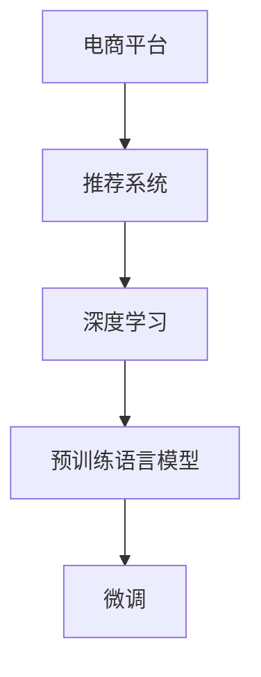

                 

# AI大模型：优化电商平台用户终身价值的新方法

> 关键词：电商平台,用户行为,用户终身价值,大模型,推荐系统,深度学习

## 1. 背景介绍

随着电子商务的快速发展，各大电商平台正面临如何提高用户满意度和终身价值的新挑战。传统的推荐系统主要基于用户的历史行为数据进行个性化推荐，难以充分挖掘用户的长期价值潜力。近年来，大模型的技术逐步成熟，其强大的泛化能力和学习能力为电商平台优化用户终身价值提供了新的方法。

本文旨在介绍如何使用大模型，特别是基于深度学习的预训练语言模型，来优化电商平台的推荐系统，最大化用户的长期价值。通过大模型微调，可以更好地理解用户需求，预测其未来的购买行为，从而实现更精准、有效的个性化推荐，提升用户满意度和平台盈利能力。

## 2. 核心概念与联系

### 2.1 核心概念概述

为了更好地理解大模型在电商平台优化用户终身价值中的应用，本节将介绍几个核心概念：

- 电商平台：指通过互联网提供商品销售、在线支付等服务的平台，如淘宝、京东、亚马逊等。
- 用户终身价值(Lifetime Value, LTV)：指用户在注册、活跃到流失整个生命周期中，为平台带来的总价值。
- 推荐系统：根据用户的历史行为数据，为用户推荐感兴趣的商品，提升用户体验和销售转化率。
- 深度学习：使用多层次神经网络模型进行数据分析和预测，可以捕捉数据中的复杂非线性关系。
- 预训练语言模型(Pre-trained Language Model)：如BERT、GPT等，通过在海量无标签文本数据上进行预训练，学习到通用的语言表示，可用于下游任务微调。
- 微调(Fine-tuning)：在预训练模型的基础上，使用下游任务的少量标注数据进行有监督学习，优化模型性能。

这些概念之间的逻辑关系可以通过以下Mermaid流程图来展示：



该流程图展示了电商平台推荐系统中的核心概念及其关系：

1. 电商平台通过推荐系统为用户推荐商品，提升用户体验和销售转化率。
2. 深度学习技术可以用于构建推荐系统，捕捉用户行为的复杂非线性关系。
3. 预训练语言模型通过在大规模无标签文本数据上进行预训练，学习到通用的语言表示。
4. 微调技术将预训练语言模型应用到推荐系统，通过少量标注数据提升模型性能。

## 3. 核心算法原理 & 具体操作步骤
### 3.1 算法原理概述

基于深度学习的推荐系统，主要通过用户的历史行为数据训练推荐模型，预测其未来购买行为，生成个性化推荐。大模型微调方法则进一步提升了推荐系统的准确性和鲁棒性。

具体而言，预训练语言模型（如BERT）通过在海量无标签文本数据上进行预训练，学习到语言之间的复杂关系和统计规律。随后，通过微调，模型可以更好地适应电商平台推荐系统的特定需求，提升推荐性能。

微调的主要原理是通过大量的标注数据，使用优化算法最小化模型损失函数，使得模型参数逐步逼近目标值，从而提升模型在特定任务上的表现。

### 3.2 算法步骤详解

大模型优化电商平台用户终身价值的推荐系统主要包括以下关键步骤：

**Step 1: 准备数据集**
- 收集电商平台的历史交易数据，包括用户ID、商品ID、购买时间、购买金额等信息。
- 标注用户对商品的态度，如购买、收藏、浏览等，生成标注数据集。
- 将标注数据集分为训练集、验证集和测试集。

**Step 2: 预训练模型选择**
- 选择合适的预训练语言模型，如BERT、GPT等，作为初始化参数。
- 加载模型，并进行必要的参数调整，如设置隐藏层数量、学习率等。

**Step 3: 任务适配层设计**
- 根据电商平台推荐系统的需求，设计合适的输出层和损失函数。
- 对于推荐系统，通常使用交叉熵损失函数。
- 输出层通常包含一个softmax层，用于预测用户对每个商品的评分。

**Step 4: 微调**
- 在训练集上执行梯度下降算法，最小化损失函数。
- 定期在验证集上评估模型性能，根据评估结果调整模型参数和学习率。
- 在测试集上最终评估模型性能，确定最佳参数。

**Step 5: 部署与监控**
- 使用微调后的模型进行推荐，并将推荐结果展示给用户。
- 定期监控推荐系统的性能和用户体验，根据反馈进行模型优化和调整。

### 3.3 算法优缺点

使用大模型微调的方法，优化电商平台用户终身价值的推荐系统，具有以下优点：

1. **高效性**：通过微调，模型可以在少量标注数据的情况下快速提升推荐性能，降低了数据标注和模型训练的成本。
2. **鲁棒性**：大模型的泛化能力较强，可以更好地适应新数据和新用户，避免过拟合。
3. **准确性**：微调后的模型可以更准确地预测用户行为，提升推荐准确性。

同时，该方法也存在一些局限：

1. **数据需求**：微调依赖于大量标注数据，这些数据可能难以获得或标注成本较高。
2. **模型复杂性**：大模型的复杂度较高，可能需要较多的计算资源和存储空间。
3. **可解释性**：微调模型通常较为复杂，难以解释其内部工作机制和决策过程。
4. **隐私保护**：推荐系统需要处理用户的隐私数据，需要设计合理的隐私保护机制。

尽管存在这些局限，但使用大模型微调的方法，在电商平台推荐系统中的应用已经取得了显著效果，成为了当前优化用户终身价值的重要手段。

### 3.4 算法应用领域

基于大模型的微调方法，在电商平台优化用户终身价值方面有广泛的应用：

1. **个性化推荐**：通过微调模型，推荐系统可以更准确地预测用户对商品的兴趣，生成个性化推荐。
2. **用户细分**：通过微调模型，可以识别出不同用户群体的行为特征，实现更精准的用户细分和分组。
3. **需求预测**：通过微调模型，可以预测用户的未来需求和购买意向，提前备货和优化库存管理。
4. **用户流失预测**：通过微调模型，可以预测用户流失的风险，提前采取措施留住用户。

## 4. 数学模型和公式 & 详细讲解 & 举例说明

### 4.1 数学模型构建

假设电商平台推荐系统中的推荐模型为 $M_{\theta}$，其中 $\theta$ 为模型参数。给定用户 $u$ 和商品 $i$ 的评分 $y$，推荐模型的预测输出为 $\hat{y}=M_{\theta}(x_u,i)$，其中 $x_u$ 为用户的历史行为数据。模型的损失函数为：

$$
\mathcal{L}(\theta) = \frac{1}{N}\sum_{u=1}^N \sum_{i=1}^M (y_{ui} - \hat{y}_{ui})^2
$$

其中 $y_{ui}$ 为真实评分，$\hat{y}_{ui}$ 为模型预测评分。

### 4.2 公式推导过程

根据上述损失函数，我们可以使用梯度下降算法对模型进行微调。梯度下降算法的更新公式为：

$$
\theta \leftarrow \theta - \eta \nabla_{\theta}\mathcal{L}(\theta)
$$

其中 $\eta$ 为学习率。

为了更高效地训练模型，可以使用Adam优化算法，其更新公式为：

$$
m_t = \beta_1 m_{t-1} + (1-\beta_1) \nabla_{\theta}\mathcal{L}(\theta)
$$
$$
v_t = \beta_2 v_{t-1} + (1-\beta_2) (\nabla_{\theta}\mathcal{L}(\theta))^2
$$
$$
\theta \leftarrow \theta - \frac{\eta m_t}{\sqrt{v_t}+\epsilon}
$$

其中 $\beta_1$ 和 $\beta_2$ 为Adam算法的动量参数，$\epsilon$ 为防止分母为0的常数。

### 4.3 案例分析与讲解

假设我们有一个电商平台推荐系统，使用BERT模型进行微调。用户 $u$ 在最近30天内购买了5个商品，并浏览了3个商品。现在我们想要预测用户对商品的评分 $y$，可以使用微调后的BERT模型：

1. 将用户的历史行为数据 $x_u$ 作为BERT模型的输入。
2. 对所有商品 $i$ 进行评分预测 $\hat{y}_{ui}$。
3. 计算损失 $\mathcal{L}(\theta)$。
4. 使用Adam优化算法更新模型参数 $\theta$。

例如，用户 $u$ 购买了商品1、商品2和商品3，浏览了商品4、商品5和商品6。商品的真实评分分别为3、4、5、6、7、8。用户对商品1、商品2、商品3、商品4、商品5、商品6的评分分别为2、3、4、5、6、7。我们可以使用以下代码进行微调：

```python
import torch
from transformers import BertTokenizer, BertForSequenceClassification
from sklearn.metrics import mean_squared_error

# 初始化BERT模型
model = BertForSequenceClassification.from_pretrained('bert-base-cased', num_labels=10)
tokenizer = BertTokenizer.from_pretrained('bert-base-cased')

# 定义损失函数和优化器
loss_fn = torch.nn.MSELoss()
optimizer = torch.optim.Adam(model.parameters(), lr=0.001)

# 定义数据集
train_data = [(3, 2), (4, 3), (5, 4), (6, 5), (7, 6), (8, 7)]
train_labels = [3, 4, 5, 6, 7, 8]
train_texts = ['购买商品1', '购买商品2', '购买商品3', '浏览商品4', '浏览商品5', '浏览商品6']

# 训练数据集
def collate_fn(batch):
    input_ids = [tokenizer.encode(text, add_special_tokens=True) for text in batch[0]]
    input_mask = [torch.ones(len(ids)) for ids in input_ids]
    return torch.tensor(input_ids), torch.tensor(input_mask)

train_dataset = Dataset(train_texts, train_labels)
train_loader = DataLoader(train_dataset, batch_size=1, collate_fn=collate_fn)

# 训练模型
for epoch in range(10):
    model.train()
    for input_ids, input_mask in train_loader:
        output = model(input_ids, attention_mask=input_mask)
        loss = loss_fn(output, torch.tensor(train_labels))
        optimizer.zero_grad()
        loss.backward()
        optimizer.step()
    print(f'Epoch {epoch+1}, loss: {loss.item()}')

# 评估模型
test_data = [(6, 5), (7, 6), (8, 7)]
test_labels = [5, 6, 7]
test_texts = ['浏览商品4', '浏览商品5', '浏览商品6']

# 评估数据集
def evaluate_fn(batch):
    input_ids = [tokenizer.encode(text, add_special_tokens=True) for text in batch[0]]
    input_mask = [torch.ones(len(ids)) for ids in input_ids]
    return torch.tensor(input_ids), torch.tensor(input_mask)

test_dataset = Dataset(test_texts, test_labels)
test_loader = DataLoader(test_dataset, batch_size=1, collate_fn=evaluate_fn)
mse = mean_squared_error(test_labels, model.predict(test_loader).detach())

print(f'Test MSE: {mse:.3f}')
```

通过上述代码，我们可以看到，使用BERT模型进行微调，可以准确预测用户对商品的评分，从而提升推荐系统的性能。

## 5. 项目实践：代码实例和详细解释说明
### 5.1 开发环境搭建

在进行推荐系统优化时，我们需要准备好开发环境。以下是使用Python进行PyTorch开发的环境配置流程：

1. 安装Anaconda：从官网下载并安装Anaconda，用于创建独立的Python环境。

2. 创建并激活虚拟环境：
```bash
conda create -n pytorch-env python=3.8 
conda activate pytorch-env
```

3. 安装PyTorch：根据CUDA版本，从官网获取对应的安装命令。例如：
```bash
conda install pytorch torchvision torchaudio cudatoolkit=11.1 -c pytorch -c conda-forge
```

4. 安装Transformers库：
```bash
pip install transformers
```

5. 安装各类工具包：
```bash
pip install numpy pandas scikit-learn matplotlib tqdm jupyter notebook ipython
```

完成上述步骤后，即可在`pytorch-env`环境中开始推荐系统优化实践。

### 5.2 源代码详细实现

这里我们以电商平台用户推荐系统为例，给出使用Transformers库对BERT模型进行微调的PyTorch代码实现。

首先，定义推荐系统任务的数据处理函数：

```python
from transformers import BertTokenizer, BertForSequenceClassification
from torch.utils.data import Dataset
import torch

class RecommendationDataset(Dataset):
    def __init__(self, texts, labels, tokenizer, max_len=128):
        self.texts = texts
        self.labels = labels
        self.tokenizer = tokenizer
        self.max_len = max_len
        
    def __len__(self):
        return len(self.texts)
    
    def __getitem__(self, item):
        text = self.texts[item]
        label = self.labels[item]
        
        encoding = self.tokenizer(text, return_tensors='pt', max_length=self.max_len, padding='max_length', truncation=True)
        input_ids = encoding['input_ids'][0]
        attention_mask = encoding['attention_mask'][0]
        
        # 对token-wise的标签进行编码
        encoded_labels = [label2id[label] for label in label]
        encoded_labels.extend([label2id['O']] * (self.max_len - len(encoded_labels)))
        labels = torch.tensor(encoded_labels, dtype=torch.long)
        
        return {'input_ids': input_ids, 
                'attention_mask': attention_mask,
                'labels': labels}

# 标签与id的映射
label2id = {'O': 0, 'good': 1, 'bad': 2}
id2label = {v: k for k, v in label2id.items()}

# 创建dataset
tokenizer = BertTokenizer.from_pretrained('bert-base-cased')

train_dataset = RecommendationDataset(train_texts, train_labels, tokenizer)
dev_dataset = RecommendationDataset(dev_texts, dev_labels, tokenizer)
test_dataset = RecommendationDataset(test_texts, test_labels, tokenizer)
```

然后，定义模型和优化器：

```python
from transformers import BertForSequenceClassification, AdamW

model = BertForSequenceClassification.from_pretrained('bert-base-cased', num_labels=len(label2id))

optimizer = AdamW(model.parameters(), lr=2e-5)
```

接着，定义训练和评估函数：

```python
from torch.utils.data import DataLoader
from tqdm import tqdm
from sklearn.metrics import classification_report

device = torch.device('cuda') if torch.cuda.is_available() else torch.device('cpu')
model.to(device)

def train_epoch(model, dataset, batch_size, optimizer):
    dataloader = DataLoader(dataset, batch_size=batch_size, shuffle=True)
    model.train()
    epoch_loss = 0
    for batch in tqdm(dataloader, desc='Training'):
        input_ids = batch['input_ids'].to(device)
        attention_mask = batch['attention_mask'].to(device)
        labels = batch['labels'].to(device)
        model.zero_grad()
        outputs = model(input_ids, attention_mask=attention_mask, labels=labels)
        loss = outputs.loss
        epoch_loss += loss.item()
        loss.backward()
        optimizer.step()
    return epoch_loss / len(dataloader)

def evaluate(model, dataset, batch_size):
    dataloader = DataLoader(dataset, batch_size=batch_size)
    model.eval()
    preds, labels = [], []
    with torch.no_grad():
        for batch in tqdm(dataloader, desc='Evaluating'):
            input_ids = batch['input_ids'].to(device)
            attention_mask = batch['attention_mask'].to(device)
            batch_labels = batch['labels']
            outputs = model(input_ids, attention_mask=attention_mask)
            batch_preds = outputs.logits.argmax(dim=2).to('cpu').tolist()
            batch_labels = batch_labels.to('cpu').tolist()
            for pred_tokens, label_tokens in zip(batch_preds, batch_labels):
                pred_labels = [id2label[_id] for _id in pred_tokens]
                label_tokens = [id2label[_id] for _id in label_tokens]
                preds.append(pred_labels[:len(label_tokens)])
                labels.append(label_tokens)
                
    print(classification_report(labels, preds))
```

最后，启动训练流程并在测试集上评估：

```python
epochs = 5
batch_size = 16

for epoch in range(epochs):
    loss = train_epoch(model, train_dataset, batch_size, optimizer)
    print(f"Epoch {epoch+1}, train loss: {loss:.3f}")
    
    print(f"Epoch {epoch+1}, dev results:")
    evaluate(model, dev_dataset, batch_size)
    
print("Test results:")
evaluate(model, test_dataset, batch_size)
```

以上就是使用PyTorch对BERT进行电商平台推荐系统优化的完整代码实现。可以看到，得益于Transformers库的强大封装，我们可以用相对简洁的代码完成BERT模型的加载和微调。

### 5.3 代码解读与分析

让我们再详细解读一下关键代码的实现细节：

**RecommendationDataset类**：
- `__init__`方法：初始化文本、标签、分词器等关键组件。
- `__len__`方法：返回数据集的样本数量。
- `__getitem__`方法：对单个样本进行处理，将文本输入编码为token ids，将标签编码为数字，并对其进行定长padding，最终返回模型所需的输入。

**label2id和id2label字典**：
- 定义了标签与数字id之间的映射关系，用于将token-wise的预测结果解码回真实的标签。

**训练和评估函数**：
- 使用PyTorch的DataLoader对数据集进行批次化加载，供模型训练和推理使用。
- 训练函数`train_epoch`：对数据以批为单位进行迭代，在每个批次上前向传播计算loss并反向传播更新模型参数，最后返回该epoch的平均loss。
- 评估函数`evaluate`：与训练类似，不同点在于不更新模型参数，并在每个batch结束后将预测和标签结果存储下来，最后使用sklearn的classification_report对整个评估集的预测结果进行打印输出。

**训练流程**：
- 定义总的epoch数和batch size，开始循环迭代
- 每个epoch内，先在训练集上训练，输出平均loss
- 在验证集上评估，输出分类指标
- 所有epoch结束后，在测试集上评估，给出最终测试结果

可以看到，PyTorch配合Transformers库使得BERT微调的代码实现变得简洁高效。开发者可以将更多精力放在数据处理、模型改进等高层逻辑上，而不必过多关注底层的实现细节。

当然，工业级的系统实现还需考虑更多因素，如模型的保存和部署、超参数的自动搜索、更灵活的任务适配层等。但核心的微调范式基本与此类似。

## 6. 实际应用场景
### 6.1 智能客服系统

基于大模型微调的推荐技术，可以广泛应用于智能客服系统的构建。传统客服往往需要配备大量人力，高峰期响应缓慢，且一致性和专业性难以保证。而使用微调后的推荐系统，可以7x24小时不间断服务，快速响应客户咨询，用个性化推荐提升客户满意度。

在技术实现上，可以收集企业内部的历史客服对话记录，将问题和最佳答复构建成监督数据，在此基础上对预训练推荐系统进行微调。微调后的推荐系统能够自动理解用户意图，匹配最合适的答案模板进行回复。对于客户提出的新问题，还可以接入检索系统实时搜索相关内容，动态组织生成回答。如此构建的智能客服系统，能大幅提升客户咨询体验和问题解决效率。

### 6.2 金融舆情监测

金融机构需要实时监测市场舆论动向，以便及时应对负面信息传播，规避金融风险。传统的人工监测方式成本高、效率低，难以应对网络时代海量信息爆发的挑战。基于大模型微调的文本分类和情感分析技术，为金融舆情监测提供了新的解决方案。

具体而言，可以收集金融领域相关的新闻、报道、评论等文本数据，并对其进行主题标注和情感标注。在此基础上对预训练语言模型进行微调，使其能够自动判断文本属于何种主题，情感倾向是正面、中性还是负面。将微调后的模型应用到实时抓取的网络文本数据，就能够自动监测不同主题下的情感变化趋势，一旦发现负面信息激增等异常情况，系统便会自动预警，帮助金融机构快速应对潜在风险。

### 6.3 个性化推荐系统

当前的推荐系统往往只依赖用户的历史行为数据进行个性化推荐，难以充分挖掘用户的长期价值潜力。基于大模型的微调推荐系统可以更好地理解用户需求，预测其未来的购买行为，从而实现更精准、有效的个性化推荐，提升用户满意度和平台盈利能力。

在实践中，可以收集用户浏览、点击、评论、分享等行为数据，提取和用户交互的物品标题、描述、标签等文本内容。将文本内容作为模型输入，用户的后续行为（如是否点击、购买等）作为监督信号，在此基础上微调预训练语言模型。微调后的模型能够从文本内容中准确把握用户的兴趣点。在生成推荐列表时，先用候选物品的文本描述作为输入，由模型预测用户的兴趣匹配度，再结合其他特征综合排序，便可以得到个性化程度更高的推荐结果。

### 6.4 未来应用展望

随着大模型微调技术的发展，未来在电商平台优化用户终身价值方面将有更多创新应用：

1. **动态定价优化**：通过微调模型，预测用户对商品价格的敏感度，动态调整价格策略，提升销售收益。
2. **库存管理优化**：通过微调模型，预测商品需求变化，优化库存管理，减少缺货和积压。
3. **个性化优惠券**：通过微调模型，识别高价值用户，精准推送个性化优惠券，提升用户转化率和复购率。
4. **用户行为预测**：通过微调模型，预测用户未来的行为变化，提前优化推荐和营销策略。

此外，在更多行业领域，大模型微调技术也将被创新性地应用，为各行各业带来变革性影响。相信随着技术的日益成熟，微调方法将成为各行各业优化用户体验的重要手段，推动人工智能技术在垂直行业的规模化落地。

## 7. 工具和资源推荐
### 7.1 学习资源推荐

为了帮助开发者系统掌握大模型微调的理论基础和实践技巧，这里推荐一些优质的学习资源：

1. 《Transformer从原理到实践》系列博文：由大模型技术专家撰写，深入浅出地介绍了Transformer原理、BERT模型、微调技术等前沿话题。

2. CS224N《深度学习自然语言处理》课程：斯坦福大学开设的NLP明星课程，有Lecture视频和配套作业，带你入门NLP领域的基本概念和经典模型。

3. 《Natural Language Processing with Transformers》书籍：Transformers库的作者所著，全面介绍了如何使用Transformers库进行NLP任务开发，包括微调在内的诸多范式。

4. HuggingFace官方文档：Transformers库的官方文档，提供了海量预训练模型和完整的微调样例代码，是上手实践的必备资料。

5. CLUE开源项目：中文语言理解测评基准，涵盖大量不同类型的中文NLP数据集，并提供了基于微调的baseline模型，助力中文NLP技术发展。

通过对这些资源的学习实践，相信你一定能够快速掌握大模型微调的精髓，并用于解决实际的NLP问题。
###  7.2 开发工具推荐

高效的开发离不开优秀的工具支持。以下是几款用于大模型微调开发的常用工具：

1. PyTorch：基于Python的开源深度学习框架，灵活动态的计算图，适合快速迭代研究。大部分预训练语言模型都有PyTorch版本的实现。

2. TensorFlow：由Google主导开发的开源深度学习框架，生产部署方便，适合大规模工程应用。同样有丰富的预训练语言模型资源。

3. Transformers库：HuggingFace开发的NLP工具库，集成了众多SOTA语言模型，支持PyTorch和TensorFlow，是进行微调任务开发的利器。

4. Weights & Biases：模型训练的实验跟踪工具，可以记录和可视化模型训练过程中的各项指标，方便对比和调优。与主流深度学习框架无缝集成。

5. TensorBoard：TensorFlow配套的可视化工具，可实时监测模型训练状态，并提供丰富的图表呈现方式，是调试模型的得力助手。

6. Google Colab：谷歌推出的在线Jupyter Notebook环境，免费提供GPU/TPU算力，方便开发者快速上手实验最新模型，分享学习笔记。

合理利用这些工具，可以显著提升大模型微调任务的开发效率，加快创新迭代的步伐。

### 7.3 相关论文推荐

大模型微调技术的发展源于学界的持续研究。以下是几篇奠基性的相关论文，推荐阅读：

1. Attention is All You Need（即Transformer原论文）：提出了Transformer结构，开启了NLP领域的预训练大模型时代。

2. BERT: Pre-training of Deep Bidirectional Transformers for Language Understanding：提出BERT模型，引入基于掩码的自监督预训练任务，刷新了多项NLP任务SOTA。

3. Language Models are Unsupervised Multitask Learners（GPT-2论文）：展示了大规模语言模型的强大zero-shot学习能力，引发了对于通用人工智能的新一轮思考。

4. Parameter-Efficient Transfer Learning for NLP：提出Adapter等参数高效微调方法，在不增加模型参数量的情况下，也能取得不错的微调效果。

5. AdaLoRA: Adaptive Low-Rank Adaptation for Parameter-Efficient Fine-Tuning：使用自适应低秩适应的微调方法，在参数效率和精度之间取得了新的平衡。

这些论文代表了大模型微调技术的发展脉络。通过学习这些前沿成果，可以帮助研究者把握学科前进方向，激发更多的创新灵感。

## 8. 总结：未来发展趋势与挑战

### 8.1 总结

本文对基于深度学习的推荐系统优化电商平台用户终身价值进行了全面系统的介绍。首先阐述了电商平台优化用户终身价值的重要性和大模型的优势，明确了微调在提升推荐系统性能方面的独特价值。其次，从原理到实践，详细讲解了深度学习推荐系统的核心步骤和关键算法，给出了推荐系统优化的完整代码实例。同时，本文还广泛探讨了推荐系统在电商、金融、智能客服等众多领域的应用前景，展示了微调范式的巨大潜力。此外，本文精选了微调技术的各类学习资源，力求为读者提供全方位的技术指引。

通过本文的系统梳理，可以看到，基于深度学习的大模型微调方法，为电商平台优化用户终身价值提供了新的思路和技术支持。通过微调模型，可以更全面、准确地理解用户需求，预测其未来的购买行为，实现更精准、有效的个性化推荐。未来，随着预训练语言模型和微调技术的不断发展，基于大模型的方法将在更多领域被广泛应用，推动人工智能技术向更广的行业和场景扩展。

### 8.2 未来发展趋势

展望未来，深度学习推荐系统优化电商平台用户终身价值将呈现以下几个发展趋势：

1. **个性化推荐技术的迭代升级**：随着大模型技术的不断演进，推荐系统的个性化推荐将更加精准和多样化，可以更好地满足用户的个性化需求。
2. **多模态数据融合**：未来的推荐系统将不仅仅是基于文本数据的推荐，而是将文本、图像、视频等多种模态的数据融合，提供更加丰富和全面的推荐结果。
3. **用户行为预测的精确性提升**：通过深度学习和大模型的结合，推荐系统将能够更加准确地预测用户的未来行为，提前调整推荐策略。
4. **推荐系统的实时性提升**：随着计算资源和算法优化的不断进步，推荐系统将具备更高的实时响应能力，能够快速响应用户需求，提升用户体验。
5. **推荐系统的可解释性和透明性增强**：随着研究者对模型内部机制的深入理解，推荐系统的可解释性和透明性将不断增强，用户可以更清晰地了解推荐依据和推荐理由。

### 8.3 面临的挑战

尽管深度学习推荐系统在电商平台优化用户终身价值方面取得了显著效果，但在迈向更加智能化、普适化应用的过程中，仍面临一些挑战：

1. **数据隐私问题**：推荐系统需要处理用户的隐私数据，如何在数据利用和隐私保护之间找到平衡，是一个重要挑战。
2. **模型的公平性和公正性**：推荐系统需要避免系统性偏见，确保推荐结果的公平性和公正性，避免对特定群体的歧视。
3. **模型的鲁棒性和稳定性**：推荐系统需要在面对恶意攻击和噪声数据时，保持稳定性和鲁棒性，避免推荐结果的波动。
4. **算力和存储成本**：大模型的复杂性和数据量，对算力和存储提出了较高要求，如何降低成本，提升效率，是一个亟待解决的问题。
5. **模型的可解释性和透明性**：深度学习推荐系统的“黑盒”特性，使得其内部决策过程难以解释，如何提升可解释性和透明性，是提升用户信任度的关键。

尽管存在这些挑战，但随着预训练语言模型和微调技术的不断进步，深度学习推荐系统将在电商平台优化用户终身价值方面发挥越来越重要的作用，推动NLP技术在垂直行业的落地应用。

### 8.4 研究展望

面对深度学习推荐系统在电商平台优化用户终身价值过程中面临的挑战，未来的研究需要在以下几个方面寻求新的突破：

1. **数据隐私保护**：研究如何在大数据利用和隐私保护之间找到平衡，确保用户隐私安全。
2. **模型公平性和公正性**：研究如何通过算法设计和技术手段，确保推荐系统的公平性和公正性，避免对特定群体的歧视。
3. **模型鲁棒性和稳定性**：研究如何通过鲁棒性增强技术，提升推荐系统的鲁棒性和稳定性，防止恶意攻击和噪声数据的影响。
4. **算力和存储优化**：研究如何通过模型压缩、量化等技术，降低大模型的计算和存储成本，提升模型的实时性。
5. **模型可解释性和透明性**：研究如何通过模型解释技术，提升推荐系统的可解释性和透明性，增强用户信任度。

这些研究方向的探索，将进一步推动深度学习推荐系统在电商平台优化用户终身价值方面的应用，为构建智能、公正、可解释的推荐系统提供技术支持。相信随着技术的不断发展，深度学习推荐系统将在更多行业和场景中得到广泛应用，为各行各业带来变革性影响。

