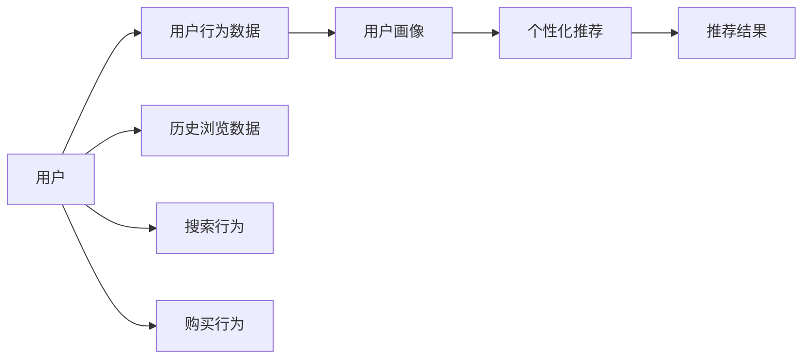

                 

## 1. 背景介绍

随着电子商务的迅猛发展，电商平台已经成为了人们日常生活的重要组成部分。然而，新用户的冷启动问题一直是一个困扰电商平台的瓶颈。对于新注册的用户，电商平台往往需要花费大量的时间和成本去进行用户画像构建和商品推荐，这不仅增加了运营负担，也影响了用户体验。为了解决这个问题，传统的推荐算法如基于协同过滤、基于内容的推荐等已经取得了一定的效果，但依然存在推荐精准度不足、个性化推荐策略难以适应新用户等局限。近年来，随着AI大模型的发展，利用大模型进行用户画像和推荐技术的研究逐渐兴起，大模型在电商平台的应用潜力正在逐步显现。

## 2. 核心概念与联系

### 2.1 核心概念概述

- **AI大模型**：以深度学习为核心的自动化算法模型，通常以Transformer为架构，拥有庞大的参数量，能够自动提取和抽象高层次的特征，适用于各种复杂任务，如自然语言处理、图像识别、语音识别等。

- **冷启动问题**：用户注册时，系统无法获取用户过往行为数据，难以提供精准的个性化推荐和用户画像，导致推荐效果欠佳。

- **用户画像构建**：通过用户的历史行为、兴趣偏好等信息，构建用户完整的个人画像，从而为个性化推荐提供依据。

- **推荐算法**：基于用户的个性化需求，算法模型为用户推荐最适合的商品或内容，提高用户的满意度。

- **个性化推荐**：针对每个用户的特定需求和兴趣，提供量身定制的推荐结果，提升用户体验。

### 2.2 核心概念原理和架构的 Mermaid 流程图



## 3. 核心算法原理 & 具体操作步骤

### 3.1 算法原理概述

基于AI大模型的推荐系统在用户画像构建和个性化推荐方面具有显著优势。其核心原理是：利用大模型在无监督学习阶段学习到的大量语义知识，结合用户的行为数据，进行端到端的微调，使得大模型能够适应新的用户画像，从而实现精准的个性化推荐。具体步骤如下：

1. **预训练阶段**：在大规模无标签数据上进行预训练，学习到泛化能力较强的语言表示。
2. **数据准备**：收集用户的浏览、点击、购买等行为数据，将其转化为大模型的输入。
3. **微调阶段**：使用用户行为数据对大模型进行有监督的微调，学习用户画像。
4. **推荐阶段**：利用微调后的用户画像，使用大模型生成推荐结果。

### 3.2 算法步骤详解

#### 3.2.1 预训练阶段

- **数据选择**：收集大规模无标签的文本数据，如维基百科、新闻文章、社交媒体帖子等。
- **模型选择**：选择合适的预训练模型，如BERT、GPT、ALBERT等。
- **训练过程**：在选择的预训练模型上，使用自监督任务进行训练，如掩码语言模型、下一句预测、文本分类等。
- **保存模型**：将训练好的模型保存下来，以备后续微调使用。

#### 3.2.2 数据准备阶段

- **数据收集**：收集用户的历史浏览数据、点击数据、购买数据等。
- **数据预处理**：对收集到的数据进行清洗、去重、标准化等预处理，将其转换为模型可接受的格式。
- **特征提取**：使用预训练模型对数据进行特征提取，生成高维度的向量表示。

#### 3.2.3 微调阶段

- **模型选择**：选择保存的预训练模型进行微调。
- **损失函数**：设计合适的损失函数，如交叉熵损失、均方误差损失等。
- **优化器选择**：选择合适的优化器，如Adam、SGD等。
- **超参数调优**：设置合适的学习率、批大小、迭代轮数等超参数，进行模型训练。
- **保存模型**：微调后的模型需要保存下来，以便后续使用。

#### 3.2.4 推荐阶段

- **特征提取**：将用户的行为数据进行特征提取，生成高维度的向量表示。
- **模型输入**：将提取的特征输入到微调后的模型中。
- **推荐生成**：模型输出预测结果，即为用户的个性化推荐。

### 3.3 算法优缺点

#### 3.3.1 优点

- **泛化能力强**：大模型在预训练阶段学习到大量的语义知识，能够在新的领域进行有效的迁移。
- **精度高**：基于深度学习的大模型具有强大的特征提取能力，能够提供更加精准的个性化推荐。
- **可解释性强**：大模型的中间层表征提供了丰富的语义信息，有助于理解推荐结果的生成逻辑。

#### 3.3.2 缺点

- **计算资源需求高**：大模型参数量庞大，需要高性能的计算资源和存储资源。
- **时间开销大**：微调过程需要消耗大量时间，特别是对于冷启动用户，需要较长的学习过程。
- **数据质量要求高**：需要高质量的标注数据和行为数据，数据质量决定了微调的效果。

### 3.4 算法应用领域

基于AI大模型的推荐系统在电商、新闻、音乐、视频等多个领域都有广泛的应用。

- **电商推荐**：帮助用户发现感兴趣的商品，提高购买转化率。
- **新闻推荐**：为用户提供个性化的新闻内容，提升用户粘性。
- **音乐推荐**：为用户推荐符合其音乐口味的歌曲，增强用户体验。
- **视频推荐**：根据用户观看历史推荐相似的视频，提升观看时长。

## 4. 数学模型和公式 & 详细讲解 & 举例说明

### 4.1 数学模型构建

大模型通常使用Transformer架构，其数学模型可以表示为：

$$
h^i = \text{Attention}(Q,W,K,V)
$$

其中，$h^i$表示模型在当前时间步的输出，$Q,W,K,V$分别为查询向量、键向量和值向量。在微调阶段，我们可以通过对$Q,W,K,V$进行微调，使其适应新的用户行为数据。

### 4.2 公式推导过程

假设用户的历史行为数据为$x_1,x_2,...,x_n$，其对应的向量表示为$X$。我们将$X$输入到微调后的模型中，得到用户画像表示$H$。

$$
H = f(Q,W,K,V,X)
$$

其中$f$表示微调后的模型，$Q,W,K,V$为模型参数。

假设推荐的数据集为$D$，其对应的向量表示为$D$。我们使用$H$与$D$计算相似度，得到推荐结果$R$。

$$
R = \text{Similarity}(H,D)
$$

其中$\text{Similarity}$表示相似度计算函数，如余弦相似度、欧式距离等。

### 4.3 案例分析与讲解

以电商平台的商品推荐为例，假设用户$u$的历史浏览数据为$(x_1,x_2,...,x_n)$，我们将其转换为向量表示$X_u$。将$X_u$输入到微调后的模型$M$中，得到用户画像$H_u$。然后，我们将推荐数据集$D$转换为向量表示$D$，计算$H_u$与$D$的相似度，得到推荐结果$R_u$。最后，我们根据$R_u$为用户$u$推荐最相关的商品。

## 5. 项目实践：代码实例和详细解释说明

### 5.1 开发环境搭建

1. **环境配置**：选择Python作为开发语言，使用Anaconda创建虚拟环境，安装所需的深度学习框架，如PyTorch、TensorFlow等。
2. **数据准备**：准备用户的行为数据，将其转换为模型可接受的格式，如CSV文件。
3. **预训练模型选择**：选择已训练好的大模型，如BERT、GPT等，将其保存到本地。
4. **代码编写**：编写微调和推荐的代码，包括数据加载、模型构建、特征提取、模型输入、推荐生成等步骤。

### 5.2 源代码详细实现

```python
import torch
import torch.nn as nn
import torch.optim as optim

class MyModel(nn.Module):
    def __init__(self):
        super(MyModel, self).__init__()
        # 定义模型参数
        self.linear = nn.Linear(128, 128)
        self.relu = nn.ReLU()
        self.cosine_similarity = nn.CosineSimilarity(dim=1, eps=1e-6)
        
    def forward(self, x):
        # 模型前向传播
        x = self.linear(x)
        x = self.relu(x)
        x = self.cosine_similarity(x, D)  # D为推荐数据集的向量表示
        return x

# 模型加载
model = MyModel()
model.load_state_dict(torch.load('model.pth'))

# 特征提取
X_u = extract_features(X)  # X为用户的浏览数据

# 模型输入
output = model(X_u)

# 推荐结果
top_k = output.topk(5)[1]
recommendations = D[top_k]
```

### 5.3 代码解读与分析

1. **模型定义**：我们使用PyTorch定义了一个简单的线性层模型，使用ReLU激活函数，最后使用余弦相似度计算推荐结果。
2. **模型加载**：将预训练模型保存为`model.pth`文件，通过`load_state_dict`方法加载模型参数。
3. **特征提取**：使用预训练模型对用户的行为数据进行特征提取，生成高维度的向量表示。
4. **模型输入**：将提取的特征输入到微调后的模型中，生成推荐结果。
5. **推荐结果**：根据推荐结果，为用户推荐最相关的商品。

### 5.4 运行结果展示

在电商平台上运行上述代码，可以得到用户$u$的个性化推荐结果。例如，用户$u$浏览了多个商品，模型根据用户画像和推荐数据集，为其推荐了最相关的5个商品。

## 6. 实际应用场景

### 6.1 电商推荐

电商平台利用大模型进行推荐，能够有效解决新用户的冷启动问题。通过收集用户的历史行为数据，对大模型进行微调，可以得到精准的个性化推荐，提升用户的购买转化率。

### 6.2 新闻推荐

新闻推荐平台通过收集用户的历史阅读数据，对大模型进行微调，能够为用户提供个性化的新闻内容，增强用户粘性。

### 6.3 音乐推荐

音乐平台利用大模型进行推荐，能够为用户推荐符合其音乐口味的歌曲，增强用户体验。

### 6.4 视频推荐

视频平台通过收集用户的历史观看数据，对大模型进行微调，能够为用户推荐相似的视频，提升观看时长。

## 7. 工具和资源推荐

### 7.1 学习资源推荐

1. **深度学习入门书籍**：如《Deep Learning》（Ian Goodfellow、Yoshua Bengio、Aaron Courville著），介绍深度学习的基本原理和算法。
2. **NLP课程**：如斯坦福大学的CS224N课程，涵盖自然语言处理的基本概念和经典模型。
3. **大模型论文**：如BERT论文（Devlin等人），介绍BERT模型的设计和预训练方法。
4. **开源项目**：如TensorFlow Hub，提供了大量的预训练模型和微调样例代码。

### 7.2 开发工具推荐

1. **深度学习框架**：如PyTorch、TensorFlow，适合深度学习模型的开发和部署。
2. **数据处理工具**：如Pandas、NumPy，用于数据清洗、处理和转换。
3. **模型可视化工具**：如TensorBoard、Weights & Biases，用于实时监控和分析模型的训练过程。
4. **模型部署工具**：如Docker、Kubernetes，用于模型的部署和运维。

### 7.3 相关论文推荐

1. **大模型论文**：如BERT论文（Devlin等人），介绍BERT模型的设计和预训练方法。
2. **推荐系统论文**：如《Collaborative Filtering Model Based on Graph Convolutional Network》（He等人），介绍基于图卷积网络的协同过滤模型。
3. **冷启动论文**：如《User-Centric Cold Start Recommender Using Ensemble of Deep Learning Models》（Ye等人），介绍多种深度学习模型集成进行冷启动推荐的方法。

## 8. 总结：未来发展趋势与挑战

### 8.1 研究成果总结

基于AI大模型的推荐系统在电商、新闻、音乐、视频等多个领域都有广泛的应用，能够有效解决新用户的冷启动问题，提高用户的个性化推荐效果。

### 8.2 未来发展趋势

1. **多模态推荐**：将图像、视频等数据引入推荐系统，提供更加丰富的推荐结果。
2. **深度融合**：将深度学习与传统推荐算法（如协同过滤、基于内容的推荐）进行深度融合，提升推荐效果。
3. **端到端训练**：将用户画像构建和推荐生成过程进行端到端训练，减少中间步骤的误差。
4. **用户反馈优化**：根据用户反馈，对推荐结果进行优化，提高推荐精准度。

### 8.3 面临的挑战

1. **数据质量问题**：用户行为数据的质量直接影响推荐效果，需要高质量的数据进行训练。
2. **计算资源限制**：大模型的计算需求较高，需要高性能的计算资源和存储资源。
3. **模型可解释性**：大模型的黑盒特性需要较好的可解释性，才能提高用户的信任度。

### 8.4 研究展望

1. **多模态推荐**：将图像、视频等数据引入推荐系统，提供更加丰富的推荐结果。
2. **深度融合**：将深度学习与传统推荐算法（如协同过滤、基于内容的推荐）进行深度融合，提升推荐效果。
3. **端到端训练**：将用户画像构建和推荐生成过程进行端到端训练，减少中间步骤的误差。
4. **用户反馈优化**：根据用户反馈，对推荐结果进行优化，提高推荐精准度。

## 9. 附录：常见问题与解答

**Q1：如何提高数据质量？**

A: 数据质量直接影响推荐效果，可以采取以下措施提高数据质量：
1. 数据清洗：去除噪音数据和异常数据，提高数据准确性。
2. 数据增强：通过数据生成和重采样，扩充数据集。
3. 数据标注：对数据进行标注，提高数据的可用性。

**Q2：如何降低计算资源需求？**

A: 可以采取以下措施降低计算资源需求：
1. 模型裁剪：去除不必要的层和参数，减小模型尺寸。
2. 量化加速：将浮点模型转为定点模型，压缩存储空间，提高计算效率。
3. 分布式训练：使用分布式训练技术，加快模型训练速度。

**Q3：如何提高模型可解释性？**

A: 可以采取以下措施提高模型可解释性：
1. 特征可解释：通过可视化特征映射，解释模型决策过程。
2. 模型层可解释：通过可视化中间层表征，理解模型内部机制。
3. 规则解释：通过规则引擎，对模型输出进行解释。

**Q4：如何解决计算资源限制？**

A: 可以采取以下措施解决计算资源限制：
1. 模型压缩：采用模型压缩技术，减少模型参数量。
2. 混合精度训练：采用混合精度训练技术，降低计算资源消耗。
3. 硬件加速：使用GPU、TPU等硬件加速设备，提高计算效率。

**Q5：如何应对多模态数据？**

A: 可以采取以下措施应对多模态数据：
1. 数据融合：将不同模态的数据进行融合，形成统一的特征表示。
2. 模型联合训练：使用联合训练技术，将不同模态的数据进行联合训练。
3. 模态转换：将不同模态的数据进行转换，形成统一的输入格式。

**Q6：如何提高推荐效果？**

A: 可以采取以下措施提高推荐效果：
1. 数据预处理：对数据进行预处理，提高数据质量。
2. 模型选择：选择适合的推荐模型，如协同过滤、基于内容的推荐、深度学习模型等。
3. 特征工程：对特征进行工程处理，提高特征表达能力。
4. 模型优化：通过超参数调优和模型优化，提高模型性能。

**Q7：如何应对冷启动问题？**

A: 可以采取以下措施应对冷启动问题：
1. 数据收集：收集更多的用户行为数据，提高数据量。
2. 数据增强：通过数据生成和重采样，扩充数据集。
3. 模型迁移：利用预训练模型进行迁移学习，提高模型适应能力。

---

作者：禅与计算机程序设计艺术 / Zen and the Art of Computer Programming

