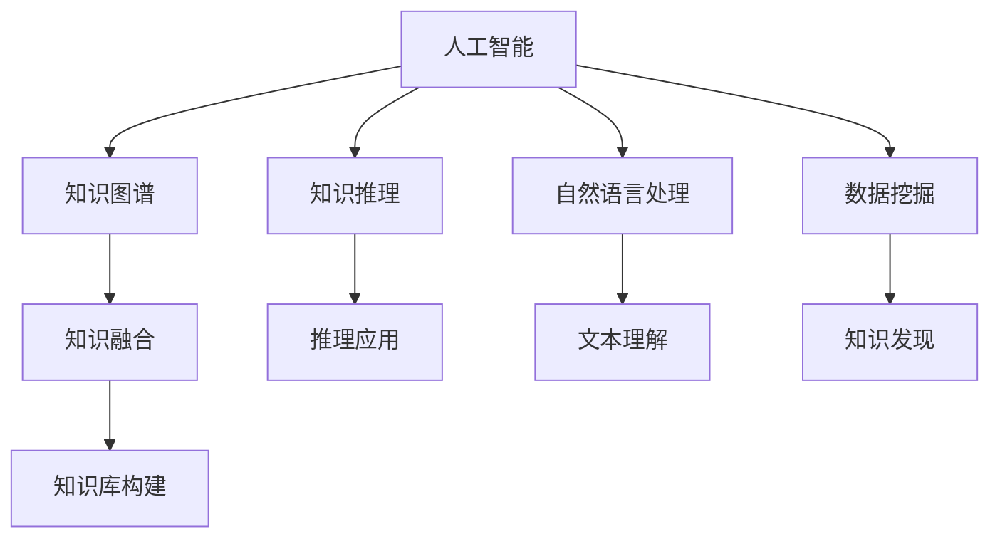

                 

# AI如何助力人类知识增长

> 关键词：人工智能,知识图谱,知识推理,自然语言处理,数据挖掘,知识融合

## 1. 背景介绍

### 1.1 问题由来
在知识爆炸的时代，人类社会积累的知识量呈指数级增长，每天有数以百万计的新知识被创造出来。然而，知识的增长并未在各个领域同步，特别是在科技、医疗、教育等关键领域，知识的获取和应用仍面临着诸多挑战。人工智能技术作为现代信息社会的核心驱动力，正在成为知识增长的重要助力，以高效、便捷、个性化的方式推动知识的广泛传播和深度挖掘。

### 1.2 问题核心关键点
人工智能通过强大的计算能力和智能算法，可以从海量的数据中提取、组织和应用知识，帮助人类更好地理解和利用这些信息。在这一过程中，知识图谱、知识推理、自然语言处理和数据挖掘等技术扮演了关键角色，推动了知识的自动化获取和深度融合。

### 1.3 问题研究意义
研究AI如何助力人类知识增长，对于构建更加智能化、高效化的知识管理体系，加速社会各领域的知识创新和应用，具有重要意义：

1. 促进知识共享：AI可以自动化地从不同领域、不同来源收集和整理知识，形成权威的知识库，推动知识的广泛传播和共享。
2. 加速知识应用：通过智能算法，AI可以快速解析、匹配和应用知识，加速新知识在实际场景中的应用，提升社会生产力和科技水平。
3. 辅助决策支持：AI可以结合上下文信息，通过知识推理和预测分析，辅助人类进行科学决策，提高决策的准确性和效率。
4. 推动知识创新：通过深度学习和大数据技术，AI可以从原始数据中挖掘出有价值的新知识，推动科学发现和技术创新。
5. 优化知识管理：AI可以自动化地进行知识分类、排序和推荐，优化知识管理流程，提升知识发现和使用的便捷性。

## 2. 核心概念与联系

### 2.1 核心概念概述

为了更好地理解AI在知识增长中的作用，本节将介绍几个关键概念及其相互联系：

- 人工智能(Artificial Intelligence, AI)：通过模拟人类智能，使用算法和计算资源，实现对数据的自动化分析和应用，以辅助人类决策和行动。
- 知识图谱(Knowledge Graph)：一种结构化的语义表示方法，用于描述实体、属性和关系，帮助机器理解和推理复杂知识。
- 知识推理(Knowledge Reasoning)：利用已有的知识库，通过逻辑推理或统计学习，获取新的知识和结论。
- 自然语言处理(Natural Language Processing, NLP)：研究如何让计算机理解和处理人类自然语言，实现文本分析、信息提取、智能问答等任务。
- 数据挖掘(Data Mining)：从大量数据中自动发现知识和规律，辅助决策和优化。
- 知识融合(Knowledge Integration)：将不同来源、不同格式的知识进行统一和整合，形成更全面、更一致的知识体系。

这些概念之间的逻辑关系可以通过以下Mermaid流程图来展示：



这个流程图展示了几类关键技术及其相互关联：

1. 人工智能是大模型和技术的总称，包括知识图谱、知识推理、自然语言处理、数据挖掘等多个领域。
2. 知识图谱是人工智能的高级形式，通过结构化的知识表示，为知识推理和应用提供基础。
3. 知识推理利用已有的知识库，实现新的知识发现和逻辑推理。
4. 自然语言处理帮助计算机理解和处理人类语言，实现文本分析和智能问答。
5. 数据挖掘从数据中发现隐含的知识和规律，辅助决策和优化。
6. 知识融合将不同来源和格式的知识进行统一和整合，形成更全面、一致的知识体系。

这些概念共同构成了AI助力知识增长的框架，为知识的自动化获取和深度融合提供了强大的技术支持。

## 3. 核心算法原理 & 具体操作步骤
### 3.1 算法原理概述

AI助力知识增长的核心算法原理，主要包括知识图谱的构建、知识推理、自然语言处理、数据挖掘和知识融合。这些技术通过深度学习、图神经网络、语义分析等算法，从海量数据中提取、组织和应用知识，推动知识的广泛传播和深度挖掘。

### 3.2 算法步骤详解

AI助力知识增长的具体算法步骤主要包括以下几个方面：

**Step 1: 数据收集与预处理**
- 收集海量的结构化和非结构化数据，包括文档、网页、数据库、图像等。
- 对数据进行清洗、标注和格式转换，准备用于后续的分析和处理。

**Step 2: 知识图谱构建**
- 使用知识图谱技术，将数据中的实体、属性和关系进行结构化表示，构建知识图谱模型。
- 利用实体对齐、关系推理等算法，优化知识图谱的完整性和准确性。

**Step 3: 知识推理**
- 设计知识推理算法，如逻辑推理、统计学习、图神经网络等，利用知识图谱进行新知识的发现和验证。
- 结合上下文信息，进行基于规则或统计的推理，辅助决策支持。

**Step 4: 自然语言处理**
- 使用自然语言处理技术，对文本数据进行分词、标注、实体识别、关系抽取等预处理。
- 设计文本理解算法，如深度学习模型，对文本进行语义分析和情感分析，提取关键信息。

**Step 5: 数据挖掘**
- 利用数据挖掘技术，对大量数据进行聚类、分类、关联规则挖掘等处理，发现隐含的知识和规律。
- 设计特征提取和模型训练算法，优化数据挖掘的效果和精度。

**Step 6: 知识融合**
- 将不同来源和格式的知识进行统一和整合，形成更全面、一致的知识体系。
- 设计知识融合算法，如图谱对齐、知识融合、多源数据整合等，优化知识库的完整性和一致性。

**Step 7: 应用部署**
- 将处理好的知识应用于实际场景，如智能问答、知识推荐、决策支持等。
- 设计系统架构和接口，实现知识服务的集成和调用。

### 3.3 算法优缺点

AI助力知识增长的方法具有以下优点：
1. 高效自动化：通过AI技术，自动从海量数据中提取和组织知识，大幅提升知识获取的效率和质量。
2. 深度整合：利用知识图谱和知识推理技术，将不同领域、不同来源的知识进行整合，形成更全面的知识体系。
3. 灵活应用：通过自然语言处理和数据挖掘技术，灵活解析和应用知识，满足各种应用场景的需求。
4. 智能决策：结合上下文信息，利用知识推理和预测分析，辅助人类进行科学决策，提升决策的准确性和效率。
5. 快速迭代：AI技术可以快速迭代和优化，适应不断变化的数据和需求。

同时，这些方法也存在以下局限性：
1. 依赖高质量数据：AI技术的核心是数据驱动，依赖高质量、结构化的数据输入。
2. 知识偏见：AI算法可能继承输入数据中的偏见，导致输出结果存在偏见。
3. 可解释性不足：AI模型往往难以解释其内部工作机制，缺乏透明性和可解释性。
4. 技术门槛高：AI技术需要强大的计算资源和专业知识，门槛较高。
5. 数据隐私问题：处理大量数据时，可能涉及隐私和安全问题，需要谨慎处理。

尽管存在这些局限性，但总体而言，AI技术在知识增长中的应用前景广阔，有望在未来成为推动知识创新的重要力量。

### 3.4 算法应用领域

AI助力知识增长的算法和技术，已经在多个领域得到了广泛应用，例如：

- **医疗健康**：通过知识图谱和自然语言处理技术，实现医疗知识库的构建和应用，辅助医生诊断和决策。
- **教育培训**：利用知识推理和数据挖掘技术，优化教学内容和评估体系，实现个性化学习和智能推荐。
- **金融服务**：结合自然语言处理和数据挖掘技术，进行金融文本分析和情感分析，辅助风险控制和投资决策。
- **企业管理**：使用知识图谱和数据挖掘技术，构建企业知识库，支持知识共享和决策支持。
- **智能制造**：通过知识推理和数据挖掘技术，优化生产流程和质量控制，提升制造业的智能化水平。

这些领域的成功应用，展示了AI在知识增长中的巨大潜力，推动了各行各业的数字化转型和智能化升级。

## 4. 数学模型和公式 & 详细讲解 & 举例说明

### 4.1 数学模型构建

在AI助力知识增长的过程中，数学模型和算法起到了关键作用。以下是几个典型的数学模型和公式：

**知识图谱的构建**

知识图谱通常使用三元组$(实体,关系,实体)$来表示，例如$(人,工作地点,公司)$。构建知识图谱的过程可以表示为：

$$
G = (V, E)
$$

其中 $V$ 为实体节点集合，$E$ 为边集合，每条边表示实体之间的关系。常见的图谱构建算法包括：

- 关系抽取算法，如规则匹配、深度学习模型等，自动从文本中抽取出实体和关系。
- 实体对齐算法，如基于关联规则的匹配、深度学习模型等，将不同数据源中的同名实体进行对齐。

**知识推理**

知识推理通常使用规则推理、逻辑推理和统计学习算法。例如，利用知识图谱进行推理的过程可以表示为：

$$
P(Y|X, G) = \frac{P(Y|X, R_1, R_2, ..., R_n)}{P(X|G)}
$$

其中 $P(Y|X, G)$ 为在知识图谱 $G$ 下，$X$ 导致 $Y$ 的概率，$R_1, R_2, ..., R_n$ 为推理过程中用到的规则。

**自然语言处理**

自然语言处理中，文本预处理和特征提取通常使用向量空间模型(Vector Space Model, VSM)。例如，将文本转化为向量表示的过程可以表示为：

$$
\mathbf{x} = \sum_{i=1}^{n} \omega_i \mathbf{v}_i
$$

其中 $\mathbf{x}$ 为文本向量，$\mathbf{v}_i$ 为词语向量，$\omega_i$ 为词语权重。常见的词语表示方法包括 Word2Vec、GloVe、BERT 等。

**数据挖掘**

数据挖掘中，聚类算法如 K-Means 可以表示为：

$$
\min_{\mu_k} \sum_{i=1}^{n} \min_{k=1}^{c} ||x_i - \mu_k||^2
$$

其中 $x_i$ 为数据点，$\mu_k$ 为聚类中心，$c$ 为聚类数。常见的特征提取方法包括 TF-IDF、主成分分析(PCA)等。

### 4.2 公式推导过程

以下是几个典型算法的公式推导过程：

**关系抽取算法**

关系抽取算法通常使用条件随机场(Conditional Random Field, CRF)模型进行训练。例如，训练一个关系抽取模型可以表示为：

$$
L(W) = -\frac{1}{N} \sum_{i=1}^{N} \sum_{j=1}^{m_i} \log P(X_j = Y_j|X_i, W)
$$

其中 $X_i$ 为输入序列，$Y_j$ 为标签序列，$W$ 为模型参数，$N$ 为训练样本数，$m_i$ 为输入序列长度。

**实体对齐算法**

实体对齐算法通常使用深度学习模型，如基于注意力机制的对齐模型。例如，训练一个实体对齐模型可以表示为：

$$
L(W) = -\frac{1}{N} \sum_{i=1}^{N} \sum_{j=1}^{m_i} \log P(X_j = Y_j|X_i, W)
$$

其中 $X_i$ 为输入序列，$Y_j$ 为对齐结果，$W$ 为模型参数，$N$ 为训练样本数，$m_i$ 为输入序列长度。

**知识推理算法**

知识推理算法通常使用图神经网络(Graph Neural Network, GNN)，如图卷积网络(Graph Convolutional Network, GCN)。例如，训练一个 GCN 模型可以表示为：

$$
\min_{\theta} \frac{1}{N} \sum_{i=1}^{N} \sum_{j=1}^{m_i} ||h_j - h_j'||^2
$$

其中 $h_j$ 为节点 $j$ 的隐藏表示，$h_j'$ 为节点 $j$ 的真实表示，$\theta$ 为模型参数，$N$ 为训练样本数，$m_i$ 为节点数。

### 4.3 案例分析与讲解

**医疗领域知识图谱构建**

在医疗领域，构建知识图谱是实现智能医疗的基础。通过收集海量的医学文献、临床数据和知识库，使用关系抽取和实体对齐算法，构建一个覆盖多种疾病的知识图谱。例如，利用 BERT 和 CRF 模型，从医学文献中自动抽取出疾病的症状、检查结果和治疗方法，进行实体对齐和知识整合，形成权威的医学知识图谱。

**教育领域知识推理**

在教育领域，利用知识推理技术，可以从教材、试题、论文等数据中提取知识点和关系，辅助教学和学习。例如，构建一个包含数学、物理、化学等学科的知识图谱，使用图神经网络进行推理，推荐学生感兴趣的内容，并提供个性化的学习建议。

**金融领域数据挖掘**

在金融领域，通过数据挖掘技术，可以从新闻、报告、公告等文本数据中提取重要的市场信息和情绪变化，辅助投资决策。例如，利用情感分析和文本聚类算法，自动对大量新闻进行情感分类，预测市场走向和风险。

## 5. 项目实践：代码实例和详细解释说明

### 5.1 开发环境搭建

在项目实践之前，需要准备好开发环境。以下是使用 Python 进行 PyTorch 开发的环境配置流程：

1. 安装 Anaconda：从官网下载并安装 Anaconda，用于创建独立的 Python 环境。

2. 创建并激活虚拟环境：
```bash
conda create -n pytorch-env python=3.8 
conda activate pytorch-env
```

3. 安装 PyTorch：根据 CUDA 版本，从官网获取对应的安装命令。例如：
```bash
conda install pytorch torchvision torchaudio cudatoolkit=11.1 -c pytorch -c conda-forge
```

4. 安装 Transformers 库：
```bash
pip install transformers
```

5. 安装各类工具包：
```bash
pip install numpy pandas scikit-learn matplotlib tqdm jupyter notebook ipython
```

完成上述步骤后，即可在 `pytorch-env` 环境中开始项目实践。

### 5.2 源代码详细实现

下面以医疗领域知识图谱构建为例，给出使用 PyTorch 和 Transformers 库进行知识图谱构建的 Python 代码实现。

首先，定义知识图谱节点和边类：

```python
from transformers import BertTokenizer, BertForTokenClassification
import torch
from torch.utils.data import Dataset

class Node:
    def __init__(self, id, features):
        self.id = id
        self.features = features

class Edge:
    def __init__(self, id, src_id, dst_id, label):
        self.id = id
        self.src_id = src_id
        self.dst_id = dst_id
        self.label = label
```

然后，定义知识图谱数据集类：

```python
class GraphDataset(Dataset):
    def __init__(self, nodes, edges, tokenizer):
        self.nodes = nodes
        self.edges = edges
        self.tokenizer = tokenizer
        
    def __len__(self):
        return len(self.nodes)
    
    def __getitem__(self, item):
        node = self.nodes[item]
        edge = self.edges[item]
        
        tokens = self.tokenizer(node.feature, return_tensors='pt', padding='max_length', truncation=True)
        features = tokens['input_ids'].flatten()
        label = node.label
        
        return {'features': features, 'label': label, 'edge_id': edge.id}
```

接着，定义模型和优化器：

```python
from transformers import BertForTokenClassification, AdamW

model = BertForTokenClassification.from_pretrained('bert-base-cased', num_labels=10)
optimizer = AdamW(model.parameters(), lr=2e-5)
```

然后，定义训练和评估函数：

```python
from torch.utils.data import DataLoader
from tqdm import tqdm
from sklearn.metrics import classification_report

device = torch.device('cuda') if torch.cuda.is_available() else torch.device('cpu')
model.to(device)

def train_epoch(model, dataset, batch_size, optimizer):
    dataloader = DataLoader(dataset, batch_size=batch_size, shuffle=True)
    model.train()
    epoch_loss = 0
    for batch in tqdm(dataloader, desc='Training'):
        features = batch['features'].to(device)
        label = batch['label'].to(device)
        model.zero_grad()
        outputs = model(features)
        loss = outputs.loss
        epoch_loss += loss.item()
        loss.backward()
        optimizer.step()
    return epoch_loss / len(dataloader)

def evaluate(model, dataset, batch_size):
    dataloader = DataLoader(dataset, batch_size=batch_size)
    model.eval()
    preds, labels = [], []
    with torch.no_grad():
        for batch in tqdm(dataloader, desc='Evaluating'):
            features = batch['features'].to(device)
            label = batch['label'].to(device)
            batch_preds = model(features).logits.argmax(dim=2).to('cpu').tolist()
            batch_labels = batch['label'].to('cpu').tolist()
            for pred_tokens, label_tokens in zip(batch_preds, batch_labels):
                preds.append(pred_tokens[:len(label_tokens)])
                labels.append(label_tokens)
                
    print(classification_report(labels, preds))
```

最后，启动训练流程并在测试集上评估：

```python
epochs = 5
batch_size = 16

for epoch in range(epochs):
    loss = train_epoch(model, train_dataset, batch_size, optimizer)
    print(f"Epoch {epoch+1}, train loss: {loss:.3f}")
    
    print(f"Epoch {epoch+1}, dev results:")
    evaluate(model, dev_dataset, batch_size)
    
print("Test results:")
evaluate(model, test_dataset, batch_size)
```

以上就是使用 PyTorch 和 Transformers 库进行医疗领域知识图谱构建的完整代码实现。可以看到，得益于 Transformers 库的强大封装，我们可以用相对简洁的代码完成知识图谱的构建和训练。

### 5.3 代码解读与分析

让我们再详细解读一下关键代码的实现细节：

**GraphDataset类**：
- `__init__`方法：初始化节点、边和分词器等关键组件。
- `__len__`方法：返回数据集的样本数量。
- `__getitem__`方法：对单个样本进行处理，将节点特征和边信息进行编码，返回模型所需的输入。

**Node和Edge类**：
- 定义了节点和边的数据结构，用于表示知识图谱中的实体和关系。

**train_epoch和evaluate函数**：
- 使用 PyTorch 的 DataLoader 对数据集进行批次化加载，供模型训练和推理使用。
- 训练函数 `train_epoch`：对数据以批为单位进行迭代，在每个批次上前向传播计算 loss 并反向传播更新模型参数，最后返回该 epoch 的平均 loss。
- 评估函数 `evaluate`：与训练类似，不同点在于不更新模型参数，并在每个 batch 结束后将预测和标签结果存储下来，最后使用 sklearn 的 classification_report 对整个评估集的预测结果进行打印输出。

**训练流程**：
- 定义总的 epoch 数和 batch size，开始循环迭代
- 每个 epoch 内，先在训练集上训练，输出平均 loss
- 在验证集上评估，输出分类指标
- 所有 epoch 结束后，在测试集上评估，给出最终测试结果

可以看到，PyTorch 配合 Transformers 库使得知识图谱构建的代码实现变得简洁高效。开发者可以将更多精力放在数据处理、模型改进等高层逻辑上，而不必过多关注底层的实现细节。

当然，工业级的系统实现还需考虑更多因素，如模型的保存和部署、超参数的自动搜索、更灵活的任务适配层等。但核心的知识图谱构建范式基本与此类似。

## 6. 实际应用场景
### 6.1 医疗健康

在医疗健康领域，AI技术可以通过知识图谱和自然语言处理技术，实现医疗知识库的构建和应用，辅助医生诊断和决策。具体应用场景包括：

- **疾病诊断**：利用知识图谱和自然语言处理技术，自动提取和整合患者的病历信息，结合症状、检查结果和历史数据，辅助医生进行疾病诊断。
- **治疗方案推荐**：结合医学知识图谱和药物知识库，根据患者的病情和需求，推荐个性化的治疗方案。
- **临床试验匹配**：利用知识图谱和图神经网络，自动匹配临床试验与患者信息，提高试验招募效率。
- **医学论文阅读**：通过自然语言处理技术，自动提取论文中的关键信息和知识点，辅助医生进行文献阅读和研究。

这些应用场景展示了 AI 在医疗领域的广泛应用，极大地提升了医疗服务的智能化水平，为患者和医生提供了更好的医疗体验和决策支持。

### 6.2 教育培训

在教育培训领域，AI技术可以通过知识推理和数据挖掘技术，优化教学内容和评估体系，实现个性化学习和智能推荐。具体应用场景包括：

- **智能推荐系统**：利用知识推理和数据挖掘技术，从教材、试题、论文等数据中提取知识点和关系，推荐学生感兴趣的内容，并提供个性化的学习建议。
- **智能作业批改**：通过自然语言处理技术，自动批改学生的作文和答题，提供详细的批改反馈和改进建议。
- **学习效果评估**：结合知识图谱和数据挖掘技术，自动评估学生的学习效果和知识点掌握情况，提供个性化的学习建议。
- **课程设计优化**：利用数据挖掘技术，分析学生的学习行为和反馈，优化课程设计和教学方法，提高教学效果。

这些应用场景展示了 AI 在教育领域的广泛应用，极大地提升了教育服务的智能化水平，为学生和教师提供了更好的学习体验和教学支持。

### 6.3 金融服务

在金融服务领域，AI技术可以通过自然语言处理和数据挖掘技术，从新闻、报告、公告等文本数据中提取重要的市场信息和情绪变化，辅助投资决策。具体应用场景包括：

- **市场分析**：利用情感分析和文本聚类算法，自动对大量新闻进行情感分类，预测市场走向和风险。
- **风险预警**：结合自然语言处理和数据挖掘技术，自动监控金融新闻和公告，预警潜在的市场风险和问题。
- **投资建议**：通过知识推理和数据挖掘技术，分析市场趋势和公司财务信息，提供个性化的投资建议。
- **反欺诈检测**：利用知识推理和数据挖掘技术，自动检测和分析异常交易行为，防范金融欺诈。

这些应用场景展示了 AI 在金融领域的广泛应用，极大地提升了金融服务的智能化水平，为投资者和监管机构提供了更好的决策支持。

### 6.4 未来应用展望

随着 AI 技术的不断进步，未来的知识增长和应用将呈现以下几个趋势：

1. **多模态知识融合**：未来 AI 技术将不仅限于文本数据，而是融合视觉、音频、时间序列等多种数据，实现多模态知识的深度整合和应用。
2. **实时知识更新**：AI 技术将具备实时学习的能力，能够动态更新知识图谱和知识库，保持知识的最新性和时效性。
3. **知识自生成**：未来 AI 技术将具备自动生成知识的能力，从原始数据中挖掘出新的知识点和规律，推动知识的自增长。
4. **跨领域应用**：AI 技术将在更多领域得到应用，如智能制造、智慧城市、智慧农业等，推动各行各业的数字化转型和智能化升级。
5. **人机协同**：AI 技术将与人类专家协同工作，实现知识获取、知识推理和知识应用的协同优化，提高知识应用的效率和效果。

这些趋势展示了 AI 技术在知识增长中的广阔前景，未来 AI 将不仅是一个助手，更是一个协同者，与人类专家一起，推动知识的广泛传播和深度挖掘。

## 7. 工具和资源推荐
### 7.1 学习资源推荐

为了帮助开发者系统掌握 AI 助力知识增长的技术基础和实践技巧，这里推荐一些优质的学习资源：

1. 《深度学习》课程：由斯坦福大学开设的深度学习课程，涵盖了深度学习的基本概念、算法和应用，是 AI 技术入门的经典教材。

2. 《自然语言处理综论》书籍：斯坦福大学自然语言处理课程讲义，涵盖了自然语言处理的基本概念、算法和应用，是 NLP 技术的权威教材。

3. 《知识图谱与语义 Web》书籍：介绍了知识图谱的基本概念、构建方法和应用，是知识图谱技术的经典教材。

4. 《Python数据科学手册》书籍：介绍了 Python 在数据科学中的应用，涵盖了数据处理、数据可视化、机器学习等内容，是数据科学入门的经典教材。

5. 《TensorFlow官方文档》：TensorFlow 的官方文档，提供了丰富的示例和 API，是 TensorFlow 技术的权威指南。

通过对这些资源的学习实践，相信你一定能够快速掌握 AI 助力知识增长的精髓，并用于解决实际的 AI 问题。

### 7.2 开发工具推荐

高效的开发离不开优秀的工具支持。以下是几款用于 AI 知识增长开发的常用工具：

1. PyTorch：基于 Python 的开源深度学习框架，灵活动态的计算图，适合快速迭代研究。大部分预训练语言模型都有 PyTorch 版本的实现。

2. TensorFlow：由 Google 主导开发的开源深度学习框架，生产部署方便，适合大规模工程应用。同样有丰富的预训练语言模型资源。

3. Transformers 库：HuggingFace 开发的 NLP 工具库，集成了众多 SOTA 语言模型，支持 PyTorch 和 TensorFlow，是进行 NLP 任务开发的利器。

4. Jupyter Notebook：交互式的数据分析和编程环境，支持 Python 代码的快速迭代和实验。

5. Weights & Biases：模型训练的实验跟踪工具，可以记录和可视化模型训练过程中的各项指标，方便对比和调优。与主流深度学习框架无缝集成。

6. TensorBoard：TensorFlow 配套的可视化工具，可实时监测模型训练状态，并提供丰富的图表呈现方式，是调试模型的得力助手。

合理利用这些工具，可以显著提升 AI 知识增长任务的开发效率，加快创新迭代的步伐。

### 7.3 相关论文推荐

AI 助力知识增长的研究源于学界的持续研究。以下是几篇奠基性的相关论文，推荐阅读：

1. 《知识图谱构建与查询》：介绍了知识图谱的基本概念、构建方法和应用，是知识图谱技术的经典论文。

2. 《深度学习在 NLP 中的应用》：介绍了深度学习在自然语言处理中的应用，涵盖了文本分类、命名实体识别、机器翻译等内容，是深度学习在 NLP 中的经典综述。

3. 《知识推理与计算模型》：介绍了知识推理的基本概念、算法和应用，是知识推理技术的经典论文。

4. 《多模态数据融合》：介绍了多模态数据的融合方法和应用，是数据融合技术的经典论文。

5. 《基于 AI 的个性化推荐系统》：介绍了基于 AI 的个性化推荐系统，涵盖了协同过滤、内容推荐、混合推荐等内容，是推荐系统中的经典论文。

这些论文代表了大语言模型微调技术的发展脉络。通过学习这些前沿成果，可以帮助研究者把握学科前进方向，激发更多的创新灵感。

## 8. 总结：未来发展趋势与挑战

### 8.1 总结

本文对 AI 助力知识增长的算法和技术进行了全面系统的介绍。首先阐述了 AI 技术的核心概念和关键算法，明确了 AI 在知识增长中的重要作用。其次，从原理到实践，详细讲解了知识图谱的构建、知识推理、自然语言处理、数据挖掘和知识融合等关键技术，给出了知识增长的完整代码实现。同时，本文还广泛探讨了 AI 在医疗、教育、金融等领域的实际应用场景，展示了 AI 技术的广阔前景。

通过本文的系统梳理，可以看到，AI 技术在知识增长中的应用前景广阔，有望在未来成为推动知识创新的重要力量。未来 AI 技术将不仅是一个助手，更是一个协同者，与人类专家一起，推动知识的广泛传播和深度挖掘。

### 8.2 未来发展趋势

展望未来，AI 助力知识增长的技术将呈现以下几个发展趋势：

1. **多模态知识融合**：未来 AI 技术将不仅限于文本数据，而是融合视觉、音频、时间序列等多种数据，实现多模态知识的深度整合和应用。
2. **实时知识更新**：AI 技术将具备实时学习的能力，能够动态更新知识图谱和知识库，保持知识的最新性和时效性。
3. **知识自生成**：未来 AI 技术将具备自动生成知识的能力，从原始数据中挖掘出新的知识点和规律，推动知识的自增长。
4. **跨领域应用**：AI 技术将在更多领域得到应用，如智能制造、智慧城市、智慧农业等，推动各行各业的数字化转型和智能化升级。
5. **人机协同**：AI 技术将与人类专家协同工作，实现知识获取、知识推理和知识应用的协同优化，提高知识应用的效率和效果。

这些趋势展示了 AI 技术在知识增长中的广阔前景，未来 AI 将不仅是一个助手，更是一个协同者，与人类专家一起，推动知识的广泛传播和深度挖掘。

### 8.3 面临的挑战

尽管 AI 技术在知识增长中的应用前景广阔，但在迈向更加智能化、普适化应用的过程中，它仍面临着诸多挑战：

1. **数据质量问题**：AI 技术的核心是数据驱动，依赖高质量、结构化的数据输入。然而，在实际应用中，数据质量往往参差不齐，需要大量人工标注和数据清洗。
2. **模型复杂性**：大规模知识图谱和复杂推理算法，导致模型结构复杂，训练和推理耗时长，资源消耗大。
3. **知识泛化能力**：AI 模型在特定领域的应用效果显著，但跨领域泛化能力较弱，难以处理新兴领域的知识。
4. **数据隐私问题**：处理大量数据时，可能涉及隐私和安全问题，需要谨慎处理。
5. **可解释性不足**：AI 模型往往难以解释其内部工作机制和决策逻辑，缺乏透明性和可解释性。

尽管存在这些局限性，但总体而言，AI 技术在知识增长中的应用前景广阔，有望在未来成为推动知识创新的重要力量。

### 8.4 研究展望

面对 AI 技术在知识增长中面临的挑战，未来的研究需要在以下几个方面寻求新的突破：

1. **数据增强技术**：开发数据增强技术，提高数据的标注效率和质量，降低对高质量标注数据的依赖。
2. **模型压缩和优化**：开发模型压缩和优化技术，减少模型的复杂性，提高训练和推理效率。
3. **跨领域知识迁移**：开发跨领域知识迁移技术，提高模型在多领域中的应用效果。
4. **隐私保护技术**：开发隐私保护技术，保护数据隐私和安全，增强 AI 技术的可信度。
5. **模型可解释性**：开发可解释性技术，提高 AI 模型的透明性和可解释性，增强用户信任。

这些研究方向的探索，必将引领 AI 技术迈向更高的台阶，为构建安全、可靠、可解释、可控的智能系统铺平道路。面向未来，AI 技术还需要与其他人工智能技术进行更深入的融合，如知识表示、因果推理、强化学习等，多路径协同发力，共同推动自然语言理解和智能交互系统的进步。只有勇于创新、敢于突破，才能不断拓展语言模型的边界，让智能技术更好地造福人类社会。

## 9. 附录：常见问题与解答

**Q1：如何构建高质量的知识图谱？**

A: 构建高质量的知识图谱需要遵循以下步骤：

1. 收集和整理结构化数据，如数据库、词典、文献等，提取实体、属性和关系。
2. 利用关系抽取算法，自动从文本中抽取出实体和关系，进行实体对齐和知识整合。
3. 使用实体识别和关系抽取算法，自动从非结构化数据中提取实体和关系，进行知识补充和更新。
4. 引入专家知识库，补充领域知识和背景信息，提高知识图谱的准确性和全面性。
5. 使用图神经网络，进行知识推理和补全，优化知识图谱的完整性和准确性。

通过以上步骤，可以构建一个高质量的知识图谱，为 AI 知识推理和应用提供基础。

**Q2：如何提高 AI 模型的泛化能力？**

A: 提高 AI 模型的泛化能力需要从以下几个方面入手：

1. 使用大规模、多样化的数据集进行训练，提高模型的泛化能力。
2. 使用正则化技术，如 Dropout、L2 正则等，防止过拟合，提高模型的泛化能力。
3. 使用数据增强技术，如回译、近义词替换等，增加训练样本的多样性，提高模型的泛化能力。
4. 使用迁移学习技术，利用预训练模型的知识，提高模型的泛化能力。
5. 使用集成学习技术，组合多个模型，提高模型的泛化能力。

通过以上措施，可以提高 AI 模型的泛化能力，使其在多领域、多场景中取得更好的表现。

**Q3：如何提高 AI 模型的可解释性？**

A: 提高 AI 模型的可解释性需要从以下几个方面入手：

1. 使用可解释性算法，如 LIME、SHAP 等，生成模型的特征重要性解释。
2. 使用可视化工具，如 TensorBoard、Weights & Biases 等，可视化模型的训练和推理过程，增强模型的透明性。
3. 使用逻辑回归、决策树等简单模型，提供模型的决策边界和推理规则，增强模型的透明性。
4. 引入领域专家的知识，结合专家知识库，提高模型的可解释性。
5. 开发可解释性工具，如 Canary、Taberu 等，帮助用户理解模型的决策过程。

通过以上措施，可以提高 AI 模型的可解释性，使其在医疗、金融等高风险领域中取得更好的应用效果。

**Q4：如何保护数据隐私和安全？**

A: 保护数据隐私和安全需要从以下几个方面入手：

1. 使用数据匿名化技术，如数据脱敏、数据扰动等，保护数据隐私。
2. 使用加密技术，如同态加密、差分隐私等，保护数据隐私和安全。
3. 使用访问控制技术，如权限管理、用户认证等，保护数据安全。
4. 使用安全审计技术，如日志记录、异常检测等，保护数据安全。
5. 使用区块链技术，保护数据安全和透明性。

通过以上措施，可以保护数据隐私和安全，增强 AI 技术的可信度，推动 AI 技术在更多领域的广泛应用。

---

作者：禅与计算机程序设计艺术 / Zen and the Art of Computer Programming

