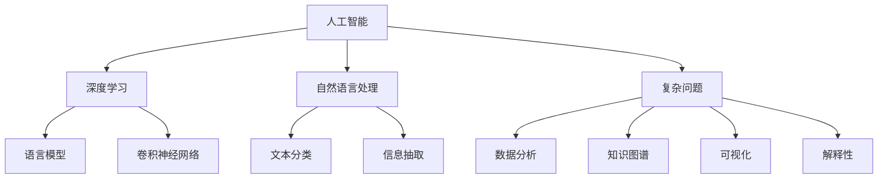

                 

# AI如何帮助人类更好地理解复杂问题

> 关键词：人工智能,深度学习,自然语言处理,NLP,复杂问题,数据分析,知识图谱,可视化,解释性

## 1. 背景介绍

在现代社会中，人类面对的复杂问题越来越多。这些问题不仅规模庞大、涉及面广，而且往往具有高度的非线性、不确定性等特点，很难通过传统的方法进行分析和解决。而人工智能，特别是深度学习和自然语言处理（NLP）技术，为应对这些复杂问题提供了全新的工具和视角。本文将探讨AI如何在多个领域帮助人类更好地理解复杂问题，并分析未来发展的趋势和挑战。

## 2. 核心概念与联系

### 2.1 核心概念概述

为更好地理解AI在解决复杂问题中的应用，本节将介绍几个密切相关的核心概念：

- 人工智能(AI)：利用计算机模拟人类智能行为的技术，涵盖机器学习、深度学习、自然语言处理等领域。
- 深度学习(Deep Learning)：一种基于神经网络的机器学习范式，通过多层次的非线性映射实现特征提取和模型训练。
- 自然语言处理(NLP)：使用计算机处理、理解、生成人类自然语言的技术，包括文本分类、信息抽取、语言模型等。
- 复杂问题(Complex Problem)：指需要跨学科、跨领域知识解决，且具有高度不确定性、非线性的问题。
- 数据分析(Analytic Data)：对大规模数据进行收集、处理和分析的过程，揭示数据背后的规律和模式。
- 知识图谱(Knowledge Graph)：使用图结构表示实体及其关系的知识库，支持更高效的推理和查询。
- 可视化(Visualization)：将数据和信息通过图表、图像等方式直观呈现，辅助人类理解和决策。
- 解释性(Explainability)：AI模型的输出结果能够被解释和理解，增强人类对系统的信任和接受度。

这些核心概念之间的逻辑关系可以通过以下Mermaid流程图来展示：



这个流程图展示了大语言模型与AI核心概念之间的关系：

1. 人工智能是整个AI领域的统称，深度学习和自然语言处理是其核心技术。
2. 深度学习通过多层神经网络实现特征提取和模式识别。
3. 自然语言处理专注于处理和理解人类语言，涉及文本分类、信息抽取等任务。
4. 复杂问题需要跨领域知识进行解决，数据分析和知识图谱是其中的关键技术。
5. 可视化提供直观的数据展示，辅助人类理解复杂问题。
6. 解释性增强了AI模型的可解释性，提高用户信任度。

这些概念共同构成了AI在复杂问题解决中的应用框架，帮助人类在多个领域中更有效地理解和处理复杂问题。

## 3. 核心算法原理 & 具体操作步骤

### 3.1 算法原理概述

人工智能在解决复杂问题时，通常会采用以下算法原理：

- **深度学习算法**：通过多层神经网络学习数据中的复杂非线性关系，提取高层次的抽象特征。
- **自然语言处理算法**：利用语言模型、文本分类、信息抽取等技术，处理和理解人类语言。
- **数据分析算法**：通过统计、聚类、降维等方法，对大规模数据进行分析和建模。
- **知识图谱算法**：使用图结构表示实体及其关系，提供高效的推理和查询服务。
- **可视化算法**：将数据和信息通过图表、图像等形式展示，便于理解和决策。
- **解释性算法**：开发可解释的AI模型，增强模型的透明度和可信度。

这些算法技术共同构成了AI解决复杂问题的核心方法，能够处理和理解多种形式的数据，辅助人类更好地理解和解决复杂问题。

### 3.2 算法步骤详解

以下将详细介绍AI在解决复杂问题时的一般步骤：

**Step 1: 问题定义和数据收集**

- 明确问题的本质和目标，确定需要解决的具体问题。
- 收集相关的数据，包括文本、图像、音频等，数据量越大，模型的效果越好。

**Step 2: 数据预处理**

- 清洗和处理数据，去除噪声、冗余和异常值。
- 将数据进行标准化和归一化，确保数据的一致性和可比性。

**Step 3: 特征提取和模型训练**

- 使用深度学习、自然语言处理等技术，从数据中提取高层次的特征。
- 选择合适的模型和算法，使用训练数据对模型进行训练，优化模型的参数和结构。

**Step 4: 模型评估和优化**

- 在测试数据上评估模型的性能，使用准确率、召回率、F1分数等指标衡量模型效果。
- 根据评估结果，调整模型的参数和结构，优化模型性能。

**Step 5: 结果解释和应用**

- 解释模型的输出结果，提供直观的数据展示和解释。
- 将模型应用于实际问题，辅助人类决策和处理复杂问题。

### 3.3 算法优缺点

AI在解决复杂问题时具有以下优点：

- **高效处理大规模数据**：AI模型能够快速处理和分析海量数据，揭示数据中的模式和规律。
- **多领域知识的整合**：通过深度学习、自然语言处理等技术，AI能够整合多领域知识，提供全面的解决方案。
- **自动化和可扩展性**：AI模型可以自动化地处理复杂问题，并通过微调和改进，不断提升性能。
- **可解释性和透明性**：随着AI技术的发展，越来越多的模型能够提供可解释的输出，增强用户的信任和接受度。

然而，AI在解决复杂问题时也存在一些缺点：

- **数据依赖**：AI模型需要大量高质量的数据进行训练，数据获取和标注的成本较高。
- **模型复杂性**：深度学习等AI模型结构复杂，难以解释其内部工作机制。
- **鲁棒性不足**：AI模型对数据分布的变化敏感，容易发生过拟合或欠拟合。
- **可解释性不足**：部分AI模型的输出结果难以解释，缺乏透明度和可信度。

### 3.4 算法应用领域

AI在多个领域中已展现出强大的应用潜力，以下是几个典型应用：

- **医疗领域**：使用AI进行疾病诊断、治疗方案推荐、药物研发等，提高了医疗服务的质量和效率。
- **金融领域**：利用AI进行信用评估、风险控制、投资策略制定等，降低了金融风险，提升了投资收益。
- **能源领域**：通过AI进行能源消耗预测、智能电网优化、新能源发展等，提高了能源利用效率，降低了环境污染。
- **交通领域**：使用AI进行交通流量预测、自动驾驶、智能交通管理等，提高了交通系统的安全性和效率。
- **制造业**：利用AI进行生产计划优化、质量控制、供应链管理等，提高了生产效率和产品质量。

除了上述领域，AI还在教育、娱乐、物流、城市治理等多个领域中得到了广泛应用，推动了社会各行业的数字化转型。未来，AI将在更多领域中发挥其独特的优势，为人类社会带来深远的影响。

## 4. 数学模型和公式 & 详细讲解 & 举例说明

### 4.1 数学模型构建

以下是AI在解决复杂问题时常用的数学模型构建方法：

- **深度神经网络**：使用多层神经网络进行特征提取和分类，常用的模型包括卷积神经网络(CNN)、循环神经网络(RNN)、变压器(Transformer)等。
- **自然语言处理模型**：使用语言模型、文本分类、信息抽取等技术，常用的模型包括BERT、GPT、XLNet等。
- **数据分析模型**：使用统计、聚类、降维等方法，常用的模型包括K-means、PCA、SVM等。
- **知识图谱模型**：使用图结构表示实体及其关系，常用的模型包括TransE、GNN等。

### 4.2 公式推导过程

以下以深度神经网络为例，介绍其基本公式和推导过程：

- **前向传播**：输入数据 $x$ 经过多层神经网络的处理，得到输出 $y$。公式如下：

$$
y = \sigma(W_l\sigma(W_{l-1}\sigma(...\sigma(W_1x)...))
$$

其中 $W_i$ 为权重矩阵，$\sigma$ 为激活函数。

- **反向传播**：计算损失函数 $L$ 对各层权重的梯度，使用梯度下降等优化算法更新权重。公式如下：

$$
\frac{\partial L}{\partial W_i} = \frac{\partial L}{\partial y} \frac{\partial y}{\partial W_i}
$$

其中 $\frac{\partial L}{\partial y}$ 为损失函数对输出 $y$ 的梯度，$\frac{\partial y}{\partial W_i}$ 为输出 $y$ 对权重 $W_i$ 的梯度。

### 4.3 案例分析与讲解

以医疗领域的疾病诊断为例，分析AI模型在解决复杂问题中的应用。

- **问题定义**：将患者的症状描述和历史病历数据输入AI模型，自动判断患者可能患有的疾病类型。
- **数据收集**：收集大量标注数据，包括患者的症状、检查结果、诊断结果等。
- **数据预处理**：清洗和处理数据，去除噪声和冗余，对数据进行标准化和归一化。
- **特征提取**：使用深度学习技术从数据中提取高层次的特征，如文本特征、图像特征等。
- **模型训练**：使用标注数据对深度学习模型进行训练，优化模型参数和结构。
- **模型评估**：在测试数据上评估模型的性能，使用准确率、召回率等指标衡量模型效果。
- **结果解释**：解释模型的输出结果，提供直观的诊断结果和解释，辅助医生进行诊断决策。

## 5. 项目实践：代码实例和详细解释说明

### 5.1 开发环境搭建

在进行AI项目实践前，我们需要准备好开发环境。以下是使用Python进行TensorFlow开发的环境配置流程：

1. 安装Anaconda：从官网下载并安装Anaconda，用于创建独立的Python环境。

2. 创建并激活虚拟环境：
```bash
conda create -n ai-env python=3.8 
conda activate ai-env
```

3. 安装TensorFlow：根据CUDA版本，从官网获取对应的安装命令。例如：
```bash
conda install tensorflow-gpu -c conda-forge -c pytorch -c pypi
```

4. 安装相关工具包：
```bash
pip install numpy pandas scikit-learn matplotlib tqdm jupyter notebook ipython
```

完成上述步骤后，即可在`ai-env`环境中开始AI项目实践。

### 5.2 源代码详细实现

这里我们以医疗领域的疾病诊断为例，给出使用TensorFlow进行模型训练的代码实现。

```python
import tensorflow as tf
from tensorflow.keras import layers, models

# 加载数据
train_data = load_train_data()
test_data = load_test_data()

# 定义模型
model = models.Sequential()
model.add(layers.Embedding(input_dim=vocab_size, output_dim=embedding_dim))
model.add(layers.Bidirectional(layers.LSTM(units=64)))
model.add(layers.Dense(units=num_classes, activation='softmax'))

# 编译模型
model.compile(optimizer=tf.keras.optimizers.Adam(learning_rate=0.001),
              loss='categorical_crossentropy',
              metrics=['accuracy'])

# 训练模型
model.fit(train_data, epochs=10, validation_data=test_data)

# 评估模型
model.evaluate(test_data)

# 结果解释
y_pred = model.predict(test_data)
y_pred = np.argmax(y_pred, axis=1)
y_true = test_data['labels']
print(classification_report(y_true, y_pred))
```

### 5.3 代码解读与分析

让我们再详细解读一下关键代码的实现细节：

**模型定义**：
- 使用Keras API定义深度神经网络，包括嵌入层、双向LSTM层和全连接层。
- 嵌入层将输入文本转换为稠密向量表示。
- 双向LSTM层捕捉文本的上下文信息，提取高层次的特征。
- 全连接层将LSTM层的输出映射到分类结果。

**模型编译**：
- 使用Adam优化器进行模型优化，设置学习率为0.001。
- 设置交叉熵损失函数和准确率指标。

**模型训练**：
- 使用训练数据对模型进行训练，设置迭代轮数为10。
- 在验证集上评估模型性能，防止过拟合。

**模型评估**：
- 使用测试数据评估模型性能，输出准确率和损失值。
- 通过混淆矩阵和分类报告，可视化模型输出结果。

### 5.4 运行结果展示

在训练完成后，可以通过以下代码展示模型在测试集上的性能：

```python
y_pred = model.predict(test_data)
y_pred = np.argmax(y_pred, axis=1)
y_true = test_data['labels']
print(classification_report(y_true, y_pred))
```

通过运行以上代码，可以输出模型在测试集上的精度、召回率和F1分数等指标，评估模型的性能。同时，可以通过混淆矩阵可视化模型的输出结果，帮助医生理解模型的诊断结果。

## 6. 实际应用场景

### 6.1 医疗诊断

AI在医疗领域的应用广泛，从疾病诊断到治疗方案推荐，AI技术能够大幅提升医疗服务的质量和效率。通过深度学习模型，AI能够自动分析患者的历史病历、症状描述、检查结果等数据，快速判断可能的疾病类型，并推荐相应的治疗方案。例如，IBM的Watson Health使用深度学习技术，帮助医生诊断癌症、心脏病等疾病，并推荐个性化治疗方案，显著提高了诊断准确率和治疗效果。

### 6.2 金融风险控制

金融领域中，AI技术广泛应用于信用评估、风险控制、投资策略制定等方面。通过分析大量的金融数据，AI模型能够预测客户的信用风险、识别潜在的欺诈行为，并提出相应的风险控制措施。例如，JPMorgan Chase使用AI模型预测信用卡欺诈行为，显著降低了金融机构的损失。

### 6.3 智能交通

智能交通系统利用AI技术进行交通流量预测、自动驾驶、智能交通管理等。通过数据分析和深度学习模型，AI能够优化交通信号灯控制，减少交通拥堵，提高交通系统的效率。例如，Tesla的Autopilot系统使用深度学习技术进行自动驾驶，提高了行驶安全和效率。

### 6.4 未来应用展望

随着AI技术的发展，未来将在更多领域中发挥其独特优势，推动社会各行业的数字化转型。例如，在能源领域，AI能够优化能源消耗、预测能源价格、推动可再生能源的发展。在教育领域，AI能够个性化推荐学习内容、辅助教师教学、提高教育质量。在娱乐领域，AI能够智能推荐电影、音乐、游戏等，提升用户体验。在城市治理中，AI能够优化城市规划、提升公共服务、提高城市管理效率。

## 7. 工具和资源推荐

### 7.1 学习资源推荐

为了帮助开发者系统掌握AI技术，以下是几份推荐的学习资源：

1. 《深度学习》（Ian Goodfellow, Yoshua Bengio, Aaron Courville著）：深度学习领域的经典教材，涵盖深度学习的基本原理和算法。
2. 《TensorFlow实战》（Shaun H. Nealy著）：TensorFlow官方文档，详细介绍了TensorFlow的API和使用方法。
3. 《自然语言处理综论》（Daniel Jurafsky, James H. Martin著）：自然语言处理领域的经典教材，涵盖文本分类、信息抽取、语言模型等任务。
4. Coursera和edX的机器学习课程：由斯坦福大学、MIT等名校开设的在线课程，提供了系统化的学习资源和实践机会。
5. Kaggle竞赛平台：数据科学竞赛平台，提供了大量的数据集和竞赛项目，可以锻炼实践能力。

通过对这些资源的学习实践，相信你一定能够快速掌握AI技术，并用于解决实际的复杂问题。

### 7.2 开发工具推荐

高效的开发离不开优秀的工具支持。以下是几款用于AI项目开发的常用工具：

1. TensorFlow：由Google主导开发的深度学习框架，支持分布式计算、动态图、静态图等特性，适合大规模工程应用。
2. PyTorch：由Facebook主导开发的深度学习框架，灵活高效，适合快速迭代研究。
3. Keras：基于TensorFlow和Theano的高级神经网络API，提供了简单易用的接口，方便开发者进行快速开发。
4. Jupyter Notebook：交互式的代码编辑器，支持Python、R等多种语言，方便数据探索和模型调试。
5. Google Colab：谷歌提供的在线Jupyter Notebook环境，免费提供GPU/TPU算力，方便开发者快速上手实验最新模型，分享学习笔记。

合理利用这些工具，可以显著提升AI项目开发的效率，加快创新迭代的步伐。

### 7.3 相关论文推荐

AI在解决复杂问题方面已经取得了许多重要的研究成果，以下是几篇经典论文，推荐阅读：

1. Deep Residual Learning for Image Recognition（ResNet论文）：提出了残差网络，大幅提高了深度神经网络的训练效率和模型性能。
2. Attention is All You Need（Transformer论文）：提出了Transformer结构，通过自注意力机制实现了高效的特征提取和建模。
3. ImageNet Classification with Deep Convolutional Neural Networks（AlexNet论文）：提出了卷积神经网络，实现了图像分类任务的突破。
4. Generating Sequences with Recurrent Neural Networks（LSTM论文）：提出了长短期记忆网络，用于解决序列建模问题。
5. Representation Learning with Keyword Predictions（BERT论文）：提出了BERT模型，利用语言模型预训练，显著提升了自然语言处理的性能。

这些论文代表了大语言模型在解决复杂问题方面的重要进展，通过学习这些前沿成果，可以帮助研究者把握学科前进方向，激发更多的创新灵感。

## 8. 总结：未来发展趋势与挑战

### 8.1 总结

本文对AI在解决复杂问题中的应用进行了全面系统的介绍。首先阐述了AI在深度学习、自然语言处理等技术上的进展，明确了其在解决复杂问题中的独特价值。其次，从原理到实践，详细讲解了AI在医疗、金融、智能交通等领域的实际应用，分析了未来发展的趋势和挑战。

通过本文的系统梳理，可以看到，AI技术在多个领域中展现出了强大的应用潜力，能够帮助人类更高效地理解复杂问题，提供更精准的解决方案。未来，随着AI技术的不断演进，其在更多领域中还将发挥更重要的作用，推动社会各行业的数字化转型。

### 8.2 未来发展趋势

展望未来，AI在解决复杂问题时将呈现以下几个发展趋势：

1. **多模态融合**：将视觉、语音、文本等多模态数据进行融合，提高AI系统对复杂问题的理解和建模能力。
2. **因果推理**：引入因果推理思想，增强AI模型的逻辑性和可解释性，提升模型的鲁棒性和泛化能力。
3. **可解释性**：开发更加可解释的AI模型，增强模型的透明度和可信度，增强用户的信任和接受度。
4. **智能自动化**：实现AI系统的自动化和智能化，提供更高效、更智能的解决方案，降低人工成本和误差。
5. **跨领域应用**：将AI技术应用于更多领域，推动各行业的数字化转型和智能化升级。

以上趋势凸显了AI在解决复杂问题方面的广阔前景，未来的研究将不断探索新的方法和技术，推动AI技术在更多领域的落地应用。

### 8.3 面临的挑战

尽管AI技术在解决复杂问题上取得了许多进展，但仍面临诸多挑战：

1. **数据依赖**：AI模型需要大量高质量的数据进行训练，数据获取和标注的成本较高，限制了AI技术的应用。
2. **模型复杂性**：深度学习等AI模型结构复杂，难以解释其内部工作机制，缺乏透明性和可解释性。
3. **鲁棒性不足**：AI模型对数据分布的变化敏感，容易发生过拟合或欠拟合，泛化能力不足。
4. **计算资源限制**：大规模AI模型需要大量的计算资源，硬件成本和算力需求较高，限制了AI技术的推广和应用。
5. **安全性问题**：AI模型可能会产生有害的输出结果，造成误导性、歧视性等问题，需要加强安全和伦理监管。

这些挑战需要技术界和产业界共同努力，积极探索新的解决方案，推动AI技术的进一步发展和应用。

### 8.4 研究展望

未来的研究需要在以下几个方向进行探索：

1. **无监督和半监督学习**：探索无监督和半监督学习方法，减少对标注数据的需求，提高AI系统的鲁棒性和泛化能力。
2. **小样本学习**：研究小样本学习方法，使AI模型在数据量较少的情况下仍能取得良好的性能。
3. **多任务学习**：研究多任务学习方法，通过联合训练多个任务，提高AI模型的泛化能力和效率。
4. **跨领域知识融合**：将符号化的先验知识与神经网络模型进行融合，增强AI模型的解释性和可解释性。
5. **模型压缩和加速**：开发更高效的模型压缩和加速技术，降低AI模型的计算资源需求，提高模型的实时性和可扩展性。
6. **安全和伦理**：加强AI系统的安全性和伦理监管，确保AI技术的健康发展和应用。

这些研究方向将推动AI技术在更多领域中发挥更大的作用，推动AI技术向更加智能化、普适化和可解释化的方向发展。

## 9. 附录：常见问题与解答

**Q1：AI技术在解决复杂问题时有哪些优势？**

A: AI技术在解决复杂问题时具有以下优势：

1. **高效处理大规模数据**：AI模型能够快速处理和分析海量数据，揭示数据中的模式和规律。
2. **多领域知识的整合**：通过深度学习、自然语言处理等技术，AI能够整合多领域知识，提供全面的解决方案。
3. **自动化和可扩展性**：AI模型可以自动化地处理复杂问题，并通过微调和改进，不断提升性能。
4. **可解释性和透明性**：随着AI技术的发展，越来越多的模型能够提供可解释的输出，增强用户的信任和接受度。

**Q2：AI技术在解决复杂问题时有哪些局限性？**

A: AI技术在解决复杂问题时也存在一些局限性：

1. **数据依赖**：AI模型需要大量高质量的数据进行训练，数据获取和标注的成本较高。
2. **模型复杂性**：深度学习等AI模型结构复杂，难以解释其内部工作机制。
3. **鲁棒性不足**：AI模型对数据分布的变化敏感，容易发生过拟合或欠拟合。
4. **计算资源限制**：大规模AI模型需要大量的计算资源，硬件成本和算力需求较高，限制了AI技术的推广和应用。
5. **安全性问题**：AI模型可能会产生有害的输出结果，造成误导性、歧视性等问题，需要加强安全和伦理监管。

**Q3：AI技术在解决复杂问题时如何提高模型的可解释性？**

A: 提高AI模型的可解释性是当前AI研究的重要方向，以下是几种常见的方法：

1. **可视化技术**：通过可视化技术，展示模型的内部工作机制和决策路径，帮助用户理解模型的输出结果。
2. **可解释性模型**：开发可解释的AI模型，如LIME、SHAP等，通过局部可解释性方法，提供模型输出的详细解释。
3. **知识图谱**：将AI模型与知识图谱进行结合，通过知识图谱的推理功能，增强模型的可解释性和透明度。
4. **模型解释器**：开发模型解释器，对AI模型的输出进行详细解释，帮助用户理解模型的决策过程。

通过这些方法，可以增强AI模型的可解释性，提高用户对模型的信任和接受度。

**Q4：AI技术在解决复杂问题时如何应对数据不足的问题？**

A: 数据不足是AI模型训练时面临的一个主要挑战，以下是几种应对数据不足的方法：

1. **数据增强**：通过数据增强技术，生成更多的训练样本，提高模型的泛化能力。
2. **迁移学习**：利用预训练模型进行迁移学习，在有限的标注数据上仍能取得良好的性能。
3. **小样本学习**：研究小样本学习方法，通过少量标注数据也能取得良好的性能。
4. **半监督学习**：利用未标注数据进行半监督学习，提高模型的泛化能力。
5. **主动学习**：通过主动学习技术，优先选择最有用的数据进行标注，提高训练效率。

这些方法可以在数据不足的情况下，帮助AI模型更好地处理复杂问题，提升模型性能。

**Q5：AI技术在解决复杂问题时如何提高模型的鲁棒性？**

A: 提高AI模型的鲁棒性是当前AI研究的重要方向，以下是几种常见的方法：

1. **数据多样性**：使用多样化的数据进行训练，提高模型对数据分布的鲁棒性。
2. **对抗训练**：引入对抗样本进行训练，提高模型的鲁棒性和泛化能力。
3. **正则化技术**：使用L2正则、Dropout等正则化技术，避免模型过拟合。
4. **模型集成**：通过模型集成技术，提高模型的鲁棒性和泛化能力。
5. **因果推理**：引入因果推理思想，增强模型的逻辑性和可解释性，提升模型的鲁棒性和泛化能力。

这些方法可以在数据不足的情况下，帮助AI模型更好地处理复杂问题，提升模型性能。

---

作者：禅与计算机程序设计艺术 / Zen and the Art of Computer Programming

