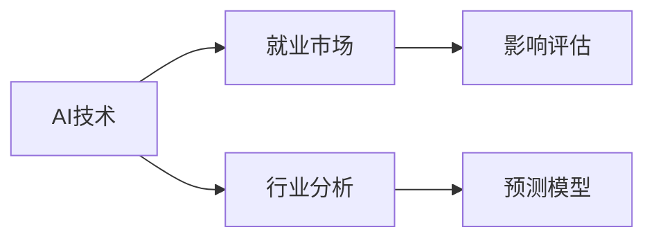
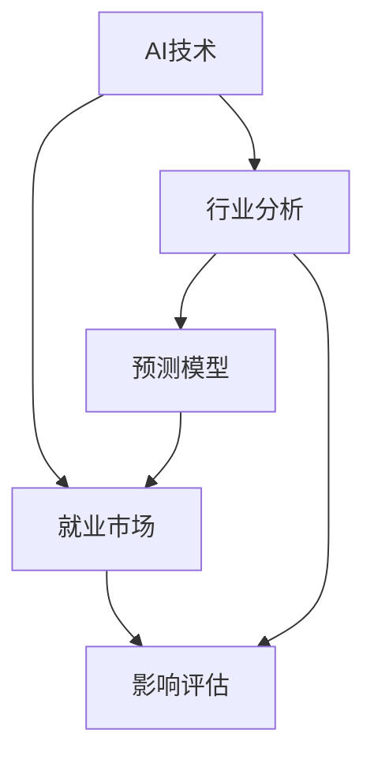

                 

# AI技术的就业影响评估:行业分析和预测模型

> 关键词：AI技术,就业影响,行业分析,预测模型

## 1. 背景介绍

随着人工智能(AI)技术的迅猛发展，其在各行各业的广泛应用已经深刻地改变了人们的工作方式和生活方式。从自动化生产线到智能客服，从医疗影像诊断到金融风控，AI技术的应用已经渗透到社会的方方面面。然而，AI技术的迅猛发展也引发了社会对就业市场的广泛关注，特别是AI对传统行业就业的影响成为了一个热点问题。本文将从背景介绍开始，全面分析AI技术对就业市场的潜在影响，并构建一个简化的行业分析模型，帮助决策者理解和预测AI技术带来的就业变化。

## 2. 核心概念与联系

### 2.1 核心概念概述

AI技术作为当前和未来产业发展的重要驱动力，其对就业市场的影响是多方面的。理解这一影响，需要首先明确以下核心概念：

- **AI技术**：包括机器学习、深度学习、自然语言处理等在内的各种智能技术，是当前驱动行业发展的关键力量。

- **就业市场**：指劳动力市场，包括劳动力的供给和需求，是AI技术影响的主要场景。

- **行业分析**：指对特定行业在AI技术影响下的就业变化进行评估和预测，涉及对行业生产、消费、投资等多个维度的分析。

- **预测模型**：基于历史数据和专家知识，使用数学模型或机器学习算法，对AI技术未来对就业市场的影响进行预测。

这些概念相互联系，共同构成了AI技术对就业影响分析的框架。以下Mermaid流程图展示了这些概念之间的联系：



### 2.2 核心概念原理和架构的 Mermaid 流程图



## 3. 核心算法原理 & 具体操作步骤

### 3.1 算法原理概述

基于AI技术的就业影响评估，主要是通过构建预测模型来分析特定行业在AI技术应用下的就业变化。预测模型的构建一般包括以下几个关键步骤：

- 数据收集：收集历史数据，包括AI技术在各行业的采用情况、就业市场的数据、行业发展数据等。
- 特征提取：从历史数据中提取与AI技术应用相关的特征，如AI技术的类型、采用程度、行业特征等。
- 模型选择：选择合适的预测模型，如线性回归、逻辑回归、决策树、随机森林等。
- 模型训练：使用历史数据对预测模型进行训练，调整模型参数以提高预测准确性。
- 模型评估：使用测试数据集对模型进行评估，检验模型的泛化能力。
- 结果解释：解释模型输出，对AI技术对就业市场的影响进行评估。

### 3.2 算法步骤详解

**Step 1: 数据收集**

数据收集是预测模型构建的基础。对于AI技术对就业市场的影响评估，需要收集以下几类数据：

- **AI技术应用数据**：包括AI技术在不同行业的采用情况、技术类型、应用场景等。
- **就业市场数据**：包括就业人数、失业率、劳动力需求等。
- **行业发展数据**：包括行业增长率、资本投入、行业竞争格局等。

**Step 2: 特征提取**

特征提取是从原始数据中提取出与AI技术应用相关的特征。以下是几个常见的特征：

- **AI技术采用率**：表示某一行业中AI技术的采用程度，可以通过文献调研、行业报告等方式获取。
- **行业就业人数**：表示某一行业的劳动力数量，可以通过统计局、劳动部门等公开数据获取。
- **行业增长率**：表示某一行业的增长速度，可以通过行业数据、经济报告等获取。

**Step 3: 模型选择**

根据预测任务的特点，选择合适的预测模型。对于就业市场影响预测，常用的模型包括：

- **线性回归模型**：适用于连续变量的预测，如就业人数的变化。
- **逻辑回归模型**：适用于二分类问题，如AI技术对就业岗位的正负面影响。
- **决策树模型**：适用于多分类问题，如不同行业AI技术对就业的影响。
- **随机森林模型**：适用于处理大规模数据，提高模型的稳定性和泛化能力。

**Step 4: 模型训练**

使用历史数据对模型进行训练，调整模型参数以提高预测准确性。训练过程中需要注意以下问题：

- **过拟合**：使用正则化技术，如L1、L2正则化，防止模型在训练集上过拟合。
- **欠拟合**：增加模型的复杂度，如增加模型的层数、节点数等。
- **数据集划分**：将数据集划分为训练集、验证集和测试集，使用验证集对模型进行调参，使用测试集进行最终评估。

**Step 5: 模型评估**

使用测试数据集对模型进行评估，检验模型的泛化能力。评估指标包括：

- **均方误差(MSE)**：衡量预测值与真实值之间的差距。
- **决定系数(R-squared)**：衡量模型解释数据的程度。
- **准确率**：衡量模型预测结果的正确率。

**Step 6: 结果解释**

解释模型输出，对AI技术对就业市场的影响进行评估。通常包括以下几个方面：

- **就业增加**：表示AI技术的应用将增加某一行业的就业岗位。
- **就业减少**：表示AI技术的应用将减少某一行业的就业岗位。
- **就业稳定**：表示AI技术的应用对某一行业的就业岗位没有显著影响。

### 3.3 算法优缺点

基于AI技术的就业影响预测模型具有以下优点：

- **自动化预测**：使用模型自动化预测AI技术对就业市场的影响，减少人工干预，提高预测效率。
- **量化评估**：通过模型量化评估AI技术对就业市场的影响，提供可操作的决策依据。
- **动态更新**：模型可以根据最新的数据进行动态更新，保持预测结果的时效性。

同时，这些模型也存在一定的局限性：

- **数据质量问题**：预测结果的准确性高度依赖于数据质量，包括数据收集的全面性、准确性等。
- **模型复杂性**：构建复杂模型需要大量的数据和计算资源，且模型解释性较差。
- **不可预测性**：AI技术在实际应用中的效果受多种因素影响，模型的预测结果可能与实际情况存在差异。

### 3.4 算法应用领域

基于AI技术的就业影响预测模型适用于多种行业，以下是几个典型的应用领域：

- **制造业**：AI技术在生产线自动化中的应用，对就业市场的影响预测。
- **金融业**：AI技术在金融风控、智能投顾中的应用，对就业市场的影响预测。
- **医疗业**：AI技术在医疗影像诊断、智能问诊中的应用，对就业市场的影响预测。
- **教育业**：AI技术在在线教育、智能辅导中的应用，对就业市场的影响预测。
- **物流业**：AI技术在智能仓储、智能配送中的应用，对就业市场的影响预测。

## 4. 数学模型和公式 & 详细讲解 & 举例说明

### 4.1 数学模型构建

基于AI技术的就业影响预测模型通常使用线性回归模型。以下是构建线性回归模型的基本步骤：

- **设定模型**：设定模型形式为 $y = \beta_0 + \beta_1 x_1 + \beta_2 x_2 + ... + \beta_n x_n + \epsilon$，其中 $y$ 表示就业市场的影响，$x_1$ 至 $x_n$ 表示特征变量，$\beta_0$ 至 $\beta_n$ 表示模型参数，$\epsilon$ 表示误差项。
- **数据准备**：将收集到的历史数据 $D = \{(x_i, y_i)\}_{i=1}^N$ 进行数据处理，计算特征变量的值。
- **模型拟合**：使用最小二乘法或梯度下降法对模型进行拟合，求解模型参数 $\beta_0$ 至 $\beta_n$。
- **模型评估**：使用测试集对模型进行评估，计算均方误差、决定系数等指标。

### 4.2 公式推导过程

以下是线性回归模型的推导过程：

1. **假设**：假设数据 $D = \{(x_i, y_i)\}_{i=1}^N$ 服从线性模型 $y = \beta_0 + \beta_1 x_1 + \beta_2 x_2 + ... + \beta_n x_n + \epsilon$。
2. **最小二乘法**：最小化误差平方和 $\sum_{i=1}^N (y_i - (\beta_0 + \beta_1 x_{1,i} + \beta_2 x_{2,i} + ... + \beta_n x_{n,i}))^2$，求导后求解模型参数 $\beta_0$ 至 $\beta_n$。
3. **模型评估**：计算测试集上的均方误差、决定系数等指标，评估模型的泛化能力。

### 4.3 案例分析与讲解

以制造业为例，假设AI技术的应用程度为 $x_1$，行业就业人数为 $y$，其他因素如行业增长率为 $x_2$，资本投入为 $x_3$。构建线性回归模型：

$$y = \beta_0 + \beta_1 x_1 + \beta_2 x_2 + \beta_3 x_3 + \epsilon$$

通过历史数据对模型进行拟合，得到模型参数 $\beta_0$ 至 $\beta_3$。使用测试集对模型进行评估，计算均方误差、决定系数等指标。

## 5. 项目实践：代码实例和详细解释说明

### 5.1 开发环境搭建

在进行就业影响评估预测模型的开发前，需要准备好开发环境。以下是使用Python进行Scikit-learn库开发的环境配置流程：

1. 安装Anaconda：从官网下载并安装Anaconda，用于创建独立的Python环境。

2. 创建并激活虚拟环境：
```bash
conda create -n ai-prediction-env python=3.8 
conda activate ai-prediction-env
```

3. 安装Scikit-learn和其他必要的库：
```bash
conda install scikit-learn numpy pandas matplotlib
```

4. 安装Jupyter Notebook：
```bash
conda install jupyter notebook
```

完成上述步骤后，即可在`ai-prediction-env`环境中开始就业影响预测模型的开发。

### 5.2 源代码详细实现

以下是使用Scikit-learn库对制造业就业市场影响进行预测的Python代码实现。

首先，导入必要的库和数据：

```python
import pandas as pd
import numpy as np
from sklearn.linear_model import LinearRegression
from sklearn.model_selection import train_test_split

# 读取数据
data = pd.read_csv('industry_data.csv')

# 特征选择
features = ['ai_adoption_rate', 'industry_growth_rate', 'capital_investment']
target = 'employment_count'

# 数据处理
X = data[features].values
y = data[target].values

# 数据集划分
X_train, X_test, y_train, y_test = train_test_split(X, y, test_size=0.2, random_state=42)
```

然后，训练模型并评估：

```python
# 训练模型
model = LinearRegression()
model.fit(X_train, y_train)

# 预测
y_pred = model.predict(X_test)

# 评估
mse = np.mean((y_test - y_pred)**2)
r_squared = model.score(X_test, y_test)

print(f'Mean Squared Error: {mse:.2f}')
print(f'R-squared: {r_squared:.2f}')
```

完整代码实现如下：

```python
import pandas as pd
import numpy as np
from sklearn.linear_model import LinearRegression
from sklearn.model_selection import train_test_split

# 读取数据
data = pd.read_csv('industry_data.csv')

# 特征选择
features = ['ai_adoption_rate', 'industry_growth_rate', 'capital_investment']
target = 'employment_count'

# 数据处理
X = data[features].values
y = data[target].values

# 数据集划分
X_train, X_test, y_train, y_test = train_test_split(X, y, test_size=0.2, random_state=42)

# 训练模型
model = LinearRegression()
model.fit(X_train, y_train)

# 预测
y_pred = model.predict(X_test)

# 评估
mse = np.mean((y_test - y_pred)**2)
r_squared = model.score(X_test, y_test)

print(f'Mean Squared Error: {mse:.2f}')
print(f'R-squared: {r_squared:.2f}')
```

### 5.3 代码解读与分析

**数据准备**：
- 首先，通过读取CSV文件将数据加载到Pandas DataFrame中。
- 然后，选择与AI技术应用相关的特征变量，如AI技术采用率、行业增长率、资本投入等。
- 最后，将这些特征变量和目标变量（即就业人数）分别赋值给X和y。

**数据集划分**：
- 使用train_test_split函数将数据集划分为训练集和测试集，测试集占总数据集的20%，随机种子设置为42以确保结果的可复现性。

**模型训练**：
- 创建一个LinearRegression对象，使用训练集对模型进行拟合，求解模型参数。

**预测与评估**：
- 使用训练好的模型对测试集进行预测，并计算均方误差和决定系数，评估模型的预测性能。

**结果解释**：
- 输出均方误差和决定系数，均方误差越小，模型的预测精度越高；决定系数越接近1，模型的拟合能力越好。

## 6. 实际应用场景

### 6.1 制造业

在制造业中，AI技术广泛应用于自动化生产线和智能仓储系统。AI技术的应用不仅提高了生产效率，还减少了对人工劳动的依赖。以智能仓储系统为例，AI技术通过机器人自动化搬运和货物识别，显著降低了物流成本，提升了仓储效率。

**应用场景**：
- **自动化生产线**：AI技术在自动化生产线上应用广泛，如机器人手臂、自动化检测设备等，提高了生产效率和产品质量。
- **智能仓储系统**：AI技术在智能仓储系统中应用广泛，如机器人自动化搬运、货物识别等，提升了仓储效率和准确率。
- **智能质量控制**：AI技术在质量控制中应用广泛，如视觉检测、声音分析等，提高了检测的准确性和效率。

**预测结果**：
- **就业减少**：AI技术在自动化生产线中的应用将减少制造业的就业岗位，尤其是重复性劳动岗位。
- **就业增加**：AI技术在智能仓储系统和智能质量控制中的应用将增加相关技术岗位的需求，如机器人维护、智能系统开发等。

### 6.2 金融业

在金融业中，AI技术广泛应用于风险评估、智能投顾和金融风控等方面。AI技术的应用不仅提高了金融服务的效率，还降低了风险成本。

**应用场景**：
- **风险评估**：AI技术在风险评估中应用广泛，如信用评分、欺诈检测等，提高了风险评估的准确性和效率。
- **智能投顾**：AI技术在智能投顾中应用广泛，如量化交易、投资组合管理等，提高了投资决策的效率和精度。
- **金融风控**：AI技术在金融风控中应用广泛，如反欺诈检测、异常交易检测等，降低了风险成本。

**预测结果**：
- **就业减少**：AI技术在风险评估和金融风控中的应用将减少相关岗位的需求，如风险分析师、风控工程师等。
- **就业增加**：AI技术在智能投顾中的应用将增加相关技术岗位的需求，如数据科学家、算法工程师等。

### 6.3 医疗业

在医疗业中，AI技术广泛应用于医疗影像诊断、智能问诊和药物研发等方面。AI技术的应用不仅提高了医疗服务的效率，还提升了医疗诊断的准确性。

**应用场景**：
- **医疗影像诊断**：AI技术在医疗影像诊断中应用广泛，如CT扫描、MRI诊断等，提高了诊断的准确性和效率。
- **智能问诊**：AI技术在智能问诊中应用广泛，如智能问诊系统、健康管理等，提高了问诊的效率和质量。
- **药物研发**：AI技术在药物研发中应用广泛，如药物设计、临床试验优化等，提高了药物研发的效率和成功率。

**预测结果**：
- **就业减少**：AI技术在医疗影像诊断和药物研发中的应用将减少相关岗位的需求，如影像科医生、药物研发人员等。
- **就业增加**：AI技术在智能问诊中的应用将增加相关技术岗位的需求，如数据科学家、算法工程师等。

## 7. 工具和资源推荐

### 7.1 学习资源推荐

为了帮助开发者系统掌握AI技术对就业影响预测模型的理论基础和实践技巧，这里推荐一些优质的学习资源：

1. 《Python数据科学手册》：由Jake VanderPlas著，全面介绍了Python在数据科学中的应用，包括数据处理、模型构建、结果解读等。
2. 《机器学习实战》：由Peter Harrington著，通过实际案例介绍了机器学习算法的应用，包括线性回归、逻辑回归、决策树等。
3. 《深度学习入门》：由斋藤康毅著，通过Python代码展示了深度学习算法的实现，包括卷积神经网络、循环神经网络等。
4. 《数据科学导论》：由Richard G. Bar-Ilan著，介绍了数据科学的理论基础和应用案例，包括数据预处理、模型构建、结果评估等。
5. 《机器学习实战案例》：由Kaggle和Coursera合作开发，通过实际案例展示了机器学习算法的应用，包括线性回归、逻辑回归、决策树等。

通过对这些资源的学习实践，相信你一定能够快速掌握AI技术对就业影响预测模型的精髓，并用于解决实际的就业市场问题。

### 7.2 开发工具推荐

高效的开发离不开优秀的工具支持。以下是几款用于AI技术对就业影响预测开发的常用工具：

1. Jupyter Notebook：开源的交互式计算环境，支持Python和R等语言，方便开发者进行代码调试和结果展示。
2. Scikit-learn：基于Python的开源机器学习库，提供了多种机器学习算法的实现，包括线性回归、逻辑回归、决策树等。
3. TensorFlow：由Google主导开发的深度学习框架，支持分布式训练和模型部署，适合大规模工程应用。
4. PyTorch：由Facebook主导开发的深度学习框架，支持动态计算图和高效模型训练，适合快速原型开发。
5. H2O.ai：开源的机器学习平台，支持多种机器学习算法的实现，包括线性回归、逻辑回归、决策树等。

合理利用这些工具，可以显著提升AI技术对就业影响预测任务的开发效率，加快创新迭代的步伐。

### 7.3 相关论文推荐

AI技术对就业市场的影响分析源于学界的持续研究。以下是几篇奠基性的相关论文，推荐阅读：

1. "Artificial Intelligence and Economic Theory" by Paul R. Krugman: 讨论了AI技术对经济增长和就业的影响，提供了经济学角度的分析。
2. "The Impact of Automation on Jobs: What Does the Research Say?" by David D. H Autor: 通过文献综述和数据分析，评估了自动化对就业市场的影响。
3. "AI and Jobs: New Evidence on Labor Market Impact" by Thiel A, Sahin A, Opel M, Brynjolfsson E: 通过大量数据分析，评估了AI技术对就业市场的影响。
4. "The Economics of Artificial Intelligence" by Aghion P, Howitt P: 讨论了AI技术对经济增长和就业的影响，提供了经济学角度的分析。
5. "AI and Employment: A Review of the Literature" by Dauth G, Moufdo C, Van Kersbergen K: 通过文献综述和数据分析，评估了AI技术对就业市场的影响。

这些论文代表了大语言模型微调技术的发展脉络。通过学习这些前沿成果，可以帮助研究者把握学科前进方向，激发更多的创新灵感。

## 8. 总结：未来发展趋势与挑战

### 8.1 总结

本文对基于AI技术的就业影响评估进行了全面系统的介绍。首先阐述了AI技术对就业市场潜在影响的分析背景，明确了预测模型的构建步骤和具体方法。其次，通过理论分析和实际案例，展示了AI技术在制造业、金融业、医疗业等不同行业的就业影响。最后，通过构建预测模型，展示了AI技术对就业市场影响的预测方法。

通过本文的系统梳理，可以看到，AI技术对就业市场的影响是复杂多变的，不同行业面临的情况也存在显著差异。为了更好地理解和预测AI技术对就业市场的影响，需要构建更精确、更灵活的预测模型，同时结合行业特点进行深入分析。

### 8.2 未来发展趋势

展望未来，AI技术对就业市场的影响将呈现以下几个发展趋势：

1. **技术进步**：AI技术的不断进步将推动其应用范围的进一步扩大，对就业市场的影响将更加显著。
2. **行业差异**：不同行业的AI应用情况和发展速度不同，对就业市场的影响也将存在差异。
3. **政策引导**：政府政策对AI技术的支持和发展方向将直接影响就业市场。
4. **社会共识**：社会对AI技术的认知和接受度将影响其对就业市场的影响。

### 8.3 面临的挑战

尽管AI技术对就业市场的影响分析已经取得了一定的成果，但在预测未来趋势时，仍面临以下挑战：

1. **数据质量问题**：预测结果的准确性高度依赖于数据质量，包括数据收集的全面性和准确性等。
2. **模型复杂性**：构建复杂模型需要大量的数据和计算资源，且模型解释性较差。
3. **不可预测性**：AI技术在实际应用中的效果受多种因素影响，模型的预测结果可能与实际情况存在差异。
4. **政策不确定性**：政府政策的不确定性将影响AI技术的推广和应用。

### 8.4 研究展望

面对AI技术对就业市场影响预测所面临的挑战，未来的研究需要在以下几个方面寻求新的突破：

1. **数据质量提升**：提升数据收集的全面性和准确性，确保预测结果的可靠性。
2. **模型简化**：简化模型结构，提高模型的解释性和泛化能力。
3. **多因素分析**：考虑多因素对AI技术的影响，如技术进步、政策引导等。
4. **社会影响研究**：研究AI技术对社会认知、就业观念等方面的影响。

这些研究方向将帮助更好地理解和预测AI技术对就业市场的影响，为政策制定和企业决策提供科学依据。相信随着学界和产业界的共同努力，AI技术对就业市场的影响预测将更加精确，为经济社会的可持续发展提供重要参考。

## 9. 附录：常见问题与解答

**Q1: AI技术对就业市场有哪些具体影响？**

A: AI技术对就业市场的影响是多方面的，包括：
1. **自动化替代**：自动化技术将替代重复性劳动岗位，减少相关就业需求。
2. **技能需求变化**：AI技术的应用将增加对高技能岗位的需求，如数据科学家、算法工程师等。
3. **新型岗位出现**：AI技术的应用将创造新的就业岗位，如AI系统维护、数据标注员等。

**Q2: 如何构建更准确的AI技术对就业影响预测模型？**

A: 构建更准确的预测模型需要考虑以下几个方面：
1. **数据质量**：确保数据的全面性和准确性，避免数据偏差。
2. **特征选择**：选择与AI技术应用相关的特征，如AI技术采用率、行业增长率等。
3. **模型选择**：选择适合特定任务的模型，如线性回归、决策树等。
4. **模型评估**：使用多种指标评估模型的预测性能，如均方误差、决定系数等。

**Q3: 如何缓解AI技术对就业市场的负面影响？**

A: 缓解AI技术对就业市场的负面影响需要从多个方面进行：
1. **技能培训**：对现有员工进行技能培训，提升其适应AI技术的能力。
2. **职业转换**：引导员工进行职业转换，进入技能需求较高的岗位。
3. **政策支持**：政府可以通过税收优惠、补贴等方式，支持企业进行技术转型。
4. **社会共识**：增强社会对AI技术的认知和接受度，减少社会对就业变化的恐慌情绪。

通过上述措施，可以在一定程度上缓解AI技术对就业市场的负面影响，促进经济社会的可持续发展。

**Q4: AI技术对就业市场的影响是否可以预测？**

A: AI技术对就业市场的影响是复杂的，具有一定的不确定性。但是通过构建准确的预测模型，可以对AI技术对就业市场的影响进行一定的预测和评估。预测结果的准确性高度依赖于数据质量、模型选择等因素。

**Q5: AI技术对就业市场的未来发展趋势是什么？**

A: AI技术对就业市场的影响将呈现以下几个发展趋势：
1. **自动化替代**：自动化技术将进一步替代重复性劳动岗位。
2. **技能需求变化**：AI技术的应用将增加对高技能岗位的需求。
3. **新型岗位出现**：AI技术的应用将创造新的就业岗位。
4. **政策引导**：政府政策将直接影响AI技术的推广和应用。
5. **社会共识**：社会对AI技术的认知和接受度将影响其对就业市场的影响。

通过深入分析和研究，可以更好地理解和预测AI技术对就业市场的影响，为政策制定和企业决策提供科学依据。

---

作者：禅与计算机程序设计艺术 / Zen and the Art of Computer Programming

