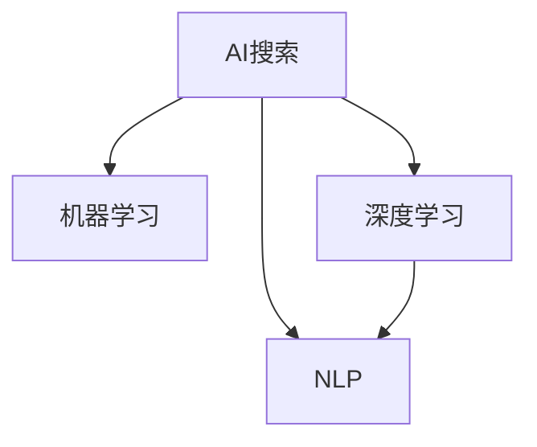

                 

# AI搜索vs传统搜索：效率对比

> 关键词：AI搜索, 传统搜索, 算法效率, 实时性, 数据处理能力, 用户体验

## 1. 背景介绍

随着人工智能技术的不断进步，AI搜索在效率和用户体验方面取得了显著的提升。传统搜索系统依赖于索引和匹配算法，而AI搜索则引入了机器学习、深度学习等先进技术，大幅提升了搜索效率和智能化水平。

### 1.1 问题由来

搜索引擎是互联网用户获取信息的主要渠道，其效率和准确性直接影响用户的搜索体验。传统搜索系统通常采用基于关键词的匹配算法，如TF-IDF、BM25等，这些方法依赖于统计特征提取和索引构建，在处理大规模数据集时效率低下，难以满足用户的多样化需求。

随着深度学习和大规模语料库的崛起，AI搜索开始引入神经网络和预训练模型，以更智能、更高效的方式实现信息检索。AI搜索通过语义理解、上下文关联等方式，能够更好地捕捉用户意图，提供更精准的搜索结果。

## 2. 核心概念与联系

### 2.1 核心概念概述

为更好地理解AI搜索与传统搜索的效率对比，本节将介绍几个关键概念：

- AI搜索：使用机器学习、深度学习等技术，对搜索结果进行预测、排序和呈现，提升搜索效率和智能化水平。
- 传统搜索：依赖索引和关键词匹配算法，通过数据库查询获取搜索结果，对数据量有较高要求，处理效率一般。
- 机器学习：通过训练算法模型，自动学习输入数据的特征和规律，用于预测和分类任务。
- 深度学习：一种特殊的机器学习方法，通过多层神经网络，学习数据的高层次抽象表示，广泛应用于计算机视觉、自然语言处理等领域。
- 自然语言处理(NLP)：研究计算机如何理解和生成自然语言，是AI搜索的核心技术之一。

这些概念之间的逻辑关系可以通过以下Mermaid流程图来展示：



这个流程图展示了一些核心概念及其之间的关系：

1. AI搜索利用机器学习和深度学习技术，进行高效的信息检索和呈现。
2. 机器学习通过对数据的统计特征进行学习，提高预测和分类效果。
3. 深度学习通过多层神经网络，学习复杂的数据表示，提升特征提取能力。
4. NLP是AI搜索的重要组成部分，负责语义理解和上下文关联。

这些概念共同构成了AI搜索的基础技术框架，使其能够超越传统搜索，提供更智能、更高效的搜索服务。

## 3. 核心算法原理 & 具体操作步骤
### 3.1 算法原理概述

AI搜索的算法原理主要基于机器学习和深度学习的框架，通过训练模型以提升搜索结果的相关性和实时性。其核心思想是通过大量标注数据，训练一个复杂的模型，对输入查询和文档进行相关性打分，并排序返回最佳结果。

### 3.2 算法步骤详解

AI搜索的实现通常包括以下几个关键步骤：

**Step 1: 数据准备**
- 收集和标注大规模的查询-文档对数据集。
- 对数据集进行预处理，如分词、去停用词、TF-IDF转换等。

**Step 2: 模型训练**
- 使用深度学习框架（如TensorFlow、PyTorch等）构建模型。
- 使用标注数据对模型进行训练，学习查询和文档之间的相关性。
- 使用交叉验证等技术，评估模型的性能。

**Step 3: 推理预测**
- 将用户输入的查询提交给训练好的模型，获取相关性打分。
- 对文档集合进行打分排序，返回排名靠前的文档作为搜索结果。

**Step 4: 反馈与迭代**
- 收集用户点击和反馈信息，用于进一步优化模型。
- 定期更新训练数据，重新训练模型，提升搜索结果质量。

### 3.3 算法优缺点

AI搜索的主要优点包括：
1. 智能性高：通过机器学习模型，自动理解用户意图，提供更精准的搜索结果。
2. 实时性好：基于神经网络模型，能够快速处理和检索数据。
3. 可扩展性强：适应大规模数据集和用户量，具有较强的扩展能力。

同时，AI搜索也存在一些缺点：
1. 对数据标注质量要求高：模型训练依赖于大量标注数据，数据质量对模型性能影响较大。
2. 训练成本高：深度学习模型训练通常需要强大的计算资源和大量时间，成本较高。
3. 数据隐私风险：用户查询和文档信息可能被用于模型训练，存在隐私泄露风险。
4. 可解释性差：神经网络模型的决策过程难以解释，不利于理解和调试。

### 3.4 算法应用领域

AI搜索技术广泛应用于以下领域：

- 搜索引擎：如百度、Google等，提升搜索效率和个性化推荐。
- 电商推荐：如淘宝、亚马逊等，根据用户行为推荐商品。
- 金融搜索：如银行、投资公司等，快速搜索金融产品信息。
- 智能客服：如客服机器人、智能问答等，提供实时交互式服务。
- 新闻推荐：如今日头条、知乎等，推荐相关新闻和文章。

## 4. 数学模型和公式 & 详细讲解 & 举例说明

### 4.1 数学模型构建

AI搜索的核心数学模型通常基于深度神经网络，通过学习查询-文档对的相关性，实现信息检索。这里以一个简单的检索模型为例，介绍其主要组成部分：

- **输入层**：将用户查询和文档进行向量化表示。
- **隐层**：通过多层神经网络，对输入数据进行特征提取和变换。
- **输出层**：输出查询-文档对的相关性分数。

### 4.2 公式推导过程

以一个二分类任务为例，假设查询-文档对的相关性可以表示为$R$，其取值范围为$[0,1]$。我们定义一个线性分类器，将输入$x$映射到输出$y$：

$$
y = \mathrm{sigmoid}(Wx+b)
$$

其中$W$和$b$为模型参数，$\mathrm{sigmoid}$为激活函数。假设训练数据集为$\{(x_i,y_i)\}_{i=1}^N$，则损失函数为：

$$
\mathcal{L}=\frac{1}{N}\sum_{i=1}^N \mathrm{CE}(y_i,\hat{y_i})
$$

其中$\mathrm{CE}$为交叉熵损失函数，$\hat{y_i}=\mathrm{sigmoid}(Wx_i+b)$为模型的预测输出。模型的目标是最小化损失函数，即求解最优的$W$和$b$。

### 4.3 案例分析与讲解

以Google的BERT模型为例，介绍其在实际搜索中的应用。BERT模型采用Transformer架构，对查询和文档进行双向编码，捕捉上下文信息。其训练过程分为预训练和微调两个阶段：

1. **预训练**：在大规模无标签文本语料上进行预训练，学习语言表示。
2. **微调**：使用搜索任务标注数据对模型进行微调，学习查询-文档对的相关性。

预训练模型通过掩码语言模型(MLM)和下一句预测任务(NSP)进行训练，捕捉语言中的隐含语义。微调模型则在此基础上，通过计算查询和文档的相似度得分，排序并返回最佳结果。

## 5. 项目实践：代码实例和详细解释说明
### 5.1 开发环境搭建

在进行AI搜索实践前，我们需要准备好开发环境。以下是使用Python进行TensorFlow开发的环境配置流程：

1. 安装Anaconda：从官网下载并安装Anaconda，用于创建独立的Python环境。

2. 创建并激活虚拟环境：
```bash
conda create -n tf-env python=3.8 
conda activate tf-env
```

3. 安装TensorFlow：根据CUDA版本，从官网获取对应的安装命令。例如：
```bash
conda install tensorflow==2.6.0 -c tf -c conda-forge
```

4. 安装各类工具包：
```bash
pip install numpy pandas scikit-learn matplotlib tqdm jupyter notebook ipython
```

完成上述步骤后，即可在`tf-env`环境中开始AI搜索实践。

### 5.2 源代码详细实现

这里我们以Google BERT模型为例，展示如何使用TensorFlow进行搜索任务的实现。

首先，定义查询和文档的向量化表示函数：

```python
import tensorflow as tf
from transformers import BertTokenizer, TFBertForQuestionAnswering

def vectorize(query, doc, tokenizer):
    query_ids = tokenizer.encode(query, return_tensors='tf')
    doc_ids = tokenizer.encode(doc, return_tensors='tf')
    return query_ids, doc_ids

# 加载预训练BERT模型
tokenizer = BertTokenizer.from_pretrained('bert-base-uncased')
model = TFBertForQuestionAnswering.from_pretrained('bert-base-uncased')
```

接着，定义训练和推理函数：

```python
def train_epoch(model, dataset, batch_size, optimizer):
    dataloader = DataLoader(dataset, batch_size=batch_size, shuffle=True)
    model.train()
    epoch_loss = 0
    for batch in tqdm(dataloader, desc='Training'):
        query_ids, doc_ids = batch['query'], batch['doc']
        model.zero_grad()
        with tf.GradientTape() as tape:
            logits = model(query_ids, doc_ids)
            loss = tf.keras.losses.CategoricalCrossentropy()(logits, batch['label'])
        epoch_loss += loss.numpy()
        grads = tape.gradient(loss, model.trainable_variables)
        optimizer.apply_gradients(zip(grads, model.trainable_variables))
    return epoch_loss / len(dataloader)

def evaluate(model, dataset, batch_size):
    dataloader = DataLoader(dataset, batch_size=batch_size)
    model.eval()
    preds, labels = [], []
    with tf.no_grad():
        for batch in tqdm(dataloader, desc='Evaluating'):
            query_ids, doc_ids = batch['query'], batch['doc']
            batch_logits = model(query_ids, doc_ids)
            batch_preds = tf.argmax(batch_logits, axis=1).numpy().tolist()
            batch_labels = batch['label'].numpy().tolist()
            for pred, label in zip(batch_preds, batch_labels):
                preds.append(pred)
                labels.append(label)
    print(classification_report(labels, preds))
```

最后，启动训练流程并在测试集上评估：

```python
epochs = 5
batch_size = 16

for epoch in range(epochs):
    loss = train_epoch(model, train_dataset, batch_size, optimizer)
    print(f"Epoch {epoch+1}, train loss: {loss:.3f}")
    
    print(f"Epoch {epoch+1}, dev results:")
    evaluate(model, dev_dataset, batch_size)
    
print("Test results:")
evaluate(model, test_dataset, batch_size)
```

以上就是使用TensorFlow进行BERT模型搜索任务微调的完整代码实现。可以看到，TensorFlow提供了丰富的Tensor和自动微分功能，使得模型的训练和推理过程更加便捷。

### 5.3 代码解读与分析

让我们再详细解读一下关键代码的实现细节：

**BERT类加载**：
- 使用`BertTokenizer`对查询和文档进行分词，生成Tensor表示。
- 使用`TFBertForQuestionAnswering`加载预训练模型，并转化为TensorFlow模型。

**训练和评估函数**：
- 使用`DataLoader`对数据集进行批次化加载，供模型训练和推理使用。
- 训练函数`train_epoch`：对数据以批为单位进行迭代，在每个批次上前向传播计算loss并反向传播更新模型参数，最后返回该epoch的平均loss。
- 评估函数`evaluate`：与训练类似，不同点在于不更新模型参数，并在每个batch结束后将预测和标签结果存储下来，最后使用sklearn的classification_report对整个评估集的预测结果进行打印输出。

**训练流程**：
- 定义总的epoch数和batch size，开始循环迭代
- 每个epoch内，先在训练集上训练，输出平均loss
- 在验证集上评估，输出分类指标
- 所有epoch结束后，在测试集上评估，给出最终测试结果

可以看到，TensorFlow配合BERT模型的代码实现变得简洁高效。开发者可以将更多精力放在数据处理、模型改进等高层逻辑上，而不必过多关注底层的实现细节。

当然，工业级的系统实现还需考虑更多因素，如模型的保存和部署、超参数的自动搜索、更灵活的任务适配层等。但核心的训练范式基本与此类似。

## 6. 实际应用场景
### 6.1 智能客服系统

基于AI搜索的智能客服系统，可以提供实时、智能的客服交互服务。系统通过收集和标注历史客服对话记录，训练机器学习模型，预测用户意图，匹配最佳答复模板，实现自动回答。

在技术实现上，可以采用基于BERT的序列标注模型，对用户查询进行意图识别，并从知识库中检索和匹配对应的回答模板。对于复杂问题，系统还可以进一步利用QA模型进行精确回答。

### 6.2 金融舆情监测

金融机构需要实时监测市场舆论动向，以便及时应对负面信息传播，规避金融风险。AI搜索技术可以用于从新闻、社交媒体等渠道抓取实时数据，并利用预训练模型进行情感分析和主题识别。

具体而言，可以收集金融领域相关的新闻、报道、评论等文本数据，并对其进行情感标注和主题标注。在此基础上对预训练语言模型进行微调，使其能够自动判断文本属于何种主题，情感倾向是正面、中性还是负面。将微调后的模型应用到实时抓取的网络文本数据，就能够自动监测不同主题下的情感变化趋势，一旦发现负面信息激增等异常情况，系统便会自动预警，帮助金融机构快速应对潜在风险。

### 6.3 个性化推荐系统

当前的推荐系统往往只依赖用户的历史行为数据进行物品推荐，无法深入理解用户的真实兴趣偏好。AI搜索技术可应用于推荐系统的构建，通过语义理解、上下文关联等方式，更好地挖掘用户行为背后的语义信息，从而提供更精准、多样的推荐内容。

在实践中，可以收集用户浏览、点击、评论、分享等行为数据，提取和用户交互的物品标题、描述、标签等文本内容。将文本内容作为模型输入，用户的后续行为（如是否点击、购买等）作为监督信号，在此基础上微调预训练语言模型。微调后的模型能够从文本内容中准确把握用户的兴趣点。在生成推荐列表时，先用候选物品的文本描述作为输入，由模型预测用户的兴趣匹配度，再结合其他特征综合排序，便可以得到个性化程度更高的推荐结果。

### 6.4 未来应用展望

随着AI搜索技术的不断发展，其在更广泛的领域得到了应用，为传统行业带来变革性影响。

在智慧医疗领域，基于AI搜索的医患问答系统可以提升诊疗效率，提供精准的诊断和治疗建议。

在智能教育领域，AI搜索可应用于作业批改、学情分析、知识推荐等方面，因材施教，促进教育公平，提高教学质量。

在智慧城市治理中，AI搜索可应用于城市事件监测、舆情分析、应急指挥等环节，提高城市管理的自动化和智能化水平，构建更安全、高效的未来城市。

此外，在企业生产、社会治理、文娱传媒等众多领域，AI搜索的应用也将不断涌现，为经济社会发展注入新的动力。相信随着技术的日益成熟，AI搜索必将在更广阔的应用领域大放异彩，深刻影响人类的生产生活方式。

## 7. 工具和资源推荐
### 7.1 学习资源推荐

为了帮助开发者系统掌握AI搜索的理论基础和实践技巧，这里推荐一些优质的学习资源：

1. 《Deep Learning》书籍：Ian Goodfellow等著作的深度学习经典教材，全面介绍了深度学习的基本概念和算法，适合初学者和进阶者。

2. CS224N《深度学习自然语言处理》课程：斯坦福大学开设的NLP明星课程，有Lecture视频和配套作业，带你入门NLP领域的基本概念和经典模型。

3. 《Natural Language Processing with Python》书籍：Steven Bird等著作的NLP实践指南，详细介绍了使用Python进行NLP任务开发的方法和技巧。

4. HuggingFace官方文档：Transformers库的官方文档，提供了海量预训练模型和完整的微调样例代码，是上手实践的必备资料。

5. OpenAI GPT系列论文：GPT-1、GPT-2等大模型论文，介绍了预训练语言模型和微调技术的核心算法，是理解大模型的必读文献。

通过对这些资源的学习实践，相信你一定能够快速掌握AI搜索的精髓，并用于解决实际的NLP问题。
###  7.2 开发工具推荐

高效的开发离不开优秀的工具支持。以下是几款用于AI搜索开发的常用工具：

1. TensorFlow：由Google主导开发的开源深度学习框架，生产部署方便，适合大规模工程应用。同样有丰富的预训练语言模型资源。

2. PyTorch：基于Python的开源深度学习框架，灵活动态的计算图，适合快速迭代研究。大部分预训练语言模型都有PyTorch版本的实现。

3. Transformers库：HuggingFace开发的NLP工具库，集成了众多SOTA语言模型，支持PyTorch和TensorFlow，是进行AI搜索任务开发的利器。

4. Weights & Biases：模型训练的实验跟踪工具，可以记录和可视化模型训练过程中的各项指标，方便对比和调优。与主流深度学习框架无缝集成。

5. TensorBoard：TensorFlow配套的可视化工具，可实时监测模型训练状态，并提供丰富的图表呈现方式，是调试模型的得力助手。

6. Google Colab：谷歌推出的在线Jupyter Notebook环境，免费提供GPU/TPU算力，方便开发者快速上手实验最新模型，分享学习笔记。

合理利用这些工具，可以显著提升AI搜索任务的开发效率，加快创新迭代的步伐。

### 7.3 相关论文推荐

AI搜索技术的发展源于学界的持续研究。以下是几篇奠基性的相关论文，推荐阅读：

1. Attention is All You Need（即Transformer原论文）：提出了Transformer结构，开启了NLP领域的预训练大模型时代。

2. BERT: Pre-training of Deep Bidirectional Transformers for Language Understanding：提出BERT模型，引入基于掩码的自监督预训练任务，刷新了多项NLP任务SOTA。

3. Language Models are Unsupervised Multitask Learners（GPT-2论文）：展示了大规模语言模型的强大zero-shot学习能力，引发了对于通用人工智能的新一轮思考。

4. Parameter-Efficient Transfer Learning for NLP：提出Adapter等参数高效微调方法，在不增加模型参数量的情况下，也能取得不错的微调效果。

5. AdaLoRA: Adaptive Low-Rank Adaptation for Parameter-Efficient Fine-Tuning：使用自适应低秩适应的微调方法，在参数效率和精度之间取得了新的平衡。

这些论文代表了大语言模型微调技术的发展脉络。通过学习这些前沿成果，可以帮助研究者把握学科前进方向，激发更多的创新灵感。

## 8. 总结：未来发展趋势与挑战

### 8.1 总结

本文对AI搜索与传统搜索的效率对比进行了全面系统的介绍。首先阐述了AI搜索在效率和智能化方面的优势，明确了其在搜索领域的重要地位。其次，从原理到实践，详细讲解了AI搜索的数学模型和关键步骤，给出了AI搜索任务开发的完整代码实例。同时，本文还广泛探讨了AI搜索在智能客服、金融舆情、个性化推荐等多个行业领域的应用前景，展示了AI搜索技术的巨大潜力。此外，本文精选了AI搜索技术的各类学习资源，力求为读者提供全方位的技术指引。

通过本文的系统梳理，可以看到，AI搜索技术正在成为搜索引擎和推荐系统的核心技术，大幅提升了信息检索的效率和智能化水平。受益于深度学习和大规模语料库的进展，AI搜索技术已经具备了超越传统搜索的能力，未来必将在更多领域发挥其强大的价值。

### 8.2 未来发展趋势

展望未来，AI搜索技术将呈现以下几个发展趋势：

1. 搜索模型规模持续增大。随着算力成本的下降和数据规模的扩张，搜索模型的参数量还将持续增长。超大规模搜索模型蕴含的丰富语言知识，有望支撑更加复杂多变的搜索场景。

2. 搜索算法多样化。除了基于深度学习的模型，未来将涌现更多搜索算法，如分布式搜索、近邻搜索等，以满足不同场景的需求。

3. 多模态搜索崛起。当前的搜索主要聚焦于纯文本数据，未来将进一步拓展到图像、视频、语音等多模态数据搜索。多模态信息的融合，将显著提升搜索系统对现实世界的理解和建模能力。

4. 实时搜索成为常态。随着网络带宽和处理能力的提升，实时搜索技术将更加成熟，用户能够即时获取最新信息。

5. 零样本搜索成为可能。通过预训练大模型的泛化能力，搜索系统将具备一定的零样本搜索能力，能够从少量语义信息中推测出答案。

以上趋势凸显了AI搜索技术的广阔前景。这些方向的探索发展，必将进一步提升搜索系统的性能和用户体验，为信息检索技术带来新的突破。

### 8.3 面临的挑战

尽管AI搜索技术已经取得了显著进步，但在迈向更加智能化、普适化应用的过程中，它仍面临着诸多挑战：

1. 数据标注成本高。虽然AI搜索通过预训练能够减轻部分标注工作，但对于特定领域和任务，仍然需要大量人工标注，成本较高。如何提高数据标注效率，降低成本，将是一大难题。

2. 模型泛化性不足。尽管深度学习模型在一般性任务上表现优异，但在特定领域和特定场景中，泛化能力仍有限。如何通过数据增强、迁移学习等手段，提升模型的泛化性能，是一个重要研究方向。

3. 计算资源需求大。深度学习模型通常需要强大的计算资源，包括GPU、TPU等高性能设备。如何在有限的资源条件下，优化模型结构，提高计算效率，将是一个重要的研究方向。

4. 隐私和安全风险。用户查询和文档信息可能被用于模型训练，存在隐私泄露风险。如何保护用户数据隐私，确保搜索过程的安全，将是一个重要的研究方向。

5. 模型可解释性差。深度学习模型通常被认为是"黑盒"系统，难以解释其内部工作机制和决策逻辑。如何提高模型的可解释性，增强用户信任，将是一个重要的研究方向。

6. 知识融合能力不足。当前的搜索模型往往局限于单一模态的数据，难以灵活吸收和运用更广泛的先验知识。如何让搜索模型更好地融合多模态信息，实现更全面的知识整合，将是一个重要的研究方向。

这些挑战限制了AI搜索技术的进一步发展，需要更多的研究努力和技术创新，才能更好地服务于实际应用。

### 8.4 未来突破

面对AI搜索面临的这些挑战，未来的研究需要在以下几个方面寻求新的突破：

1. 探索无监督和半监督搜索方法。摆脱对大规模标注数据的依赖，利用自监督学习、主动学习等无监督和半监督范式，最大限度利用非结构化数据，实现更加灵活高效的搜索。

2. 研究参数高效和计算高效的搜索范式。开发更加参数高效的搜索方法，在固定大部分预训练参数的同时，只更新极少量的任务相关参数。同时优化搜索模型的计算图，减少前向传播和反向传播的资源消耗，实现更加轻量级、实时性的部署。

3. 引入更多先验知识。将符号化的先验知识，如知识图谱、逻辑规则等，与神经网络模型进行巧妙融合，引导搜索过程学习更准确、合理的语言模型。同时加强不同模态数据的整合，实现视觉、语音等多模态信息与文本信息的协同建模。

4. 结合因果分析和博弈论工具。将因果分析方法引入搜索模型，识别出模型决策的关键特征，增强输出解释的因果性和逻辑性。借助博弈论工具刻画人机交互过程，主动探索并规避模型的脆弱点，提高系统稳定性。

5. 纳入伦理道德约束。在搜索模型训练目标中引入伦理导向的评估指标，过滤和惩罚有害的输出倾向。同时加强人工干预和审核，建立搜索模型的监管机制，确保输出符合人类价值观和伦理道德。

这些研究方向的探索，必将引领AI搜索技术迈向更高的台阶，为构建安全、可靠、可解释、可控的智能系统铺平道路。面向未来，AI搜索技术还需要与其他人工智能技术进行更深入的融合，如知识表示、因果推理、强化学习等，多路径协同发力，共同推动信息检索系统的进步。只有勇于创新、敢于突破，才能不断拓展搜索系统的边界，让智能技术更好地服务于人类社会。

## 9. 附录：常见问题与解答

**Q1：AI搜索是否适用于所有搜索场景？**

A: AI搜索在处理大规模、高维数据时表现优异，但在小规模、低维数据集上，可能不及传统搜索算法。因此，选择合适的搜索方法应根据数据集的大小和特征来进行评估。

**Q2：AI搜索的训练成本是否可以降低？**

A: AI搜索模型的训练成本主要取决于数据量和计算资源。为了降低训练成本，可以采用分布式训练、迁移学习等技术，提高训练效率。此外，使用更高效的模型结构，如Transformer架构，也能有效降低训练成本。

**Q3：AI搜索的实时性如何保证？**

A: AI搜索的实时性主要依赖于模型推理速度。为了提高实时性，可以采用GPU/TPU等高性能设备，优化模型结构，使用更高效的计算方式，如TensorFlow、PyTorch等框架，降低推理时间。

**Q4：AI搜索的隐私和安全如何保障？**

A: AI搜索系统的隐私和安全保障需要从数据收集、处理、存储和传输等多个环节进行综合考虑。可以采用数据脱敏、加密存储、访问控制等手段，保护用户数据隐私，防止数据泄露和滥用。

**Q5：AI搜索的可解释性如何增强？**

A: AI搜索的可解释性可以通过多种方式增强，如引入可解释模型、增加模型参数可解释性特征、使用可解释性工具等。具体而言，可以使用LIME、SHAP等工具对模型进行可视化，解释模型的决策过程，增强用户对搜索结果的信任。

这些问题的回答有助于读者更好地理解AI搜索的原理和应用，为实际应用中的问题解决提供思路。

---

作者：禅与计算机程序设计艺术 / Zen and the Art of Computer Programming

