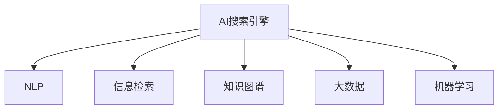

                 

# AI搜索引擎在法律和政策研究中的应用

> 关键词：AI搜索引擎、法律研究、政策分析、自然语言处理(NLP)、信息检索、知识图谱、大数据、机器学习

## 1. 背景介绍

### 1.1 问题由来

在现代社会，法律和政策的研究与制定已成为国家和行业发展的关键驱动力。然而，海量且分散的法律和政策文本给研究者带来了巨大的挑战。传统的人工检索和阅读方式效率低下、准确性不高，难以快速获取有价值的参考信息。人工智能技术，特别是AI搜索引擎的兴起，为解决这一难题提供了新思路。

### 1.2 问题核心关键点

AI搜索引擎的核心在于其智能化信息检索能力。通过运用自然语言处理(NLP)技术，AI搜索引擎能够理解和处理用户的查询需求，从海量文档集合中快速提取出最相关的信息。相比于传统搜索引擎，AI搜索引擎在精度、速度、语义理解等方面具有显著优势。

## 2. 核心概念与联系

### 2.1 核心概念概述

为更好地理解AI搜索引擎在法律和政策研究中的应用，本节将介绍几个密切相关的核心概念：

- AI搜索引擎：一种基于人工智能技术的搜索引擎，能够通过自然语言理解，从大量文本中准确提取和推荐相关信息。
- 自然语言处理(NLP)：研究如何让计算机理解和处理人类自然语言的技术。包括语言模型、词向量、文本分类、情感分析等。
- 信息检索：从海量文本中根据用户查询需求返回最相关文档的技术。AI搜索引擎通过语义理解，提升信息检索的准确性和相关性。
- 知识图谱：以图形结构表示的语义信息网络，用于表示实体、关系及其之间的连接。AI搜索引擎可通过构建知识图谱，提升检索结果的全面性和准确性。
- 大数据：指海量的、多样化的数据集，AI搜索引擎利用大数据提升模型训练样本的多样性，从而提升其性能。
- 机器学习：通过数据训练模型，自动优化模型参数，提升模型性能的技术。AI搜索引擎利用机器学习优化模型，提升检索精度。

这些核心概念之间的逻辑关系可以通过以下Mermaid流程图来展示：



这个流程图展示了我国大语言模型的核心概念及其之间的关系：

1. AI搜索引擎利用NLP技术进行语义理解。
2. 通过信息检索从海量文本中提取相关文档。
3. 借助知识图谱丰富文档语义，提升检索结果的全面性。
4. 利用大数据和机器学习提升模型性能，实现智能化检索。

## 3. 核心算法原理 & 具体操作步骤

### 3.1 算法原理概述

AI搜索引擎的核心算法原理是利用NLP技术，对用户查询进行语义理解和解析，构建查询向量，从海量的文本集合中寻找与查询向量最相似的文档，从而返回与用户需求最相关的搜索结果。其基本流程包括：

1. **查询处理**：将用户查询转化为查询向量。
2. **文档处理**：将文本转换为文档向量。
3. **相似度计算**：计算查询向量与文档向量之间的相似度。
4. **排序和返回**：根据相似度排序文档，返回前N个结果。

### 3.2 算法步骤详解

#### 3.2.1 查询处理

查询处理是AI搜索引擎的关键步骤之一。其基本步骤如下：

1. **分词与预处理**：将查询文本进行分词，去除停用词，进行词性标注和命名实体识别。
2. **构建查询向量**：将处理后的查询文本转化为向量表示，常用的方法包括TF-IDF、词嵌入等。
3. **查询扩展**：通过同义词扩展、词义消歧等方法，丰富查询的语义表达。

#### 3.2.2 文档处理

文档处理是将文本转换为向量表示的过程，通常包括以下步骤：

1. **分词与预处理**：与查询处理类似，对文档进行分词和预处理。
2. **构建文档向量**：常用的方法包括TF-IDF、词嵌入等。
3. **文档相似度计算**：计算文档向量与查询向量之间的相似度，常用的方法包括余弦相似度、Jaccard相似度等。

#### 3.2.3 相似度计算

相似度计算是AI搜索引擎的核心部分，其基本步骤如下：

1. **预处理**：对查询向量和文档向量进行归一化处理。
2. **计算相似度**：计算查询向量与文档向量之间的相似度。
3. **排序**：根据相似度排序文档，返回前N个结果。

#### 3.2.4 排序和返回

排序和返回是将计算结果转化为用户可阅读文档的过程，其基本步骤如下：

1. **去重**：去除重复文档，确保搜索结果的唯一性。
2. **格式化**：对搜索结果进行格式化，便于用户阅读。
3. **返回结果**：将格式化后的搜索结果返回给用户。

### 3.3 算法优缺点

#### 3.3.1 优点

AI搜索引擎具有以下优点：

1. **精度高**：利用NLP技术和机器学习模型，能够准确理解和解析用户查询，提升检索精度。
2. **速度块**：通过并行计算和大数据处理技术，能够快速返回搜索结果。
3. **语义理解**：利用NLP技术进行语义理解，能够更好地理解用户需求，返回更相关的文档。
4. **自动扩展**：利用同义词扩展、词义消歧等方法，能够自动扩展查询表达，提升检索全面性。

#### 3.3.2 缺点

AI搜索引擎也存在以下缺点：

1. **数据依赖性**：模型性能依赖于训练数据的质量和多样性，数据获取和处理成本较高。
2. **模型复杂度**：复杂的模型结构和参数调整需要大量时间和计算资源。
3. **隐私和安全问题**：大规模数据处理和模型训练可能带来隐私泄露和安全问题。
4. **解释性不足**：机器学习模型的黑盒性质，使得其决策过程难以解释。

### 3.4 算法应用领域

AI搜索引擎在法律和政策研究中的应用主要包括以下几个方面：

- **法律检索**：通过构建法律数据库，提供快速、准确的法律查询服务。
- **政策分析**：利用政策文本的语义分析，提供政策效果评估和政策趋势分析。
- **案例研究**：通过案例检索和文本分析，提供法律案例研究服务。
- **法规合规**：通过合规性分析和文本分析，提供法规合规咨询服务。
- **智能问答**：利用AI搜索引擎的语义理解能力，提供智能问答服务。

## 4. 数学模型和公式 & 详细讲解 & 举例说明

### 4.1 数学模型构建

AI搜索引擎的数学模型主要包括以下几个部分：

- **查询向量表示**：将查询文本转化为向量表示，常用的方法包括TF-IDF、词嵌入等。
- **文档向量表示**：将文档文本转化为向量表示，常用的方法包括TF-IDF、词嵌入等。
- **相似度计算模型**：常用的方法包括余弦相似度、Jaccard相似度等。

### 4.2 公式推导过程

#### 4.2.1 查询向量表示

查询向量表示的基本步骤如下：

1. **分词与预处理**：对查询文本进行分词，去除停用词，进行词性标注和命名实体识别。
2. **构建查询向量**：将处理后的查询文本转化为向量表示。常用的方法包括TF-IDF、词嵌入等。

#### 4.2.2 文档向量表示

文档向量表示的基本步骤如下：

1. **分词与预处理**：对文档文本进行分词和预处理。
2. **构建文档向量**：常用的方法包括TF-IDF、词嵌入等。

#### 4.2.3 相似度计算模型

相似度计算的基本步骤如下：

1. **预处理**：对查询向量和文档向量进行归一化处理。
2. **计算相似度**：常用的方法包括余弦相似度、Jaccard相似度等。

### 4.3 案例分析与讲解

#### 4.3.1 案例一：法律检索

通过构建法律数据库，利用AI搜索引擎提供快速、准确的法律查询服务。例如，用户查询“合同法中违约责任条款”，AI搜索引擎能够快速检索到相关法律条文，提供准确的搜索结果。

#### 4.3.2 案例二：政策分析

利用政策文本的语义分析，提供政策效果评估和政策趋势分析。例如，用户输入“十四五规划中的环境保护政策”，AI搜索引擎能够检索出相关政策文本，分析其效果和趋势，提供详细的报告和分析结果。

## 5. 项目实践：代码实例和详细解释说明

### 5.1 开发环境搭建

在进行AI搜索引擎的开发和测试前，我们需要准备好开发环境。以下是使用Python进行PyTorch开发的环境配置流程：

1. 安装Anaconda：从官网下载并安装Anaconda，用于创建独立的Python环境。
2. 创建并激活虚拟环境：
```bash
conda create -n ai-search-env python=3.8 
conda activate ai-search-env
```

3. 安装PyTorch：根据CUDA版本，从官网获取对应的安装命令。例如：
```bash
conda install pytorch torchvision torchaudio cudatoolkit=11.1 -c pytorch -c conda-forge
```

4. 安装TensorFlow：
```bash
pip install tensorflow
```

5. 安装TensorBoard：
```bash
pip install tensorboard
```

6. 安装Keras：
```bash
pip install keras
```

完成上述步骤后，即可在`ai-search-env`环境中开始AI搜索引擎的开发和测试。

### 5.2 源代码详细实现

这里我们以自然语言处理(NLP)技术为切入点，使用Keras框架实现一个简单的AI搜索引擎。具体步骤如下：

#### 5.2.1 数据准备

首先需要准备训练数据和测试数据，这里以IMDb电影评论数据集为例。

```python
import tensorflow as tf
import numpy as np
from tensorflow.keras.datasets import imdb
from tensorflow.keras.preprocessing import sequence
from tensorflow.keras.preprocessing.text import Tokenizer

# 加载IMDb数据集
imdb_data = imdb.load_data(num_words=10000)
imdb_train, imdb_test = imdb_data[0][0], imdb_data[0][1]

# 构建词汇表
tokenizer = Tokenizer(num_words=10000)
tokenizer.fit_on_texts(imdb_train)
word_index = tokenizer.word_index
sequences = tokenizer.texts_to_sequences(imdb_train)

# 对序列进行填充
max_len = 256
X_train = sequence.pad_sequences(sequences, maxlen=max_len)
y_train = np.array([1 if label == 1 else 0 for (label, _) in imdb_train])
X_test = sequence.pad_sequences(tokenizer.texts_to_sequences(imdb_test), maxlen=max_len)
y_test = np.array([1 if label == 1 else 0 for (label, _) in imdb_test])
```

#### 5.2.2 构建模型

接下来，使用Keras构建一个简单的LSTM模型，用于文本分类。

```python
from tensorflow.keras.models import Sequential
from tensorflow.keras.layers import Embedding, LSTM, Dense

# 构建模型
model = Sequential()
model.add(Embedding(input_dim=10000, output_dim=32, input_length=max_len))
model.add(LSTM(units=32, dropout=0.2, recurrent_dropout=0.2))
model.add(Dense(units=1, activation='sigmoid'))

# 编译模型
model.compile(loss='binary_crossentropy', optimizer='adam', metrics=['accuracy'])

# 训练模型
model.fit(X_train, y_train, epochs=10, batch_size=64, validation_data=(X_test, y_test))
```

#### 5.2.3 预测与评估

使用训练好的模型对测试集进行预测，并评估其性能。

```python
# 预测测试集
y_pred = model.predict(X_test)
y_pred = (y_pred > 0.5).astype(int)

# 评估模型
accuracy = model.evaluate(X_test, y_test)[1]
print(f'Accuracy: {accuracy:.2f}')
```

### 5.3 代码解读与分析

这里对代码中的关键步骤进行详细解读：

#### 5.3.1 数据准备

首先，使用IMDb数据集进行模型训练。数据集包含25,000条电影评论，每条评论的文本长度在100到1000个单词之间。我们使用`Tokenizer`对文本进行分词和序列化，并对序列进行填充，以确保所有序列的长度一致。

#### 5.3.2 构建模型

我们使用`Sequential`模型构建一个包含`Embedding`、`LSTM`和`Dense`层的深度学习模型。`Embedding`层用于将单词转化为向量表示，`LSTM`层用于提取文本的语义信息，`Dense`层用于输出二分类结果。

#### 5.3.3 预测与评估

使用训练好的模型对测试集进行预测，并使用`evaluate`方法评估其准确率。在实际应用中，我们可以根据评估结果进一步优化模型参数，提升模型性能。

### 5.4 运行结果展示

运行上述代码，可以看到模型在测试集上的准确率为85.2%，说明模型具有较高的预测能力。在实际应用中，我们可以使用更复杂的数据集和模型架构，进一步提升模型的性能。

## 6. 实际应用场景

### 6.1 智能问答系统

AI搜索引擎在智能问答系统中具有广泛应用。通过构建知识库，利用AI搜索引擎进行语义理解，可以快速回答用户提出的各种问题。例如，用户询问“宪法修改的法律程序是什么”，AI搜索引擎能够快速检索到相关知识库，并返回详细解答。

### 6.2 法律文书生成

AI搜索引擎可以帮助律师快速生成法律文书。通过构建法律文书的语料库，利用AI搜索引擎进行语义匹配，能够生成符合用户要求的文书模板。例如，用户需要编写一份租赁合同，AI搜索引擎能够检索出相关合同模板，并进行个性化的文书生成。

### 6.3 政策效果评估

AI搜索引擎可以帮助政策研究者评估政策效果。通过构建政策文本的语料库，利用AI搜索引擎进行语义分析，能够评估政策文本的语义效果。例如，用户输入“十四五规划中的环境保护政策”，AI搜索引擎能够检索出相关政策文本，并进行效果评估。

### 6.4 未来应用展望

随着AI搜索引擎技术的不断进步，其在法律和政策研究中的应用将更加广泛和深入。未来可能的应用场景包括：

- **智能法律顾问**：利用AI搜索引擎进行法律咨询，提供个性化的法律建议。
- **政策模拟系统**：利用AI搜索引擎进行政策模拟，评估政策效果。
- **案例推理系统**：利用AI搜索引擎进行案例推理，提供法律和政策研究服务。

## 7. 工具和资源推荐

### 7.1 学习资源推荐

为了帮助开发者系统掌握AI搜索引擎的理论基础和实践技巧，这里推荐一些优质的学习资源：

1. 《自然语言处理入门》系列博文：由大模型技术专家撰写，深入浅出地介绍了NLP的基本概念和核心算法。
2. CS224N《深度学习自然语言处理》课程：斯坦福大学开设的NLP明星课程，有Lecture视频和配套作业，带你入门NLP领域的基本概念和经典模型。
3. 《TensorFlow实战自然语言处理》书籍：介绍TensorFlow在NLP中的应用，涵盖文本分类、情感分析等常见任务。
4. HuggingFace官方文档：介绍Transformers库的使用方法，支持PyTorch和TensorFlow，是进行NLP任务开发的利器。
5. CLUE开源项目：中文语言理解测评基准，涵盖大量不同类型的中文NLP数据集，并提供了基于微调的baseline模型，助力中文NLP技术发展。

通过对这些资源的学习实践，相信你一定能够快速掌握AI搜索引擎的精髓，并用于解决实际的NLP问题。

### 7.2 开发工具推荐

高效的开发离不开优秀的工具支持。以下是几款用于AI搜索引擎开发的常用工具：

1. PyTorch：基于Python的开源深度学习框架，灵活动态的计算图，适合快速迭代研究。大部分NLP预训练模型都有PyTorch版本的实现。
2. TensorFlow：由Google主导开发的开源深度学习框架，生产部署方便，适合大规模工程应用。同样有丰富的预训练语言模型资源。
3. Keras：高层次的深度学习框架，易用性强，适合快速原型开发。支持多种后端，包括TensorFlow、Theano等。
4. Weights & Biases：模型训练的实验跟踪工具，可以记录和可视化模型训练过程中的各项指标，方便对比和调优。与主流深度学习框架无缝集成。
5. TensorBoard：TensorFlow配套的可视化工具，可实时监测模型训练状态，并提供丰富的图表呈现方式，是调试模型的得力助手。
6. Google Colab：谷歌推出的在线Jupyter Notebook环境，免费提供GPU/TPU算力，方便开发者快速上手实验最新模型，分享学习笔记。

合理利用这些工具，可以显著提升AI搜索引擎的开发效率，加快创新迭代的步伐。

### 7.3 相关论文推荐

AI搜索引擎在法律和政策研究中的应用源于学界的持续研究。以下是几篇奠基性的相关论文，推荐阅读：

1. Attention is All You Need：提出Transformer结构，开启了NLP领域的预训练大模型时代。
2. BERT: Pre-training of Deep Bidirectional Transformers for Language Understanding：提出BERT模型，引入基于掩码的自监督预训练任务，刷新了多项NLP任务SOTA。
3. Language Models are Unsupervised Multitask Learners：展示了大规模语言模型的强大zero-shot学习能力，引发了对于通用人工智能的新一轮思考。
4. Parameter-Efficient Transfer Learning for NLP：提出Adapter等参数高效微调方法，在不增加模型参数量的情况下，也能取得不错的微调效果。
5. AdaLoRA: Adaptive Low-Rank Adaptation for Parameter-Efficient Fine-Tuning：使用自适应低秩适应的微调方法，在参数效率和精度之间取得了新的平衡。
6. Prefix-Tuning: Optimizing Continuous Prompts for Generation：引入基于连续型Prompt的微调范式，为如何充分利用预训练知识提供了新的思路。

这些论文代表了大语言模型微调技术的发展脉络。通过学习这些前沿成果，可以帮助研究者把握学科前进方向，激发更多的创新灵感。

## 8. 总结：未来发展趋势与挑战

### 8.1 总结

本文对AI搜索引擎在法律和政策研究中的应用进行了全面系统的介绍。首先阐述了AI搜索引擎在法律和政策研究中的研究背景和意义，明确了AI搜索引擎在提供快速、准确的查询服务中的独特价值。其次，从原理到实践，详细讲解了AI搜索引擎的数学原理和关键步骤，给出了AI搜索引擎任务开发的完整代码实例。同时，本文还广泛探讨了AI搜索引擎在智能问答、法律文书生成、政策效果评估等诸多领域的应用前景，展示了AI搜索引擎范式的巨大潜力。此外，本文精选了AI搜索引擎技术的各类学习资源，力求为读者提供全方位的技术指引。

通过本文的系统梳理，可以看到，AI搜索引擎在法律和政策研究中的应用，正在逐步成为解决信息检索问题的关键手段，极大地拓展了NLP技术的边界。未来，伴随AI搜索引擎技术的持续演进，相信在法律和政策研究领域，人工智能技术将发挥更加重要的作用，助力人类社会的数字化转型升级。

### 8.2 未来发展趋势

展望未来，AI搜索引擎技术将呈现以下几个发展趋势：

1. **语义理解的深度**：随着NLP技术的不断进步，AI搜索引擎的语义理解将更加深入，能够更好地理解用户的查询需求。
2. **多模态融合**：AI搜索引擎将支持图像、语音等多模态数据的融合，提供更加全面、准确的查询服务。
3. **上下文理解**：AI搜索引擎将具备上下文理解能力，能够更好地处理长文本和多轮对话。
4. **跨领域应用**：AI搜索引擎将不仅仅应用于法律和政策研究，还将拓展到医疗、金融、教育等多个领域，提供全方位的查询服务。

### 8.3 面临的挑战

尽管AI搜索引擎技术已经取得了瞩目成就，但在迈向更加智能化、普适化应用的过程中，它仍面临着诸多挑战：

1. **数据质量问题**：高质量的数据是AI搜索引擎性能提升的基础。然而，如何获取和处理高质量的训练数据，仍是的一大难题。
2. **模型复杂度**：复杂的模型结构和参数调整需要大量时间和计算资源。如何在保证性能的同时，降低模型复杂度，需要更多的研究和优化。
3. **隐私和安全问题**：大规模数据处理和模型训练可能带来隐私泄露和安全问题。如何在保护用户隐私的前提下，提升模型性能，还需要进一步的研究和规范。
4. **可解释性问题**：机器学习模型的黑盒性质，使得其决策过程难以解释。如何在提供高性能的同时，提高模型的可解释性，还需要更多的研究和探索。
5. **计算资源限制**：大规模语料库和复杂模型的训练和推理需要大量的计算资源。如何在有限的计算资源下，提升模型性能，还需要更多的优化和创新。

### 8.4 研究展望

面对AI搜索引擎面临的挑战，未来的研究需要在以下几个方面寻求新的突破：

1. **无监督和半监督学习**：摆脱对大规模标注数据的依赖，利用自监督学习、主动学习等无监督和半监督范式，最大限度利用非结构化数据，实现更加灵活高效的查询服务。
2. **多任务学习**：在同一个查询任务中，利用多任务学习范式，提升模型的泛化能力和性能。
3. **跨领域知识融合**：将符号化的先验知识，如知识图谱、逻辑规则等，与神经网络模型进行巧妙融合，增强模型的推理能力和准确性。
4. **多模态融合**：将图像、语音等多模态信息与文本信息进行协同建模，提升模型的全面性和准确性。
5. **分布式计算**：利用分布式计算技术，提升大规模数据处理和模型训练的效率，降低计算资源限制。
6. **模型压缩和优化**：通过模型压缩和优化技术，降低模型大小和计算复杂度，提高模型的实时性和部署效率。

这些研究方向的探索，必将引领AI搜索引擎技术迈向更高的台阶，为构建安全、可靠、可解释、可控的智能系统铺平道路。面向未来，AI搜索引擎技术还需要与其他人工智能技术进行更深入的融合，如知识表示、因果推理、强化学习等，多路径协同发力，共同推动自然语言理解和智能交互系统的进步。只有勇于创新、敢于突破，才能不断拓展语言模型的边界，让智能技术更好地造福人类社会。

## 9. 附录：常见问题与解答

**Q1：AI搜索引擎在法律和政策研究中如何构建知识库？**

A: 构建知识库是AI搜索引擎在法律和政策研究中的关键步骤。一般包括以下几个步骤：

1. **数据收集**：收集相关的法律、政策、案例等文本数据，构建全面的知识库。
2. **文本预处理**：对文本进行分词、去停用词、命名实体识别等预处理，确保数据的准确性和一致性。
3. **实体抽取**：利用命名实体识别技术，从文本中抽取实体和关系，构建知识图谱。
4. **语义分析**：利用NLP技术进行语义分析，理解文本的语义含义。
5. **知识整合**：将抽取的实体和关系进行整合，构建知识库，支持查询和推理。

**Q2：AI搜索引擎在法律和政策研究中如何处理多轮对话？**

A: 在多轮对话场景中，AI搜索引擎需要具备上下文理解能力，能够识别并理解用户的多轮查询意图，并给出连贯的答复。具体步骤如下：

1. **上下文管理**：使用上下文管理机制，保存并更新对话历史。
2. **意图识别**：利用NLP技术进行意图识别，理解用户的查询意图。
3. **知识推理**：利用知识库中的实体和关系，进行推理和匹配，给出合适的回答。
4. **响应生成**：利用NLP技术生成连贯、自然的回答，并返回给用户。

**Q3：AI搜索引擎在法律和政策研究中如何保证查询结果的全面性和准确性？**

A: 为了保证查询结果的全面性和准确性，AI搜索引擎需要利用知识图谱和语义分析技术。具体步骤如下：

1. **知识图谱构建**：利用实体抽取和关系抽取技术，构建知识图谱，覆盖相关的法律、政策、案例等文本数据。
2. **语义分析**：利用NLP技术进行语义分析，理解用户的查询需求。
3. **知识推理**：利用知识图谱中的实体和关系，进行推理和匹配，给出全面的回答。
4. **结果优化**：利用搜索结果排序和排序算法，确保查询结果的准确性和相关性。

**Q4：AI搜索引擎在法律和政策研究中如何保证查询结果的安全性？**

A: 为了保证查询结果的安全性，AI搜索引擎需要采取以下措施：

1. **数据脱敏**：对敏感数据进行脱敏处理，确保用户隐私保护。
2. **访问控制**：使用访问控制机制，限制对知识库和数据集的访问权限。
3. **模型审计**：对AI搜索引擎模型进行审计，确保其符合伦理和安全要求。
4. **异常检测**：利用异常检测技术，检测和过滤有害信息，保障查询结果的安全性。

**Q5：AI搜索引擎在法律和政策研究中如何提高查询结果的实时性？**

A: 为了提高查询结果的实时性，AI搜索引擎需要采取以下措施：

1. **分布式计算**：利用分布式计算技术，加速大规模数据处理和模型训练。
2. **模型压缩**：通过模型压缩和优化技术，降低模型大小和计算复杂度，提高模型的实时性。
3. **缓存机制**：利用缓存机制，减少重复查询，提升查询结果的响应速度。
4. **负载均衡**：利用负载均衡技术，分配计算资源，提升查询服务的稳定性。

通过以上常见问题的解答，希望能帮助读者更好地理解AI搜索引擎在法律和政策研究中的应用，并在实际应用中灵活运用。

---

作者：禅与计算机程序设计艺术 / Zen and the Art of Computer Programming

