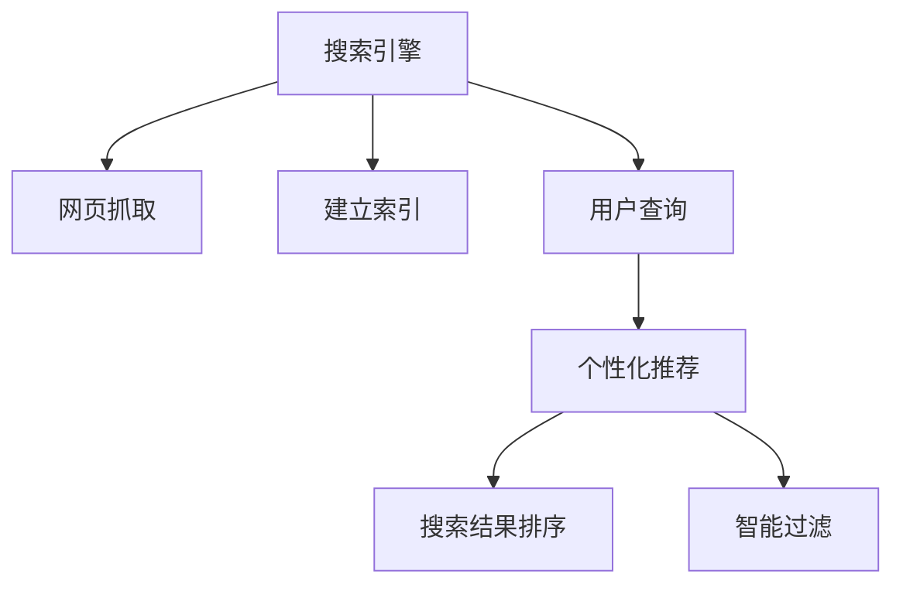

                 

# AI搜索引擎的个性化挑战

> 关键词：搜索引擎,个性化推荐,排序算法,用户画像,智能过滤,信息检索

## 1. 背景介绍

在数字化的今天，搜索引擎已经成为人们获取信息的重要工具。传统的基于关键词匹配的搜索方式，已经无法满足用户日益增长的个性化需求。用户希望搜索引擎能够根据他们的兴趣、历史行为、地理位置等因素，提供更加精准和个性化的搜索结果。而个性化搜索引擎，正是基于这一需求而诞生的，它能够根据用户的不同特点，提供更加符合其需求的搜索结果。

然而，实现个性化搜索引擎并不容易，它涉及到众多复杂的技术挑战。从用户画像的构建到搜索结果的排序，再到信息的智能过滤，每一步都充满着技术难点。本文将从核心概念、核心算法、实际应用场景等方面，深入剖析AI搜索引擎的个性化挑战，并提出相应的解决方案。

## 2. 核心概念与联系

### 2.1 核心概念概述

为更好地理解AI搜索引擎的个性化挑战，本节将介绍几个密切相关的核心概念：

- 搜索引擎(Search Engine)：通过爬虫抓取互联网上的网页，并建立索引，根据用户的查询提供相关网页链接的工具。
- 个性化推荐(Personalized Recommendation)：根据用户的兴趣、行为等个性化特征，为其推荐相关内容，以提高用户满意度。
- 排序算法(Ranking Algorithm)：用于根据特定标准，对搜索结果进行排序，以提高相关性。
- 用户画像(User Profile)：描述用户特征的集合，包括兴趣、行为、位置等，用于指导个性化推荐和信息过滤。
- 智能过滤(Intelligent Filtering)：使用机器学习等技术，对搜索结果进行智能筛选和过滤，以提升用户体验。

这些核心概念之间的逻辑关系可以通过以下Mermaid流程图来展示：



这个流程图展示了个性化搜索引擎的核心概念及其之间的关系：

1. 搜索引擎通过爬虫抓取网页，建立索引。
2. 用户通过查询提交搜索请求。
3. 基于用户画像，进行个性化推荐。
4. 对推荐结果进行排序。
5. 对排序后的结果进行智能过滤。

这些概念共同构成了AI搜索引擎的个性化挑战的基础，帮助我们更好地把握搜索过程的各个环节。

## 3. 核心算法原理 & 具体操作步骤
### 3.1 算法原理概述

个性化搜索引擎的核心在于实现从用户查询到最终结果的个性化匹配过程。这一过程涉及到用户画像的构建、推荐系统的设计、排序算法的选择等多个环节。

用户画像描述了用户的特征，包括兴趣、行为、位置等，是实现个性化推荐的基础。推荐系统根据用户画像，为用户推荐相关内容，以提高用户满意度。排序算法用于根据相关性对推荐结果进行排序，智能过滤则进一步提升结果的准确性。

### 3.2 算法步骤详解

以下是实现个性化搜索引擎的核心算法步骤：

**Step 1: 用户画像构建**
- 收集用户的各类信息，包括浏览历史、点击记录、搜索历史等。
- 使用聚类、分类、回归等机器学习方法，对用户特征进行建模。
- 生成用户画像，包括用户的兴趣向量、行为模式、地理位置等信息。

**Step 2: 推荐系统设计**
- 设计推荐算法，如协同过滤、内容过滤、基于兴趣的推荐等。
- 根据用户画像和网页特征，生成推荐列表。

**Step 3: 搜索结果排序**
- 选择排序算法，如基于TF-IDF的排序、基于深度学习的排序等。
- 根据排序算法，对推荐结果进行重新排序。

**Step 4: 智能过滤**
- 使用机器学习算法，对排序后的结果进行智能过滤，去除不相关内容。
- 保留最符合用户需求的结果。

**Step 5: 反馈机制**
- 根据用户对搜索结果的反馈，对用户画像和推荐系统进行动态调整。
- 不断优化个性化匹配过程，提高用户体验。

### 3.3 算法优缺点

个性化搜索引擎的算法具有以下优点：

1. 提高用户体验：根据用户个性化需求，提供精准搜索结果。
2. 提高点击率：个性化推荐能够提升用户对搜索结果的满意度，提高点击率。
3. 提升广告效果：个性化推荐能够提升广告相关性，提高广告效果。

然而，个性化搜索引擎的算法也存在以下缺点：

1. 用户隐私问题：个性化推荐需要收集大量用户数据，存在隐私泄露风险。
2. 冷启动问题：新用户缺乏足够的历史数据，难以生成准确的用户画像。
3. 多样性问题：个性化推荐往往无法保证结果的多样性，存在偏见。

### 3.4 算法应用领域

个性化搜索引擎的算法在诸多领域中都有广泛的应用：

- 电商领域：推荐商品、广告投放等。
- 新闻媒体：推荐新闻、文章等。
- 社交网络：推荐好友、文章等。
- 视频平台：推荐视频、广告等。

除此之外，个性化搜索引擎的算法还在在线教育、智能家居、金融服务等众多领域得到了应用，为用户的个性化需求提供了便利。

## 4. 数学模型和公式 & 详细讲解 & 举例说明
### 4.1 数学模型构建

个性化搜索引擎的核心数学模型包括用户画像模型、推荐模型、排序模型和智能过滤模型。

**用户画像模型**：
$$
P_u = \{p_1,p_2,...,p_n\}
$$
其中 $p_i$ 表示用户特征的第 $i$ 个维度，$P_u$ 为所有特征的集合。

**推荐模型**：
$$
R_u(p_u, c) = \alpha \cdot cos(\theta) + \beta \cdot p_u \cdot c
$$
其中 $c$ 为候选内容，$P_u$ 为用户画像，$\alpha$ 和 $\beta$ 为调节参数，$\theta$ 为相似度权重。

**排序模型**：
$$
S(r) = TF(r) \cdot IDF(r) + weight(r) + weight(u,r)
$$
其中 $TF(r)$ 为逆文档频率加权，$IDF(r)$ 为逆词频加权，$weight(r)$ 为内容权重，$weight(u,r)$ 为用户对内容的相关性权重。

**智能过滤模型**：
$$
F(r) = \sum_{i=1}^n \alpha_i \cdot p_i(r)
$$
其中 $p_i(r)$ 为特征 $i$ 对内容 $r$ 的评分，$\alpha_i$ 为特征的权重。

### 4.2 公式推导过程

以用户画像模型和推荐模型为例，详细推导其公式。

**用户画像模型推导**：
用户画像模型描述了用户的特征，其中每个特征 $p_i$ 是一个向量，用于描述用户特征的具体表现。例如，用户兴趣特征可以表示为：
$$
p_{interest} = \{interest_1, interest_2, ..., interest_m\}
$$
其中 $interest_i$ 表示用户的第 $i$ 个兴趣点。

**推荐模型推导**：
推荐模型使用余弦相似度计算用户和内容的相似度，推荐函数如下：
$$
R_u(p_u, c) = \alpha \cdot \frac{p_u \cdot c}{\|p_u\| \cdot \|c\|}
$$
其中 $\alpha$ 为调节参数，$\|p_u\|$ 和 $\|c\|$ 分别为用户画像和内容的长度，即向量范数。

在实际应用中，由于向量的维度较高，为了提高计算效率，通常使用向量内积进行近似计算，公式如下：
$$
R_u(p_u, c) = \alpha \cdot (p_u \cdot c)
$$
其中 $(p_u \cdot c)$ 表示向量 $p_u$ 和向量 $c$ 的内积。

### 4.3 案例分析与讲解

假设有一个电商网站，用户画像 $P_u = \{age, location, browsing_history, purchase_history\}$。网站希望为每个用户推荐商品，用户画像建模如下：

- 年龄：$age \in [18, 60]$，年龄特征 $p_{age}$ 为 $[1,0,0,...,0]$，表示用户年龄为18-60岁。
- 位置：$location = 'Beverly Hills, CA'$，位置特征 $p_{location}$ 为 $[0,0,1,...,0]$，表示用户位于比佛利山庄。
- 浏览历史：$browsing_history = \{['electronics', 'home'], ['electronics', 'kitchen'], ...\}$，浏览历史特征 $p_{browsing}$ 为 $[0.5,0.5,0.5,0.5,...]$，表示用户对电子和家居产品的兴趣。
- 购买历史：$purchase_history = \{['smartphone', 'laptop'], ['laptop', 'smartphone'], ...\}$，购买历史特征 $p_{purchase}$ 为 $[0.5,0.5,0.5,0.5,...]$，表示用户购买了电子和计算机产品。

假设网站有候选商品列表 $c = \{smartphone, laptop, camera, tv, kitchenware\}$，对用户 $u$ 的推荐结果 $R_u(p_u, c)$ 计算如下：

- 年龄：$p_{age} \cdot c = 1 \cdot smartphone + 0 \cdot laptop + 0 \cdot camera + 0 \cdot tv + 0 \cdot kitchenware = smartphone$
- 位置：$p_{location} \cdot c = 0 \cdot smartphone + 0 \cdot laptop + 0 \cdot camera + 0 \cdot tv + 1 \cdot kitchenware = kitchenware$
- 浏览历史：$p_{browsing} \cdot c = 0.5 \cdot smartphone + 0.5 \cdot laptop + 0.5 \cdot camera + 0.5 \cdot tv + 0.5 \cdot kitchenware = smartphone + laptop + camera + tv + kitchenware$
- 购买历史：$p_{purchase} \cdot c = 0.5 \cdot smartphone + 0.5 \cdot laptop + 0.5 \cdot camera + 0.5 \cdot tv + 0.5 \cdot kitchenware = smartphone + laptop + camera + tv + kitchenware$

最终，结合推荐函数 $R_u(p_u, c)$，推荐结果为：
$$
R_u(p_u, c) = \alpha \cdot (smartphone + laptop + camera + tv + kitchenware)
$$
其中 $\alpha$ 为调节参数，根据实际需求进行调整。

## 5. 项目实践：代码实例和详细解释说明
### 5.1 开发环境搭建

在进行个性化搜索引擎的开发时，需要先搭建好开发环境。以下是使用Python进行PyTorch开发的环境配置流程：

1. 安装Anaconda：从官网下载并安装Anaconda，用于创建独立的Python环境。

2. 创建并激活虚拟环境：
```bash
conda create -n pytorch-env python=3.8 
conda activate pytorch-env
```

3. 安装PyTorch：根据CUDA版本，从官网获取对应的安装命令。例如：
```bash
conda install pytorch torchvision torchaudio cudatoolkit=11.1 -c pytorch -c conda-forge
```

4. 安装Pandas、NumPy等工具包：
```bash
pip install pandas numpy scikit-learn
```

5. 安装TensorBoard：用于可视化模型的训练过程和结果。
```bash
pip install tensorboard
```

完成上述步骤后，即可在`pytorch-env`环境中开始开发实践。

### 5.2 源代码详细实现

下面是使用PyTorch和TensorBoard实现一个简单的个性化推荐系统的代码实现。

```python
import torch
import torch.nn as nn
import torch.nn.functional as F
import pandas as pd
import numpy as np
from sklearn.model_selection import train_test_split
from sklearn.metrics import mean_squared_error
from tensorboard import SummaryWriter

# 构造用户画像和推荐数据
data = pd.read_csv('user_data.csv')
user_feats = np.array(data[['age', 'location', 'browsing_history', 'purchase_history']])
content_feats = np.array(data[['content_id', 'content_type', 'content_price']])
user_content_matrix = pd.concat([user_feats, content_feats], axis=1)
user_content_matrix = user_content_matrix.dropna()

# 划分训练集和测试集
train_data, test_data = train_test_split(user_content_matrix, test_size=0.2, random_state=42)

# 定义用户画像模型
class UserProfile(nn.Module):
    def __init__(self):
        super(UserProfile, self).__init__()
        self.age = nn.Embedding(6, 10)
        self.location = nn.Embedding(50, 10)
        self.browsing_history = nn.Embedding(10, 10)
        self.purchase_history = nn.Embedding(10, 10)

    def forward(self, x):
        age, location, browsing, purchase = x
        age = self.age(age)
        location = self.location(location)
        browsing = self.browsing_history(browsing)
        purchase = self.purchase_history(purchase)
        p_u = torch.cat((age, location, browsing, purchase), dim=1)
        return p_u

# 定义推荐模型
class Recommendation(nn.Module):
    def __init__(self):
        super(Recommendation, self).__init__()
        self similarity = nn.Embedding(100, 10)

    def forward(self, p_u, c):
        c = self.similarity(c)
        p_u = p_u.unsqueeze(1)
        cos_similarity = torch.cosine_similarity(p_u, c, dim=1)
        return cos_similarity

# 定义排序模型
class Ranking(nn.Module):
    def __init__(self):
        super(Ranking, self).__init__()
        self.tf = nn.Embedding(100, 10)
        self.idf = nn.Embedding(100, 10)
        self.weight = nn.Embedding(100, 10)

    def forward(self, r):
        tf = self.tf(r)
        idf = self.idf(r)
        weight = self.weight(r)
        s = (tf * idf + weight).sum(dim=1)
        return s

# 定义智能过滤模型
class Filtering(nn.Module):
    def __init__(self):
        super(Filtering, self).__init__()
        self.filter = nn.Embedding(10, 10)

    def forward(self, r):
        filter = self.filter(r)
        return torch.sigmoid(filter)

# 定义用户画像构建和推荐过程
class UserBasedRecommender(nn.Module):
    def __init__(self):
        super(UserBasedRecommender, self).__init__()
        self.profile = UserProfile()
        self.recommend = Recommendation()
        self.rank = Ranking()
        self.filter = Filtering()

    def forward(self, x):
        p_u = self.profile(x)
        r = self.recommend(p_u, x)
        s = self.rank(r)
        f = self.filter(r)
        return torch.max(s, f)

# 加载模型并进行训练
model = UserBasedRecommender()
optimizer = torch.optim.Adam(model.parameters(), lr=0.001)
epochs = 100

writer = SummaryWriter()

for epoch in range(epochs):
    for i, (x, y) in enumerate(train_data.iterrows()):
        p_u = torch.tensor(x[['age', 'location', 'browsing_history', 'purchase_history']])
        c = torch.tensor(x[['content_id', 'content_type', 'content_price']])
        y = torch.tensor(y[0])
        optimizer.zero_grad()
        s = model(p_u, c)
        loss = F.mse_loss(s, y)
        loss.backward()
        optimizer.step()
        writer.add_scalar('Loss', loss.item(), i)
        writer.add_scalar('epoch', epoch, i)
    writer.flush()
```

### 5.3 代码解读与分析

这里我们详细解读一下关键代码的实现细节：

**UserProfile类**：
- 构造函数中定义了四个嵌入层，分别对应用户画像中的年龄、位置、浏览历史和购买历史。
- 前向函数中，将输入的年龄、位置、浏览历史和购买历史映射到嵌入空间，然后将四个特征向量拼接，形成用户画像向量 $p_u$。

**Recommendation类**：
- 构造函数中定义了一个嵌入层，用于计算用户画像和内容向量之间的余弦相似度。
- 前向函数中，首先对内容向量进行嵌入映射，然后将用户画像向量与内容向量进行拼接，并计算余弦相似度，输出推荐结果。

**Ranking类**：
- 构造函数中定义了三个嵌入层，分别对应内容向量中的项频、逆项频和权重。
- 前向函数中，将项频、逆项频和权重向量进行线性组合，并计算出排序结果 $s$。

**Filtering类**：
- 构造函数中定义了一个嵌入层，用于对内容向量进行过滤。
- 前向函数中，对内容向量进行嵌入映射，并计算过滤结果。

**UserBasedRecommender类**：
- 前向函数中，将用户画像向量 $p_u$ 和内容向量 $c$ 输入推荐模型、排序模型和过滤模型，并计算最终推荐结果。

在代码实现中，我们使用了PyTorch的embedding层来表示用户画像和内容特征，通过前向传播和反向传播实现了模型的训练和优化。同时，我们使用了TensorBoard来可视化模型训练过程中的损失和迭代次数，便于实时监控模型的训练效果。

## 6. 实际应用场景
### 6.1 电商领域

在电商领域，个性化推荐系统被广泛应用于商品推荐、广告投放等方面。电商平台通过用户画像和浏览、购买历史等数据，为每个用户推荐最符合其需求的商品，提升用户满意度和购买转化率。

在实际应用中，电商平台可以将用户画像作为输入，结合商品特征和用户行为数据，生成推荐列表。通过对推荐结果进行排序和过滤，可以得到更加精准的推荐结果。例如，亚马逊的推荐系统就是通过分析用户浏览和购买历史，为其推荐相关商品和广告，显著提高了平台的销售额。

### 6.2 新闻媒体

新闻媒体行业也广泛应用了个性化推荐技术。根据用户的阅读习惯和兴趣，为用户推荐新闻和文章，提高用户粘性和点击率。例如，谷歌新闻的个性化推荐系统，可以根据用户的浏览历史和阅读偏好，推荐相关的文章和视频，显著提升了用户的新闻消费体验。

### 6.3 社交网络

社交网络平台也通过个性化推荐系统，为用户推荐好友、文章等内容。通过分析用户的社交行为和兴趣，平台可以为其推荐最感兴趣的内容，提升用户活跃度和平台粘性。例如，Facebook通过推荐用户可能感兴趣的内容和好友，显著提升了平台的用户互动率。

### 6.4 视频平台

视频平台也广泛应用了个性化推荐技术。根据用户的观看历史和偏好，为用户推荐相关视频和频道，提高用户粘性和观看时间。例如，Netflix的推荐系统通过分析用户的观看历史和评分，为其推荐相关的电影和电视剧，显著提升了用户观看时长和平台用户量。

## 7. 工具和资源推荐
### 7.1 学习资源推荐

为了帮助开发者系统掌握个性化搜索引擎的理论基础和实践技巧，这里推荐一些优质的学习资源：

1. 《Python深度学习》：由Ian Goodfellow等人合著的经典教材，系统介绍了深度学习的基本概念和核心算法，并结合实际案例进行讲解。

2. 《深度学习》：由Ian Goodfellow等人合著的经典教材，深入讲解深度学习的理论和应用。

3. 《TensorFlow实战》：由Google官方出版，介绍了TensorFlow的核心概念和应用案例，适合初学者和进阶者学习。

4. PyTorch官方文档：PyTorch的官方文档提供了丰富的学习资源，包括入门指南、案例教程、API文档等。

5. 《机器学习实战》：由Peter Harrington等人合著的经典教材，深入讲解了机器学习的基本算法和实现方法，并结合实际案例进行讲解。

通过对这些资源的学习实践，相信你一定能够快速掌握个性化搜索引擎的理论基础和实践技巧。

### 7.2 开发工具推荐

高效的开发离不开优秀的工具支持。以下是几款用于个性化搜索引擎开发的常用工具：

1. PyTorch：基于Python的开源深度学习框架，灵活动态的计算图，适合快速迭代研究。

2. TensorFlow：由Google主导开发的开源深度学习框架，生产部署方便，适合大规模工程应用。

3. Scikit-learn：基于Python的机器学习库，提供了丰富的算法和工具，适合数据分析和建模。

4. Pandas：基于Python的数据处理库，提供了高效的数据操作和分析工具。

5. TensorBoard：TensorFlow配套的可视化工具，可实时监测模型训练状态，并提供丰富的图表呈现方式。

6. Weights & Biases：模型训练的实验跟踪工具，可以记录和可视化模型训练过程中的各项指标，方便对比和调优。

合理利用这些工具，可以显著提升个性化搜索引擎的开发效率，加快创新迭代的步伐。

### 7.3 相关论文推荐

个性化搜索引擎的算法在诸多领域中都有广泛的应用。以下是几篇奠基性的相关论文，推荐阅读：

1. "The PageRank Algorithm" by Sergey Brin and Larry Page：引入了PageRank算法，奠定了搜索引擎排名的基础。

2. "Collaborative Filtering for Implicit Feedback Datasets" by Daniel Goebl and Nicolas Winarski：介绍了协同过滤算法，用于推荐系统的构建。

3. "Deep Recommendation Modeling Using Knowledge Graphs" by Lei Zhang and Jianchun Zhang：探讨了基于知识图谱的推荐算法，将先验知识与深度学习结合。

4. "A Comparative Study of Ranking Algorithms for Recommendation Systems" by Jiawei Han et al.：比较了多种推荐排序算法，介绍了排序算法的基本概念和实现方法。

5. "Online Learning for Sequential Data Using Factor Analysis" by Yu Li and Simon Snoek：介绍了在线学习算法，用于推荐系统的实时优化。

这些论文代表了大语言模型微调技术的发展脉络。通过学习这些前沿成果，可以帮助研究者把握学科前进方向，激发更多的创新灵感。

## 8. 总结：未来发展趋势与挑战
### 8.1 总结

本文对基于深度学习的个性化搜索引擎进行了全面系统的介绍。首先，介绍了个性化搜索引擎的核心概念和实现流程，明确了从用户画像构建到推荐系统设计，再到排序算法选择等多个环节的挑战。其次，从用户画像模型、推荐模型、排序模型和智能过滤模型等方面，详细讲解了实现个性化搜索引擎的数学模型和公式推导，给出了具体的代码实例和分析。同时，本文还广泛探讨了个性化搜索引擎在电商、新闻媒体、社交网络、视频平台等多个行业领域的应用场景，展示了个性化搜索引擎的广泛前景。

通过本文的系统梳理，可以看到，基于深度学习的个性化搜索引擎在用户画像构建、推荐系统设计、排序算法选择等多个环节，都面临诸多技术挑战。如何在保证模型性能的同时，兼顾效率和公平性，是未来研究的重要方向。

### 8.2 未来发展趋势

展望未来，个性化搜索引擎将呈现以下几个发展趋势：

1. 深度学习算法将不断进步。随着深度学习算法的不断发展，个性化搜索引擎的性能将不断提升。新的算法如GAN、强化学习等，将进一步提升模型的精准度和效果。

2. 多模态融合将不断深入。多模态融合技术能够将文本、图片、视频等多种模态的信息进行协同建模，提升模型的综合表现。未来，个性化搜索引擎将更多地引入多模态数据，提高模型的适应性。

3. 实时性将进一步提升。随着硬件算力的提升和算法优化，个性化搜索引擎的实时性将不断提升。未来，个性化搜索引擎将能够实时响应用户的查询，提供更加流畅的用户体验。

4. 用户隐私保护将得到更多重视。个性化推荐需要大量用户数据，用户隐私保护将得到更多的重视。未来，个性化搜索引擎将更多地引入隐私保护技术，如差分隐私、联邦学习等，提升用户隐私保护水平。

5. 智能推荐将更加个性化。未来，个性化搜索引擎将能够更加精准地理解用户的个性化需求，提供更加个性化的推荐结果。推荐系统将更多地引入交互式反馈机制，提升用户的满意度。

6. 跨领域应用将更加广泛。未来，个性化搜索引擎将更多地应用于医疗、金融、教育等多个领域，为这些领域提供智能化的解决方案。

以上趋势凸显了个性化搜索引擎的广阔前景。这些方向的探索发展，必将进一步提升个性化搜索引擎的性能和应用范围，为用户的个性化需求提供更加精准和个性化的服务。

### 8.3 面临的挑战

尽管个性化搜索引擎在诸多领域中取得了显著成效，但在迈向更加智能化、普适化应用的过程中，它仍面临着诸多挑战：

1. 数据质量和多样性：数据质量和多样性直接影响个性化推荐的效果。数据偏差、缺失等问题，可能导致模型性能下降。如何构建高质量、多样化的数据集，是未来研究的重要方向。

2. 模型复杂度和效率：深度学习模型通常需要大量计算资源，如何优化模型结构，提高计算效率，是未来研究的重要挑战。

3. 用户隐私和安全：个性化推荐需要大量用户数据，用户隐私保护和安全问题尤为重要。如何平衡个性化推荐和用户隐私保护，是未来研究的重要课题。

4. 公平性和多样性：个性化推荐可能导致信息茧房，降低用户的感知多样性。如何保证推荐结果的公平性和多样性，是未来研究的重要方向。

5. 实时性和响应性：个性化推荐需要实时响应用户查询，如何提高系统的实时性，是未来研究的重要课题。

6. 跨领域应用：个性化搜索引擎在不同领域中的应用场景各异，如何更好地适应不同领域的特性，是未来研究的重要方向。

正视个性化搜索引擎面临的这些挑战，积极应对并寻求突破，将是个性化搜索引擎迈向成熟的必由之路。相信随着学界和产业界的共同努力，这些挑战终将一一被克服，个性化搜索引擎必将在构建人机协同的智能时代中扮演越来越重要的角色。

### 8.4 研究展望

面对个性化搜索引擎所面临的诸多挑战，未来的研究需要在以下几个方面寻求新的突破：

1. 引入多模态数据：将文本、图片、视频等多种模态的信息进行协同建模，提升模型的综合表现。

2. 优化深度学习算法：优化深度学习算法，提高模型的训练效率和精度。

3. 引入隐私保护技术：引入差分隐私、联邦学习等隐私保护技术，提升用户隐私保护水平。

4. 设计交互式推荐系统：设计交互式推荐系统，增强用户与系统的互动，提升用户的满意度。

5. 引入跨领域知识：引入跨领域知识，提升模型的适应性和泛化能力。

6. 优化推荐算法：优化推荐算法，提高模型的公平性和多样性。

这些研究方向的探索，必将引领个性化搜索引擎技术迈向更高的台阶，为构建安全、可靠、可解释、可控的智能系统铺平道路。面向未来，个性化搜索引擎技术还需要与其他人工智能技术进行更深入的融合，如知识表示、因果推理、强化学习等，多路径协同发力，共同推动自然语言理解和智能交互系统的进步。只有勇于创新、敢于突破，才能不断拓展语言模型的边界，让智能技术更好地造福人类社会。

## 9. 附录：常见问题与解答

**Q1：个性化搜索引擎的推荐算法有哪些？**

A: 个性化搜索引擎的推荐算法主要包括以下几种：

1. 协同过滤算法：通过分析用户和内容的相似性，为用户推荐相关内容。

2. 内容过滤算法：根据内容的特征为用户推荐相关内容。

3. 基于兴趣的推荐算法：根据用户的兴趣为用户推荐相关内容。

4. 混合推荐算法：结合多种推荐算法，提高推荐效果。

**Q2：如何构建高质量的用户画像？**

A: 构建高质量的用户画像，需要从多个维度收集用户数据，并进行全面的特征建模。以下是几个关键步骤：

1. 收集用户数据：包括浏览历史、点击记录、搜索历史等。

2. 特征提取：对收集到的数据进行特征提取，生成用户画像向量。

3. 特征工程：对特征向量进行标准化、归一化等处理，提高模型的鲁棒性和准确性。

4. 特征选择：选择最重要的特征，减少特征维度，提高计算效率。

5. 特征更新：不断更新用户画像，使其保持最新状态。

**Q3：如何优化推荐系统的性能？**

A: 优化推荐系统的性能，需要从多个方面进行改进：

1. 数据质量：确保数据质量，减少数据偏差和缺失。

2. 模型选择：选择适合任务的推荐模型，如协同过滤、内容过滤等。

3. 特征工程：优化特征提取和特征选择，提高模型的准确性。

4. 模型训练：优化模型训练，提高模型的泛化能力和鲁棒性。

5. 实时优化：引入在线学习算法，实时优化推荐模型。

**Q4：如何平衡推荐结果的公平性和多样性？**

A: 平衡推荐结果的公平性和多样性，需要从多个方面进行改进：

1. 引入多样性约束：在推荐模型中引入多样性约束，防止信息茧房。

2. 设计交互式推荐系统：设计交互式推荐系统，增强用户与系统的互动，提高用户的满意度。

3. 引入公平性约束：在推荐模型中引入公平性约束，防止推荐结果的偏见。

4. 引入反馈机制：引入用户反馈机制，及时调整推荐结果。

5. 优化推荐算法：优化推荐算法，提高模型的公平性和多样性。

通过以上措施，可以更好地平衡推荐结果的公平性和多样性，提升用户的满意度。

**Q5：如何保护用户隐私？**

A: 保护用户隐私，需要从多个方面进行改进：

1. 数据匿名化：对用户数据进行匿名化处理，防止隐私泄露。

2. 差分隐私：引入差分隐私技术，保护用户隐私。

3. 联邦学习：采用联邦学习技术，在本地进行模型训练，保护用户隐私。

4. 用户授权：在推荐系统中引入用户授权机制，保护用户隐私。

5. 数据加密：对用户数据进行加密处理，保护用户隐私。

通过以上措施，可以更好地保护用户隐私，提升用户的信任度和满意度。

---

作者：禅与计算机程序设计艺术 / Zen and the Art of Computer Programming

