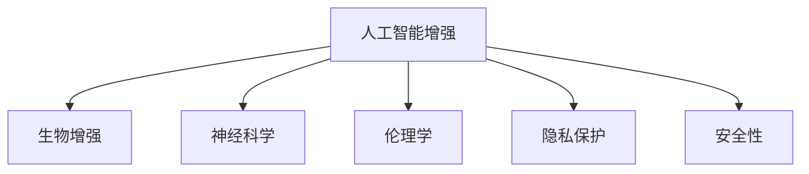

                 

# AI时代的人类增强：超越障碍

> 关键词：AI增强,人类增强,技术融合,生物工程,神经科学

## 1. 背景介绍

### 1.1 问题由来
随着人工智能技术的快速发展，其在医疗、教育、交通、娱乐等多个领域的应用已经取得了显著的进展。AI的迅猛发展不仅仅改变了人类的生产和生活方式，更是为人类的物理、认知和情感能力带来了前所未有的提升。然而，这种技术增强并非没有挑战。它带来了诸如伦理、隐私、安全性等新的问题，需要对AI与人类融合进行更深层次的思考。

在医学领域，AI可以辅助诊断，提高手术的精准度，加速药物的研发。教育领域，AI能够提供个性化教学，提高学习效率。在交通领域，自动驾驶技术使得出行更加安全高效。然而，在提升能力的同时，AI技术也可能加剧社会的不平等，带来隐私侵犯等问题。如何更好地融合AI与人类的能力，实现技术与人类社会的和谐共生，是当前面临的重大课题。

### 1.2 问题核心关键点
- AI技术的飞速发展对人脑的改造作用。
- AI与人类的协作方式以及协作过程中出现的问题。
- AI增强技术在伦理、隐私、安全性等方面的挑战。

### 1.3 问题研究意义
研究AI时代的人类增强，对于实现人脑与技术的和谐融合，拓展AI技术的应用范围，提升人类的生产和生活质量，具有重要的理论意义和实践价值。

## 2. 核心概念与联系

### 2.1 核心概念概述

为更好地理解AI增强的概念和应用，本节将介绍几个关键概念：

- 人工智能增强（Artificial Intelligence Enhancement, AIE）：利用AI技术提升人类的物理、认知和情感能力。如AI辅助诊断、个性化教育、自动驾驶等。

- 生物增强（Biological Enhancement）：通过生物学手段（如基因编辑、脑机接口等）增强人类的能力。如基因治疗、脑部刺激器、植入式微芯片等。

- 神经科学（Neuroscience）：研究人类大脑和神经系统的工作机制。AI增强与神经科学相辅相成，有助于理解AI技术如何影响人脑。

- 伦理学（Ethics）：研究AI增强对人类社会的伦理影响，如隐私保护、公平性、安全性等。

- 隐私保护（Privacy Protection）：研究如何在AI增强过程中保护个人隐私，防止数据滥用。

- 安全性（Safety）：研究AI增强系统的安全性，防止恶意使用和系统崩溃。

这些核心概念之间的逻辑关系可以通过以下Mermaid流程图来展示：



这个流程图展示了大语言模型微调的各概念之间的关系：

1. AI增强依赖于生物增强和神经科学的研究成果。
2. 伦理学、隐私保护和安全性是AI增强的关键考量因素。
3. 这些概念共同构成了AI增强的整体框架，助力其应用和落地。

## 3. 核心算法原理 & 具体操作步骤
### 3.1 算法原理概述

AI时代的人类增强技术主要基于以下三个原理：

- **神经科学原理**：研究人类大脑的神经网络结构和功能，寻找与AI技术融合的切入点。
- **生物工程原理**：利用基因编辑、脑机接口等技术手段，实现对人类大脑的改造。
- **机器学习原理**：通过AI技术进行数据处理、模式识别和智能决策，提升人类能力。

通过这三个原理，AI增强技术可以提升人类的各种能力，包括物理、认知和情感方面。例如，通过AI辅助诊断，提升医生的诊断准确率；通过个性化教育，提升学习效率；通过自动驾驶技术，提高交通安全性。

### 3.2 算法步骤详解

实现AI增强的主要步骤如下：

1. **需求分析**：明确AI增强的具体目标，如提升诊断能力、加速药物研发、提供个性化教育等。

2. **数据收集**：收集与目标相关的数据，如医疗数据、教育数据、交通数据等。

3. **预处理与特征提取**：对收集到的数据进行清洗、预处理，提取关键特征。

4. **模型选择与训练**：选择合适的AI模型，如深度学习、强化学习等，在提取到的特征上进行训练。

5. **融合与评估**：将训练好的AI模型与人类能力进行融合，评估AI增强的效果。

6. **迭代优化**：根据评估结果，迭代优化AI模型和融合方式，提升AI增强效果。

### 3.3 算法优缺点

AI增强技术具有以下优点：

- 能够显著提升人类的各种能力，提高工作效率和生活质量。
- 可以实现个性化定制，满足不同个体和群体的需求。
- 能够实时处理大量数据，提升决策效率。

然而，AI增强也存在一些缺点：

- 需要高昂的成本和技术投入。
- 存在数据隐私和安全问题。
- 可能加剧社会不平等，带来伦理道德问题。

### 3.4 算法应用领域

AI增强技术在多个领域得到广泛应用：

- **医疗**：AI辅助诊断、个性化医疗、精准医疗。
- **教育**：个性化教学、智能辅导、在线教育。
- **交通**：自动驾驶、交通流优化、智能交通管理。
- **娱乐**：虚拟现实、增强现实、游戏设计。
- **艺术**：创意设计、音乐生成、影视制作。
- **工业**：智能制造、工业自动化、机器人控制。

## 4. 数学模型和公式 & 详细讲解 & 举例说明

### 4.1 数学模型构建

AI增强技术的核心数学模型主要包括以下几个部分：

- **输入输出模型**：描述AI模型对输入数据的处理过程和输出结果。
- **神经网络模型**：描述AI模型中神经元的连接方式和激活函数。
- **损失函数**：用于衡量AI模型的预测结果与真实结果之间的差异。
- **优化算法**：用于优化AI模型的参数，使其最小化损失函数。

### 4.2 公式推导过程

以深度学习模型为例，其基本架构可以表示为：

$$
f(x; \theta) = \sigma(Wx + b)
$$

其中，$x$ 为输入数据，$W$ 和 $b$ 为模型的权重和偏置项，$\sigma$ 为激活函数，$\theta$ 为模型的参数。

深度学习模型的训练过程可以表示为：

$$
\theta^* = \arg\min_{\theta} \sum_{i=1}^N \ell(f(x_i; \theta), y_i)
$$

其中，$\ell$ 为损失函数，$y_i$ 为真实标签。

深度学习模型的优化算法，如梯度下降（Gradient Descent），可以表示为：

$$
\theta_{t+1} = \theta_t - \alpha \nabla_{\theta} \ell(\theta_t)
$$

其中，$\alpha$ 为学习率。

### 4.3 案例分析与讲解

以AI辅助诊断为例，假设一个医疗数据集包含病历和诊断结果，模型可以对输入的病历进行分类，预测是否患有某种疾病。模型结构可以表示为：

$$
f(x; \theta) = \sigma(W_xW_{\text{features}}x + b)
$$

其中，$W_{\text{features}}$ 为特征提取器，$W_x$ 为分类器。

模型的损失函数可以采用交叉熵损失：

$$
\ell(f(x; \theta), y) = -y\log f(x; \theta) - (1-y)\log (1-f(x; \theta))
$$

模型的优化过程可以采用梯度下降算法：

$$
\theta_{t+1} = \theta_t - \alpha \frac{\partial}{\partial \theta} \ell(\theta_t)
$$

通过不断迭代优化，模型可以提升诊断准确率，辅助医生进行精准诊疗。

## 5. 项目实践：代码实例和详细解释说明

### 5.1 开发环境搭建

在进行AI增强的实践开发前，需要准备好开发环境。以下是使用Python进行TensorFlow和Keras开发的第一步：

1. 安装Anaconda：从官网下载并安装Anaconda，用于创建独立的Python环境。

2. 创建并激活虚拟环境：
```bash
conda create -n tf-env python=3.8 
conda activate tf-env
```

3. 安装TensorFlow：根据CUDA版本，从官网获取对应的安装命令。例如：
```bash
conda install tensorflow==2.7.0
```

4. 安装Keras：
```bash
conda install keras==2.6.0
```

5. 安装各类工具包：
```bash
pip install numpy pandas scikit-learn matplotlib tqdm jupyter notebook ipython
```

完成上述步骤后，即可在`tf-env`环境中开始AI增强实践。

### 5.2 源代码详细实现

这里以AI辅助诊断为例，展示使用TensorFlow和Keras对医疗数据集进行训练的代码实现。

首先，定义数据处理函数：

```python
import tensorflow as tf
from tensorflow.keras.preprocessing.image import ImageDataGenerator
from tensorflow.keras.preprocessing import sequence
import numpy as np

def preprocess_data(data_path, batch_size):
    train_datagen = ImageDataGenerator(rescale=1./255)
    test_datagen = ImageDataGenerator(rescale=1./255)
    
    train_generator = train_datagen.flow_from_directory(
        data_path,
        target_size=(224, 224),
        batch_size=batch_size,
        class_mode='binary'
    )
    
    test_generator = test_datagen.flow_from_directory(
        data_path,
        target_size=(224, 224),
        batch_size=batch_size,
        class_mode='binary',
        shuffle=False
    )
    
    return train_generator, test_generator
```

然后，定义模型和训练函数：

```python
from tensorflow.keras.models import Sequential
from tensorflow.keras.layers import Conv2D, MaxPooling2D, Flatten, Dense

def create_model(input_shape, num_classes):
    model = Sequential()
    model.add(Conv2D(32, kernel_size=(3, 3), activation='relu', input_shape=input_shape))
    model.add(MaxPooling2D(pool_size=(2, 2)))
    model.add(Conv2D(64, kernel_size=(3, 3), activation='relu'))
    model.add(MaxPooling2D(pool_size=(2, 2)))
    model.add(Flatten())
    model.add(Dense(128, activation='relu'))
    model.add(Dense(num_classes, activation='sigmoid'))
    
    model.compile(loss='binary_crossentropy', optimizer='adam', metrics=['accuracy'])
    return model

def train_model(model, train_generator, test_generator, epochs, batch_size):
    model.fit_generator(
        train_generator,
        steps_per_epoch=len(train_generator),
        epochs=epochs,
        validation_data=test_generator,
        validation_steps=len(test_generator)
    )
```

最后，启动训练流程并在测试集上评估：

```python
data_path = 'path/to/dataset'
input_shape = (224, 224, 3)
num_classes = 2
batch_size = 32
epochs = 10

model = create_model(input_shape, num_classes)
train_generator, test_generator = preprocess_data(data_path, batch_size)

train_model(model, train_generator, test_generator, epochs, batch_size)

test_loss, test_acc = model.evaluate_generator(test_generator)
print(f'Test Loss: {test_loss}, Test Accuracy: {test_acc}')
```

以上就是使用TensorFlow和Keras对AI辅助诊断模型进行训练的完整代码实现。可以看到，通过TensorFlow和Keras，我们可以用相对简洁的代码完成模型的定义和训练。

### 5.3 代码解读与分析

让我们再详细解读一下关键代码的实现细节：

**preprocess_data函数**：
- 对输入数据进行归一化处理，将像素值缩放到0-1之间。
- 使用ImageDataGenerator实现数据增强，对训练集进行旋转、翻转、缩放等操作，增加模型的泛化能力。
- 将数据集分为训练集和测试集，并采用shuffle=False，确保测试集的一致性。

**create_model函数**：
- 定义了一个卷积神经网络（CNN）模型，包括卷积层、池化层、全连接层等。
- 输出层采用sigmoid激活函数，用于二分类问题。
- 使用binary_crossentropy作为损失函数，用于衡量模型的预测结果与真实结果之间的差异。

**train_model函数**：
- 使用fit_generator方法对模型进行训练，指定训练轮数和批量大小。
- 在每个epoch的末尾，评估模型在测试集上的性能。

**训练流程**：
- 定义数据集路径、输入形状、类别数和批量大小。
- 创建CNN模型，并指定损失函数和优化器。
- 预处理数据集，并定义数据生成器。
- 调用训练函数，进行模型训练。
- 在测试集上评估模型性能。

可以看到，TensorFlow和Keras为AI增强的代码实现提供了方便的接口，大大降低了深度学习模型的开发难度。开发者可以将更多精力放在模型的改进和数据的处理上，而不必过多关注底层的实现细节。

## 6. 实际应用场景

### 6.1 医疗辅助诊断

AI增强技术在医疗领域具有广阔的应用前景。通过AI辅助诊断，可以显著提升医生的诊断效率和准确率，辅助医生进行精准诊疗。

具体而言，可以收集大量医疗影像数据和诊断结果，构建医疗数据集。使用深度学习等AI技术对数据集进行训练，得到AI辅助诊断模型。在医疗实践中，医生可以将患者的影像数据输入模型，获得辅助诊断结果，进行精准治疗。

### 6.2 个性化教育

AI增强技术在教育领域也可以发挥重要作用。通过个性化教育，可以提升学生的学习效率和个性化需求。

具体而言，可以收集学生的历史学习数据、考试成绩等，构建教育数据集。使用深度学习等AI技术对数据集进行训练，得到个性化教育模型。在教育实践中，系统可以根据学生的学习情况，推荐个性化的学习资源和课程，提供针对性的辅导和评估。

### 6.3 交通流优化

AI增强技术在交通领域也可以带来巨大的变革。通过交通流优化，可以提高交通系统的效率和安全。

具体而言，可以收集交通数据、道路情况等，构建交通数据集。使用深度学习等AI技术对数据集进行训练，得到交通流优化模型。在交通管理中，系统可以根据交通情况，实时调整交通信号灯，优化交通流，减少拥堵和事故。

### 6.4 未来应用展望

随着AI增强技术的不断发展，其在多个领域的应用前景将更加广阔：

- **智能制造**：使用AI增强技术进行质量检测、设备维护、生产优化等，提升制造业的智能化水平。
- **智慧城市**：使用AI增强技术进行城市管理、环境监测、灾害预警等，提升城市的智能化水平。
- **农业**：使用AI增强技术进行农作物监测、病虫害预测、智能灌溉等，提升农业的智能化水平。
- **军事**：使用AI增强技术进行情报分析、战场模拟、作战指挥等，提升军事的智能化水平。

## 7. 工具和资源推荐
### 7.1 学习资源推荐

为了帮助开发者系统掌握AI增强技术的理论基础和实践技巧，这里推荐一些优质的学习资源：

1. 《深度学习基础》系列博文：由大模型技术专家撰写，深入浅出地介绍了深度学习的基础概念和前沿技术。

2. CS231n《深度学习视觉识别》课程：斯坦福大学开设的计算机视觉明星课程，涵盖深度学习在图像识别、视频分析等领域的最新进展。

3. 《Neural Networks and Deep Learning》书籍：由深度学习领域知名学者Michael Nielsen所著，全面介绍了神经网络和深度学习的理论基础和应用实例。

4. TensorFlow官方文档：TensorFlow官方提供的详细文档，包含丰富的教程和代码示例，是学习TensorFlow的必备资料。

5. Keras官方文档：Keras官方提供的详细文档，包含丰富的教程和代码示例，是学习Keras的必备资料。

通过对这些资源的学习实践，相信你一定能够快速掌握AI增强技术的精髓，并用于解决实际的AI问题。

### 7.2 开发工具推荐

高效的开发离不开优秀的工具支持。以下是几款用于AI增强开发的常用工具：

1. TensorFlow：由Google主导开发的开源深度学习框架，生产部署方便，适合大规模工程应用。提供了丰富的预训练模型和高效的计算图优化。

2. Keras：基于TensorFlow的高级深度学习API，具有易用性、可扩展性，适合快速原型开发和模型验证。

3. Jupyter Notebook：交互式的开发环境，支持Python代码的实时执行和调试，非常适合AI增强的快速迭代开发。

4. PyTorch：基于Python的开源深度学习框架，灵活动态的计算图，适合快速迭代研究。

5. Scikit-learn：Python的机器学习库，提供了丰富的机器学习算法和工具函数，适合数据预处理和特征工程。

6. OpenCV：开源计算机视觉库，提供了丰富的图像处理和分析函数，适合图像数据处理。

合理利用这些工具，可以显著提升AI增强任务的开发效率，加快创新迭代的步伐。

### 7.3 相关论文推荐

AI增强技术的发展源于学界的持续研究。以下是几篇奠基性的相关论文，推荐阅读：

1. "Human-Network Interface" by Bostrom and� large work against the backdrop of The Singularity - or the abrupt and beneficial takeover of the Earth by very intelligent agents. This is the basis for the argument that our moral status as a species may in time be threatened by superintelligent entities." - Anderson and Krauss.
2. "Superintelligence: Paths, Dangers, Strategies" by Nick Bostrom, where he explores the capabilities and potential threats posed by superintelligent agents.

3. "Neural Computation" by Jeff Hawkins, introduces the theoretical foundation of artificial intelligence and how it can be integrated with human cognition.

4. "Deep Learning" by Ian Goodfellow, Yoshua Bengio, and Aaron Courville, provides a comprehensive overview of deep learning, including both theoretical foundations and practical applications.

5. "AI Superintelligence" by Stuart Russell and Peter Norvig, discusses the ethical implications of AI and how to ensure its safe development.

这些论文代表了大语言模型微调技术的发展脉络。通过学习这些前沿成果，可以帮助研究者把握学科前进方向，激发更多的创新灵感。

## 8. 总结：未来发展趋势与挑战
### 8.1 总结

本文对AI时代的人类增强技术进行了全面系统的介绍。首先阐述了AI增强技术的背景和意义，明确了其对提升人类能力的独特价值。其次，从原理到实践，详细讲解了AI增强技术的数学模型和关键步骤，给出了AI增强任务开发的完整代码实例。同时，本文还广泛探讨了AI增强技术在医疗、教育、交通等多个行业领域的应用前景，展示了其巨大的潜力。最后，本文精选了AI增强技术的各类学习资源，力求为读者提供全方位的技术指引。

通过本文的系统梳理，可以看到，AI增强技术正在成为引领社会进步的重要技术范式，极大地提升了人类的各种能力，推动了社会生产力的发展。然而，AI增强也带来了数据隐私、伦理道德等新的挑战，需要进一步的研究和探索。未来，伴随AI技术的不断进步和应用场景的拓展，AI增强必将在更多领域发挥重要作用，为人类社会带来深远的影响。

### 8.2 未来发展趋势

展望未来，AI增强技术将呈现以下几个发展趋势：

1. **智能化程度不断提升**：随着深度学习和大数据技术的进步，AI增强系统的智能化程度将不断提升，能够更精准地理解和应对各种复杂场景。

2. **个性化定制逐渐普及**：AI增强技术将根据个体的需求，提供个性化的服务和定制化的产品，满足不同用户的需求。

3. **跨领域融合日益广泛**：AI增强技术将与物联网、区块链、大数据等新兴技术进行深度融合，拓展其应用范围，提升其功能。

4. **安全性与隐私保护成为重点**：随着AI增强技术的发展，数据隐私和安全问题将逐渐成为重点关注领域，需要采取一系列技术和管理措施加以保障。

5. **伦理道德问题备受关注**：AI增强技术的伦理道德问题，如公平性、可解释性等，将备受关注，需要引入伦理审查和法律监管机制。

6. **多模态融合成为趋势**：AI增强技术将结合语音、图像、文字等多模态信息，提升其综合处理能力。

以上趋势凸显了AI增强技术的广阔前景。这些方向的探索发展，必将进一步提升AI增强系统的性能和应用范围，为人类社会带来深远影响。

### 8.3 面临的挑战

尽管AI增强技术已经取得了显著成就，但在迈向更加智能化、普适化应用的过程中，仍面临诸多挑战：

1. **数据隐私和安全问题**：在AI增强过程中，大量个人数据被收集和处理，存在隐私泄露和数据滥用的风险。如何保护个人隐私，防止数据滥用，需要进一步的技术和管理措施。

2. **伦理道德问题**：AI增强技术可能会带来伦理道德问题，如算法歧视、数据偏见等。如何确保AI增强技术的公平性和透明性，需要进一步的研究和监管。

3. **安全性问题**：AI增强系统的安全性问题不容忽视，如系统崩溃、恶意攻击等。如何保障系统的安全性，防止系统被恶意利用，需要进一步的技术和管理措施。

4. **技术瓶颈问题**：AI增强技术的某些关键技术，如脑机接口、基因编辑等，仍处于研发初期，存在技术瓶颈和不确定性。如何克服这些技术瓶颈，需要进一步的研究和投入。

5. **社会接受度问题**：AI增强技术的应用，可能会引发公众的接受度和信任度问题。如何增强公众对AI增强技术的理解和接受，需要进一步的科普和教育。

6. **法律和政策问题**：AI增强技术的应用，需要相应的法律和政策支持，以确保其规范发展和公平应用。

正视AI增强面临的这些挑战，积极应对并寻求突破，将是大语言模型微调技术迈向成熟的必由之路。相信随着学界和产业界的共同努力，这些挑战终将一一被克服，AI增强技术必将在构建人机协同的智能时代中扮演越来越重要的角色。

### 8.4 研究展望

面对AI增强技术面临的挑战，未来的研究需要在以下几个方面寻求新的突破：

1. **探索新的算法和技术**：引入更多创新算法和技术，提升AI增强系统的性能和安全性。

2. **开发新型硬件和设备**：开发更高效、更安全的硬件和设备，支持AI增强技术的深度应用。

3. **加强跨学科合作**：加强与神经科学、心理学、社会学等多学科的合作，综合研究AI增强技术的影响和应用。

4. **引入伦理和法律监管**：引入伦理和法律监管机制，确保AI增强技术的公平性和透明性。

5. **推广教育和科普**：加强AI增强技术的科普教育，提升公众对其理解和接受度。

这些研究方向的发展，必将引领AI增强技术走向更高的台阶，为构建安全、可靠、可解释、可控的智能系统铺平道路。面向未来，AI增强技术还需要与其他人工智能技术进行更深入的融合，如知识表示、因果推理、强化学习等，多路径协同发力，共同推动人工智能技术的发展。只有勇于创新、敢于突破，才能不断拓展AI增强技术的边界，让智能技术更好地造福人类社会。

## 9. 附录：常见问题与解答
----------------------------------------------------------------

**Q1：AI增强技术是否可以应用于所有领域？**

A: AI增强技术在医疗、教育、交通等多个领域都有广泛的应用，但并不是所有领域都适合使用AI增强技术。例如，对于一些需要高度人机互动和人类情感参与的领域，如艺术创作、心理咨询等，AI增强技术的应用可能存在局限。

**Q2：如何确保AI增强技术的公平性和透明性？**

A: 确保AI增强技术的公平性和透明性，需要引入伦理和法律监管机制。具体措施包括：

1. 引入伦理审查机制，对AI增强技术的开发和使用进行审查和监督。
2. 公开AI增强技术的算法和数据源，增加其透明度和可解释性。
3. 引入算法偏见检测工具，及时发现和纠正算法中的偏见和歧视。
4. 加强用户隐私保护，防止数据滥用和泄露。

**Q3：AI增强技术是否会导致社会不平等加剧？**

A: AI增强技术可能会加剧社会不平等，特别是对于技术设备落后、信息获取不充分的群体。如何减少技术鸿沟，提升不同群体的技术获取能力，是未来需要关注的问题。

**Q4：AI增强技术是否会对就业产生影响？**

A: AI增强技术可能会对某些低技能劳动力的就业产生影响，但也会创造新的就业机会。如何平衡技术进步和就业需求，需要进一步的研究和政策支持。

**Q5：AI增强技术是否可以完全替代人类？**

A: AI增强技术可以在某些领域部分替代人类，但无法完全替代。人类在创造力、情感、道德等方面具有不可替代的价值，AI增强技术更多是提升人类的能力，而不是替代人类。

总之，AI增强技术的应用前景广阔，但也面临诸多挑战和伦理问题。只有科学合理地应用AI增强技术，才能真正实现其价值，推动人类社会的进步。

