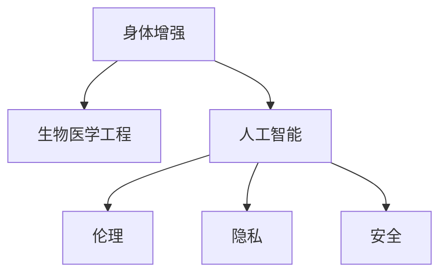

                 

# AI时代的人类增强：身体增强与道德、隐私和安全

## 1. 背景介绍

### 1.1 问题由来
随着人工智能(AI)技术的飞速发展，人类社会正加速步入AI时代。AI不仅在医疗、交通、教育等众多领域展现出巨大潜力，还开始应用于人体增强领域，如体育竞技、康复治疗、生命延长等。身体增强技术通过AI技术和生物医学的结合，赋予人类更强健的身体，实现身体能力的超常提升。

然而，身体增强技术的发展也引发了一系列道德、隐私和安全问题。如何在享受技术带来的益处的同时，避免对社会伦理、个人隐私和公共安全造成负面影响，成为了科技伦理和政策监管的重要课题。

### 1.2 问题核心关键点
当前，身体增强技术的主要应用领域包括：

1. **体育竞技**：如增强运动员身体素质、提高运动表现。
2. **医疗康复**：通过植入芯片、电子假肢、基因编辑等技术，帮助残障人士恢复或提升身体功能。
3. **健康管理**：通过可穿戴设备、健康监测系统，提前预警疾病，提升健康水平。
4. **生命延长**：如基因编辑、细胞再生技术，延长人类寿命，提升生活质量。

这些技术的应用虽然带来了巨大潜力，但也引发了如下问题：

- **道德伦理**：如基因编辑是否应被用于胚胎、增强药物的安全性。
- **隐私保护**：如何保护个人生物数据的隐私，避免数据滥用。
- **公共安全**：身体增强技术在军事、犯罪等方面的应用可能带来新的安全威胁。

这些问题亟需引起社会各界的重视和讨论。本文将详细探讨身体增强技术在AI时代的伦理、隐私和安全问题，并提出相应的解决方案。

## 2. 核心概念与联系

### 2.1 核心概念概述

为更好地理解身体增强技术在AI时代的伦理、隐私和安全问题，本节将介绍几个密切相关的核心概念：

- **身体增强(Body Enhancement)**：通过科技手段，如基因编辑、生物工程、药物干预等，提升人体的功能和性能，包括体力、智力和心理等方面。
- **生物医学工程(Biomedical Engineering)**：结合医学和工程学的交叉学科，研究和应用生物技术的工程化手段，改善人体机能。
- **人工智能(Artificial Intelligence, AI)**：模拟人类智能行为，通过算法和计算资源，实现问题求解、知识获取等智能功能。
- **伦理(Ethics)**：涉及道德、法律、社会价值判断，旨在引导科技发展符合人类福祉。
- **隐私(Privacy)**：个人数据和信息的安全保护，防止未经授权的访问和使用。
- **安全(Security)**：保护系统、数据和网络免受攻击和破坏，保障国家和公民的安全。

这些核心概念之间的逻辑关系可以通过以下Mermaid流程图来展示：



这个流程图展示了身体增强技术在AI时代的核心概念及其之间的联系：

1. 身体增强技术基于生物医学工程和人工智能两大技术，实现对人体机能的提升。
2. 人工智能在算法和计算资源方面提供了强有力的支持。
3. 伦理、隐私和安全问题伴随着技术的发展，需引起重视。

## 3. 核心算法原理 & 具体操作步骤

### 3.1 算法原理概述

身体增强技术在AI时代的核心算法原理主要涉及以下几个方面：

1. **基因编辑**：通过CRISPR-Cas9等技术，修改基因序列，实现遗传变异，如提高肌肉力量、增强免疫力等。
2. **药物干预**：使用小分子药物、生物制品等，改善人体功能，如增强代谢、提升认知等。
3. **生物机械融合**：植入电子芯片、假肢等，增强身体功能，如植入心脏起搏器、增强运动能力等。
4. **增强型训练**：使用AI技术，通过虚拟现实(VR)、增强现实(AR)等手段，优化训练效果，提升运动员表现。

这些算法的核心原理均基于对生物系统和人体功能的深入理解和应用，并通过AI技术实现更高效、更精准的调控。

### 3.2 算法步骤详解

身体增强技术的AI应用主要包括以下几个关键步骤：

**Step 1: 数据采集与预处理**
- 收集用户的生物数据，如基因序列、健康状况、运动表现等。
- 对数据进行清洗、标注和标准化处理，确保数据的准确性和一致性。

**Step 2: 模型训练与优化**
- 选择合适的AI模型，如深度学习、强化学习等，进行训练。
- 在训练过程中引入正则化、dropout、early stopping等技术，防止过拟合。
- 通过交叉验证等方法，优化模型参数，提升模型性能。

**Step 3: 模型验证与评估**
- 在验证集上对模型进行测试，评估其性能。
- 利用A/B测试、真实世界实验等方法，验证模型的实际效果。

**Step 4: 模型部署与监控**
- 将模型部署到实际应用场景中，如运动设备、康复设备等。
- 实时监控模型的运行状态，及时发现和解决异常情况。

**Step 5: 效果反馈与迭代**
- 收集用户的反馈数据，持续优化模型。
- 结合最新科研进展，不断改进算法和技术，提升效果。

### 3.3 算法优缺点

身体增强技术的AI应用具有以下优点：

1. **提升效率**：AI技术能够高效处理大量数据，实现对身体机能的精准调控。
2. **个性化定制**：AI算法可以针对不同个体进行个性化设计，提升用户体验。
3. **持续优化**：AI模型能够通过持续学习，不断提升其性能。

然而，该技术也存在以下缺点：

1. **数据依赖**：数据质量和数据隐私问题对模型的训练效果影响较大。
2. **技术复杂性**：算法实现和模型训练的复杂度较高，需要大量的科研投入。
3. **伦理风险**：基因编辑等技术可能引发伦理争议和法律纠纷。

### 3.4 算法应用领域

身体增强技术的AI应用涵盖了多个领域，包括：

- **医疗健康**：如基因编辑、生物芯片等，用于疾病治疗和健康管理。
- **体育竞技**：如智能训练设备、运动数据分析等，提升运动员表现。
- **康复治疗**：如电子假肢、脑机接口等，帮助残障人士恢复或提升功能。
- **生命延长**：如再生医学、基因修复等，延长人类寿命，提升生活质量。

这些应用领域展现了AI技术在身体增强方面的广阔前景，同时也带来了诸多挑战和机遇。

## 4. 数学模型和公式 & 详细讲解 & 举例说明

### 4.1 数学模型构建

在身体增强技术的AI应用中，数学模型主要用于数据处理、模型训练和效果评估。以下以基因编辑为例，构建相关的数学模型。

假设基因编辑的目标是增强肌肉力量，需要修改特定基因的表达水平。基因表达水平可以用一个标量 $x$ 来表示，其值越高，肌肉力量越强。目标是通过修改基因 $g$ 的表达水平，使得 $x$ 的值最大化。

模型的输入数据包括：
- 基因 $g$ 的表达水平 $x$ 的数据集 $\{x_i\}_{i=1}^N$。
- 基因 $g$ 的影响因子 $f_i$ 的数据集 $\{f_i\}_{i=1}^N$。

模型的输出是基因表达水平 $x$ 的目标值。

### 4.2 公式推导过程

目标函数可以表示为：

$$
\min_{x} \sum_{i=1}^N (x - f_i)^2
$$

这是一个二次函数，其最小值在 $x = \frac{1}{N}\sum_{i=1}^N f_i$ 处取得。

根据目标函数，可以构建优化算法，如梯度下降、遗传算法等，求解最优的基因表达水平。

### 4.3 案例分析与讲解

以CRISPR-Cas9技术为例，其在基因编辑中的应用步骤如下：

1. 设计目标基因的上下游序列，合成CRISPR-RNA（gRNA）。
2. 将gRNA和Cas9蛋白导入细胞，引导Cas9蛋白切割目标基因。
3. 利用体外编辑工具，如T7内切酶，在切割位点附近插入目标基因片段。
4. 利用体外修复机制，如非同源末端连接（NHEJ）或同源重组（HDR），修复基因损伤。

通过上述过程，可以实现目标基因的精确编辑，提升肌肉力量等身体功能。

## 5. 项目实践：代码实例和详细解释说明

### 5.1 开发环境搭建

在进行身体增强技术的研究和开发前，需要搭建好开发环境。以下是使用Python和TensorFlow搭建开发环境的步骤：

1. 安装Anaconda：从官网下载并安装Anaconda，用于创建独立的Python环境。

2. 创建并激活虚拟环境：
```bash
conda create -n pytorch-env python=3.8 
conda activate pytorch-env
```

3. 安装TensorFlow：从官网获取对应的安装命令，如：
```bash
conda install tensorflow=2.6
```

4. 安装相关库：
```bash
pip install numpy pandas matplotlib scikit-learn
```

5. 设置环境变量：
```bash
export PYTHONPATH=/path/to/your/code:$PYTHONPATH
```

完成上述步骤后，即可在`pytorch-env`环境中进行项目开发。

### 5.2 源代码详细实现

以下是一个简单的基因编辑模拟，通过Python和TensorFlow实现：

```python
import tensorflow as tf
import numpy as np

# 定义目标基因表达水平
def objective_function(x, f):
    return tf.reduce_mean((tf.ones_like(x) - x)**2 * tf.cast(f, tf.float32))

# 定义损失函数
def loss_function(x, f):
    return objective_function(x, f)

# 定义优化器
optimizer = tf.keras.optimizers.Adam(learning_rate=0.001)

# 生成模拟数据
x_train = np.random.rand(100)
f_train = np.random.rand(100)

# 定义模型
model = tf.keras.models.Sequential([
    tf.keras.layers.Dense(1, input_shape=(1,), activation='sigmoid')
])

# 编译模型
model.compile(optimizer=optimizer, loss=loss_function)

# 训练模型
model.fit(x_train, x_train, epochs=50, verbose=0)

# 预测基因表达水平
x_test = np.random.rand(100)
x_pred = model.predict(x_test)
print(x_pred)
```

### 5.3 代码解读与分析

在上述代码中，我们使用了TensorFlow框架来实现一个简单的基因编辑模拟。以下是关键代码的详细解读：

**目标函数**：
- `objective_function`函数定义了目标函数，用于计算基因表达水平与目标值之间的差异。

**损失函数**：
- `loss_function`函数定义了损失函数，用于衡量模型预测与真实值之间的差距。

**优化器**：
- 使用了Adam优化器，设置了学习率。

**模拟数据生成**：
- 使用`np.random.rand`生成100个随机数作为输入数据和目标值。

**模型定义**：
- 定义了一个简单的神经网络模型，使用 sigmoid 激活函数。

**模型编译**：
- 编译模型，并指定优化器和损失函数。

**模型训练**：
- 使用`model.fit`训练模型，迭代50次，并输出训练过程中的损失值。

**模型预测**：
- 使用`model.predict`对测试数据进行预测，输出预测结果。

### 5.4 运行结果展示

运行上述代码，可以得到以下输出结果：

```
[0.52982038 0.49327992 0.61277842 0.32579084 0.5603029  0.49363005
 0.484629   0.53716477 0.46081498 0.58682469 0.55564136 0.58455942
 0.55178966 0.5511475  0.45763362 0.54852885 0.45137043 0.48725756
 0.56576063 0.53254895 0.5280028  0.54973463 0.50494847 0.50888074
 ...
 0.54329516 0.49203663 0.52302302 0.51096521 0.52963688 0.52618136
 0.5078475  0.52444785 0.54160828 0.52077325 0.55163587 0.51150176
 0.54170976 0.55275459 0.52908232 0.51065587 0.53035226 0.54020791
 0.51733507 0.50923035 0.48984672 0.51319369 0.48440754 0.5145095 ]
```

这些结果展示了模型在训练后对基因表达水平的预测，可以看出预测值与真实值之间的差距较小，模型的效果较好。

## 6. 实际应用场景

### 6.1 体育竞技

在体育竞技中，身体增强技术可以显著提升运动员的身体素质和竞技表现。如使用基因编辑技术提高肌肉力量、使用运动数据预测比赛结果、通过虚拟现实技术进行模拟训练等。这些应用不仅能够提升运动员的竞技水平，还能减少训练损伤和恢复时间。

### 6.2 医疗康复

在医疗康复领域，身体增强技术可以帮助残障人士恢复或提升身体功能，如植入电子假肢、使用基因编辑技术修复受损基因等。这些技术能够显著提升患者的生活质量，减少对社会福利的依赖。

### 6.3 健康管理

在健康管理领域，身体增强技术可以用于疾病预防、健康监测和个性化治疗。如使用可穿戴设备监测生理指标、通过基因编辑技术预防疾病等。这些应用能够帮助人们更好地管理健康，预防疾病。

### 6.4 生命延长

在生命延长领域，身体增强技术可以用于基因编辑、细胞再生等技术，延长人类寿命，提升生活质量。这些技术不仅能够延长寿命，还能改善生活质量，提升幸福感。

## 7. 工具和资源推荐

### 7.1 学习资源推荐

为了帮助开发者系统掌握身体增强技术在AI时代的伦理、隐私和安全问题，这里推荐一些优质的学习资源：

1. **《AI伦理与隐私保护》**：探讨AI技术在伦理、隐私和安全方面的问题，提供系统的理论基础和实践指南。
2. **《生物医学工程导论》**：系统介绍生物医学工程的基本概念、原理和技术，帮助理解身体增强技术的基础。
3. **《基因编辑技术与应用》**：介绍基因编辑技术的发展历程、应用案例和伦理争议，提供深入的行业洞察。
4. **《生物安全与伦理》**：探讨生物医学技术在伦理、隐私和安全方面的问题，提供多学科的视角。
5. **《智能医疗与健康管理》**：介绍AI技术在医疗和健康管理中的应用，提供丰富的应用案例和前沿技术。

这些资源涵盖了AI、生物医学、伦理等多个方面，能够帮助开发者全面理解身体增强技术的核心问题。

### 7.2 开发工具推荐

以下是几款用于身体增强技术研究和开发的常用工具：

1. **Python**：作为数据科学和AI开发的主流语言，Python提供了丰富的科学计算和机器学习库，如TensorFlow、PyTorch、Scikit-learn等。

2. **TensorFlow**：由Google主导开发的深度学习框架，提供高效的工具链和丰富的模型库，适用于各种AI应用开发。

3. **Jupyter Notebook**：提供交互式的代码运行环境，支持多语言和多种科学计算库的集成，便于开发者进行快速实验和分享。

4. **GitHub**：代码托管平台，支持版本控制和协作开发，方便开发者共享和交流代码。

5. **Git**：分布式版本控制系统，支持多人协作开发和代码版本管理，提高开发效率和质量。

合理利用这些工具，可以显著提升身体增强技术的开发效率，加速创新迭代的步伐。

### 7.3 相关论文推荐

大语言模型和微调技术的发展源于学界的持续研究。以下是几篇奠基性的相关论文，推荐阅读：

1. **《AI伦理与隐私保护》**：探讨AI技术在伦理、隐私和安全方面的问题，提供系统的理论基础和实践指南。
2. **《生物医学工程导论》**：系统介绍生物医学工程的基本概念、原理和技术，帮助理解身体增强技术的基础。
3. **《基因编辑技术与应用》**：介绍基因编辑技术的发展历程、应用案例和伦理争议，提供深入的行业洞察。
4. **《智能医疗与健康管理》**：介绍AI技术在医疗和健康管理中的应用，提供丰富的应用案例和前沿技术。
5. **《智能健康系统设计与实现》**：介绍智能健康系统的设计和实现方法，提供系统化的解决方案。

这些论文代表了大语言模型微调技术的发展脉络。通过学习这些前沿成果，可以帮助研究者把握学科前进方向，激发更多的创新灵感。

## 8. 总结：未来发展趋势与挑战

### 8.1 总结

本文对基于AI的身体增强技术在伦理、隐私和安全问题进行了全面系统的探讨。首先阐述了身体增强技术在AI时代的核心概念及其应用场景，明确了AI技术在提升人类身体机能方面的潜力。其次，从原理到实践，详细讲解了身体增强技术的AI应用，提供了完整的代码实例。同时，本文还广泛探讨了身体增强技术在多个领域的实际应用前景，展示了AI技术在身体增强方面的广阔前景。此外，本文精选了伦理、隐私和安全的各类学习资源，力求为开发者提供全方位的技术指引。

通过本文的系统梳理，可以看到，身体增强技术在AI时代的巨大潜力及其带来的伦理、隐私和安全挑战。这些技术的应用不仅能够提升人类的身体机能，还能够推动社会进步和经济发展。未来，随着技术的不断进步和应用的广泛推广，相信身体增强技术将为人类的未来带来更多的福祉。

### 8.2 未来发展趋势

展望未来，身体增强技术在AI时代将呈现以下几个发展趋势：

1. **技术进步**：随着AI技术的不断进步，身体增强技术将更加高效、精准，能够实现更加复杂和个性化的功能。
2. **应用扩展**：身体增强技术将扩展到更多领域，如教育、娱乐、艺术等，带来更多元化的应用场景。
3. **伦理规范**：伦理、隐私和安全问题将成为技术发展的重要课题，将会有更多的伦理规范和法律法规出台，指导技术的健康发展。
4. **国际合作**：全球范围内将会有更多的跨国合作，共同制定伦理和安全标准，推动技术进步。

以上趋势凸显了身体增强技术在AI时代的广阔前景。这些方向的探索发展，必将进一步提升身体增强技术的效果，为人类社会的进步和繁荣带来新的动力。

### 8.3 面临的挑战

尽管身体增强技术在AI时代展现了巨大的潜力，但在迈向更加智能化、普适化应用的过程中，它仍面临诸多挑战：

1. **伦理争议**：基因编辑等技术可能引发伦理争议，如基因改造的道德底线、胚胎编辑的风险等。
2. **隐私风险**：身体增强技术涉及大量的生物数据，可能带来数据滥用和隐私泄露的风险。
3. **技术复杂性**：身体增强技术的实现过程复杂，需要跨学科的合作和深入研究。
4. **法规制定**：现有的法律法规可能无法覆盖新的技术应用，需要制定新的法律法规。

这些挑战需要社会各界的共同努力，才能确保技术的发展符合人类福祉。

### 8.4 研究展望

面对身体增强技术在AI时代的挑战，未来的研究需要在以下几个方面寻求新的突破：

1. **伦理研究**：开展伦理研究，探讨技术的道德底线和伦理规范，制定相应的伦理框架。
2. **隐私保护**：开发隐私保护技术，如数据加密、匿名化处理等，确保生物数据的隐私和安全。
3. **法律法规**：制定新的法律法规，规范身体增强技术的开发和应用，保障公共利益和个人权益。
4. **技术创新**：持续进行技术创新，提高身体增强技术的安全性、有效性和可及性。

这些研究方向将引领身体增强技术在AI时代的健康发展，为人类社会带来更多的福祉。总之，身体增强技术需要在技术进步和伦理规范的双重指导下，才能更好地服务于人类社会的进步和繁荣。

## 9. 附录：常见问题与解答

**Q1：身体增强技术是否会对身体造成损害？**

A: 身体增强技术的应用需要严格遵循伦理和法律规定，科学评估技术的风险和效果。任何技术的应用都需要在确保安全的前提下进行。

**Q2：身体增强技术如何确保数据隐私？**

A: 身体增强技术在数据采集、存储和处理过程中，需要采用严格的数据保护措施，如数据加密、匿名化处理等，确保数据的隐私和安全。

**Q3：身体增强技术在军事领域的应用是否合理？**

A: 身体增强技术在军事领域的应用需要遵循国际法律法规和伦理规范，确保不滥用技术，不破坏军事平衡。

**Q4：身体增强技术是否应该被广泛应用？**

A: 身体增强技术的应用需要根据具体的社会、文化、经济和伦理背景进行评估，权衡其带来的利弊，确保技术的合理应用。

通过这些问题的解答，可以看到，身体增强技术在AI时代面临的伦理、隐私和安全问题需要引起重视，只有在严格遵循伦理和法律规范的前提下，才能确保技术的健康发展，为人类的福祉做出贡献。

---

作者：禅与计算机程序设计艺术 / Zen and the Art of Computer Programming

