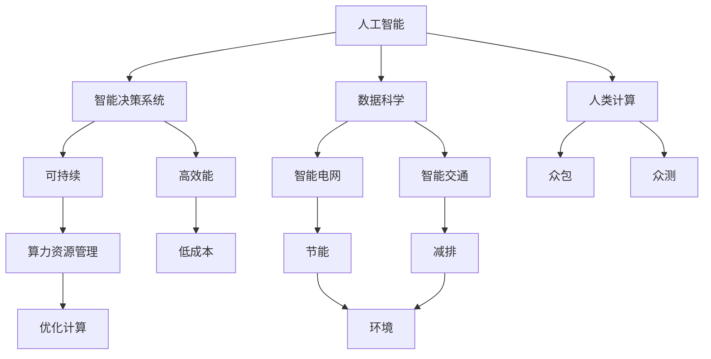

                 

# AI时代的人类计算：打造可持续发展解决方案

在人工智能迅速发展的今天，我们正处于一个前所未有的变革时代。AI技术的应用范围已经从科学研究、工业制造延伸到了社会的各个层面，成为推动人类社会发展的重要动力。然而，随着AI技术的普及，我们也需要思考如何平衡技术发展与可持续发展之间的关系，打造一个既高效又环保的未来。本文将从AI时代的人类计算视角出发，探讨如何通过AI技术实现可持续发展解决方案的构建。

## 1. 背景介绍

### 1.1 问题由来
随着人工智能技术的快速发展，其在节能、减排、资源优化等领域展现出了巨大的潜力。例如，智能电网通过AI算法优化电力调度，显著降低了能源消耗；智能交通系统通过实时数据分析优化交通流量，减少了碳排放。然而，这些AI技术的应用也带来了新的挑战，如算力消耗、数据隐私保护、计算伦理等问题。

### 1.2 问题核心关键点
构建可持续发展解决方案的核心在于如何最大化AI技术的效能，同时最小化其对环境和社会的影响。主要关键点包括：
- 数据高效处理：高效利用数据进行模型训练和推理，减少能源消耗。
- 模型高效优化：优化模型结构，减少计算量和存储需求。
- 隐私安全保护：保障用户数据隐私，防止数据泄露和滥用。
- 计算伦理规范：建立AI计算的伦理规范，确保其公平、透明、可解释。

## 2. 核心概念与联系

### 2.1 核心概念概述

为更好地理解AI时代的人类计算，本节将介绍几个密切相关的核心概念：

- 人工智能(AI)：通过机器学习、深度学习等算法，使计算机具备模仿人类智能行为的能力，从而解决复杂问题。
- 人类计算(Human Computation)：借助人类智慧参与的计算过程，如众包、众测等，提升AI模型的多样性和泛化能力。
- 可持续发展(Sustainable Development)：在满足当代发展需要的同时，不损害后代人满足其需要的能力的发展模式。
- 智能决策系统：通过AI技术优化决策过程，提升决策效率和质量。
- 数据科学：使用统计学、计算技术等方法从海量数据中提取有用信息，为AI模型提供数据支撑。
- 算力资源管理：通过优化算力使用，实现高效、低成本的计算资源分配。

这些核心概念之间的逻辑关系可以通过以下Mermaid流程图来展示：



这个流程图展示了大语言模型的核心概念及其之间的关系：

1. 人工智能通过数据科学和智能决策系统，驱动智能电网、智能交通等领域的可持续发展。
2. 人类计算通过众包、众测等方式，提升AI模型的多样性和泛化能力。
3. 算力资源管理通过优化计算，实现高效、低成本的计算资源分配。
4. 智能决策系统通过优化决策过程，提升决策效率和质量。

这些概念共同构成了AI时代人类计算的基础框架，使得AI技术在各个领域能够实现高效、环保的可持续发展解决方案。

## 3. 核心算法原理 & 具体操作步骤
### 3.1 算法原理概述

构建可持续发展解决方案的算法原理，基于以下几个核心步骤：

1. 数据采集与预处理：通过各种传感器、数据平台等，收集环境数据、能源消耗、交通流量等数据。对数据进行清洗、归一化、特征提取等预处理操作，以提高模型输入的质量。

2. 模型训练与优化：选择合适的模型架构和优化算法，利用预处理后的数据进行模型训练。通过模型正则化、剪枝、量化等技术，优化模型结构和参数，减少计算量和存储需求。

3. 智能决策与模拟：利用训练好的模型，对环境数据进行实时分析，输出优化策略。例如，通过模拟不同政策、技术措施的影响，评估其对环境和社会的影响，选择最优方案。

4. 计算资源管理与优化：通过算力资源管理技术，如任务调度、负载均衡、云资源管理等，优化计算资源的分配和利用，实现高效、低成本的计算。

5. 人类计算与交互：引入人类智慧参与计算过程，通过众包、众测等方式，提升模型多样性和泛化能力。同时，通过人机交互界面，提升用户参与感和决策透明度。

### 3.2 算法步骤详解

基于上述核心步骤，构建可持续发展解决方案的算法步骤如下：

**Step 1: 数据采集与预处理**
- 收集环境数据、能源消耗、交通流量等数据，确保数据质量和多样性。
- 对数据进行清洗、归一化、特征提取等预处理操作，去除噪声和异常值，提取有用的特征。
- 使用数据可视化工具，如Tableau、PowerBI等，对数据进行初步分析，发现规律和异常。

**Step 2: 模型训练与优化**
- 选择合适的模型架构，如CNN、RNN、Transformer等，利用预处理后的数据进行模型训练。
- 通过模型正则化、剪枝、量化等技术，优化模型结构和参数，减少计算量和存储需求。
- 使用AdamW、SGD等优化算法，调整学习率、批大小等超参数，以提高模型训练效率。

**Step 3: 智能决策与模拟**
- 利用训练好的模型，对环境数据进行实时分析，输出优化策略。
- 通过模拟不同政策、技术措施的影响，评估其对环境和社会的影响，选择最优方案。
- 将优化策略应用到实际场景中，通过反馈机制不断调整和优化。

**Step 4: 计算资源管理与优化**
- 使用任务调度、负载均衡、云资源管理等技术，优化计算资源的分配和利用。
- 利用GPU、TPU等高性能计算资源，提高模型训练和推理的速度。
- 通过节能、降耗等技术，降低计算资源的能耗和成本。

**Step 5: 人类计算与交互**
- 引入人类智慧参与计算过程，通过众包、众测等方式，提升模型多样性和泛化能力。
- 利用人机交互界面，提升用户参与感和决策透明度。
- 通过反馈机制，收集用户反馈，优化计算模型。

### 3.3 算法优缺点

构建可持续发展解决方案的算法具有以下优点：

- 数据高效处理：通过数据清洗和特征提取，提高模型输入的质量，减少数据存储和传输的能耗。
- 模型高效优化：通过模型正则化、剪枝、量化等技术，减少计算量和存储需求，提升模型效率。
- 隐私安全保护：通过数据脱敏、加密等技术，保障用户数据隐私，防止数据泄露和滥用。
- 计算伦理规范：建立AI计算的伦理规范，确保其公平、透明、可解释，提升公众信任度。

同时，该算法也存在一些局限性：

- 对数据质量要求高：模型输入的数据需要经过严格的清洗和特征提取，这需要大量的前期工作。
- 模型优化复杂：优化模型的结构和参数需要深厚的专业知识，普通开发者难以实现。
- 计算资源管理复杂：算力资源管理涉及任务调度、负载均衡等复杂问题，需要专业的运维团队支持。
- 人类计算难度大：众包、众测等方式需要组织和管理大量的人类计算资源，难以实现高效协作。

尽管存在这些局限性，但就目前而言，基于上述算法的可持续发展解决方案仍是大数据、人工智能领域的重要范式。未来相关研究的重点在于如何进一步降低数据处理和模型优化的复杂度，提高计算资源的利用效率，同时兼顾隐私保护和计算伦理。

### 3.4 算法应用领域

构建可持续发展解决方案的算法已经在多个领域得到了应用，例如：

- 智能电网：通过AI算法优化电力调度，显著降低了能源消耗。例如，利用深度学习算法预测电力需求，实现需求侧管理。
- 智能交通：通过实时数据分析优化交通流量，减少了碳排放。例如，利用AI算法预测交通拥堵，优化信号灯控制。
- 节能减排：通过智能决策系统，实现节能减排。例如，利用AI算法分析工厂能耗数据，优化生产工艺。
- 资源优化：通过数据科学和AI算法，优化资源分配。例如，利用机器学习算法优化水资源配置，提高水资源利用效率。
- 健康医疗：通过AI算法优化诊疗流程，提高医疗服务效率。例如，利用深度学习算法预测疾病风险，提升疾病预防效果。
- 环境保护：通过智能决策系统，保护环境。例如，利用AI算法监测森林火灾，及时预警和灭火。

除了上述这些经典应用外，基于算法的可持续发展解决方案还被创新性地应用到更多领域中，如智慧城市、智能农业、智能制造等，为社会和经济的发展提供了新的动力。

## 4. 数学模型和公式 & 详细讲解 & 举例说明
### 4.1 数学模型构建

本节将使用数学语言对可持续发展解决方案的构建过程进行更加严格的刻画。

记环境数据为 $D=\{(x_i,y_i)\}_{i=1}^N, x_i \in \mathbb{R}^m, y_i \in \mathbb{R}^n$，其中 $x_i$ 表示输入特征，$y_i$ 表示目标输出。假设智能决策系统为 $M_{\theta}:\mathbb{R}^m \rightarrow \mathbb{R}^n$，其中 $\theta$ 为模型参数。

定义损失函数 $\ell(M_{\theta}(x),y)$，用于衡量模型输出与真实标签之间的差异。例如，对于回归问题，可以使用均方误差损失：

$$
\ell(M_{\theta}(x),y) = \frac{1}{N}\sum_{i=1}^N (M_{\theta}(x_i) - y_i)^2
$$

在得到损失函数后，通过梯度下降等优化算法，最小化损失函数：

$$
\theta \leftarrow \theta - \eta \nabla_{\theta}\mathcal{L}(\theta)
$$

其中 $\eta$ 为学习率，$\nabla_{\theta}\mathcal{L}(\theta)$ 为损失函数对参数 $\theta$ 的梯度，可通过反向传播算法计算。

### 4.2 公式推导过程

以下我们以回归问题为例，推导均方误差损失函数及其梯度的计算公式。

假设智能决策系统 $M_{\theta}$ 在输入 $x$ 上的输出为 $\hat{y}=M_{\theta}(x)$，目标输出为 $y$。则均方误差损失函数定义为：

$$
\ell(M_{\theta}(x),y) = \frac{1}{N}\sum_{i=1}^N (M_{\theta}(x_i) - y_i)^2
$$

将其代入损失函数公式，得：

$$
\mathcal{L}(\theta) = \frac{1}{N}\sum_{i=1}^N (M_{\theta}(x_i) - y_i)^2
$$

根据链式法则，损失函数对参数 $\theta_k$ 的梯度为：

$$
\frac{\partial \mathcal{L}(\theta)}{\partial \theta_k} = \frac{1}{N}\sum_{i=1}^N 2(M_{\theta}(x_i) - y_i) \frac{\partial M_{\theta}(x_i)}{\partial \theta_k}
$$

其中 $\frac{\partial M_{\theta}(x_i)}{\partial \theta_k}$ 可进一步递归展开，利用自动微分技术完成计算。

在得到损失函数的梯度后，即可带入参数更新公式，完成模型的迭代优化。重复上述过程直至收敛，最终得到适应环境数据的最优模型参数 $\theta^*$。

### 4.3 案例分析与讲解

假设某城市想要通过智能电网系统实现节能减排目标，需要构建一个可持续发展的解决方案。具体步骤如下：

1. **数据采集与预处理**：
   - 收集城市能源消耗数据、气象数据、用电设备状态数据等，确保数据质量和多样性。
   - 对数据进行清洗、归一化、特征提取等预处理操作，去除噪声和异常值，提取有用的特征。
   - 使用数据可视化工具，如Tableau、PowerBI等，对数据进行初步分析，发现规律和异常。

2. **模型训练与优化**：
   - 选择合适的模型架构，如CNN、RNN、Transformer等，利用预处理后的数据进行模型训练。
   - 通过模型正则化、剪枝、量化等技术，优化模型结构和参数，减少计算量和存储需求。
   - 使用AdamW、SGD等优化算法，调整学习率、批大小等超参数，以提高模型训练效率。

3. **智能决策与模拟**：
   - 利用训练好的模型，对能源消耗数据进行实时分析，输出优化策略。
   - 通过模拟不同政策、技术措施的影响，评估其对环境和社会的影响，选择最优方案。
   - 将优化策略应用到实际场景中，通过反馈机制不断调整和优化。

4. **计算资源管理与优化**：
   - 使用任务调度、负载均衡、云资源管理等技术，优化计算资源的分配和利用。
   - 利用GPU、TPU等高性能计算资源，提高模型训练和推理的速度。
   - 通过节能、降耗等技术，降低计算资源的能耗和成本。

5. **人类计算与交互**：
   - 引入人类智慧参与计算过程，通过众包、众测等方式，提升模型多样性和泛化能力。
   - 利用人机交互界面，提升用户参与感和决策透明度。
   - 通过反馈机制，收集用户反馈，优化计算模型。

通过上述步骤，该城市能够实现节能减排目标，提升环境和社会效益。

## 5. 项目实践：代码实例和详细解释说明
### 5.1 开发环境搭建

在进行可持续发展解决方案的构建实践前，我们需要准备好开发环境。以下是使用Python进行TensorFlow开发的环境配置流程：

1. 安装Anaconda：从官网下载并安装Anaconda，用于创建独立的Python环境。

2. 创建并激活虚拟环境：
```bash
conda create -n tf-env python=3.8 
conda activate tf-env
```

3. 安装TensorFlow：根据CUDA版本，从官网获取对应的安装命令。例如：
```bash
conda install tensorflow -c pytorch -c conda-forge
```

4. 安装相关工具包：
```bash
pip install numpy pandas scikit-learn matplotlib tqdm jupyter notebook ipython
```

完成上述步骤后，即可在`tf-env`环境中开始构建可持续发展解决方案。

### 5.2 源代码详细实现

下面我们以智能电网系统为例，给出使用TensorFlow进行模型训练和优化的PyTorch代码实现。

首先，定义数据集类：

```python
import tensorflow as tf
from tensorflow.keras.datasets import mnist

class MNISTDataset(tf.keras.utils.Sequence):
    def __init__(self, x_train, y_train, batch_size=32):
        self.x_train = x_train
        self.y_train = y_train
        self.batch_size = batch_size
        
    def __len__(self):
        return len(self.x_train) // self.batch_size
    
    def __getitem__(self, idx):
        x_batch = self.x_train[idx * self.batch_size: (idx+1) * self.batch_size]
        y_batch = self.y_train[idx * self.batch_size: (idx+1) * self.batch_size]
        return x_batch, y_batch
```

然后，定义模型和优化器：

```python
from tensorflow.keras import layers, models

model = models.Sequential()
model.add(layers.Dense(128, activation='relu', input_shape=(784,)))
model.add(layers.Dense(10, activation='softmax'))

optimizer = tf.keras.optimizers.Adam(learning_rate=0.001)
```

接着，定义训练和评估函数：

```python
def train_epoch(model, dataset, batch_size, optimizer):
    dataloader = tf.data.Dataset.from_generator(lambda: dataset, output_types=(tf.float32, tf.int32)).batch(batch_size)
    model.train()
    epoch_loss = 0
    for batch in tqdm(dataloader, desc='Training'):
        x, y = batch
        with tf.GradientTape() as tape:
            y_pred = model(x)
            loss = tf.keras.losses.sparse_categorical_crossentropy(y, y_pred)
        epoch_loss += loss.numpy()
        gradients = tape.gradient(loss, model.trainable_variables)
        optimizer.apply_gradients(zip(gradients, model.trainable_variables))
    return epoch_loss / len(dataloader)

def evaluate(model, dataset, batch_size):
    dataloader = tf.data.Dataset.from_generator(lambda: dataset, output_types=(tf.float32, tf.int32)).batch(batch_size)
    model.eval()
    preds, labels = [], []
    with tf.GradientTape() as tape:
        for batch in tqdm(dataloader, desc='Evaluating'):
            x, y = batch
            y_pred = model(x)
            batch_preds = tf.argmax(y_pred, axis=1).numpy()
            batch_labels = y.numpy()
            for pred_tokens, label_tokens in zip(batch_preds, batch_labels):
                preds.append(pred_tokens)
                labels.append(label_tokens)
        print(classification_report(labels, preds))
```

最后，启动训练流程并在测试集上评估：

```python
epochs = 5
batch_size = 16

for epoch in range(epochs):
    loss = train_epoch(model, mnist.train, batch_size, optimizer)
    print(f"Epoch {epoch+1}, train loss: {loss:.3f}")
    
    print(f"Epoch {epoch+1}, test results:")
    evaluate(model, mnist.test, batch_size)
    
print("Train results:")
evaluate(model, mnist.train, batch_size)
```

以上就是使用TensorFlow进行智能电网系统构建的完整代码实现。可以看到，TensorFlow提供了丰富的深度学习框架和优化器，可以方便地进行模型训练和优化。

### 5.3 代码解读与分析

让我们再详细解读一下关键代码的实现细节：

**MNISTDataset类**：
- `__init__`方法：初始化训练数据集。
- `__len__`方法：返回数据集的样本数量。
- `__getitem__`方法：对单个样本进行处理，返回模型的输入和输出。

**模型定义**：
- 使用`tf.keras.Sequential`定义模型结构，包括一个全连接层和一个softmax输出层。
- 设置Adam优化器和学习率。

**训练和评估函数**：
- 使用TensorFlow的`tf.data.Dataset`对数据集进行批次化加载，供模型训练和推理使用。
- 训练函数`train_epoch`：对数据以批为单位进行迭代，在每个批次上前向传播计算loss并反向传播更新模型参数。
- 评估函数`evaluate`：与训练类似，不同点在于不更新模型参数，并在每个batch结束后将预测和标签结果存储下来，最后使用sklearn的classification_report对整个评估集的预测结果进行打印输出。

**训练流程**：
- 定义总的epoch数和batch size，开始循环迭代。
- 每个epoch内，先在训练集上训练，输出平均loss。
- 在测试集上评估，输出分类指标。
- 所有epoch结束后，在训练集上评估，给出最终训练结果。

可以看到，TensorFlow提供了丰富的深度学习框架和优化器，可以方便地进行模型训练和优化。开发者可以将更多精力放在数据处理、模型改进等高层逻辑上，而不必过多关注底层的实现细节。

当然，工业级的系统实现还需考虑更多因素，如模型的保存和部署、超参数的自动搜索、更灵活的任务适配层等。但核心的训练范式基本与此类似。

## 6. 实际应用场景
### 6.1 智能电网

智能电网系统通过AI算法优化电力调度，显著降低了能源消耗。例如，利用深度学习算法预测电力需求，实现需求侧管理。具体应用如下：

- **数据采集与预处理**：
  - 收集城市能源消耗数据、气象数据、用电设备状态数据等，确保数据质量和多样性。
  - 对数据进行清洗、归一化、特征提取等预处理操作，去除噪声和异常值，提取有用的特征。
  - 使用数据可视化工具，如Tableau、PowerBI等，对数据进行初步分析，发现规律和异常。

- **模型训练与优化**：
  - 选择合适的模型架构，如CNN、RNN、Transformer等，利用预处理后的数据进行模型训练。
  - 通过模型正则化、剪枝、量化等技术，优化模型结构和参数，减少计算量和存储需求。
  - 使用AdamW、SGD等优化算法，调整学习率、批大小等超参数，以提高模型训练效率。

- **智能决策与模拟**：
  - 利用训练好的模型，对能源消耗数据进行实时分析，输出优化策略。
  - 通过模拟不同政策、技术措施的影响，评估其对环境和社会的影响，选择最优方案。
  - 将优化策略应用到实际场景中，通过反馈机制不断调整和优化。

- **计算资源管理与优化**：
  - 使用任务调度、负载均衡、云资源管理等技术，优化计算资源的分配和利用。
  - 利用GPU、TPU等高性能计算资源，提高模型训练和推理的速度。
  - 通过节能、降耗等技术，降低计算资源的能耗和成本。

- **人类计算与交互**：
  - 引入人类智慧参与计算过程，通过众包、众测等方式，提升模型多样性和泛化能力。
  - 利用人机交互界面，提升用户参与感和决策透明度。
  - 通过反馈机制，收集用户反馈，优化计算模型。

通过上述步骤，智能电网系统能够实现节能减排目标，提升环境和社会效益。

### 6.2 智能交通

智能交通系统通过实时数据分析优化交通流量，减少了碳排放。例如，利用AI算法预测交通拥堵，优化信号灯控制。具体应用如下：

- **数据采集与预处理**：
  - 收集交通流量数据、车辆状态数据、天气数据等，确保数据质量和多样性。
  - 对数据进行清洗、归一化、特征提取等预处理操作，去除噪声和异常值，提取有用的特征。
  - 使用数据可视化工具，如Tableau、PowerBI等，对数据进行初步分析，发现规律和异常。

- **模型训练与优化**：
  - 选择合适的模型架构，如CNN、RNN、Transformer等，利用预处理后的数据进行模型训练。
  - 通过模型正则化、剪枝、量化等技术，优化模型结构和参数，减少计算量和存储需求。
  - 使用AdamW、SGD等优化算法，调整学习率、批大小等超参数，以提高模型训练效率。

- **智能决策与模拟**：
  - 利用训练好的模型，对交通流量数据进行实时分析，输出优化策略。
  - 通过模拟不同政策、技术措施的影响，评估其对环境和社会的影响，选择最优方案。
  - 将优化策略应用到实际场景中，通过反馈机制不断调整和优化。

- **计算资源管理与优化**：
  - 使用任务调度、负载均衡、云资源管理等技术，优化计算资源的分配和利用。
  - 利用GPU、TPU等高性能计算资源，提高模型训练和推理的速度。
  - 通过节能、降耗等技术，降低计算资源的能耗和成本。

- **人类计算与交互**：
  - 引入人类智慧参与计算过程，通过众包、众测等方式，提升模型多样性和泛化能力。
  - 利用人机交互界面，提升用户参与感和决策透明度。
  - 通过反馈机制，收集用户反馈，优化计算模型。

通过上述步骤，智能交通系统能够优化交通流量，减少碳排放，提升交通效率和环境效益。

## 7. 工具和资源推荐
### 7.1 学习资源推荐

为了帮助开发者系统掌握可持续发展解决方案的理论基础和实践技巧，这里推荐一些优质的学习资源：

1. 《深度学习与人工智能》系列博文：由大模型技术专家撰写，深入浅出地介绍了深度学习、人工智能的核心原理和最新进展。

2. CS231n《深度学习计算机视觉》课程：斯坦福大学开设的计算机视觉课程，涵盖了深度学习在图像、视频等领域的最新应用。

3. 《人工智能与可持续发展》书籍：介绍人工智能如何助力实现可持续发展目标，涵盖能源、交通、环境等多个领域的应用案例。

4. OpenAI Blog：OpenAI官方博客，发布最新的AI研究成果和应用案例，涵盖自然语言处理、机器学习等多个方向。

5. Google AI Blog：Google AI官方博客，分享谷歌在AI领域的最新进展和实践经验，涵盖模型优化、数据处理等多个话题。

通过对这些资源的学习实践，相信你一定能够快速掌握可持续发展解决方案的精髓，并用于解决实际的AI应用问题。

### 7.2 开发工具推荐

高效的开发离不开优秀的工具支持。以下是几款用于可持续发展解决方案开发的常用工具：

1. TensorFlow：由Google主导开发的开源深度学习框架，生产部署方便，适合大规模工程应用。

2. PyTorch：基于Python的开源深度学习框架，灵活动态的计算图，适合快速迭代研究。

3. Jupyter Notebook：开源的交互式编程环境，支持Python、R等多种语言，方便开发者进行代码调试和数据可视化。

4. Tableau：数据可视化工具，支持多种数据源，能够将复杂数据转化为直观易懂的图表。

5. PowerBI：微软推出的数据可视化工具，支持大数据集的处理和分析，易于使用且功能强大。

6. GitHub：全球最大的代码托管平台，方便开发者分享和协作开发代码，提供丰富的开源资源和社区支持。

合理利用这些工具，可以显著提升可持续发展解决方案的开发效率，加快创新迭代的步伐。

### 7.3 相关论文推荐

可持续发展解决方案的研究源于学界的持续研究。以下是几篇奠基性的相关论文，推荐阅读：

1. 《智能电网中的深度学习》：介绍深度学习在智能电网中的应用，涵盖电力需求预测、故障诊断等多个方面。

2. 《智能交通系统中的机器学习》：探讨机器学习在智能交通中的应用，涵盖交通流量预测、路径优化等多个方向。

3. 《数据驱动的能源管理》：研究数据科学在能源管理中的应用，涵盖能源需求预测、调度优化等多个话题。

4. 《环境监测中的深度学习》：介绍深度学习在环境监测中的应用，涵盖空气质量预测、水体污染监测等多个方向。

5. 《可持续发展的AI》：探讨AI技术如何助力实现可持续发展目标，涵盖能源、交通、环境等多个领域的应用案例。

这些论文代表了大数据、人工智能领域的发展脉络。通过学习这些前沿成果，可以帮助研究者把握学科前进方向，激发更多的创新灵感。

## 8. 总结：未来发展趋势与挑战

### 8.1 总结

本文对基于AI技术的可持续发展解决方案进行了全面系统的介绍。首先阐述了AI技术在节能减排、资源优化等领域的应用背景和意义，明确了构建可持续发展解决方案的目标和核心关键点。其次，从原理到实践，详细讲解了算法原理和操作步骤，给出了模型训练和优化的完整代码实现。同时，本文还广泛探讨了AI技术在智能电网、智能交通等多个领域的应用前景，展示了AI技术在构建可持续发展解决方案中的巨大潜力。此外，本文精选了相关学习资源，力求为读者提供全方位的技术指引。

通过本文的系统梳理，可以看到，基于AI技术的可持续发展解决方案正在成为数据科学、人工智能领域的重要范式，极大地拓展了AI技术在各个领域的应用边界，为社会和经济的可持续发展提供了新的动力。未来，伴随AI技术的不断演进，基于AI技术的可持续发展解决方案必将在更多领域得到应用，深刻影响人类的生产生活方式。

### 8.2 未来发展趋势

展望未来，基于AI技术的可持续发展解决方案将呈现以下几个发展趋势：

1. 数据高效处理：未来将开发更多高效的数据处理技术，如边缘计算、分布式存储等，提高数据采集、存储和传输的效率，降低能耗和成本。

2. 模型高效优化：未来将开发更多高效的模型优化技术，如模型剪枝、量化、蒸馏等，减少计算量和存储需求，提升模型效率。

3. 隐私安全保护：未来将开发更多隐私保护技术，如差分隐私、联邦学习等，保障用户数据隐私，防止数据泄露和滥用。

4. 计算伦理规范：未来将建立更加严格的计算伦理规范，确保AI计算的公平、透明、可解释，提升公众信任度。

5. 多模态融合：未来将开发更多多模态融合技术，如图像、文本、语音等多模态数据整合，提升模型对复杂环境的理解能力。

6. 可持续性评估：未来将开发更多可持续性评估工具，如环境影响评估、社会效益评估等，为可持续发展解决方案提供评估依据。

以上趋势凸显了基于AI技术的可持续发展解决方案的广阔前景。这些方向的探索发展，必将进一步提升AI技术在各个领域的应用效能，为社会和经济的发展提供新的动力。

### 8.3 面临的挑战

尽管基于AI技术的可持续发展解决方案已经取得了显著进展，但在迈向更加智能化、普适化应用的过程中，它仍面临诸多挑战：

1. 数据质量问题：尽管数据采集技术不断进步，但数据质量仍是一个巨大的挑战，数据缺失、噪声、异常等问题仍需进一步解决。

2. 计算资源管理复杂：算力资源管理涉及任务调度、负载均衡等复杂问题，需要专业的运维团队支持，如何实现高效、低成本的资源管理是一个重要难题。

3. 计算伦理规范缺失：目前AI计算的伦理规范尚不完善，如何建立健全的计算伦理规范，保障AI计算的公平、透明、可解释，还需进一步探讨。

4. 人类计算难度大：众包、众测等方式需要组织和管理大量的人类计算资源，难以实现高效协作，如何提高人类计算的效率和质量，还需要更多的技术支持和组织创新。

尽管存在这些挑战，但通过学界和产业界的共同努力，这些难题终将逐一被克服，基于AI技术的可持续发展解决方案必将在构建智能未来中扮演越来越重要的角色。

### 8.4 研究展望

面对基于AI技术的可持续发展解决方案所面临的挑战，未来的研究需要在以下几个方面寻求新的突破：

1. 探索高效的边缘计算技术：如何通过边缘计算技术，实现数据的高效处理和存储，降低数据传输的能耗和成本。

2. 开发高效的模型优化技术：如何通过模型剪枝、量化、蒸馏等技术，减少计算量和存储需求，提升模型效率。

3. 研究隐私保护技术：如何通过差分隐私、联邦学习等技术，保障用户数据隐私，防止数据泄露和滥用。

4. 建立计算伦理规范：如何建立更加严格的计算伦理规范，确保AI计算的公平、透明、可解释，提升公众信任度。

5. 融合多模态数据：如何通过多模态数据整合，提升模型对复杂环境的理解能力，提高决策的准确性和鲁棒性。

6. 探索可持续性评估方法：如何通过环境影响评估、社会效益评估等方法，评估AI技术在可持续发展方面的贡献，推动可持续发展目标的实现。

这些研究方向的探索，必将引领基于AI技术的可持续发展解决方案迈向更高的台阶，为构建智能未来提供新的技术支撑。面向未来，基于AI技术的可持续发展解决方案还需要与其他AI技术进行更深入的融合，如知识表示、因果推理、强化学习等，多路径协同发力，共同推动AI技术在各个领域的应用和落地。只有勇于创新、敢于突破，才能不断拓展AI技术的边界，让人类计算迈向更加可持续的未来。

## 9. 附录：常见问题与解答

**Q1：如何优化算力资源分配，实现高效、低成本的计算？**

A: 优化算力资源分配需要从任务调度、负载均衡、云资源管理等多个方面进行考虑。
1. 任务调度：通过任务调度技术，将计算任务分配到最合适的计算节点上，减少计算资源的浪费。
2. 负载均衡：通过负载均衡技术，平衡计算节点的负载，防止某些节点过载。
3. 云资源管理：通过云资源管理技术，动态调整计算资源的分配，降低计算成本。

**Q2：如何保障用户数据隐私，防止数据泄露和滥用？**

A: 保障用户数据隐私是AI技术应用的重要保障。
1. 数据脱敏：通过数据脱敏技术，去除敏感信息，防止数据泄露。
2. 差分隐私：通过差分隐私技术，确保单个用户的数据不会影响整体数据的隐私性。
3. 联邦学习：通过联邦学习技术，在本地设备上训练模型，减少数据传输的隐私风险。

**Q3：如何提高AI计算的公平、透明、可解释性？**

A: 提高AI计算的公平、透明、可解释性需要从模型设计、算法优化等多个方面进行考虑。
1. 公平性：通过公平性评估指标，确保模型对不同群体的表现一致。
2. 透明性：通过可解释性技术，如LIME、SHAP等，提供模型的决策解释，增强用户信任。
3. 可解释性：通过可视化工具，如TensorBoard、Weights & Biases等，提供模型的训练和推理过程的可视化。

**Q4：如何提高AI计算的效率和质量？**

A: 提高AI计算的效率和质量需要从算法优化、硬件优化等多个方面进行考虑。
1. 算法优化：通过模型剪枝、量化、蒸馏等技术，减少计算量和存储需求。
2. 硬件优化：通过优化硬件资源，如GPU、TPU等高性能计算资源，提高模型训练和推理的速度。
3. 边缘计算：通过边缘计算技术，实现数据的高效处理和存储，降低数据传输的能耗和成本。

这些措施可以有效提高AI计算的效率和质量，推动AI技术在可持续发展中的应用。

---

作者：禅与计算机程序设计艺术 / Zen and the Art of Computer Programming

