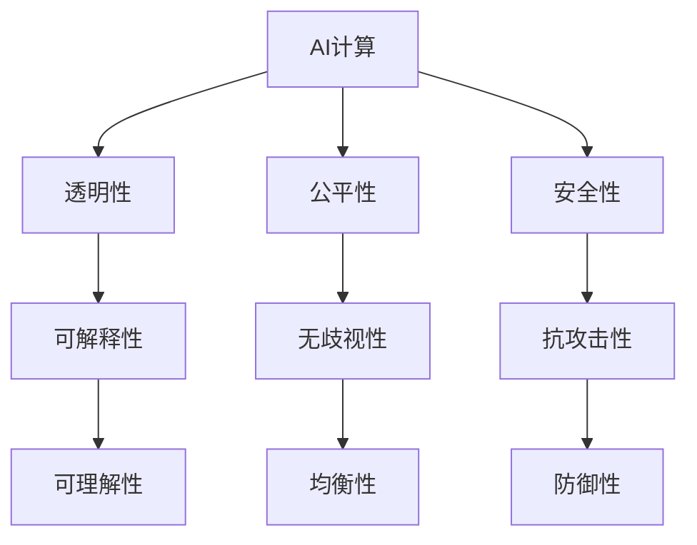

                 

# AI时代的人类计算：社会影响和责任

## 1. 背景介绍

### 1.1 问题由来
在人工智能迅速发展的时代，人类计算的领域迎来了革命性的变化。AI技术已经在各个行业得到了广泛应用，包括但不限于医疗、教育、金融、交通等领域。AI技术的渗透使得计算的效率和能力得到了前所未有的提升，但是，与此同时，也引发了一系列社会影响和伦理问题。这些问题不仅仅是技术层面上的挑战，更涉及到了社会结构、法律道德、人机关系等多方面的因素。

### 1.2 问题核心关键点
AI时代人类计算的核心问题在于：如何在提升计算效率和能力的同时，保证计算过程的透明性、公平性和安全性，以及避免对人类社会的负面影响。这些问题涉及到技术层面和伦理道德层面，需要通过跨学科的研究和讨论，才能找到合理的解决方案。

### 1.3 问题研究意义
研究AI时代的人类计算，不仅对于推动技术发展具有重要意义，更是对于构建一个公平、透明、安全的社会具有深远影响。通过深入理解计算技术的应用和社会影响，我们可以更好地指导技术的未来发展方向，确保技术的健康成长。

## 2. 核心概念与联系

### 2.1 核心概念概述

在探讨AI时代人类计算的社会影响和责任时，我们首先要明确几个关键概念：

- **AI计算**：指通过人工智能技术实现的计算过程，包括但不限于机器学习、深度学习、自然语言处理等。
- **透明性**：指计算过程的可解释性和可追溯性，即用户和相关方能够理解计算背后的逻辑和依据。
- **公平性**：指计算结果和过程对于不同群体、不同个体的公正性，避免算法偏见和歧视。
- **安全性**：指计算系统不受外部攻击和内部漏洞的影响，保障数据和计算结果的安全。

这些核心概念之间存在着紧密的联系，共同构成了AI时代人类计算的社会影响和责任研究框架。透明性、公平性和安全性是衡量计算系统的重要指标，而AI计算则是实现这些指标的基础和手段。

### 2.2 核心概念原理和架构的 Mermaid 流程图



这个流程图展示了AI计算、透明性、公平性和安全性之间的关系及其相互依赖性。透明性和安全性是计算结果可信赖的基础，公平性则是对计算结果公正性的要求。可解释性和无歧视性是透明性的重要组成部分，抗攻击性和防御性则是安全性的关键。

## 3. 核心算法原理 & 具体操作步骤

### 3.1 算法原理概述

AI时代人类计算的核心算法原理主要包括：

- **机器学习与深度学习**：通过大数据和复杂模型，实现对数据的有效分析与处理。
- **自然语言处理**：使计算机能够理解和生成自然语言，提高人机交互的效率和质量。
- **强化学习**：通过与环境的互动，训练出具有自我学习能力的智能体，实现更高效、更智能的决策。

这些算法原理构成了AI时代人类计算的基础，通过不断优化算法，提升计算的效率和能力，同时也在提升透明性、公平性和安全性方面发挥着重要作用。

### 3.2 算法步骤详解

AI时代人类计算的具体操作步骤包括以下几个关键步骤：

**Step 1: 数据收集与预处理**
- 收集和清洗数据，确保数据质量。
- 对数据进行特征提取，准备用于机器学习和深度学习的模型训练。

**Step 2: 模型训练与优化**
- 选择合适的模型架构和算法，进行模型训练。
- 应用交叉验证、正则化等技术，优化模型性能。

**Step 3: 透明性保障**
- 采用可解释的模型，如决策树、规则引擎等，提高模型的透明性。
- 记录和分析模型训练过程中的关键参数和决策，确保计算过程的可追溯性。

**Step 4: 公平性评估与调整**
- 应用公平性评估工具，检测模型中的偏见和歧视。
- 通过调整模型参数、引入公平性约束等手段，提升模型的公平性。

**Step 5: 安全性加固**
- 应用安全评估工具，检测模型中的漏洞和风险。
- 通过数据加密、访问控制等手段，提升模型的安全性。

**Step 6: 应用部署与监控**
- 将模型部署到实际应用场景中，实现数据的处理和分析。
- 实时监控模型性能，及时发现和修复问题。

### 3.3 算法优缺点

AI时代人类计算的算法具有以下优点：

- **高效性**：通过算法优化，极大地提升了数据处理和分析的效率。
- **智能化**：通过机器学习和深度学习等技术，实现复杂的任务处理和智能决策。

但同时也存在一些缺点：

- **可解释性不足**：复杂的模型往往难以解释其内部决策过程，增加了透明性的难度。
- **潜在的偏见和歧视**：算法偏见可能导致不公平的决策结果。
- **安全性问题**：模型可能受到攻击，导致数据泄露和安全漏洞。

### 3.4 算法应用领域

AI时代人类计算的应用领域非常广泛，涵盖了医疗、教育、金融、交通、制造等多个行业。具体应用包括：

- **医疗**：通过AI技术辅助诊断，提高疾病检测的准确性和效率。
- **教育**：通过智能推荐系统，个性化地为学生提供学习资源和辅导。
- **金融**：通过AI技术进行风险评估和欺诈检测，提升金融安全。
- **交通**：通过智能交通管理系统，提高交通效率和安全性。
- **制造**：通过AI技术优化生产流程，提高生产效率和产品质量。

## 4. 数学模型和公式 & 详细讲解 & 举例说明

### 4.1 数学模型构建

AI时代人类计算的数学模型通常基于以下几种形式：

- **监督学习**：通过标注数据进行模型训练，实现分类、回归等任务。
- **无监督学习**：通过对未标注数据进行模式发现和聚类，实现数据探索和特征提取。
- **强化学习**：通过与环境的互动，训练智能体，实现决策和学习。

### 4.2 公式推导过程

以监督学习中的线性回归为例，其数学模型可以表示为：

$$
y = wx + b
$$

其中，$w$ 和 $b$ 是模型的参数，$x$ 是输入变量，$y$ 是输出变量。通过最小化损失函数，如均方误差损失，可以求得模型的最优参数。

### 4.3 案例分析与讲解

假设我们有一组数据集，其中包含房屋的面积和价格：

| 面积 (平方米) | 价格 (美元) |
|------------|-----------|
| 100        | 200,000   |
| 200        | 400,000   |
| 300        | 600,000   |

通过线性回归模型，我们可以预测新房屋的价格。设模型参数为 $w=20,000$，$b=100,000$，则预测结果为：

| 面积 (平方米) | 预测价格 (美元) |
|------------|-----------|
| 150        | 300,000   |

该案例展示了监督学习的简单应用，通过模型训练，实现对新数据的预测。

## 5. 项目实践：代码实例和详细解释说明

### 5.1 开发环境搭建

在进行AI计算项目实践前，我们需要准备好开发环境。以下是使用Python进行Scikit-learn开发的简单环境配置流程：

1. 安装Anaconda：从官网下载并安装Anaconda，用于创建独立的Python环境。

2. 创建并激活虚拟环境：
```bash
conda create -n pytorch-env python=3.8 
conda activate pytorch-env
```

3. 安装Scikit-learn：
```bash
pip install scikit-learn
```

4. 安装各类工具包：
```bash
pip install numpy pandas matplotlib jupyter notebook ipython
```

完成上述步骤后，即可在`pytorch-env`环境中开始AI计算项目实践。

### 5.2 源代码详细实现

这里我们以线性回归为例，给出Scikit-learn库实现的基本代码实现。

首先，定义数据集：

```python
import numpy as np
from sklearn.linear_model import LinearRegression

# 定义输入和输出数据
X = np.array([[100], [200], [300]])
y = np.array([200000, 400000, 600000])

# 创建线性回归模型
model = LinearRegression()
```

然后，进行模型训练：

```python
# 训练模型
model.fit(X, y)
```

最后，进行模型预测：

```python
# 预测新数据
new_X = np.array([[150]])
predicted_y = model.predict(new_X)
print(predicted_y)
```

### 5.3 代码解读与分析

让我们再详细解读一下关键代码的实现细节：

**线性回归模型**：
- 通过`from sklearn.linear_model import LinearRegression`引入线性回归模型。
- 在模型创建时，不需要指定参数，Scikit-learn会自动选择最优的模型结构。

**模型训练**：
- 使用`model.fit(X, y)`进行模型训练，自动求取最优参数。

**模型预测**：
- 使用`model.predict(new_X)`进行新数据的预测。

## 6. 实际应用场景

### 6.1 医疗行业

在医疗行业中，AI技术被广泛应用于疾病诊断、基因分析、药物研发等领域。例如，通过图像识别技术，可以对医疗影像进行自动诊断，提高诊断准确性；通过自然语言处理技术，可以对医疗文本进行自动化处理，提升医疗数据的管理和分析效率。

### 6.2 教育行业

在教育行业中，AI技术被应用于智能推荐系统、学习分析、智能辅导等领域。例如，通过智能推荐系统，可以为学生推荐个性化的学习资源和课程；通过学习分析，可以实时监控学生的学习情况，提供个性化的辅导建议。

### 6.3 金融行业

在金融行业中，AI技术被广泛应用于风险评估、欺诈检测、智能投顾等领域。例如，通过机器学习模型，可以对金融交易进行实时监控和风险评估，提升金融安全；通过自然语言处理技术，可以对金融文本进行自动化处理，提升金融信息的管理和分析效率。

### 6.4 未来应用展望

随着AI技术的不断进步，未来AI时代人类计算将在更多领域得到应用，为各行各业带来变革性影响。例如：

- **智慧城市**：通过AI技术，可以实现城市管理智能化，提高城市运行效率。
- **自动驾驶**：通过AI技术，可以实现自动驾驶车辆，提升交通安全和效率。
- **智能家居**：通过AI技术，可以实现智能家居设备，提升生活质量和便利性。
- **个性化推荐**：通过AI技术，可以为用户提供个性化的推荐服务，提升用户体验。

## 7. 工具和资源推荐

### 7.1 学习资源推荐

为了帮助开发者系统掌握AI时代人类计算的理论基础和实践技巧，这里推荐一些优质的学习资源：

1. 《机器学习》（周志华）：全面介绍了机器学习的基本原理和常用算法。
2. 《深度学习》（Ian Goodfellow）：深入浅出地介绍了深度学习的基本原理和应用。
3. 《自然语言处理综论》（Daniel Jurafsky、James H. Martin）：系统介绍了自然语言处理的基本原理和技术。
4. CS229《机器学习》课程：斯坦福大学开设的机器学习明星课程，有Lecture视频和配套作业。
5. 《Python深度学习》（Francois Chollet）：介绍了深度学习在Python中的实现。

通过对这些资源的学习实践，相信你一定能够快速掌握AI时代人类计算的精髓，并用于解决实际的AI问题。

### 7.2 开发工具推荐

高效的开发离不开优秀的工具支持。以下是几款用于AI计算开发的常用工具：

1. Python：基于Python的Scikit-learn、TensorFlow、PyTorch等库，提供了强大的机器学习和深度学习支持。
2. R语言：适用于统计分析和数据可视化，适合数据分析和模型评估。
3. Jupyter Notebook：支持Python、R等多种语言，便于进行交互式开发和共享。
4. H2O：提供了丰富的机器学习算法和自动化的模型训练过程，适合大规模数据处理。

合理利用这些工具，可以显著提升AI计算的开发效率，加快创新迭代的步伐。

### 7.3 相关论文推荐

AI时代人类计算的发展源于学界的持续研究。以下是几篇奠基性的相关论文，推荐阅读：

1. "Deep Learning"（Ian Goodfellow、Yoshua Bengio、Aaron Courville）：全面介绍了深度学习的基本原理和应用。
2. "A Theory of Generalization for Deep Learning"（Yann LeCun、Yoshua Bengio、Geoffrey Hinton）：讨论了深度学习的泛化能力和模型设计。
3. "Human-in-the-loop Machine Learning"（Erich Elion、Federico Errica）：探讨了人机协同机器学习的设计和实现。
4. "Fairness, Accountability, and Transparency: AI and Ethics in the Age of Automated Decision-Making"（Alix Bredin）：讨论了AI在决策中的应用和公平性问题。
5. "Privacy-Preserving Machine Learning"（Martina Vandaele、Michiel Van den Bosch、Stefano Cerutti）：探讨了机器学习中的隐私保护问题。

这些论文代表了大语言模型微调技术的发展脉络。通过学习这些前沿成果，可以帮助研究者把握学科前进方向，激发更多的创新灵感。

## 8. 总结：未来发展趋势与挑战

### 8.1 总结

本文对AI时代人类计算的社会影响和责任进行了全面系统的介绍。首先阐述了AI计算的背景和意义，明确了透明性、公平性和安全性在AI计算中的重要性。其次，从原理到实践，详细讲解了AI计算的算法原理和操作步骤，给出了AI计算项目开发的完整代码实例。同时，本文还广泛探讨了AI计算在医疗、教育、金融等多个行业领域的应用前景，展示了AI计算范式的巨大潜力。此外，本文精选了AI计算的各类学习资源，力求为读者提供全方位的技术指引。

通过本文的系统梳理，可以看到，AI时代人类计算正在成为各行各业的重要技术手段，极大地提升了计算的效率和能力。未来，伴随AI技术的不断演进，AI计算必将在更广阔的应用领域大放异彩，深刻影响人类的生产生活方式。

### 8.2 未来发展趋势

展望未来，AI时代人类计算将呈现以下几个发展趋势：

1. **计算效率提升**：通过算法优化和硬件升级，AI计算的效率将持续提升，能够处理更大规模、更复杂的数据集。
2. **模型自动化设计**：通过自动化模型设计和优化工具，降低AI计算的开发难度和周期。
3. **跨领域应用扩展**：AI计算将扩展到更多领域，实现更加多样化的应用。
4. **人机协同增强**：通过人机协同技术，提升AI计算的可解释性和公平性。
5. **安全性提升**：通过安全评估和防护技术，保障AI计算系统的安全性。

以上趋势凸显了AI时代人类计算的广阔前景。这些方向的探索发展，必将进一步提升AI计算的效果和应用范围，为人类社会的可持续发展提供新的动力。

### 8.3 面临的挑战

尽管AI时代人类计算已经取得了瞩目成就，但在迈向更加智能化、普适化应用的过程中，它仍面临着诸多挑战：

1. **数据隐私问题**：如何在保障数据隐私的前提下，进行有效的数据处理和分析，是一个重要挑战。
2. **公平性和歧视**：AI计算系统可能存在偏见和歧视，导致不公平的决策结果，需要通过公平性评估和调整来缓解。
3. **安全性威胁**：AI计算系统可能受到攻击，导致数据泄露和系统故障，需要加强安全防护。
4. **计算资源消耗**：大规模数据处理和复杂模型训练需要大量计算资源，如何优化资源使用，是一个重要挑战。
5. **人机协同的复杂性**：人机协同技术虽然提升了AI系统的性能，但也带来了复杂性管理的问题。

### 8.4 研究展望

面对AI时代人类计算所面临的挑战，未来的研究需要在以下几个方面寻求新的突破：

1. **隐私保护技术**：研究数据隐私保护技术，如差分隐私、联邦学习等，保障数据安全。
2. **公平性算法**：研究公平性算法，如公平性约束、无偏回归等，提升模型的公平性。
3. **安全评估和防护**：研究安全评估工具和防护技术，如入侵检测、对抗训练等，提升系统的安全性。
4. **高效资源管理**：研究高效的资源管理技术，如分布式计算、异构计算等，优化资源使用。
5. **人机协同模型**：研究人机协同模型，提升系统的可解释性和用户体验。

这些研究方向的探索，必将引领AI时代人类计算技术迈向更高的台阶，为构建安全、可靠、可解释、可控的智能系统铺平道路。面向未来，AI时代人类计算需要与其他人工智能技术进行更深入的融合，如知识表示、因果推理、强化学习等，多路径协同发力，共同推动自然语言理解和智能交互系统的进步。只有勇于创新、敢于突破，才能不断拓展AI计算的边界，让智能技术更好地造福人类社会。

## 9. 附录：常见问题与解答

**Q1：AI计算在医疗领域有哪些具体应用？**

A: AI计算在医疗领域的应用非常广泛，具体包括：
- **医学影像分析**：通过图像识别技术，对医疗影像进行自动诊断，如X光片、CT、MRI等影像的自动分析。
- **基因分析**：通过深度学习技术，对基因序列进行分析和预测，如基因变异、基因表达等。
- **药物研发**：通过机器学习技术，对药物分子进行筛选和优化，加速新药的开发进程。

**Q2：AI计算在教育领域有哪些具体应用？**

A: AI计算在教育领域的应用同样非常广泛，具体包括：
- **智能推荐系统**：通过机器学习技术，为学生推荐个性化的学习资源和课程。
- **学习分析**：通过数据分析技术，实时监控学生的学习情况，提供个性化的辅导建议。
- **智能辅导**：通过自然语言处理技术，提供智能辅导系统，回答学生的问题。

**Q3：AI计算在金融领域有哪些具体应用？**

A: AI计算在金融领域的应用也非常广泛，具体包括：
- **风险评估**：通过机器学习技术，对金融交易进行实时监控和风险评估。
- **欺诈检测**：通过异常检测技术，发现和防范金融欺诈行为。
- **智能投顾**：通过自然语言处理技术，提供智能投资建议。

**Q4：AI计算在交通领域有哪些具体应用？**

A: AI计算在交通领域的应用同样非常广泛，具体包括：
- **自动驾驶**：通过图像识别和决策技术，实现自动驾驶车辆。
- **智能交通管理**：通过数据分析技术，优化交通流量，提高交通效率。
- **车联网**：通过物联网技术，实现车辆与基础设施的互联互通。

这些应用展示了AI计算在各个行业中的广泛应用，通过不断优化算法和提升计算能力，AI计算将在更多领域带来变革性影响。

