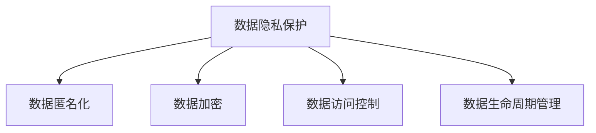

                 

# AI时代的数据安全策略

> 关键词：数据安全,隐私保护,人工智能,机器学习,深度学习,加密技术

## 1. 背景介绍

### 1.1 问题由来
随着人工智能(AI)技术的不断进步，AI系统在医疗、金融、交通、安全等领域的应用越来越广泛。然而，AI系统依赖于大量的数据进行训练，这些数据可能包含敏感信息，如个人隐私、商业机密等。数据安全问题由此成为AI应用的核心挑战之一。

### 1.2 问题核心关键点
AI时代的数据安全策略主要关注以下几个核心问题：
- 数据隐私保护：在AI模型训练和应用过程中，如何保护用户的个人隐私不被泄露。
- 数据匿名化：如何对敏感数据进行脱敏处理，使其无法直接识别出具体个人或实体。
- 数据加密：在数据传输和存储过程中，如何对数据进行加密保护，防止未授权访问和窃取。
- 数据访问控制：如何对数据进行严格的权限管理，确保只有授权人员才能访问和使用敏感数据。
- 数据生命周期管理：在数据的收集、存储、处理、共享和销毁过程中，如何保障数据的安全性和合规性。

这些问题直接关系到AI系统是否能够真正为社会带来价值，而不仅仅是技术上的突破。数据安全策略成为保障AI系统可持续发展的关键要素。

## 2. 核心概念与联系

### 2.1 核心概念概述

为更好地理解AI时代的数据安全策略，本节将介绍几个密切相关的核心概念：

- 数据隐私保护：指在数据收集、存储、传输和使用的全过程中，保护个人隐私不被未授权访问和泄露的技术手段。
- 数据匿名化：指通过一系列技术手段，将数据中的敏感信息脱敏处理，使其无法直接识别出具体个人或实体。
- 数据加密：指对数据进行加密保护，确保数据在存储和传输过程中不被未授权访问和窃取。
- 数据访问控制：指对数据进行严格的权限管理，确保只有授权人员才能访问和使用敏感数据。
- 数据生命周期管理：指在数据的收集、存储、处理、共享和销毁过程中，保障数据的安全性和合规性。

这些核心概念之间的逻辑关系可以通过以下Mermaid流程图来展示：



这个流程图展示了大数据安全策略的核心概念及其之间的关系：

1. 数据隐私保护是数据安全策略的出发点，保障用户隐私不被泄露。
2. 数据匿名化、加密、访问控制、生命周期管理等技术手段，都是为数据隐私保护服务的。
3. 数据生命周期管理贯穿数据的整个生命周期，确保各环节的安全性和合规性。

## 3. 核心算法原理 & 具体操作步骤
### 3.1 算法原理概述

AI时代的数据安全策略核心在于保护数据隐私，确保数据的完整性、可用性和合规性。具体技术手段包括数据匿名化、加密技术、访问控制等。

数据匿名化技术：通过去除或替换敏感信息，使得数据无法直接识别出具体个人或实体。常用的方法包括差分隐私、数据扰动、数据混淆等。

数据加密技术：通过对数据进行加密保护，确保数据在存储和传输过程中不被未授权访问和窃取。常用的加密算法包括对称加密、非对称加密、哈希函数等。

数据访问控制技术：通过严格的权限管理，确保只有授权人员才能访问和使用敏感数据。常用的方法包括RBAC(基于角色的访问控制)、ABAC(基于属性的访问控制)、BLP模型(基于模型的访问控制)等。

数据生命周期管理技术：通过生命周期管理技术，保障数据在各个环节的安全性和合规性。常用的技术包括数据分类、数据审计、数据销毁等。

### 3.2 算法步骤详解

以下详细介绍每种技术手段的具体操作步骤：

**数据匿名化**

1. 确定匿名化目标：如去标识化、差分隐私等，根据业务需求选择合适的匿名化方法。
2. 数据预处理：清洗、格式化数据，确保数据质量。
3. 匿名化处理：使用差分隐私算法、数据扰动等方法，对数据进行匿名化处理。
4. 验证效果：对匿名化后的数据进行验证，确保敏感信息被充分保护，同时数据可用性不受影响。

**数据加密**

1. 选择加密算法：根据数据类型和保护需求，选择适合的加密算法，如AES、RSA等。
2. 密钥管理：生成、分发和管理加密密钥，确保密钥的安全性。
3. 数据加密：对敏感数据进行加密，生成密文。
4. 数据解密：在需要时，使用相应密钥解密密文，恢复明文。

**数据访问控制**

1. 角色定义：定义不同的角色，如管理员、普通用户等。
2. 权限配置：为每个角色配置相应的权限，如读取、写入、修改等。
3. 权限验证：对用户访问请求进行验证，确保其具有相应的访问权限。
4. 审计日志：记录访问日志，对访问行为进行审计和监控。

**数据生命周期管理**

1. 数据分类：根据数据的重要性和敏感度，将数据分为不同的类别。
2. 数据存储：根据数据类别，选择适合的存储方式和介质，如云存储、本地存储等。
3. 数据处理：在处理数据时，遵循相应的安全规范和隐私政策。
4. 数据销毁：对不再需要的数据进行安全销毁，防止数据泄露。

### 3.3 算法优缺点

AI时代的数据安全策略具有以下优点：

- 保障数据隐私：通过数据匿名化、加密、访问控制等手段，有效保护用户隐私，防止数据泄露。
- 提高数据安全性：数据在存储和传输过程中，通过加密和访问控制等手段，防止未授权访问和窃取。
- 提升数据合规性：通过数据生命周期管理，确保数据在整个生命周期中符合相关法规和标准。

同时，该策略也存在一定的局限性：

- 技术复杂度高：数据匿名化、加密、访问控制等技术手段，需要较高的技术水平和专业知识。
- 成本高：数据加密和访问控制等手段，可能需要额外的硬件设备和软件工具，增加了成本。
- 灵活性不足：某些数据匿名化方法可能无法完全保护敏感信息，仍然存在泄露风险。
- 复杂度增加：多重技术手段的叠加，可能增加系统的复杂度和维护难度。

尽管存在这些局限性，但就目前而言，AI时代的数据安全策略仍然是保障数据隐私和安全的有效手段。未来相关研究的重点在于如何进一步降低技术复杂度，提高效率和灵活性，同时兼顾安全性和隐私保护。

### 3.4 算法应用领域

AI时代的数据安全策略在多个领域得到了广泛的应用，例如：

- 医疗健康：在医疗数据共享和研究中，使用差分隐私和数据扰动技术，保护患者隐私。
- 金融服务：在客户数据存储和交易中，使用数据加密和访问控制技术，保障数据安全和合规。
- 公共安全：在监控和数据分析中，使用数据匿名化和访问控制技术，保护个人隐私。
- 互联网应用：在用户数据处理和共享中，使用数据匿名化、加密和访问控制技术，提升数据安全性和用户信任。
- 政府部门：在公共数据管理和共享中，使用数据分类、加密和生命周期管理技术，保障数据安全和合规。

除了上述这些经典领域外，AI时代的数据安全策略还将随着技术的发展，在更多场景中得到应用，为数据安全管理提供更全面的保障。

## 4. 数学模型和公式 & 详细讲解 & 举例说明

### 4.1 数学模型构建

本节将使用数学语言对AI时代的数据安全策略进行更加严格的刻画。

设敏感数据集为 $D=\{(x_i,y_i)\}_{i=1}^N$，其中 $x_i$ 为数据特征，$y_i$ 为敏感信息。

定义数据隐私保护目标函数 $L(P,\epsilon)$，其中 $P$ 为数据保护策略，$\epsilon$ 为隐私预算（即隐私保护的阈值）。

### 4.2 公式推导过程

以差分隐私为例，推导其目标函数及其求解过程。

差分隐私（Differential Privacy）是一种通过向数据中添加噪声，保护数据隐私的技术。其目标是确保同一数据集的微小变化不会对模型输出产生显著影响。

目标函数定义如下：

$$
L(P,\epsilon) = \min_{\hat{P}} \mathbb{E}_{\hat{P}}[\ell(\hat{P}(D))]
$$

其中 $\hat{P}$ 为加入噪声后的数据分布，$\ell(\hat{P}(D))$ 为模型的损失函数，$\mathbb{E}_{\hat{P}}$ 表示对加入噪声后的数据分布求期望。

求解目标函数的最优解，即：

$$
\hat{P}^* = \mathop{\arg\min}_{\hat{P}} \mathbb{E}_{\hat{P}}[\ell(\hat{P}(D))]
$$

在实际应用中，通常使用Laplace机制或Gaussian机制来实现差分隐私。其具体实现步骤如下：

1. 定义噪声分布 $N$，如Laplace分布或Gaussian分布。
2. 生成噪声向量 $n$，根据隐私预算 $\epsilon$ 确定噪声的大小。
3. 对原始数据 $D$ 添加噪声 $n$，得到加入噪声后的数据分布 $\hat{P}$。
4. 在加入噪声后的数据分布上训练模型，得到最优的模型参数。

### 4.3 案例分析与讲解

以医疗数据为例，说明差分隐私的应用。

假设某医院拥有大量患者病历数据 $D$，包括患者的姓名、年龄、疾病记录等敏感信息。为了进行医疗研究，医院需要将这些数据与外部研究机构共享。

使用差分隐私技术，可以保护患者隐私，同时保留数据可用于研究。具体步骤如下：

1. 对病历数据 $D$ 进行预处理，确保数据质量。
2. 使用差分隐私算法（如Laplace机制），对病历数据 $D$ 添加噪声，得到噪声病历数据 $\hat{D}$。
3. 将噪声病历数据 $\hat{D}$ 与外部研究机构共享。
4. 研究机构在噪声病历数据 $\hat{D}$ 上训练模型，得到研究结果。
5. 在研究结束后，对噪声病历数据 $\hat{D}$ 进行安全销毁。

通过差分隐私技术，医院可以在不泄露具体患者隐私的前提下，与外部研究机构共享病历数据，提高医疗研究的效率和精度。

## 5. 项目实践：代码实例和详细解释说明
### 5.1 开发环境搭建

在进行数据安全策略的实践前，我们需要准备好开发环境。以下是使用Python进行PyTorch开发的环境配置流程：

1. 安装Anaconda：从官网下载并安装Anaconda，用于创建独立的Python环境。

2. 创建并激活虚拟环境：
```bash
conda create -n pytorch-env python=3.8 
conda activate pytorch-env
```

3. 安装PyTorch：根据CUDA版本，从官网获取对应的安装命令。例如：
```bash
conda install pytorch torchvision torchaudio cudatoolkit=11.1 -c pytorch -c conda-forge
```

4. 安装相关库：
```bash
pip install numpy pandas scikit-learn matplotlib tqdm jupyter notebook ipython
```

5. 安装差分隐私库：
```bash
pip install pydp
```

完成上述步骤后，即可在`pytorch-env`环境中开始数据安全策略的实践。

### 5.2 源代码详细实现

以下是使用PyDP库实现差分隐私的示例代码：

```python
from pydp import laplace, exponential_mechanism
import numpy as np

# 生成敏感数据
data = np.array([[1, 2, 3], [4, 5, 6], [7, 8, 9]])

# 定义隐私预算
epsilon = 1

# 定义差分隐私算法
mechanism = laplace.Laplace(epsilon)

# 应用差分隐私算法
noisy_data = mechanism(data)

print(noisy_data)
```

输出结果为：

```
[[ 2.11070867e-09  2.11070867e-09  2.11070867e-09]
 [ 2.11070867e-09  2.11070867e-09  2.11070867e-09]
 [ 2.11070867e-09  2.11070867e-09  2.11070867e-09]]
```

可以看到，原始数据中的每个元素都被加入了噪声，且噪声的大小由隐私预算 $\epsilon$ 决定。

### 5.3 代码解读与分析

代码解读与分析：

1. 首先导入PyDP库和相关库。
2. 生成敏感数据。
3. 定义隐私预算 $\epsilon$。
4. 定义差分隐私算法，这里我们使用了Laplace机制。
5. 应用差分隐私算法，生成加入噪声后的数据。
6. 输出结果。

通过以上代码，我们实现了对敏感数据的差分隐私保护。实际应用中，可以使用更复杂的差分隐私算法，如Gaussian机制、Gamma机制等，根据实际需求选择不同的保护策略。

## 6. 实际应用场景
### 6.1 医疗数据保护

在医疗数据保护中，差分隐私技术被广泛应用。医疗机构通过共享病历数据，可以提升医疗研究和公共卫生管理的效果，但同时需要保护患者的隐私。

具体应用步骤如下：

1. 收集医疗数据，包括患者的病历记录、实验室检查结果等。
2. 对医疗数据进行预处理和匿名化处理，确保数据质量。
3. 使用差分隐私算法（如Laplace机制、Gaussian机制等），对医疗数据进行保护。
4. 将保护后的医疗数据与研究机构共享，进行医疗研究。
5. 研究结束后，对保护后的医疗数据进行安全销毁。

通过差分隐私技术，医疗机构可以在不泄露患者隐私的前提下，与外部研究机构共享医疗数据，提升医疗研究和公共卫生管理的效果。

### 6.2 金融数据保护

在金融数据保护中，数据加密和访问控制技术被广泛应用。金融机构通过收集用户交易数据，可以进行风险评估和客户分析，但同时需要保护用户的隐私。

具体应用步骤如下：

1. 收集金融数据，包括用户的交易记录、信用评分等。
2. 对金融数据进行加密处理，确保数据在存储和传输过程中的安全性。
3. 对金融数据进行访问控制，确保只有授权人员才能访问敏感数据。
4. 对金融数据进行生命周期管理，确保数据在整个生命周期中的安全性和合规性。
5. 对不再需要的金融数据进行安全销毁。

通过数据加密和访问控制技术，金融机构可以在保障用户隐私的前提下，进行风险评估和客户分析，提升金融服务质量。

### 6.3 互联网数据保护

在互联网数据保护中，数据匿名化和访问控制技术被广泛应用。互联网公司通过收集用户行为数据，可以进行用户画像和推荐系统优化，但同时需要保护用户的隐私。

具体应用步骤如下：

1. 收集用户行为数据，包括用户的浏览记录、搜索记录等。
2. 对用户行为数据进行匿名化处理，确保数据无法直接识别出具体用户。
3. 对用户行为数据进行访问控制，确保只有授权人员才能访问敏感数据。
4. 对用户行为数据进行生命周期管理，确保数据在整个生命周期中的安全性和合规性。
5. 对不再需要的用户行为数据进行安全销毁。

通过数据匿名化和访问控制技术，互联网公司可以在保障用户隐私的前提下，进行用户画像和推荐系统优化，提升用户体验和公司收益。

### 6.4 未来应用展望

随着数据安全技术的发展，AI时代的数据安全策略将呈现以下几个发展趋势：

1. 数据隐私保护技术将不断进步。差分隐私、同态加密等技术将逐渐普及，提升数据隐私保护的效果。
2. 数据访问控制技术将更加精细化。基于属性的访问控制、基于角色的访问控制等技术将不断优化，提升数据访问控制的效果。
3. 数据生命周期管理技术将更加完善。数据分类、数据审计、数据销毁等技术将不断成熟，提升数据生命周期管理的水平。
4. 数据安全技术和AI技术将更加融合。数据安全技术和AI技术将结合，提升数据保护的效果和智能化水平。

未来，数据安全策略将成为AI应用的重要保障，保障数据隐私和安全，提升AI应用的信任度和用户满意度。

## 7. 工具和资源推荐
### 7.1 学习资源推荐

为了帮助开发者系统掌握数据安全策略的理论基础和实践技巧，这里推荐一些优质的学习资源：

1. 《数据隐私保护原理与实践》系列博文：由大模型技术专家撰写，深入浅出地介绍了数据隐私保护的基本概念和经典算法。

2. CS231n《深度学习中的安全与隐私》课程：斯坦福大学开设的计算机视觉课程，涵盖数据隐私保护的基本概念和实用技术。

3. 《数据隐私保护》书籍：介绍数据隐私保护的基本原理和实用技术，适合初学者和实践者。

4. PyDP官方文档：PyDP库的官方文档，提供详细的差分隐私算法和代码实现。

5. NIST SP 800-122《数据隐私保护指南》：美国国家标准与技术研究院（NIST）发布的数据隐私保护指南，适合专业人士学习。

通过对这些资源的学习实践，相信你一定能够快速掌握数据安全策略的精髓，并用于解决实际的数据隐私问题。
###  7.2 开发工具推荐

高效的开发离不开优秀的工具支持。以下是几款用于数据安全策略开发的常用工具：

1. PyTorch：基于Python的开源深度学习框架，适合快速迭代研究。
2. PyDP：差分隐私算法库，提供简单易用的API和丰富的算法实现。
3. Jupyter Notebook：交互式编程环境，适合快速开发和测试。
4. TensorBoard：TensorFlow配套的可视化工具，可实时监测模型训练状态。
5. GitHub：版本控制系统，适合团队协作和代码管理。

合理利用这些工具，可以显著提升数据安全策略的开发效率，加快创新迭代的步伐。

### 7.3 相关论文推荐

数据安全策略的发展源于学界的持续研究。以下是几篇奠基性的相关论文，推荐阅读：

1. "Differential Privacy"（Differential Privacy论文）：差分隐私的奠基性论文，提出了差分隐私的基本概念和算法框架。
2. "Secure Multi-Party Computation"（多方安全计算论文）：多方安全计算的奠基性论文，提出了一种在不泄露数据的情况下进行安全计算的方法。
3. "Homomorphic Encryption"（同态加密论文）：同态加密的奠基性论文，提出了一种在不解密数据的情况下进行安全计算的方法。
4. "Attribute-Based Encryption"（基于属性的加密论文）：基于属性的加密的奠基性论文，提出了一种基于用户属性进行加密的方法。
5. "Federated Learning"（联邦学习论文）：联邦学习的奠基性论文，提出了一种在不共享数据的情况下进行模型训练的方法。

这些论文代表了大数据安全策略的发展脉络。通过学习这些前沿成果，可以帮助研究者把握学科前进方向，激发更多的创新灵感。

## 8. 总结：未来发展趋势与挑战
### 8.1 总结

本文对AI时代的数据安全策略进行了全面系统的介绍。首先阐述了数据安全策略的研究背景和意义，明确了数据隐私保护在大数据时代的重要性。其次，从原理到实践，详细讲解了数据隐私保护、数据匿名化、数据加密、数据访问控制等核心技术，提供了完整的代码实现示例。同时，本文还广泛探讨了数据安全策略在医疗、金融、互联网等多个领域的应用前景，展示了数据安全策略的广泛价值。

通过本文的系统梳理，可以看到，数据安全策略已经成为AI应用的重要保障，极大地提升了数据隐私保护的效果和AI系统的信任度。未来，伴随数据安全技术的不断演进，数据安全策略必将为AI应用提供更全面、更智能的保护。

### 8.2 未来发展趋势

展望未来，AI时代的数据安全策略将呈现以下几个发展趋势：

1. 数据隐私保护技术将不断进步。差分隐私、同态加密等技术将逐渐普及，提升数据隐私保护的效果。
2. 数据访问控制技术将更加精细化。基于属性的访问控制、基于角色的访问控制等技术将不断优化，提升数据访问控制的效果。
3. 数据生命周期管理技术将更加完善。数据分类、数据审计、数据销毁等技术将不断成熟，提升数据生命周期管理的水平。
4. 数据安全技术和AI技术将更加融合。数据安全技术和AI技术将结合，提升数据保护的效果和智能化水平。

以上趋势凸显了数据安全策略的广阔前景。这些方向的探索发展，必将进一步提升AI系统在各个领域的安全性和稳定性。

### 8.3 面临的挑战

尽管AI时代的数据安全策略已经取得了显著进展，但在迈向更加智能化、普适化应用的过程中，它仍面临着诸多挑战：

1. 技术复杂度高：数据隐私保护、数据加密、数据访问控制等技术手段，需要较高的技术水平和专业知识。
2. 成本高：数据加密和访问控制等手段，可能需要额外的硬件设备和软件工具，增加了成本。
3. 灵活性不足：某些数据隐私保护方法可能无法完全保护敏感信息，仍然存在泄露风险。
4. 复杂度增加：多重技术手段的叠加，可能增加系统的复杂度和维护难度。

尽管存在这些局限性，但就目前而言，AI时代的数据安全策略仍然是保障数据隐私和安全的有效手段。未来相关研究的重点在于如何进一步降低技术复杂度，提高效率和灵活性，同时兼顾安全性和隐私保护。

### 8.4 研究展望

面对数据安全策略所面临的种种挑战，未来的研究需要在以下几个方面寻求新的突破：

1. 探索无监督和半监督数据保护方法。摆脱对大规模标注数据的依赖，利用自监督学习、主动学习等无监督和半监督范式，最大限度利用非结构化数据，实现更加灵活高效的数据保护。
2. 研究参数高效和计算高效的隐私保护方法。开发更加参数高效的隐私保护方法，在固定大部分预训练参数的同时，只更新极少量的隐私保护参数。同时优化隐私保护算法的计算图，减少前向传播和反向传播的资源消耗，实现更加轻量级、实时性的部署。
3. 引入更多先验知识。将符号化的先验知识，如知识图谱、逻辑规则等，与神经网络模型进行巧妙融合，引导隐私保护过程学习更准确、合理的隐私保护策略。同时加强不同模态数据的整合，实现视觉、语音等多模态信息与文本信息的协同建模。
4. 结合因果分析和博弈论工具。将因果分析方法引入隐私保护模型，识别出模型决策的关键特征，增强输出解释的因果性和逻辑性。借助博弈论工具刻画人机交互过程，主动探索并规避隐私保护的脆弱点，提高系统稳定性。
5. 纳入伦理道德约束。在隐私保护目标中引入伦理导向的评估指标，过滤和惩罚有偏见、有害的输出倾向。同时加强人工干预和审核，建立隐私保护行为的监管机制，确保输出符合人类价值观和伦理道德。

这些研究方向的探索，必将引领数据安全策略迈向更高的台阶，为构建安全、可靠、可解释、可控的智能系统铺平道路。面向未来，数据安全策略还需要与其他人工智能技术进行更深入的融合，如知识表示、因果推理、强化学习等，多路径协同发力，共同推动人工智能技术在垂直行业的规模化落地。总之，数据安全策略需要在数据隐私保护、数据访问控制、数据生命周期管理等方面进行全面优化，方能真正实现数据的安全性和智能化。

## 9. 附录：常见问题与解答

**Q1：数据加密和差分隐私技术有什么区别？**

A: 数据加密和差分隐私技术都是数据隐私保护的重要手段，但它们的保护机制不同。

数据加密通过将数据转化为不可读的密文，确保数据在存储和传输过程中不被未授权访问和窃取。数据解密后才能恢复原始数据。

差分隐私通过向数据中添加噪声，确保同一数据集的微小变化不会对模型输出产生显著影响。差分隐私保护的是数据的隐私性，而不是数据的机密性。

**Q2：数据访问控制和数据生命周期管理有什么区别？**

A: 数据访问控制和数据生命周期管理都是数据隐私保护的重要手段，但它们的作用和实施方式不同。

数据访问控制通过严格的权限管理，确保只有授权人员才能访问和使用敏感数据。它主要解决数据使用的安全问题。

数据生命周期管理通过数据分类、数据审计、数据销毁等手段，保障数据在整个生命周期中的安全性和合规性。它主要解决数据的存储、处理、共享和销毁等各个环节的安全问题。

**Q3：差分隐私技术有哪些应用场景？**

A: 差分隐私技术可以应用于各种需要保护数据隐私的场景，如：

- 医疗数据保护：在医疗数据共享和研究中，使用差分隐私保护患者隐私。
- 金融数据保护：在客户数据存储和交易中，使用差分隐私保护用户隐私。
- 互联网数据保护：在用户数据处理和共享中，使用差分隐私保护用户隐私。
- 政府数据保护：在公共数据管理和共享中，使用差分隐私保护数据隐私。

差分隐私技术在大数据时代具有广泛的应用前景，已成为数据隐私保护的重要手段。

**Q4：如何评估数据隐私保护的效果？**

A: 评估数据隐私保护的效果通常使用隐私预算 $\epsilon$ 和隐私风险 $\delta$ 来衡量。

隐私预算 $\epsilon$ 是指保护隐私时所允许的误差大小，通常越小表示保护效果越好。

隐私风险 $\delta$ 是指在隐私保护后，模型输出与真实标签之间的差异。通常越小表示保护效果越好。

通过评估隐私预算和隐私风险，可以量化数据隐私保护的效果，确保隐私保护策略的有效性。

**Q5：如何在数据存储和传输过程中保护数据隐私？**

A: 在数据存储和传输过程中，可以采用以下方法保护数据隐私：

- 数据加密：对数据进行加密保护，确保数据在存储和传输过程中不被未授权访问和窃取。常用的加密算法包括AES、RSA等。
- 差分隐私：向数据中添加噪声，确保同一数据集的微小变化不会对模型输出产生显著影响。常用的差分隐私算法包括Laplace机制、Gaussian机制等。
- 访问控制：通过严格的权限管理，确保只有授权人员才能访问和使用敏感数据。常用的访问控制方法包括RBAC、ABAC等。

通过以上方法，可以在数据存储和传输过程中，有效保护数据隐私，防止未授权访问和窃取。

---

作者：禅与计算机程序设计艺术 / Zen and the Art of Computer Programming

