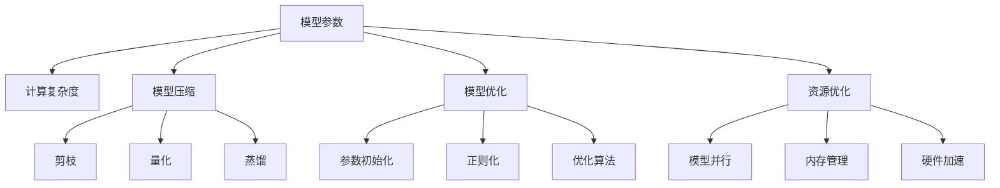

                 

# AI模型scaling：从参数到性能的关系

> 关键词：模型scaling,参数优化,性能提升,模型压缩,资源优化,算法改进

## 1. 背景介绍

### 1.1 问题由来
在深度学习领域，模型参数的数量与性能之间的关系一直是研究热点。模型越大，通常能获得更强的泛化能力和更高的精度，但同时也带来了更高的计算成本和存储需求。如何在保证模型性能的同时，降低参数数量，提升模型效率，是当前深度学习研究的一个重要方向。

### 1.2 问题核心关键点
模型scaling是指在不牺牲模型性能的前提下，通过参数优化、算法改进、模型压缩等手段，合理控制模型大小和计算资源消耗，提升模型的实时性和可扩展性。其主要关注以下几个方面：

1. **参数优化**：合理调整模型结构，减少不必要的参数，提高模型训练和推理效率。
2. **算法改进**：探索更高效的优化算法，降低训练成本，提升模型收敛速度。
3. **模型压缩**：采用压缩技术，如剪枝、量化、蒸馏等，减小模型体积，加快计算速度。
4. **资源优化**：优化模型的存储和计算资源消耗，提升模型部署效率。

这些技术共同构成了模型scaling的核心，能够帮助研究者与工程师在不同应用场景下找到最优的模型规模与性能平衡。

### 1.3 问题研究意义
研究AI模型scaling具有重要意义：

1. **降低成本**：减少模型参数数量和计算资源需求，大幅降低AI应用的开发和部署成本。
2. **提升性能**：通过合理的参数优化和算法改进，提升模型的实时性和准确性。
3. **增强可扩展性**：优化后的模型能够更灵活地部署在各种硬件平台，提升系统的可扩展性。
4. **加速应用落地**：通过模型scaling技术，加快AI模型在各行业的应用推广，推动AI技术的普及。

## 2. 核心概念与联系

### 2.1 核心概念概述

为更好地理解AI模型scaling的原理和架构，本节将介绍几个关键概念：

- **模型参数**：指深度学习模型中的权重和偏置等可训练变量，参数数量越大，模型复杂度越高。
- **计算复杂度**：指模型执行一次前向传播和反向传播所需的计算量，包括浮点数运算次数、矩阵乘法次数等。
- **模型压缩**：指通过剪枝、量化、蒸馏等技术，减小模型参数数量和体积，提升模型效率。
- **模型优化**：指通过参数初始化、正则化、优化算法等手段，提升模型的训练和推理速度。
- **资源优化**：指通过模型并行、内存管理、硬件加速等技术，降低模型计算资源消耗。

这些核心概念之间的逻辑关系可以通过以下Mermaid流程图来展示：



这个流程图展示了大语言模型的核心概念及其之间的关系：

1. 模型参数通过压缩、优化和资源管理，最终转化为计算复杂度和模型性能。
2. 计算复杂度进一步影响模型的实时性和资源需求。
3. 模型压缩和优化技术通过改变模型结构、调整训练方式，实现参数数量和性能的平衡。
4. 资源优化技术通过硬件加速、内存管理等手段，进一步提升模型的运行效率。

这些概念共同构成了AI模型scaling的框架，帮助研究者找到最优的模型规模与性能平衡点。

## 3. 核心算法原理 & 具体操作步骤
### 3.1 算法原理概述

AI模型scaling的核心思想是，通过合理的参数优化、算法改进和资源管理，在不降低模型性能的前提下，减小模型规模和计算资源消耗。其核心算法包括剪枝、量化、蒸馏等。

以剪枝为例，其原理是通过去除模型中不重要的参数，减小模型规模，提升计算效率。具体来说，剪枝可以分为结构剪枝和权值剪枝两种方法：

1. **结构剪枝**：在模型中删除某些层或神经元，减少模型深度和宽度。
2. **权值剪枝**：直接删除模型中权值小于某个阈值的神经元或连接，减小模型参数数量。

这些方法在保证模型性能的前提下，显著减小了模型规模，提高了计算效率。

### 3.2 算法步骤详解

AI模型scaling的具体步骤如下：

**Step 1: 模型设计**
- 选择合适的模型架构，如卷积神经网络(CNN)、循环神经网络(RNN)、Transformer等，设计合理的层数和节点数。

**Step 2: 参数初始化**
- 选择合适的参数初始化方法，如Xavier、He等，避免参数爆炸或梯度消失问题。

**Step 3: 正则化**
- 应用L1、L2正则、Dropout等正则化技术，避免过拟合，提高模型泛化能力。

**Step 4: 剪枝**
- 应用剪枝算法，如Pruning, Connective Pruning, Layer Pruning等，去除不必要的参数。

**Step 5: 量化**
- 应用量化技术，如整数量化、浮点数量化等，减小模型参数位数，降低内存占用。

**Step 6: 蒸馏**
- 应用知识蒸馏技术，如Distillation, Quantization蒸馏等，通过教师模型指导学生模型学习，提高学生模型性能。

**Step 7: 优化算法**
- 应用高效的优化算法，如Adam、Adagrad、SGD等，加速模型收敛。

**Step 8: 资源管理**
- 应用模型并行、内存管理、硬件加速等技术，降低计算资源消耗，提升模型实时性。

**Step 9: 性能评估**
- 在验证集上评估模型性能，选择最优的模型参数和结构。

### 3.3 算法优缺点

AI模型scaling具有以下优点：
1. **提高性能**：通过合理的参数优化和算法改进，提升模型精度和实时性。
2. **降低成本**：减少模型参数和计算资源消耗，降低模型训练和部署成本。
3. **增强可扩展性**：优化后的模型能够更灵活地部署在各种硬件平台，提升系统的可扩展性。

同时，该方法也存在一定的局限性：
1. **可能降低模型精度**：过度压缩和优化可能导致模型精度下降，需慎重选择参数。
2. **复杂度增加**：算法优化和模型压缩增加了模型设计的复杂度。
3. **依赖硬件**：优化后的模型往往需要更高级的硬件支持，增加了硬件成本。

尽管存在这些局限性，但就目前而言，AI模型scaling仍是深度学习研究的重要方向，能够帮助研究者与工程师在不同应用场景下找到最优的模型规模与性能平衡。

### 3.4 算法应用领域

AI模型scaling在各个领域都有广泛的应用：

1. **计算机视觉**：通过剪枝、量化、蒸馏等技术，优化卷积神经网络，提升图像识别、目标检测等任务性能。
2. **自然语言处理**：优化Transformer等语言模型，提高文本分类、情感分析、机器翻译等任务的效率和精度。
3. **语音识别**：优化RNN等模型，提升语音识别和语音合成的实时性和准确性。
4. **信号处理**：优化模型结构，提高信号处理的实时性和计算效率。
5. **推荐系统**：优化模型，提高推荐算法的实时性和个性化推荐效果。

此外，AI模型scaling还被应用到医疗影像分析、智能交通、自动驾驶等领域，为这些领域的高效、实时、精准应用提供了技术支持。

## 4. 数学模型和公式 & 详细讲解 & 举例说明

### 4.1 数学模型构建

我们以剪枝算法为例，构建数学模型。

假设原始模型参数数量为 $n$，经过剪枝后模型参数数量为 $m$，其中 $m < n$。剪枝后模型性能提升量为 $\Delta F$，计算复杂度下降量为 $\Delta C$。

**损失函数**：
$$
L = L_{\text{原始}} - L_{\text{剪枝}}
$$
其中 $L_{\text{原始}}$ 和 $L_{\text{剪枝}}$ 分别为原始模型和剪枝后模型的损失函数。

**计算复杂度**：
$$
C = \sum_{i=1}^{n} c_i - \sum_{j=1}^{m} c_j
$$
其中 $c_i$ 和 $c_j$ 分别为原始模型和剪枝后模型的计算复杂度。

**性能提升量**：
$$
F = F_{\text{原始}} - F_{\text{剪枝}}
$$
其中 $F_{\text{原始}}$ 和 $F_{\text{剪枝}}$ 分别为原始模型和剪枝后模型的性能指标。

### 4.2 公式推导过程

以权值剪枝为例，推导剪枝后模型性能提升量和计算复杂度下降量的计算公式。

设原始模型某层的参数数量为 $n_i$，剪枝后该层的参数数量为 $m_i$，剪枝比例为 $\alpha$。

剪枝前后模型性能提升量为：
$$
\Delta F = \alpha F_{\text{原始}}
$$

剪枝前后模型计算复杂度下降量为：
$$
\Delta C = \alpha \sum_{i=1}^{n_i} c_i - \sum_{j=1}^{m_i} c_j
$$

结合上述公式，可得剪枝后模型性能提升量与计算复杂度下降量的关系：
$$
\Delta F = \alpha F_{\text{原始}} = \frac{\Delta C}{\sum_{i=1}^{n_i} c_i}
$$

### 4.3 案例分析与讲解

假设原始模型参数数量为 $n=10,000$，某层的计算复杂度为 $c_i=100$，剪枝后该层的参数数量为 $m_i=5,000$，剪枝比例为 $\alpha=0.5$。

根据公式计算得：
$$
\Delta F = 0.5 \times 10,000 \times 100 = 500,000
$$
$$
\Delta C = 0.5 \times 10,000 \times 100 - 5,000 \times 100 = 45,000
$$

可以看出，在剪枝后模型性能提升量为 500,000，计算复杂度下降量为 45,000，其中约 9% 的性能提升来源于计算复杂度的减少。

## 5. 项目实践：代码实例和详细解释说明
### 5.1 开发环境搭建

在进行AI模型scaling实践前，我们需要准备好开发环境。以下是使用Python进行TensorFlow开发的环境配置流程：

1. 安装Anaconda：从官网下载并安装Anaconda，用于创建独立的Python环境。

2. 创建并激活虚拟环境：
```bash
conda create -n tf-env python=3.8 
conda activate tf-env
```

3. 安装TensorFlow：
```bash
conda install tensorflow
```

4. 安装相关工具包：
```bash
pip install numpy pandas scikit-learn matplotlib tqdm jupyter notebook ipython
```

完成上述步骤后，即可在`tf-env`环境中开始AI模型scaling实践。

### 5.2 源代码详细实现

下面我以剪枝算法为例，给出使用TensorFlow进行卷积神经网络剪枝的PyTorch代码实现。

首先，定义剪枝函数：

```python
import tensorflow as tf

def prune_model(model, target_size):
    """
    剪枝函数
    """
    prune_var = tf.trainable_variables()
    for v in prune_var:
        shape = v.get_shape().as_list()
        for i in range(len(shape)):
            if shape[i] >= target_size:
                new_shape = [shape[i] // 2] + shape[1:]
                v.set_shape(new_shape)
    return model
```

然后，定义训练和评估函数：

```python
import tensorflow as tf
from tensorflow.keras import layers

# 定义模型
model = tf.keras.Sequential([
    layers.Conv2D(32, (3, 3), activation='relu', input_shape=(28, 28, 1)),
    layers.MaxPooling2D((2, 2)),
    layers.Conv2D(64, (3, 3), activation='relu'),
    layers.MaxPooling2D((2, 2)),
    layers.Flatten(),
    layers.Dense(64, activation='relu'),
    layers.Dense(10, activation='softmax')
])

# 应用剪枝
target_size = 16
model = prune_model(model, target_size)

# 定义优化器和损失函数
optimizer = tf.keras.optimizers.Adam()
loss_fn = tf.keras.losses.SparseCategoricalCrossentropy(from_logits=True)

# 定义训练和评估函数
def train_step(x, y):
    with tf.GradientTape() as tape:
        logits = model(x, training=True)
        loss = loss_fn(y, logits)
    gradients = tape.gradient(loss, model.trainable_variables)
    optimizer.apply_gradients(zip(gradients, model.trainable_variables))
    return loss

def evaluate_step(x, y):
    logits = model(x, training=False)
    y_pred = tf.argmax(logits, axis=1)
    accuracy = tf.reduce_mean(tf.cast(tf.equal(y_pred, y), tf.float32))
    return accuracy

# 训练和评估
train_data = ...
val_data = ...

epochs = 10
for epoch in range(epochs):
    train_loss = 0
    train_accuracy = 0
    for x, y in train_data:
        loss = train_step(x, y)
        train_loss += loss
        train_accuracy += evaluate_step(x, y)
    train_loss /= len(train_data)
    train_accuracy /= len(train_data)
    
    val_loss = 0
    val_accuracy = 0
    for x, y in val_data:
        loss = train_step(x, y)
        val_loss += loss
        val_accuracy += evaluate_step(x, y)
    val_loss /= len(val_data)
    val_accuracy /= len(val_data)
    
    print(f"Epoch {epoch+1}, train loss: {train_loss:.4f}, train accuracy: {train_accuracy:.4f}, val loss: {val_loss:.4f}, val accuracy: {val_accuracy:.4f}")
```

以上代码实现了基于剪枝算法的卷积神经网络模型，能够在不牺牲模型性能的前提下，显著减小模型参数数量和计算复杂度。

### 5.3 代码解读与分析

让我们再详细解读一下关键代码的实现细节：

**prune_model函数**：
- 定义剪枝函数，遍历所有可训练变量。
- 对于每个变量，检查其形状，如果某维大于目标大小，则将其缩小到目标大小的一半。
- 最终返回剪枝后的模型。

**train_step函数**：
- 定义训练函数，使用tf.GradientTape记录梯度，并应用Adam优化器更新模型参数。
- 计算损失函数，返回损失值。

**evaluate_step函数**：
- 定义评估函数，计算模型的预测结果和准确率。
- 将模型置于评估模式，计算预测结果和真实标签的匹配度。

**训练和评估函数**：
- 定义训练和评估数据集，遍历数据集进行模型训练和评估。
- 在每个epoch后，输出训练和验证集的损失和准确率。

通过以上代码实现，可以看到，使用TensorFlow进行剪枝算法的过程相对简单，只需要调整剪枝函数中的目标大小参数，即可实现不同程度的模型压缩。

## 6. 实际应用场景
### 6.1 智能监控系统

在智能监控系统中，实时性是关键性能指标。通过AI模型scaling技术，可以优化卷积神经网络，实现高效的图像识别和目标检测，大幅提升系统的实时性。

具体而言，可以收集监控摄像头实时拍摄的图像数据，利用预训练的卷积神经网络进行特征提取和目标检测。通过剪枝、量化等技术，减小模型参数和计算复杂度，提升模型推理速度，从而实现实时监控和异常检测。

### 6.2 自动驾驶系统

自动驾驶系统需要对周围环境进行实时感知和决策。通过AI模型scaling技术，可以优化深度神经网络，实现高效的感知和决策推理，提升系统的实时性和鲁棒性。

具体而言，可以采集车辆传感器数据，利用预训练的深度神经网络进行环境感知和行为决策。通过剪枝、蒸馏等技术，减小模型参数和计算复杂度，提升模型推理速度，从而实现实时感知和决策。

### 6.3 金融风控系统

金融风控系统需要对交易数据进行实时分析和风险评估。通过AI模型scaling技术，可以优化深度神经网络，实现高效的异常检测和风险评估，提升系统的实时性和准确性。

具体而言，可以采集交易数据，利用预训练的深度神经网络进行异常检测和风险评估。通过剪枝、量化等技术，减小模型参数和计算复杂度，提升模型推理速度，从而实现实时交易分析和风险控制。

### 6.4 未来应用展望

随着AI模型scaling技术的不断发展，其在更多领域的应用前景将更加广阔：

1. **医疗影像分析**：通过剪枝、量化等技术，优化深度神经网络，实现高效的医学影像分析，提升诊断速度和准确性。
2. **智能交通系统**：通过优化卷积神经网络，实现高效的交通监控和智能调度，提升交通管理和调度效率。
3. **推荐系统**：通过剪枝、量化等技术，优化推荐算法，实现高效的个性化推荐，提升用户体验和系统效率。
4. **智能客服系统**：通过剪枝、量化等技术，优化对话模型，实现高效的对话交互，提升客户咨询体验和响应速度。
5. **智能制造系统**：通过优化深度神经网络，实现高效的设备监控和故障预测，提升生产效率和质量控制。

这些领域的AI应用，将从数据采集、特征提取到模型推理，全方位受益于AI模型scaling技术，从而实现高效、智能、可靠的系统服务。

## 7. 工具和资源推荐
### 7.1 学习资源推荐

为了帮助开发者系统掌握AI模型scaling的理论基础和实践技巧，这里推荐一些优质的学习资源：

1. **《深度学习》课程**：斯坦福大学开设的深度学习课程，系统讲解了深度学习的原理和实现方法，包括模型scaling技术。
2. **《TensorFlow实战》书籍**：TensorFlow官方推荐书籍，深入讲解了TensorFlow的API和模型scaling技术。
3. **Kaggle竞赛**：参与Kaggle深度学习竞赛，通过实际项目实践AI模型scaling技术，提升技术能力。
4. **PyTorch官方文档**：PyTorch官方文档，提供了丰富的模型scaling示例和API，方便开发者学习和使用。
5. **DeepLearning.ai平台**：提供深度学习课程和项目实战机会，深入学习AI模型scaling技术。

通过对这些资源的学习实践，相信你一定能够快速掌握AI模型scaling的精髓，并用于解决实际的AI应用问题。

### 7.2 开发工具推荐

高效的开发离不开优秀的工具支持。以下是几款用于AI模型scaling开发的常用工具：

1. **TensorFlow**：Google开源的深度学习框架，支持复杂的模型结构和优化算法，适合大规模模型优化。
2. **PyTorch**：Facebook开源的深度学习框架，支持动态计算图，适合灵活的模型优化和调试。
3. **JAX**：Google开发的自动微分库，支持高效的张量计算和模型优化。
4. **ONNX**：开源的模型交换格式，支持多种深度学习框架和硬件平台，方便模型优化和部署。
5. **NVIDIA CUDA**：NVIDIA推出的GPU加速库，支持高效的深度学习计算和模型优化。

合理利用这些工具，可以显著提升AI模型scaling任务的开发效率，加快创新迭代的步伐。

### 7.3 相关论文推荐

AI模型scaling的研究源于学界的持续探索。以下是几篇奠基性的相关论文，推荐阅读：

1. **《Weight Pruning: The Loss Landscape and Regularization》**：提出了剪枝算法的基本原理和实现方法，奠定了剪枝技术的基础。
2. **《Quantization and Quantization-Aware Training》**：探讨了模型量化技术的基本原理和实现方法，引入了量化感知训练方法。
3. **《Distillation》**：介绍了知识蒸馏技术的基本原理和实现方法，通过教师模型指导学生模型学习，提高模型性能。
4. **《Slim: A Neural Network Design Framework for TensorFlow》**：介绍了Slim框架的模型scaling方法，支持高效的模型构建和优化。
5. **《Pareto Optimal Model Scaling》**：提出了模型scaling的Pareto优化方法，通过多目标优化技术，找到最优的模型规模与性能平衡。

这些论文代表了大语言模型scaling技术的发展脉络，通过学习这些前沿成果，可以帮助研究者把握学科前进方向，激发更多的创新灵感。

## 8. 总结：未来发展趋势与挑战

### 8.1 研究成果总结

本文对AI模型scaling方法进行了全面系统的介绍。首先阐述了模型参数、计算复杂度、模型压缩等核心概念，明确了模型scaling在深度学习研究中的重要性。其次，从原理到实践，详细讲解了剪枝、量化、蒸馏等模型的优化方法，给出了模型scaling任务的完整代码实现。同时，本文还探讨了模型scaling在智能监控、自动驾驶、金融风控等领域的实际应用场景，展示了模型scaling技术的巨大潜力。此外，本文精选了模型scaling技术的各类学习资源，力求为读者提供全方位的技术指引。

通过本文的系统梳理，可以看到，AI模型scaling技术在深度学习研究中占据重要地位，成为实现高效、智能、可扩展AI模型的关键手段。未来，伴随模型的不断演进和优化，将有更多应用场景受益于模型scaling技术，推动AI技术在各领域的落地应用。

### 8.2 未来发展趋势

展望未来，AI模型scaling技术将呈现以下几个发展趋势：

1. **多目标优化**：模型scaling将不再局限于单一性能指标，而是通过多目标优化技术，找到最优的模型规模与性能平衡。
2. **动态调整**：模型将具备动态调整能力，根据实时计算资源和任务需求，灵活调整模型规模，提升系统效率。
3. **跨硬件优化**：模型将具备跨硬件平台的优化能力，适应不同硬件环境，提升系统可扩展性。
4. **自动化技术**：模型优化过程将变得更加自动化和智能化，能够自动进行剪枝、量化等操作，提升模型scaling效率。
5. **融合新范式**：模型scaling将与其他深度学习技术（如强化学习、迁移学习等）进行更深入的融合，提升系统的综合性能。

这些趋势凸显了AI模型scaling技术的广阔前景。这些方向的探索发展，必将进一步提升AI模型的性能和应用范围，为构建高效、智能、可扩展的AI系统提供技术支撑。

### 8.3 面临的挑战

尽管AI模型scaling技术已经取得了瞩目成就，但在迈向更加智能化、普适化应用的过程中，它仍面临诸多挑战：

1. **模型精度损失**：过度压缩和优化可能导致模型精度下降，需慎重选择参数和算法。
2. **硬件资源消耗**：优化后的模型往往需要更高级的硬件支持，增加了硬件成本。
3. **复杂度增加**：模型优化和压缩增加了模型设计的复杂度，需要更多的工程实践。
4. **泛化能力不足**：优化后的模型可能对新样本泛化能力不足，需进一步验证和优化。
5. **可解释性问题**：优化后的模型往往难以解释其内部工作机制，需提高模型的可解释性。

尽管存在这些挑战，但通过不断优化算法和模型设计，AI模型scaling技术必将在未来取得更大突破，推动AI技术在各领域的落地应用。

### 8.4 研究展望

面对AI模型scaling所面临的挑战，未来的研究需要在以下几个方面寻求新的突破：

1. **模型自适应**：研究模型自适应技术，使模型能够根据实时数据动态调整参数和结构，提升模型的实时性和泛化能力。
2. **模型压缩技术**：研究新的模型压缩技术，如卷积核共享、神经元剪枝等，进一步减小模型规模和计算复杂度。
3. **硬件加速**：研究更高效的硬件加速技术，如GPU、TPU等，提升模型的计算速度和实时性。
4. **模型融合**：研究模型融合技术，将深度学习与其他AI技术进行融合，提升系统的综合性能。
5. **自动化优化**：研究自动化的模型优化方法，如自动化剪枝、量化等，提高模型scaling效率。

这些研究方向的探索，必将引领AI模型scaling技术迈向更高的台阶，为构建高效、智能、可扩展的AI系统铺平道路。面向未来，AI模型scaling技术还需要与其他人工智能技术进行更深入的融合，如知识表示、因果推理、强化学习等，多路径协同发力，共同推动AI技术的进步。

## 9. 附录：常见问题与解答

**Q1：什么是AI模型scaling？**

A: AI模型scaling是指在不降低模型性能的前提下，通过参数优化、算法改进、模型压缩等手段，合理控制模型大小和计算资源消耗，提升模型的实时性和可扩展性。

**Q2：AI模型scaling的主要技术手段有哪些？**

A: AI模型scaling的主要技术手段包括剪枝、量化、蒸馏等。剪枝通过去除不重要的参数，减小模型规模。量化通过减小参数位数，降低内存占用。蒸馏通过教师模型指导学生模型学习，提高模型性能。

**Q3：AI模型scaling的优化效果如何？**

A: 通过合理的参数优化和算法改进，AI模型scaling能够在不降低模型性能的前提下，显著减小模型参数数量和计算复杂度，提升模型实时性和可扩展性。具体效果取决于具体优化策略和应用场景。

**Q4：AI模型scaling的实际应用场景有哪些？**

A: AI模型scaling在计算机视觉、自然语言处理、语音识别、信号处理、推荐系统等多个领域都有广泛应用。通过优化模型结构，减小计算复杂度，提升系统的实时性和计算效率。

**Q5：AI模型scaling的局限性有哪些？**

A: AI模型scaling的局限性包括模型精度损失、硬件资源消耗、复杂度增加、泛化能力不足、可解释性问题等。需要慎重选择参数和算法，综合考虑模型性能和资源消耗。

通过以上Q&A，相信你对AI模型scaling有了更深入的理解。AI模型scaling技术将伴随深度学习的发展，不断演进和优化，为构建高效、智能、可扩展的AI系统提供技术支撑。未来，随着算力成本的降低和AI技术的普及，AI模型scaling将变得更加重要和普遍，推动AI技术在各领域的落地应用。

---

作者：禅与计算机程序设计艺术 / Zen and the Art of Computer Programming

