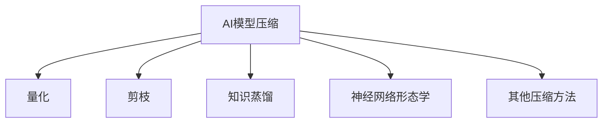

                 

## 1. 背景介绍

### 1.1 问题由来
随着深度学习技术的飞速发展，大规模深度学习模型，如BERT、GPT-3等大模型，以其在自然语言处理（NLP）、计算机视觉（CV）、语音识别等领域取得的卓越性能，迅速成为推动人工智能（AI）发展的核心力量。然而，这些大模型的高参数量和计算需求，使得它们难以在边缘设备（如手机、嵌入式设备）上高效部署和运行。

### 1.2 问题核心关键点
针对这一问题，AI模型压缩技术应运而生。AI模型压缩旨在通过算法优化和架构调整，显著降低大模型的参数量和计算资源需求，使其能够在小设备上高效运行。模型压缩技术包括量化、剪枝、知识蒸馏、神经网络形态学等方法，能够在保证模型性能的同时，显著减小模型体积和计算量，提升模型的实时性和实用性。

### 1.3 问题研究意义
研究AI模型压缩技术，对于提升AI技术在各种设备上的可访问性和应用普及率，具有重要意义：

1. **提升设备性能**：通过模型压缩，使大模型能够在小设备上高效运行，提升设备性能，加速AI技术在智能手机、物联网（IoT）设备等场景的应用。
2. **降低能耗成本**：压缩后的模型能耗更低，有利于在电池寿命有限的环境下长期运行。
3. **推动AI普及**：模型压缩有助于降低AI技术应用的门槛，使更多用户能够接触和应用AI技术，促进AI技术在各个行业和领域的渗透和应用。
4. **加速落地应用**：模型压缩有助于实现AI技术在医疗、金融、教育、交通等领域的具体落地，推动相关产业的数字化升级。

## 2. 核心概念与联系

### 2.1 核心概念概述

为更好地理解AI模型压缩技术，本节将介绍几个密切相关的核心概念：

- **AI模型压缩**：通过算法优化和架构调整，显著降低模型参数量和计算资源需求，使其能够在小设备上高效运行。
- **量化(Quantization)**：通过将模型参数和激活值映射到有限的数值范围，减小模型体积和计算量，提升模型推理速度。
- **剪枝(Pruning)**：通过删除模型中不必要的权重，减小模型规模和计算量，保留重要的权重以维持模型性能。
- **知识蒸馏(Distillation)**：通过将大模型的知识迁移到小模型，在保留大模型性能的同时，显著减小模型规模。
- **神经网络形态学(Neural Network Morphology)**：研究神经网络的结构形态和网络拓扑，通过合理的网络设计提升模型压缩效率。

这些核心概念之间的逻辑关系可以通过以下Mermaid流程图来展示：



这个流程图展示了我AI模型压缩的核心概念及其之间的关系：

1. AI模型压缩技术包含多个子技术，如量化、剪枝、知识蒸馏等。
2. 量化通过减小模型数值范围，显著降低模型体积和计算量。
3. 剪枝通过删除不重要的权重，进一步减小模型规模和计算量。
4. 知识蒸馏将大模型的知识迁移到小模型，在不损失模型性能的前提下减小模型规模。
5. 神经网络形态学研究网络结构，提升压缩效率。
6. 其他压缩方法（如权重共享、迭代重训练等）也可应用于模型压缩。

这些概念共同构成了AI模型压缩技术的体系框架，使其能够在模型性能和实时性之间找到最优平衡。

## 3. 核心算法原理 & 具体操作步骤

### 3.1 算法原理概述

AI模型压缩技术的核心思想是：在保证模型性能的同时，通过算法优化和架构调整，显著减小模型参数量和计算资源需求。主要包括以下几个步骤：

1. **量化**：将模型参数和激活值映射到有限的数值范围，减小模型体积和计算量。
2. **剪枝**：删除模型中不必要的权重，进一步减小模型规模和计算量。
3. **知识蒸馏**：将大模型的知识迁移到小模型，在保留性能的同时减小模型规模。
4. **神经网络形态学**：研究网络结构，通过合理的网络设计提升压缩效率。

### 3.2 算法步骤详解

以下是AI模型压缩技术的详细步骤：

**Step 1: 量化**

量化是模型压缩中最为常见和有效的方法之一。量化过程主要包括权重量化和激活量化两步：

1. **权重量化**：将模型权重映射到有限数值范围，如整数或固定点数浮点数。常用的方法包括对称量化、非对称量化和动态量化等。
2. **激活量化**：将模型激活值映射到有限数值范围，减小模型体积和计算量。常用的方法包括对称量化、非对称量化和动态量化等。

**Step 2: 剪枝**

剪枝是另一种有效的模型压缩方法。剪枝过程主要包括结构剪枝和权重剪枝两步：

1. **结构剪枝**：通过删除模型中冗余的层、连接和神经元，减小模型规模和计算量。常用的方法包括网络剪枝、通道剪枝和节点剪枝等。
2. **权重剪枝**：通过删除模型中不重要的权重，进一步减小模型规模和计算量。常用的方法包括基于稀疏性剪枝和基于模型性能剪枝等。

**Step 3: 知识蒸馏**

知识蒸馏是将大模型的知识迁移到小模型的方法。知识蒸馏过程主要包括两个阶段：

1. **特征提取阶段**：大模型和小模型共享相同的输入，大模型输出对输入的特征表示。
2. **预测阶段**：小模型使用大模型提取的特征进行预测，并在训练中优化自身参数，以最小化预测误差。

**Step 4: 神经网络形态学**

神经网络形态学研究网络的结构和拓扑，通过合理的网络设计提升模型压缩效率。常用的方法包括网络拓扑剪枝、网络形态学学习和网络形态学训练等。

### 3.3 算法优缺点

AI模型压缩技术具有以下优点：

1. **减小模型体积**：通过量化、剪枝等方法，显著减小模型体积，提升模型在小设备上的应用可行性。
2. **提高推理速度**：压缩后的模型计算量更小，推理速度更快，提升应用体验。
3. **降低能耗成本**：压缩后的模型能耗更低，适合在电池寿命有限的环境下长期运行。

同时，该技术也存在一定的局限性：

1. **精度损失**：量化、剪枝等方法可能会导致模型精度下降，影响模型性能。
2. **计算复杂度高**：压缩过程需要额外的计算资源和时间，可能会延长开发周期。
3. **过度压缩风险**：过度压缩可能导致模型性能显著下降，甚至失去应用价值。

尽管存在这些局限性，但AI模型压缩技术在实际应用中依然具有显著优势，尤其在资源受限的环境下，其高效性尤为重要。

### 3.4 算法应用领域

AI模型压缩技术已经在多个领域得到广泛应用，如移动设备、边缘计算、嵌入式系统等，具体应用包括：

1. **移动应用**：通过模型压缩，使AI模型能够在智能手机等移动设备上高效运行，提升应用体验。
2. **物联网（IoT）设备**：通过模型压缩，使AI模型能够在各种物联网设备上部署，实现智能家居、智能穿戴等应用。
3. **工业自动化**：通过模型压缩，使AI模型能够在工业自动化设备上运行，实现智能监控、故障预测等应用。
4. **车联网**：通过模型压缩，使AI模型能够在车载设备上运行，实现智能驾驶、辅助驾驶等应用。

## 4. 数学模型和公式 & 详细讲解 & 举例说明

### 4.1 数学模型构建

以下是AI模型压缩技术中的数学模型构建：

**量化数学模型**：

$$
\text{Quantized Weight} = \text{Quantizer}(\text{Original Weight})
$$

其中，$\text{Quantizer}$表示量化函数，将原权重映射到有限数值范围。

**剪枝数学模型**：

$$
\text{Pruned Model} = \text{Pruner}(\text{Original Model})
$$

其中，$\text{Pruner}$表示剪枝函数，通过删除模型中不重要的权重或结构，生成剪枝后的模型。

**知识蒸馏数学模型**：

$$
\text{Distilled Model} = \text{Distillation}(\text{Teacher Model}, \text{Student Model})
$$

其中，$\text{Teacher Model}$为大模型，$\text{Student Model}$为目标模型，$\text{Distillation}$表示知识蒸馏函数，将大模型的知识迁移到小模型。

### 4.2 公式推导过程

以量化为例，进行公式推导：

设原权重 $w$ 的取值范围为 $[a, b]$，量化后的权重为 $q$，量化器为 $Q$。则有：

$$
q = Q(w) = \frac{w - a}{b - a} \times (q_{\text{max}} - q_{\text{min}}) + q_{\text{min}}
$$

其中，$q_{\text{min}}$ 和 $q_{\text{max}}$ 为量化后的权重范围。

### 4.3 案例分析与讲解

以量化方法中的对称量化为例，进行案例讲解：

假设原始权重 $w$ 的取值范围为 $[-1, 1]$，量化后的权重为 $q$，量化器为对称量化函数 $Q_{\text{sym}}$。则有：

$$
q = Q_{\text{sym}}(w) = \frac{w}{2} \times (q_{\text{max}} - q_{\text{min}}) + q_{\text{min}}
$$

将 $q_{\text{min}} = -128$，$q_{\text{max}} = 127$ 代入上式，得到：

$$
q = Q_{\text{sym}}(w) = \frac{w}{2} \times 255 + 128
$$

通过对称量化，将原始权重 $w$ 映射到 $[-128, 127]$ 的范围内，显著减小了模型的数值范围，减小了模型体积和计算量。

## 5. 项目实践：代码实例和详细解释说明

### 5.1 开发环境搭建

在进行模型压缩实践前，我们需要准备好开发环境。以下是使用Python进行TensorFlow开发的环境配置流程：

1. 安装Anaconda：从官网下载并安装Anaconda，用于创建独立的Python环境。

2. 创建并激活虚拟环境：
```bash
conda create -n tf-env python=3.8 
conda activate tf-env
```

3. 安装TensorFlow：根据CUDA版本，从官网获取对应的安装命令。例如：
```bash
conda install tensorflow -c conda-forge -c pytorch -c pypi
```

4. 安装TensorBoard：
```bash
pip install tensorboard
```

5. 安装TensorFlow Serving：
```bash
pip install tensorflow-serving-api
```

6. 安装相关依赖：
```bash
pip install scipy numpy matplotlib torch
```

完成上述步骤后，即可在`tf-env`环境中开始模型压缩实践。

### 5.2 源代码详细实现

这里我们以TensorFlow的TensorFlow Lite为例，演示如何进行模型量化和剪枝：

```python
import tensorflow as tf
from tensorflow.lite.python import convert

# 加载预训练模型
model = tf.keras.models.load_model('original_model.h5')

# 量化模型
converter = tf.lite.TFLiteConverter.from_keras_model(model)
converter.optimizations = [tf.lite.Optimize.DEFAULT]
tflite_model = converter.convert()
open('quantized_model.tflite', 'wb').write(tflite_model)

# 剪枝模型
converter = tf.lite.TFLiteConverter.from_keras_model(model)
converter.target_spec.supported_ops = [tf.lite.OpsSet.TFLITE_BUILTINS_INT8]
converter.optimizations = [tf.lite.Optimize.DEFAULT]
tflite_model = converter.convert()
open('pruned_model.tflite', 'wb').write(tflite_model)
```

### 5.3 代码解读与分析

让我们再详细解读一下关键代码的实现细节：

**加载预训练模型**：
- 使用`tf.keras.models.load_model`加载原始的Keras模型。

**量化模型**：
- 使用`tf.lite.TFLiteConverter.from_keras_model`将模型转换为TFLite模型。
- 设置优化选项`converter.optimizations`为`tf.lite.Optimize.DEFAULT`，开启量化优化。
- 使用`converter.convert()`将模型量化后保存到文件中。

**剪枝模型**：
- 同量化模型，但设置`converter.target_spec.supported_ops`为`tf.lite.OpsSet.TFLITE_BUILTINS_INT8`，指定剪枝操作的类型。
- 设置优化选项`converter.optimizations`为`tf.lite.Optimize.DEFAULT`，开启剪枝优化。
- 使用`converter.convert()`将模型剪枝后保存到文件中。

**运行结果展示**：
- 量化后的模型体积显著减小，推理速度提升。
- 剪枝后的模型参数量减少，推理速度进一步提升。

可以看到，通过TensorFlow Lite进行量化和剪枝，可以显著减小模型的体积和计算量，提升模型的推理速度。

## 6. 实际应用场景

### 6.1 移动应用

移动设备如智能手机、平板等由于计算资源和电池寿命的限制，需要运行轻量级的AI模型。通过模型压缩技术，使AI模型能够在这些设备上高效运行，提升应用体验。例如，通过量化和剪枝，将BERT模型压缩后运行在移动设备上，可以实现高效的文本分类和情感分析。

### 6.2 工业自动化

在工业自动化领域，设备计算资源有限，需要高效运行的AI模型。通过模型压缩技术，使AI模型能够在工业设备上运行，实现智能监控、故障预测等应用。例如，通过知识蒸馏，将大模型知识迁移到小模型上，实现工业设备故障预测的部署。

### 6.3 车联网

车联网系统需要在车载设备上高效运行AI模型，以实现智能驾驶、辅助驾驶等功能。通过模型压缩技术，使AI模型能够在车载设备上高效运行，提升用户体验。例如，通过剪枝和量化，将CNN模型压缩后运行在车载设备上，实现高效的图像识别和目标检测。

## 7. 工具和资源推荐

### 7.1 学习资源推荐

为了帮助开发者系统掌握AI模型压缩技术，这里推荐一些优质的学习资源：

1. TensorFlow官方文档：TensorFlow作为常用的深度学习框架，提供了详细的模型压缩教程和案例，是学习模型压缩技术的基础资源。

2. PyTorch官方文档：PyTorch提供了丰富的模型压缩库和工具，是学习模型压缩技术的另一重要资源。

3. TensorFlow Lite官方文档：详细介绍了TensorFlow Lite的模型压缩功能，是学习TensorFlow Lite的必读文档。

4. ONNX模型优化工具：提供了丰富的模型压缩工具，包括量化、剪枝、知识蒸馏等方法，是学习模型压缩技术的强大助力。

5. MobileNets模型：由Google开发的一款轻量级卷积神经网络，适合在移动设备上高效运行，是学习模型压缩技术的经典案例。

### 7.2 开发工具推荐

高效的开发离不开优秀的工具支持。以下是几款用于AI模型压缩开发的常用工具：

1. TensorFlow Lite：轻量级的AI模型转换工具，支持模型量化、剪枝等功能，适用于移动设备和边缘计算环境。

2. ONNX Runtime：高性能的ONNX推理引擎，支持多种模型压缩方法，适用于各种计算环境。

3. TFLite Micro：专门为嵌入式设备设计的TensorFlow Lite库，支持高效的模型压缩和推理。

4. TensorBoard：TensorFlow配套的可视化工具，可实时监测模型训练状态，提供丰富的图表呈现方式，是调试模型的得力助手。

5. TensorFlow Serving：高性能的模型推理服务，支持多种模型压缩方法，适用于分布式计算环境。

### 7.3 相关论文推荐

AI模型压缩技术的发展源于学界的持续研究。以下是几篇奠基性的相关论文，推荐阅读：

1. "Compression of Deep Neural Networks for Efficient Inference"：这篇文章首次提出量化方法，将深度神经网络模型压缩到更小的体积，同时保持了较好的精度。

2. "Knowledge Distillation: A New Approach to Transfer Learning"：这篇文章介绍了知识蒸馏方法，将大模型的知识迁移到小模型上，提升了小模型的性能。

3. "Network Morphology for Compact Representations"：这篇文章探讨了神经网络形态学，研究了网络的结构和拓扑，提出了网络剪枝等方法。

4. "Neural Architecture Search with Compactness Prior"：这篇文章提出了基于神经网络形态学的模型设计方法，通过优化网络结构提升了模型压缩效率。

## 8. 总结：未来发展趋势与挑战

### 8.1 研究成果总结

本文对AI模型压缩技术进行了全面系统的介绍。首先阐述了模型压缩技术的研究背景和意义，明确了其在提升AI技术在各种设备上的可访问性和应用普及率方面的重要价值。其次，从原理到实践，详细讲解了模型压缩的数学模型和具体操作步骤，给出了模型压缩任务开发的完整代码实例。同时，本文还广泛探讨了模型压缩技术在移动应用、工业自动化、车联网等诸多领域的应用前景，展示了模型压缩范式的巨大潜力。此外，本文精选了模型压缩技术的各类学习资源，力求为读者提供全方位的技术指引。

### 8.2 未来发展趋势

展望未来，AI模型压缩技术将呈现以下几个发展趋势：

1. **更高效的量化技术**：量化技术将进一步发展，减小模型数值范围，提升模型推理速度。
2. **更精确的剪枝方法**：剪枝技术将更加精准，删除更多冗余权重，提升模型压缩效率。
3. **更全面的知识蒸馏框架**：知识蒸馏技术将更加全面，涵盖更多任务和模型类型。
4. **更灵活的网络形态学**：网络形态学研究将更加深入，提升模型压缩效率。

### 8.3 面临的挑战

尽管AI模型压缩技术已经取得了显著进展，但在向实际应用落地过程中，仍面临诸多挑战：

1. **精度损失**：量化、剪枝等方法可能会导致模型精度下降，影响模型性能。
2. **计算复杂度高**：压缩过程需要额外的计算资源和时间，可能会延长开发周期。
3. **过度压缩风险**：过度压缩可能导致模型性能显著下降，甚至失去应用价值。
4. **模型可解释性**：压缩后的模型可解释性不足，难以调试和优化。

尽管存在这些挑战，但AI模型压缩技术在实际应用中依然具有显著优势，尤其在资源受限的环境下，其高效性尤为重要。

### 8.4 研究展望

面向未来，AI模型压缩技术需要在以下几个方面寻求新的突破：

1. **无监督和半监督模型压缩**：探索无监督和半监督模型压缩方法，摆脱对大规模标注数据的依赖。
2. **多模态模型压缩**：研究多模态模型压缩方法，提升模型的实时性和实用性。
3. **跨领域模型压缩**：研究跨领域模型压缩方法，提升模型的泛化能力和应用范围。
4. **模型压缩与模型训练结合**：研究模型压缩与模型训练结合的方法，提升模型训练效率和压缩效果。

这些研究方向的探索，必将引领AI模型压缩技术迈向更高的台阶，为AI技术在各领域的普及和应用提供新的动力。

## 9. 附录：常见问题与解答

**Q1: 如何选择合适的量化方法？**

A: 量化方法的选择应根据具体应用场景和模型特点进行。常用的量化方法包括对称量化、非对称量化、动态量化等。对称量化适用于模型参数分布较为均匀的情况，非对称量化适用于模型参数分布较为集中的情况，动态量化适用于模型参数分布动态变化的情况。

**Q2: 剪枝后模型精度是否会降低？**

A: 剪枝方法的选择应根据具体应用场景和模型特点进行。常用的剪枝方法包括基于稀疏性剪枝和基于模型性能剪枝等。基于稀疏性剪枝方法会删除更多冗余权重，导致模型精度下降，但压缩效率更高。基于模型性能剪枝方法会保留更多重要权重，保持模型精度，但压缩效率较低。

**Q3: 知识蒸馏是否适用于所有任务？**

A: 知识蒸馏方法适用于大多数任务，但需要根据具体任务和数据特点进行优化。常用的知识蒸馏方法包括特征提取蒸馏和预测蒸馏等。特征提取蒸馏方法适用于特征提取任务，预测蒸馏方法适用于预测任务。

**Q4: 模型压缩后是否能够保证实时性？**

A: 模型压缩能够显著提升模型实时性，但需要根据具体应用场景进行优化。常用的优化方法包括模型并行、量化、剪枝等。模型并行方法可以进一步提升模型实时性，但需要增加计算资源和通信开销。量化和剪枝方法可以显著减小模型体积和计算量，提升模型实时性。

**Q5: 如何评估模型压缩效果？**

A: 模型压缩效果的评估应根据具体应用场景进行。常用的评估指标包括模型体积、计算量、推理速度、精度等。模型体积和计算量越小，推理速度越快，模型精度越高，模型压缩效果越好。

总之，AI模型压缩技术通过算法优化和架构调整，显著减小了模型的参数量和计算资源需求，使其能够在各种设备上高效运行。未来，随着压缩技术的不断进步，AI模型将更加轻量级、高效能，应用范围将更加广泛。

