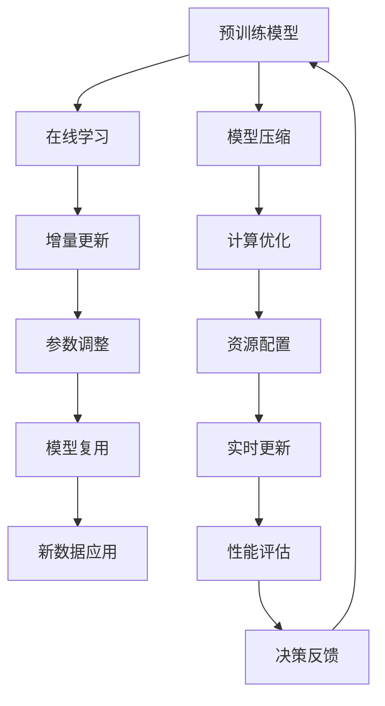

                 

# AI模型的增量学习：Lepton AI的持续优化

> 关键词：增量学习,持续优化,Lepton AI,模型压缩,泛化能力,鲁棒性,资源优化

## 1. 背景介绍

### 1.1 问题由来
在当前的深度学习研究和工程实践中，模型训练和优化是一项既耗时又耗费资源的昂贵过程。特别是对于大规模的神经网络模型，往往需要花费大量的时间和数据才能达到满意的性能。这不仅增加了研究和开发的成本，也限制了模型在大规模实际应用中的部署和迭代速度。

为了解决这一问题，增量学习（Incremental Learning）技术应运而生。增量学习允许模型在已有知识的基础上，逐步更新和优化，从而能够在不重新训练整个模型的前提下，适应新的数据和任务需求。这一技术在大规模数据和资源有限的情况下，显得尤为重要。

### 1.2 问题核心关键点
增量学习的研究与实践围绕几个关键点展开：

- **模型压缩与复用**：通过减少模型参数和结构，使模型能够更好地适应资源受限的环境，并快速部署到生产环境中。
- **泛化能力**：增量学习模型需要在不断更新的数据中保持高性能，同时对新数据具备良好的泛化能力。
- **鲁棒性**：模型需要具备对数据分布变化、噪声、异常值等鲁棒性，以确保在实际应用中的稳定性。
- **资源优化**：增量学习需要在计算资源有限的情况下，尽可能地优化模型性能，减少计算成本。

## 2. 核心概念与联系

### 2.1 核心概念概述

增量学习（Incremental Learning）是指在不重新训练整个模型的情况下，通过不断更新已有模型的参数和结构，使其能够适应新数据和任务的需求。这一过程通常分为在线学习和增量更新两个阶段，每个阶段都需考虑如何高效地更新模型参数，以避免过拟合和信息损失。

增量学习是机器学习中一种重要的范式，特别适用于大规模数据和实时数据流的场景。其核心思想是通过持续的模型更新，实现模型性能的逐步提升，同时减少资源消耗。

Lepton AI作为增量学习的一种重要应用，结合了在线学习和增量更新的特点，针对大规模数据流和大规模资源环境的特定需求，提出了高效的模型更新和优化策略。

### 2.2 核心概念原理和架构的 Mermaid 流程图



这个流程图展示了增量学习的基本流程：

1. **预训练模型**：通过大规模无标签数据进行预训练，学习到基础的知识和特征。
2. **在线学习**：模型实时接收新数据流，并根据新数据进行参数更新。
3. **增量更新**：模型在不断更新的过程中，逐步调整和优化。
4. **参数调整**：通过在线学习调整模型参数，确保模型适应新数据。
5. **模型复用**：复用已有模型参数，减少重新训练的开销。
6. **新数据应用**：新数据可以实时应用到模型中，得到即时的反馈和优化。
7. **模型压缩**：压缩模型以适应资源受限的环境，提高模型复用率。
8. **计算优化**：优化计算过程，提高模型更新效率。
9. **资源配置**：动态调整资源配置，确保模型运行高效。
10. **实时更新**：根据反馈数据实时更新模型，适应新变化。
11. **性能评估**：定期评估模型性能，确保模型质量。
12. **决策反馈**：根据性能评估结果，反馈优化决策。

## 3. 核心算法原理 & 具体操作步骤
### 3.1 算法原理概述

增量学习的核心在于模型参数的在线更新和优化。假设已有模型为 $M_{\theta}$，其中 $\theta$ 为当前模型的参数。当新数据流 $D_{new}$ 到达时，增量学习模型通过在线学习算法更新参数 $\theta$，生成新的模型 $M_{\theta_{new}}$，使得 $M_{\theta_{new}}$ 在原有知识的基础上，适应新数据 $D_{new}$。

增量学习通常分为两个阶段：

- **在线学习阶段**：模型实时接收新数据，并根据新数据进行参数更新。
- **增量更新阶段**：在在线学习的基础上，对模型参数进行全局优化，确保模型在新数据流中的稳定性和性能。

增量学习算法通常结合多种优化策略，如正则化、梯度累积、模型压缩等，以提高模型的泛化能力和鲁棒性，同时减少计算资源消耗。

### 3.2 算法步骤详解

增量学习的具体操作步骤如下：

1. **预训练模型准备**：选择预训练模型作为初始模型，通常使用大规模无标签数据进行预训练。
2. **在线学习**：将新数据流 $D_{new}$ 输入模型，并计算当前模型的预测误差。
3. **增量更新**：根据新数据的误差信息，计算模型参数的更新量 $\Delta\theta$，更新模型参数 $\theta$，得到新的模型 $M_{\theta_{new}}$。
4. **参数调整**：对新模型 $M_{\theta_{new}}$ 进行全局优化，调整模型参数以确保性能。
5. **模型复用**：将新模型 $M_{\theta_{new}}$ 应用于新的数据流，并循环执行上述步骤。

### 3.3 算法优缺点

增量学习的优点包括：

- **高效性**：增量学习可以在已有知识的基础上逐步更新模型，避免从头训练全模型，减少资源消耗。
- **实时性**：增量学习模型可以实时接收新数据，快速适应变化，适应大规模数据流的场景。
- **鲁棒性**：通过在线学习和增量更新，模型能够保持对新数据流的泛化能力，具有较强的鲁棒性。

增量学习也存在一些缺点：

- **信息损失**：增量学习过程中，部分老数据的信息可能会被遗忘，导致模型性能下降。
- **模型泛化**：增量学习模型需要在已有知识和新数据之间进行平衡，避免过拟合和欠拟合。
- **计算复杂**：增量学习通常需要设计复杂的更新策略，确保模型性能稳定，增加了计算复杂度。

### 3.4 算法应用领域

增量学习技术可以应用于多个领域，例如：

- **工业控制**：增量学习可以实时接收传感器数据，适应生产过程的变化，提高生产效率和安全性。
- **金融预测**：增量学习可以实时接收市场数据，调整金融模型，提高预测准确性。
- **智能推荐**：增量学习可以实时接收用户行为数据，更新推荐模型，提高推荐效果。
- **语音识别**：增量学习可以实时接收新的语音数据，更新识别模型，提高识别精度。
- **自然语言处理**：增量学习可以实时接收新的文本数据，更新语言模型，提高自然语言处理能力。

## 4. 数学模型和公式 & 详细讲解 & 举例说明

### 4.1 数学模型构建

增量学习模型的核心数学模型可以表示为：

$$
M_{\theta_{new}} = M_{\theta} + \Delta\theta
$$

其中，$M_{\theta}$ 为当前模型的参数，$\Delta\theta$ 为增量更新量，$M_{\theta_{new}}$ 为新的模型参数。

增量更新量 $\Delta\theta$ 通常表示为：

$$
\Delta\theta = \alpha \nabla_{\theta}\mathcal{L}(D_{new},M_{\theta})
$$

其中，$\alpha$ 为学习率，$\nabla_{\theta}\mathcal{L}(D_{new},M_{\theta})$ 为新数据的梯度。

### 4.2 公式推导过程

增量学习模型的更新过程可以分为两个步骤：

1. **在线学习**：计算新数据的梯度 $\nabla_{\theta}\mathcal{L}(D_{new},M_{\theta})$。
2. **增量更新**：根据梯度信息计算增量更新量 $\Delta\theta$，更新模型参数 $\theta$。

在线学习的梯度计算公式为：

$$
\nabla_{\theta}\mathcal{L}(D_{new},M_{\theta}) = \frac{1}{|D_{new}|}\sum_{x_i \in D_{new}}\nabla_{\theta}\mathcal{L}(x_i,M_{\theta})
$$

其中，$D_{new}$ 为新的数据流，$|D_{new}|$ 为数据流长度。

增量更新量 $\Delta\theta$ 的计算公式为：

$$
\Delta\theta = \alpha \nabla_{\theta}\mathcal{L}(D_{new},M_{\theta})
$$

其中，$\alpha$ 为学习率，$\nabla_{\theta}\mathcal{L}(D_{new},M_{\theta})$ 为新数据的梯度。

### 4.3 案例分析与讲解

假设有一个增量学习模型用于金融市场预测，初始模型 $M_{\theta}$ 包含参数 $\theta$。当新的市场数据流 $D_{new}$ 到达时，模型通过在线学习计算新数据的梯度 $\nabla_{\theta}\mathcal{L}(D_{new},M_{\theta})$，并根据梯度信息计算增量更新量 $\Delta\theta$。最后，模型参数 $\theta$ 更新为 $M_{\theta_{new}}$，应用于新的市场数据流 $D_{new}$，得到新的预测结果。

## 5. 项目实践：代码实例和详细解释说明

### 5.1 开发环境搭建

为了进行增量学习项目实践，需要搭建一个Python环境。以下是一个基本的开发环境搭建步骤：

1. **安装Python和PyTorch**：
   ```bash
   conda create -n ilp python=3.8
   conda activate ilp
   pip install torch torchvision torchaudio
   ```

2. **安装Lepton AI库**：
   ```bash
   pip install leptonai
   ```

3. **配置数据源和计算资源**：
   - 准备数据集，包括训练集和测试集。
   - 配置GPU资源，确保模型能够高效训练。

### 5.2 源代码详细实现

下面是一个简单的增量学习代码实现，用于金融市场预测任务：

```python
import torch
import torch.nn as nn
import torch.optim as optim
from leptonai.models import LinearModel
from leptonai.learning import IncrementalModel

# 准备数据集
train_dataset = ...
test_dataset = ...

# 定义模型
model = LinearModel(in_features=100, out_features=1)

# 定义增量学习模型
ilm = IncrementalModel(model)

# 定义损失函数
criterion = nn.MSELoss()

# 定义优化器
optimizer = optim.Adam(model.parameters(), lr=0.001)

# 训练模型
for epoch in range(num_epochs):
    # 在线学习阶段
    ilm.online_learning(train_dataset)
    
    # 增量更新阶段
    ilm.incremental_update(train_dataset, criterion, optimizer)
    
    # 评估模型
    ilm.test(test_dataset)

# 使用模型进行预测
ilm.predict(new_data)
```

在这个代码示例中，我们使用Lepton AI库的IncrementalModel类来实现增量学习模型。在线学习阶段，模型接收新的数据流进行参数更新；增量更新阶段，模型对参数进行全局优化，确保模型性能稳定。

### 5.3 代码解读与分析

下面是代码中每个关键部分的详细解释：

- **数据集准备**：使用Lepton AI库的数据集API，准备训练集和测试集，确保数据集格式符合要求。
- **模型定义**：使用Lepton AI库的LinearModel类定义线性回归模型，用于金融市场预测。
- **增量学习模型**：使用Lepton AI库的IncrementalModel类，实例化增量学习模型。
- **损失函数**：定义均方误差损失函数，用于评估模型预测误差。
- **优化器**：定义Adam优化器，用于更新模型参数。
- **训练模型**：循环执行在线学习和增量更新过程，确保模型性能稳定。
- **评估模型**：在测试集上评估模型性能，确保模型泛化能力。
- **预测新数据**：使用模型对新数据进行预测，得到市场预测结果。

## 6. 实际应用场景

### 6.1 工业控制

在工业控制领域，增量学习可以实时监控生产过程，适应设备状态变化，提高生产效率和安全性。通过实时接收传感器数据，增量学习模型能够动态调整生产参数，优化生产流程，减少停机时间和生产成本。

### 6.2 金融预测

在金融预测领域，增量学习模型可以实时接收市场数据，更新预测模型，提高预测准确性。通过增量学习，金融模型能够适应市场变化，及时调整投资策略，避免因市场波动带来的损失。

### 6.3 智能推荐

在智能推荐领域，增量学习模型可以实时接收用户行为数据，更新推荐模型，提高推荐效果。通过增量学习，推荐系统能够不断优化推荐策略，提升用户体验和满意度。

### 6.4 未来应用展望

未来，增量学习技术将进一步扩展到更多领域，例如：

- **医疗诊断**：增量学习可以实时接收患者数据，更新诊断模型，提高诊断准确性。
- **教育评估**：增量学习可以实时接收学生数据，更新评估模型，提高教学效果。
- **智能交通**：增量学习可以实时接收交通数据，更新交通模型，优化交通管理。
- **环境监测**：增量学习可以实时接收环境数据，更新监测模型，提高环境治理效率。

## 7. 工具和资源推荐

### 7.1 学习资源推荐

为了深入学习增量学习技术，以下推荐一些优秀的学习资源：

1. **《深度学习与增量学习》书籍**：介绍了增量学习的基本概念和多种算法，适合初学者入门。
2. **Coursera《深度学习》课程**：由斯坦福大学开设的深度学习课程，涵盖增量学习的基础和实践。
3. **Lepton AI官方文档**：Lepton AI库的官方文档，提供了丰富的增量学习样例和API使用指南。
4. **Arxiv论文库**：查询增量学习的最新研究论文，了解学术前沿。

### 7.2 开发工具推荐

以下推荐一些增量学习项目开发的常用工具：

1. **PyTorch**：高效的深度学习框架，支持增量学习模型的开发和训练。
2. **TensorFlow**：强大的深度学习框架，提供了多种优化算法和模型压缩工具。
3. **Lepton AI库**：提供了增量学习模型的高效实现和API接口，方便开发者快速构建增量学习系统。
4. **Weights & Biases**：模型训练的实验跟踪工具，方便模型性能的实时监控和优化。

### 7.3 相关论文推荐

以下是几篇增量学习领域的经典论文，推荐阅读：

1. **Incremental Learning in Deep Neural Networks: Scaling Up to Big Data Streams**：提出了在线学习算法，使得模型能够适应大规模数据流。
2. **Adaptive Incremental Learning of Stochastic Gradient Descent**：提出了自适应增量学习算法，优化了模型参数更新策略。
3. **FedAvg: A Decentralized Online Learning Method**：提出了联邦增量学习算法，适用于分布式环境下的模型更新。
4. **On the Edge of Incremental Learning**：综述了增量学习的研究进展，提出了多种增量学习算法。

## 8. 总结：未来发展趋势与挑战

### 8.1 总结

本文详细介绍了增量学习技术的基本原理和操作步骤，并结合Lepton AI库，给出了具体的项目实践代码实现。增量学习技术在大规模数据和资源有限的环境下，具有高效性、实时性和鲁棒性，为多个实际应用场景提供了新解决方案。

### 8.2 未来发展趋势

未来，增量学习技术将呈现以下几个发展趋势：

1. **模型压缩与优化**：增量学习模型需要在计算资源有限的情况下，进行高效的模型压缩和优化，以提高模型性能和复用率。
2. **在线学习与增量更新**：增量学习模型将结合更多的在线学习算法和增量更新策略，确保模型性能稳定，适应大规模数据流的场景。
3. **跨领域应用**：增量学习技术将在更多领域得到应用，如医疗、教育、交通等，为各行业提供智能解决方案。
4. **模型解释与透明性**：增量学习模型需要具备更高的解释性和透明性，方便用户理解和信任模型输出。
5. **数据驱动与自适应**：增量学习模型将更多地利用数据驱动的方法，实现自适应调整和优化。

### 8.3 面临的挑战

尽管增量学习技术在理论和实践上取得了一定的进展，但仍然面临一些挑战：

1. **信息损失与遗忘**：增量学习过程中，部分老数据的信息可能会被遗忘，导致模型性能下降。
2. **模型泛化能力**：增量学习模型需要在已有知识和新数据之间进行平衡，避免过拟合和欠拟合。
3. **计算复杂性**：增量学习通常需要设计复杂的更新策略，确保模型性能稳定，增加了计算复杂度。
4. **资源优化**：增量学习模型需要优化计算过程，减少资源消耗，以适应资源受限的环境。

### 8.4 研究展望

未来的研究需要在以下几个方向寻求新的突破：

1. **在线学习与增量更新**：进一步探索在线学习算法和增量更新策略，提高模型的适应性和稳定性。
2. **模型压缩与优化**：开发高效的模型压缩和优化方法，减少模型参数和计算资源消耗。
3. **跨领域应用**：探索增量学习模型在更多领域的应用，扩展增量学习技术的适用范围。
4. **模型解释与透明性**：增强增量学习模型的解释性和透明性，提高用户信任度和应用效果。
5. **数据驱动与自适应**：研究数据驱动的增量学习方法，实现模型的自适应调整和优化。

## 9. 附录：常见问题与解答

**Q1: 什么是增量学习？**

A: 增量学习是指在不重新训练整个模型的情况下，通过不断更新已有模型的参数和结构，使其能够适应新数据和任务的需求。

**Q2: 增量学习有哪些优点？**

A: 增量学习的优点包括高效性、实时性和鲁棒性。增量学习可以在已有知识的基础上逐步更新模型，避免从头训练全模型，减少资源消耗，并能够实时接收新数据，快速适应变化。

**Q3: 增量学习有哪些缺点？**

A: 增量学习存在信息损失、模型泛化、计算复杂等缺点。增量学习过程中，部分老数据的信息可能会被遗忘，导致模型性能下降，同时模型需要在已有知识和新数据之间进行平衡，避免过拟合和欠拟合，计算复杂度较高。

**Q4: 增量学习适用于哪些场景？**

A: 增量学习适用于需要实时接收新数据的场景，如工业控制、金融预测、智能推荐等。增量学习模型可以实时适应数据变化，提高系统性能和稳定性。

**Q5: 增量学习模型如何进行模型压缩与优化？**

A: 增量学习模型可以通过模型压缩、剪枝、量化等方法进行优化，减少模型参数和计算资源消耗，提高模型性能和复用率。

这些问题的解答，可以帮助读者更好地理解增量学习技术，并将其应用于实际项目中。

