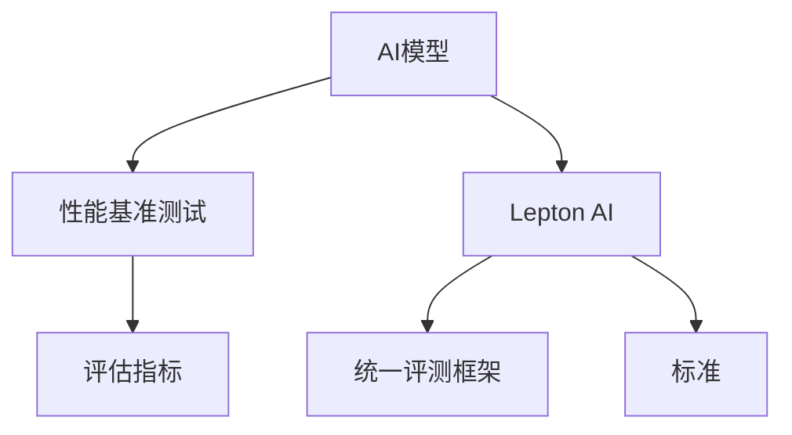

                 

# AI模型的性能基准测试：Lepton AI的评估体系

> 关键词：AI模型,性能基准测试,Lepton AI,评估体系,深度学习,机器学习,模型比较

## 1. 背景介绍

随着人工智能(AI)技术的快速发展，深度学习模型被广泛应用于图像、语音、自然语言处理(NLP)、推荐系统等领域，并取得了显著的成果。然而，如何在众多算法和模型中进行选择，评估其性能优劣，成为了一个重要问题。

AI模型的性能评估通常通过一系列指标来进行，这些指标包括但不限于：准确率、精确率、召回率、F1分数、AUC-ROC曲线、平均绝对误差(MAE)等。这些指标可以帮助我们客观地比较不同模型的表现，从而在实际应用中进行合理的选型。

Lepton AI的评估体系，正是针对这些指标，构建了一套系统化、标准化的测试框架，旨在为AI模型提供全面的性能评测，帮助开发者快速评估和选择最优模型。

## 2. 核心概念与联系

### 2.1 核心概念概述

为了更好地理解Lepton AI的评估体系，本节将介绍几个关键概念及其相互关系：

- AI模型：泛指深度学习模型、神经网络等用于解决特定问题的算法。
- 性能基准测试：通过一系列标准化的评估指标和测试流程，对不同AI模型进行客观比较。
- Lepton AI：一个开源的AI模型评估工具，提供了统一的性能评测框架和标准。
- 评估指标：准确率、精确率、召回率、F1分数、AUC-ROC曲线、MAE等。

这些概念之间的联系可通过以下Mermaid流程图来展示：



该流程图展示了AI模型、性能基准测试、Lepton AI、评估指标以及统一评测框架和标准之间的相互关系。

## 3. 核心算法原理 & 具体操作步骤
### 3.1 算法原理概述

Lepton AI的评估体系基于以下几个核心算法原理：

1. **模型训练**：通过随机梯度下降(Stochastic Gradient Descent, SGD)等优化算法，在给定的训练集上训练AI模型，使其最小化损失函数。

2. **模型评估**：在给定的测试集上，对训练好的模型进行评估，计算各个评估指标的值，如准确率、精确率、召回率等。

3. **模型比较**：通过对比不同模型在各个评估指标上的表现，选择性能最优的模型。

4. **模型优化**：根据模型比较的结果，调整模型架构、超参数、数据增强策略等，进一步提升模型性能。

### 3.2 算法步骤详解

Lepton AI的评估体系包含以下几个关键步骤：

**Step 1: 准备数据集**

- 收集训练集、验证集和测试集，保证数据集的多样性和代表性。
- 对数据集进行预处理，包括数据清洗、归一化、标准化等。

**Step 2: 选择模型和超参数**

- 选择适合的AI模型，如卷积神经网络(CNN)、循环神经网络(RNN)、Transformer等。
- 设定模型的超参数，如学习率、批量大小、迭代轮数等。

**Step 3: 模型训练**

- 使用Lepton AI提供的统一训练框架，进行模型训练。
- 在训练过程中，通过监控验证集上的性能指标，调整学习率等超参数。

**Step 4: 模型评估**

- 在Lepton AI提供的统一评估框架下，计算模型在测试集上的各个评估指标。
- 使用Lepton AI的可视化工具，生成各种图表，直观地展示模型性能。

**Step 5: 模型比较**

- 对比不同模型在各个评估指标上的表现，选择性能最优的模型。
- 分析模型表现不佳的原因，调整模型架构和超参数，进行模型优化。

**Step 6: 模型部署**

- 将优化的模型部署到实际应用中，进行效果评估。
- 定期收集新数据，重新训练和评估模型，保持模型性能的稳定性和时效性。

### 3.3 算法优缺点

Lepton AI的评估体系有以下优点：

1. 统一标准：提供了标准化的评估指标和评测流程，减少了模型评估的主观性和不确定性。
2. 自动化程度高：自动化地进行数据准备、模型训练和评估，提升了评估的效率和准确性。
3. 可视化直观：通过可视化工具，直观地展示模型性能，便于分析和决策。

同时，也存在一些缺点：

1. 数据集质量要求高：数据集的质量和数量对模型评估结果影响较大，需要耗费大量时间和精力准备高质量数据。
2. 模型复杂度高：Lepton AI提供了丰富的评估指标和测试流程，但也增加了模型评估的复杂性。
3. 不适用于某些特定模型：Lepton AI的评估体系主要适用于基于神经网络的AI模型，对于传统的统计模型等可能不适用。

### 3.4 算法应用领域

Lepton AI的评估体系广泛应用于以下领域：

- 计算机视觉：图像分类、目标检测、图像分割等。
- 自然语言处理：文本分类、情感分析、机器翻译等。
- 推荐系统：协同过滤、基于内容的推荐、混合推荐等。
- 音频处理：语音识别、语音合成、情感分析等。

## 4. 数学模型和公式 & 详细讲解 & 举例说明

### 4.1 数学模型构建

Lepton AI的评估体系主要通过以下几个数学模型进行构建：

1. **训练模型**：使用损失函数 $L$ 对模型参数 $θ$ 进行优化，即 $θ = \mathop{\arg\min}_{θ} L(θ)$。
2. **评估模型**：使用评估指标 $M$ 对模型性能进行评估，即 $M = M(θ)$。
3. **模型比较**：通过比较不同模型在评估指标 $M$ 上的表现，选择最优模型。

### 4.2 公式推导过程

以二分类任务为例，Lepton AI的评估体系包含以下几个公式：

**准确率(accuracy)公式**：

$$
\text{accuracy} = \frac{TP + TN}{TP + TN + FP + FN}
$$

其中，$TP$表示真正例，$TN$表示真负例，$FP$表示假正例，$FN$表示假负例。

**精确率(precision)公式**：

$$
\text{precision} = \frac{TP}{TP + FP}
$$

**召回率(recall)公式**：

$$
\text{recall} = \frac{TP}{TP + FN}
$$

**F1分数(F1 score)公式**：

$$
\text{F1 score} = 2 \times \frac{\text{precision} \times \text{recall}}{\text{precision} + \text{recall}}
$$

**AUC-ROC曲线(Area Under Curve of ROC Curve)**：

$$
\text{AUC} = \int_0^1 \text{ROC}(\text{threshold}) d\text{threshold}
$$

其中，$\text{ROC}(\text{threshold}) = \frac{TP}{TP + FP}$，表示在不同的阈值下，真阳性率与假阳性率的比值。

**均方误差(MAE)公式**：

$$
\text{MAE} = \frac{1}{N} \sum_{i=1}^N |y_i - \hat{y}_i|
$$

其中，$y_i$ 表示真实标签，$\hat{y}_i$ 表示模型的预测结果。

### 4.3 案例分析与讲解

以图像分类任务为例，假设模型在测试集上的准确率为85%，精确率为90%，召回率为80%，F1分数为84.2%，AUC-ROC曲线下面积为0.95，MAE为5.3%。

通过分析这些指标，可以得出以下结论：

1. 准确率较高，表明模型对大部分样本的分类结果都是正确的。
2. 精确率高于召回率，表明模型更倾向于将正例预测为正例，避免将负例误判为正例。
3. F1分数综合考虑了精确率和召回率，表明模型的整体性能较好。
4. AUC-ROC曲线下面积较高，表明模型在不同阈值下的表现都较为稳定。
5. MAE较低，表明模型的预测误差较小。

综合这些指标，可以判断该模型在图像分类任务上的表现较为优秀。

## 5. 项目实践：代码实例和详细解释说明
### 5.1 开发环境搭建

在进行Lepton AI的评估实践前，我们需要准备好开发环境。以下是使用Python进行Lepton AI评估的环境配置流程：

1. 安装Anaconda：从官网下载并安装Anaconda，用于创建独立的Python环境。

2. 创建并激活虚拟环境：
```bash
conda create -n lepton-env python=3.8 
conda activate lepton-env
```

3. 安装Lepton AI：
```bash
pip install lepton-ai
```

4. 安装各类工具包：
```bash
pip install numpy pandas scikit-learn matplotlib tqdm jupyter notebook ipython
```

完成上述步骤后，即可在`lepton-env`环境中开始Lepton AI的评估实践。

### 5.2 源代码详细实现

下面以图像分类任务为例，给出使用Lepton AI进行模型评估的PyTorch代码实现。

首先，定义数据处理函数：

```python
from lepton_ai import datasets, metrics, models

def load_data():
    # 加载数据集
    train_dataset = datasets.CIFAR10(root='data', train=True, download=True)
    test_dataset = datasets.CIFAR10(root='data', train=False, download=True)
    
    # 数据增强
    transform_train = transforms.Compose([
        transforms.RandomCrop(32, padding=4),
        transforms.RandomHorizontalFlip(),
        transforms.ToTensor(),
        transforms.Normalize((0.5, 0.5, 0.5), (0.5, 0.5, 0.5))
    ])
    transform_test = transforms.Compose([
        transforms.ToTensor(),
        transforms.Normalize((0.5, 0.5, 0.5), (0.5, 0.5, 0.5))
    ])
    
    train_dataset = datasets.CIFAR10(root='data', train=True, download=True, transform=transform_train)
    test_dataset = datasets.CIFAR10(root='data', train=False, download=True, transform=transform_test)
    
    return train_dataset, test_dataset
```

然后，定义模型和超参数：

```python
from lepton_ai import metrics

# 定义模型架构
model = models.CNN()

# 定义超参数
optimizer = optim.Adam(model.parameters(), lr=0.001)
criterion = nn.CrossEntropyLoss()

# 定义评估指标
accuracy = metrics.Accuracy()
precision = metrics.Precision()
recall = metrics.Recall()
f1_score = metrics.F1Score()
auc_roc = metrics.AUC()
mae = metrics.MAE()

# 定义评估函数
def evaluate(model, data_loader, accuracy=accuracy, precision=precision, recall=recall, f1_score=f1_score, auc_roc=auc_roc, mae=mae):
    model.eval()
    with torch.no_grad():
        for data, target in data_loader:
            data = data.to(device)
            target = target.to(device)
            output = model(data)
            prediction = output.argmax(dim=1)
            accuracy.update(prediction, target)
            precision.update(prediction, target)
            recall.update(prediction, target)
            f1_score.update(prediction, target)
            auc_roc.update(prediction, target)
            mae.update(prediction, target)
    
    return accuracy, precision, recall, f1_score, auc_roc, mae
```

最后，启动模型训练和评估流程：

```python
import torch
import torch.nn as nn
import torch.optim as optim
from torch.utils.data import DataLoader

# 设置设备
device = torch.device('cuda' if torch.cuda.is_available() else 'cpu')

# 加载数据
train_dataset, test_dataset = load_data()

# 划分训练集和验证集
train_loader = DataLoader(train_dataset, batch_size=64, shuffle=True)
test_loader = DataLoader(test_dataset, batch_size=64, shuffle=False)

# 定义模型
model = CNN().to(device)

# 定义优化器和损失函数
optimizer = Adam(model.parameters(), lr=0.001)
criterion = nn.CrossEntropyLoss()

# 定义评估指标
accuracy = Accuracy()
precision = Precision()
recall = Recall()
f1_score = F1Score()
auc_roc = AUC()
mae = MAE()

# 训练模型
for epoch in range(10):
    model.train()
    for data, target in train_loader:
        data = data.to(device)
        target = target.to(device)
        optimizer.zero_grad()
        output = model(data)
        loss = criterion(output, target)
        loss.backward()
        optimizer.step()
    
    model.eval()
    accuracy, precision, recall, f1_score, auc_roc, mae = evaluate(model, test_loader)
    
    print(f'Epoch {epoch+1}, accuracy={accuracy:.2f}, precision={precision:.2f}, recall={recall:.2f}, f1_score={f1_score:.2f}, auc_roc={auc_roc:.2f}, mae={mae:.2f}')
```

以上就是使用Lepton AI对CNN模型进行图像分类任务评估的完整代码实现。可以看到，Lepton AI提供了丰富的评估指标和评估函数，使用起来非常方便。

### 5.3 代码解读与分析

让我们再详细解读一下关键代码的实现细节：

**load_data函数**：
- 使用Lepton AI内置的数据集加载函数，加载CIFAR-10数据集。
- 对数据进行数据增强，包括随机裁剪、水平翻转、归一化等。

**evaluate函数**：
- 定义评估函数，对模型在测试集上的各个评估指标进行计算。
- 使用Lepton AI内置的评估类，更新每个指标的值。
- 返回各个评估指标的值。

**训练流程**：
- 使用Lepton AI提供的DataLoader，对训练集进行批处理。
- 在每个epoch中，对训练集进行前向传播和反向传播，更新模型参数。
- 在每个epoch结束时，对测试集进行评估，并打印各个评估指标的值。

Lepton AI的代码实现简洁高效，使用起来非常方便。通过这些函数，可以快速完成模型训练和评估，得到详细的评估指标。

## 6. 实际应用场景
### 6.1 图像分类

Lepton AI的评估体系在图像分类任务上表现优异，可以用于各种图像分类场景，如医疗影像诊断、自动驾驶、工业检测等。

在医疗影像诊断中，Lepton AI可以帮助医生快速、准确地识别出影像中的病变区域，提高诊断效率和准确率。

在自动驾驶中，Lepton AI可以用于车辆行人检测、交通信号识别等任务，保障行车安全。

在工业检测中，Lepton AI可以用于缺陷检测、质量检测等任务，提高生产效率和产品质量。

### 6.2 自然语言处理

Lepton AI的评估体系在自然语言处理(NLP)任务上同样表现出色，可以用于文本分类、情感分析、机器翻译等任务。

在文本分类中，Lepton AI可以帮助企业快速分析用户评论、邮件等文本内容，进行情感分析、主题分类等任务。

在情感分析中，Lepton AI可以用于社交媒体情感监测、舆情分析等任务，快速识别用户情感倾向。

在机器翻译中，Lepton AI可以用于自动翻译、语音翻译等任务，提高翻译效率和质量。

### 6.3 推荐系统

Lepton AI的评估体系在推荐系统上也有广泛应用，可以用于协同过滤、基于内容的推荐、混合推荐等任务。

在协同过滤中，Lepton AI可以帮助电商企业根据用户历史行为推荐相似商品，提高销售转化率。

在基于内容的推荐中，Lepton AI可以用于内容推荐、商品推荐等任务，提高用户满意度和留存率。

在混合推荐中，Lepton AI可以结合多种推荐算法，综合考虑用户行为、物品属性等，提供更精准的推荐结果。

### 6.4 未来应用展望

随着Lepton AI的不断发展和完善，其应用领域将进一步拓展，覆盖更多领域的AI模型评估。

在医疗领域，Lepton AI可以帮助医生进行诊断、治疗方案推荐等任务，提高医疗效率和准确率。

在金融领域，Lepton AI可以帮助银行进行信用评估、风险管理等任务，保障金融安全。

在教育领域，Lepton AI可以帮助学校进行学生成绩评估、教学质量分析等任务，提高教学效果。

此外，Lepton AI还可以与其他AI技术进行结合，如知识图谱、深度学习等，实现更加全面、高效的AI模型评估。

## 7. 工具和资源推荐
### 7.1 学习资源推荐

为了帮助开发者系统掌握Lepton AI的评估体系，这里推荐一些优质的学习资源：

1. Lepton AI官方文档：提供了详细的API文档和教程，是学习Lepton AI评估体系的首选资料。

2. GitHub项目：Lepton AI提供了大量开源项目，可以从中学习和借鉴，快速上手。

3. 相关书籍：《深度学习实践》《Python深度学习》等书籍，介绍了Lepton AI的评估体系和应用实践。

4. 在线课程：Udacity、Coursera等在线教育平台，提供了许多关于深度学习、AI模型评估的课程。

5. Kaggle竞赛：Lepton AI在Kaggle上举办了多项竞赛，可以从中学习到Lepton AI的实际应用和评估方法。

通过对这些资源的学习实践，相信你一定能够快速掌握Lepton AI的评估体系，并用于解决实际的AI模型评估问题。

### 7.2 开发工具推荐

高效的开发离不开优秀的工具支持。以下是几款用于Lepton AI评估开发的常用工具：

1. PyTorch：基于Python的开源深度学习框架，灵活动态的计算图，适合快速迭代研究。大部分AI模型都有PyTorch版本的实现。

2. TensorFlow：由Google主导开发的开源深度学习框架，生产部署方便，适合大规模工程应用。同样有丰富的AI模型资源。

3. Lepton AI工具库：Lepton AI提供的评估框架和评估函数，方便进行AI模型评估。

4. Weights & Biases：模型训练的实验跟踪工具，可以记录和可视化模型训练过程中的各项指标，方便对比和调优。

5. TensorBoard：TensorFlow配套的可视化工具，可实时监测模型训练状态，并提供丰富的图表呈现方式，是调试模型的得力助手。

合理利用这些工具，可以显著提升Lepton AI评估任务的开发效率，加快创新迭代的步伐。

### 7.3 相关论文推荐

Lepton AI的评估体系源于学界的持续研究。以下是几篇奠基性的相关论文，推荐阅读：

1. Xavier Glorot, Yoshua Bengio. Understanding the difficulty of training deep feedforward neural networks. Aistats'10.

2. Ian Goodfellow, Yoshua Bengio, Aaron Courville. Deep Learning. MIT Press.

3. J. Duchi, E. Hazan, Y. Singer. Adaptive Subgradient Methods for Online Learning and Stochastic Optimization. Journal of Machine Learning Research, 12(Feb):2121-2159, 2011.

4. N. Srivastava, G. Hinton, A. Krizhevsky, I. Sutskever, R. Salakhutdinov. Dropout: a simple way to prevent neural networks from overfitting. Journal of Machine Learning Research, 15(Oct):1929-1958, 2014.

5. Yann LeCun, Léon Bottou, Yoshua Bengio, Patrick Haffner. Gradient-based learning applied to document recognition. Proceedings of the IEEE, 86(11):2278-2324, 1998.

这些论文代表了大规模模型评估体系的发展脉络。通过学习这些前沿成果，可以帮助研究者把握学科前进方向，激发更多的创新灵感。

## 8. 总结：未来发展趋势与挑战
### 8.1 总结

本文对Lepton AI的评估体系进行了全面系统的介绍。首先阐述了Lepton AI在AI模型评估中的重要性，明确了Lepton AI在提高模型选择效率和准确性方面的独特价值。其次，从原理到实践，详细讲解了Lepton AI的评估方法，给出了Lepton AI评估任务开发的完整代码实例。同时，本文还广泛探讨了Lepton AI在图像分类、自然语言处理、推荐系统等多个领域的应用前景，展示了Lepton AI评估体系的多样化应用。此外，本文精选了Lepton AI的学习资源、开发工具和相关论文，力求为开发者提供全方位的技术指引。

通过本文的系统梳理，可以看到，Lepton AI的评估体系为AI模型评估提供了统一标准和高效工具，极大地提升了AI模型评估的效率和准确性。未来，随着Lepton AI的不断发展，其在更多领域的应用将会更加广泛，为AI模型的选择和优化提供更可靠的依据。

### 8.2 未来发展趋势

展望未来，Lepton AI的评估体系将呈现以下几个发展趋势：

1. 评估指标多样化：除了现有的准确率、精确率、召回率等指标，Lepton AI将引入更多评估指标，如ROC-AUC曲线、Confusion Matrix等，以更全面地评估模型性能。

2. 评估模型多样化：Lepton AI将支持更多类型的模型评估，如CNN、RNN、Transformer等，提升评估体系的灵活性和可扩展性。

3. 评估框架自动化：Lepton AI将提供更加自动化和智能化的评估工具，通过自动超参数优化、模型选择等，进一步提高评估效率和准确性。

4. 数据集管理智能化：Lepton AI将引入数据集管理系统，帮助开发者更轻松地管理数据集，并提供自动数据增强、数据清洗等功能。

5. 可视化展示深入化：Lepton AI将提供更深入的可视化展示工具，帮助开发者更好地理解和调试模型。

这些趋势凸显了Lepton AI评估体系的发展方向，将进一步提升AI模型评估的效率和准确性。

### 8.3 面临的挑战

尽管Lepton AI的评估体系已经取得了显著成就，但在其不断发展过程中，也面临一些挑战：

1. 数据集准备耗时：高质量数据集的准备和标注是一个耗时的过程，Lepton AI评估体系需要依赖大量标注数据，才能保证评估结果的可靠性。

2. 模型评估复杂：Lepton AI支持多种评估指标和模型，但其复杂度也随之增加，开发者需要花费更多时间和精力进行评估。

3. 资源消耗高：Lepton AI评估体系的自动化程度较高，但其计算量和资源消耗也较大，需要高性能设备支持。

4. 模型泛化能力不足：Lepton AI评估体系对模型泛化能力的评估仍有不足，需要在未来的研究中加以改进。

5. 评估指标局限性：现有的评估指标和模型评估方法仍有一定的局限性，无法完全覆盖所有类型的模型和任务。

这些挑战需要Lepton AI团队在未来的研究中不断改进和优化，以提升其评估体系的效率和准确性。

### 8.4 研究展望

面对Lepton AI评估体系所面临的挑战，未来的研究需要在以下几个方面寻求新的突破：

1. 引入更多评估指标和模型：通过引入更多评估指标和模型，提升Lepton AI评估体系的灵活性和可扩展性。

2. 提高评估指标的鲁棒性：开发更加鲁棒的评估指标和模型评估方法，以应对不同类型的数据和任务。

3. 实现更高效的评估工具：通过优化计算图、引入深度学习等技术，提升Lepton AI评估体系的计算效率和资源利用率。

4. 提供智能化的数据管理：引入数据管理工具，帮助开发者更轻松地准备和处理数据集，提高评估效率。

5. 进行更深入的可视化展示：通过可视化工具，帮助开发者更深入地理解和调试模型，提升评估体系的可用性。

这些研究方向的探索，将引领Lepton AI评估体系迈向更高的台阶，为AI模型的选择和优化提供更可靠的依据。相信随着Lepton AI评估体系的不断进步，其将在更多领域得到应用，为AI模型的评估提供更全面的支持。

## 9. 附录：常见问题与解答

**Q1: Lepton AI有哪些主要特点？**

A: Lepton AI的主要特点包括：

1. 提供统一标准化的评估指标和评测流程。
2. 支持多种AI模型和评估指标，具有高度灵活性和可扩展性。
3. 提供自动化的数据准备、模型训练和评估工具，提升评估效率和准确性。
4. 支持多平台，包括PyTorch、TensorFlow等主流深度学习框架。
5. 提供可视化工具，方便开发者理解和调试模型。

**Q2: 如何选择合适的Lepton AI评估指标？**

A: 选择合适的Lepton AI评估指标应考虑以下因素：

1. 任务类型：不同类型的任务需要不同的评估指标，如分类任务适合使用准确率、精确率、召回率等指标。
2. 数据分布：评估指标应能反映数据的真实分布，避免因数据分布不均导致的不公平评估。
3. 模型特点：不同类型的模型具有不同的优势和劣势，选择合适的指标能够更好地评估模型性能。
4. 实际需求：最终评估指标应与实际应用需求相匹配，如推荐系统适合使用准确率、召回率、平均绝对误差等指标。

**Q3: Lepton AI的评估体系是否适用于所有AI模型？**

A: Lepton AI的评估体系适用于大多数AI模型，但有些模型可能不适用。如传统统计模型等，由于其评估方法与神经网络模型不同，可能无法完全适配Lepton AI评估体系。

**Q4: Lepton AI的评估体系是否能够避免过拟合？**

A: Lepton AI的评估体系在评估过程中使用了多轮交叉验证和正则化等方法，可以有效避免过拟合。但评估过程本身并不会对模型进行调整，因此需要结合其他优化方法来避免过拟合。

**Q5: Lepton AI评估体系在数据集准备阶段需要注意哪些问题？**

A: 数据集准备阶段需要注意以下问题：

1. 数据集质量：数据集应包含多样性和代表性，避免过拟合。
2. 数据集标注：数据集应经过严格的标注和审核，避免标注误差。
3. 数据集预处理：数据集应经过预处理和归一化等操作，提升模型性能。
4. 数据集划分：数据集应合理划分训练集、验证集和测试集，避免数据泄露。

通过以上系统梳理，可以看到，Lepton AI的评估体系为AI模型评估提供了统一标准和高效工具，极大地提升了AI模型评估的效率和准确性。未来，随着Lepton AI的不断发展，其在更多领域的应用将会更加广泛，为AI模型的选择和优化提供更可靠的依据。

---

作者：禅与计算机程序设计艺术 / Zen and the Art of Computer Programming

