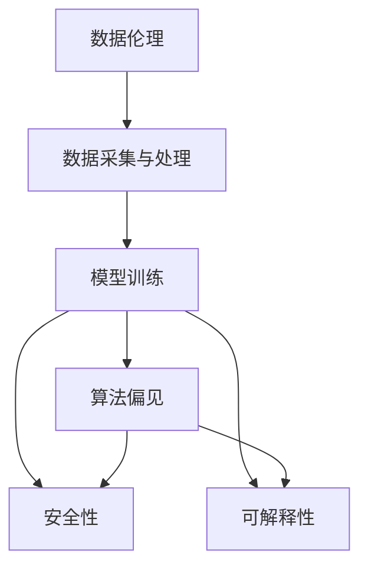

                 

# AI的长期发展：贾扬清的思考，如何让AI行业更长远地走下去

## 1. 背景介绍

人工智能(AI)的发展已经进入了一个新的阶段，从最初的符号推理，到统计学习方法，再到深度学习与大模型。这一过程中，技术的进步极大地推动了AI的实际应用，但也带来了诸如数据伦理、算法偏见、安全隐私等方面的挑战。如何在享受科技红利的同时，构建一个可持续发展的AI行业，成为亟待解决的问题。本文将从贾扬清的思考出发，探讨如何让AI行业更长远地走下去。

## 2. 核心概念与联系

### 2.1 核心概念概述

- **人工智能**：以数据为基础，通过机器学习、深度学习等技术，使计算机具备智能决策、自主学习和理解复杂任务的能力。
- **大模型**：具有亿级参数规模的深度学习模型，如BERT、GPT-3、T5等，能够在大规模数据上进行预训练，具备泛化能力。
- **数据伦理**：涉及数据的采集、存储、使用和处理过程中的道德问题，包括隐私保护、数据偏见等。
- **算法偏见**：指AI系统在处理数据时，由于训练数据的偏误或设计时的决策偏好，导致输出结果的不公平性。
- **安全性**：AI系统在运行过程中，需确保自身的鲁棒性和对抗性，以抵御恶意攻击。
- **可解释性**：AI模型的决策过程需具备一定的透明性和可理解性，以便进行调试和优化。

这些核心概念之间的联系紧密，相互影响。例如，数据伦理直接影响着数据的使用质量，而数据质量又决定了模型的训练效果；算法的偏见来源于数据的偏见，而数据偏见又可能反过来加剧算法的偏见；安全性与可解释性相互促进，只有模型具备透明性和可解释性，才能更好地检测和修复安全性问题。

### 2.2 核心概念原理和架构的 Mermaid 流程图



通过这张图表，我们可以看到数据伦理和模型训练之间的逻辑关系：

1. **数据采集与处理**：收集和预处理数据，包括去噪、标注等，保证数据的准确性和完整性。
2. **模型训练**：在标注好的数据集上进行训练，生成大模型。
3. **算法偏见**：由于训练数据的分布不均衡或模型设计不当，模型在处理特定类别数据时可能产生偏见。
4. **安全性**：模型需具备抵御攻击的能力，如对抗样本攻击、数据泄露等。
5. **可解释性**：模型需具备透明性，便于理解和调试。

## 3. 核心算法原理 & 具体操作步骤

### 3.1 算法原理概述

基于大模型的AI系统，其核心算法原理主要包括以下几个步骤：

1. **数据预处理**：包括数据清洗、标注、分批等。
2. **模型初始化**：选取或训练大模型作为初始化参数。
3. **模型训练**：在标注数据集上进行有监督训练，调整模型参数。
4. **模型评估与验证**：通过验证集评估模型性能，调整模型参数。
5. **模型部署与优化**：将模型部署到实际应用中，并进行持续优化。

### 3.2 算法步骤详解

**步骤一：数据预处理**

数据预处理是构建大模型基础性的工作，直接影响模型的训练效果。预处理包括数据清洗、标注、分批等环节。数据清洗需要去除噪声，保证数据质量；标注则需进行人工标注，标记出训练集中的正确答案；分批则是将大规模数据划分为小批，降低计算复杂度。

**步骤二：模型初始化**

模型初始化是将已有的大模型作为基础，或从头训练大模型。预训练模型通常使用大规模无标签数据进行训练，具有较强的泛化能力；从头训练则需大量标注数据，以提升模型性能。初始化模型的选择需考虑数据分布、任务需求等因素。

**步骤三：模型训练**

模型训练通过反向传播算法，调整模型参数以最小化损失函数。损失函数一般采用交叉熵、均方误差等，不同任务需根据具体需求选择合适的函数。训练过程中，需设置合适的学习率、批大小、迭代次数等超参数，以优化模型性能。

**步骤四：模型评估与验证**

模型评估与验证通过验证集评估模型性能，判断模型泛化能力。常用指标包括准确率、召回率、F1分数等。评估过程中，需使用多个验证集，防止过拟合。

**步骤五：模型部署与优化**

模型部署将训练好的模型应用于实际任务中，需考虑模型的推理速度、内存占用等问题。模型优化则需对模型进行剪枝、量化等处理，以提升模型效率。

### 3.3 算法优缺点

大模型AI系统的算法优点包括：

- **泛化能力强**：通过大规模数据预训练，具备较强的泛化能力，适应多变的数据分布。
- **高性能**：使用先进的深度学习架构，具备较强的计算能力，能够处理复杂任务。
- **快速迭代**：通过微调，能够快速适应新任务，迭代优化模型性能。

缺点包括：

- **数据依赖性强**：对标注数据依赖大，数据获取成本高。
- **资源消耗大**：需要大量计算资源进行模型训练和推理，资源消耗大。
- **公平性问题**：存在算法偏见和数据偏见，可能造成公平性问题。

### 3.4 算法应用领域

大模型AI系统广泛应用于多个领域，如医疗、金融、教育等。在医疗领域，大模型可用于疾病诊断、药物研发等；在金融领域，可用于信用评估、风险控制等；在教育领域，可用于个性化推荐、智能客服等。大模型的应用领域不断扩展，有望在更多场景中发挥作用。

## 4. 数学模型和公式 & 详细讲解 & 举例说明

### 4.1 数学模型构建

构建大模型AI系统需构建数学模型，通常包括损失函数、优化算法、评估指标等。以二分类任务为例，损失函数一般采用交叉熵损失：

$$
L(y, \hat{y}) = -\frac{1}{N}\sum_{i=1}^N[y_i\log \hat{y_i} + (1-y_i)\log(1-\hat{y_i})]
$$

其中 $y$ 为真实标签，$\hat{y}$ 为模型预测概率，$N$ 为样本数。

### 4.2 公式推导过程

以二分类任务为例，模型的训练过程可简化为：

$$
\theta = \arg\min_{\theta}\frac{1}{N}\sum_{i=1}^N[L(y_i,\hat{y_i})]
$$

其中 $\theta$ 为模型参数，$L$ 为损失函数。通过反向传播算法，可求得参数更新公式：

$$
\theta \leftarrow \theta - \eta\nabla_{\theta}L(y_i,\hat{y_i})
$$

其中 $\eta$ 为学习率，$\nabla_{\theta}L(y_i,\hat{y_i})$ 为损失函数对参数 $\theta$ 的梯度。

### 4.3 案例分析与讲解

以医疗领域中的疾病诊断为例，首先需收集大规模医疗数据，进行数据清洗和标注。接着，选取BERT大模型作为初始化参数，在标注数据上进行有监督训练。训练过程中，需设置合适的学习率、批大小、迭代次数等超参数。训练完成后，使用多个验证集评估模型性能，优化超参数，最终得到优化后的模型。

## 5. 项目实践：代码实例和详细解释说明

### 5.1 开发环境搭建

开发大模型AI系统，需搭建深度学习开发环境。以下是一个简单的Python开发环境配置示例：

1. 安装Python：选择Python 3.7及以上版本。
2. 安装深度学习框架：使用pip安装TensorFlow或PyTorch等深度学习框架。
3. 安装其他工具：安装NumPy、Pandas、scikit-learn等常用工具。

### 5.2 源代码详细实现

以下是一个基于TensorFlow的大模型AI系统代码实现示例：

```python
import tensorflow as tf
from tensorflow.keras.layers import Input, Dense
from tensorflow.keras.models import Model
from tensorflow.keras.optimizers import Adam

# 定义模型结构
input_layer = Input(shape=(input_size,))
dense_layer = Dense(256, activation='relu')(input_layer)
output_layer = Dense(1, activation='sigmoid')(dense_layer)

# 定义损失函数和优化器
loss_function = tf.keras.losses.BinaryCrossentropy()
optimizer = Adam(learning_rate=0.001)

# 定义模型
model = Model(inputs=input_layer, outputs=output_layer)
model.compile(optimizer=optimizer, loss=loss_function, metrics=['accuracy'])

# 训练模型
model.fit(train_dataset, epochs=10, validation_data=val_dataset)
```

### 5.3 代码解读与分析

以上代码实现了一个二分类任务的大模型AI系统。首先定义了模型结构，包括输入层、中间全连接层和输出层。接着定义了损失函数和优化器，最后通过Model编译器将模型编译并训练。

训练过程中，使用了TensorFlow自带的损失函数和优化器，以二分类任务为例，使用二元交叉熵损失函数，并设置了学习率为0.001。通过fit方法，指定了训练数据集、迭代轮数和验证数据集，训练了10个epoch。

### 5.4 运行结果展示

训练结束后，可以使用evaluation方法在测试数据集上评估模型性能：

```python
test_loss, test_acc = model.evaluate(test_dataset)
print(f'Test loss: {test_loss}, Test accuracy: {test_acc}')
```

## 6. 实际应用场景

### 6.1 医疗领域

在医疗领域，大模型AI系统可用于疾病诊断、药物研发等。以疾病诊断为例，通过收集大量医疗数据，标注出各类疾病的特征，在标注数据集上训练大模型。训练完成后，将模型应用于实际医疗案例中，根据患者的症状和检查结果，自动给出诊断建议。

### 6.2 金融领域

在金融领域，大模型AI系统可用于信用评估、风险控制等。通过收集大量的金融数据，标注出各类风险特征，训练大模型。训练完成后，将模型应用于实际金融案例中，根据用户行为和历史数据，自动评估信用风险和控制风险。

### 6.3 教育领域

在教育领域，大模型AI系统可用于个性化推荐、智能客服等。通过收集大量的教育数据，标注出各类教育内容特征，训练大模型。训练完成后，将模型应用于智能推荐系统中，根据学生的学习行为和历史数据，自动推荐学习内容和作业。

### 6.4 未来应用展望

未来，大模型AI系统的应用将进一步扩展，可能涉及到更多的领域。例如，在智能交通、智慧城市、农业等领域，大模型AI系统可以帮助优化管理、提升效率、改善生活质量等。同时，大模型AI系统的性能将进一步提升，应用场景将更加丰富多样。

## 7. 工具和资源推荐

### 7.1 学习资源推荐

1. Coursera的“Deep Learning Specialization”课程：由Andrew Ng教授主讲，涵盖深度学习的基础和高级内容，适合入门和进阶学习。
2. TensorFlow官方文档：提供丰富的学习资源和样例代码，适合深入学习TensorFlow。
3. PyTorch官方文档：提供丰富的学习资源和样例代码，适合深入学习PyTorch。
4. Google AI的AI源码仓库：提供丰富的开源项目和代码示例，适合参考和借鉴。

### 7.2 开发工具推荐

1. Google Colab：Google提供的免费在线Jupyter Notebook环境，适合快速迭代实验和共享学习笔记。
2. Jupyter Notebook：流行的Python开发环境，支持代码、文档和输出结果的整合展示。
3. Visual Studio Code：强大的开发工具，支持多种语言和插件，适合复杂开发场景。

### 7.3 相关论文推荐

1. "Understanding Deep Learning Requires Rethinking Generalization"：Chandar Gupta和Rishabh Solanki的论文，探讨了深度学习的泛化能力，提出了数据集划分和模型评估的新方法。
2. "Neural Network Architectures for Named Entity Recognition"：Oriol Vinyals等人的论文，介绍了多种深度学习架构在命名实体识别任务中的应用。
3. "Machine Learning, Neural and Statistical Learning"：Tom M. Mitchell的著作，介绍了机器学习和深度学习的理论基础和应用实例。

## 8. 总结：未来发展趋势与挑战

### 8.1 研究成果总结

本文介绍了大模型AI系统的核心算法原理和操作步骤，并给出了详细的代码实现。通过案例分析，展示了大模型AI系统在多个实际应用场景中的应用。同时，本文探讨了未来大模型AI系统的应用前景和可能面临的挑战。

### 8.2 未来发展趋势

未来大模型AI系统的发展趋势包括：

1. 数据伦理和隐私保护：随着数据量不断增加，数据伦理和隐私保护将变得更加重要，需构建可靠的数据采集和使用机制。
2. 算法偏见和公平性：需进一步研究算法偏见和公平性问题，确保AI系统的公正性和透明性。
3. 安全性：需提高AI系统的安全性，抵御攻击和恶意使用。
4. 可解释性：需提高AI系统的可解释性，便于调试和优化。
5. 多模态融合：需研究多模态数据的融合，提升AI系统对复杂任务的应对能力。

### 8.3 面临的挑战

大模型AI系统面临的挑战包括：

1. 数据依赖性强：需降低对标注数据的依赖，探索无监督和半监督学习范式。
2. 资源消耗大：需优化模型结构，减少资源消耗，提升计算效率。
3. 公平性问题：需消除算法偏见，确保公平性。
4. 安全性问题：需提升模型的鲁棒性和安全性，防止恶意攻击。
5. 可解释性问题：需提高模型的可解释性，便于调试和优化。

### 8.4 研究展望

未来的研究重点包括：

1. 探索无监督和半监督学习：降低对标注数据的依赖，提高模型的泛化能力。
2. 研究多模态数据融合：提升AI系统对复杂任务的应对能力。
3. 提高模型安全性：增强模型的鲁棒性和安全性，防止恶意攻击。
4. 增强模型可解释性：提高模型的透明性和可理解性，便于调试和优化。

通过持续研究和探索，相信大模型AI系统将更加成熟和完善，为社会的各个方面带来更多创新和便利。

## 9. 附录：常见问题与解答

**Q1：大模型AI系统的训练成本高吗？**

A: 是的，大模型AI系统的训练成本较高，需要大量的计算资源和时间。但随着AI硬件的发展和算法的优化，训练成本正在逐渐降低。

**Q2：大模型AI系统如何进行数据标注？**

A: 数据标注需人工完成，通常需要标注专家的参与。标注数据集的质量直接影响模型的训练效果，需进行严格的质量控制。

**Q3：大模型AI系统的应用场景有哪些？**

A: 大模型AI系统广泛应用于医疗、金融、教育等领域，具体应用场景包括疾病诊断、信用评估、个性化推荐等。

**Q4：大模型AI系统的开发流程是怎样的？**

A: 大模型AI系统的开发流程包括数据预处理、模型初始化、模型训练、模型评估与验证、模型部署与优化等环节。

**Q5：大模型AI系统的未来发展方向有哪些？**

A: 大模型AI系统的未来发展方向包括探索无监督和半监督学习、研究多模态数据融合、提高模型安全性、增强模型可解释性等。

---

作者：禅与计算机程序设计艺术 / Zen and the Art of Computer Programming

