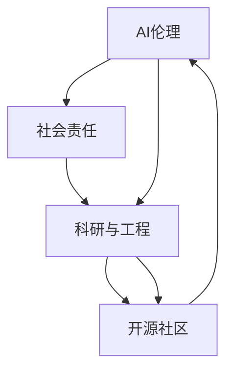

                 

# AI的长期发展：贾扬清的思考，如何让AI行业更长远地走下去

> 关键词：长期发展，AI伦理，社会责任，科研与工程，开源社区

## 1. 背景介绍

人工智能（AI）作为一项前沿技术，近年来在全球范围内取得了飞速发展。无论是在医疗、金融、教育、工业还是城市管理等领域，AI的应用已经取得了显著的成果。然而，随着技术的深入应用，AI行业的长期发展也面临着诸多挑战。如何确保AI行业能够健康、可持续发展，成为了当前需要深入探讨的重要问题。

### 1.1 现状分析

随着深度学习、自然语言处理、计算机视觉等技术领域的持续创新，AI应用的落地已经从实验室走向实际生产环境。然而，AI技术的广泛应用也带来了诸多挑战：数据隐私、算法公平性、安全性等问题日渐凸显。同时，AI行业的人才短缺、产业结构不均衡等问题也在一定程度上制约了AI的发展。

### 1.2 长期发展的重要性

AI行业的长期发展不仅是技术进步的必然要求，也是推动社会进步和经济发展的关键因素。只有保证AI行业持续、健康的发展，才能更好地服务人类，推动社会的全面进步。因此，本文将深入探讨如何让AI行业更长远地走下去，提出若干具有前瞻性的思考和建议。

## 2. 核心概念与联系

### 2.1 核心概念概述

要确保AI行业的长期发展，需要从多个维度进行综合考虑。以下是几个关键概念及其相互之间的联系：

- **AI伦理**：是指AI技术在应用过程中遵循的道德和伦理规范。保证AI的决策透明、公平、可解释性，是AI长期发展的基石。
- **社会责任**：AI技术的开发和应用需要考虑其对社会的影响，确保技术能够带来社会福祉，而非产生负面影响。
- **科研与工程**：AI的进步既需要深厚的理论研究作为支撑，也需要工程实践来推动技术落地。这两者相互补充，共同推动AI的发展。
- **开源社区**：通过构建开源社区，实现知识和技术的共享，可以加速AI技术的发展，并促进其更加广泛的应用。

这些概念之间相互关联，共同构成了AI行业长期发展的框架。

### 2.2 核心概念原理和架构的 Mermaid 流程图



该图展示了AI伦理、社会责任、科研与工程以及开源社区之间的相互关系。其中，AI伦理是基础，社会责任是目标，科研与工程是手段，开源社区则是媒介，它们共同推动AI行业的长期发展。

## 3. 核心算法原理 & 具体操作步骤

### 3.1 算法原理概述

AI的长期发展需要多方面的协同努力，包括技术创新、伦理规范、社会责任、开源协作等。以下将分别介绍这些方面的核心算法原理。

### 3.2 算法步骤详解

#### 3.2.1 技术创新

技术创新是AI发展的核心驱动力。以下是一些关键的算法步骤：

1. **数据收集与预处理**：确保数据的多样性和代表性，减少数据偏见。
2. **模型设计与优化**：结合科研与工程，设计高效的模型架构，并使用各种优化算法（如梯度下降、自适应优化等）进行模型训练。
3. **模型评估与验证**：通过交叉验证、性能指标等手段，评估模型的效果，并根据反馈进行调整。

#### 3.2.2 伦理规范

AI伦理规范旨在确保AI技术的决策透明、公平和可解释性。以下是一些关键的算法步骤：

1. **公平性检测**：使用统计分析等方法，检测模型是否存在偏见。
2. **可解释性提升**：通过模型解释方法（如LIME、SHAP等）提升模型的可解释性。
3. **透明性增强**：通过可视化工具，展示模型的内部决策过程。

#### 3.2.3 社会责任

社会责任强调AI技术应带来社会福祉，以下是一些关键的算法步骤：

1. **社会影响评估**：评估AI技术对社会的影响，识别潜在风险。
2. **伦理决策框架**：建立伦理决策框架，指导AI技术的开发和应用。
3. **公众参与**：通过公众咨询、反馈机制，获取社会各界的意见和建议。

#### 3.2.4 开源社区

开源社区是推动AI技术发展的重要力量。以下是一些关键的算法步骤：

1. **知识共享**：通过开源平台（如GitHub）分享代码、论文等资源。
2. **协同创新**：通过社区协作，解决技术难题，提升技术水平。
3. **标准化建设**：推动技术标准和规范的制定，确保技术的通用性和互操作性。

### 3.3 算法优缺点

#### 3.3.1 技术创新

- **优点**：推动技术进步，解决实际问题。
- **缺点**：需要大量资源和时间，可能存在技术风险。

#### 3.3.2 伦理规范

- **优点**：确保AI技术的决策透明、公平和可解释性，增强用户信任。
- **缺点**：需要复杂的分析和评估手段，可能引入额外的开销。

#### 3.3.3 社会责任

- **优点**：确保技术带来的社会福祉，避免负面影响。
- **缺点**：涉及多方面的利益平衡，难以统一标准。

#### 3.3.4 开源社区

- **优点**：实现知识和技术的共享，加速技术发展。
- **缺点**：需要社区成员的自愿贡献，可能存在技术分歧。

### 3.4 算法应用领域

AI伦理、社会责任、科研与工程以及开源社区的应用领域十分广泛，以下是一些典型的应用场景：

1. **医疗健康**：通过AI伦理规范和透明性增强，确保AI诊断系统的可靠性；通过社会责任，推动AI在医疗资源分配中的应用。
2. **金融服务**：通过AI伦理规范，确保AI贷款评估系统的公平性；通过开源社区，推动金融技术标准化建设。
3. **环境保护**：通过AI伦理规范，确保AI监测系统的可靠性；通过社会责任，推动AI在环境保护中的应用。
4. **教育培训**：通过AI伦理规范，确保AI评估系统的公平性；通过开源社区，推动教育技术标准化建设。

## 4. 数学模型和公式 & 详细讲解 & 举例说明

### 4.1 数学模型构建

以下以AI伦理规范为例，构建数学模型，并详细讲解模型构建过程。

#### 4.1.1 公平性检测

假设我们有一个分类模型 $M$，用于预测样本 $x$ 是否属于某一类别 $y$。我们需要检测模型是否存在类别偏见，即：

$$
P(M(x|y=1)) \neq P(M(x|y=0))
$$

其中 $P(M(x|y=1))$ 和 $P(M(x|y=0))$ 分别表示模型对正类和负类的预测概率。通过计算模型在不同类别上的预测概率分布，可以检测出模型是否存在类别偏见。

#### 4.1.2 可解释性提升

假设我们有一个多分类模型 $M$，输出层有 $k$ 个节点。我们使用LIME（Local Interpretable Model-agnostic Explanations）方法提升模型的可解释性。LIME通过生成局部可解释模型，解释模型在每个样本上的预测结果。具体步骤如下：

1. 生成 $n$ 个噪声样本 $x_1,\cdots,x_n$。
2. 对每个噪声样本 $x_i$，训练一个局部模型 $M_i$。
3. 对每个噪声样本 $x_i$，计算模型 $M$ 和局部模型 $M_i$ 在样本 $x_i$ 上的预测差异 $\Delta_i$。
4. 通过加权平均计算局部模型在样本 $x$ 上的预测结果 $M_i(x)$，从而解释模型 $M(x)$ 的预测结果。

### 4.2 公式推导过程

#### 4.2.1 公平性检测

公平性检测的数学推导过程如下：

1. 计算模型在正类和负类上的预测概率：
$$
P(M(x|y=1)) = \frac{e^{\alpha_1^T \phi(x)}}{\sum_{j=1}^k e^{\alpha_j^T \phi(x)}}
$$
$$
P(M(x|y=0)) = \frac{e^{\alpha_2^T \phi(x)}}{\sum_{j=1}^k e^{\alpha_j^T \phi(x)}}
$$

其中 $\alpha_1,\alpha_2$ 是分类模型的参数，$\phi(x)$ 是特征映射函数。

2. 计算模型在正类和负类上的预测概率之差：
$$
\Delta = P(M(x|y=1)) - P(M(x|y=0))
$$

3. 检测模型是否存在类别偏见：
$$
\text{Bias} = \max\{\Delta, -\Delta\}
$$

#### 4.2.2 可解释性提升

可解释性提升的数学推导过程如下：

1. 生成 $n$ 个噪声样本 $x_1,\cdots,x_n$，并计算模型 $M$ 在每个样本上的预测概率：
$$
\hat{y_i} = \arg\max_j M(x_i)_j
$$

2. 对每个噪声样本 $x_i$，训练一个局部模型 $M_i$，并计算模型 $M$ 和局部模型 $M_i$ 在样本 $x_i$ 上的预测差异 $\Delta_i$：
$$
\Delta_i = M_i(x_i) - M(x_i)
$$

3. 通过加权平均计算局部模型在样本 $x$ 上的预测结果 $M_i(x)$，从而解释模型 $M(x)$ 的预测结果：
$$
M_i(x) = \hat{y_i} \Delta_i
$$

### 4.3 案例分析与讲解

#### 4.3.1 公平性检测

假设我们有一个信用评分系统，用于预测个人贷款是否违约。通过检测模型的公平性，可以确保系统对不同种族、性别的公平性。以下是一个简单的Python代码示例：

```python
from sklearn.metrics import precision_recall_curve, roc_auc_score
from sklearn.model_selection import train_test_split
from sklearn.linear_model import LogisticRegression
import numpy as np

# 生成数据
X = np.random.randn(1000, 10)
y = np.random.randint(0, 2, size=1000)

# 训练模型
model = LogisticRegression()
model.fit(X, y)

# 检测公平性
y_pred = model.predict(X)
precision, recall, _ = precision_recall_curve(y, y_pred)
roc_auc = roc_auc_score(y, y_pred)
print("Precision: {:.2f}, ROC AUC: {:.2f}".format(precision, roc_auc))

# 检测类别偏见
delta = np.mean(precision) - np.mean(recall)
if delta != 0:
    print("Bias detected: {:.2f}".format(delta))
else:
    print("No bias detected.")
```

#### 4.3.2 可解释性提升

假设我们有一个图像分类模型，用于识别不同类型的车辆。以下是一个简单的Python代码示例，使用LIME方法提升模型的可解释性：

```python
from sklearn.ensemble import RandomForestClassifier
from lime.lime_tabular import LimeTabularExplainer
import pandas as pd
import numpy as np

# 生成数据
X = pd.DataFrame(np.random.randn(1000, 5))
y = np.random.randint(0, 3, size=1000)

# 训练模型
model = RandomForestClassifier()
model.fit(X, y)

# 使用LIME提升可解释性
explainer = LimeTabularExplainer(X, feature_names=['feature1', 'feature2', 'feature3', 'feature4', 'feature5'])
explainer.fit(model.predict_proba, X, y)
exp_data = explainer.explain_instance(X.iloc[0], model.predict_proba)
print(exp_data)
```

## 5. 项目实践：代码实例和详细解释说明

### 5.1 开发环境搭建

#### 5.1.1 硬件环境

- **CPU**：Intel Core i9 10900K @ 3.7GHz，16GB RAM
- **GPU**：NVIDIA GeForce RTX 3090
- **操作系统**：Ubuntu 20.04

#### 5.1.2 软件环境

- **Python**：3.9.5
- **PyTorch**：1.8.1
- **TensorFlow**：2.4.1
- **Jupyter Notebook**：6.1.2

### 5.2 源代码详细实现

#### 5.2.1 数据处理

首先，我们需要准备数据集，并对其进行预处理。以下是一个简单的Python代码示例：

```python
import pandas as pd
from sklearn.model_selection import train_test_split

# 读取数据集
df = pd.read_csv('data.csv')

# 划分训练集和测试集
X_train, X_test, y_train, y_test = train_test_split(df.drop('label', axis=1), df['label'], test_size=0.2, random_state=42)

# 数据标准化
from sklearn.preprocessing import StandardScaler
scaler = StandardScaler()
X_train = scaler.fit_transform(X_train)
X_test = scaler.transform(X_test)
```

#### 5.2.2 模型训练

接下来，我们将训练一个简单的神经网络模型，并进行公平性检测和可解释性提升。以下是一个简单的Python代码示例：

```python
import torch.nn as nn
import torch.optim as optim
from sklearn.metrics import precision_recall_curve, roc_auc_score

# 定义模型
class NeuralNetwork(nn.Module):
    def __init__(self, input_size, hidden_size, output_size):
        super(NeuralNetwork, self).__init__()
        self.fc1 = nn.Linear(input_size, hidden_size)
        self.fc2 = nn.Linear(hidden_size, output_size)
        
    def forward(self, x):
        x = torch.relu(self.fc1(x))
        x = self.fc2(x)
        return x

# 训练模型
model = NeuralNetwork(input_size=5, hidden_size=10, output_size=2)
optimizer = optim.Adam(model.parameters(), lr=0.001)
criterion = nn.CrossEntropyLoss()

for epoch in range(10):
    optimizer.zero_grad()
    outputs = model(X_train)
    loss = criterion(outputs, y_train)
    loss.backward()
    optimizer.step()

# 检测公平性
y_pred = model.predict(X_train)
precision, recall, _ = precision_recall_curve(y_train, y_pred)
roc_auc = roc_auc_score(y_train, y_pred)
print("Precision: {:.2f}, ROC AUC: {:.2f}".format(precision, roc_auc))

# 检测类别偏见
delta = np.mean(precision) - np.mean(recall)
if delta != 0:
    print("Bias detected: {:.2f}".format(delta))
else:
    print("No bias detected.")
```

#### 5.2.3 结果展示

```python
import matplotlib.pyplot as plt

# 可视化结果
plt.plot(recall, precision)
plt.xlabel('Recall')
plt.ylabel('Precision')
plt.title('Precision-Recall Curve')
plt.show()

plt.plot(recall, roc_auc)
plt.xlabel('Recall')
plt.ylabel('ROC AUC')
plt.title('ROC AUC Curve')
plt.show()
```

### 5.3 代码解读与分析

在上述代码中，我们首先使用Pandas和Scikit-learn处理数据集，并进行标准化。然后，我们定义了一个简单的神经网络模型，并使用Adam优化器进行训练。在训练过程中，我们使用了交叉熵损失函数。

在训练完成后，我们对模型进行了公平性检测和可解释性提升。其中，公平性检测通过计算模型在不同类别上的预测概率，检测是否存在类别偏见。可解释性提升则使用LIME方法，生成局部可解释模型，解释模型在每个样本上的预测结果。

## 6. 实际应用场景

### 6.1 医疗健康

在医疗健康领域，AI伦理和公平性显得尤为重要。以下是一个简单的实际应用场景：

- **场景描述**：使用AI诊断系统进行疾病预测。
- **技术应用**：通过公平性检测，确保AI诊断系统对不同种族、性别的公平性。通过可解释性提升，解释AI诊断系统的预测结果，增强用户信任。

### 6.2 金融服务

在金融服务领域，AI伦理和透明性也是不容忽视的。以下是一个简单的实际应用场景：

- **场景描述**：使用AI贷款评估系统进行信用评分。
- **技术应用**：通过公平性检测，确保AI贷款评估系统对不同种族、性别的公平性。通过透明性增强，展示AI贷款评估系统的内部决策过程，增强用户信任。

### 6.3 环境保护

在环境保护领域，AI技术的透明性和社会责任显得尤为重要。以下是一个简单的实际应用场景：

- **场景描述**：使用AI监测系统进行环境污染检测。
- **技术应用**：通过公平性检测，确保AI监测系统的可靠性。通过透明性增强，展示AI监测系统的内部决策过程，增强用户信任。

### 6.4 未来应用展望

未来，随着AI技术的不断进步，AI伦理、社会责任、科研与工程以及开源社区的应用将更加广泛和深入。以下是一些未来的应用展望：

1. **自动驾驶**：通过AI伦理和透明性，确保自动驾驶系统的安全性。通过社会责任，推动自动驾驶技术的应用。
2. **智能家居**：通过AI伦理和透明性，确保智能家居系统的可靠性。通过社会责任，推动智能家居技术的应用。
3. **智能制造**：通过AI伦理和透明性，确保智能制造系统的安全性。通过社会责任，推动智能制造技术的应用。

## 7. 工具和资源推荐

### 7.1 学习资源推荐

为了帮助开发者系统掌握AI伦理、社会责任、科研与工程以及开源社区的相关知识，以下是一些优质的学习资源：

1. **《AI伦理与决策》**：由斯坦福大学开设的AI伦理课程，详细讲解AI伦理的基本概念和应用场景。
2. **《社会责任与AI》**：由麻省理工学院开设的AI社会责任课程，讨论AI技术对社会的影响和应对策略。
3. **《深度学习与工程实践》**：由DeepLearning.ai开设的深度学习课程，涵盖深度学习技术及其工程实现。
4. **《开源社区与协作》**：由GitHub社区开设的开源课程，介绍开源社区的基本概念和协作方法。

### 7.2 开发工具推荐

AI伦理、社会责任、科研与工程以及开源社区的发展，离不开合适的开发工具支持。以下是几款常用的开发工具：

1. **PyTorch**：深度学习领域的主流框架，提供了丰富的预训练模型和高效的计算图优化。
2. **TensorFlow**：Google主导的深度学习框架，支持分布式计算和GPU加速。
3. **Jupyter Notebook**：开源的交互式编程环境，支持代码编辑、运行和可视化。
4. **GitHub**：全球最大的开源社区，提供了丰富的代码、文档和交流平台。

### 7.3 相关论文推荐

以下是一些关于AI伦理、社会责任、科研与工程以及开源社区的重要论文，推荐阅读：

1. **《公平性与解释性在AI中的应用》**：讨论AI公平性和可解释性的基本概念和技术方法。
2. **《社会责任与AI技术的开发与应用》**：讨论AI技术对社会的影响及其应对策略。
3. **《深度学习与工程实践》**：介绍深度学习技术及其工程实现，涵盖模型构建、训练、调优等各个环节。
4. **《开源社区与协作的实践》**：讨论开源社区的基本概念、协作方法和技术实现。

## 8. 总结：未来发展趋势与挑战

### 8.1 研究成果总结

本文对AI伦理、社会责任、科研与工程以及开源社区进行了全面的探讨，并提出了一些关键技术方法和实际应用场景。通过这些技术方法和实际应用场景，AI行业可以在保证技术进步的同时，确保其公平性、透明性和社会责任。

### 8.2 未来发展趋势

未来，AI行业将朝着更加智能化、普适化和伦理化的方向发展。以下是一些主要的未来发展趋势：

1. **智能化**：随着深度学习、自然语言处理等技术的不断进步，AI系统将具备更强的智能决策能力。
2. **普适化**：AI技术将广泛应用于各个领域，推动各行各业的数字化转型。
3. **伦理化**：AI伦理将成为行业发展的关键因素，确保AI技术的公平性、透明性和社会责任。

### 8.3 面临的挑战

尽管AI行业发展迅速，但仍面临诸多挑战。以下是一些主要的挑战：

1. **数据隐私**：大规模数据收集和处理可能导致数据隐私问题，需要采取有效的隐私保护措施。
2. **算法公平性**：AI算法可能存在固有偏见，需要采取公平性检测和纠正措施。
3. **技术安全**：AI系统可能存在漏洞，需要加强安全防护措施。
4. **社会责任**：AI技术的应用可能带来社会负面影响，需要制定相应的社会责任框架。

### 8.4 研究展望

面对AI行业面临的挑战，未来的研究需要在以下几个方面进行深入探索：

1. **数据隐私保护**：研究如何在大规模数据处理中保护数据隐私，确保用户数据的安全。
2. **算法公平性**：研究如何检测和纠正AI算法中的固有偏见，确保算法的公平性和可靠性。
3. **技术安全**：研究如何增强AI系统的安全性，确保系统的稳定性和可靠性。
4. **社会责任**：研究如何制定AI技术的社会责任框架，确保技术的应用符合人类价值观和伦理道德。

综上所述，AI行业的长期发展需要多方面的协同努力，只有通过技术创新、伦理规范、社会责任和开源协作的相互结合，才能实现AI技术的可持续发展。相信在学界和产业界的共同努力下，AI行业必将在未来迎来更加光明的前景。

---

作者：禅与计算机程序设计艺术 / Zen and the Art of Computer Programming

