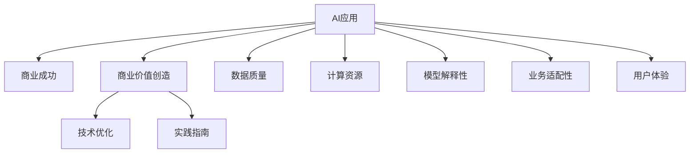

                 

# AI行业的未来：回到商业成功，如何让AI真正创造商业价值

> 关键词：AI应用,商业成功,人工智能落地,商业价值创造,技术优化,实践指南

## 1. 背景介绍

### 1.1 问题由来
近年来，人工智能(AI)技术在各个行业的应用越来越广泛，从金融、医疗、零售、到制造、教育等，AI的触角已经深入各行各业的方方面面。然而，尽管AI技术在学术界取得了显著的突破，但在实际商业应用中，仍面临着诸多挑战。如何有效部署和利用AI技术，使其真正带来商业价值，成为当前业界的热点话题。

AI技术的落地应用需要解决一系列复杂的问题，包括数据质量、计算资源、模型训练和部署、业务需求对接等。这些问题既需要深厚的技术储备，也需要丰富的行业经验。传统上，AI技术在实验室或小规模应用场景中表现优异，但一旦大规模部署到实际业务场景，往往会出现各种各样的问题。这些问题包括但不限于：

- 数据收集和清洗困难：AI模型需要大量的高质量数据进行训练，但现实中的数据往往存在缺失、噪声、偏见等问题，收集和清洗这些数据非常困难。
- 计算资源不足：训练和部署大规模AI模型需要大量的计算资源，包括高性能计算设备、存储系统等，这对中小企业来说是一大负担。
- 模型解释性不足：AI模型通常是"黑盒"系统，难以解释其决策过程，这给业务对接和用户信任带来了挑战。
- 业务需求复杂：AI技术需要与具体的业务场景深度结合，才能发挥最大效用。但业务需求千差万别，如何适配这些需求是一个复杂的任务。
- 用户接受度低：用户对AI技术的接受度不一，如何在用户体验和商业效益间找到平衡点，是一个重要的课题。

这些问题往往互相关联，解决一个问题的过程中可能会引发新的问题。因此，如何高效地将AI技术转化为商业价值，是当前AI行业亟待解决的核心问题。

### 1.2 问题核心关键点
为了让AI技术真正创造商业价值，我们需要关注以下几个关键点：

- **数据质量**：高质量、有标签的数据是AI模型的基础，数据的缺失和噪声将直接影响模型的性能。
- **计算资源**：高效的计算资源管理是保障模型训练和推理效率的关键，需要考虑资源优化、成本控制等问题。
- **模型解释性**：模型应具备良好的解释性，方便业务理解和对接。
- **业务适配性**：模型应能灵活适配不同的业务场景，满足多样化需求。
- **用户体验**：模型应在提升业务效率的同时，提升用户体验，让用户感知到AI的益处。

这些关键点互相关联，共同决定了AI技术能否成功落地，并在商业上取得成功。

## 2. 核心概念与联系

### 2.1 核心概念概述

为了更好地理解如何让AI技术真正创造商业价值，本节将介绍几个关键概念：

- **AI应用**：指将AI技术应用于特定业务场景，解决具体问题的过程。AI应用需要考虑技术适配性、资源利用率、用户体验等多个方面。
- **商业成功**：指AI应用通过提高业务效率、降低成本、提升用户体验等手段，实现经济价值的提升，包括直接收益、市场份额、客户满意度等。
- **商业价值创造**：指AI应用通过创新和优化，为公司带来新的增长点，实现持续性的商业价值增长。
- **技术优化**：指在AI应用开发过程中，不断进行技术改进和优化，提升模型性能和应用效果。
- **实践指南**：指在AI应用部署和实施过程中，提供详细的技术和方法指导，帮助企业顺利实现AI商业化。

这些核心概念之间的逻辑关系可以通过以下Mermaid流程图来展示：



这个流程图展示了AI应用转化为商业成功的过程：

1. 高质量的数据是AI应用的基石。
2. 高效的计算资源管理是保障AI应用高效运行的必要条件。
3. 模型解释性和用户接受度直接影响AI应用的商业价值。
4. 业务适配性决定了AI应用能否满足多样化需求。
5. 用户体验是AI应用成功的关键因素。
6. 技术优化和实践指南是提升AI应用效果的有效手段。

通过理解这些核心概念，我们可以更好地把握AI应用开发和部署的关键点，从而在商业上取得成功。

## 3. 核心算法原理 & 具体操作步骤

### 3.1 算法原理概述

为了让AI应用真正创造商业价值，我们首先需要深入理解AI应用的原理和步骤。以下是对核心算法原理的概述：

- **数据收集与预处理**：获取高质量的数据，并进行清洗、标注等预处理工作。数据质量直接影响模型的性能。
- **模型训练与优化**：使用高质量数据训练AI模型，并通过交叉验证、调参等技术优化模型性能。
- **部署与集成**：将训练好的模型部署到实际业务系统中，并与业务系统进行深度集成，实现功能对齐。
- **效果评估与反馈**：对AI应用进行效果评估，并根据业务反馈进行迭代优化，提升用户体验和商业价值。

### 3.2 算法步骤详解

以下是AI应用开发过程中，每一步的具体操作步骤：

**Step 1: 数据收集与预处理**

1. **数据来源**：确定数据来源，包括企业内部数据、公开数据集、网络爬虫等。
2. **数据清洗**：处理数据中的缺失值、噪声、异常值等，确保数据质量。
3. **数据标注**：对数据进行标注，使其符合模型训练要求。
4. **数据集划分**：将数据集划分为训练集、验证集和测试集，确保模型的泛化能力。

**Step 2: 模型训练与优化**

1. **选择模型架构**：根据任务类型选择合适的模型架构，如CNN、RNN、Transformer等。
2. **训练与调参**：使用训练集进行模型训练，并通过交叉验证、网格搜索等技术调整超参数。
3. **模型验证**：在验证集上评估模型性能，确保模型泛化能力。
4. **模型优化**：使用正则化、Dropout等技术提升模型泛化能力，防止过拟合。

**Step 3: 部署与集成**

1. **模型导出**：将训练好的模型导出为轻量级模型格式，便于部署。
2. **系统集成**：将模型集成到业务系统中，并与业务系统进行API接口、数据格式等适配。
3. **性能测试**：在真实业务场景中测试模型性能，确保模型稳定性。
4. **监控与优化**：建立监控系统，实时监控模型性能，并根据业务反馈进行迭代优化。

**Step 4: 效果评估与反馈**

1. **效果评估**：根据业务目标进行效果评估，如精度、召回率、用户满意度等。
2. **反馈与优化**：根据业务反馈进行模型优化，提升用户体验和商业价值。
3. **持续迭代**：根据业务需求和市场变化，持续迭代优化模型，提升商业价值。

### 3.3 算法优缺点

基于上述算法步骤，AI应用在商业落地过程中，有以下优缺点：

**优点**：

1. **提高业务效率**：AI应用通过自动化、智能化处理，显著提高业务效率，减少人工成本。
2. **提升用户体验**：AI应用可以提供个性化、定制化的服务，提升用户体验，增加用户粘性。
3. **带来新的增长点**：AI应用可以带来新的业务场景，推动企业收入增长。
4. **提升决策质量**：AI应用提供数据驱动的决策支持，提升决策质量。

**缺点**：

1. **高成本投入**：开发和部署AI应用需要高昂的计算资源和专业人才，成本较高。
2. **模型复杂性**：AI模型通常比较复杂，需要深入理解和调试，技术门槛较高。
3. **数据依赖**：AI应用高度依赖高质量的数据，数据获取和处理成本高。
4. **用户接受度低**：用户对AI技术接受度不一，可能需要较长时间的用户教育和市场推广。

尽管存在这些缺点，但AI应用在商业上的优势仍然显著，尤其是在数据驱动、自动化需求日益增长的今天。如何平衡这些优缺点，找到最适合企业的AI应用策略，是当前AI行业需要解决的核心问题。

### 3.4 算法应用领域

AI应用在多个领域均有广泛应用，以下是一些主要应用领域：

- **金融领域**：使用AI技术进行风险控制、反欺诈、客户服务等。
- **医疗领域**：使用AI技术进行疾病诊断、治疗方案推荐、健康管理等。
- **零售领域**：使用AI技术进行需求预测、库存管理、个性化推荐等。
- **制造领域**：使用AI技术进行质量检测、设备维护、供应链优化等。
- **教育领域**：使用AI技术进行个性化教学、作业批改、学情分析等。
- **客服领域**：使用AI技术进行智能客服、舆情分析、智能推荐等。
- **智能家居**：使用AI技术进行语音识别、智能控制、数据分析等。
- **物流领域**：使用AI技术进行路径优化、配送调度、异常检测等。

这些应用领域展示了AI技术的强大潜力，未来还将有更多领域迎来AI应用的普及。

## 4. 数学模型和公式 & 详细讲解 & 举例说明

### 4.1 数学模型构建

为了更好地理解AI应用的原理，我们将使用数学语言对其中的核心概念进行详细讲解。

假设一个AI应用的任务是分类，输入为 $x$，输出为 $y$，模型为 $M_{\theta}$，其中 $\theta$ 为模型参数。模型的损失函数为 $L(M_{\theta}, x, y)$，优化目标为最小化损失函数：

$$
\theta^* = \mathop{\arg\min}_{\theta} \sum_{i=1}^N L(M_{\theta}, x_i, y_i)
$$

其中 $N$ 为样本数量。在实际应用中，我们通常使用梯度下降等优化算法来最小化损失函数：

$$
\theta \leftarrow \theta - \eta \nabla_{\theta}L(M_{\theta}, x, y)
$$

其中 $\eta$ 为学习率，$\nabla_{\theta}L(M_{\theta}, x, y)$ 为损失函数对模型参数的梯度。

### 4.2 公式推导过程

以下我们将以线性回归为例，推导优化算法的数学原理。

假设模型的线性形式为 $M_{\theta}(x) = \theta_0 + \sum_{i=1}^d \theta_i x_i$，其中 $d$ 为特征维度。输入样本 $(x_i, y_i)$，损失函数为均方误差损失：

$$
L(M_{\theta}, x, y) = \frac{1}{2N} \sum_{i=1}^N (y_i - M_{\theta}(x_i))^2
$$

对模型参数 $\theta$ 求导，得到梯度：

$$
\nabla_{\theta}L(M_{\theta}, x, y) = \frac{1}{N} \sum_{i=1}^N (y_i - M_{\theta}(x_i)) x_i
$$

使用梯度下降更新模型参数：

$$
\theta \leftarrow \theta - \eta \nabla_{\theta}L(M_{\theta}, x, y)
$$

其中 $\eta$ 为学习率，通常从 $0.01$ 开始，逐步减小。

### 4.3 案例分析与讲解

以金融领域的信用风险评估为例，分析AI应用的实际应用场景。

**数据收集与预处理**：

- 数据来源：获取银行的客户交易数据、信用记录等。
- 数据清洗：处理缺失值、异常值，确保数据质量。
- 数据标注：将客户数据标注为高风险或低风险客户。

**模型训练与优化**：

- 选择模型：使用随机森林、深度神经网络等模型。
- 训练与调参：使用交叉验证、网格搜索等技术调整超参数。
- 模型验证：在验证集上评估模型性能，确保模型泛化能力。
- 模型优化：使用正则化、Dropout等技术提升模型泛化能力，防止过拟合。

**部署与集成**：

- 模型导出：将训练好的模型导出为轻量级模型格式，便于部署。
- 系统集成：将模型集成到银行的信贷审批系统中，并与系统进行API接口、数据格式等适配。
- 性能测试：在真实信贷场景中测试模型性能，确保模型稳定性。
- 监控与优化：建立监控系统，实时监控模型性能，并根据业务反馈进行迭代优化。

**效果评估与反馈**：

- 效果评估：根据业务目标进行效果评估，如坏账率、审批时间等。
- 反馈与优化：根据业务反馈进行模型优化，提升用户体验和商业价值。
- 持续迭代：根据业务需求和市场变化，持续迭代优化模型，提升商业价值。

## 5. 项目实践：代码实例和详细解释说明

### 5.1 开发环境搭建

在进行AI应用开发前，我们需要准备好开发环境。以下是使用Python进行TensorFlow开发的环境配置流程：

1. 安装Anaconda：从官网下载并安装Anaconda，用于创建独立的Python环境。

2. 创建并激活虚拟环境：
```bash
conda create -n tensorflow-env python=3.8 
conda activate tensorflow-env
```

3. 安装TensorFlow：根据CUDA版本，从官网获取对应的安装命令。例如：
```bash
conda install tensorflow tensorflow-estimator tensorflow-probability -c tensorflow
```

4. 安装各类工具包：
```bash
pip install numpy pandas scikit-learn matplotlib tqdm jupyter notebook ipython
```

完成上述步骤后，即可在`tensorflow-env`环境中开始AI应用开发。

### 5.2 源代码详细实现

这里我们以金融领域的信用风险评估为例，给出使用TensorFlow对线性回归模型进行训练和评估的PyTorch代码实现。

首先，定义数据处理函数：

```python
import pandas as pd
from sklearn.model_selection import train_test_split
from sklearn.preprocessing import StandardScaler

def load_data():
    df = pd.read_csv('credit_data.csv')
    X = df.drop(['default'], axis=1)
    y = df['default']
    X_train, X_test, y_train, y_test = train_test_split(X, y, test_size=0.2, random_state=42)
    scaler = StandardScaler()
    X_train = scaler.fit_transform(X_train)
    X_test = scaler.transform(X_test)
    return X_train, X_test, y_train, y_test
```

然后，定义模型和优化器：

```python
import tensorflow as tf
from tensorflow import keras

X_train, X_test, y_train, y_test = load_data()

model = keras.Sequential([
    keras.layers.Dense(64, activation='relu'),
    keras.layers.Dense(1, activation='sigmoid')
])

optimizer = tf.keras.optimizers.Adam(learning_rate=0.001)
```

接着，定义训练和评估函数：

```python
def train_epoch(model, dataset, batch_size, optimizer):
    model.compile(loss='binary_crossentropy', optimizer=optimizer, metrics=['accuracy'])
    model.fit(dataset, batch_size=batch_size, epochs=10, validation_data=(X_test, y_test))

def evaluate(model, X_test, y_test):
    loss, accuracy = model.evaluate(X_test, y_test)
    print(f'Test loss: {loss:.3f}')
    print(f'Test accuracy: {accuracy:.3f}')
```

最后，启动训练流程并在测试集上评估：

```python
X_train = X_train.reshape(X_train.shape[0], -1)
y_train = y_train.reshape(y_train.shape[0],)

X_test = X_test.reshape(X_test.shape[0], -1)
y_test = y_test.reshape(y_test.shape[0],)

train_epoch(model, (X_train, y_train), batch_size=64, optimizer=optimizer)

evaluate(model, X_test, y_test)
```

以上就是使用TensorFlow进行线性回归模型训练和评估的完整代码实现。可以看到，TensorFlow提供了强大的高层次API，使得模型构建和训练过程非常简洁高效。

### 5.3 代码解读与分析

让我们再详细解读一下关键代码的实现细节：

**load_data函数**：
- 从CSV文件中加载数据，并进行特征和标签的划分。
- 对特征进行标准化处理，确保数据质量。

**模型定义**：
- 使用Sequential模型，构建一个包含两个Dense层的神经网络。
- 使用Adam优化器，设置学习率为0.001。

**train_epoch函数**：
- 编译模型，指定损失函数、优化器和评价指标。
- 使用fit方法进行模型训练，指定批次大小、迭代次数和验证数据。

**evaluate函数**：
- 使用evaluate方法评估模型在测试集上的性能，并打印输出。

**训练流程**：
- 对训练数据进行重新形状处理，确保模型能够接收。
- 在训练集上训练模型，并在测试集上评估性能。

可以看到，TensorFlow提供了强大的高层次API，使得模型构建和训练过程非常简洁高效。开发者可以将更多精力放在数据处理、模型改进等高层逻辑上，而不必过多关注底层的实现细节。

当然，工业级的系统实现还需考虑更多因素，如模型的保存和部署、超参数的自动搜索、更灵活的任务适配层等。但核心的AI应用开发流程基本与此类似。

## 6. 实际应用场景

### 6.1 智能客服系统

智能客服系统是AI应用的重要落地场景之一。传统客服系统需要配备大量人力，高峰期响应缓慢，且一致性和专业性难以保证。使用AI技术，可以构建智能客服系统，实现7x24小时不间断服务，快速响应客户咨询，提供自然流畅的语言服务。

在技术实现上，可以收集企业内部的历史客服对话记录，将问题和最佳答复构建成监督数据，在此基础上对预训练模型进行微调。微调后的模型能够自动理解用户意图，匹配最合适的答案模板进行回复。对于客户提出的新问题，还可以接入检索系统实时搜索相关内容，动态组织生成回答。如此构建的智能客服系统，能大幅提升客户咨询体验和问题解决效率。

### 6.2 金融舆情监测

金融机构需要实时监测市场舆论动向，以便及时应对负面信息传播，规避金融风险。传统的人工监测方式成本高、效率低，难以应对网络时代海量信息爆发的挑战。使用AI技术，可以构建金融舆情监测系统，自动识别新闻、报道、评论等文本内容，判断其情感倾向和主题，快速预警潜在的金融风险。

具体而言，可以收集金融领域相关的新闻、报道、评论等文本数据，并对其进行主题标注和情感标注。在此基础上对预训练语言模型进行微调，使其能够自动判断文本属于何种主题，情感倾向是正面、中性还是负面。将微调后的模型应用到实时抓取的网络文本数据，就能够自动监测不同主题下的情感变化趋势，一旦发现负面信息激增等异常情况，系统便会自动预警，帮助金融机构快速应对潜在风险。

### 6.3 个性化推荐系统

当前的推荐系统往往只依赖用户的历史行为数据进行物品推荐，无法深入理解用户的真实兴趣偏好。使用AI技术，可以构建个性化推荐系统，更好地挖掘用户行为背后的语义信息，从而提供更精准、多样的推荐内容。

在实践中，可以收集用户浏览、点击、评论、分享等行为数据，提取和用户交互的物品标题、描述、标签等文本内容。将文本内容作为模型输入，用户的后续行为（如是否点击、购买等）作为监督信号，在此基础上微调预训练语言模型。微调后的模型能够从文本内容中准确把握用户的兴趣点。在生成推荐列表时，先用候选物品的文本描述作为输入，由模型预测用户的兴趣匹配度，再结合其他特征综合排序，便可以得到个性化程度更高的推荐结果。

### 6.4 未来应用展望

随着AI技术的不断进步，AI应用在各行业领域的应用前景将更加广阔。未来，AI应用将更多地深入到生产和生活中，推动各行各业的数字化、智能化转型。

在智慧医疗领域，AI技术将应用于疾病诊断、治疗方案推荐、健康管理等，提升医疗服务的智能化水平，辅助医生诊疗，加速新药开发进程。

在智能教育领域，AI技术将应用于个性化教学、作业批改、学情分析等，因材施教，促进教育公平，提高教学质量。

在智慧城市治理中，AI技术将应用于城市事件监测、舆情分析、应急指挥等环节，提高城市管理的自动化和智能化水平，构建更安全、高效的未来城市。

此外，在企业生产、社会治理、文娱传媒等众多领域，AI应用也将不断涌现，为经济社会发展注入新的动力。相信随着技术的日益成熟，AI应用必将在更广阔的应用领域大放异彩，深刻影响人类的生产生活方式。

## 7. 工具和资源推荐

### 7.1 学习资源推荐

为了帮助开发者系统掌握AI应用开发的理论基础和实践技巧，这里推荐一些优质的学习资源：

1. 《深度学习》系列书籍：Ian Goodfellow等人所著，全面介绍了深度学习的理论基础和应用实践。
2. CS231n《深度学习计算机视觉》课程：斯坦福大学开设的计算机视觉经典课程，涵盖深度学习在图像、视频处理中的应用。
3. Coursera《机器学习》课程：Andrew Ng教授的开课，介绍了机器学习的基本概念和算法。
4. TensorFlow官方文档：TensorFlow的官方文档，提供了详尽的API介绍和使用示例。
5. PyTorch官方文档：PyTorch的官方文档，提供了丰富的教程和代码示例。
6. Kaggle数据集和竞赛：Kaggle平台提供了大量的数据集和竞赛任务，可以帮助开发者进行实战练习。
7. arXiv论文库：arXiv是计算机科学领域的预印本库，提供了大量的前沿研究成果，可以供开发者学习和借鉴。

通过对这些资源的学习实践，相信你一定能够快速掌握AI应用的精髓，并用于解决实际的业务问题。

### 7.2 开发工具推荐

高效的开发离不开优秀的工具支持。以下是几款用于AI应用开发的常用工具：

1. TensorFlow：由Google主导开发的开源深度学习框架，生产部署方便，适合大规模工程应用。提供了丰富的API接口和优化工具。
2. PyTorch：由Facebook主导开发的开源深度学习框架，灵活动态的计算图，适合快速迭代研究。
3. Jupyter Notebook：一个交互式的Python开发环境，支持代码编写、数据处理、可视化等功能，非常适合AI应用的开发和调试。
4. Scikit-learn：一个开源机器学习库，提供了简单易用的API，支持各类经典机器学习算法。
5. Keras：一个高层次的深度学习API，封装了TensorFlow和Theano等底层框架，适合快速原型开发。
6. Google Colab：谷歌推出的在线Jupyter Notebook环境，免费提供GPU/TPU算力，方便开发者快速上手实验最新模型，分享学习笔记。
7. Weights & Biases：模型训练的实验跟踪工具，可以记录和可视化模型训练过程中的各项指标，方便对比和调优。

合理利用这些工具，可以显著提升AI应用开发的效率，加快创新迭代的步伐。

### 7.3 相关论文推荐

AI应用在各行业领域的应用研究，已经在学术界和工业界取得了丰硕的成果。以下是几篇奠基性的相关论文，推荐阅读：

1. 《Attention is All You Need》：提出Transformer结构，开启了NLP领域的预训练大模型时代。
2. 《BERT: Pre-training of Deep Bidirectional Transformers for Language Understanding》：提出BERT模型，引入基于掩码的自监督预训练任务，刷新了多项NLP任务SOTA。
3. 《Google's AI Challenges: Introduction and Overview》：Google提出的AI挑战任务，涵盖了机器学习、计算机视觉、自然语言处理等多个领域，推动了AI技术的快速发展。
4. 《Scalable Deep Learning with SQL》：提出基于SQL的深度学习框架，支持大规模数据集的高效处理和分析。
5. 《Deep Learning for Healthcare》：综述了深度学习在医疗领域的应用，包括疾病诊断、治疗方案推荐、健康管理等。
6. 《AI for Personalized Medicine》：提出AI技术在个性化医疗中的应用，包括基因组分析、药物开发、患者监测等。

这些论文代表了大规模AI应用的研究方向。通过学习这些前沿成果，可以帮助研究者把握学科前进方向，激发更多的创新灵感。

## 8. 总结：未来发展趋势与挑战

### 8.1 总结

本文对AI应用的开发和落地过程进行了系统梳理。首先阐述了AI应用开发的核心步骤和关键点，明确了数据质量、计算资源、模型解释性、业务适配性、用户体验等因素的重要性。其次，通过数学模型和公式推导，详细讲解了AI应用的数学原理和核心算法。最后，提供了详细的AI应用开发实践指南和工具资源推荐，帮助开发者顺利实现AI应用的商业化。

通过本文的系统梳理，可以看到，AI应用开发和落地需要考虑多个维度，涉及技术、数据、业务等多个方面。只有在各个环节协同发力，才能确保AI应用的成功落地，并创造显著的商业价值。

### 8.2 未来发展趋势

展望未来，AI应用将呈现以下几个发展趋势：

1. **数据治理与应用融合**：数据治理将贯穿AI应用的全生命周期，提升数据质量，保障AI应用的稳定性和可靠性。
2. **模型可解释性增强**：通过引入因果分析和博弈论工具，增强AI模型的可解释性和逻辑性，提升用户信任和接受度。
3. **多模态融合与扩展**：未来的AI应用将更多地融合多模态数据，如视觉、语音、文本等，提升对现实世界的理解和建模能力。
4. **隐私与安全保护**：随着AI应用的普及，隐私保护和数据安全问题将更加凸显，如何保护用户隐私和数据安全，将成为AI应用推广的关键。
5. **实时化与自动化**：未来的AI应用将更加注重实时性和自动化，提升业务响应速度和效率。
6. **场景化与定制化**：AI应用将更多地根据具体业务场景进行定制化设计，提升应用效果和用户体验。
7. **国际化与多语言支持**：未来的AI应用将更加注重国际化，支持多语言和多文化背景的用户，扩展全球市场。

以上趋势凸显了AI应用的广阔前景。这些方向的探索发展，必将进一步提升AI应用的性能和应用范围，为人类认知智能的进化带来深远影响。

### 8.3 面临的挑战

尽管AI应用在各行业领域已经取得了显著成果，但在落地过程中，仍面临诸多挑战：

1. **数据获取与处理**：高质量数据的获取和处理是AI应用开发的基础，但在某些行业领域，获取高标注数据仍然困难重重。
2. **计算资源限制**：训练和部署大规模AI模型需要大量的计算资源，中小企业难以负担。
3. **模型复杂性与解释性**：AI模型的复杂性往往导致难以解释其决策过程，降低了用户信任和接受度。
4. **业务适配性差**：AI模型通常难以直接适配各种业务场景，需要针对特定业务需求进行优化。
5. **用户体验不足**：AI应用在提升业务效率的同时，可能忽略了用户的主观体验，导致用户反感。
6. **伦理与安全问题**：AI应用在提升效率的同时，也可能引发伦理与安全问题，如隐私泄露、决策偏见等。

这些挑战是AI应用落地过程中必须面对的问题，需要通过技术改进和政策引导，逐步克服。

### 8.4 研究展望

未来的AI应用研究将聚焦于以下几个方向：

1. **数据治理与隐私保护**：研究高效的数据治理与隐私保护技术，确保数据安全与用户隐私。
2. **模型解释性与可解释性**：研究模型解释性技术，提升用户信任和接受度。
3. **多模态融合与扩展**：研究多模态融合技术，提升AI应用对现实世界的理解和建模能力。
4. **实时化与自动化**：研究实时化与自动化技术，提升AI应用的响应速度和效率。
5. **场景化与定制化**：研究场景化与定制化技术，提升AI应用的效果和用户体验。
6. **国际化与多语言支持**：研究国际化与多语言支持技术，拓展AI应用的全球市场。

这些研究方向将推动AI应用向更加智能化、普适化方向发展，实现更广泛的应用和更深入的业务落地。

## 9. 附录：常见问题与解答

**Q1：AI应用开发过程中如何保证数据质量？**

A: 保证数据质量是AI应用开发的核心任务之一。以下是一些常见的方法：

1. **数据清洗**：处理数据中的缺失值、噪声、异常值等，确保数据质量。
2. **数据标注**：对数据进行标注，使其符合模型训练要求。
3. **数据增强**：通过数据增强技术，如回译、近义替换等，扩充训练集，提升数据多样性。
4. **数据标注**：对数据进行标注，使其符合模型训练要求。

**Q2：AI应用开发过程中如何选择合适的计算资源？**

A: 选择合适的计算资源是AI应用开发的必要条件。以下是一些常见的方法：

1. **资源优化**：使用梯度积累、混合精度训练、模型并行等技术，优化计算资源的使用。
2. **云资源**：使用云平台提供的计算资源，如AWS、Google Cloud、阿里云等，灵活调整资源配置。
3. **本地资源**：使用本地GPU、TPU等高性能计算设备，提高模型训练和推理速度。

**Q3：AI应用开发过程中如何提升模型的解释性？**

A: 提升模型的解释性是AI应用开发的重要任务之一。以下是一些常见的方法：

1. **可解释模型**：选择可解释性强的模型架构，如线性模型、决策树等。
2. **特征解释**：通过特征重要性分析、LIME、SHAP等技术，解释模型的特征贡献度。
3. **模型可视化**：使用可视化技术，如热力图、特征图等，展示模型的决策过程。
4. **业务对接**：通过业务对接，将模型的决策过程和结果转换为业务可理解的形式。

**Q4：AI应用开发过程中如何适配业务需求？**

A: 适配业务需求是AI应用开发的关键任务之一。以下是一些常见的方法：

1. **模型定制化**：根据业务需求，调整模型的架构和超参数。
2. **特征工程**：针对业务需求，进行特征选择和特征工程，提升模型效果。
3. **场景化设计**：根据具体业务场景，设计定制化的模型和服务。
4. **迭代优化**：根据业务反馈，不断迭代优化模型和应用，提升用户体验和商业价值。

**Q5：AI应用开发过程中如何提升用户体验？**

A: 提升用户体验是AI应用开发的重要目标之一。以下是一些常见的方法：

1. **个性化服务**：根据用户行为和偏好，提供个性化服务，提升用户体验。
2. **界面设计**：设计简洁、易用的用户界面，提升用户操作体验。
3. **即时反馈**：提供即时反馈，如进度展示、提示信息等，提升用户满意度。
4. **用户教育**：通过用户教育，提升用户对AI技术的接受度和理解。

**Q6：AI应用开发过程中如何保障数据安全与隐私？**

A: 保障数据安全与隐私是AI应用开发的重要任务之一。以下是一些常见的方法：

1. **数据脱敏**：对敏感数据进行脱敏处理，确保数据安全。
2. **权限控制**：设置严格的权限控制，防止未经授权的访问。
3. **加密技术**：使用加密技术，保护数据在传输和存储过程中的安全。
4. **隐私保护**：采用隐私保护技术，如差分隐私、联邦学习等，确保用户隐私。

这些方法可以帮助开发者在保证数据质量、提升模型解释性、适配业务需求、提升用户体验的同时，保障数据安全与隐私。

---

作者：禅与计算机程序设计艺术 / Zen and the Art of Computer Programming

