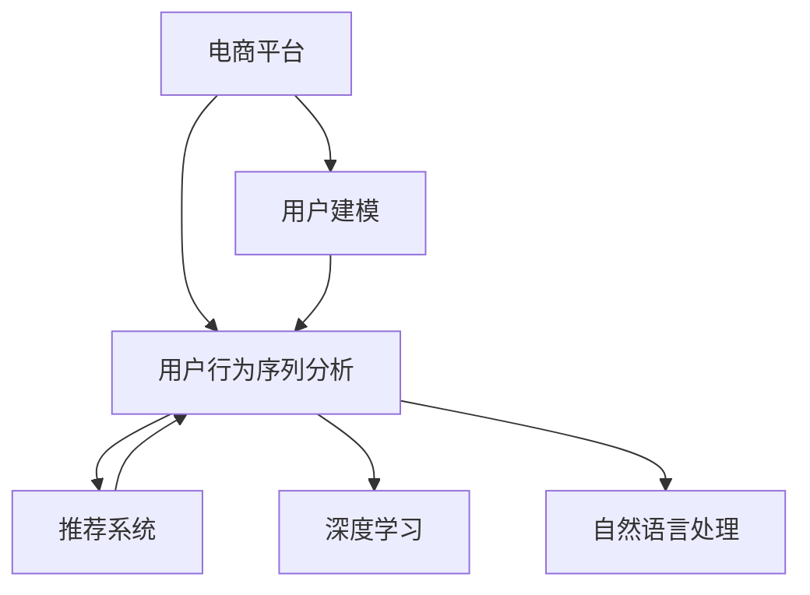

                 

# AI赋能的电商平台用户行为序列分析

> 关键词：电商平台,用户行为序列分析,用户建模,推荐系统,深度学习,自然语言处理

## 1. 背景介绍

### 1.1 问题由来
随着电子商务的迅速发展，电商平台的用户行为数据日益庞大，用户如何做出购买决策已成为各大电商平台亟待解决的关键问题。电商平台通过深入分析用户行为数据，可以更好地理解用户需求，提供个性化推荐服务，从而提升用户体验和销售转化率。

用户行为序列分析，是指对用户在电商平台的浏览、搜索、购买等行为数据进行建模和分析，以预测用户后续行为，优化商品推荐和广告投放。这一过程离不开对用户行为数据的深度学习和自然语言处理技术的广泛应用。

### 1.2 问题核心关键点
基于深度学习和自然语言处理技术对电商平台用户行为序列进行建模，并结合推荐系统算法实现个性化推荐，已成为当前电商平台优化用户体验、提升销售业绩的重要手段。其核心关键点包括：

1. 用户行为数据的采集和处理。
2. 用户行为序列的建模和表示。
3. 个性化推荐模型的构建和优化。
4. 推荐结果的实时生成和展示。

本文将深入探讨基于深度学习技术对电商平台用户行为序列进行建模和分析的原理、方法和实践，并结合推荐系统技术，提出一套完整的电商用户行为分析与推荐优化方案。

## 2. 核心概念与联系

### 2.1 核心概念概述

为更好地理解电商平台用户行为序列分析的原理与方法，本节将介绍几个核心概念：

- **电商平台**：指线上销售商品和服务的平台，如淘宝、京东、亚马逊等。电商平台的数据具有用户行为稠密、数据维度高、实时性强等特点。
- **用户行为序列分析**：通过对用户历史行为数据进行序列建模，预测用户未来行为，如购买意向、浏览行为等。常见的方法包括时间序列分析、序列建模、时序预测等。
- **用户建模**：构建用户行为和属性特征的表示模型，用于刻画用户兴趣和偏好。
- **推荐系统**：使用用户行为序列和模型，为用户推荐感兴趣的商品或服务，以提高用户满意度和转化率。

- **深度学习**：一类基于神经网络的机器学习技术，通过多层神经网络进行特征提取和模式识别。
- **自然语言处理**：研究如何让计算机理解和生成人类语言的技术，包括分词、词向量表示、文本分类、情感分析等。

这些核心概念之间的关系可以通过以下Mermaid流程图来展示：



这个流程图展示了电商平台用户行为序列分析的核心概念及其之间的关系：

1. 电商平台收集和处理用户行为数据。
2. 用户行为序列分析使用深度学习对用户历史行为进行建模。
3. 用户建模对用户属性和兴趣进行刻画。
4. 推荐系统结合用户建模和序列分析结果，生成个性化推荐。
5. 深度学习和自然语言处理技术在用户建模和序列分析中广泛应用。

这些概念共同构成了电商平台用户行为序列分析的基础框架，为后续的建模和分析提供了理论支撑。

## 3. 核心算法原理 & 具体操作步骤
### 3.1 算法原理概述

基于深度学习的电商平台用户行为序列分析，核心思想是通过对用户历史行为数据进行序列建模，预测用户未来行为。具体步骤如下：

1. 收集和预处理用户行为数据。
2. 设计用户行为序列模型。
3. 训练和优化用户行为模型。
4. 结合用户建模结果，构建个性化推荐系统。

其中，深度学习在用户行为序列建模和用户建模中具有重要作用。

### 3.2 算法步骤详解

#### 3.2.1 用户行为数据收集和预处理

电商平台用户行为数据通常包括以下几类：

- **浏览行为数据**：用户访问商品页面的时间、停留时长、浏览次数、点击位置等。
- **搜索行为数据**：用户在搜索界面输入的关键词、点击的搜索结果等。
- **购买行为数据**：用户的下单时间、下单金额、商品类别等。
- **用户属性数据**：用户的性别、年龄、地理位置、职业等信息。

收集到这些数据后，需要对其进行预处理，包括数据清洗、数据归一化、特征工程等。例如，将用户浏览时间转换为标准时间格式，将文本关键词转换为向量表示，等等。

#### 3.2.2 用户行为序列建模

用户行为序列建模是指对用户历史行为数据进行序列化表示，并提取其中的隐含信息。常用的模型包括：

- **RNN（循环神经网络）**：能够对序列数据进行有效建模，但存在梯度消失和梯度爆炸等问题。
- **LSTM（长短期记忆网络）**：通过门控机制解决了RNN的梯度问题，但在处理长时间序列时仍较困难。
- **GRU（门控循环单元）**：是LSTM的一种变体，具有更少的参数和更快的计算速度。
- **Transformer**：近年来在自然语言处理领域表现出色，能有效处理序列数据，在电商平台用户行为序列建模中也有广泛应用。

#### 3.2.3 用户建模

用户建模的目的是构建用户行为和属性特征的表示模型，刻画用户的兴趣和偏好。常用的方法包括：

- **协同过滤**：基于用户历史行为和物品属性的相似性，推荐用户感兴趣的商品。
- **基于内容的推荐**：通过分析物品的属性特征，预测用户可能感兴趣的物品。
- **深度学习用户嵌入**：使用神经网络对用户行为数据进行建模，生成用户嵌入向量，用于刻画用户兴趣和偏好。

#### 3.2.4 个性化推荐系统

个性化推荐系统结合用户建模和序列分析结果，为用户推荐感兴趣的商品或服务。常用的推荐算法包括：

- **基于协同过滤的推荐算法**：如基于矩阵分解的算法、基于用户的协同过滤等。
- **基于内容的推荐算法**：如基于物品描述的相似度计算、基于用户属性和物品属性的协同过滤等。
- **深度学习推荐算法**：如基于用户嵌入的深度神经网络、基于物品嵌入的深度神经网络等。

#### 3.2.5 深度学习和自然语言处理技术的应用

深度学习和自然语言处理技术在用户建模和序列分析中具有广泛应用。例如：

- **序列嵌入表示**：使用序列模型对用户历史行为进行编码，生成用户行为序列的嵌入表示。
- **用户属性表示**：使用深度学习模型对用户属性进行编码，生成用户属性向量。
- **文本分类和情感分析**：使用自然语言处理技术对用户搜索关键词和评论文本进行分类和情感分析，提取用户兴趣和情感倾向。

#### 3.2.6 推荐结果的实时生成和展示

推荐系统需要能够实时生成推荐结果，并及时展示给用户。在实际应用中，可以通过缓存机制、负载均衡、分布式计算等技术，提升推荐系统的实时性。

### 3.3 算法优缺点

基于深度学习的电商平台用户行为序列分析方法具有以下优点：

1. 能够自动提取和融合用户历史行为数据，发现其中的隐含关系。
2. 可以实时生成个性化推荐结果，提升用户体验和销售转化率。
3. 能够刻画用户兴趣和偏好，实现精准推荐。

同时，该方法也存在以下缺点：

1. 需要大量的标注数据和计算资源，模型训练成本较高。
2. 对于长尾商品和新兴用户的推荐效果可能较差。
3. 推荐系统的可解释性不足，用户难以理解推荐逻辑。
4. 推荐结果可能存在一定的偏差，如点击偏差、展示偏差等。

### 3.4 算法应用领域

基于深度学习的电商平台用户行为序列分析方法，已经在电商推荐、广告投放、个性化服务等多个领域得到广泛应用，取得了显著的效果。

1. **电商推荐**：通过分析用户历史浏览、搜索、购买行为，为用户推荐感兴趣的商品，提升用户体验和转化率。
2. **广告投放**：根据用户行为数据，预测用户对不同广告的响应，优化广告投放策略，提高广告效果。
3. **个性化服务**：结合用户建模和序列分析结果，提供个性化的商品推荐、内容推荐、优惠券推荐等服务。
4. **用户画像构建**：通过用户行为数据和属性数据，构建详细的用户画像，帮助商家更好地了解用户需求和行为。

## 4. 数学模型和公式 & 详细讲解  
### 4.1 数学模型构建

本节将使用数学语言对电商平台用户行为序列分析的建模过程进行更加严格的刻画。

设用户历史行为数据为 $x_1,x_2,\cdots,x_T$，其中 $T$ 为用户行为序列的长度。用户行为序列的数学表示为 $X=(x_1,x_2,\cdots,x_T)$。

定义用户行为序列的嵌入表示为 $\mathbf{h}=\mathbf{E}(X)$，其中 $\mathbf{E}$ 为序列嵌入函数。用户行为序列的嵌入表示 $\mathbf{h}$ 通常是一个低维向量，用于刻画用户历史行为的整体特征。

用户建模的目的是构建用户行为和属性特征的表示模型。假设用户行为数据 $x_t$ 包含若干属性特征 $x_{ti}$，其中 $i=1,\cdots,K$。用户属性的数学表示为 $Y=(y_1,y_2,\cdots,y_N)$，其中 $y_i$ 为第 $i$ 个属性特征。

定义用户属性向量 $\mathbf{y}=\mathbf{F}(Y)$，其中 $\mathbf{F}$ 为用户属性映射函数。用户属性向量 $\mathbf{y}$ 通常是一个低维向量，用于刻画用户的兴趣和偏好。

### 4.2 公式推导过程

以下是用户行为序列建模和用户建模的详细推导过程。

#### 4.2.1 用户行为序列嵌入表示

设用户行为序列的嵌入表示为 $\mathbf{h}=\mathbf{E}(X)$，其中 $\mathbf{E}$ 为序列嵌入函数。在实际应用中，可以使用RNN、LSTM、GRU、Transformer等序列建模方法，对用户行为序列进行编码，生成嵌入表示 $\mathbf{h}$。例如，Transformer模型可以对用户行为序列进行自注意力机制的编码，生成嵌入表示 $\mathbf{h}$。

#### 4.2.2 用户属性向量表示

设用户属性向量为 $\mathbf{y}=\mathbf{F}(Y)$，其中 $\mathbf{F}$ 为用户属性映射函数。在实际应用中，可以使用神经网络、线性回归、逻辑回归等方法，对用户属性进行编码，生成属性向量 $\mathbf{y}$。例如，可以使用全连接神经网络对用户属性进行编码，生成属性向量 $\mathbf{y}$。

#### 4.2.3 用户行为和属性特征的联合建模

将用户行为序列嵌入表示 $\mathbf{h}$ 和用户属性向量 $\mathbf{y}$ 进行联合建模，得到用户兴趣和偏好的表示 $\mathbf{z}$。常用的联合建模方法包括：

- **拼接法**：将用户行为序列嵌入表示 $\mathbf{h}$ 和用户属性向量 $\mathbf{y}$ 进行拼接，生成联合特征表示 $\mathbf{z}$。
- **加权求和法**：对用户行为序列嵌入表示 $\mathbf{h}$ 和用户属性向量 $\mathbf{y}$ 进行加权求和，生成联合特征表示 $\mathbf{z}$。
- **注意力机制法**：通过注意力机制，对用户行为序列嵌入表示 $\mathbf{h}$ 和用户属性向量 $\mathbf{y}$ 进行加权组合，生成联合特征表示 $\mathbf{z}$。

### 4.3 案例分析与讲解

假设用户浏览行为数据为 $x_1=(商品ID,访问时间,停留时长,浏览次数,点击位置)$，用户搜索关键词为 $x_2=(搜索关键词)$，用户购买行为数据为 $x_3=(商品ID,下单时间,下单金额,商品类别)$，用户属性数据为 $Y=(年龄,性别,地理位置)$。

对用户历史行为数据进行预处理和归一化，得到用户行为序列 $X=(商品ID,访问时间,停留时长,浏览次数,点击位置)$，用户属性数据 $Y=(年龄,性别,地理位置)$。

使用Transformer模型对用户行为序列进行编码，生成嵌入表示 $\mathbf{h}$。使用全连接神经网络对用户属性进行编码，生成属性向量 $\mathbf{y}$。将用户行为序列嵌入表示 $\mathbf{h}$ 和用户属性向量 $\mathbf{y}$ 进行拼接，得到联合特征表示 $\mathbf{z}$。

结合联合特征表示 $\mathbf{z}$ 和推荐模型 $M$，生成推荐结果 $\hat{y}$。推荐模型 $M$ 可以是基于协同过滤的推荐模型、基于内容的推荐模型、基于深度学习的推荐模型等。

## 5. 项目实践：代码实例和详细解释说明
### 5.1 开发环境搭建

在进行项目实践前，我们需要准备好开发环境。以下是使用Python进行PyTorch开发的环境配置流程：

1. 安装Anaconda：从官网下载并安装Anaconda，用于创建独立的Python环境。

2. 创建并激活虚拟环境：
```bash
conda create -n pytorch-env python=3.8 
conda activate pytorch-env
```

3. 安装PyTorch：根据CUDA版本，从官网获取对应的安装命令。例如：
```bash
conda install pytorch torchvision torchaudio cudatoolkit=11.1 -c pytorch -c conda-forge
```

4. 安装Transformers库：
```bash
pip install transformers
```

5. 安装各类工具包：
```bash
pip install numpy pandas scikit-learn matplotlib tqdm jupyter notebook ipython
```

完成上述步骤后，即可在`pytorch-env`环境中开始项目实践。

### 5.2 源代码详细实现

下面我们以电商平台个性化推荐系统为例，给出使用Transformers库进行用户行为序列分析的PyTorch代码实现。

首先，定义推荐系统数据处理函数：

```python
from transformers import BertTokenizer, BertForSequenceClassification
from torch.utils.data import Dataset
import torch

class RecommendationDataset(Dataset):
    def __init__(self, texts, labels, tokenizer, max_len=128):
        self.texts = texts
        self.labels = labels
        self.tokenizer = tokenizer
        self.max_len = max_len
        
    def __len__(self):
        return len(self.texts)
    
    def __getitem__(self, item):
        text = self.texts[item]
        label = self.labels[item]
        
        encoding = self.tokenizer(text, return_tensors='pt', max_length=self.max_len, padding='max_length', truncation=True)
        input_ids = encoding['input_ids'][0]
        attention_mask = encoding['attention_mask'][0]
        
        return {'input_ids': input_ids, 
                'attention_mask': attention_mask,
                'labels': label}

# 标签与id的映射
label2id = {'buy': 0, 'ignore': 1}
id2label = {0: 'buy', 1: 'ignore'}

# 创建dataset
tokenizer = BertTokenizer.from_pretrained('bert-base-cased')

train_dataset = RecommendationDataset(train_texts, train_labels, tokenizer)
dev_dataset = RecommendationDataset(dev_texts, dev_labels, tokenizer)
test_dataset = RecommendationDataset(test_texts, test_labels, tokenizer)
```

然后，定义模型和优化器：

```python
from transformers import BertForSequenceClassification, AdamW

model = BertForSequenceClassification.from_pretrained('bert-base-cased', num_labels=len(label2id))

optimizer = AdamW(model.parameters(), lr=2e-5)
```

接着，定义训练和评估函数：

```python
from torch.utils.data import DataLoader
from tqdm import tqdm
from sklearn.metrics import classification_report

device = torch.device('cuda') if torch.cuda.is_available() else torch.device('cpu')
model.to(device)

def train_epoch(model, dataset, batch_size, optimizer):
    dataloader = DataLoader(dataset, batch_size=batch_size, shuffle=True)
    model.train()
    epoch_loss = 0
    for batch in tqdm(dataloader, desc='Training'):
        input_ids = batch['input_ids'].to(device)
        attention_mask = batch['attention_mask'].to(device)
        labels = batch['labels'].to(device)
        model.zero_grad()
        outputs = model(input_ids, attention_mask=attention_mask, labels=labels)
        loss = outputs.loss
        epoch_loss += loss.item()
        loss.backward()
        optimizer.step()
    return epoch_loss / len(dataloader)

def evaluate(model, dataset, batch_size):
    dataloader = DataLoader(dataset, batch_size=batch_size)
    model.eval()
    preds, labels = [], []
    with torch.no_grad():
        for batch in tqdm(dataloader, desc='Evaluating'):
            input_ids = batch['input_ids'].to(device)
            attention_mask = batch['attention_mask'].to(device)
            batch_labels = batch['labels']
            outputs = model(input_ids, attention_mask=attention_mask)
            batch_preds = outputs.logits.argmax(dim=2).to('cpu').tolist()
            batch_labels = batch_labels.to('cpu').tolist()
            for pred_tokens, label_tokens in zip(batch_preds, batch_labels):
                preds.append(pred_tokens[:len(label_tokens)])
                labels.append(label_tokens)
                
    print(classification_report(labels, preds))
```

最后，启动训练流程并在测试集上评估：

```python
epochs = 5
batch_size = 16

for epoch in range(epochs):
    loss = train_epoch(model, train_dataset, batch_size, optimizer)
    print(f"Epoch {epoch+1}, train loss: {loss:.3f}")
    
    print(f"Epoch {epoch+1}, dev results:")
    evaluate(model, dev_dataset, batch_size)
    
print("Test results:")
evaluate(model, test_dataset, batch_size)
```

以上就是使用PyTorch对BERT进行电商平台个性化推荐系统开发的完整代码实现。可以看到，得益于Transformers库的强大封装，我们可以用相对简洁的代码完成BERT模型的加载和微调。

### 5.3 代码解读与分析

让我们再详细解读一下关键代码的实现细节：

**RecommendationDataset类**：
- `__init__`方法：初始化文本、标签、分词器等关键组件。
- `__len__`方法：返回数据集的样本数量。
- `__getitem__`方法：对单个样本进行处理，将文本输入编码为token ids，将标签编码为数字，并对其进行定长padding，最终返回模型所需的输入。

**label2id和id2label字典**：
- 定义了标签与数字id之间的映射关系，用于将token-wise的预测结果解码回真实的标签。

**训练和评估函数**：
- 使用PyTorch的DataLoader对数据集进行批次化加载，供模型训练和推理使用。
- 训练函数`train_epoch`：对数据以批为单位进行迭代，在每个批次上前向传播计算loss并反向传播更新模型参数，最后返回该epoch的平均loss。
- 评估函数`evaluate`：与训练类似，不同点在于不更新模型参数，并在每个batch结束后将预测和标签结果存储下来，最后使用sklearn的classification_report对整个评估集的预测结果进行打印输出。

**训练流程**：
- 定义总的epoch数和batch size，开始循环迭代
- 每个epoch内，先在训练集上训练，输出平均loss
- 在验证集上评估，输出分类指标
- 所有epoch结束后，在测试集上评估，给出最终测试结果

可以看到，PyTorch配合Transformers库使得BERT微调的代码实现变得简洁高效。开发者可以将更多精力放在数据处理、模型改进等高层逻辑上，而不必过多关注底层的实现细节。

当然，工业级的系统实现还需考虑更多因素，如模型的保存和部署、超参数的自动搜索、更灵活的任务适配层等。但核心的微调范式基本与此类似。

## 6. 实际应用场景
### 6.1 智能客服系统

基于深度学习和自然语言处理技术对电商平台用户行为序列进行建模，可以应用于智能客服系统的构建。传统客服往往需要配备大量人力，高峰期响应缓慢，且一致性和专业性难以保证。而使用推荐系统对用户意图进行预测和引导，智能客服系统能够7x24小时不间断服务，快速响应客户咨询，用自然流畅的语言解答各类常见问题。

在技术实现上，可以收集企业内部的历史客服对话记录，将问题和最佳答复构建成监督数据，在此基础上对预训练模型进行微调。微调后的推荐模型能够自动理解用户意图，匹配最合适的答案模板进行回复。对于客户提出的新问题，还可以接入检索系统实时搜索相关内容，动态组织生成回答。如此构建的智能客服系统，能大幅提升客户咨询体验和问题解决效率。

### 6.2 金融舆情监测

金融机构需要实时监测市场舆论动向，以便及时应对负面信息传播，规避金融风险。传统的人工监测方式成本高、效率低，难以应对网络时代海量信息爆发的挑战。基于深度学习和自然语言处理技术的文本分类和情感分析技术，为金融舆情监测提供了新的解决方案。

具体而言，可以收集金融领域相关的新闻、报道、评论等文本数据，并对其进行主题标注和情感标注。在此基础上对预训练语言模型进行微调，使其能够自动判断文本属于何种主题，情感倾向是正面、中性还是负面。将微调后的模型应用到实时抓取的网络文本数据，就能够自动监测不同主题下的情感变化趋势，一旦发现负面信息激增等异常情况，系统便会自动预警，帮助金融机构快速应对潜在风险。

### 6.3 个性化推荐系统

当前的推荐系统往往只依赖用户的历史行为数据进行物品推荐，无法深入理解用户的真实兴趣偏好。基于深度学习和自然语言处理技术的用户建模和序列分析，可以更好地挖掘用户行为背后的语义信息，从而提供更精准、多样的推荐内容。

在实践中，可以收集用户浏览、点击、评论、分享等行为数据，提取和用户交互的物品标题、描述、标签等文本内容。将文本内容作为模型输入，用户的后续行为（如是否点击、购买等）作为监督信号，在此基础上微调预训练语言模型。微调后的模型能够从文本内容中准确把握用户的兴趣点。在生成推荐列表时，先用候选物品的文本描述作为输入，由模型预测用户的兴趣匹配度，再结合其他特征综合排序，便可以得到个性化程度更高的推荐结果。

### 6.4 未来应用展望

随着深度学习和自然语言处理技术的发展，基于电商平台用户行为序列分析的方法将得到更广泛的应用。

在智慧医疗领域，基于用户行为数据的智能诊断系统能够更好地辅助医生诊疗，提升诊断准确率。

在智能教育领域，微调系统可应用于作业批改、学情分析、知识推荐等方面，因材施教，促进教育公平，提高教学质量。

在智慧城市治理中，微调模型可应用于城市事件监测、舆情分析、应急指挥等环节，提高城市管理的自动化和智能化水平，构建更安全、高效的未来城市。

此外，在企业生产、社会治理、文娱传媒等众多领域，基于深度学习和自然语言处理技术的用户行为分析与推荐优化技术，也将不断涌现，为传统行业带来变革性影响。相信随着技术的日益成熟，基于用户行为序列分析的推荐系统必将在更多领域大放异彩，深刻影响人类的生产生活方式。

## 7. 工具和资源推荐
### 7.1 学习资源推荐

为了帮助开发者系统掌握电商平台用户行为序列分析的理论基础和实践技巧，这里推荐一些优质的学习资源：

1. 《深度学习》系列书籍：深入浅出地介绍了深度学习的基本原理和应用方法，是学习深度学习的好入门书籍。
2. 《自然语言处理综论》书籍：系统讲解了自然语言处理的核心技术和前沿进展，是学习自然语言处理的好参考书。
3. 斯坦福大学《深度学习》课程：由斯坦福大学开设的深度学习课程，有Lecture视频和配套作业，带你入门深度学习领域的基本概念和经典模型。
4. 《自然语言处理与深度学习》课程：北京大学开设的自然语言处理课程，涵盖了自然语言处理的基本概念和深度学习在自然语言处理中的应用。
5. 《自然语言处理》在线课程：由清华大学开设的自然语言处理在线课程，系统讲解了自然语言处理的基本概念和前沿进展，并提供了丰富的实践案例。

通过对这些资源的学习实践，相信你一定能够快速掌握电商平台用户行为序列分析的精髓，并用于解决实际的NLP问题。
###  7.2 开发工具推荐

高效的开发离不开优秀的工具支持。以下是几款用于电商平台用户行为序列分析开发的常用工具：

1. PyTorch：基于Python的开源深度学习框架，灵活动态的计算图，适合快速迭代研究。大部分深度学习模型都有PyTorch版本的实现。
2. TensorFlow：由Google主导开发的开源深度学习框架，生产部署方便，适合大规模工程应用。同样有丰富的深度学习模型资源。
3. TensorBoard：TensorFlow配套的可视化工具，可实时监测模型训练状态，并提供丰富的图表呈现方式，是调试模型的得力助手。
4. Weights & Biases：模型训练的实验跟踪工具，可以记录和可视化模型训练过程中的各项指标，方便对比和调优。与主流深度学习框架无缝集成。
5. Jupyter Notebook：轻量级Python开发环境，支持代码、数据和文档的混合展示，方便开发和分享学习笔记。

合理利用这些工具，可以显著提升电商平台用户行为序列分析的开发效率，加快创新迭代的步伐。

### 7.3 相关论文推荐

电商平台用户行为序列分析技术的发展源于学界的持续研究。以下是几篇奠基性的相关论文，推荐阅读：

1. "A Survey on Recommender Systems for E-commerce"（电商平台推荐系统综述）：总结了电商推荐系统的研究方向和应用实践，提出了电商推荐系统的关键技术和挑战。
2. "Sequence to Sequence Learning with Neural Networks"（神经网络序列到序列学习）：提出使用神经网络对序列数据进行建模，为电商平台用户行为序列分析提供了新的思路。
3. "Deep Learning for Recommendation"（深度学习在推荐系统中的应用）：介绍了深度学习在推荐系统中的应用，包括用户嵌入、物品嵌入、协同过滤等方法。
4. "Long Short-Term Memory"（长短期记忆网络）：提出LSTM模型，对RNN的梯度消失问题进行了有效解决，适用于电商平台用户行为序列建模。
5. "AdaLoRA: Adaptive Low-Rank Adaptation for Parameter-Efficient Fine-Tuning"（AdaLoRA：参数高效的微调方法）：提出AdaLoRA方法，在保持模型效果的同时，显著减少了模型参数量，适用于电商平台推荐系统。
6. "Transformers: State-of-the-Art Natural Language Processing"（Transformer：自然语言处理中的最新技术）：提出Transformer模型，通过自注意力机制对序列数据进行有效建模，为电商平台用户行为序列分析提供了新的模型选择。

这些论文代表了大模型微调技术的发展脉络。通过学习这些前沿成果，可以帮助研究者把握学科前进方向，激发更多的创新灵感。

## 8. 总结：未来发展趋势与挑战

### 8.1 总结

本文对基于深度学习和自然语言处理技术的电商平台用户行为序列分析进行了全面系统的介绍。首先阐述了电商平台用户行为序列分析的研究背景和意义，明确了微调在拓展预训练模型应用、提升下游任务性能方面的独特价值。其次，从原理到实践，详细讲解了基于深度学习对用户行为序列进行建模和分析的数学原理和关键步骤，给出了电商平台用户行为序列分析的完整代码实例。同时，本文还结合推荐系统技术，提出了电商用户行为分析与推荐优化的解决方案，展示了大模型微调的实际应用效果。

通过本文的系统梳理，可以看到，基于深度学习和自然语言处理技术的用户行为序列分析方法，已经在电商推荐、智能客服、金融舆情监测、个性化推荐等多个领域得到广泛应用，并取得了显著的效果。未来，伴随深度学习模型的不断演进和微调技术的持续优化，基于用户行为序列分析的推荐系统必将在更多领域大放异彩，深刻影响人类的生产生活方式。

### 8.2 未来发展趋势

展望未来，基于深度学习的电商平台用户行为序列分析技术将呈现以下几个发展趋势：

1. 模型规模持续增大。随着算力成本的下降和数据规模的扩张，深度学习模型的参数量还将持续增长。超大规模模型蕴含的丰富语言知识，有望支撑更加复杂多变的用户行为建模。
2. 微调方法日趋多样。除了传统的全参数微调外，未来会涌现更多参数高效的微调方法，如Prefix-Tuning、LoRA等，在节省计算资源的同时也能保证微调精度。
3. 持续学习成为常态。随着数据分布的不断变化，微调模型也需要持续学习新知识以保持性能。如何在不遗忘原有知识的同时，高效吸收新样本信息，将成为重要的研究课题。
4. 标注样本需求降低。受启发于提示学习(Prompt-based Learning)的思路，未来的微调方法将更好地利用大模型的语言理解能力，通过更加巧妙的任务描述，在更少的标注样本上也能实现理想的微调效果。
5. 推荐结果的实时生成和展示。推荐系统需要能够实时生成推荐结果，并及时展示给用户。在实际应用中，可以通过缓存机制、负载均衡、分布式计算等技术，提升推荐系统的实时性。

### 8.3 面临的挑战

尽管基于深度学习的电商平台用户行为序列分析技术已经取得了显著进展，但在迈向更加智能化、普适化应用的过程中，它仍面临着诸多挑战：

1. 标注成本瓶颈。虽然微调大大降低了标注数据的需求，但对于长尾应用场景，难以获得充足的高质量标注数据，成为制约微调性能的瓶颈。如何进一步降低微调对标注样本的依赖，将是一大难题。
2. 模型鲁棒性不足。当前微调模型面对域外数据时，泛化性能往往大打折扣。对于测试样本的微小扰动，微调模型的预测也容易发生波动。如何提高微调模型的鲁棒性，避免灾难性遗忘，还需要更多理论和实践的积累。
3. 推荐系统的可解释性不足。当前微调模型更像是"黑盒"系统，难以解释其内部工作机制和决策逻辑。对于医疗、金融等高风险应用，算法的可解释性和可审计性尤为重要。如何赋予微调模型更强的可解释性，将是亟待攻克的难题。
4. 推荐结果可能存在一定的偏差，如点击偏差、展示偏差等。如何降低这些偏差，提升推荐系统的公平性和可靠性，将是重要的研究课题。

### 8.4 未来突破

面对电商平台用户行为序列分析所面临的种种挑战，未来的研究需要在以下几个方面寻求新的突破：

1. 探索无监督和半监督微调方法。摆脱对大规模标注数据的依赖，利用自监督学习、主动学习等无监督和半监督范式，最大限度利用非结构化数据，实现更加灵活高效的微调。
2. 研究参数高效和计算高效的微调范式。开发更加参数高效的微调方法，在固定大部分预训练参数的同时，只更新极少量的任务相关参数。同时优化微调模型的计算图，减少前向传播和反向传播的资源消耗，实现更加轻量级、实时性的部署。
3. 融合因果和对比学习范式。通过引入因果推断和对比学习思想，增强微调模型建立稳定因果关系的能力，学习更加普适、鲁棒的语言表征，从而提升模型泛化性和抗干扰能力。
4. 引入更多先验知识。将符号化的先验知识，如知识图谱、逻辑规则等，与神经网络模型进行巧妙融合，引导微调过程学习更准确、合理的语言模型。同时加强不同模态数据的整合，实现视觉、语音等多模态信息与文本信息的协同建模。
5. 结合因果分析和博弈论工具。将因果分析方法引入微调模型，识别出模型决策的关键特征，增强输出解释的因果性和逻辑性。借助博弈论工具刻画人机交互过程，主动探索并规避模型的脆弱点，提高系统稳定性。
6. 纳入伦理道德约束。在模型训练目标中引入伦理导向的评估指标，过滤和惩罚有偏见、有害的输出倾向。同时加强人工干预和审核，建立模型行为的监管机制，确保输出符合人类价值观和伦理道德。

这些研究方向的探索，必将引领电商平台用户行为序列分析技术迈向更高的台阶，为构建安全、可靠、可解释、可控的智能系统铺平道路。面向未来，深度学习和自然语言处理技术需要与其他人工智能技术进行更深入的融合，如知识表示、因果推理、强化学习等，多路径协同发力，共同推动自然语言理解和智能交互系统的进步。只有勇于创新、敢于突破，才能不断拓展语言模型的边界，让智能技术更好地造福人类社会。

## 9. 附录：常见问题与解答

**Q1：电商平台用户行为序列分析是否适用于所有电商平台？**

A: 电商平台用户行为序列分析方法适用于各种电商平台的推荐系统，但具体实现可能需要根据平台的特点进行调整。例如，对于用户量较小的电商平台，可能需要更小规模的模型和更少的训练数据。

**Q2：微调过程中如何选择合适的学习率？**

A: 微调的学习率一般要比预训练时小1-2个数量级，如果使用过大的学习率，容易破坏预训练权重，导致过拟合。一般建议从1e-5开始调参，逐步减小学习率，直至收敛。也可以使用warmup策略，在开始阶段使用较小的学习率，再逐渐过渡到预设值。

**Q3：如何缓解微调过程中的过拟合问题？**

A: 过拟合是微调面临的主要挑战，尤其是在标注数据不足的情况下。常见的缓解策略包括：
1. 数据增强：通过回译、近义替换等方式扩充训练集。
2. 正则化：使用L2正则、Dropout、Early Stopping等避免过拟合。
3. 对抗训练：引入对抗样本，提高模型鲁棒性。
4. 参数高效微调：只调整少量参数(如Adapter、Prefix等)，减小过拟合风险。
5. 多模型集成：训练多个微调模型，取平均输出，抑制过拟合。

这些策略往往需要根据具体任务和数据特点进行灵活组合。只有在数据、模型、训练、推理等各环节进行全面优化，才能最大限度地发挥大模型微调的威力。

**Q4：如何提高推荐系统的可解释性？**

A: 推荐系统的可解释性可以通过以下方式进行提高：
1. 引入可解释性模型：如决策树、线性回归等，将推荐过程转化为易于解释的模型。
2. 可视化推荐结果：使用图表和摘要等方式，展示推荐结果的生成过程。
3. 提供推荐理由：通过自然语言生成技术，向用户解释推荐理由和依据。

这些方法需要结合具体应用场景进行设计，以提高用户对推荐系统的信任度。

**Q5：推荐系统是否可以实时生成推荐结果？**

A: 推荐系统需要能够实时生成推荐结果，并及时展示给用户。在实际应用中，可以通过缓存机制、负载均衡、分布式计算等技术，提升推荐系统的实时性。例如，使用Redis等内存数据库进行推荐结果缓存，提高读取速度。

---

作者：禅与计算机程序设计艺术 / Zen and the Art of Computer Programming

