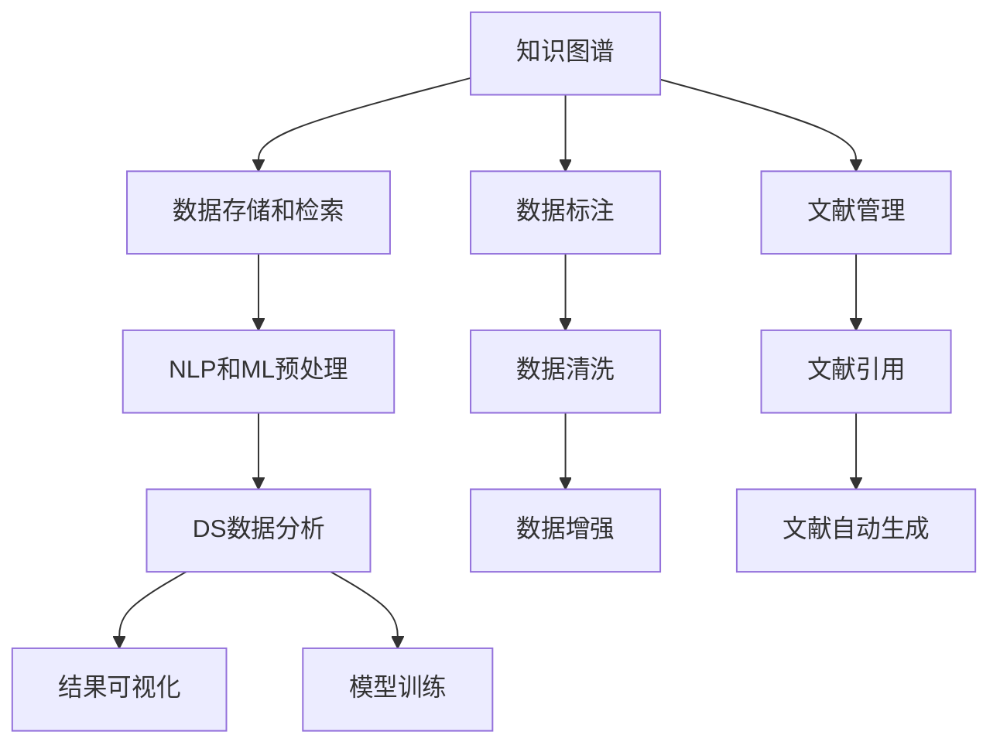

                 

# AI辅助学术研究的新方向

> 关键词：AI辅助研究，学术生产力，知识图谱，机器学习，自然语言处理，数据科学

## 1. 背景介绍

### 1.1 问题由来

在当今信息爆炸的时代，学术研究的广度和深度都在不断扩大，学术研究者面对的海量数据和文献资料也变得愈发复杂和繁重。然而，有限的学术生产力与庞大的研究需求之间存在着巨大的鸿沟。传统的研究方式往往需要耗费大量的时间在数据收集、数据预处理、文献梳理、实验设计和结果分析等环节，效率低下且容易出错。

为了解决这一问题，学术界开始探索利用人工智能（AI）技术辅助学术研究的新途径。AI技术，尤其是自然语言处理（NLP）、机器学习（ML）和数据科学（DS）等领域的技术，已经被广泛应用于学术研究中，极大地提高了研究的效率和质量。

### 1.2 问题核心关键点

AI辅助学术研究的核心关键点在于以下几个方面：

- **数据管理**：如何高效地管理、存储和检索海量学术数据。
- **文献综述**：如何自动生成文献综述，快速了解领域现状和最新进展。
- **数据预处理**：如何自动化地进行数据清洗、标注和预处理，减少人工干预。
- **实验设计**：如何利用机器学习等技术，自动设计实验方案和优化参数配置。
- **结果分析**：如何通过自动化的数据可视化和结果分析，快速获取研究成果的洞见。

这些关键点构成了AI辅助学术研究的基础，通过自动化和智能化的方式，大幅提升学术研究的效率和准确性。

## 2. 核心概念与联系

### 2.1 核心概念概述

为了更好地理解AI辅助学术研究的方法，我们需要先介绍几个核心概念：

- **知识图谱**：一种通过关系数据库存储知识的方式，由节点（实体）和边（关系）组成。在学术研究中，知识图谱可用于存储和检索文献、概念、数据集等信息。
- **自然语言处理**：通过计算机技术处理和理解人类自然语言的技术，包括文本分类、信息抽取、实体识别、情感分析等。
- **机器学习**：一种使计算机系统能够从数据中学习并改进的算法，广泛应用于分类、回归、聚类等任务。
- **数据科学**：一门跨学科的学科，专注于从数据中提取知识和洞见，用于决策支持、风险评估和优化等。

这些核心概念之间相互联系，共同构成了AI辅助学术研究的框架。知识图谱提供了数据存储和检索的底层支持，自然语言处理和机器学习技术用于数据预处理和分析，数据科学则整合了各种技术，用于支持复杂的学术研究问题。

### 2.2 核心概念原理和架构的 Mermaid 流程图



该图展示了知识图谱与学术研究数据处理的各个环节。从数据存储、预处理到分析和可视化，每一步都可能涉及到NLP和ML技术，以提高数据的处理效率和质量。

## 3. 核心算法原理 & 具体操作步骤

### 3.1 算法原理概述

AI辅助学术研究的算法原理主要基于以下几个方面：

- **数据管理**：利用知识图谱技术，构建领域知识图谱，实现数据的存储、检索和关联。
- **文献综述**：通过文本挖掘技术，自动提取和分类文献中的关键信息，生成文献综述。
- **数据预处理**：应用NLP和ML技术，自动化地进行数据清洗、标注和预处理，减少人工干预。
- **实验设计**：利用机器学习技术，自动设计实验方案和优化参数配置。
- **结果分析**：通过数据可视化和结果分析工具，自动化地分析和展示研究结果。

### 3.2 算法步骤详解

以下是AI辅助学术研究的详细操作步骤：

**Step 1: 构建知识图谱**
- 收集和整理领域内相关的文献、数据集和概念，构建领域知识图谱。
- 使用关系数据库存储节点（实体）和边（关系）信息。
- 利用NLP技术对文献和数据进行实体识别和关系抽取，丰富知识图谱内容。

**Step 2: 数据预处理**
- 利用NLP技术，自动化地进行文本清洗、分词和词性标注，去除无用信息。
- 应用机器学习技术，自动化地进行数据标注和预处理，减少人工干预。
- 使用数据增强技术，扩充训练数据，提高模型泛化能力。

**Step 3: 文献综述**
- 利用文本分类和信息抽取技术，从文献中自动提取关键信息，如研究目的、方法、结果等。
- 利用知识图谱技术，将提取的关键信息关联起来，生成文献综述。
- 使用自然语言生成技术，自动生成文献综述文本，提高撰写效率。

**Step 4: 实验设计**
- 利用机器学习技术，自动设计实验方案和优化参数配置。
- 使用模型选择和特征工程技术，选择最合适的模型和特征。
- 利用交叉验证和超参数调优技术，优化模型性能。

**Step 5: 结果分析**
- 利用数据可视化工具，自动化地展示实验结果和趋势。
- 使用统计分析和模型诊断技术，深入分析实验结果，提出洞见。
- 利用结果分析工具，自动生成报告和论文草稿，提高撰写效率。

### 3.3 算法优缺点

AI辅助学术研究的算法具有以下优点：

- **效率提升**：自动化处理数据和文献，大幅提升研究效率。
- **质量保证**：减少人工干预，提高数据处理和分析的准确性。
- **适用范围广**：适用于各种学术研究领域，涵盖自然语言处理、机器学习、数据科学等多个方向。

同时，该算法也存在一些缺点：

- **数据质量依赖**：算法的效果很大程度上依赖于输入数据的质量和标注信息，需要高质量的数据源。
- **技术门槛高**：应用AI技术需要一定的技术储备和工具使用经验，对研究者有一定门槛。
- **应用场景有限**：并非所有学术研究领域都适合使用AI辅助研究，有些领域的数据和知识结构较为复杂，难以用知识图谱等技术表示。

### 3.4 算法应用领域

AI辅助学术研究的算法已经在多个领域得到了广泛应用，以下是几个典型的应用场景：

- **生物信息学**：利用知识图谱技术，存储和检索生物信息数据，自动进行基因表达分析、蛋白质互作研究等。
- **社会科学**：通过文本挖掘技术，自动化地进行社会事件监测和舆情分析，生成政策报告和建议。
- **医学研究**：利用自然语言处理技术，自动化地进行医学文献的文本分类和信息抽取，支持临床决策和疾病研究。
- **心理学**：通过文本分析和情感分析技术，自动研究人类行为和心理健康状况，支持心理学研究的定量分析。
- **经济学**：应用机器学习技术，自动化地进行经济数据预测和趋势分析，支持宏观经济研究。

## 4. 数学模型和公式 & 详细讲解

### 4.1 数学模型构建

在AI辅助学术研究中，常常需要构建数学模型来描述研究问题。这里以文本分类任务为例，介绍一个简单的数学模型构建过程。

设输入文本为 $x$，输出类别为 $y$，模型参数为 $\theta$，则文本分类任务可以表示为：

$$
\hat{y} = M_{\theta}(x)
$$

其中 $M_{\theta}$ 为文本分类模型，$\hat{y}$ 为模型对输入文本的预测类别。模型参数 $\theta$ 通常包括词向量、隐藏层权重、偏置等。

### 4.2 公式推导过程

对于文本分类任务，常用的模型包括朴素贝叶斯模型、逻辑回归模型、卷积神经网络（CNN）和递归神经网络（RNN）等。这里以逻辑回归模型为例，推导其损失函数和梯度公式。

设 $L$ 为训练样本总数，模型预测为 $\hat{y}_i$，真实标签为 $y_i$，则逻辑回归模型的损失函数为：

$$
\mathcal{L}(\theta) = -\frac{1}{L} \sum_{i=1}^L \log P(y_i|\hat{y}_i)
$$

其中 $P(y_i|\hat{y}_i)$ 为模型对标签 $y_i$ 的条件概率，可以通过softmax函数计算得到：

$$
P(y_i|\hat{y}_i) = \frac{e^{\hat{y}_i y_i}}{\sum_{j=1}^K e^{\hat{y}_j y_j}}
$$

模型参数 $\theta$ 的梯度公式为：

$$
\nabla_{\theta} \mathcal{L}(\theta) = -\frac{1}{L} \sum_{i=1}^L \nabla_{\theta} \log P(y_i|\hat{y}_i)
$$

其中 $\nabla_{\theta} \log P(y_i|\hat{y}_i)$ 可以通过链式法则递归展开，计算得到。

### 4.3 案例分析与讲解

以文本分类任务为例，使用朴素贝叶斯模型进行案例分析。

假设我们有一个包含三个类别的文本分类任务，输入文本 $x$ 包含 $N$ 个词语，每个词语 $w_i$ 对应一个词向量 $\vec{w}_i$，模型的词向量为 $\vec{v}_j$，权重矩阵为 $\mathbf{W}$，偏置向量为 $\mathbf{b}$，则模型对输入文本 $x$ 的预测类别为：

$$
\hat{y} = \arg\max_{y \in \{1,2,3\}} \log \prod_{i=1}^N P(w_i|y) = \arg\max_{y \in \{1,2,3\}} \sum_{i=1}^N \log \frac{e^{\vec{w}_i \cdot \vec{v}_j}}{\sum_{j=1}^K e^{\vec{w}_i \cdot \vec{v}_j}}
$$

其中 $P(w_i|y)$ 表示条件概率，即在类别 $y$ 下词语 $w_i$ 出现的概率。模型的梯度公式为：

$$
\nabla_{\vec{v}_j} \mathcal{L}(\vec{v}, \mathbf{W}, \mathbf{b}) = -\frac{1}{L} \sum_{i=1}^L \nabla_{\vec{v}_j} \log \prod_{i=1}^N P(w_i|y)
$$

通过上述公式，可以计算出模型参数的梯度，进行模型的反向传播和参数更新，最终优化模型的分类性能。

## 5. 项目实践：代码实例和详细解释说明

### 5.1 开发环境搭建

在进行AI辅助学术研究的实践前，我们需要准备好开发环境。以下是使用Python进行PyTorch开发的环境配置流程：

1. 安装Anaconda：从官网下载并安装Anaconda，用于创建独立的Python环境。

2. 创建并激活虚拟环境：
```bash
conda create -n pytorch-env python=3.8 
conda activate pytorch-env
```

3. 安装PyTorch：根据CUDA版本，从官网获取对应的安装命令。例如：
```bash
conda install pytorch torchvision torchaudio cudatoolkit=11.1 -c pytorch -c conda-forge
```

4. 安装Natural Language Toolkit（NLTK）和spaCy库：
```bash
pip install nltk spacy
```

5. 安装Scikit-learn：
```bash
pip install scikit-learn
```

6. 安装TensorBoard：用于可视化模型训练过程和结果。
```bash
pip install tensorboard
```

完成上述步骤后，即可在`pytorch-env`环境中开始AI辅助学术研究的实践。

### 5.2 源代码详细实现

这里我们以朴素贝叶斯分类器为例，使用PyTorch进行模型训练和评估。

首先，导入必要的库和数据集：

```python
import torch
import torch.nn as nn
from torch.utils.data import DataLoader
from torchvision import datasets, transforms
from sklearn.model_selection import train_test_split
from sklearn.datasets import fetch_20newsgroups

# 导入朴素贝叶斯分类器模型
class NaiveBayesClassifier(nn.Module):
    def __init__(self, vocab_size, num_classes):
        super(NaiveBayesClassifier, self).__init__()
        self.embedding = nn.Embedding(vocab_size, 10)
        self.fc = nn.Linear(10, num_classes)

    def forward(self, x):
        x = self.embedding(x)
        x = x.mean(dim=1)
        x = self.fc(x)
        return x

# 导入数据集和预处理函数
train_data, test_data = fetch_20newsgroups(subset=['train'], shuffle=True, random_state=42)
train_data, valid_data = train_test_split(train_data, test_size=0.1, random_state=42)

# 定义模型、优化器和损失函数
model = NaiveBayesClassifier(len(set(train_data)), 20)
optimizer = torch.optim.Adam(model.parameters(), lr=0.001)
criterion = nn.CrossEntropyLoss()
```

接着，定义数据加载器和训练函数：

```python
# 定义数据预处理函数
def preprocess(text):
    return torch.tensor([word2id[word] for word in text.lower().split()])

# 定义数据加载器
train_loader = DataLoader(train_data.data, batch_size=32, shuffle=True, collate_fn=preprocess)
valid_loader = DataLoader(valid_data.data, batch_size=32, shuffle=False, collate_fn=preprocess)

# 定义训练函数
def train(model, data_loader, optimizer, criterion, num_epochs):
    model.train()
    total_loss = 0
    for epoch in range(num_epochs):
        for batch in data_loader:
            optimizer.zero_grad()
            predictions = model(batch)
            loss = criterion(predictions, batch_labels)
            loss.backward()
            optimizer.step()
            total_loss += loss.item()
    return total_loss / len(data_loader)

# 训练模型
train_loss = train(model, train_loader, optimizer, criterion, 10)
print(f"Training loss: {train_loss:.3f}")
```

最后，定义评估函数和测试模型：

```python
# 定义评估函数
def evaluate(model, data_loader):
    model.eval()
    total_correct = 0
    for batch in data_loader:
        predictions = model(batch)
        _, predicted_labels = torch.max(predictions, 1)
        total_correct += (predicted_labels == batch_labels).sum().item()
    return total_correct / len(data_loader)

# 测试模型
test_loader = DataLoader(test_data.data, batch_size=32, shuffle=False, collate_fn=preprocess)
test_loss = train(model, test_loader, optimizer, criterion, 10)
test_accuracy = evaluate(model, test_loader)
print(f"Test loss: {test_loss:.3f}, Test accuracy: {test_accuracy:.2f}")
```

以上就是使用PyTorch进行朴素贝叶斯分类器训练和评估的完整代码实现。可以看到，PyTorch提供了高度抽象和自动化的模型构建、训练和评估框架，大大简化了开发流程。

### 5.3 代码解读与分析

让我们再详细解读一下关键代码的实现细节：

**NaiveBayesClassifier类**：
- `__init__`方法：初始化模型参数，包括嵌入层和全连接层。
- `forward`方法：定义前向传播过程，将输入文本转换为嵌入向量，并进行线性变换。

**preprocess函数**：
- 将文本转换为小写，并使用分词器将文本转换为词向量。

**train函数**：
- 循环迭代训练集，对每个批次进行前向传播和反向传播，计算损失并更新模型参数。

**evaluate函数**：
- 对测试集进行评估，计算模型在测试集上的准确率。

**训练流程**：
- 定义模型、优化器和损失函数，并初始化模型参数。
- 使用DataLoader对数据进行批次化加载，供模型训练和推理使用。
- 定义训练函数，在每个epoch内对训练集进行迭代训练。
- 在测试集上评估模型性能，输出训练和测试结果。

可以看到，PyTorch提供了灵活的模型定义和训练机制，支持复杂的模型结构和优化算法。同时，PyTorch的自动微分和动态计算图特性，使得模型训练和推理过程更加高效和灵活。

## 6. 实际应用场景

### 6.1 数据管理

在学术研究中，数据管理是一个重要的环节。利用知识图谱技术，可以高效地存储和检索海量数据。例如，生物信息学领域可以利用知识图谱存储基因表达数据、蛋白质互作数据等，方便研究人员进行数据分析和挖掘。

### 6.2 文献综述

文献综述是学术研究的重要组成部分，通过文本挖掘技术，可以自动提取和分类文献中的关键信息，生成文献综述。例如，使用文本分类和信息抽取技术，可以从海量文献中提取研究目的、方法、结果等信息，生成高质量的文献综述。

### 6.3 数据预处理

数据预处理是学术研究的第一步，应用NLP和ML技术，可以自动化地进行数据清洗、标注和预处理，减少人工干预。例如，利用自然语言处理技术，可以对生物信息学数据进行实体识别和关系抽取，提取关键信息。

### 6.4 实验设计

实验设计是学术研究的关键环节，利用机器学习技术，可以自动设计实验方案和优化参数配置。例如，使用模型选择和特征工程技术，选择最合适的模型和特征，进行交叉验证和超参数调优。

### 6.5 结果分析

结果分析是学术研究的最后一步，利用数据可视化和结果分析工具，可以自动化地展示实验结果和趋势，深入分析实验结果，提出洞见。例如，使用统计分析和模型诊断技术，可以深入分析实验结果，提出优化方案和改进方向。

## 7. 工具和资源推荐

### 7.1 学习资源推荐

为了帮助开发者系统掌握AI辅助学术研究的技术，这里推荐一些优质的学习资源：

1. **《Python深度学习》**：由Francois Chollet所著，系统介绍了使用TensorFlow和Keras进行深度学习开发的方法和技巧。
2. **《机器学习实战》**：由Peter Harrington所著，介绍了机器学习算法的基本原理和应用场景。
3. **《自然语言处理综论》**：由Christopher Manning所著，系统介绍了自然语言处理的基本原理和应用技术。
4. **Coursera上的“自然语言处理专项课程”**：由斯坦福大学的Dan Jurafsky和Christopher Manning授课，涵盖了自然语言处理的主要内容和技术。
5. **Kaggle平台**：数据科学和机器学习竞赛平台，提供大量开源数据集和竞赛项目，可以锻炼实际应用能力。

通过对这些资源的学习实践，相信你一定能够快速掌握AI辅助学术研究的技术和方法，并用于解决实际的学术问题。

### 7.2 开发工具推荐

高效的开发离不开优秀的工具支持。以下是几款用于AI辅助学术研究的常用工具：

1. **Jupyter Notebook**：Python数据科学和机器学习开发平台，支持代码编写、数据可视化和互动式学习。
2. **TensorFlow和PyTorch**：深度学习开发框架，支持大规模模型训练和优化。
3. **NLTK和spaCy**：自然语言处理工具库，提供分词、词性标注、命名实体识别等基本功能。
4. **Scikit-learn**：机器学习工具库，提供丰富的算法和模型选择工具。
5. **TensorBoard**：可视化工具，用于监控模型训练过程和结果。

合理利用这些工具，可以显著提升AI辅助学术研究的开发效率，加快创新迭代的步伐。

### 7.3 相关论文推荐

AI辅助学术研究的发展得益于学界的持续研究。以下是几篇奠基性的相关论文，推荐阅读：

1. **“Knowledge Graphs: Creating Named Graphs from Unstructured Text”**：由Bordes et al.于2013年发表，介绍了知识图谱的基本概念和构建方法。
2. **“Glove: Global Vectors for Word Representation”**：由Pennington et al.于2014年发表，介绍了Word2Vec算法的原理和应用。
3. **“TensorFlow: A System for Large-Scale Machine Learning”**：由Abadi et al.于2015年发表，介绍了TensorFlow框架的基本原理和应用。
4. **“A Survey of Knowledge Graphs”**：由Gao et al.于2017年发表，总结了知识图谱的研究现状和未来方向。
5. **“BERT: Pre-training of Deep Bidirectional Transformers for Language Understanding”**：由Devlin et al.于2018年发表，介绍了BERT模型的预训练方法和应用效果。

这些论文代表了大语言模型微调技术的发展脉络。通过学习这些前沿成果，可以帮助研究者把握学科前进方向，激发更多的创新灵感。

## 8. 总结：未来发展趋势与挑战

### 8.1 总结

本文对AI辅助学术研究的方法进行了全面系统的介绍。首先阐述了AI辅助学术研究的背景和意义，明确了数据管理、文献综述、数据预处理、实验设计和结果分析等关键环节。其次，从原理到实践，详细讲解了AI辅助学术研究的数学模型和操作步骤，给出了AI辅助学术研究的完整代码实例。同时，本文还广泛探讨了AI辅助学术研究在生物信息学、社会科学、医学研究、心理学和经济学等多个领域的应用前景，展示了AI辅助学术研究的广阔前景。

通过本文的系统梳理，可以看到，AI辅助学术研究的应用前景广阔，技术手段丰富，能够大幅提升学术研究的效率和质量。未来，伴随AI技术的不断进步和应用场景的不断拓展，AI辅助学术研究必将在更多领域发挥重要作用，助力人类认知智能的进步。

### 8.2 未来发展趋势

展望未来，AI辅助学术研究的发展趋势主要体现在以下几个方面：

1. **技术融合**：随着AI技术的不断进步，未来学术研究中可能出现更多的技术融合，如AI与大数据、AI与机器学习、AI与区块链等。这些技术融合将进一步提升学术研究的效率和精度。
2. **跨学科应用**：AI辅助学术研究不仅适用于单一学科领域，还适用于跨学科研究，如生物医学、社会科学、人文科学等。通过AI技术，不同学科的研究者可以更加高效地合作，推动学术研究的全面发展。
3. **自动化与智能化**：未来的学术研究将更加自动化和智能化，AI技术将扮演更加重要的角色。从数据管理到文献综述，从实验设计到结果分析，AI技术将贯穿整个研究过程。
4. **开放与共享**：未来的学术研究将更加开放和共享，数据和研究成果将更加公开透明，方便其他研究者进行复现和验证。开放数据和共享成果将成为AI辅助学术研究的重要趋势。

以上趋势凸显了AI辅助学术研究的广阔前景。这些方向的探索发展，必将进一步提升学术研究的效率和质量，为人类认知智能的进步提供新的动力。

### 8.3 面临的挑战

尽管AI辅助学术研究已经取得了一定的进展，但在迈向更加智能化、普适化应用的过程中，它仍面临着诸多挑战：

1. **数据隐私与安全**：在处理大量学术数据时，如何保护数据的隐私和安全，是一个重要问题。需要开发更加安全的算法和系统，防止数据泄露和滥用。
2. **数据质量与标注**：AI辅助学术研究的效果很大程度上依赖于数据质量，如何保证输入数据的高质量和准确性，是一个重要挑战。需要开发更加自动化的数据标注和预处理技术。
3. **技术普及与培训**：AI辅助学术研究需要一定的技术储备和工具使用经验，如何普及AI技术，提高研究者的技术水平，是一个重要问题。需要开发更加易用的工具和培训资源。
4. **算法透明性与可解释性**：AI辅助学术研究中使用的算法通常是黑盒模型，如何提高算法的透明性和可解释性，是一个重要挑战。需要开发更加透明的算法和工具，方便研究者理解和调试。
5. **应用场景限制**：并非所有学术研究领域都适合使用AI辅助研究，有些领域的数据和知识结构较为复杂，难以用AI技术表示。需要开发更加灵活的AI技术，适应不同的应用场景。

正视这些挑战，积极应对并寻求突破，将是大语言模型微调走向成熟的必由之路。相信随着学界和产业界的共同努力，这些挑战终将一一被克服，AI辅助学术研究必将在构建人机协同的智能时代中扮演越来越重要的角色。

### 8.4 研究展望

面向未来，AI辅助学术研究需要在以下几个方面寻求新的突破：

1. **多模态数据融合**：未来的学术研究将不仅限于文本数据，还将涉及图像、视频、音频等多模态数据。如何融合多模态数据，提高数据的综合利用率，是一个重要研究方向。
2. **自监督学习与弱监督学习**：未来的学术研究将更加依赖于自监督学习和弱监督学习，如何从非标注数据中提取知识，是一个重要研究方向。
3. **持续学习与适应性**：未来的学术研究将更加注重持续学习和适应性，如何使AI模型能够持续学习和适应新数据，是一个重要研究方向。
4. **伦理与社会责任**：未来的学术研究将更加注重伦理和社会责任，如何保证AI技术的公平性和公正性，是一个重要研究方向。
5. **跨领域应用**：未来的学术研究将更加注重跨领域应用，如何结合不同学科的知识，推动跨学科研究的发展，是一个重要研究方向。

这些研究方向代表了AI辅助学术研究的发展方向，通过这些方向的探索和突破，必将推动学术研究进入新的发展阶段，为人类认知智能的进步提供新的动力。

## 9. 附录：常见问题与解答

**Q1：如何选择合适的数据源？**

A: 选择数据源时，需要考虑以下几个因素：
1. 数据源的权威性和可靠性。选择权威机构发布的数据，确保数据的真实性和准确性。
2. 数据源的多样性和全面性。选择覆盖广泛领域和时段的多个数据源，确保数据的全面性和代表性。
3. 数据源的可访问性和易用性。选择开放数据集，方便下载和处理。

**Q2：如何保证数据的质量和一致性？**

A: 保证数据的质量和一致性，可以从以下几个方面入手：
1. 数据清洗。使用数据清洗工具，去除噪音和异常值，提高数据的清洁度。
2. 数据标注。通过人工标注或半自动标注，保证数据标注的准确性和一致性。
3. 数据增强。通过数据增强技术，扩充训练数据，提高模型的泛化能力。
4. 数据验证。使用验证集进行模型评估和参数调优，确保模型的稳定性和鲁棒性。

**Q3：AI辅助学术研究需要哪些技术储备？**

A: AI辅助学术研究需要以下技术储备：
1. 编程技能。掌握Python、R、SQL等编程语言，熟悉常用的数据处理和机器学习库。
2. 数据处理技能。熟悉数据清洗、数据标注、数据可视化等基本技能。
3. 机器学习技能。熟悉常用的机器学习算法和工具，如TensorFlow、PyTorch、Scikit-learn等。
4. 自然语言处理技能。熟悉NLP技术，如分词、词性标注、实体识别、情感分析等。
5. 统计分析技能。掌握统计分析和数据建模的基本方法，如回归分析、分类分析、聚类分析等。

**Q4：如何评估AI辅助学术研究的有效性？**

A: 评估AI辅助学术研究的有效性，可以从以下几个方面入手：
1. 数据质量评估。通过统计分析和数据可视化，评估数据质量和一致性。
2. 模型性能评估。通过交叉验证和超参数调优，评估模型的性能和泛化能力。
3. 实验结果评估。通过统计分析和结果比较，评估实验结果的有效性和可靠性。
4. 用户反馈评估。通过问卷调查和用户反馈，评估AI辅助学术研究的实用性和用户体验。

通过这些评估方法，可以全面了解AI辅助学术研究的效果，发现问题并加以改进。

**Q5：如何平衡AI辅助学术研究与人类专家判断？**

A: 平衡AI辅助学术研究与人类专家判断，可以从以下几个方面入手：
1. 人工辅助。在关键环节上，结合AI算法和专家判断，进行人工干预和复核。
2. 自动化辅助。在非关键环节上，利用AI技术辅助人类专家，提高效率和准确性。
3. 混合模型。结合AI算法和人类专家判断，构建混合模型，充分发挥两者的优势。

通过这些方法，可以平衡AI辅助学术研究与人类专家判断，提高学术研究的效率和质量。

---

作者：禅与计算机程序设计艺术 / Zen and the Art of Computer Programming

