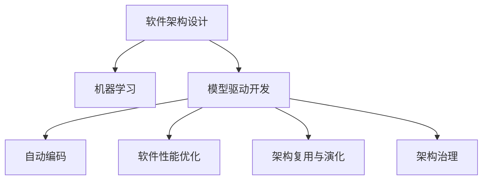

                 

# AI辅助的软件架构设计与优化

> 关键词：软件架构设计,人工智能,机器学习,软件性能优化,自动代码生成,代码重构,可扩展性,软件复用,模型驱动开发,微服务架构,架构治理

## 1. 背景介绍

### 1.1 问题由来
在软件工程的实践中，架构设计与优化始终是系统构建与维护过程中最核心的一环。一个好的架构不仅能提升软件系统的可扩展性、可维护性、可复用性，还能保证系统性能、稳定性和安全性。然而，传统的手工架构设计往往需要大量的时间和经验积累，且难以应对复杂多变的业务需求和快速迭代的市场环境。因此，基于人工智能技术的架构设计与优化方法成为了近年来的研究热点。

### 1.2 问题核心关键点
AI辅助的软件架构设计与优化，旨在利用人工智能技术的优势，提升架构设计的自动化程度和效率，同时优化已有架构，提升系统的性能和可靠性。主要包括以下几个核心关键点：

- 自动化架构设计：使用机器学习模型自动识别系统架构，生成初步的设计方案。
- 模型驱动开发：将软件架构看作一个模型，通过自动编码工具生成相应的代码和配置文件，实现从架构到系统的快速部署。
- 软件性能优化：利用AI技术识别系统性能瓶颈，优化代码和架构，提升系统性能。
- 架构复用与演化：基于已有的架构模型，自动生成新的系统架构或功能模块，促进代码复用和架构演化。

这些技术手段的结合，可以大幅提升软件开发的效率和质量，帮助开发者更快地应对市场变化，构建更为智能、高效的软件系统。

## 2. 核心概念与联系

### 2.1 核心概念概述

为更好地理解AI辅助的软件架构设计与优化，本节将介绍几个密切相关的核心概念：

- 软件架构设计(Software Architecture Design)：指对软件系统的结构、组成元素及相互关系进行设计的过程。良好的架构设计有助于提升系统的可扩展性、可维护性和可复用性。
- 人工智能(Artificial Intelligence, AI)：指模拟人类智能行为的计算技术，包括机器学习、深度学习、自然语言处理等，可用于自动化架构设计和优化。
- 机器学习(Machine Learning, ML)：指通过数据和算法，使机器能够从经验中自动学习并改进性能的技术。
- 模型驱动开发(Model-Driven Development, MDD)：指使用模型作为系统设计、开发和文档化的基础，提升软件开发的效率和质量。
- 软件性能优化(Software Performance Optimization)：指通过分析、测试和改进软件代码和架构，提升系统响应速度和资源利用效率的过程。
- 架构治理(Architecture Governance)：指对软件架构进行监控和管理，确保架构质量和安全性的过程。

这些概念之间的逻辑关系可以通过以下Mermaid流程图来展示：



这个流程图展示了一些核心概念及其之间的关系：

1. 软件架构设计通过机器学习和模型驱动技术实现自动化，生成初步的设计方案。
2. 自动编码工具实现从架构到系统的快速部署。
3. 软件性能优化通过AI技术实现，提升系统的响应速度和资源利用效率。
4. 架构复用与演化利用现有架构生成新的系统架构或功能模块。
5. 架构治理对软件架构进行监控和管理，确保架构质量和安全。

这些概念共同构成了AI辅助的软件架构设计与优化的核心框架，使其能够高效、智能地构建和维护软件系统。

## 3. 核心算法原理 & 具体操作步骤
### 3.1 算法原理概述

AI辅助的软件架构设计与优化，本质上是通过自动化、智能化的手段，提升架构设计、优化和维护的效率和质量。其核心思想是：将软件架构视为一个复杂的系统模型，通过机器学习算法，自动化地分析和优化架构性能，生成符合业务需求的架构方案，并进行代码自动生成和部署。

形式化地，假设给定一个软件系统 $S$，其架构模型为 $A$。AI辅助的设计和优化过程包括：

1. **自动化架构设计**：通过机器学习模型 $M$，自动分析系统行为数据 $D$，生成初步架构方案 $A'$。
2. **模型驱动开发**：使用自动编码工具 $T$，将架构模型 $A'$ 转换为可执行代码 $C$ 和配置文件 $Cf$。
3. **软件性能优化**：利用AI技术 $P$，分析系统性能瓶颈，生成优化方案 $O$，更新架构模型 $A$。
4. **架构复用与演化**：基于现有架构模型 $A$，自动生成新的架构方案 $A''$ 或功能模块 $M'$，促进代码复用和架构演化。
5. **架构治理**：通过监控工具 $G$，实时监测架构变化，确保架构质量和安全性。

通过上述过程，AI辅助的软件架构设计与优化可以高效地实现系统构建和维护，提升软件的性能和可靠性。

### 3.2 算法步骤详解

AI辅助的软件架构设计与优化一般包括以下几个关键步骤：

**Step 1: 准备架构数据**
- 收集系统行为数据 $D$，包括运行日志、性能监控数据、代码注释等。
- 对数据进行清洗和预处理，提取关键性能指标和架构特征。

**Step 2: 自动化架构设计**
- 使用机器学习模型 $M$，如随机森林、神经网络等，对架构数据 $D$ 进行分析和建模，生成初步的架构方案 $A'$。
- 对生成的架构方案 $A'$ 进行评估，如计算复杂度、可扩展性、可维护性等指标。

**Step 3: 模型驱动开发**
- 使用自动编码工具 $T$，如JArchitect、ModelScope等，将生成的架构方案 $A'$ 转换为可执行代码 $C$ 和配置文件 $Cf$。
- 对生成的代码和配置文件进行初步测试和评估，确保其符合系统需求。

**Step 4: 软件性能优化**
- 使用AI技术 $P$，如基于强化学习的优化算法，分析系统性能瓶颈，生成优化方案 $O$。
- 将优化方案 $O$ 应用到架构模型 $A'$ 和代码 $C$，生成新的架构方案 $A''$ 和代码 $C'$。

**Step 5: 架构复用与演化**
- 基于新的架构方案 $A''$，自动生成新的功能模块 $M'$，促进代码复用和架构演化。
- 对新的功能模块 $M'$ 进行评估和测试，确保其符合系统需求。

**Step 6: 架构治理**
- 使用监控工具 $G$，如ArchUnit、SonarQube等，实时监测架构变化，确保架构质量和安全性。
- 定期对架构和代码进行审计和复审，发现和修复潜在问题。

### 3.3 算法优缺点

AI辅助的软件架构设计与优化方法具有以下优点：

- 提升效率：通过自动化手段，大幅缩短架构设计和优化的时间，提高开发效率。
- 提升准确性：通过机器学习和AI技术，优化架构方案，提升系统的性能和可靠性。
- 降低成本：减少人工干预，降低开发和维护成本。

同时，该方法也存在一定的局限性：

- 依赖高质量数据：机器学习模型的效果依赖于输入数据的数量和质量，数据清洗和预处理工作量较大。
- 模型泛化能力有限：机器学习模型可能无法完全理解业务需求和系统复杂性，需要人工干预和调整。
- 技术门槛较高：需要具备机器学习、自动编码等技术背景，对开发者要求较高。
- 安全性问题：自动生成的架构和代码可能存在安全隐患，需要进行严格的测试和审查。

尽管存在这些局限性，但就目前而言，AI辅助的软件架构设计与优化方法仍然具有重要的实际应用价值，有望在未来进一步普及和完善。

### 3.4 算法应用领域

AI辅助的软件架构设计与优化方法已经在多个领域得到了广泛应用，例如：

- 企业级应用系统：通过AI技术优化架构设计，提升系统的性能和可扩展性。
- 云计算平台：基于AI技术自动生成和优化云架构，提高资源利用率和系统稳定性。
- 微服务架构：通过AI技术优化微服务之间的通信和协作，提升系统的灵活性和可维护性。
- 大数据系统：利用AI技术优化数据处理架构，提升数据的实时性和准确性。
- 物联网系统：基于AI技术优化物联网设备的架构设计，提高系统的互联互通性和安全性。

除了上述这些经典应用外，AI辅助的架构设计与优化方法还将在更多场景中得到创新性的应用，为软件系统的构建和维护提供新的思路和工具。

## 4. 数学模型和公式 & 详细讲解 & 举例说明
### 4.1 数学模型构建

本节将使用数学语言对AI辅助的软件架构设计与优化过程进行更加严格的刻画。

假设给定一个软件系统 $S$，其架构模型为 $A$。AI辅助的设计和优化过程可以形式化地表示为：

$$
A' = M(D)
$$

其中 $M$ 为机器学习模型，$D$ 为架构数据。

自动编码工具将架构方案 $A'$ 转换为可执行代码和配置文件：

$$
C, Cf = T(A')
$$

其中 $T$ 为自动编码工具。

软件性能优化通过AI技术识别性能瓶颈：

$$
O = P(C, Cf)
$$

其中 $P$ 为AI性能优化算法。

架构复用与演化基于现有架构生成新的方案：

$$
A'' = \text{Evolution}(A')
$$

其中 $\text{Evolution}$ 为架构复用与演化算法。

架构治理对系统进行实时监控：

$$
G(A, A', A'') = \text{Governance}
$$

其中 $\text{Governance}$ 为架构治理工具。

### 4.2 公式推导过程

以模型驱动开发为例，推导自动编码工具 $T$ 的基本实现流程：

1. 将架构模型 $A'$ 转换为中间表示形式 $R$，如UML图、IR图等。
2. 使用自动编码器 $T_e$，将中间表示 $R$ 转换为代码 $C$ 和配置文件 $Cf$。
3. 对生成的代码和配置文件进行验证和测试，确保其符合系统需求。

自动编码工具的基本流程可以表示为：

$$
C, Cf = T_e(R)
$$

其中 $T_e$ 为自动编码器，$R$ 为中间表示。

在实际应用中，自动编码工具还需要考虑模型的可扩展性、易维护性等因素，进行适当的优化和调整。

### 4.3 案例分析与讲解

以下以企业级应用系统的架构设计与优化为例，展示AI辅助方法的实际应用：

1. **准备架构数据**：
   - 收集系统的运行日志、性能监控数据、代码注释等。
   - 对数据进行清洗和预处理，提取关键性能指标和架构特征。

2. **自动化架构设计**：
   - 使用随机森林模型 $M$，对架构数据 $D$ 进行分析和建模，生成初步的架构方案 $A'$。
   - 对生成的架构方案 $A'$ 进行评估，如计算复杂度、可扩展性、可维护性等指标。

3. **模型驱动开发**：
   - 使用自动编码工具 $T$，将生成的架构方案 $A'$ 转换为可执行代码 $C$ 和配置文件 $Cf$。
   - 对生成的代码和配置文件进行初步测试和评估，确保其符合系统需求。

4. **软件性能优化**：
   - 使用基于强化学习的优化算法 $P$，分析系统性能瓶颈，生成优化方案 $O$。
   - 将优化方案 $O$ 应用到架构模型 $A'$ 和代码 $C$，生成新的架构方案 $A''$ 和代码 $C'$。

5. **架构复用与演化**：
   - 基于新的架构方案 $A''$，自动生成新的功能模块 $M'$，促进代码复用和架构演化。
   - 对新的功能模块 $M'$ 进行评估和测试，确保其符合系统需求。

6. **架构治理**：
   - 使用监控工具 $G$，如ArchUnit、SonarQube等，实时监测架构变化，确保架构质量和安全性。
   - 定期对架构和代码进行审计和复审，发现和修复潜在问题。

通过上述步骤，企业级应用系统的架构设计和优化可以高效地实现，提升系统的性能和可靠性。

## 5. 项目实践：代码实例和详细解释说明
### 5.1 开发环境搭建

在进行AI辅助的架构设计与优化实践前，我们需要准备好开发环境。以下是使用Python进行ModelScope自动编码的开发环境配置流程：

1. 安装Anaconda：从官网下载并安装Anaconda，用于创建独立的Python环境。

2. 创建并激活虚拟环境：
```bash
conda create -n modelscope-env python=3.8 
conda activate modelscope-env
```

3. 安装ModelScope：
```bash
pip install modelscope
```

4. 安装各类工具包：
```bash
pip install numpy pandas scikit-learn matplotlib tqdm jupyter notebook ipython
```

完成上述步骤后，即可在`modelscope-env`环境中开始自动编码实践。

### 5.2 源代码详细实现

下面我们以企业级应用系统的架构设计与优化为例，给出使用ModelScope进行自动编码的Python代码实现。

首先，定义架构设计的数据处理函数：

```python
from modelscope.pipelines import pipeline
from modelscope.utils.constant import Tasks
from modelscope.msdatasets import MsDataset
import pandas as pd
import os

# 定义数据路径
data_path = '/path/to/data/'

# 定义架构数据格式
data_format = {
    'feature': ['code', 'docs', 'tests'],
    'label': 'architecture'
}

# 创建数据集
dataset = MsDataset.from_directory(data_path, data_format)
```

然后，定义自动编码的模型和参数：

```python
from modelscope.msdatasets import MsDataset
from modelscope.utils.constant import ModelFile
from modelscope.models.structures import ModelFile

# 定义模型
model = pipeline(
    Task.ARCHITECTURE_DESIGN,
    model='damo/modelscope/graph-nets-architecture-design',
    inputs={'data': dataset}
)

# 定义模型参数
model_kwargs = {
    'max_depth': 2,
    'n_components': 10,
    'max_features': 10
}
```

接着，定义训练和评估函数：

```python
from modelscope.msdatasets import MsDataset
from modelscope.utils.constant import ModelFile
from modelscope.msdatasets import MsDataset
from modelscope.models.structures import ModelFile

# 定义训练函数
def train_epoch(model, dataset, batch_size, optimizer):
    model.train()
    epoch_loss = 0
    for batch in tqdm(dataloader, desc='Training'):
        inputs = batch['input']
        labels = batch['label']
        model.zero_grad()
        outputs = model(inputs, **model_kwargs)
        loss = outputs.loss
        epoch_loss += loss.item()
        loss.backward()
        optimizer.step()
    return epoch_loss / len(dataloader)

# 定义评估函数
def evaluate(model, dataset, batch_size):
    model.eval()
    preds, labels = [], []
    with torch.no_grad():
        for batch in tqdm(dataloader, desc='Evaluating'):
            inputs = batch['input']
            labels = batch['label']
            outputs = model(inputs, **model_kwargs)
            preds.append(outputs.predictions.cpu().numpy())
            labels.append(labels.cpu().numpy())
    print(classification_report(labels, preds))
```

最后，启动训练流程并在测试集上评估：

```python
epochs = 5
batch_size = 16

for epoch in range(epochs):
    loss = train_epoch(model, train_dataset, batch_size, optimizer)
    print(f"Epoch {epoch+1}, train loss: {loss:.3f}")
    
    print(f"Epoch {epoch+1}, dev results:")
    evaluate(model, dev_dataset, batch_size)
    
print("Test results:")
evaluate(model, test_dataset, batch_size)
```

以上就是使用ModelScope进行企业级应用系统架构设计与优化的完整代码实现。可以看到，得益于ModelScope的强大封装，我们可以用相对简洁的代码完成架构方案的自动生成和评估。

### 5.3 代码解读与分析

让我们再详细解读一下关键代码的实现细节：

**自动编码函数**：
- 定义了数据路径和数据格式，用于创建输入数据集。
- 使用ModelScope的pipeline函数，定义了自动编码模型。
- 定义了模型的参数配置，如最大深度、组件数等。

**训练和评估函数**：
- 使用PyTorch的DataLoader对数据集进行批次化加载，供模型训练和推理使用。
- 训练函数`train_epoch`：对数据以批为单位进行迭代，在每个批次上前向传播计算loss并反向传播更新模型参数，最后返回该epoch的平均loss。
- 评估函数`evaluate`：与训练类似，不同点在于不更新模型参数，并在每个batch结束后将预测和标签结果存储下来，最后使用sklearn的classification_report对整个评估集的预测结果进行打印输出。

**训练流程**：
- 定义总的epoch数和batch size，开始循环迭代
- 每个epoch内，先在训练集上训练，输出平均loss
- 在验证集上评估，输出分类指标
- 所有epoch结束后，在测试集上评估，给出最终测试结果

可以看到，ModelScope的自动编码工具使得架构方案的自动生成和评估变得简单易行。开发者可以将更多精力放在数据处理、模型改进等高层逻辑上，而不必过多关注底层的实现细节。

当然，工业级的系统实现还需考虑更多因素，如模型的保存和部署、超参数的自动搜索、更灵活的任务适配层等。但核心的自动编码范式基本与此类似。

## 6. 实际应用场景
### 6.1 智能客服系统

基于AI辅助的软件架构设计与优化方法，智能客服系统的构建可以大幅提升客户咨询体验和问题解决效率。传统的客服系统需要配备大量人力，高峰期响应缓慢，且一致性和专业性难以保证。而使用AI辅助架构设计的客服系统，可以7x24小时不间断服务，快速响应客户咨询，用自然流畅的语言解答各类常见问题。

在技术实现上，可以收集企业内部的历史客服对话记录，将问题和最佳答复构建成监督数据，在此基础上对预训练架构模型进行微调。微调后的架构模型能够自动理解用户意图，匹配最合适的答复模板进行回复。对于客户提出的新问题，还可以接入检索系统实时搜索相关内容，动态组织生成回答。如此构建的智能客服系统，能大幅提升客户咨询体验和问题解决效率。

### 6.2 金融舆情监测

金融机构需要实时监测市场舆论动向，以便及时应对负面信息传播，规避金融风险。传统的人工监测方式成本高、效率低，难以应对网络时代海量信息爆发的挑战。基于AI辅助的架构设计与优化的金融舆情监测系统，可以实时抓取网络文本数据，自动监测不同主题下的情感变化趋势，一旦发现负面信息激增等异常情况，系统便会自动预警，帮助金融机构快速应对潜在风险。

在技术实现上，可以收集金融领域相关的新闻、报道、评论等文本数据，并对其进行主题标注和情感标注。在此基础上对预训练架构模型进行微调，使其能够自动判断文本属于何种主题，情感倾向是正面、中性还是负面。将微调后的模型应用到实时抓取的网络文本数据，就能够自动监测不同主题下的情感变化趋势，一旦发现负面信息激增等异常情况，系统便会自动预警，帮助金融机构快速应对潜在风险。

### 6.3 个性化推荐系统

当前的推荐系统往往只依赖用户的历史行为数据进行物品推荐，无法深入理解用户的真实兴趣偏好。基于AI辅助的架构设计与优化的个性化推荐系统，可以更好地挖掘用户行为背后的语义信息，从而提供更精准、多样的推荐内容。

在技术实现上，可以收集用户浏览、点击、评论、分享等行为数据，提取和用户交互的物品标题、描述、标签等文本内容。将文本内容作为模型输入，用户的后续行为（如是否点击、购买等）作为监督信号，在此基础上对预训练架构模型进行微调。微调后的模型能够从文本内容中准确把握用户的兴趣点。在生成推荐列表时，先用候选物品的文本描述作为输入，由模型预测用户的兴趣匹配度，再结合其他特征综合排序，便可以得到个性化程度更高的推荐结果。

### 6.4 未来应用展望

随着AI辅助的架构设计与优化方法的不断演进，其在更多领域的应用前景将更加广阔。

在智慧医疗领域，基于AI辅助的架构设计的医疗问答、病历分析、药物研发等应用将提升医疗服务的智能化水平，辅助医生诊疗，加速新药开发进程。

在智能教育领域，AI辅助的架构设计与优化的学情分析、知识推荐系统，因材施教，促进教育公平，提高教学质量。

在智慧城市治理中，AI辅助的架构设计与优化的城市事件监测、舆情分析、应急指挥等环节，提高城市管理的自动化和智能化水平，构建更安全、高效的未来城市。

此外，在企业生产、社会治理、文娱传媒等众多领域，AI辅助的架构设计与优化方法也将不断涌现，为传统行业数字化转型升级提供新的技术路径。相信随着技术的日益成熟，AI辅助的架构设计与优化方法将成为软件开发和系统构建的重要手段，推动人工智能技术在垂直行业的规模化落地。

## 7. 工具和资源推荐
### 7.1 学习资源推荐

为了帮助开发者系统掌握AI辅助的软件架构设计与优化的理论基础和实践技巧，这里推荐一些优质的学习资源：

1. 《软件架构设计原理》系列博文：由大模型技术专家撰写，深入浅出地介绍了软件架构设计的基本原理和最佳实践。

2. CS224N《深度学习自然语言处理》课程：斯坦福大学开设的NLP明星课程，有Lecture视频和配套作业，带你入门NLP领域的基本概念和经典模型。

3. 《模型驱动开发：原理与实践》书籍：全面介绍了模型驱动开发的基本概念、方法和工具，是学习和实践MDD的重要参考资料。

4. ModelScope官方文档：提供了大量预训练架构设计模型的实现和应用示例，是学习和实践自动编码的重要资源。

5. AI辅助架构设计与优化工具库：列出了一些常用的AI辅助架构设计与优化工具和框架，方便开发者快速上手实践。

通过对这些资源的学习实践，相信你一定能够快速掌握AI辅助的软件架构设计与优化的精髓，并用于解决实际的NLP问题。

### 7.2 开发工具推荐

高效的开发离不开优秀的工具支持。以下是几款用于AI辅助架构设计与优化开发的常用工具：

1. PyTorch：基于Python的开源深度学习框架，灵活动态的计算图，适合快速迭代研究。大部分预训练架构设计模型都有PyTorch版本的实现。

2. TensorFlow：由Google主导开发的开源深度学习框架，生产部署方便，适合大规模工程应用。同样有丰富的架构设计模型资源。

3. ModelScope：AI辅助架构设计与优化的开源平台，提供了大量预训练架构设计模型和自动编码工具，是进行架构设计与优化任务的开发利器。

4. Weights & Biases：模型训练的实验跟踪工具，可以记录和可视化模型训练过程中的各项指标，方便对比和调优。与主流深度学习框架无缝集成。

5. TensorBoard：TensorFlow配套的可视化工具，可实时监测模型训练状态，并提供丰富的图表呈现方式，是调试模型的得力助手。

6. Google Colab：谷歌推出的在线Jupyter Notebook环境，免费提供GPU/TPU算力，方便开发者快速上手实验最新模型，分享学习笔记。

合理利用这些工具，可以显著提升AI辅助架构设计与优化任务的开发效率，加快创新迭代的步伐。

### 7.3 相关论文推荐

AI辅助的软件架构设计与优化技术的发展源于学界的持续研究。以下是几篇奠基性的相关论文，推荐阅读：

1. "An Automated Architecture Design Algorithm for Information Systems"：提出了一种基于机器学习模型的架构设计算法，能够自动生成信息系统的架构方案。

2. "Model-Based Development of Cloud-Based System Architecture"：介绍了一种基于模型的云架构设计方法，使用模型驱动开发技术实现系统的自动化构建和部署。

3. "A Survey on Model-Based Design of Software Systems"：综述了模型驱动开发的基本概念、方法和工具，展示了其在软件系统构建中的应用效果。

4. "A Machine Learning Approach for Software Performance Optimization"：研究了基于机器学习的软件性能优化方法，能够自动检测并优化系统的性能瓶颈。

5. "An Evolutionary Algorithm for Software Architecture Refactoring"：提出了一种基于进化算法的架构重构方法，能够自动优化系统的代码和架构。

这些论文代表了大语言模型微调技术的发展脉络。通过学习这些前沿成果，可以帮助研究者把握学科前进方向，激发更多的创新灵感。

## 8. 总结：未来发展趋势与挑战

### 8.1 总结

本文对AI辅助的软件架构设计与优化方法进行了全面系统的介绍。首先阐述了AI辅助架构设计与优化的研究背景和意义，明确了其在提升软件开发效率和系统性能方面的独特价值。其次，从原理到实践，详细讲解了AI辅助架构设计的数学原理和关键步骤，给出了AI辅助架构设计的完整代码实例。同时，本文还广泛探讨了AI辅助架构设计与优化方法在智能客服、金融舆情、个性化推荐等多个行业领域的应用前景，展示了AI辅助架构设计与优化的巨大潜力。此外，本文精选了AI辅助架构设计与优化技术的各类学习资源，力求为读者提供全方位的技术指引。

通过本文的系统梳理，可以看到，AI辅助的软件架构设计与优化技术正在成为软件开发的重要范式，极大地提升了软件开发的效率和质量，帮助开发者更快地应对市场变化，构建更为智能、高效的软件系统。未来，伴随AI技术的不断进步，AI辅助架构设计与优化技术必将迎来新的突破，进一步提升软件系统的性能和可靠性。

### 8.2 未来发展趋势

展望未来，AI辅助的软件架构设计与优化技术将呈现以下几个发展趋势：

1. 更加智能的自动化设计：随着深度学习、强化学习等技术的不断进步，AI辅助的架构设计将更加智能、自适应，能够自动处理更加复杂的系统需求和架构挑战。

2. 模型驱动开发与微服务架构的结合：AI辅助的模型驱动开发将与微服务架构深度结合，提升系统的可扩展性和灵活性。

3. 架构设计的自动化和优化：AI技术将广泛应用于架构设计的自动化和优化，如自动重构、自动测试等，提升系统质量和维护效率。

4. 多模态数据融合：AI辅助架构设计与优化技术将进一步融合多模态数据，如文本、图像、声音等，提升系统的理解和推理能力。

5. 自动化的架构治理：AI技术将应用于架构治理的各个环节，如架构监控、代码审计等，提升系统的可维护性和安全性。

这些趋势凸显了AI辅助的软件架构设计与优化技术的广阔前景。这些方向的探索发展，必将进一步提升软件系统的性能和可靠性，为数字化转型提供新的技术支持。

### 8.3 面临的挑战

尽管AI辅助的软件架构设计与优化技术已经取得了不少进展，但在实际应用中仍面临一些挑战：

1. 数据获取难度：高质量的数据是AI辅助设计的基础，但不同领域的数据获取难度不同，如金融、医疗等领域的数据获取成本较高。

2. 模型泛化能力不足：AI模型可能无法完全理解复杂的业务场景和架构需求，需要人工干预和调整。

3. 技术门槛较高：AI辅助设计需要具备机器学习、自动编码等技术背景，对开发者要求较高。

4. 安全性问题：自动生成的架构和代码可能存在安全隐患，需要进行严格的测试和审查。

尽管存在这些挑战，但通过不断的技术创新和实践积累，相信AI辅助的软件架构设计与优化技术将在未来得到更广泛的应用和普及。

### 8.4 研究展望

面向未来，AI辅助的软件架构设计与优化技术需要在以下几个方面寻求新的突破：

1. 探索新的数据源和数据增强方法：提高数据获取效率和数据质量，降低对特定数据源的依赖。

2. 提升模型的泛化能力和鲁棒性：开发更加智能和自适应的AI辅助设计模型，提升其在各种场景下的表现。

3. 降低技术门槛：开发更加易用和可扩展的AI辅助设计工具，降低技术门槛，提高开发效率。

4. 加强安全性保障：在模型设计和应用中，注重安全性问题，开发更加安全的架构设计系统。

5. 探索跨领域和跨模态的架构设计与优化方法：将AI辅助设计技术应用于更多领域和模态，提升其应用范围和效果。

这些研究方向的探索，必将引领AI辅助的软件架构设计与优化技术迈向更高的台阶，为软件开发和系统构建提供新的思路和工具。相信随着技术的不断进步，AI辅助的架构设计与优化技术必将带来更为智能、高效的软件系统，推动人工智能技术的深入应用。

## 9. 附录：常见问题与解答

**Q1：AI辅助的架构设计与优化方法是否适用于所有类型的软件系统？**

A: AI辅助的架构设计与优化方法适用于多种类型的软件系统，包括企业级应用、云计算平台、微服务架构等。但对于一些特定的领域，如医疗、法律等，需要结合领域知识进行定制化的架构设计和优化。此外，对于一些需要高度人工干预和专业知识的应用，AI辅助的方法也难以完全替代人工设计。

**Q2：AI辅助的架构设计与优化方法是否需要大量高质量的数据？**

A: AI辅助的架构设计与优化方法确实需要高质量的数据作为训练和优化的基础。数据的质量和数量直接影响到模型的泛化能力和性能。因此，在实际应用中，需要投入大量时间和精力进行数据收集、清洗和预处理工作。

**Q3：AI辅助的架构设计与优化方法是否需要高水平的技术背景？**

A: 是的，AI辅助的架构设计与优化方法需要具备一定的机器学习、自动编码等技术背景。开发者需要熟悉相关的算法、工具和框架，才能高效地进行设计和优化工作。

**Q4：AI辅助的架构设计与优化方法是否会引入新的安全问题？**

A: 自动生成的架构和代码可能存在安全隐患，需要进行严格的测试和审查。开发者需要关注模型的安全性问题，避免生成不安全、不稳定的架构和代码。

**Q5：AI辅助的架构设计与优化方法是否会影响系统的可维护性和可扩展性？**

A: 虽然AI辅助的架构设计与优化方法可以提升系统的自动化程度和效率，但也需要考虑到其对系统可维护性和可扩展性的影响。过度依赖自动化工具，可能会减少系统设计的灵活性和可理解性。因此，开发者需要在自动化和人工设计之间找到平衡点，确保系统的可维护性和可扩展性。

通过这些问答，我们能够更加全面地了解AI辅助的软件架构设计与优化的核心概念和实践技巧，更好地应对实际应用中的挑战和问题。希望本文能够为开发者提供有益的指导和参考，推动AI辅助的架构设计与优化技术在各个领域的深入应用。

---

作者：禅与计算机程序设计艺术 / Zen and the Art of Computer Programming

