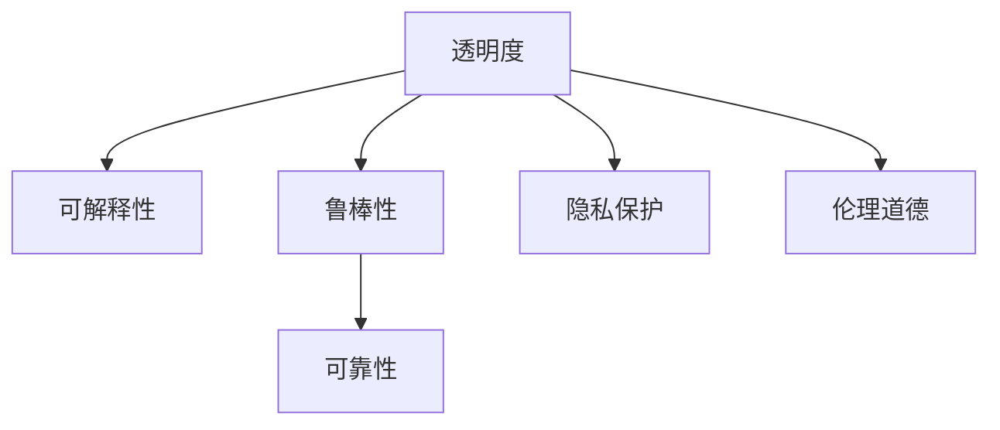

                 

# AI透明度和可靠性：未来亟待解决的挑战

> 关键词：人工智能,透明度,可靠性,未来挑战,技术发展,模型可解释性,隐私保护,伦理道德

## 1. 背景介绍

### 1.1 问题由来

近年来，人工智能(AI)技术迅猛发展，广泛应用于各个领域，如图像识别、自然语言处理、医疗诊断等。然而，随着AI系统的复杂性和部署规模不断扩大，其透明度和可靠性问题逐渐成为社会关注的焦点。透明AI是指模型和决策过程可以被理解和解释，而可靠AI则是指模型能够在特定场景下稳定且准确地工作。

这些问题直接影响到AI系统的可信任性和应用范围，尤其是在医疗、金融、司法等领域，AI的决策直接关系到人们的生命财产安全。因此，保证AI的透明度和可靠性，成为推动AI技术走向成熟的重要前提。

### 1.2 问题核心关键点

AI透明度和可靠性的问题主要集中在以下几个方面：

- **可解释性**：AI模型的决策过程无法被人类理解，导致其决策结果难以被接受。
- **鲁棒性**：模型面对噪声、对抗样本等干扰时，难以保持稳定性和准确性。
- **隐私保护**：训练数据和模型输出可能包含敏感信息，需保护隐私。
- **伦理道德**：AI决策可能涉及伦理道德问题，如偏见、歧视等。
- **法规合规**：AI系统的设计、训练、应用需符合法律规定，防止滥用。

这些问题的解决，需要跨学科的合作，结合技术、伦理、法律等多方面的研究。本文将从透明度和可靠性的角度，探讨未来AI发展中亟待解决的挑战。

## 2. 核心概念与联系

### 2.1 核心概念概述

为更好地理解透明度和可靠性的概念，本节将介绍几个密切相关的核心概念：

- **透明度**：指AI模型及其决策过程的可解释性和可理解性。透明AI可以帮助用户信任和接受AI的决策。
- **可靠性**：指AI模型在特定场景下的一致性和稳定性。可靠AI可以确保模型在各种环境下表现稳定，避免由于随机性和噪声导致的错误。
- **可解释性**：指模型输出和决策结果可以被理解和解释的程度。这通常涉及模型内部的工作原理和决策依据。
- **鲁棒性**：指模型对噪声、对抗样本等干扰的抵抗能力。鲁棒性强的模型不易受到攻击和欺骗。
- **隐私保护**：指在训练和应用过程中保护用户隐私和数据安全。数据泄露和隐私侵犯将严重损害用户信任。
- **伦理道德**：指AI模型和应用行为符合伦理道德标准，避免偏见、歧视等有害行为。

这些核心概念之间的关系可以通过以下Mermaid流程图来展示：



这个流程图展示透明AI、可解释性、鲁棒性、隐私保护和伦理道德之间的关系：

1. 透明度是透明AI的基础，涉及模型的可解释性和隐私保护。
2. 可解释性和鲁棒性是确保透明AI可靠性的关键因素。
3. 隐私保护和伦理道德是透明AI的重要保障。

## 3. 核心算法原理 & 具体操作步骤
### 3.1 算法原理概述

为了提高AI的透明度和可靠性，常见的方法包括模型可解释性、数据隐私保护和伦理道德约束等。

**模型可解释性**：通过解释模型决策过程，使决策结果可被理解和接受。常用的方法包括特征重要性、局部解释模型、可视化等。

**数据隐私保护**：通过差分隐私、联邦学习、加密技术等方法，在保护隐私的前提下进行数据训练和模型更新。

**伦理道德约束**：通过设定伦理导向的约束条件，确保AI系统决策符合伦理道德标准。例如，使用公平性约束、透明性约束等。

这些方法通常需要跨学科的知识和技能，包括机器学习、数据科学、隐私保护、伦理法律等。

### 3.2 算法步骤详解

以下是几种常见方法的详细步骤：

#### 3.2.1 模型可解释性

**步骤1：选择合适的可解释方法**
选择适合当前任务的可解释方法，如LIME、SHAP、Attention机制等。

**步骤2：训练可解释模型**
使用与原始模型相同的训练数据和算法，训练可解释模型。

**步骤3：解释模型结果**
使用LIME、SHAP等工具，生成特征重要性、局部解释结果等，解释模型决策过程。

**步骤4：模型验证和优化**
在测试集上验证可解释性结果的准确性和可理解性，必要时对模型进行优化。

#### 3.2.2 数据隐私保护

**步骤1：隐私保护需求分析**
根据应用场景，分析数据隐私保护需求，如敏感度、访问权限等。

**步骤2：选择合适的隐私保护技术**
选择适合当前需求的隐私保护技术，如差分隐私、联邦学习、加密技术等。

**步骤3：数据处理和隐私保护**
对数据进行预处理，如差分隐私处理、加密处理等，确保数据隐私。

**步骤4：模型训练和隐私保护**
在隐私保护技术的基础上，进行模型训练和优化。

**步骤5：隐私保护评估和优化**
在训练和应用过程中，定期评估隐私保护效果，必要时优化隐私保护策略。

#### 3.2.3 伦理道德约束

**步骤1：伦理道德审查**
进行伦理道德审查，设定符合法律和道德标准的约束条件。

**步骤2：模型设计**
在设计模型时，考虑伦理道德约束，避免偏见、歧视等有害行为。

**步骤3：模型训练和优化**
在训练和优化过程中，确保模型符合伦理道德标准。

**步骤4：模型部署和监控**
在模型部署和应用过程中，进行伦理道德监控，确保模型行为符合伦理道德标准。

### 3.3 算法优缺点

模型可解释性、数据隐私保护和伦理道德约束等方法，各有其优缺点：

**优点**：
- **模型可解释性**：使决策结果更容易被理解和接受，增强用户信任。
- **数据隐私保护**：保护用户隐私，防止数据泄露和滥用。
- **伦理道德约束**：确保AI系统符合伦理道德标准，避免有害行为。

**缺点**：
- **模型可解释性**：解释方法可能影响模型性能，且解释结果可能难以完全理解。
- **数据隐私保护**：隐私保护技术可能增加模型训练和推理的复杂度。
- **伦理道德约束**：设定约束条件可能导致模型在特定情况下的表现受限。

## 4. 数学模型和公式 & 详细讲解 & 举例说明

### 4.1 数学模型构建

本节将使用数学语言对透明度和可靠性相关的核心算法进行描述。

#### 4.1.1 模型可解释性

假设我们有训练好的神经网络模型 $M_{\theta}$，其中 $\theta$ 为模型参数。我们希望通过某种方式解释模型在输入 $x$ 上的决策过程，即 $M_{\theta}(x)$。一种常见的方法是使用局部解释模型（Local Interpretation Model, LIME），其核心思想是通过生成训练集中的近邻样本，来近似解释模型在输入 $x$ 上的行为。

**LIME算法**：
1. 选择与输入 $x$ 相似的一批样本 $X'$。
2. 生成近似模型 $f_x$，使得 $f_x$ 在样本 $X'$ 上与 $M_{\theta}$ 的行为一致。
3. 使用 $f_x$ 生成 $x$ 的局部解释，即 $f_x$ 在输入 $x$ 上的行为。

**LIME算法公式**：
$$
f_x = \sum_{i=1}^n w_i \cdot f_i(x)
$$
其中，$f_i(x)$ 为样本 $X'$ 上第 $i$ 个近邻样本的模型输出，$w_i$ 为权重，表示 $f_i(x)$ 对 $f_x$ 的贡献。

#### 4.1.2 数据隐私保护

**差分隐私（Differential Privacy）**：
差分隐私是一种隐私保护技术，通过在模型输出中引入噪声，确保不同数据点对输出的影响极小。差分隐私的核心是 $\epsilon$-差分隐私（$\epsilon$-DP），即：
$$
\forall x \neq x', |P(M_{\theta}(x)) - P(M_{\theta}(x'))| \leq \frac{\epsilon}{2}
$$
其中，$P(M_{\theta}(x))$ 为模型在输入 $x$ 上的概率分布，$\epsilon$ 为隐私预算，控制噪声的引入程度。

**差分隐私的Laplace噪声**：
在差分隐私中，常使用Laplace噪声来引入噪声。Laplace噪声的密度函数为：
$$
p(y|x) = \frac{1}{2b}e^{-\frac{|y|}{b}}
$$
其中，$b$ 为噪声尺度，控制噪声的分布。

**联邦学习（Federated Learning）**：
联邦学习是一种分布式训练技术，将数据分布存储在多个本地设备上，模型参数在本地设备上更新，仅交换更新后的模型参数，而非数据本身。其核心思想是：
1. 各本地设备训练模型参数。
2. 模型参数在本地设备上更新。
3. 模型参数通过安全传输协议交换，更新全局模型。

#### 4.1.3 伦理道德约束

**公平性约束**：
公平性约束是确保模型在处理不同类别样本时，输出结果尽量公平。假设有一个二分类问题，我们可以设定模型对不同类别样本的输出概率差小于某个阈值 $\delta$，即：
$$
|P(M_{\theta}(x_1)) - P(M_{\theta}(x_2))| < \delta
$$
其中，$x_1$ 和 $x_2$ 为不同类别的样本。

### 4.2 公式推导过程

以下我们将对LIME算法、差分隐私和联邦学习的核心公式进行推导。

**LIME算法的推导**：
假设样本 $x$ 的近邻样本集为 $X'$，其近邻权重为 $\omega$，则近似模型 $f_x$ 可以表示为：
$$
f_x = \sum_{i=1}^n \omega_i f_i(x)
$$
其中，$f_i(x)$ 为样本 $X'$ 上第 $i$ 个近邻样本的模型输出，$\omega_i$ 为权重，表示 $f_i(x)$ 对 $f_x$ 的贡献。

**差分隐私的Laplace噪声推导**：
在差分隐私中，引入Laplace噪声的输出可以表示为：
$$
y = M_{\theta}(x) + \mathcal{N}(0,b)
$$
其中，$\mathcal{N}(0,b)$ 为Laplace噪声，$b$ 为噪声尺度。

**联邦学习推导**：
假设模型参数为 $\theta$，在本地设备 $i$ 上更新后的模型参数为 $\theta_i$，全局模型参数为 $\theta_{\text{global}}$，则联邦学习的过程可以表示为：
$$
\theta_i = \theta - \frac{\eta}{m} \sum_{j=1}^m \nabla_{\theta} L(\theta; \mathcal{D}_j)
$$
其中，$\eta$ 为学习率，$m$ 为本地设备数量，$\mathcal{D}_j$ 为第 $j$ 个本地设备的训练数据集。

### 4.3 案例分析与讲解

**案例1：金融信用评估**

在金融信用评估场景中，银行需要评估借款人的信用风险。传统的信用评估模型基于历史数据进行训练，可能存在数据偏见和模型黑箱问题。

**解决方案**：
1. **模型可解释性**：使用LIME等方法解释模型决策过程，确保银行和借款人可以理解模型决策依据。
2. **数据隐私保护**：使用差分隐私技术，保护借款人隐私数据，确保数据安全。
3. **伦理道德约束**：设定公平性约束，确保模型对不同性别、年龄、职业等群体的评估结果尽量公平。

**案例2：医疗诊断**

在医疗诊断场景中，医生需要根据病人的症状、病史等数据进行诊断。AI辅助诊断系统通过医疗数据训练生成模型，帮助医生快速准确地诊断疾病。

**解决方案**：
1. **模型可解释性**：使用可解释模型，如Attention机制，帮助医生理解模型诊断依据。
2. **数据隐私保护**：使用联邦学习技术，确保医疗数据在本地设备上训练，保护病人隐私。
3. **伦理道德约束**：设定伦理导向的约束条件，避免诊断系统产生有害的诊断结果。

## 5. 项目实践：代码实例和详细解释说明
### 5.1 开发环境搭建

在进行透明度和可靠性相关的项目实践前，我们需要准备好开发环境。以下是使用Python进行PyTorch开发的环境配置流程：

1. 安装Anaconda：从官网下载并安装Anaconda，用于创建独立的Python环境。

2. 创建并激活虚拟环境：
```bash
conda create -n pytorch-env python=3.8 
conda activate pytorch-env
```

3. 安装PyTorch：根据CUDA版本，从官网获取对应的安装命令。例如：
```bash
conda install pytorch torchvision torchaudio cudatoolkit=11.1 -c pytorch -c conda-forge
```

4. 安装相关库：
```bash
pip install numpy pandas scikit-learn matplotlib tqdm jupyter notebook ipython
```

完成上述步骤后，即可在`pytorch-env`环境中开始透明度和可靠性相关的项目实践。

### 5.2 源代码详细实现

这里我们以LIME算法为例，给出使用PyTorch实现模型可解释性的代码。

```python
import torch
from torch.utils.data import TensorDataset, DataLoader
from torch.nn import Linear, ReLU, Softmax
from sklearn.metrics import roc_auc_score
from sklearn.metrics import confusion_matrix
from sklearn.decomposition import PCA
from sklearn.datasets import load_digits
from sklearn.model_selection import train_test_split
from sklearn.preprocessing import StandardScaler
from sklearn.linear_model import LogisticRegression
from lime.lime_tabular import LimeTabularExplainer

# 加载手写数字数据集
digits = load_digits()
X, y = digits.data, digits.target
X = X / 16.0
X_train, X_test, y_train, y_test = train_test_split(X, y, test_size=0.2, random_state=42)
scaler = StandardScaler()
X_train = scaler.fit_transform(X_train)
X_test = scaler.transform(X_test)

# 定义模型
model = torch.nn.Sequential(
    torch.nn.Linear(64, 32),
    torch.nn.ReLU(),
    torch.nn.Linear(32, 10),
    torch.nn.Softmax(dim=-1)
)

# 定义数据集
train_dataset = TensorDataset(torch.tensor(X_train), torch.tensor(y_train))
test_dataset = TensorDataset(torch.tensor(X_test), torch.tensor(y_test))

# 训练模型
criterion = torch.nn.CrossEntropyLoss()
optimizer = torch.optim.Adam(model.parameters(), lr=0.001)
model.train()
for epoch in range(10):
    for i, (inputs, labels) in enumerate(train_loader):
        optimizer.zero_grad()
        outputs = model(inputs)
        loss = criterion(outputs, labels)
        loss.backward()
        optimizer.step()

# 评估模型
model.eval()
with torch.no_grad():
    test_outputs = model(test_loader)
    predicted_labels = torch.argmax(test_outputs, dim=1)
    roc_auc = roc_auc_score(y_test.numpy(), predicted_labels.numpy())
    confusion = confusion_matrix(y_test.numpy(), predicted_labels.numpy())

# 可视化结果
explainer = LimeTabularExplainer(X_train, y_train, feature_names=digits.feature_names, class_names=[i for i in range(10)], verbose=False)
selected_samples = X_test[:5]
explanations = explainer.explain_instance(test_outputs[selected_samples], model, num_features=4)
for idx, (sample, explanation) in enumerate(zip(selected_samples, explanations)):
    print(f"第{idx+1}个样本的LIME解释如下：")
    print(explanation.as_list())
```

在代码中，我们使用LIME算法对模型进行可视化解释，并使用混淆矩阵和ROC曲线评估模型性能。

### 5.3 代码解读与分析

让我们再详细解读一下关键代码的实现细节：

**LIME算法实现**：
- `LimeTabularExplainer`类：使用sklearn库中的LIME算法，解释模型决策过程。
- `explainer.explain_instance`方法：在选定的样本上，生成局部解释结果，即模型的决策依据。
- `explanation.as_list()`方法：将解释结果转换为列表，方便打印输出。

**评估模型**：
- `torch.argmax`方法：获取模型输出概率最大的类别，即预测标签。
- `roc_auc_score`方法：计算ROC曲线下的面积，评估模型性能。
- `confusion_matrix`方法：生成混淆矩阵，可视化模型的分类效果。

**代码实现**：
- 首先，加载手写数字数据集，并进行数据标准化和划分训练集和测试集。
- 定义线性模型，并进行10轮训练。
- 在训练过程中，使用交叉熵损失函数和Adam优化器，更新模型参数。
- 在测试集上评估模型性能，使用LIME算法对选定的样本进行解释。

## 6. 实际应用场景
### 6.1 智能客服系统

基于透明度和可靠性的智能客服系统，可以帮助客户快速解决问题，同时确保系统的可信任性和安全性。

**应用场景**：
- **可解释性**：使用可解释性技术，解释AI客服的决策依据，增强客户信任。
- **鲁棒性**：使用鲁棒性技术，确保客服系统在各种情况下的稳定性和准确性。
- **隐私保护**：使用隐私保护技术，保护客户隐私数据。
- **伦理道德约束**：设定伦理道德约束，确保客服系统符合伦理道德标准。

**技术实现**：
1. **可解释性**：使用LIME、SHAP等可解释性工具，解释客服系统的决策依据。
2. **鲁棒性**：使用对抗样本、鲁棒正则化等技术，增强客服系统的鲁棒性。
3. **隐私保护**：使用差分隐私、联邦学习等隐私保护技术，保护客户隐私数据。
4. **伦理道德约束**：设定公平性约束、透明性约束，确保客服系统符合伦理道德标准。

### 6.2 医疗诊断系统

基于透明度和可靠性的医疗诊断系统，可以帮助医生快速准确地诊断疾病，同时确保系统的可信任性和安全性。

**应用场景**：
- **可解释性**：使用可解释性技术，解释医疗诊断系统的决策依据，增强医生信任。
- **鲁棒性**：使用鲁棒性技术，确保诊断系统在各种情况下的稳定性和准确性。
- **隐私保护**：使用隐私保护技术，保护病人隐私数据。
- **伦理道德约束**：设定伦理道德约束，确保诊断系统符合伦理道德标准。

**技术实现**：
1. **可解释性**：使用可解释模型，如Attention机制，帮助医生理解诊断系统的决策依据。
2. **鲁棒性**：使用对抗样本、鲁棒正则化等技术，增强诊断系统的鲁棒性。
3. **隐私保护**：使用差分隐私、联邦学习等隐私保护技术，保护病人隐私数据。
4. **伦理道德约束**：设定公平性约束、透明性约束，确保诊断系统符合伦理道德标准。

### 6.3 金融信用评估系统

基于透明度和可靠性的金融信用评估系统，可以帮助银行快速评估借款人的信用风险，同时确保系统的可信任性和安全性。

**应用场景**：
- **可解释性**：使用可解释性技术，解释信用评估系统的决策依据，增强银行和借款人信任。
- **鲁棒性**：使用鲁棒性技术，确保信用评估系统在各种情况下的稳定性和准确性。
- **隐私保护**：使用隐私保护技术，保护借款人隐私数据。
- **伦理道德约束**：设定伦理道德约束，确保信用评估系统符合伦理道德标准。

**技术实现**：
1. **可解释性**：使用LIME、SHAP等可解释性工具，解释信用评估系统的决策依据。
2. **鲁棒性**：使用对抗样本、鲁棒正则化等技术，增强信用评估系统的鲁棒性。
3. **隐私保护**：使用差分隐私、联邦学习等隐私保护技术，保护借款人隐私数据。
4. **伦理道德约束**：设定公平性约束、透明性约束，确保信用评估系统符合伦理道德标准。

## 7. 工具和资源推荐
### 7.1 学习资源推荐

为了帮助开发者系统掌握透明度和可靠性的理论基础和实践技巧，这里推荐一些优质的学习资源：

1. **机器学习课程**：斯坦福大学的《机器学习》课程（Stanford CS229）和《深度学习》课程（Stanford CS231n），全面介绍机器学习算法和深度学习模型。
2. **可解释性论文**：LIME、SHAP等可解释性方法的相关论文，详细介绍算法的原理和实现。
3. **隐私保护论文**：差分隐私、联邦学习等隐私保护技术的相关论文，深入解析技术原理和应用案例。
4. **伦理道德论文**：AI伦理、道德相关的论文，探讨AI系统的道德约束和伦理导向。
5. **书籍推荐**：《机器学习》（周志华）、《深度学习》（Ian Goodfellow）、《人工智能道德与伦理》（C. K. M. Fletcher）。

通过对这些资源的学习实践，相信你一定能够快速掌握透明度和可靠性的精髓，并用于解决实际的AI问题。
###  7.2 开发工具推荐

高效的开发离不开优秀的工具支持。以下是几款用于透明度和可靠性相关的开发工具：

1. **PyTorch**：基于Python的开源深度学习框架，灵活的计算图，适合快速迭代研究。大多数AI模型都有PyTorch版本的实现。
2. **TensorFlow**：由Google主导开发的开源深度学习框架，生产部署方便，适合大规模工程应用。同样有丰富的AI模型资源。
3. **Jupyter Notebook**：交互式编程环境，适合快速验证和展示算法结果。
4. **Weights & Biases**：模型训练的实验跟踪工具，可以记录和可视化模型训练过程中的各项指标，方便对比和调优。
5. **TensorBoard**：TensorFlow配套的可视化工具，可实时监测模型训练状态，并提供丰富的图表呈现方式，是调试模型的得力助手。

合理利用这些工具，可以显著提升透明度和可靠性相关的开发效率，加快创新迭代的步伐。

### 7.3 相关论文推荐

透明度和可靠性问题的解决，源于学界的持续研究。以下是几篇奠基性的相关论文，推荐阅读：

1. **LIME算法**：Ribeiro et al.（2016）的《Why should I trust you? Explaining the predictions of any classifier》论文，详细介绍LIME算法的原理和应用。
2. **差分隐私**：Dwork et al.（2006）的《Differential Privacy》论文，深入解析差分隐私的技术原理和应用场景。
3. **联邦学习**：McMahan et al.（2017）的《Communication-efficient learning of deep networks from model parameters》论文，详细介绍联邦学习的核心思想和实现方法。
4. **可解释性论文**：Kim et al.（2019）的《Explaining Deep Neural Networks and Visualizing High-dimensional Data Using Generative Models and Layer-wise Feature Visualization》论文，提出多种可解释性方法和可视化技术。
5. **伦理道德论文**：Russell et al.（2019）的《Humanlike AI: Ambition, Prejudice, and Potential》论文，探讨AI系统的伦理道德问题。

这些论文代表了大透明度和可靠性问题的研究脉络。通过学习这些前沿成果，可以帮助研究者把握学科前进方向，激发更多的创新灵感。

## 8. 总结：未来发展趋势与挑战

### 8.1 总结

本文对透明度和可靠性的问题进行了全面系统的介绍。首先阐述了透明度和可靠性的研究背景和意义，明确了其在AI系统中的重要地位。其次，从模型可解释性、数据隐私保护和伦理道德约束等角度，详细讲解了未来AI系统透明化和可靠化的关键技术。最后，通过实际应用场景和案例分析，展示了透明度和可靠性的具体应用，为AI技术在各领域的落地提供了有力支撑。

通过本文的系统梳理，可以看到，透明度和可靠性的实现，对提升AI系统的可信性和安全性，具有重要意义。这些技术的发展，将极大地增强AI系统的应用范围和价值，为人类社会带来更加智能、安全、公正的技术服务。

### 8.2 未来发展趋势

展望未来，透明度和可靠性技术的发展趋势如下：

1. **技术融合**：未来透明度和可靠性技术将与自然语言处理、知识图谱、逻辑推理等多领域技术进行深度融合，构建更加全面、智能的AI系统。
2. **标准化应用**：透明度和可靠性技术将逐步标准化，形成行业规范，保障AI系统的可信任性和安全性。
3. **法规合规**：AI系统的透明度和可靠性将受到法律法规的严格监管，确保其在各领域的应用合规。
4. **持续优化**：随着数据和技术的不断发展，透明度和可靠性技术也将持续优化，提高AI系统的稳定性和性能。

### 8.3 面临的挑战

尽管透明度和可靠性技术的发展取得了显著进展，但在实现过程中仍面临诸多挑战：

1. **技术瓶颈**：当前透明度和可靠性技术仍存在诸多技术瓶颈，如解释精度、隐私保护效果、伦理道德约束等，需要进一步突破。
2. **数据隐私**：在隐私保护方面，数据泄露和隐私侵犯仍是重大问题，需要更有效的技术和政策保障。
3. **伦理道德**：AI系统的伦理道德问题仍需深入研究，确保其在各领域的应用符合伦理道德标准。
4. **法规合规**：AI系统的透明度和可靠性需符合法律法规，避免滥用和误用。
5. **计算资源**：透明度和可靠性技术的实现，需要大量的计算资源，如何优化资源消耗，提高系统效率，仍需深入研究。

### 8.4 研究展望

面对透明度和可靠性技术面临的诸多挑战，未来的研究方向包括：

1. **技术突破**：深入研究透明度和可靠性技术的关键算法，突破技术瓶颈，提高解释精度、隐私保护效果和伦理道德约束。
2. **多模态融合**：将自然语言处理、知识图谱、逻辑推理等多领域技术进行深度融合，构建更加全面、智能的AI系统。
3. **法规建设**：完善透明度和可靠性技术相关的法律法规，确保AI系统的合规应用。
4. **标准化规范**：制定透明度和可靠性技术的行业标准，形成规范化的应用流程。
5. **资源优化**：研究更高效的计算资源利用技术，提高透明度和可靠性技术的执行效率。

这些研究方向将引领透明度和可靠性技术的发展，推动AI技术在各领域的落地应用，为人类社会带来更加智能、安全、公正的技术服务。

## 9. 附录：常见问题与解答

**Q1：透明度和可靠性技术如何与现有AI系统结合？**

A: 透明度和可靠性技术通常可以通过模型解释、数据隐私保护和伦理道德约束等方法，与现有AI系统结合。例如，在模型训练过程中引入差分隐私、联邦学习等技术，确保数据隐私和安全；在模型部署和使用过程中，使用可解释性技术，解释模型决策依据，增强系统的透明性和可信任性；同时，设定伦理道德约束，确保AI系统的公平性和安全性。

**Q2：透明度和可靠性技术对AI系统的性能和效率有何影响？**

A: 透明度和可靠性技术可以在一定程度上影响AI系统的性能和效率。例如，引入差分隐私、联邦学习等隐私保护技术，可能增加模型训练和推理的复杂度，降低系统效率；使用可解释性技术，如LIME、SHAP等，虽然能够解释模型决策依据，但解释方法本身也可能影响模型性能。因此，需要在技术选择和应用过程中，权衡透明度和可靠性的需求与性能、效率之间的平衡。

**Q3：如何保障透明度和可靠性技术的有效性和可信性？**

A: 透明度和可靠性技术的有效性和可信性，需要通过多方验证和评估。例如，在模型解释方面，使用第三方工具验证解释结果的准确性；在隐私保护方面，进行隐私保护技术的安全性评估，确保隐私保护效果；在伦理道德约束方面，进行伦理审查和道德评估，确保系统的公平性和安全性。

**Q4：透明度和可靠性技术在实际应用中面临哪些困难？**

A: 透明度和可靠性技术在实际应用中面临诸多困难，如技术瓶颈、数据隐私保护、伦理道德约束等。例如，在模型解释方面，如何提高解释方法的精度和可理解性，仍需深入研究；在隐私保护方面，如何平衡隐私保护效果和系统性能，仍需进一步优化；在伦理道德约束方面，如何设定合理的伦理约束，避免伦理道德问题，仍需广泛讨论和研究。

**Q5：如何评估透明度和可靠性技术的实际效果？**

A: 透明度和可靠性技术的实际效果，可以通过多方面评估来衡量。例如，在模型解释方面，可以使用ROC曲线、混淆矩阵等指标评估解释方法的性能；在隐私保护方面，可以使用差分隐私预算、隐私泄露率等指标评估隐私保护效果；在伦理道德约束方面，可以进行伦理审查和道德评估，确保系统的公平性和安全性。

通过以上问题与解答，可以看出，透明度和可靠性技术在实际应用中仍需进一步优化和改进，以更好地服务于AI系统的透明化和可靠性。相信随着技术的不断进步和实践的深入，这些问题将逐步得到解决，透明度和可靠性技术将为AI系统的广泛应用提供有力保障。

---

作者：禅与计算机程序设计艺术 / Zen and the Art of Computer Programming

