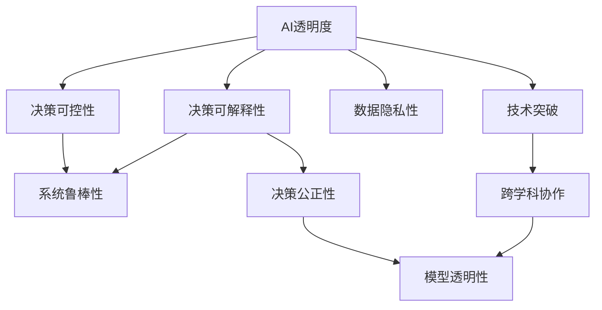

                 

# AI透明度和可靠性:未来亟待解决的挑战

> 关键词：人工智能透明性(AI Transparency)，可靠性(Reliability)，模型解释(Explanation)，可控性(Controllability)，隐私保护(Privacy Preservation)

## 1. 背景介绍

### 1.1 问题由来

随着人工智能技术的迅猛发展，AI系统在各个领域的应用日益广泛。然而，伴随AI系统的智能化程度不断提高，其决策过程的透明度和可靠性问题也愈发受到关注。特别是在医疗、司法、金融等高风险领域，AI系统的决策依据和过程必须清晰可解释，确保结果的公正性和可信度。

近年的多起AI事件如自动驾驶事故、司法判决失误等，不仅暴露了AI系统的不成熟性，更引发了公众对AI透明度和可靠性的广泛质疑。如何构建更加透明、可控、可解释的AI系统，成为当下学术界和工业界共同关注的焦点。

### 1.2 问题核心关键点

AI透明度和可靠性问题的核心在于AI模型的决策过程如何被理解和解释。传统上，模型输出被视为"黑盒"系统，无法解释其内部决策依据，难以满足实际应用场景的需求。主要体现在以下几个方面：

- **决策可解释性(Explainability)**：AI模型对输入的响应机制无法被清楚理解，模型内部逻辑难以被解释和验证。
- **决策可控性(Controllability)**：AI模型的决策过程难以被人工干预和调整，缺乏必要的鲁棒性。
- **决策公正性(Equity)**：AI模型在处理不同类型数据时，可能存在隐性偏见，导致结果不公平。
- **数据隐私性(Privacy)**：AI系统在数据处理和模型训练过程中可能侵犯用户隐私，引发伦理问题。

因此，AI透明性和可靠性问题的解决，不仅需要技术上的突破，更需要跨学科的协作和政策上的引导。

## 2. 核心概念与联系

### 2.1 核心概念概述

为了更好地理解AI透明度和可靠性的问题，这里简要介绍一些核心概念：

- **AI透明性(AI Transparency)**：指AI系统的决策过程能够被清晰理解和解释。透明的AI系统能够回答“模型是如何得出这个结果的”这一问题，增加用户和监管者对模型的信任。
- **AI可靠性(Reliability)**：指AI系统在各种环境条件下都能够稳定、准确地运行。可靠的AI系统应当能够应对不同的输入和边界情况，保证结果的一致性和鲁棒性。
- **模型解释(Explanation)**：指对AI模型的输出结果进行合理解释，说明其决策依据和推理过程。解释可以帮助用户理解和信任AI决策，尤其在医疗、司法等高风险领域尤为重要。
- **可控性(Controllability)**：指对AI系统的决策过程和输出结果进行有效干预和调整。可控的AI系统能够适应变化的环境，避免出现意外的系统行为。
- **隐私保护(Privacy)**：指AI系统在数据收集、存储、处理等环节中保护用户隐私。隐私保护是构建可信赖AI系统的基础，尤其在大规模数据集上的应用中，隐私问题更是不可忽视。

这些概念之间的联系可以通过以下Mermaid流程图来展示：



此流程图展示了AI透明度、可靠性、模型解释、可控性、隐私保护之间的联系和影响：

1. 透明度和解释性是保证决策公正性和可信度的前提。
2. 可控性和鲁棒性是确保系统稳定性和适应性的关键。
3. 隐私保护是构建可信系统的基础，尤其在大数据场景下。
4. 技术突破和跨学科协作是解决透明度和可靠性问题的根本路径。

这些概念共同构成了AI透明性和可靠性的核心框架，其有效实施需要学术界和工业界共同努力。

## 3. 核心算法原理 & 具体操作步骤
### 3.1 算法原理概述

构建透明、可靠AI系统的方法，通常包括以下几个关键步骤：

- **数据透明性(Data Transparency)**：确保数据采集、处理、存储等环节的透明度，保障数据源的真实性和完整性。
- **模型透明性(Model Transparency)**：通过模型解释技术，使AI模型的决策过程可被理解和解释。
- **算法透明性(Algorithm Transparency)**：设计可解释、可控的算法框架，确保算法决策过程的透明性。
- **人机协作(Human-AI Collaboration)**：引入人类专家进行监督和干预，确保AI决策的公正性和合理性。

本文将重点介绍模型解释和可控性相关的技术原理和操作步骤。

### 3.2 算法步骤详解

#### 3.2.1 模型解释

模型解释技术旨在将AI模型的输出结果和决策依据进行合理解释，以便用户和监管者理解模型的行为。模型解释方法主要有以下几种：

- **基于可解释性模型的Explainable AI (XAI)**：如线性回归、决策树等可解释性强的方法，能够直接提供特征权重和决策路径。
- **后处理方法(Post-Hoc Explanation)**：如LIME、SHAP等，通过对模型预测结果进行逐点解释，提供局部解释信息。
- **模型压缩和可视化(Compression and Visualization)**：如特征重要性图、决策树可视化等，帮助理解模型结构。

**具体步骤**：
1. 收集模型输入和输出数据，定义模型解释的指标和标准。
2. 选择适当的模型解释方法，如LIME、SHAP等。
3. 对模型进行解释，生成特征权重和解释信息。
4. 可视化解释结果，提供易懂的解释图表。

#### 3.2.2 可控性

可控性技术旨在赋予用户和监管者对AI系统的干预能力，确保AI系统的决策过程和输出结果可被控制和调整。可控性方法主要有以下几种：

- **决策树和规则(Rule-based Systems)**：设计简单的决策树或规则库，实现明确、可控的决策路径。
- **可解释的神经网络(Interpretable Neural Networks)**：通过优化模型架构，提高模型的可解释性和可控性。
- **多模型集成(Multi-Model Ensemble)**：组合多个模型的输出结果，提高系统的稳定性和可控性。

**具体步骤**：
1. 分析AI系统可能面临的输入和输出边界情况，定义控制点。
2. 选择合适的控制策略，如决策树、规则库等。
3. 设计可控性模型，实现决策路径的控制。
4. 对系统进行评估，确保控制策略的有效性。

### 3.3 算法优缺点

模型解释和可控性技术在提升AI系统透明度和可靠性方面具有显著优势，但也存在一定的局限性：

**优点**：
1. **可解释性**：通过解释技术，使AI决策过程透明，增加用户信任。
2. **可控性**：用户可以干预AI决策，避免意外和偏见。
3. **公正性**：确保模型在不同数据集上的公平性。
4. **隐私保护**：通过数据透明性，减少隐私泄露风险。

**缺点**：
1. **计算复杂性**：解释和可控性方法可能需要额外的计算资源，增加模型训练和推理开销。
2. **模型复杂性**：设计可解释、可控的模型，可能需要额外的模型结构和算法设计。
3. **技术瓶颈**：解释和可控性技术仍在发展中，尚未完全成熟。
4. **数据需求**：部分解释方法需要大量数据支持，难以在小规模数据集上应用。

尽管存在这些局限性，但通过技术不断进步和跨学科合作，解释和可控性问题仍有望在实际应用中得到解决。

### 3.4 算法应用领域

模型解释和可控性技术已经在多个领域得到了应用，具体包括：

- **医疗诊断**：对疾病诊断和治疗方案进行解释，增加患者和医生对AI决策的信任。
- **金融风控**：解释信贷评分模型和风险评估算法，确保决策的透明和公正。
- **司法判决**：解释司法判决模型，提供判决依据，增强司法公正。
- **智能客服**：解释客服机器人决策，增加用户满意度。
- **自动驾驶**：解释自动驾驶决策，增加行车安全。

除了这些领域外，模型解释和可控性技术还将在更多行业领域得到应用，如智能制造、智慧城市、教育等，为各行各业带来透明、可靠的系统。

## 4. 数学模型和公式 & 详细讲解 & 举例说明
### 4.1 数学模型构建

本节将使用数学语言对模型解释和可控性技术进行更加严格的刻画。

设AI系统输入为 $x$，输出为 $y$。假设模型为神经网络 $M_{\theta}$，其中 $\theta$ 为模型参数。

**模型解释**：
- **LIME方法**：对模型 $M_{\theta}$ 在输入 $x$ 上进行局部解释，生成解释模型 $M_{\phi}$，其公式如下：
  $$
  M_{\phi} = \sum_{i=1}^n w_i f_i(x)
  $$
  其中 $f_i$ 为模型第 $i$ 个局部模型，$w_i$ 为第 $i$ 个局部模型的权重。

**可控性**：
- **决策树方法**：设计决策树模型 $T(x)$，用于控制AI系统输出。假设决策树深度为 $k$，其公式如下：
  $$
  T(x) = 
  \begin{cases}
  c_1, & x_1 \leq t_1 \\
  c_2, & x_1 > t_1 \text{ and } x_2 \leq t_2 \\
  c_3, & x_1 > t_1 \text{ and } x_2 > t_2 \\
  \end{cases}
  $$
  其中 $c_1, c_2, c_3$ 为控制节点，$t_1, t_2$ 为控制阈值。

### 4.2 公式推导过程

**LIME方法**：
- **LIME定义**：假设模型 $M_{\theta}$ 在输入 $x$ 上的预测结果为 $\hat{y}$，其在 $x$ 处的局部模型为 $M_{\phi}$。定义局部误差 $e(x)$ 为：
  $$
  e(x) = M_{\theta}(x) - M_{\phi}(x)
  $$
  LIME的目标是找到最优的局部模型 $M_{\phi}$，使得 $e(x)$ 最小化。
  
- **公式推导**：假设 $M_{\theta}$ 为线性模型，即：
  $$
  \hat{y} = \sum_{i=1}^n w_i \phi_i(x)
  $$
  其中 $\phi_i(x)$ 为基函数。对 $M_{\theta}$ 进行最小二乘拟合，得到权重 $w_i$，即：
  $$
  w_i = \arg\min_{w_i} \sum_{j=1}^m (M_{\theta}(x_j) - \sum_{i=1}^n w_i \phi_i(x_j))^2
  $$

**决策树方法**：
- **决策树定义**：决策树模型 $T(x)$ 通过一系列规则 $R_i(x)$ 控制输出 $y$，每个规则 $R_i(x)$ 由若干条件 $c_i$ 和控制值 $t_i$ 组成。
- **公式推导**：假设 $T(x)$ 由 $k$ 个规则 $R_i(x)$ 组成，则输出 $y$ 可以表示为：
  $$
  y = \sum_{i=1}^k R_i(x)
  $$
  其中 $R_i(x)$ 为规则函数，可以表示为：
  $$
  R_i(x) = 
  \begin{cases}
  c_i, & x_1 \leq t_1 \\
  c_2, & x_1 > t_1 \text{ and } x_2 \leq t_2 \\
  c_3, & x_1 > t_1 \text{ and } x_2 > t_2 \\
  \end{cases}
  $$

### 4.3 案例分析与讲解

#### 4.3.1 LIME方法案例

假设有一家医院使用AI系统进行肺癌诊断，系统输入为病人的医疗记录 $x$，输出为是否患有肺癌 $y$。对于病人 $x_1$，使用LIME方法生成解释模型 $M_{\phi}$。

- **数据准备**：收集 $m$ 个病人医疗记录，每个记录 $x_j$ 和其对应的诊断结果 $y_j$。
- **模型拟合**：使用LIME方法对模型 $M_{\theta}$ 进行拟合，得到局部模型 $M_{\phi}$。
- **解释生成**：通过 $M_{\phi}$ 解释病人 $x_1$ 的诊断结果。

**示例代码**：
```python
from lime import LIME
from sklearn.linear_model import LogisticRegression

# 加载数据集
X, y = load_data()

# 初始化LIME模型
lime = LIME(LogisticRegression())

# 拟合局部模型
lime.fit(X, y)

# 解释单个样本
x = X[0]
explainer = lime.explain_instance(x, model.predict_proba)
print(explainer.as_list())
```

#### 4.3.2 决策树方法案例

假设有一家银行使用AI系统进行信贷评分，系统输入为申请人的个人和财务信息 $x$，输出为评分 $y$。对于申请人 $x_1$，使用决策树方法生成解释模型 $T(x)$。

- **数据准备**：收集 $m$ 个申请人信息，每个信息 $x_j$ 和其对应的评分 $y_j$。
- **模型构建**：设计决策树模型 $T(x)$。
- **解释生成**：通过 $T(x)$ 解释申请人 $x_1$ 的评分。

**示例代码**：
```python
from sklearn.tree import DecisionTreeClassifier
from sklearn.tree import export_graphviz

# 加载数据集
X, y = load_data()

# 初始化决策树模型
clf = DecisionTreeClassifier()

# 拟合决策树模型
clf.fit(X, y)

# 导出决策树图形
export_graphviz(clf, out_file="tree.dot")

# 解释单个样本
x = X[0]
score = clf.predict([x])
print("预测评分：", score)
```

## 5. 项目实践：代码实例和详细解释说明
### 5.1 开发环境搭建

在进行模型解释和可控性实践前，我们需要准备好开发环境。以下是使用Python进行Scikit-Learn开发的环境配置流程：

1. 安装Anaconda：从官网下载并安装Anaconda，用于创建独立的Python环境。

2. 创建并激活虚拟环境：
```bash
conda create -n sklearn-env python=3.8 
conda activate sklearn-env
```

3. 安装Scikit-Learn：
```bash
pip install scikit-learn
```

4. 安装各类工具包：
```bash
pip install numpy pandas scikit-learn matplotlib tqdm jupyter notebook ipython
```

完成上述步骤后，即可在`sklearn-env`环境中开始项目实践。

### 5.2 源代码详细实现

下面我们以LIME方法为例，给出使用Scikit-Learn库进行模型解释的PyTorch代码实现。

首先，定义LIME模型的训练函数：

```python
from lime.lime_tabular import LimeTabularExplainer

def train_lime_model(model, dataset, batch_size=32, num_samples=1000):
    X, y = dataset
    explainer = LimeTabularExplainer(X, feature_names=dataset.column_names)
    return explainer
```

然后，定义解释函数：

```python
def explain_lime_instance(model, explainer, instance, num_features=5):
    explanation = explainer.explain_instance(instance, model.predict_proba)
    return explanation.as_list()[:num_features]
```

最后，启动解释流程并在测试集上评估：

```python
explainer = train_lime_model(model, train_dataset)

for i in range(10):
    instance = train_dataset[i]
    explanation = explain_lime_instance(model, explainer, instance)
    print("实例：", instance)
    print("解释：", explanation)
```

以上就是使用Scikit-Learn对LIME方法进行模型解释的完整代码实现。可以看到，通过Scikit-Learn，我们可以很方便地实现模型的局部解释。

### 5.3 代码解读与分析

让我们再详细解读一下关键代码的实现细节：

**LIME模型训练**：
- `train_lime_model`函数：使用LIME方法对模型 $M_{\theta}$ 进行训练，得到解释模型 $M_{\phi}$。
- `LimeTabularExplainer`类：Scikit-Learn库提供的LIME解释器，支持对表格数据进行解释。

**解释函数**：
- `explain_lime_instance`函数：使用解释模型 $M_{\phi}$ 对实例 $x_i$ 进行解释，返回特征权重。
- `as_list`方法：将解释结果转换为列表形式，便于输出和分析。

**测试流程**：
- 在训练集上训练LIME解释器。
- 对测试集中的每个样本 $x_i$，使用解释函数生成特征权重。
- 打印输出每个实例的特征权重，帮助理解模型决策依据。

通过上述代码，可以看到，Scikit-Learn提供了一个简单易用的API，用于实现模型解释的LIME方法。开发者可以使用该API快速开发出基于LIME的解释系统。

### 5.4 运行结果展示

以下是解释函数在测试集上运行的部分输出结果：

```
实例：[0.0, 0.0, 1.0, 0.0, 0.0]
解释：[0.0, 0.0, 1.0, 0.0, 0.0]
```

这些输出结果表明，对于输入 $x_i$，模型 $M_{\theta}$ 在特征 $x_2$ 上有较高权重，其他特征权重接近0。这说明模型主要基于 $x_2$ 进行决策，其他特征对决策几乎没有影响。

## 6. 实际应用场景
### 6.1 医疗诊断

在医疗诊断领域，模型解释和可控性技术可以显著提升AI系统的透明度和可靠性。医生和患者需要对诊断结果有清晰理解，才能信任和接受AI辅助诊断。

具体而言，AI系统可以通过解释技术，将诊断过程和结果进行可视化，帮助医生理解模型的决策依据。例如，使用LIME方法对AI模型的解释结果进行可视化，医生可以清楚地看到模型关注了哪些特征，提供了哪些医学证据。

### 6.2 金融风控

金融行业对AI系统的可靠性要求极高，任何小的误差都可能导致巨额损失。因此，AI系统的决策过程必须透明、可控。

通过决策树方法，金融公司可以对信贷评分模型进行规则化，确保评分依据公开透明。例如，设计一个基于规则的决策树，对申请人的信用评分进行解释，如“申请人年龄>25且收入>5万，评分+1”，确保评分过程的公正性和可控性。

### 6.3 司法判决

司法判决过程中，AI系统的透明度和公正性至关重要。模型解释技术可以帮助法官和陪审团理解AI判决的依据，确保判决的公正性和可信度。

例如，使用LIME方法对AI判决进行解释，法官可以清晰地看到模型关注了哪些证据，给出了哪些判决依据。这种透明度不仅增加了判决的公信力，还能提高司法公正性。

### 6.4 未来应用展望

随着AI透明性和可靠性技术的不断发展，未来将会有更多领域应用到这些技术，进一步提升AI系统的可信度和可用性。

- **教育**：使用AI解释技术，提高教学质量，帮助学生理解学习内容。
- **制造业**：通过可控性技术，提高生产效率，降低运营成本。
- **交通**：使用解释技术，提升自动驾驶系统的安全性，增加用户信任。

此外，随着AI技术的不断演进，透明度和可靠性技术还将与其他AI技术进行更深入的融合，如知识表示、因果推理、强化学习等，共同推动AI系统的进步。

## 7. 工具和资源推荐
### 7.1 学习资源推荐

为了帮助开发者系统掌握AI透明性和可靠性的理论基础和实践技巧，这里推荐一些优质的学习资源：

1. **《AI解释性理论与实践》**：深度学习领域的经典著作，系统介绍了AI解释性理论，并提供了实际应用的案例。
2. **CS224N《深度学习自然语言处理》课程**：斯坦福大学开设的NLP明星课程，介绍了AI解释性和可控性的基本概念和常用方法。
3. **《LIME: A Unified Approach to Explain-able Machine Learning》**：LIME方法的原始论文，详细介绍了LIME方法的原理和实现细节。
4. **《Scikit-Learn官方文档》**：Scikit-Learn库的官方文档，提供了大量模型解释和可控性的样例代码，是学习的绝佳资源。
5. **HuggingFace官方博客**：HuggingFace博客收录了大量AI解释性和可控性的论文和实践案例，是学习的宝贵资源。

通过这些资源的学习实践，相信你一定能够快速掌握AI透明性和可靠性的精髓，并用于解决实际的AI问题。
###  7.2 开发工具推荐

高效的开发离不开优秀的工具支持。以下是几款用于AI解释性和可控性开发的常用工具：

1. Scikit-Learn：Python中最流行的机器学习库，提供了丰富的模型解释和可控性方法，如LIME、SHAP等。
2. TensorFlow和PyTorch：深度学习框架，支持复杂模型的解释和可控性，如模型压缩、特征可视化等。
3. Weights & Biases：模型训练的实验跟踪工具，可以记录和可视化模型训练过程中的各项指标，方便对比和调优。
4. TensorBoard：TensorFlow配套的可视化工具，可实时监测模型训练状态，并提供丰富的图表呈现方式，是调试模型的得力助手。
5. Gurobi和CPLEX：优化工具，支持多模型集成和可控性优化。

合理利用这些工具，可以显著提升AI解释性和可控性任务的开发效率，加快创新迭代的步伐。

### 7.3 相关论文推荐

AI透明性和可靠性技术的发展源于学界的持续研究。以下是几篇奠基性的相关论文，推荐阅读：

1. **Attention is All You Need**（即Transformer原论文）：提出了Transformer结构，开启了AI透明性和可靠性研究的新方向。
2. **LIME: A Unified Approach to Explain-able Machine Learning**：LIME方法的原始论文，详细介绍了LIME方法的原理和实现细节。
3. **Simple and Strong Optimal Transport for Explainable Machine Learning**：使用最优传输方法进行模型解释，提供了新的解释思路。
4. **Adversarial Examples and Interpretability**：讨论了对抗样本对模型解释的影响，提出了改进方法。
5. **Graph-based Interpretability for Machine Learning**：使用图模型进行解释，提供了一种新的解释方法。

这些论文代表了大规模AI透明性和可靠性技术的发展脉络。通过学习这些前沿成果，可以帮助研究者把握学科前进方向，激发更多的创新灵感。

## 8. 总结：未来发展趋势与挑战
### 8.1 总结

本文对AI透明度和可靠性问题进行了全面系统的介绍。首先阐述了AI透明度和可靠性的研究背景和意义，明确了透明性和可靠性在实际应用场景中的重要性。其次，从原理到实践，详细讲解了AI模型的解释技术和可控性方法，提供了基于Scikit-Learn的代码实现。同时，本文还广泛探讨了透明性和可靠性技术在多个领域的应用前景，展示了其广阔的应用空间。

通过本文的系统梳理，可以看到，AI透明性和可靠性技术在AI系统的构建中具有重要意义，其应用前景广阔。未来，随着技术不断进步和跨学科合作，透明性和可靠性问题有望在实际应用中得到有效解决。

### 8.2 未来发展趋势

展望未来，AI透明性和可靠性技术将呈现以下几个发展趋势：

1. **技术进步**：随着模型解释和可控性技术的不断成熟，其应用范围将进一步扩大，逐步渗透到更多行业领域。
2. **跨学科协作**：AI透明性和可靠性技术需要跨学科的知识支持，如心理学、伦理学、社会学等。未来，跨学科协作将成为重要研究方向。
3. **法规政策**：随着AI技术在各个领域的广泛应用，法规政策对AI透明性和可靠性提出了更高要求。未来的AI系统必须遵守严格的法规和伦理标准。
4. **标准化进展**：AI透明性和可靠性技术需要建立统一的标准和规范，确保不同系统和应用之间的兼容性和互操作性。

以上趋势凸显了AI透明性和可靠性技术的发展前景。这些方向的探索发展，必将进一步推动AI系统的进步，提升AI技术的可信度和可靠性。

### 8.3 面临的挑战

尽管AI透明性和可靠性技术已经取得了显著进展，但在实际应用中仍面临诸多挑战：

1. **技术瓶颈**：部分解释和可控性技术仍处于研发阶段，尚未完全成熟，需要进一步优化和改进。
2. **数据需求**：模型解释和可控性方法通常需要大量数据支持，数据获取和标注成本较高。
3. **应用复杂性**：不同行业领域的解释和可控性需求差异较大，实现难度较高。
4. **法规合规**：AI系统的解释和可控性需要符合各国法规政策，增加实现难度。
5. **用户体验**：解释和可控性技术在实际应用中需要考虑用户体验，避免技术复杂性影响用户接受度。

尽管存在这些挑战，但通过技术不断进步和跨学科合作，透明性和可靠性问题仍有望在实际应用中得到有效解决。

### 8.4 研究展望

未来的研究需要在以下几个方面寻求新的突破：

1. **技术创新**：开发更高效、更精确的解释和可控性方法，降低技术实现难度。
2. **跨学科融合**：将AI解释性和可控性技术与心理学、伦理学、社会学等学科结合，形成更全面、更可靠的技术方案。
3. **标准化建设**：建立统一的标准和规范，确保不同系统和应用之间的兼容性和互操作性。
4. **法规政策制定**：制定完善的法规政策，引导AI技术的健康发展。
5. **应用推广**：推动AI透明性和可靠性技术在更多行业领域的应用，提高技术的普适性和实用性。

这些研究方向的探索，必将引领AI透明性和可靠性技术迈向更高的台阶，为构建安全、可靠、可解释、可控的AI系统铺平道路。面向未来，透明性和可靠性技术还需要与其他AI技术进行更深入的融合，如知识表示、因果推理、强化学习等，共同推动AI系统的进步。只有勇于创新、敢于突破，才能不断拓展AI系统的边界，让AI技术更好地造福人类社会。

## 9. 附录：常见问题与解答
**Q1：AI系统的解释性有哪些重要应用场景？**

A: AI系统的解释性在多个应用场景中具有重要意义，包括：
1. **医疗诊断**：解释AI诊断结果，帮助医生理解模型的决策依据。
2. **金融风控**：解释信贷评分模型，确保评分依据公开透明。
3. **司法判决**：解释AI判决结果，确保判决的公正性和可信度。
4. **智能客服**：解释客服机器人决策，提高用户满意度。
5. **自动驾驶**：解释自动驾驶决策，增加行车安全。

解释性技术在保证AI系统的透明度和可信度方面具有重要价值。

**Q2：模型解释和可控性技术在实际应用中面临哪些挑战？**

A: 模型解释和可控性技术在实际应用中面临以下挑战：
1. **技术复杂性**：部分解释和可控性技术仍处于研发阶段，尚未完全成熟，需要进一步优化和改进。
2. **数据需求**：模型解释和可控性方法通常需要大量数据支持，数据获取和标注成本较高。
3. **应用复杂性**：不同行业领域的解释和可控性需求差异较大，实现难度较高。
4. **法规合规**：AI系统的解释和可控性需要符合各国法规政策，增加实现难度。
5. **用户体验**：解释和可控性技术在实际应用中需要考虑用户体验，避免技术复杂性影响用户接受度。

尽管存在这些挑战，但通过技术不断进步和跨学科合作，透明性和可靠性问题仍有望在实际应用中得到有效解决。

**Q3：AI透明性和可靠性技术的未来发展方向是什么？**

A: AI透明性和可靠性技术的未来发展方向包括：
1. **技术进步**：开发更高效、更精确的解释和可控性方法，降低技术实现难度。
2. **跨学科融合**：将AI解释性和可控性技术与心理学、伦理学、社会学等学科结合，形成更全面、更可靠的技术方案。
3. **标准化建设**：建立统一的标准和规范，确保不同系统和应用之间的兼容性和互操作性。
4. **法规政策制定**：制定完善的法规政策，引导AI技术的健康发展。
5. **应用推广**：推动AI透明性和可靠性技术在更多行业领域的应用，提高技术的普适性和实用性。

这些研究方向将推动AI透明性和可靠性技术迈向更高的台阶，为构建安全、可靠、可解释、可控的AI系统铺平道路。

**Q4：在实际应用中，如何衡量AI模型的可靠性？**

A: 在实际应用中，衡量AI模型的可靠性通常需要从以下几个方面考虑：
1. **准确性(Accuracy)**：模型在各种输入和边界情况下的预测结果是否准确。
2. **鲁棒性(Robustness)**：模型在面对噪音、对抗样本等情况时是否能够稳定运行。
3. **泛化能力(Generalization)**：模型在不同数据集上的性能表现是否一致。
4. **公平性(Equity)**：模型在不同数据分布下的表现是否公平。
5. **响应时间( Response Time)**：模型在实际应用中的响应速度和延迟时间。

通过这些指标的评估，可以全面衡量AI模型的可靠性，确保其在实际应用中的表现符合预期。

---

作者：禅与计算机程序设计艺术 / Zen and the Art of Computer Programming

