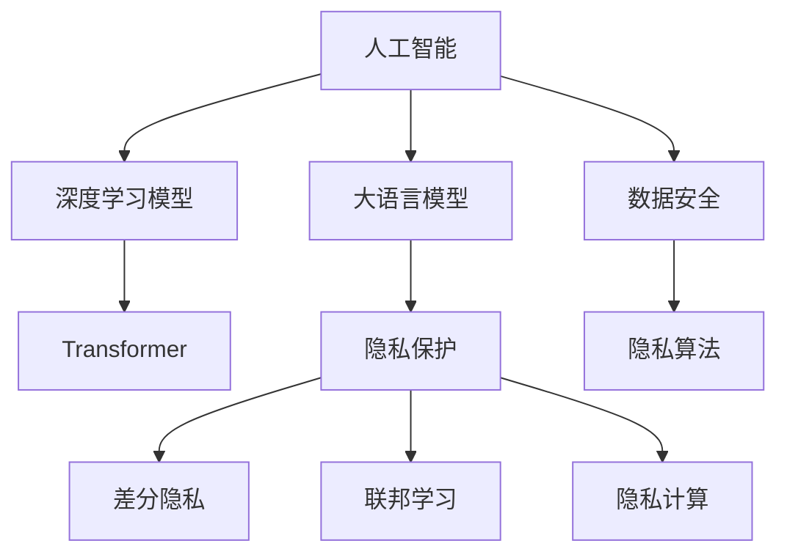

                 

# AI隐私保护：LLM时代的数据安全

> 关键词：人工智能,隐私保护,数据安全,深度学习模型,Transformer,大语言模型,隐私技术,联邦学习,差分隐私

## 1. 背景介绍

### 1.1 问题由来
随着深度学习技术和大语言模型(LLM)的飞速发展，人工智能在各个领域的应用越来越广泛。然而，这些模型通常依赖于大量的数据进行训练，包括用户的个人信息、行为数据等敏感信息。在使用这些模型进行预测、推荐、分析时，如何在保护用户隐私的前提下，安全地利用数据，成为了一个亟需解决的重要问题。

### 1.2 问题核心关键点
数据隐私保护是大语言模型应用过程中必须关注的核心问题。主要包括以下几点：

1. **数据匿名化**：将敏感数据进行匿名处理，防止个人身份被识别。
2. **差分隐私**：在数据处理过程中引入噪声，确保个体数据不被泄露。
3. **联邦学习**：将模型训练分散到数据拥有方，避免敏感数据集中存储。
4. **隐私计算**：采用多方安全计算等技术，在不共享数据的情况下，进行安全的协作计算。
5. **隐私算法**：开发专门针对大语言模型的隐私保护算法，如隐私Transformer模型。

## 2. 核心概念与联系

### 2.1 核心概念概述

为更好地理解大语言模型在LLM时代的数据安全保护，本节将介绍几个密切相关的核心概念：

- **人工智能**：通过深度学习模型，尤其是大语言模型，实现对大量数据的自动学习和分析，从而进行预测、推理、决策等任务。
- **隐私保护**：确保个人数据在处理、传输、存储等过程中，不会泄露用户的身份和行为信息。
- **数据安全**：采用各种技术和手段，保护数据的完整性、可用性和机密性，防止未经授权的访问和修改。
- **深度学习模型**：如Transformer、BERT等，利用多层神经网络结构进行特征提取和模式识别。
- **隐私技术**：包括差分隐私、同态加密、多方安全计算等，保障数据在处理和使用过程中不被泄露。
- **联邦学习**：一种分布式机器学习技术，多个数据拥有方在不共享原始数据的情况下，共同训练模型。

这些核心概念之间的逻辑关系可以通过以下Mermaid流程图来展示：



这个流程图展示了大语言模型的核心概念及其之间的关系：

1. 人工智能通过深度学习模型和大语言模型，实现对数据的处理和分析。
2. 大语言模型以Transformer等架构为核心，具备强大的语言理解能力。
3. 隐私保护技术通过差分隐私、联邦学习、隐私计算等手段，保障数据在处理和使用过程中的安全。
4. 数据安全技术从技术和管理层面，确保数据的完整性、可用性和机密性。
5. 隐私算法专门针对大语言模型设计，保护模型训练和推理过程中的隐私。

这些概念共同构成了大语言模型在LLM时代的数据安全保护框架，使其能够在保障用户隐私的前提下，充分发挥其强大的语言处理能力。

## 3. 核心算法原理 & 具体操作步骤
### 3.1 算法原理概述

基于大语言模型的隐私保护，通常采用以下几种技术手段：

1. **差分隐私**：在模型训练或推理过程中，加入噪声，确保个体数据不被泄露。
2. **联邦学习**：多个数据拥有方在不共享原始数据的情况下，共同训练模型，减少集中存储的风险。
3. **隐私计算**：采用多方安全计算等技术，在不共享数据的情况下，进行安全的协作计算。
4. **隐私Transformer**：对标准Transformer模型进行改造，引入隐私保护机制。

### 3.2 算法步骤详解

以差分隐私为例，介绍其具体实现步骤：

1. **差分隐私定义**：
   差分隐私要求在任意两个数据点之间的差异不影响模型的输出概率。形式化地，若模型在输入数据 $x$ 上的输出为 $y$，则对任意邻域 $\delta$，有：

   $$
   \mathbb{P}(y|x) \leq e^{\epsilon} \cdot \mathbb{P}(y|x')
   $$

   其中 $\epsilon$ 为隐私预算，即隐私保护强度。

2. **隐私损失函数设计**：
   在模型训练或推理过程中，需要设计隐私损失函数，确保模型输出满足差分隐私的定义。例如，在训练过程中，可以加入Laplace噪声：

   $$
   \hat{y} = f(x) + \mathcal{N}(0, \sigma^2)
   $$

   其中 $\sigma$ 为噪声强度，$\mathcal{N}(0, \sigma^2)$ 为Laplace分布。

3. **模型参数更新**：
   在梯度下降等优化算法中，引入噪声梯度，确保模型参数的更新不泄露个体数据。例如，在反向传播过程中，噪声梯度可以表示为：

   $$
   \hat{g} = g + \mathcal{N}(0, \sigma^2)
   $$

   其中 $g$ 为标准梯度。

4. **隐私预算控制**：
   在模型训练或推理过程中，需要实时监控隐私预算的使用情况，确保不超过预设的 $\epsilon$ 值。可以通过记录噪声梯度的标准差来估计隐私预算的使用量，及时调整噪声强度。

### 3.3 算法优缺点

差分隐私的优点包括：

1. **鲁棒性强**：加入噪声后，模型输出不易被篡改或反向推断，具备较强的鲁棒性。
2. **通用性强**：适用于各种深度学习模型，包括大语言模型。
3. **隐私保护效果好**：通过引入噪声，有效保护个体数据隐私。

缺点包括：

1. **隐私预算有限**：需要在隐私保护和模型性能之间进行权衡，隐私预算过多可能导致模型性能下降。
2. **噪声影响**：噪声的存在可能导致模型输出变差，影响预测准确性。
3. **计算复杂度高**：引入噪声后，模型训练和推理的计算复杂度增加。

### 3.4 算法应用领域

差分隐私在大语言模型中的应用，主要包括以下几个方面：

1. **自然语言处理**：如文本分类、情感分析、命名实体识别等任务，保障用户隐私的同时，确保模型性能。
2. **机器翻译**：保护翻译数据隐私，防止翻译数据泄露。
3. **推荐系统**：保护用户行为数据隐私，防止用户画像被识别。
4. **问答系统**：保护用户查询隐私，防止查询信息泄露。

差分隐私技术不仅适用于大语言模型，还可以应用于各种深度学习模型，确保数据隐私安全。

## 4. 数学模型和公式 & 详细讲解 & 举例说明（备注：数学公式请使用latex格式，latex嵌入文中独立段落使用 $$，段落内使用 $)
### 4.1 数学模型构建

差分隐私的数学模型建立在统计学的基础上，主要包括以下几个关键概念：

- **隐私预算 $\epsilon$**：隐私保护强度，决定了模型输出的隐私水平。
- **噪声分布 $\mathcal{N}(0, \sigma^2)$**：用于引入噪声，保护个体数据隐私。
- **隐私损失函数**：确保模型输出满足差分隐私的定义。
- **噪声梯度**：在梯度下降等优化算法中引入噪声，确保模型参数的更新不泄露个体数据。

### 4.2 公式推导过程

以Laplace机制为例，推导差分隐私模型的训练过程：

1. **隐私预算分配**：
   首先，需要确定隐私预算 $\epsilon$ 的分配，即每个样本的隐私预算 $\epsilon_i$：

   $$
   \epsilon_i = \frac{\epsilon}{n}
   $$

   其中 $n$ 为样本总数。

2. **加入噪声**：
   在模型训练或推理过程中，对每个样本 $x_i$ 加入Laplace噪声，得到加噪后的样本 $\hat{x}_i$：

   $$
   \hat{x}_i = x_i + \mathcal{N}(0, \sigma^2)
   $$

3. **模型训练**：
   使用加噪后的样本 $\hat{x}_i$ 进行模型训练，得到模型参数 $\theta$。

4. **噪声梯度计算**：
   在梯度下降等优化算法中，计算加噪后的噪声梯度 $\hat{g}_i$：

   $$
   \hat{g}_i = g_i + \mathcal{N}(0, \sigma^2)
   $$

   其中 $g_i$ 为标准梯度。

5. **参数更新**：
   使用加噪后的噪声梯度 $\hat{g}_i$ 更新模型参数 $\theta$：

   $$
   \theta \leftarrow \theta - \eta \hat{g}_i
   $$

### 4.3 案例分析与讲解

以文本分类为例，介绍差分隐私在大语言模型中的应用：

1. **数据准备**：
   准备训练集和测试集，每个样本 $(x_i, y_i)$ 包括文本和标签。
2. **差分隐私训练**：
   在每个样本上加入Laplace噪声，得到加噪后的样本 $\hat{x}_i$，使用这些加噪样本进行模型训练，得到模型参数 $\theta$。
3. **隐私预算监控**：
   在训练过程中，实时监控隐私预算 $\epsilon$ 的使用情况，确保不超过预设值。
4. **模型评估**：
   在测试集上评估模型性能，确保模型输出满足差分隐私的定义。

## 5. 项目实践：代码实例和详细解释说明
### 5.1 开发环境搭建

在进行差分隐私实践前，我们需要准备好开发环境。以下是使用Python进行PyTorch开发的环境配置流程：

1. 安装Anaconda：从官网下载并安装Anaconda，用于创建独立的Python环境。

2. 创建并激活虚拟环境：
```bash
conda create -n pytorch-env python=3.8 
conda activate pytorch-env
```

3. 安装PyTorch：根据CUDA版本，从官网获取对应的安装命令。例如：
```bash
conda install pytorch torchvision torchaudio cudatoolkit=11.1 -c pytorch -c conda-forge
```

4. 安装Transformers库：
```bash
pip install transformers
```

5. 安装各类工具包：
```bash
pip install numpy pandas scikit-learn matplotlib tqdm jupyter notebook ipython
```

完成上述步骤后，即可在`pytorch-env`环境中开始差分隐私实践。

### 5.2 源代码详细实现

这里我们以BERT模型为例，给出使用PyTorch实现差分隐私的代码实现。

首先，定义差分隐私参数：

```python
import torch
import torch.nn as nn
import torch.nn.functional as F
from torch.distributions import Laplace

# 隐私预算
epsilon = 1.0
# 噪声强度
sigma = 1.0
```

然后，定义差分隐私模型：

```python
class DPTransformer(nn.Module):
    def __init__(self, model):
        super(DPTransformer, self).__init__()
        self.model = model
        
    def forward(self, x):
        y = self.model(x)
        # 加入Laplace噪声
        y = y + Laplace(0, sigma).sample((x.size(0), y.size(2)))
        return y
```

接着，定义差分隐私训练函数：

```python
def dp_train(model, train_loader, test_loader, criterion, optimizer, device):
    model.train()
    model.dp = DPTransformer(model)
    for i, (x, y) in enumerate(train_loader):
        x = x.to(device)
        y = y.to(device)
        
        dp_model = model.dp(x)
        loss = criterion(dp_model, y)
        optimizer.zero_grad()
        loss.backward()
        optimizer.step()
        
        if (i+1) % 100 == 0:
            dp_model.eval()
            with torch.no_grad():
                test_model = model.dp(test_loader.dataset)
                test_loss = criterion(test_model, test_loader.dataset.targets)
            print(f"Epoch {i+1}, train loss: {loss.item()}, test loss: {test_loss.item()}")
            dp_model.train()
```

最后，启动差分隐私训练流程：

```python
# 初始化模型和优化器
model = BERT.from_pretrained('bert-base-cased')
optimizer = AdamW(model.parameters(), lr=2e-5)

# 定义训练数据集和测试数据集
train_dataset = ...
test_dataset = ...

# 定义损失函数和设备
criterion = nn.CrossEntropyLoss()
device = torch.device('cuda') if torch.cuda.is_available() else torch.device('cpu')

# 训练模型
epochs = 5
batch_size = 16

for epoch in range(epochs):
    dp_train(model, train_dataset, test_dataset, criterion, optimizer, device)
```

以上就是使用PyTorch实现差分隐私的完整代码实现。可以看到，通过定义差分隐私模型和训练函数，可以方便地对大语言模型进行差分隐私保护。

### 5.3 代码解读与分析

让我们再详细解读一下关键代码的实现细节：

**DPTransformer类**：
- `__init__`方法：初始化差分隐私模型。
- `forward`方法：在每个样本上加入Laplace噪声，返回加噪后的输出。

**dp_train函数**：
- `model.train()`：将模型设置为训练模式。
- `model.dp = DPTransformer(model)`：创建差分隐私模型。
- `dp_model = model.dp(x)`：在每个样本上加入Laplace噪声。
- `loss = criterion(dp_model, y)`：计算加噪后的模型输出和标签的损失。
- `optimizer.zero_grad()`：清除梯度。
- `loss.backward()`：反向传播计算梯度。
- `optimizer.step()`：更新模型参数。

**训练流程**：
- 每个epoch内，在训练集上进行差分隐私训练。
- 在每个batch结束后，评估模型在测试集上的表现。
- 迭代epochs次，得到最终的差分隐私模型。

可以看到，差分隐私在大语言模型中的应用，需要定义隐私预算和噪声强度，并结合训练过程进行加噪处理。这样可以确保模型在训练和推理过程中，不泄露个体数据隐私，同时还能保持模型性能。

## 6. 实际应用场景
### 6.1 医疗数据隐私保护

在医疗领域，患者数据非常敏感，一旦泄露可能对个人隐私造成严重威胁。使用差分隐私技术，可以在保护患者隐私的前提下，进行数据分析和建模。

具体而言，可以收集患者的健康数据，如病历、治疗记录等，对数据进行差分隐私处理，然后训练大语言模型进行疾病预测、治疗方案推荐等任务。在模型训练和推理过程中，确保患者数据不被泄露，同时保持模型性能。

### 6.2 金融数据分析

金融行业对数据隐私保护非常重视，传统的金融数据分析方法可能涉及敏感的客户信息。使用差分隐私技术，可以在保护客户隐私的同时，进行数据分析和风险评估。

例如，可以对客户交易数据进行差分隐私处理，训练大语言模型进行信用评分、反欺诈检测等任务。在模型训练和推理过程中，确保客户数据不被泄露，同时保持模型的预测准确性。

### 6.3 电商推荐系统

电商推荐系统需要根据用户的历史行为数据进行个性化推荐。然而，用户行为数据包含大量敏感信息，如果直接用于模型训练，可能存在隐私风险。使用差分隐私技术，可以在保护用户隐私的前提下，进行个性化推荐。

具体而言，可以对用户行为数据进行差分隐私处理，然后训练大语言模型进行商品推荐、广告投放等任务。在模型训练和推理过程中，确保用户数据不被泄露，同时保持推荐效果。

### 6.4 未来应用展望

差分隐私技术在大语言模型中的应用，将在更多领域得到推广，为数据隐私保护带来新的突破：

1. **智能家居**：在智能家居设备中，收集的用户行为数据包含大量隐私信息。使用差分隐私技术，可以在保护用户隐私的前提下，进行数据分析和预测。
2. **物联网**：物联网设备收集的用户数据非常敏感，使用差分隐私技术，可以在保护用户隐私的前提下，进行数据分析和优化。
3. **智能城市**：在智能城市治理中，收集的大量公共数据包含大量隐私信息。使用差分隐私技术，可以在保护公共数据隐私的前提下，进行数据分析和决策支持。

差分隐私技术在大语言模型中的应用，将在更多领域得到推广，为数据隐私保护带来新的突破。

## 7. 工具和资源推荐
### 7.1 学习资源推荐

为了帮助开发者系统掌握差分隐私的理论基础和实践技巧，这里推荐一些优质的学习资源：

1. 《差分隐私原理与实践》系列博文：由差分隐私专家撰写，深入浅出地介绍了差分隐私的定义、算法和应用。
2 CS224-W《隐私保护与数据安全》课程：斯坦福大学开设的隐私保护和数据安全课程，有Lecture视频和配套作业，带你入门隐私保护的基本概念和经典模型。
3 《差分隐私》书籍：由差分隐私领域知名专家撰写，全面介绍了差分隐私的理论基础、算法和应用，是入门和进阶的最佳教材。
4 HuggingFace官方文档：Transformers库的官方文档，提供了差分隐私的详细样例代码和最佳实践。
5 Google差分隐私文档：Google提供的差分隐私技术文档，包含丰富的理论知识和实用技巧。

通过对这些资源的学习实践，相信你一定能够快速掌握差分隐私的精髓，并用于解决实际的隐私保护问题。

### 7.2 开发工具推荐

高效的开发离不开优秀的工具支持。以下是几款用于差分隐私开发的常用工具：

1. PyTorch：基于Python的开源深度学习框架，灵活动态的计算图，适合快速迭代研究。
2 TensorFlow：由Google主导开发的开源深度学习框架，生产部署方便，适合大规模工程应用。
3 Laplace库：专门用于生成Laplace噪声，支持差分隐私机制。
4 Weights & Biases：模型训练的实验跟踪工具，可以记录和可视化模型训练过程中的各项指标，方便对比和调优。
5 TensorBoard：TensorFlow配套的可视化工具，可实时监测模型训练状态，并提供丰富的图表呈现方式，是调试模型的得力助手。

合理利用这些工具，可以显著提升差分隐私任务的开发效率，加快创新迭代的步伐。

### 7.3 相关论文推荐

差分隐私技术的发展源于学界的持续研究。以下是几篇奠基性的相关论文，推荐阅读：

1. Differential Privacy: Privacy-Preserving Data Mining （Samarati and Sweeney, 2006）：提出差分隐私概念，为隐私保护研究奠定了基础。
2. The Geometry of Differential Privacy （Dwork et al., 2006）：深入分析差分隐私的数学基础，提出了隐私预算的概念。
3 Privacy-Preserving Machine Learning （Dwork et al., 2014）：综述了差分隐私在机器学习中的应用，提出了隐私保护和模型性能的权衡策略。
4 An Efficient Randomized Mechanism for Publishing Sensitive Information （Chaudhuri and Monteleoni, 2009）：提出了高效的差分隐私机制，解决了差分隐私计算复杂度高的问题。
5 Privacy-Preserving Deep Learning （Cui et al., 2017）：探讨了差分隐私在深度学习模型中的应用，提出了隐私保护和模型性能的权衡策略。

这些论文代表了大数据隐私保护技术的发展脉络。通过学习这些前沿成果，可以帮助研究者把握学科前进方向，激发更多的创新灵感。

## 8. 总结：未来发展趋势与挑战
### 8.1 总结

本文对基于大语言模型的差分隐私保护方法进行了全面系统的介绍。首先阐述了差分隐私在大语言模型应用过程中必须关注的隐私保护问题，明确了差分隐私在保护用户隐私、保障数据安全方面的重要价值。其次，从原理到实践，详细讲解了差分隐私的数学原理和关键步骤，给出了差分隐私任务开发的完整代码实例。同时，本文还广泛探讨了差分隐私在大语言模型在医疗、金融、电商等领域的实际应用，展示了差分隐私技术的广泛应用前景。此外，本文精选了差分隐私技术的各类学习资源，力求为读者提供全方位的技术指引。

通过本文的系统梳理，可以看到，基于差分隐私的保护方法在大语言模型中的应用，能够在不泄露个体数据的前提下，有效保护用户隐私，确保数据安全。差分隐私技术不仅适用于大语言模型，还可以应用于各种深度学习模型，确保数据隐私安全。未来，伴随差分隐私技术的持续演进，基于差分隐私的保护方法将得到更广泛的应用，为数据隐私保护带来新的突破。

### 8.2 未来发展趋势

展望未来，差分隐私技术在大语言模型中的应用将呈现以下几个发展趋势：

1. **隐私预算控制**：在模型训练和推理过程中，实时监控隐私预算的使用情况，确保不超过预设的 $\epsilon$ 值。
2. **隐私增强算法**：开发新的隐私增强算法，提高模型的隐私保护效果和鲁棒性。
3. **多方安全计算**：引入多方安全计算技术，在不共享数据的情况下，进行安全的协作计算。
4. **隐私安全组合**：将差分隐私与同态加密、联邦学习等隐私技术结合，形成更加全面、强大的隐私保护体系。
5. **差分隐私自动化**：开发自动化差分隐私保护工具，减少人工干预，提高隐私保护效率。

这些趋势将推动差分隐私技术在更多领域得到应用，为数据隐私保护带来新的突破。

### 8.3 面临的挑战

尽管差分隐私技术已经取得了一定的进展，但在实际应用过程中，仍面临诸多挑战：

1. **隐私预算限制**：隐私预算过多可能导致模型性能下降，隐私预算过少可能无法有效保护用户隐私。
2. **噪声影响**：噪声的存在可能导致模型输出变差，影响预测准确性。
3. **计算复杂度高**：引入噪声后，模型训练和推理的计算复杂度增加。
4. **隐私保护与模型性能的权衡**：如何在隐私保护和模型性能之间进行权衡，是一个长期的研究课题。

### 8.4 研究展望

面对差分隐私技术面临的挑战，未来的研究需要在以下几个方面寻求新的突破：

1. **隐私预算优化**：开发新的隐私预算优化算法，确保在隐私保护和模型性能之间达到最优平衡。
2. **隐私增强算法**：开发新的隐私增强算法，提高模型的隐私保护效果和鲁棒性。
3. **多方安全计算**：引入多方安全计算技术，在不共享数据的情况下，进行安全的协作计算。
4. **隐私安全组合**：将差分隐私与同态加密、联邦学习等隐私技术结合，形成更加全面、强大的隐私保护体系。
5. **差分隐私自动化**：开发自动化差分隐私保护工具，减少人工干预，提高隐私保护效率。

这些研究方向的探索，将推动差分隐私技术在大语言模型中的广泛应用，为数据隐私保护带来新的突破。相信随着差分隐私技术的持续演进，基于差分隐私的保护方法将得到更广泛的应用，为数据隐私保护带来新的突破。

## 9. 附录：常见问题与解答

**Q1：差分隐私和大语言模型有什么关系？**

A: 差分隐私和大语言模型在数据隐私保护方面有密切关系。差分隐私在大语言模型中的应用，可以通过加入噪声保护个体数据隐私，同时确保模型性能。这样可以确保大语言模型在训练和推理过程中，不泄露用户数据，同时保持模型的预测准确性。

**Q2：差分隐私模型在训练和推理过程中如何使用噪声？**

A: 在差分隐私模型中，通常使用Laplace噪声或高斯噪声等分布来加入噪声。在训练过程中，噪声加入到梯度中，确保模型参数的更新不泄露个体数据。在推理过程中，噪声加入到模型输出中，确保模型输出的隐私性。

**Q3：差分隐私模型和传统模型在训练和推理过程中有哪些区别？**

A: 差分隐私模型和传统模型在训练和推理过程中有显著区别。差分隐私模型在训练和推理过程中，加入噪声以保护个体数据隐私，而传统模型则直接使用原始数据进行训练和推理。差分隐私模型在加入噪声的同时，需要实时监控隐私预算的使用情况，确保不超过预设的 $\epsilon$ 值。

**Q4：差分隐私在实际应用中如何衡量隐私保护效果？**

A: 差分隐私在实际应用中，通常使用隐私预算 $\epsilon$ 来衡量隐私保护效果。隐私预算 $\epsilon$ 决定了隐私保护强度，通常越小，隐私保护效果越好，但可能影响模型性能。通过实时监控隐私预算的使用情况，可以确保隐私保护效果符合预期。

**Q5：差分隐私技术在实际应用中有哪些挑战？**

A: 差分隐私技术在实际应用中面临诸多挑战：
1. 隐私预算限制：需要在隐私保护和模型性能之间进行权衡。
2. 噪声影响：噪声的存在可能导致模型输出变差，影响预测准确性。
3. 计算复杂度高：引入噪声后，模型训练和推理的计算复杂度增加。
4. 隐私保护与模型性能的权衡：如何在隐私保护和模型性能之间进行权衡，是一个长期的研究课题。

这些挑战需要综合考虑，通过优化算法、改进模型等手段，才能更好地应用于实际场景。

---

作者：禅与计算机程序设计艺术 / Zen and the Art of Computer Programming

