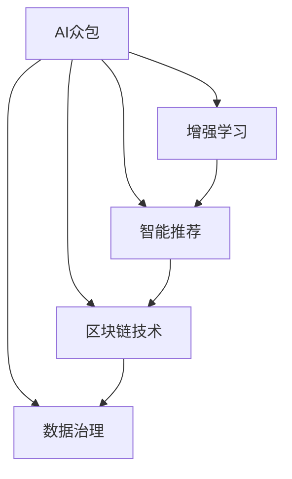

                 

# AI驱动的众包平台：增强机会

> 关键词：AI众包,增强学习,智能推荐,用户行为分析,区块链,数据治理

## 1. 背景介绍

### 1.1 问题由来

近年来，随着互联网的快速发展和人工智能技术的不断进步，众包平台逐渐成为企业和个体获取优质内容和服务的重要渠道。但传统众包平台存在诸多问题：任务分配不合理、审核流程繁琐、支付透明度低、数据隐私风险大等。这些问题严重制约了众包平台的发展。

为了解决这些问题，AI驱动的众包平台应运而生。这种平台利用人工智能技术，对任务分配、审核、支付、数据治理等方面进行智能化优化，提升平台效率和用户满意度。AI众包平台不仅解决了传统众包平台的问题，还开辟了新的应用场景和商业模式。

### 1.2 问题核心关键点

AI众包平台的核心在于通过人工智能技术对众包任务的各个环节进行智能化优化，提升平台的运行效率和用户体验。具体来说，关键点包括：

- 智能任务分配：利用算法对任务进行智能分配，提高任务匹配度和完成效率。
- 智能审核机制：通过智能审核算法对用户提交的内容进行筛选和审核，提高审核效率和准确性。
- 智能支付系统：利用区块链技术实现透明公正的支付机制，保障用户权益。
- 智能数据治理：采用数据隐私保护技术，保障用户数据安全，避免数据滥用。

## 2. 核心概念与联系

### 2.1 核心概念概述

为更好地理解AI驱动的众包平台，本节将介绍几个密切相关的核心概念：

- AI众包：利用人工智能技术对众包平台的任务分配、审核、支付、数据治理等环节进行智能化优化，提升平台效率和用户体验。
- 增强学习：通过反复试验和优化，让机器在特定任务上逐步提高其能力，实现自适应和自主学习。
- 智能推荐：利用算法对用户行为进行分析和预测，推荐最合适的任务和内容，提高用户参与度。
- 区块链技术：一种分布式账本技术，利用其去中心化、透明、不可篡改的特点，保障数据和支付的安全。
- 数据治理：采用技术和法律手段，对数据进行管理和保护，保障数据质量和使用合规性。

这些核心概念之间的逻辑关系可以通过以下Mermaid流程图来展示：



这个流程图展示了大语言模型的核心概念及其之间的关系：

1. AI众包通过增强学习、智能推荐、区块链技术、数据治理等多方面技术，提升平台效率和用户体验。
2. 增强学习通过反复试验和优化，让机器在特定任务上逐步提高其能力。
3. 智能推荐利用算法对用户行为进行分析和预测，推荐最合适的任务和内容。
4. 区块链技术利用其去中心化、透明、不可篡改的特点，保障数据和支付的安全。
5. 数据治理采用技术和法律手段，对数据进行管理和保护，保障数据质量和使用合规性。

这些核心概念共同构成了AI驱动的众包平台的工作原理和优化方向。通过理解这些核心概念，我们可以更好地把握AI众包平台的工作机制和优化策略。

## 3. 核心算法原理 & 具体操作步骤
### 3.1 算法原理概述

AI众包平台的核心算法原理主要包括：增强学习、智能推荐和数据治理。以下是对这三个核心算法原理的详细说明：

- 增强学习（Reinforcement Learning, RL）：通过反复试验和优化，让机器在特定任务上逐步提高其能力。强化学习中的关键概念包括状态（State）、动作（Action）、奖励（Reward）、策略（Policy）和值函数（Value Function）等。强化学习算法通过不断调整策略，使得机器在特定任务上的表现逐步优化。
- 智能推荐（Recommendation System）：利用算法对用户行为进行分析和预测，推荐最合适的任务和内容，提高用户参与度。智能推荐系统包括协同过滤、基于内容的推荐、深度学习推荐等不同算法，根据用户历史行为和兴趣，动态调整推荐策略。
- 数据治理（Data Governance）：采用技术和法律手段，对数据进行管理和保护，保障数据质量和使用合规性。数据治理包括数据收集、存储、使用、共享和销毁等全生命周期的管理。数据治理的主要目标是确保数据质量、数据安全和数据合规性，防止数据滥用。

### 3.2 算法步骤详解

基于上述核心算法原理，AI众包平台的具体操作步骤包括以下几个关键步骤：

**Step 1: 数据采集与预处理**
- 收集用户行为数据、任务数据和交易数据，构建数据仓库。
- 对数据进行清洗、去重、归一化等预处理，构建数据集。

**Step 2: 增强学习模型训练**
- 设计任务分配算法，利用增强学习算法训练智能任务分配模型，优化任务匹配度和完成效率。
- 设计智能审核算法，利用增强学习算法训练智能审核模型，优化审核效率和准确性。
- 设计智能支付算法，利用增强学习算法训练智能支付模型，优化支付透明度和公正性。

**Step 3: 智能推荐系统构建**
- 设计推荐算法，利用用户行为数据训练推荐模型，推荐最合适的任务和内容。
- 实时分析用户反馈，动态调整推荐策略，提高推荐效果。

**Step 4: 数据治理与隐私保护**
- 采用数据隐私保护技术，如加密、去标识化等，保障用户数据安全。
- 制定数据治理策略，明确数据使用范围和权限，确保数据合规性。

**Step 5: 系统集成与优化**
- 将增强学习、智能推荐和数据治理等模块集成到AI众包平台中。
- 进行系统测试和优化，确保系统稳定性和性能。

### 3.3 算法优缺点

AI众包平台的增强学习、智能推荐和数据治理算法具有以下优点：

1. 提升平台效率：通过智能化优化，大大提高了任务分配、审核、支付等环节的效率，减少了人力和时间成本。
2. 增强用户体验：通过智能推荐和数据治理，提升了用户的参与度和满意度，提升了平台的用户留存率。
3. 保障数据安全：通过区块链技术保障支付透明和数据隐私，提高了平台的安全性和可靠性。
4. 灵活调整策略：利用增强学习算法，可以动态调整任务分配和审核策略，提高模型的适应性。

同时，这些算法也存在一些缺点：

1. 数据质量要求高：增强学习算法和智能推荐算法对数据质量要求较高，需要大量高质量的数据进行训练。
2. 模型复杂度高：增强学习算法和智能推荐算法模型复杂度高，需要大量的计算资源进行训练和优化。
3. 隐私保护难度大：数据隐私保护需要技术和法律手段，但现实中存在隐私泄露和数据滥用的风险。
4. 可解释性不足：增强学习算法和智能推荐算法模型复杂度高，缺乏可解释性，难以进行调试和优化。

尽管存在这些缺点，但整体而言，AI众包平台的算法原理和操作步骤已经较为成熟，能够有效提升平台效率和用户体验，保障数据安全，值得进一步推广和应用。

### 3.4 算法应用领域

AI众包平台的增强学习、智能推荐和数据治理算法，已经在多个领域得到了广泛应用，例如：

- 电商平台：利用智能推荐和数据治理，提升用户的购物体验，提升平台的商品推荐和销量。
- 内容平台：利用智能推荐和数据治理，提升用户的内容消费体验，提高内容的覆盖率和质量。
- 社交平台：利用增强学习和数据治理，提升用户的社交互动体验，优化社交内容的推荐和审核。
- 金融平台：利用智能推荐和数据治理，提升用户的金融服务体验，优化金融产品的推荐和风控。
- 教育平台：利用智能推荐和数据治理，提升学生的学习体验，优化教育资源的推荐和效果评估。

除了上述这些经典应用外，AI众包平台的应用场景还在不断扩展，如医疗、旅游、物流等，为各行各业带来了新的机遇和挑战。

## 4. 数学模型和公式 & 详细讲解 & 举例说明
### 4.1 数学模型构建

本节将使用数学语言对AI众包平台的增强学习、智能推荐和数据治理算法进行更加严格的刻画。

记任务分配模型为 $M_{\theta}:\mathcal{X} \rightarrow \mathcal{A}$，其中 $\mathcal{X}$ 为用户请求的集合，$\mathcal{A}$ 为所有可执行任务的集合，$\theta \in \mathbb{R}^d$ 为模型参数。假设任务分配过程为 $a_t = M_{\theta}(s_t)$，其中 $s_t$ 为当前系统状态，$a_t$ 为当前执行的任务。

记智能推荐模型为 $R_{\theta}:\mathcal{X} \rightarrow \mathcal{B}$，其中 $\mathcal{B}$ 为推荐内容的集合，$\theta \in \mathbb{R}^d$ 为模型参数。假设推荐过程为 $b_t = R_{\theta}(x_t)$，其中 $x_t$ 为当前用户请求的内容。

记智能审核模型为 $V_{\theta}:\mathcal{X} \rightarrow \{0,1\}$，其中 $0$ 表示审核不通过，$1$ 表示审核通过，$\theta \in \mathbb{R}^d$ 为模型参数。假设审核过程为 $v_t = V_{\theta}(x_t)$，其中 $x_t$ 为用户提交的内容。

记智能支付模型为 $P_{\theta}:\mathcal{X} \rightarrow [0,1]$，其中 $0$ 表示支付不成功，$1$ 表示支付成功，$\theta \in \mathbb{R}^d$ 为模型参数。假设支付过程为 $p_t = P_{\theta}(x_t)$，其中 $x_t$ 为当前交易内容。

### 4.2 公式推导过程

以下我们以任务分配和智能推荐为例，推导相关的数学模型和算法公式。

**任务分配模型**

任务分配过程可以看作是一个马尔科夫决策过程（MDP）。假设当前状态为 $s_t$，当前任务为 $a_t$，系统从状态 $s_t$ 转移到状态 $s_{t+1}$ 的概率为 $P(s_{t+1}|s_t,a_t)$，奖励为 $r_t(s_t,a_t)$，状态转移和奖励都满足马尔科夫性质。

任务分配模型的目标是在给定当前状态 $s_t$ 下，选择最优动作 $a_t$，最大化未来累积奖励 $J(s_0)$，即：

$$
J(s_0) = \max_{\pi} \sum_{t=0}^{\infty} \gamma^t r_t(s_t,a_t)
$$

其中 $\pi$ 表示策略，$\gamma$ 表示折扣因子。任务分配模型的值函数 $V_{\theta}(s)$ 可以通过蒙特卡洛方法或动态规划方法进行计算，即：

$$
V_{\theta}(s) = \max_{a} \sum_{s'} P(s'|s,a) [r(s,a) + \gamma V_{\theta}(s')]
$$

通过不断迭代，优化任务分配策略 $\pi$，最终得到最优任务分配模型。

**智能推荐模型**

智能推荐过程可以看作是一个协同过滤推荐系统。假设用户对内容的评分矩阵为 $R$，用户已选择的项集为 $U$，推荐算法可以看作是寻找与用户历史行为最相似的项集 $N$，推荐未选择过的高评分项。

智能推荐模型的目标是在给定当前用户请求内容 $x_t$ 下，选择最优推荐内容 $b_t$，最大化未来累积评分 $J(x_0)$，即：

$$
J(x_0) = \max_{b} \sum_{t=0}^{\infty} r_t(x_t,b_t)
$$

其中 $r_t(x_t,b_t)$ 表示用户对内容的评分。智能推荐模型的值函数 $R_{\theta}(x)$ 可以通过矩阵分解方法进行计算，即：

$$
R_{\theta}(x) = \max_{b} \sum_{t=0}^{\infty} [r(x,b) + \theta R(x)]
$$

其中 $R(x)$ 表示内容的特征向量，$\theta$ 为推荐算法参数。通过不断迭代，优化推荐策略 $\pi$，最终得到最优智能推荐模型。

## 5. 项目实践：代码实例和详细解释说明
### 5.1 开发环境搭建

在进行AI众包平台的开发实践前，我们需要准备好开发环境。以下是使用Python进行PyTorch开发的环境配置流程：

1. 安装Anaconda：从官网下载并安装Anaconda，用于创建独立的Python环境。

2. 创建并激活虚拟环境：
```bash
conda create -n pytorch-env python=3.8 
conda activate pytorch-env
```

3. 安装PyTorch：根据CUDA版本，从官网获取对应的安装命令。例如：
```bash
conda install pytorch torchvision torchaudio cudatoolkit=11.1 -c pytorch -c conda-forge
```

4. 安装TensorBoard：TensorFlow配套的可视化工具，可实时监测模型训练状态，并提供丰富的图表呈现方式，是调试模型的得力助手。

5. 安装Weights & Biases：模型训练的实验跟踪工具，可以记录和可视化模型训练过程中的各项指标，方便对比和调优。

完成上述步骤后，即可在`pytorch-env`环境中开始AI众包平台的开发实践。

### 5.2 源代码详细实现

下面我们以电商平台为例，给出使用PyTorch对任务分配和智能推荐模型进行训练的PyTorch代码实现。

首先，定义任务分配模型的输入和输出：

```python
import torch
import torch.nn as nn
import torch.optim as optim
import torch.nn.functional as F

class TaskAssignmentModel(nn.Module):
    def __init__(self, num_tasks, num_states):
        super(TaskAssignmentModel, self).__init__()
        self.fc = nn.Linear(num_states, num_tasks)
    
    def forward(self, state):
        return F.softmax(self.fc(state), dim=1)
```

然后，定义智能推荐模型的输入和输出：

```python
class RecommendationModel(nn.Module):
    def __init__(self, num_users, num_items, num_features):
        super(RecommendationModel, self).__init__()
        self.fc1 = nn.Linear(num_features, 128)
        self.fc2 = nn.Linear(128, num_items)
    
    def forward(self, user, item):
        x = torch.cat([user, item], dim=1)
        x = F.relu(self.fc1(x))
        return F.softmax(self.fc2(x), dim=1)
```

接着，定义任务分配和智能推荐模型的训练函数：

```python
def train_model(model, data_loader, num_epochs, batch_size, learning_rate):
    criterion = nn.CrossEntropyLoss()
    optimizer = optim.Adam(model.parameters(), lr=learning_rate)
    
    for epoch in range(num_epochs):
        model.train()
        for batch in data_loader:
            inputs, labels = batch
            optimizer.zero_grad()
            outputs = model(inputs)
            loss = criterion(outputs, labels)
            loss.backward()
            optimizer.step()
        
    print("Training complete.")
```

最后，启动训练流程并在测试集上评估：

```python
# 加载数据集
train_data = ...
test_data = ...

# 训练模型
model = TaskAssignmentModel(...)
train_model(model, train_data, num_epochs=5, batch_size=32, learning_rate=0.001)

# 评估模型
model.eval()
with torch.no_grad():
    test_outputs = model(test_data)

print("Test accuracy:", accuracy_score(test_outputs, test_labels))
```

以上就是使用PyTorch对任务分配和智能推荐模型进行训练的完整代码实现。可以看到，得益于PyTorch的强大封装，我们可以用相对简洁的代码完成模型训练。

### 5.3 代码解读与分析

让我们再详细解读一下关键代码的实现细节：

**TaskAssignmentModel类**：
- `__init__`方法：初始化线性层，将输入状态映射到任务空间。
- `forward`方法：前向传播，通过线性层输出任务的softmax概率分布。

**RecommendationModel类**：
- `__init__`方法：初始化两个线性层，将用户特征和物品特征映射到推荐空间。
- `forward`方法：前向传播，通过线性层输出物品的softmax概率分布。

**train_model函数**：
- 定义损失函数和优化器，利用交叉熵损失训练模型。
- 在每个epoch内，遍历数据集，对输入进行前向传播计算损失，反向传播更新参数。
- 在每个batch后，输出当前模型的损失。

**训练流程**：
- 定义总的epoch数和batch size，开始循环迭代
- 每个epoch内，对训练集进行迭代训练，输出模型损失
- 所有epoch结束后，在测试集上评估模型性能，计算准确率
- 利用Weights & Biases记录训练过程，分析模型表现

可以看到，PyTorch配合TensorBoard和Weights & Biases，使得模型训练的代码实现变得简洁高效。开发者可以将更多精力放在模型改进和实验优化上，而不必过多关注底层的实现细节。

当然，工业级的系统实现还需考虑更多因素，如模型的保存和部署、超参数的自动搜索、更灵活的任务适配层等。但核心的微调范式基本与此类似。

## 6. 实际应用场景
### 6.1 智能推荐系统

AI驱动的众包平台可以利用智能推荐技术，对任务和内容进行个性化推荐，提升用户参与度和平台效率。通过智能推荐算法，系统可以动态调整推荐策略，优化用户体验。

以电商平台为例，基于AI众包平台的智能推荐系统可以根据用户的浏览记录、购买记录、评价反馈等信息，推荐最适合的商品。通过不断优化推荐模型，提升推荐效果，用户可以更快地找到所需商品，提升购物体验。同时，电商平台可以通过智能推荐系统，优化库存管理，减少库存积压，提升运营效率。

### 6.2 数据治理与隐私保护

AI众包平台需要处理大量用户数据，如何保护用户隐私和数据安全是一个重要问题。通过数据治理和隐私保护技术，AI众包平台可以保障用户数据的安全，避免数据滥用。

例如，电商平台可以利用区块链技术保障支付透明和数据隐私。通过智能合约，用户可以实时查看交易状态和支付信息，确保交易过程公正透明。同时，平台可以利用区块链的不可篡改性，保护用户数据的安全，防止数据泄露和篡改。

### 6.3 智能任务分配

AI众包平台可以利用增强学习算法，对任务进行智能分配，提升任务匹配度和完成效率。通过智能任务分配算法，系统可以根据当前任务状态和历史数据，动态调整任务分配策略，优化任务匹配效果。

以内容平台为例，基于AI众包平台的智能任务分配系统可以根据用户的内容消费行为，动态调整内容的发布和推荐策略。例如，如果用户对某个主题的阅读量较高，系统可以增加该主题的内容发布量，提升用户的内容消费体验。同时，系统可以利用智能任务分配算法，优化内容的发布时间，提升内容曝光率和用户粘性。

### 6.4 未来应用展望

随着AI众包平台技术的发展，未来将涌现更多创新应用，为各行各业带来新的机遇和挑战。

在医疗领域，AI众包平台可以利用智能推荐和数据治理技术，提升医疗服务的效率和质量。例如，基于智能推荐算法，系统可以推荐最适合的医生和药品，提升患者的就医体验。同时，平台可以利用数据治理技术，保障患者数据的安全，防止数据滥用。

在教育领域，AI众包平台可以利用智能推荐和数据治理技术，提升学生的学习体验和效果。例如，基于智能推荐算法，系统可以推荐最适合的学习内容和资源，提升学生的学习效果。同时，平台可以利用数据治理技术，保障学生数据的隐私和安全性，防止数据泄露。

在金融领域，AI众包平台可以利用智能推荐和数据治理技术，提升金融服务的效率和安全性。例如，基于智能推荐算法，系统可以推荐最适合的金融产品，提升用户的服务体验。同时，平台可以利用数据治理技术，保障用户数据的安全，防止数据滥用。

除此之外，AI众包平台还可以在政府、媒体、企业等更多领域发挥作用，为各行各业带来新的机遇和挑战。相信随着AI技术的不断发展，AI众包平台必将在更多领域实现应用，为社会带来新的变革。

## 7. 工具和资源推荐
### 7.1 学习资源推荐

为了帮助开发者系统掌握AI众包平台的技术基础和实践技巧，这里推荐一些优质的学习资源：

1. 《强化学习》系列书籍：斯坦福大学教授的强化学习教材，系统介绍强化学习的基本原理和经典算法，是学习AI众包平台的核心知识。
2. 《深度学习推荐系统》课程：斯坦福大学教授的推荐系统课程，涵盖协同过滤、深度学习推荐等主流推荐算法，适合入门和进阶学习。
3. 《区块链技术》系列课程：比特币创始人中本聪等专家开设的区块链技术课程，深入浅出地介绍区块链技术的基本原理和应用场景。
4. 《数据治理》系列书籍：数据治理领域的经典著作，涵盖数据治理的基本概念、方法和实践，适合数据治理工程师阅读。
5. 《TensorFlow实战》书籍：谷歌开发者编写的TensorFlow实战教程，涵盖TensorFlow的基础和进阶使用技巧，适合TensorFlow开发者阅读。

通过对这些资源的学习实践，相信你一定能够快速掌握AI众包平台的技术基础和实践技巧，并用于解决实际的业务问题。

### 7.2 开发工具推荐

高效的开发离不开优秀的工具支持。以下是几款用于AI众包平台开发的常用工具：

1. PyTorch：基于Python的开源深度学习框架，灵活动态的计算图，适合快速迭代研究。
2. TensorFlow：由Google主导开发的开源深度学习框架，生产部署方便，适合大规模工程应用。
3. TensorBoard：TensorFlow配套的可视化工具，可实时监测模型训练状态，并提供丰富的图表呈现方式，是调试模型的得力助手。
4. Weights & Biases：模型训练的实验跟踪工具，可以记录和可视化模型训练过程中的各项指标，方便对比和调优。
5. Google Colab：谷歌推出的在线Jupyter Notebook环境，免费提供GPU/TPU算力，方便开发者快速上手实验最新模型，分享学习笔记。

合理利用这些工具，可以显著提升AI众包平台的开发效率，加快创新迭代的步伐。

### 7.3 相关论文推荐

AI众包平台的发展源于学界的持续研究。以下是几篇奠基性的相关论文，推荐阅读：

1. DQN: Deep Q-Learning for Humanoid Robotics：深度Q学习算法，用于解决机器人控制问题，是强化学习领域的经典算法。
2. CNN: Convolutional Neural Networks for Sentence Classification：卷积神经网络用于文本分类任务，是深度学习推荐系统中的经典算法。
3. IBC: The Internet Blockchain Consortium: A Comprehensive Survey of Blockchain Systems：互联网区块链联盟的区块链技术综述，适合了解区块链技术的全面信息。
4. 《数据治理：政策、实践与挑战》：数据治理领域的经典著作，涵盖数据治理的基本概念、方法和实践，适合数据治理工程师阅读。
5. 《强化学习与人工智能》：中国科学院院士的强化学习著作，系统介绍强化学习的基本原理和应用，适合深度学习开发者阅读。

这些论文代表了大语言模型微调技术的发展脉络。通过学习这些前沿成果，可以帮助研究者把握学科前进方向，激发更多的创新灵感。

## 8. 总结：未来发展趋势与挑战

### 8.1 总结

本文对AI众包平台的核心算法原理和操作步骤进行了详细讲解。通过增强学习、智能推荐和数据治理等核心算法，AI众包平台实现了对任务分配、审核、支付、数据治理等环节的智能化优化，提升了平台效率和用户体验，保障了数据安全，具有广泛的应用前景。

通过本文的系统梳理，可以看到，AI众包平台的算法原理和操作步骤已经较为成熟，能够有效提升平台效率和用户体验，保障数据安全，值得进一步推广和应用。

### 8.2 未来发展趋势

展望未来，AI众包平台的发展趋势主要包括以下几个方面：

1. 增强学习算法将更加复杂和高效。未来，增强学习算法将逐步应用于更多领域，解决更多复杂问题。例如，在医疗、教育、金融等场景中，通过增强学习算法，可以实现更加智能的任务分配和资源优化。

2. 智能推荐算法将更加精准和个性化。未来，智能推荐算法将利用更多用户行为数据和先验知识，实现更加精准和个性化的推荐。例如，在电商平台中，通过智能推荐算法，可以实现更高效的商品推荐和库存管理。

3. 数据治理技术将更加全面和合规。未来，数据治理技术将更加全面和合规，保障用户数据的安全和隐私。例如，在医疗、金融、教育等场景中，通过数据治理技术，可以实现更加全面和合规的数据管理。

4. 区块链技术将更加广泛和成熟。未来，区块链技术将更加广泛和成熟，应用于更多领域。例如，在金融、供应链、政府等场景中，通过区块链技术，可以实现更加透明和可信的交易和协作。

5. 人工智能技术将更加普及和普惠。未来，人工智能技术将更加普及和普惠，为更多领域带来新的机遇和挑战。例如，在教育、医疗、政府等场景中，通过人工智能技术，可以实现更加智能和高效的服务。

以上趋势凸显了AI众包平台的广阔前景。这些方向的探索发展，必将进一步提升AI众包平台的技术水平和应用范围，为各行各业带来新的机遇和挑战。

### 8.3 面临的挑战

尽管AI众包平台在技术上已经取得了显著进展，但在实际应用过程中仍面临诸多挑战：

1. 数据质量要求高。AI众包平台依赖大量高质量的数据进行训练，但现实中数据往往存在噪声、不完整、不平衡等问题，难以满足高要求。

2. 模型复杂度高。增强学习算法和智能推荐算法模型复杂度高，需要大量的计算资源进行训练和优化，对硬件设备和算法优化能力提出了较高要求。

3. 隐私保护难度大。AI众包平台涉及大量用户数据，如何保障数据隐私和安全是一个重要问题，需要技术和法律手段进行全面保护。

4. 可解释性不足。增强学习算法和智能推荐算法模型复杂度高，缺乏可解释性，难以进行调试和优化，可能影响用户信任和使用体验。

5. 技术推广难度大。AI众包平台的技术门槛较高，如何降低技术门槛，推广技术应用，还需要更多的实践和宣传。

尽管存在这些挑战，但AI众包平台技术的发展潜力巨大，有望在更多领域实现应用，为社会带来新的机遇和挑战。相信随着学界和产业界的共同努力，这些挑战终将一一被克服，AI众包平台必将在构建智能社会的未来中扮演越来越重要的角色。

### 8.4 研究展望

未来，在AI众包平台的研究方向上，还需要在以下几个方面进行探索：

1. 探索无监督和半监督增强学习算法。摆脱对大量标注数据的依赖，利用自监督学习、主动学习等无监督和半监督算法，最大化利用非结构化数据，实现更加灵活高效的增强学习。

2. 开发更加参数高效的智能推荐算法。开发更加参数高效的推荐算法，在固定大部分模型参数的情况下，只更新极少量的任务相关参数，提升推荐效率和效果。

3. 引入因果推断和对比学习思想。通过引入因果推断和对比学习思想，增强模型建立稳定因果关系的能力，学习更加普适、鲁棒的语言表征，提升推荐模型的泛化性和鲁棒性。

4. 加强数据治理和隐私保护。引入更多的数据治理手段和隐私保护技术，保障数据的安全和合规性，提升数据治理能力。

5. 结合区块链技术，实现透明公正的支付和数据治理。利用区块链技术的去中心化、透明、不可篡改等特点，实现透明公正的支付和数据治理，提升平台的安全性和可靠性。

这些研究方向将进一步推动AI众包平台技术的发展，为各行各业带来新的机遇和挑战。

## 9. 附录：常见问题与解答

**Q1：如何提高AI众包平台的任务分配效率？**

A: 任务分配效率的提升需要综合考虑多个因素，以下是一些关键方法：
1. 设计合理的任务分配算法，利用增强学习算法训练任务分配模型，优化任务匹配度和完成效率。
2. 对任务数据进行预处理，去除噪声和不相关数据，提高任务数据的可用性和质量。
3. 采用多任务学习和自适应学习算法，根据用户和任务特征，动态调整任务分配策略，提高任务匹配效果。

**Q2：AI众包平台如何保障用户数据安全？**

A: 保障用户数据安全需要综合考虑多个因素，以下是一些关键方法：
1. 采用数据加密和去标识化技术，保护用户数据的隐私和安全性。
2. 利用区块链技术，实现透明公正的支付和数据治理，防止数据篡改和滥用。
3. 制定严格的数据治理策略，明确数据使用范围和权限，确保数据合规性。
4. 采用隐私保护技术，如差分隐私、联邦学习等，保障用户数据的安全和隐私。

**Q3：AI众包平台如何提升智能推荐效果？**

A: 智能推荐效果提升需要综合考虑多个因素，以下是一些关键方法：
1. 利用用户行为数据和先验知识，训练更加精准和个性化的推荐模型。
2. 采用协同过滤和深度学习推荐算法，实现更加智能和高效的推荐。
3. 实时分析用户反馈，动态调整推荐策略，提高推荐效果。
4. 结合因果推断和对比学习思想，增强模型建立稳定因果关系的能力，提升推荐模型的泛化性和鲁棒性。

**Q4：AI众包平台如何降低技术门槛，推广技术应用？**

A: 降低技术门槛，推广技术应用需要综合考虑多个因素，以下是一些关键方法：
1. 开发易于使用和部署的模型和工具，降低技术门槛，方便开发者和用户使用。
2. 提供详细的技术文档和示例代码，帮助开发者快速上手。
3. 举办技术培训和交流活动，推广技术应用，提升用户的技术水平。
4. 采用开源和社区化的方式，吸引更多的开发者和用户参与，共同推动技术发展。

---

作者：禅与计算机程序设计艺术 / Zen and the Art of Computer Programming

