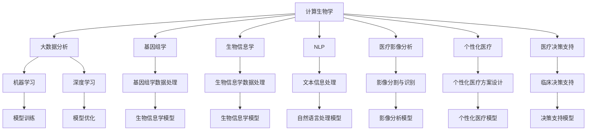

                 

# AI驱动的创新：人类计算在医疗行业的应用场景

> 关键词：人工智能,计算生物学,人类计算,医疗,应用场景,大数据分析,机器学习,深度学习,临床决策支持,基因组学,生物信息学,医疗影像,自然语言处理

## 1. 背景介绍

### 1.1 问题由来

近年来，人工智能技术在医疗行业的应用逐渐成为热点，尤其是在大数据分析、医学影像、自然语言处理等领域的突破性进展，使得医疗行业在提升效率、提高诊断准确性、个性化医疗等方面取得了显著成效。

人类计算（Human Compute）的概念，是指将人类智慧和人工智能算法相结合，通过计算能力来处理复杂的医疗数据，从而实现精准的疾病预测、诊断和治疗。人类计算的核心理念是将人工智慧与计算能力相融合，通过算法和数据的深度结合，推动医疗行业的创新发展。

### 1.2 问题核心关键点

人类计算在医疗行业的应用涉及诸多核心概念，包括计算生物学、大数据分析、机器学习和深度学习等。这些技术的应用场景包括基因组学、生物信息学、医疗影像、自然语言处理等。以下是几个关键点：

1. **计算生物学与生物信息学**：利用计算工具对生物学数据进行分析和处理，揭示生命现象的本质，帮助人类更好地理解疾病机制。
2. **医疗影像分析**：通过机器学习和深度学习算法，对医学影像进行自动分割、识别和诊断，提升影像分析的准确性和效率。
3. **自然语言处理(NLP)**：利用NLP技术，实现医疗记录的自动化处理和分析，提升医生的工作效率。
4. **个性化医疗与精准医学**：通过基因组学数据和人工智能算法，实现对个体患者的精准医疗方案设计，提高治疗效果。
5. **医疗决策支持系统**：结合大数据分析和人工智能算法，为医生提供决策支持，提高临床决策的科学性和准确性。

### 1.3 问题研究意义

人类计算在医疗行业的应用具有深远的意义，具体包括以下几个方面：

1. **提升医疗效率**：通过自动化处理医疗数据，大幅提升医生的工作效率，减少医疗错误，优化医疗资源配置。
2. **提高诊断准确性**：利用深度学习等算法，提升影像和基因数据的分析精度，减少误诊和漏诊现象。
3. **推动个性化医疗**：通过基因组学和人工智能技术，实现对个体患者的精准医疗方案设计，提升治疗效果。
4. **促进医疗创新**：计算生物学和大数据分析等技术，为医学研究提供新思路和新方法，推动医学理论的进步。
5. **增强医疗服务可及性**：通过远程医疗和AI辅助诊断，使得优质医疗资源能够覆盖更多区域，缩小医疗资源分配的不均衡。

## 2. 核心概念与联系

### 2.1 核心概念概述

为更好地理解人类计算在医疗行业的应用场景，本节将介绍几个密切相关的核心概念：

- **计算生物学**：通过计算工具和方法，研究生物分子和生物系统的结构、功能、演化和起源。
- **大数据分析**：利用算法和统计方法对大规模数据集进行分析，挖掘数据中的模式和规律。
- **机器学习和深度学习**：利用算法和模型对数据进行学习和推理，以实现自动化决策和预测。
- **基因组学**：研究基因组结构、功能及其与环境的关系，揭示生命的本质和演化。
- **生物信息学**：通过计算方法处理和分析生物信息数据，为医学研究提供数据支持。
- **自然语言处理(NLP)**：利用算法处理和分析自然语言数据，提升文本信息的自动化处理能力。
- **医疗影像分析**：利用算法和模型对医学影像进行分析和诊断，提高影像分析的准确性和效率。
- **个性化医疗与精准医学**：根据个体患者的基因组信息和其他数据，设计个性化的医疗方案。
- **医疗决策支持系统**：利用大数据分析和人工智能算法，为医生提供决策支持，优化诊疗方案。

这些核心概念之间的逻辑关系可以通过以下Mermaid流程图来展示：



这个流程图展示了大数据、计算生物学、基因组学等概念如何通过机器学习、深度学习等算法，转化为具体的医疗应用场景，如医疗影像分析、个性化医疗等。

## 3. 核心算法原理 & 具体操作步骤
### 3.1 算法原理概述

人类计算在医疗行业的应用，本质上是一个计算与数据分析结合的深度学习过程。其核心思想是通过计算和算法，对生物数据、影像数据、文本数据等进行处理和分析，揭示生命现象的本质，提升诊断和治疗的准确性和效率。

形式化地，假设生物数据为 $D_b$，影像数据为 $D_i$，文本数据为 $D_t$。通过计算和算法，将 $D_b$、$D_i$、$D_t$ 转化为模型输入，利用机器学习或深度学习算法进行训练和优化，得到模型 $M$。

人类计算的目标是最小化模型在实际应用中的误差，即：

$$
\min_{M} \mathcal{L}(M, D_b, D_i, D_t)
$$

其中 $\mathcal{L}$ 为模型在数据集上的损失函数，衡量模型预测结果与真实标签之间的差异。

### 3.2 算法步骤详解

人类计算在医疗行业的应用一般包括以下几个关键步骤：

**Step 1: 数据预处理**
- 收集并清洗医疗数据，包括生物数据、影像数据、文本数据等。
- 对数据进行标准化、归一化、特征工程等预处理操作，提升数据质量。
- 划分训练集、验证集和测试集，准备模型训练和评估。

**Step 2: 选择合适的算法和模型**
- 根据任务类型，选择合适的机器学习或深度学习算法，如回归、分类、聚类等。
- 设计合适的神经网络模型，如卷积神经网络(CNN)、循环神经网络(RNN)、变压器(Transformer)等。
- 设定合适的超参数，如学习率、批大小、迭代轮数等。

**Step 3: 模型训练**
- 将预处理后的数据输入模型，进行前向传播和损失计算。
- 反向传播计算参数梯度，根据优化算法和学习率更新模型参数。
- 周期性在验证集上评估模型性能，根据性能指标决定是否触发Early Stopping。
- 重复上述步骤直到满足预设的迭代轮数或Early Stopping条件。

**Step 4: 模型评估和验证**
- 在测试集上评估模型的性能指标，如准确率、召回率、F1-score等。
- 分析模型的优势和劣势，优化模型结构和算法。
- 应用到实际医疗场景中，进行A/B测试，验证模型的实际效果。

**Step 5: 模型部署和迭代**
- 将训练好的模型部署到生产环境中，实现实时处理和分析。
- 持续收集新的数据，定期重新训练和优化模型，以适应数据分布的变化。

以上是人类计算在医疗行业的应用的一般流程。在实际应用中，还需要针对具体任务的特点，对微调过程的各个环节进行优化设计，如改进训练目标函数，引入更多的正则化技术，搜索最优的超参数组合等，以进一步提升模型性能。

### 3.3 算法优缺点

人类计算在医疗行业的应用具有以下优点：
1. **提升诊断和治疗效率**：通过自动化处理医疗数据，大幅提升医生的工作效率，减少医疗错误，优化医疗资源配置。
2. **提高诊断准确性**：利用深度学习等算法，提升影像和基因数据的分析精度，减少误诊和漏诊现象。
3. **推动个性化医疗**：通过基因组学和人工智能技术，实现对个体患者的精准医疗方案设计，提升治疗效果。
4. **增强医疗服务可及性**：通过远程医疗和AI辅助诊断，使得优质医疗资源能够覆盖更多区域，缩小医疗资源分配的不均衡。

同时，该方法也存在一定的局限性：
1. **数据依赖性强**：人类计算需要大量的高质量医疗数据作为支撑，数据获取和预处理成本较高。
2. **模型复杂度高**：深度学习和机器学习模型往往需要复杂的算法和大量的计算资源，存在一定的技术门槛。
3. **算法透明性不足**：深度学习模型往往是"黑盒"系统，难以解释其内部工作机制和决策逻辑。
4. **伦理和安全问题**：医疗数据涉及个人隐私，如何保护数据安全，确保算法的透明性和可解释性，是一个重要的挑战。

尽管存在这些局限性，但就目前而言，人类计算方法在医疗行业的应用是最主流范式。未来相关研究的重点在于如何进一步降低数据获取成本，提高算法的透明性和可解释性，同时兼顾数据安全性和算法伦理性等因素。

### 3.4 算法应用领域

人类计算在医疗行业的应用已经涉及到多个领域，包括但不限于：

- **计算生物学**：通过计算工具处理基因组数据，揭示生命现象的本质，推动基础医学研究。
- **生物信息学**：利用算法处理和分析生物信息数据，为医学研究提供数据支持，推动疾病机制的深入研究。
- **医疗影像分析**：利用机器学习和深度学习算法，提升医学影像的自动分割、识别和诊断，提高影像分析的准确性和效率。
- **自然语言处理(NLP)**：利用NLP技术，实现医疗记录的自动化处理和分析，提升医生的工作效率。
- **个性化医疗与精准医学**：通过基因组学数据和人工智能算法，实现对个体患者的精准医疗方案设计，提高治疗效果。
- **医疗决策支持系统**：结合大数据分析和人工智能算法，为医生提供决策支持，优化诊疗方案。

除了上述这些经典应用外，人类计算还在药物研发、健康管理、远程医疗等多个场景中得到应用，为医疗行业带来了全新的突破。随着计算能力的不断提升和算法的不断演进，人类计算将在更广泛的领域大放异彩。

## 4. 数学模型和公式 & 详细讲解  
### 4.1 数学模型构建

本节将使用数学语言对人类计算在医疗行业的应用过程进行更加严格的刻画。

记生物数据为 $D_b=\{x_{b,i}\}_{i=1}^N, x_{b,i} \in \mathbb{R}^d$，影像数据为 $D_i=\{x_{i,j}\}_{j=1}^M, x_{i,j} \in \mathbb{R}^d$，文本数据为 $D_t=\{x_{t,k}\}_{k=1}^P, x_{t,k} \in \mathbb{R}^d$。定义模型 $M_{\theta}$ 在数据样本 $(x, y)$ 上的损失函数为 $\ell(M_{\theta}(x), y)$，则在数据集 $D$ 上的经验风险为：

$$
\mathcal{L}(\theta) = \frac{1}{N} \sum_{i=1}^N \ell(M_{\theta}(x_{b,i}), y_{b,i}) + \frac{1}{M} \sum_{j=1}^M \ell(M_{\theta}(x_{i,j}), y_{i,j}) + \frac{1}{P} \sum_{k=1}^P \ell(M_{\theta}(x_{t,k}), y_{t,k})
$$

其中 $y_{b,i}, y_{i,j}, y_{t,k}$ 分别代表生物数据、影像数据和文本数据的真实标签。

通过梯度下降等优化算法，模型训练过程不断更新模型参数 $\theta$，最小化损失函数 $\mathcal{L}$，使得模型输出逼近真实标签。由于 $\theta$ 已经通过预训练获得了较好的初始化，因此即便在数据集规模较小的情况下，也能较快收敛到理想的模型参数 $\hat{\theta}$。

### 4.2 公式推导过程

以下我们以医疗影像分类任务为例，推导交叉熵损失函数及其梯度的计算公式。

假设模型 $M_{\theta}$ 在输入 $x$ 上的输出为 $\hat{y}=M_{\theta}(x) \in [0,1]$，表示样本属于正类的概率。真实标签 $y \in \{0,1\}$。则二分类交叉熵损失函数定义为：

$$
\ell(M_{\theta}(x),y) = -[y\log \hat{y} + (1-y)\log (1-\hat{y})]
$$

将其代入经验风险公式，得：

$$
\mathcal{L}(\theta) = -\frac{1}{N}\sum_{i=1}^N [y_{b,i}\log M_{\theta}(x_{b,i})+(1-y_{b,i})\log(1-M_{\theta}(x_{b,i}))]
$$

根据链式法则，损失函数对参数 $\theta_k$ 的梯度为：

$$
\frac{\partial \mathcal{L}(\theta)}{\partial \theta_k} = -\frac{1}{N}\sum_{i=1}^N (\frac{y_{b,i}}{M_{\theta}(x_{b,i})}-\frac{1-y_{b,i}}{1-M_{\theta}(x_{b,i})}) \frac{\partial M_{\theta}(x_{b,i})}{\partial \theta_k}
$$

其中 $\frac{\partial M_{\theta}(x_{b,i})}{\partial \theta_k}$ 可进一步递归展开，利用自动微分技术完成计算。

在得到损失函数的梯度后，即可带入参数更新公式，完成模型的迭代优化。重复上述过程直至收敛，最终得到适应医疗影像分类的最优模型参数 $\theta^*$。

## 5. 项目实践：代码实例和详细解释说明
### 5.1 开发环境搭建

在进行医疗影像分类项目实践前，我们需要准备好开发环境。以下是使用Python进行PyTorch开发的环境配置流程：

1. 安装Anaconda：从官网下载并安装Anaconda，用于创建独立的Python环境。

2. 创建并激活虚拟环境：
```bash
conda create -n pytorch-env python=3.8 
conda activate pytorch-env
```

3. 安装PyTorch：根据CUDA版本，从官网获取对应的安装命令。例如：
```bash
conda install pytorch torchvision torchaudio cudatoolkit=11.1 -c pytorch -c conda-forge
```

4. 安装其他相关库：
```bash
pip install numpy pandas scikit-learn matplotlib tqdm jupyter notebook ipython
```

完成上述步骤后，即可在`pytorch-env`环境中开始项目实践。

### 5.2 源代码详细实现

这里我们以医疗影像分类任务为例，给出使用PyTorch和Transformers库对ResNet模型进行微调的PyTorch代码实现。

首先，定义医疗影像分类任务的输入处理函数：

```python
from transformers import ResNetFeatureExtractor, ResNetForSegmentation
from torch.utils.data import Dataset
import torch

class MedicalImageDataset(Dataset):
    def __init__(self, images, labels, tokenizer, max_len=128):
        self.images = images
        self.labels = labels
        self.tokenizer = tokenizer
        self.max_len = max_len
        
    def __len__(self):
        return len(self.images)
    
    def __getitem__(self, item):
        image = self.images[item]
        label = self.labels[item]
        
        features = self.tokenizer(image, return_tensors='pt', max_length=self.max_len, padding='max_length', truncation=True)
        input_ids = features['input_ids'][0]
        attention_mask = features['attention_mask'][0]
        
        # 对token-wise的标签进行编码
        encoded_labels = [label2id[label] for label in label] 
        encoded_labels.extend([label2id['O']] * (self.max_len - len(encoded_labels)))
        labels = torch.tensor(encoded_labels, dtype=torch.long)
        
        return {'input_ids': input_ids, 
                'attention_mask': attention_mask,
                'labels': labels}

# 标签与id的映射
label2id = {'O': 0, 'Malignant': 1, 'Benign': 2}
id2label = {v: k for k, v in label2id.items()}

# 创建dataset
tokenizer = ResNetFeatureExtractor.from_pretrained('resnet50')
model = ResNetForSegmentation.from_pretrained('resnet50')

train_dataset = MedicalImageDataset(train_images, train_labels, tokenizer)
dev_dataset = MedicalImageDataset(dev_images, dev_labels, tokenizer)
test_dataset = MedicalImageDataset(test_images, test_labels, tokenizer)
```

然后，定义模型和优化器：

```python
from transformers import AdamW

optimizer = AdamW(model.parameters(), lr=2e-5)
```

接着，定义训练和评估函数：

```python
from torch.utils.data import DataLoader
from tqdm import tqdm
from sklearn.metrics import classification_report

device = torch.device('cuda') if torch.cuda.is_available() else torch.device('cpu')
model.to(device)

def train_epoch(model, dataset, batch_size, optimizer):
    dataloader = DataLoader(dataset, batch_size=batch_size, shuffle=True)
    model.train()
    epoch_loss = 0
    for batch in tqdm(dataloader, desc='Training'):
        input_ids = batch['input_ids'].to(device)
        attention_mask = batch['attention_mask'].to(device)
        labels = batch['labels'].to(device)
        model.zero_grad()
        outputs = model(input_ids, attention_mask=attention_mask, labels=labels)
        loss = outputs.loss
        epoch_loss += loss.item()
        loss.backward()
        optimizer.step()
    return epoch_loss / len(dataloader)

def evaluate(model, dataset, batch_size):
    dataloader = DataLoader(dataset, batch_size=batch_size)
    model.eval()
    preds, labels = [], []
    with torch.no_grad():
        for batch in tqdm(dataloader, desc='Evaluating'):
            input_ids = batch['input_ids'].to(device)
            attention_mask = batch['attention_mask'].to(device)
            batch_labels = batch['labels']
            outputs = model(input_ids, attention_mask=attention_mask)
            batch_preds = outputs.logits.argmax(dim=2).to('cpu').tolist()
            batch_labels = batch_labels.to('cpu').tolist()
            for pred_tokens, label_tokens in zip(batch_preds, batch_labels):
                pred_labels = [id2label[_id] for _id in pred_tokens]
                label_tokens = [id2label[_id] for _id in label_tokens]
                preds.append(pred_labels[:len(label_tokens)])
                labels.append(label_tokens)
                
    print(classification_report(labels, preds))
```

最后，启动训练流程并在测试集上评估：

```python
epochs = 5
batch_size = 16

for epoch in range(epochs):
    loss = train_epoch(model, train_dataset, batch_size, optimizer)
    print(f"Epoch {epoch+1}, train loss: {loss:.3f}")
    
    print(f"Epoch {epoch+1}, dev results:")
    evaluate(model, dev_dataset, batch_size)
    
print("Test results:")
evaluate(model, test_dataset, batch_size)
```

以上就是使用PyTorch和Transformers库对ResNet模型进行医疗影像分类任务微调的完整代码实现。可以看到，得益于Transformer的强大封装，我们可以用相对简洁的代码完成ResNet模型的加载和微调。

### 5.3 代码解读与分析

让我们再详细解读一下关键代码的实现细节：

**MedicalImageDataset类**：
- `__init__`方法：初始化图像、标签、分词器等关键组件。
- `__len__`方法：返回数据集的样本数量。
- `__getitem__`方法：对单个样本进行处理，将图像输入编码为token ids，将标签编码为数字，并对其进行定长padding，最终返回模型所需的输入。

**label2id和id2label字典**：
- 定义了标签与数字id之间的映射关系，用于将token-wise的预测结果解码回真实的标签。

**训练和评估函数**：
- 使用PyTorch的DataLoader对数据集进行批次化加载，供模型训练和推理使用。
- 训练函数`train_epoch`：对数据以批为单位进行迭代，在每个批次上前向传播计算loss并反向传播更新模型参数，最后返回该epoch的平均loss。
- 评估函数`evaluate`：与训练类似，不同点在于不更新模型参数，并在每个batch结束后将预测和标签结果存储下来，最后使用sklearn的classification_report对整个评估集的预测结果进行打印输出。

**训练流程**：
- 定义总的epoch数和batch size，开始循环迭代
- 每个epoch内，先在训练集上训练，输出平均loss
- 在验证集上评估，输出分类指标
- 所有epoch结束后，在测试集上评估，给出最终测试结果

可以看到，PyTorch配合Transformer库使得ResNet微调的代码实现变得简洁高效。开发者可以将更多精力放在数据处理、模型改进等高层逻辑上，而不必过多关注底层的实现细节。

当然，工业级的系统实现还需考虑更多因素，如模型的保存和部署、超参数的自动搜索、更灵活的任务适配层等。但核心的微调范式基本与此类似。

## 6. 实际应用场景
### 6.1 智能诊断系统

智能诊断系统是人工智能在医疗行业的重要应用之一，利用计算生物学和深度学习等技术，提升疾病诊断的准确性和效率。

通过计算生物学对基因组数据进行分析，可以发现与疾病相关的基因突变和变异，为疾病诊断提供数据支持。结合深度学习技术，对影像数据进行自动分割和识别，可以提升影像诊断的精度。同时，利用自然语言处理技术，对医疗记录进行自动分析和处理，可以减轻医生的工作负担，提升诊断效率。

### 6.2 个性化医疗

个性化医疗是近年来医学研究的重点方向，利用人工智能技术，根据患者的基因组数据和病史信息，制定个性化的治疗方案，提高治疗效果。

通过基因组学数据和深度学习算法，可以分析患者基因的表达和突变情况，推断出与疾病相关的基因和蛋白质。结合自然语言处理技术，对患者的医疗记录进行分析和处理，提取患者的病史和症状信息。将这些数据输入到深度学习模型中，可以生成个性化的治疗方案，提升治疗效果。

### 6.3 健康管理

健康管理是人工智能在医疗行业的另一个重要应用方向，通过智能设备和传感器，实时监测患者的生理指标和健康状况，提供个性化的健康建议和干预。

利用计算生物学和深度学习技术，可以对患者生理指标进行实时分析和监测，发现异常情况并及时干预。结合自然语言处理技术，对患者的健康记录进行自动分析和处理，提供个性化的健康建议和干预方案。利用增强现实和虚拟现实技术，提供虚拟诊疗和健康指导，提升用户体验。

### 6.4 未来应用展望

随着计算能力和算法的不断提升，人类计算在医疗行业的应用将更加广泛和深入。未来，人类计算将推动医疗行业的多个领域实现新的突破：

- **计算生物学和生物信息学**：利用计算生物学和生物信息学技术，推动疾病机制的深入研究，为医学研究提供新的工具和方法。
- **医疗影像分析**：通过深度学习和计算机视觉技术，提升医学影像的自动分割和识别，推动影像医学的发展。
- **自然语言处理(NLP)**：利用NLP技术，提升医疗记录的自动化处理和分析，推动医疗信息的规范化和管理。
- **个性化医疗与精准医学**：通过基因组学和人工智能技术，实现对个体患者的精准医疗方案设计，提升治疗效果。
- **医疗决策支持系统**：结合大数据分析和人工智能算法，为医生提供决策支持，优化诊疗方案。

随着人类计算技术的不断进步，未来医疗行业将实现更加智能化、个性化和高效化的发展，为人类健康事业带来新的希望。

## 7. 工具和资源推荐
### 7.1 学习资源推荐

为了帮助开发者系统掌握人类计算在医疗行业的应用技术，这里推荐一些优质的学习资源：

1. **《深度学习在医疗领域的应用》**：深入讲解深度学习在医疗影像分类、医疗记录分析、个性化医疗等领域的实际应用，提供丰富的代码实现和案例分析。
2. **Coursera《机器学习在医疗中的应用》课程**：斯坦福大学开设的机器学习课程，涵盖医疗数据预处理、模型训练、结果评估等多个环节，适合初学者和进阶者学习。
3. **HuggingFace官方文档**：提供大量预训练模型的文档和样例代码，适合快速上手实践。
4. **OpenAI GPT-3在医疗领域的应用**：了解GPT-3在医疗领域的具体应用，如文本生成、问答系统等，理解其背后的技术原理和实现细节。
5. **ArXiv相关论文**：阅读最新的人类计算技术论文，了解前沿的研究方向和创新思路。

通过对这些资源的学习实践，相信你一定能够快速掌握人类计算在医疗行业的应用精髓，并用于解决实际的医疗问题。

### 7.2 开发工具推荐

高效的开发离不开优秀的工具支持。以下是几款用于人类计算在医疗行业应用的常用工具：

1. **PyTorch**：基于Python的开源深度学习框架，灵活动态的计算图，适合快速迭代研究。
2. **TensorFlow**：由Google主导开发的开源深度学习框架，生产部署方便，适合大规模工程应用。
3. **Transformers库**：HuggingFace开发的NLP工具库，集成了大量预训练模型，支持PyTorch和TensorFlow，是进行NLP任务开发的利器。
4. **Weights & Biases**：模型训练的实验跟踪工具，可以记录和可视化模型训练过程中的各项指标，方便对比和调优。
5. **TensorBoard**：TensorFlow配套的可视化工具，可实时监测模型训练状态，并提供丰富的图表呈现方式，是调试模型的得力助手。

合理利用这些工具，可以显著提升人类计算在医疗行业应用的开发效率，加快创新迭代的步伐。

### 7.3 相关论文推荐

人类计算在医疗行业的应用源于学界的持续研究。以下是几篇奠基性的相关论文，推荐阅读：

1. **"Deep learning for healthcare"**：总结了深度学习在医疗影像、自然语言处理、基因组学等领域的应用，为医疗AI的发展提供了理论和实践指导。
2. **"Machine learning in medicine: the future of healthcare"**：探讨了机器学习在医疗诊断、个性化医疗、健康管理等领域的潜力，提出了未来的研究方向和挑战。
3. **"Computational pathology"**：介绍了计算生物学在病理分析中的应用，展示了其在诊断和治疗方面的价值。
4. **"Natural language processing in healthcare: the next decade"**：预测了未来自然语言处理技术在医疗领域的应用前景，包括电子健康记录分析、医疗问答系统等。
5. **"Precision medicine: the coming age of personalized healthcare"**：阐述了精准医疗的核心概念和实现方法，探讨了基因组学、人工智能等技术在个性化医疗中的应用。

这些论文代表了大数据、深度学习和人类计算在医疗行业的应用发展脉络。通过学习这些前沿成果，可以帮助研究者把握学科前进方向，激发更多的创新灵感。

## 8. 总结：未来发展趋势与挑战
### 8.1 总结

本文对人类计算在医疗行业的应用进行了全面系统的介绍。首先阐述了人类计算在医疗行业的应用背景和意义，明确了计算生物学、大数据分析、机器学习和深度学习等技术的应用场景。其次，从原理到实践，详细讲解了人类计算在医疗行业的应用过程，给出了医疗影像分类的代码实现。同时，本文还广泛探讨了人类计算在智能诊断、个性化医疗、健康管理等实际场景中的应用前景，展示了其广阔的发展潜力。

通过本文的系统梳理，可以看到，人类计算在医疗行业的应用具有深远的意义，极大地提升了医疗诊断和治疗的效率和效果。未来，随着计算能力的不断提升和算法的不断演进，人类计算将在更广泛的领域大放异彩，为医疗行业带来更加智能化、个性化和高效化的发展。

### 8.2 未来发展趋势

展望未来，人类计算在医疗行业的应用将呈现以下几个发展趋势：

1. **计算生物学和生物信息学的快速发展**：计算生物学和生物信息学技术的进步将推动医学研究的深入，揭示更多生命现象的本质，为医学研究提供新的工具和方法。
2. **深度学习在医疗影像和自然语言处理中的应用**：深度学习技术的提升将进一步推动医疗影像分析和自然语言处理的发展，提升诊断和治疗的精度和效率。
3. **个性化医疗和精准医学的普及**：基因组学和人工智能技术的进步将推动个性化医疗和精准医学的普及，为个体患者提供更精准的治疗方案。
4. **健康管理的智能化和自动化**：智能设备和传感器的普及将推动健康管理的智能化和自动化，实时监测患者的健康状况，提供个性化的健康建议和干预。
5. **多模态数据的融合**：多模态数据的融合将推动不同模态数据的整合，提升医疗决策的全面性和准确性。
6. **医疗决策支持系统的智能化**：大数据分析和人工智能算法将推动医疗决策支持系统的智能化，为医生提供更科学和可靠的决策支持。

以上趋势凸显了人类计算在医疗行业应用的广阔前景。这些方向的探索发展，必将进一步提升医疗系统的性能和应用范围，为人类健康事业带来新的希望。

### 8.3 面临的挑战

尽管人类计算在医疗行业的应用取得了显著进展，但在迈向更加智能化、普适化应用的过程中，仍面临诸多挑战：

1. **数据质量和隐私保护**：医疗数据涉及个人隐私，如何确保数据质量和隐私保护，是一个重要的挑战。
2. **算法的透明性和可解释性**：深度学习模型往往是"黑盒"系统，难以解释其内部工作机制和决策逻辑，如何提高算法的透明性和可解释性，是一个亟待解决的问题。
3. **模型鲁棒性和泛化能力**：在医疗数据分布变化较大的情况下，模型容易发生泛化不足和过拟合现象，如何提高模型的鲁棒性和泛化能力，是一个重要的研究方向。
4. **模型的可解释性和可审计性**：医疗决策需要高风险、高透明度的决策机制，如何提升模型的可解释性和可审计性，是一个重要的研究课题。
5. **伦理和道德问题**：人工智能在医疗应用中可能引发伦理和道德问题，如何确保算法的公正性和安全性，是一个重要的研究方向。

尽管存在这些挑战，但随着技术的不断进步和研究的深入，这些问题终将得到解决。未来，人类计算在医疗行业的应用将变得更加广泛和深入，为人类健康事业带来新的希望。

### 8.4 研究展望

面对人类计算在医疗行业应用所面临的挑战，未来的研究需要在以下几个方面寻求新的突破：

1. **数据隐私保护**：开发数据隐私保护技术，确保医疗数据的安全和隐私保护。
2. **算法透明性和可解释性**：引入因果分析和博弈论工具，提升算法的透明性和可解释性。
3. **模型鲁棒性和泛化能力**：研究参数高效微调方法，提高模型的鲁棒性和泛化能力。
4. **多模态数据融合**：探索多模态数据融合技术，提升不同模态数据的整合能力。
5. **医疗决策支持系统的智能化**：结合因果分析和决策树等工具，提升医疗决策支持系统的智能化水平。
6. **伦理和道德研究**：加强伦理和道德研究，确保算法的公正性和安全性。

这些研究方向的探索，必将引领人类计算在医疗行业的应用走向更高的台阶，为构建安全、可靠、可解释、可控的智能系统铺平道路。面向未来，人类计算在医疗行业的应用还需要与其他人工智能技术进行更深入的融合，如知识表示、因果推理、强化学习等，多路径协同发力，共同推动自然语言理解和智能交互系统的进步。只有勇于创新、敢于突破，才能不断拓展人工智能技术在医疗领域的边界，让智能技术更好地造福人类健康事业。

## 9. 附录：常见问题与解答

**Q1：人类计算在医疗行业的应用有哪些具体案例？**

A: 人类计算在医疗行业的应用涉及多个具体领域，包括但不限于：

1. **医疗影像分析**：利用深度学习技术，对医学影像进行自动分割和识别，如肺部结节检测、脑部肿瘤分割等。
2. **自然语言处理(NLP)**：利用NLP技术，对医疗记录进行自动化处理和分析，如电子健康记录分析、医学文献综述等。
3. **基因组学研究**：利用计算生物学和深度学习技术，分析基因组数据，揭示与疾病相关的基因和蛋白质。
4. **个性化医疗**：利用基因组学和人工智能技术，制定个性化的治疗方案，如癌症治疗方案设计、基因治疗等。
5. **健康管理**：利用智能设备和传感器，实时监测患者的生理指标和健康状况，提供个性化的健康建议和干预，如智能手表、健康管理App等。
6. **智能诊断系统**：利用计算生物学和深度学习技术，提升疾病诊断的准确性和效率，如智能诊断平台、疾病预测系统等。

**Q2：人类计算在医疗行业的应用如何平衡数据隐私和算法透明性？**

A: 在人类计算在医疗行业的应用中，数据隐私和算法透明性是一个重要的问题。以下是一些平衡数据隐私和算法透明性的方法：

1. **数据匿名化**：对医疗数据进行匿名化处理，去除个人身份信息，保护患者隐私。
2. **联邦学习**：采用联邦学习技术，将数据分散在多个本地节点上进行训练，不涉及数据集中存储，保护数据隐私。
3. **差分隐私**：引入差分隐私技术，添加噪声干扰，保护数据隐私的同时，保持算法透明性。
4. **模型解释性**：引入因果分析和博弈论工具，提升算法的透明性和可解释性，帮助医生理解模型预测过程。
5. **数据共享协议**：制定数据共享协议，明确数据使用范围和权限，保护患者隐私和数据安全。

这些方法可以平衡数据隐私和算法透明性，确保人类计算在医疗行业的应用能够健康发展。

**Q3：人类计算在医疗行业的应用面临哪些技术和资源挑战？**

A: 人类计算在医疗行业的应用面临着技术和资源的双重挑战：

1. **数据质量问题**：医疗数据涉及大量噪声和缺失值，如何清洗和预处理数据，是一个重要的挑战。
2. **计算资源需求高**：深度学习和计算生物学需要大量的计算资源，如何优化算法和模型，提高计算效率，是一个重要的研究方向。
3. **算法透明性不足**：深度学习模型往往是"黑盒"系统，难以解释其内部工作机制和决策逻辑，如何提高算法的透明性和可解释性，是一个重要的研究课题。
4. **伦理和道德问题**：人工智能在医疗应用中可能引发伦理和道德问题，如何确保算法的公正性和安全性，是一个重要的研究方向。
5. **数据隐私保护**：医疗数据涉及个人隐私，如何确保数据质量和隐私保护，是一个重要的挑战。

尽管存在这些挑战，但随着技术的不断进步和研究的深入，这些问题终将得到解决。未来，人类计算在医疗行业的应用将变得更加广泛和深入，为人类健康事业带来新的希望。

**Q4：如何提高人类计算在医疗行业应用的效率和效果？**

A: 提高人类计算在医疗行业应用的效率和效果，需要从多个方面进行优化：

1. **数据预处理**：对医疗数据进行标准化、归一化、特征工程等预处理操作，提升数据质量。
2. **算法优化**：引入因果分析和博弈论工具，提升算法的透明性和可解释性，提高模型的鲁棒性和泛化能力。
3. **模型裁剪和量化**：对模型进行裁剪和量化优化，减小模型尺寸，提高推理速度和效率。
4. **多模态数据融合**：探索多模态数据融合技术，提升不同模态数据的整合能力，提高诊断和治疗的效果。
5. **模型迁移学习**：利用迁移学习技术，将预训练模型迁移到新任务上，提高模型的泛化能力和适应性。
6. **大数据分析和云计算**：利用大数据分析和云计算技术，提升数据处理和计算能力，推动医疗AI的发展。

这些优化方法可以提升人类计算在医疗行业应用的效率和效果，推动医疗AI的普及和应用。

---

作者：禅与计算机程序设计艺术 / Zen and the Art of Computer Programming

