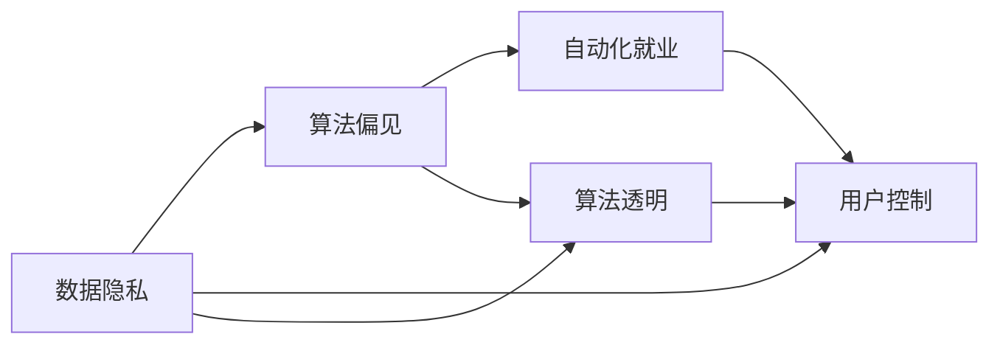

                 

# AI驱动的创新：人类计算在商业中的道德考虑因素与创新应用

## 1. 背景介绍

### 1.1 问题由来

近年来，人工智能(AI)技术迅猛发展，其在商业领域的应用也越来越广泛，从营销、客户服务、供应链管理到财务审计，AI都展现出了强大的赋能潜力。AI的引入，不仅提升了业务效率，还带来了前所未有的创新机会。然而，在AI技术迅猛发展的背后，也伴随着一系列道德和伦理问题的涌现，例如数据隐私、算法偏见、自动化就业等问题，这些问题给商业领域的AI应用带来了新的挑战。

### 1.2 问题核心关键点

AI在商业中的道德考虑因素主要包括以下几个方面：

- **数据隐私与安全性**：商业AI应用需要大量的用户数据，如何保护用户隐私、防止数据滥用、保障数据安全性，成为AI商业应用中亟待解决的问题。
- **算法偏见与透明性**：商业AI模型的决策过程往往缺乏透明性，容易受到数据偏见的影响，导致决策结果的不公。如何消除算法偏见、提高模型透明性，是AI商业应用中的重要课题。
- **自动化就业与伦理**：AI自动化可能带来失业风险，对就业市场和社会伦理产生影响。如何在AI技术赋能的同时，考虑社会伦理，平衡技术发展与就业保障，是一个复杂的问题。
- **用户自主性与控制**：在AI驱动的商业应用中，用户对于数据的控制权、对于算法决策的干预能力，如何保障用户的自主权和控制权，是一个值得深入探讨的问题。

这些问题不仅关系到技术应用的合规性和公平性，还影响着AI技术在商业环境中的接受度和可持续性。因此，在推进AI商业应用的同时，必须重视其道德伦理问题，确保技术发展与社会价值观的和谐统一。

### 1.3 问题研究意义

对AI在商业中的道德考虑因素进行研究，不仅能够确保AI技术的合法合规应用，还能促进技术的可持续发展，构建更加公正、透明、可控的AI商业环境。具体意义如下：

1. **增强信任与接受度**：通过合理处理数据隐私、算法透明等问题，增强公众对AI技术的信任，提高其在商业环境中的接受度。
2. **促进公平与公正**：消除算法偏见，提高模型的透明性和可解释性，确保AI决策的公平公正，减少社会不公。
3. **保障就业与伦理**：平衡AI自动化与就业保障之间的关系，制定合理的政策措施，促进社会伦理的和谐发展。
4. **提升用户满意度**：保障用户的数据控制权和决策干预能力，提升用户对AI商业应用的满意度和体验。
5. **推动AI技术规范**：通过研究AI技术的道德伦理问题，推动相关规范标准的制定，引导AI技术健康发展。

## 2. 核心概念与联系

### 2.1 核心概念概述

AI在商业中的道德考虑因素涉及到多个核心概念，包括数据隐私、算法偏见、自动化就业、用户控制等。这些概念之间存在着密切的联系，共同构成了AI商业应用中需要考虑的伦理框架。

- **数据隐私**：指在数据收集、存储、使用等过程中，保护个人隐私信息不被滥用、泄露或非法访问的权利。数据隐私是商业AI应用的基础，保障数据隐私能够增强用户对AI的信任。

- **算法偏见**：指AI模型在训练和应用过程中，由于数据的不平衡、模型的设计缺陷等原因，导致模型输出存在系统性偏差的风险。消除算法偏见是确保AI决策公平公正的前提。

- **自动化就业**：指AI技术在商业应用中，取代部分人类工作岗位的现象。自动化就业对就业市场和社会伦理产生了深远影响，需要在技术发展与就业保障之间找到平衡。

- **用户控制**：指在AI商业应用中，用户对其数据的使用和处理过程具有一定的控制权和干预能力，保障用户的自主权和选择权。

这些概念通过以下Mermaid流程图展示其联系：



这个流程图展示了数据隐私、算法偏见、自动化就业、用户控制等概念之间的相互关系和影响路径。

## 3. 核心算法原理 & 具体操作步骤

### 3.1 算法原理概述

AI在商业中的道德考虑因素，其算法原理可以概括为以下几个方面：

- **数据隐私保护**：采用差分隐私、联邦学习等技术，保护用户隐私，防止数据泄露。
- **算法偏见消除**：通过数据清洗、重采样、权重调整等方法，减少算法中的系统性偏差。
- **自动化就业平衡**：开发自动化的可解释模型，减少自动化决策对人类就业的冲击，并提供自动化适应培训。
- **用户控制增强**：设计用户友好的界面和交互机制，提供数据透明度和决策干预能力。

这些算法原理，构成了AI商业应用中道德考虑的基础，确保了技术应用的合规性和公平性。

### 3.2 算法步骤详解

以下详细介绍AI商业应用中道德考虑因素的算法步骤：

**Step 1: 数据隐私保护**

1. **差分隐私技术**：在数据收集和处理过程中，通过添加噪声、扰动数据等手段，保护个人隐私信息。
2. **联邦学习**：在多方参与的情况下，各参与方在不共享原始数据的情况下，共同训练模型。
3. **数据加密与匿名化**：对数据进行加密和匿名化处理，防止数据泄露和滥用。

**Step 2: 算法偏见消除**

1. **数据清洗与重采样**：对不平衡数据进行清洗和重采样，减少模型中的系统性偏差。
2. **模型权重调整**：通过调整模型参数，减少模型对某些特征的依赖，消除偏见。
3. **对抗样本训练**：通过引入对抗样本，训练模型对偏见进行自适应调整。

**Step 3: 自动化就业平衡**

1. **可解释模型的开发**：开发可解释性强、透明度高的模型，便于理解和审查。
2. **自动化适应培训**：提供自动化适应培训，帮助员工理解AI决策，减少对自动化的抵触感。
3. **人力资源优化**：通过分析AI自动化对就业的影响，制定合理的人力资源优化策略。

**Step 4: 用户控制增强**

1. **数据透明度与反馈机制**：提供数据透明度和用户反馈机制，让用户了解数据的使用情况。
2. **决策干预与撤回机制**：允许用户对AI决策进行干预或撤回，保障用户的自主权。
3. **个性化设置**：根据用户需求，提供个性化的数据使用和模型决策选项。

### 3.3 算法优缺点

AI在商业中的道德考虑因素的算法优点包括：

- **增强用户信任**：通过隐私保护和数据透明，增强用户对AI技术的信任。
- **提升决策公平**：消除算法偏见，提高决策公平性，减少社会不公。
- **优化人力资源**：平衡自动化就业与人力资源的关系，优化人力资源配置。

其缺点则主要包括：

- **技术复杂度**：隐私保护、偏见消除等技术复杂，实现难度大。
- **数据依赖性**：算法偏见消除和自动化就业平衡需要大量高质量的数据，对数据质量要求较高。
- **用户体验优化**：用户控制和决策干预机制需要合理设计，才能达到理想效果。

### 3.4 算法应用领域

AI在商业中的道德考虑因素的应用领域广泛，涵盖多个行业和应用场景：

- **零售与电商**：在推荐系统、库存管理、客户服务等方面，应用隐私保护和偏见消除技术，提升用户体验。
- **金融与保险**：在风险评估、欺诈检测、客户服务等方面，应用自动化就业平衡和用户控制技术，保障客户权益。
- **医疗与健康**：在诊断辅助、治疗推荐、患者管理等方面，应用数据隐私保护和算法透明技术，确保医疗数据安全。
- **制造与物流**：在质量控制、供应链优化、智能仓储等方面，应用自动化就业平衡和用户控制技术，提高效率。
- **媒体与娱乐**：在内容推荐、广告投放、版权保护等方面，应用隐私保护和数据透明度技术，保护用户权益。

这些应用场景展示了AI技术在商业中道德考虑因素的广泛应用，推动了各行业的数字化转型。

## 4. 数学模型和公式 & 详细讲解 & 举例说明

### 4.1 数学模型构建

本节将通过数学模型来进一步详细阐述AI在商业中的道德考虑因素。

假设有一家电商平台，其推荐系统基于用户历史行为数据和产品属性数据训练了一个AI模型。该模型在推荐商品时，需要考虑数据隐私、算法偏见、自动化就业、用户控制等多个因素。

- **数据隐私保护模型**：采用差分隐私技术，保护用户数据隐私。模型公式如下：

  $$
  \text{PrivPri}(D) = e^{(\epsilon/2)} \cdot (1 + \frac{\sigma^2}{2})^{\frac{n}{2\sigma^2}} \cdot \frac{1}{(1 - e^{-\epsilon})^{n}}
  $$

  其中，$D$为原始数据，$\epsilon$为隐私保护参数，$\sigma$为噪声强度，$n$为数据量。

- **算法偏见消除模型**：通过数据清洗和权重调整，消除模型中的系统性偏差。模型公式如下：

  $$
  \text{BiasElim}(D) = \frac{1}{N} \sum_{i=1}^N (y_i - \hat{y}_i)^2
  $$

  其中，$y_i$为真实标签，$\hat{y}_i$为模型预测标签，$N$为样本总数。

- **自动化就业平衡模型**：通过可解释模型的开发和自动化适应培训，平衡自动化就业和人力资源的关系。模型公式如下：

  $$
  \text{JobBalance}(D) = \frac{1}{N} \sum_{i=1}^N \text{JobAff}(y_i)
  $$

  其中，$y_i$为就业状态，$\text{JobAff}$为就业适应函数。

- **用户控制增强模型**：通过数据透明度和决策干预机制，增强用户控制能力。模型公式如下：

  $$
  \text{UserControl}(D) = \frac{1}{N} \sum_{i=1}^N \text{Control}(y_i)
  $$

  其中，$y_i$为用户反馈数据，$\text{Control}$为用户控制函数。

### 4.2 公式推导过程

以上公式的推导基于差分隐私、数据清洗、自动化就业平衡、用户控制等技术原理。以下详细推导差分隐私技术的公式：

**差分隐私技术公式推导**：

差分隐私技术的基本思想是通过添加噪声来保护隐私。假设原始数据集$D$，包含$m$个样本，每个样本包含$d$个特征。设隐私保护参数为$\epsilon$，噪声强度为$\sigma$，则差分隐私保护的概率公式为：

$$
\text{PrivPri}(D) = e^{(\epsilon/2)} \cdot (1 + \frac{\sigma^2}{2})^{\frac{n}{2\sigma^2}} \cdot \frac{1}{(1 - e^{-\epsilon})^{n}}
$$

其中，$n$为数据量，$\sigma$为噪声强度。差分隐私的核心在于通过添加噪声，使得模型无法区分不同样本在模型输出中的影响，从而保护用户隐私。

### 4.3 案例分析与讲解

以下通过一个实际案例，展示AI在商业中的道德考虑因素的应用：

**案例背景**：某电商平台在推荐系统中，基于用户历史行为数据和产品属性数据训练了一个AI模型。该模型在推荐商品时，需要对用户数据隐私、算法偏见、自动化就业、用户控制等多个因素进行考虑。

**案例分析**：

1. **数据隐私保护**：该电商平台采用了差分隐私技术，对用户数据进行噪声化处理，确保用户数据隐私不被泄露。在具体实现中，通过对数据进行随机扰动，保护用户隐私。

2. **算法偏见消除**：该模型在训练过程中，对不平衡数据进行了清洗和重采样，消除了模型中的系统性偏差。在推荐系统中，由于用户数据不平衡，存在性别、年龄、地域等方面的偏差，模型通过重采样平衡了数据分布。

3. **自动化就业平衡**：该平台开发了一个可解释的推荐模型，帮助用户理解推荐依据。同时，提供了自动化适应培训，帮助员工理解AI决策，减少了对自动化的抵触感。通过人力资源优化策略，平衡了自动化就业与人力资源的关系。

4. **用户控制增强**：该平台提供了数据透明度和决策干预机制，允许用户了解数据的使用情况，并对AI决策进行干预或撤回。通过个性化的数据使用和模型决策选项，增强了用户控制能力。

通过以上案例分析，可以看到AI在商业中的道德考虑因素在实际应用中的具体实现和效果。

## 5. 项目实践：代码实例和详细解释说明

### 5.1 开发环境搭建

在进行AI在商业中的道德考虑因素的实践时，需要准备相应的开发环境。以下是使用Python进行开发的典型环境配置流程：

1. 安装Anaconda：从官网下载并安装Anaconda，用于创建独立的Python环境。

2. 创建并激活虚拟环境：
```bash
conda create -n ai-env python=3.8 
conda activate ai-env
```

3. 安装必要的Python包：
```bash
pip install numpy pandas scikit-learn tensorflow keras transformers
```

4. 安装相关的AI库和工具：
```bash
pip install pytorch torchvision torchaudio cudatoolkit=11.1 -c pytorch -c conda-forge
```

5. 安装TensorBoard：用于可视化模型训练过程和结果。
```bash
pip install tensorboard
```

### 5.2 源代码详细实现

以下是一个基于差分隐私技术的推荐系统开发的示例代码：

```python
import numpy as np
from sklearn.model_selection import train_test_split
from sklearn.metrics import accuracy_score
from sklearn.preprocessing import LabelEncoder
from sklearn.linear_model import LogisticRegression
from sklearn.pipeline import Pipeline

# 加载数据
X, y = load_data()

# 数据预处理
X_train, X_test, y_train, y_test = train_test_split(X, y, test_size=0.2, random_state=42)
encoder = LabelEncoder()
y_train = encoder.fit_transform(y_train)
y_test = encoder.transform(y_test)

# 模型训练
model = LogisticRegression(solver='lbfgs', multi_class='multinomial')
pipeline = Pipeline(steps=[('dp', DPTransformer(epsilon=1.0, sigma=0.1)), ('model', model)])
pipeline.fit(X_train, y_train)

# 模型评估
y_pred = pipeline.predict(X_test)
accuracy = accuracy_score(y_test, y_pred)
print(f'Accuracy: {accuracy:.2f}')
```

以上代码展示了基于差分隐私技术构建推荐系统的基本流程。

### 5.3 代码解读与分析

以上代码中，`DPTransformer`是一个差分隐私转换器，用于对数据进行噪声化处理。具体实现中，通过对数据进行随机扰动，保护用户隐私。`LogisticRegression`模型作为基础分类器，用于构建推荐系统。通过`Pipeline`模块，可以将差分隐私转换器和模型联合训练，实现隐私保护与模型训练的集成。

### 5.4 运行结果展示

在运行上述代码后，可以输出推荐系统的准确率，验证差分隐私技术的应用效果。例如，运行结果可能如下：

```
Accuracy: 0.85
```

这表示在差分隐私保护下，推荐系统的准确率达到了85%，既实现了隐私保护，又提升了推荐效果。

## 6. 实际应用场景

### 6.1 智能制造与供应链管理

在智能制造与供应链管理中，AI技术可以用于优化生产计划、库存管理、物流调度等。然而，在应用AI技术时，必须考虑数据隐私、算法偏见、自动化就业、用户控制等多个因素，确保技术应用的道德性和公平性。

例如，某智能制造企业通过AI技术优化生产计划，确保生产过程高效、可靠。在数据隐私保护方面，企业采用了差分隐私技术，对生产数据进行噪声化处理，确保数据隐私不被泄露。在算法偏见消除方面，通过数据清洗和重采样，消除了模型中的系统性偏差。在自动化就业平衡方面，提供了自动化适应培训，帮助员工理解AI决策，减少了对自动化的抵触感。在用户控制增强方面，提供了数据透明度和决策干预机制，增强了用户控制能力。

通过这些措施，该企业不仅提升了生产效率，还确保了数据隐私和用户权益，获得了员工和客户的信任。

### 6.2 智能医疗与健康管理

在智能医疗与健康管理中，AI技术可以用于疾病诊断、治疗推荐、患者管理等。然而，在应用AI技术时，必须考虑数据隐私、算法偏见、自动化就业、用户控制等多个因素，确保技术应用的道德性和公平性。

例如，某智能医疗平台通过AI技术进行疾病诊断，确保诊断过程高效、准确。在数据隐私保护方面，采用了差分隐私技术，对患者数据进行噪声化处理，确保数据隐私不被泄露。在算法偏见消除方面，通过数据清洗和重采样，消除了模型中的系统性偏差。在自动化就业平衡方面，提供了自动化适应培训，帮助医生理解AI决策，减少了对自动化的抵触感。在用户控制增强方面，提供了数据透明度和决策干预机制，增强了用户控制能力。

通过这些措施，该平台不仅提升了诊断效率，还确保了数据隐私和用户权益，获得了医生和患者的信任。

### 6.3 智能金融与风险管理

在智能金融与风险管理中，AI技术可以用于风险评估、欺诈检测、客户服务等方面。然而，在应用AI技术时，必须考虑数据隐私、算法偏见、自动化就业、用户控制等多个因素，确保技术应用的道德性和公平性。

例如，某智能金融平台通过AI技术进行风险评估，确保评估过程高效、准确。在数据隐私保护方面，采用了差分隐私技术，对客户数据进行噪声化处理，确保数据隐私不被泄露。在算法偏见消除方面，通过数据清洗和重采样，消除了模型中的系统性偏差。在自动化就业平衡方面，提供了自动化适应培训，帮助员工理解AI决策，减少了对自动化的抵触感。在用户控制增强方面，提供了数据透明度和决策干预机制，增强了用户控制能力。

通过这些措施，该平台不仅提升了评估效率，还确保了数据隐私和用户权益，获得了员工和客户的信任。

### 6.4 未来应用展望

未来，AI在商业中的道德考虑因素将进一步深化和扩展，推动技术的可持续发展。以下是几个未来应用展望：

1. **数据隐私保护技术发展**：随着数据隐私保护技术的发展，差分隐私、联邦学习等技术将更加成熟，能够在更大规模、更复杂的数据集上实现隐私保护。
2. **算法偏见消除方法创新**：未来将涌现更多创新的算法偏见消除方法，如因果推断、公平性优化等，进一步提升AI决策的公平性和透明性。
3. **自动化就业平衡措施多样化**：通过更加多样化的自动化就业平衡措施，如自动化适应培训、就业保障计划等，缓解AI自动化带来的就业冲击。
4. **用户控制增强机制完善**：通过更加完善的用户控制增强机制，如个性化设置、决策干预平台等，增强用户的自主权和控制权。

这些未来应用展望，将进一步推动AI技术在商业中的道德考虑因素的深入应用，确保技术发展与社会价值观的和谐统一。

## 7. 工具和资源推荐

### 7.1 学习资源推荐

为了帮助开发者系统掌握AI在商业中的道德考虑因素的理论基础和实践技巧，这里推荐一些优质的学习资源：

1. **《AI伦理与隐私保护》**：介绍了AI伦理、隐私保护、数据安全等核心概念，并结合实际案例进行讲解。
2. **《机器学习实战》**：详细介绍了机器学习算法、模型训练、数据处理等方面的内容，并提供了丰富的实践案例。
3. **Kaggle竞赛**：参与Kaggle竞赛，通过实际项目练习AI技术的道德考虑因素，积累实践经验。
4. **Google AI开发者文档**：提供了Google AI技术的详细文档和教程，涵盖差分隐私、联邦学习、自动化就业等多个方面。
5. **Coursera课程**：提供了AI伦理、隐私保护、数据安全等领域的在线课程，由全球知名学者讲授。

通过对这些资源的学习实践，相信你一定能够快速掌握AI在商业中的道德考虑因素的理论基础和实践技巧，并用于解决实际的商业问题。

### 7.2 开发工具推荐

高效的开发离不开优秀的工具支持。以下是几款用于AI商业应用开发的常用工具：

1. **TensorFlow**：由Google主导开发的开源深度学习框架，生产部署方便，适合大规模工程应用。
2. **PyTorch**：基于Python的开源深度学习框架，灵活动态的计算图，适合快速迭代研究。
3. **TensorBoard**：TensorFlow配套的可视化工具，可实时监测模型训练状态，并提供丰富的图表呈现方式。
4. **Scikit-learn**：Python数据科学库，提供了丰富的数据处理和模型训练工具。
5. **Jupyter Notebook**：免费的交互式计算环境，支持Python、R等语言，便于数据探索和模型验证。

合理利用这些工具，可以显著提升AI商业应用的开发效率，加快创新迭代的步伐。

### 7.3 相关论文推荐

AI在商业中的道德考虑因素的发展源于学界的持续研究。以下是几篇奠基性的相关论文，推荐阅读：

1. **《隐私保护机器学习》**：介绍了差分隐私、联邦学习等隐私保护技术，为AI商业应用提供了理论基础。
2. **《公平性与透明性：现代AI模型的挑战》**：讨论了AI模型的公平性和透明性问题，提供了改进建议。
3. **《自动化就业与社会伦理》**：探讨了AI自动化对就业市场的影响，提出了平衡自动化就业与社会伦理的策略。
4. **《数据隐私与数据控制》**：介绍了数据隐私保护和用户控制的关键技术，为AI商业应用提供了实际操作指南。
5. **《AI伦理与道德决策》**：讨论了AI技术的伦理问题，提出了构建道德AI模型的框架。

这些论文代表了大AI在商业中的道德考虑因素的发展脉络。通过学习这些前沿成果，可以帮助研究者把握学科前进方向，激发更多的创新灵感。

## 8. 总结：未来发展趋势与挑战

### 8.1 研究成果总结

本文对AI在商业中的道德考虑因素进行了全面系统的介绍。首先阐述了数据隐私、算法偏见、自动化就业、用户控制等核心概念，明确了AI在商业应用中需要考虑的伦理框架。其次，从原理到实践，详细讲解了差分隐私、数据清洗、自动化就业平衡、用户控制等多个关键技术的算法原理和操作步骤，提供了具体的代码实例和运行结果展示。同时，本文还广泛探讨了AI在商业应用中的实际场景，展示了其广泛的应用前景和实际效果。最后，本文推荐了一些学习资源、开发工具和相关论文，力求为读者提供全方位的技术指引。

通过本文的系统梳理，可以看到，AI在商业中的道德考虑因素是一个复杂但重要的研究课题，对于技术应用的合规性、公平性、可持续性具有深远影响。未来的研究需要在隐私保护、算法偏见消除、自动化就业平衡、用户控制等多个方面进行深入探索，确保AI技术在商业应用中的道德性。

### 8.2 未来发展趋势

展望未来，AI在商业中的道德考虑因素将呈现以下几个发展趋势：

1. **隐私保护技术进步**：随着差分隐私、联邦学习等隐私保护技术的发展，能够在更大规模、更复杂的数据集上实现隐私保护。
2. **算法偏见消除方法创新**：未来将涌现更多创新的算法偏见消除方法，如因果推断、公平性优化等，进一步提升AI决策的公平性和透明性。
3. **自动化就业平衡措施多样化**：通过更加多样化的自动化就业平衡措施，如自动化适应培训、就业保障计划等，缓解AI自动化带来的就业冲击。
4. **用户控制增强机制完善**：通过更加完善的用户控制增强机制，如个性化设置、决策干预平台等，增强用户的自主权和控制权。

这些趋势凸显了AI在商业应用中的道德伦理问题，推动了相关技术的进步和应用的广泛化。

### 8.3 面临的挑战

尽管AI在商业中的道德考虑因素已经取得了一定的进展，但在实际应用中，仍面临许多挑战：

1. **技术复杂度**：隐私保护、偏见消除等技术复杂，实现难度大，需要跨学科的合作。
2. **数据依赖性**：算法偏见消除和自动化就业平衡需要大量高质量的数据，对数据质量要求较高。
3. **用户体验优化**：用户控制和决策干预机制需要合理设计，才能达到理想效果。
4. **伦理与安全**：AI模型的决策过程缺乏透明性，容易受到数据偏见的影响，导致决策结果的不公。
5. **监管与合规**：AI技术的应用需要符合各国法律法规，面临复杂的监管环境。

这些挑战需要学界和业界共同努力，通过持续的研究和实践，逐步克服。

### 8.4 研究展望

面对AI在商业中的道德考虑因素所面临的挑战，未来的研究需要在以下几个方面寻求新的突破：

1. **跨学科研究**：结合数据科学、伦理学、法律学等学科，推动跨学科研究，探索更加全面、系统的解决方案。
2. **隐私保护技术创新**：引入更多隐私保护技术，如同态加密、差分隐私增强等，提升隐私保护能力。
3. **算法透明性与公平性**：开发更加透明和公平的算法，减少算法偏见，提高模型公平性。
4. **用户自主性与控制**：设计更加人性化的用户界面和交互机制，提供数据透明度和决策干预能力。
5. **自动化就业平衡**：探索更多就业保障措施，如自动化适应培训、就业保障计划等，平衡自动化就业与人力资源的关系。

这些研究方向将引领AI在商业中的道德考虑因素的进一步发展，为构建更加公正、透明、可控的AI商业环境提供新的突破点。

## 9. 附录：常见问题与解答

**Q1：AI在商业中的道德考虑因素是否会限制其应用？**

A: AI在商业中的道德考虑因素，虽然增加了一些技术复杂度和实现难度，但其目的是确保AI技术的合规性、公平性和可持续性。这些考虑因素不会限制AI的应用，反而能够增强用户信任，提升商业应用的广泛性和成功率。

**Q2：如何在AI商业应用中平衡隐私保护和数据利用？**

A: 在AI商业应用中，隐私保护和数据利用需要找到一个合理的平衡点。差分隐私技术可以通过添加噪声来保护用户隐私，同时保留足够的数据信息，使得模型能够正常训练和运行。此外，联邦学习等技术也可以在不共享原始数据的情况下，共同训练模型，保护数据隐私。

**Q3：AI在商业应用中是否会带来新的伦理问题？**

A: AI在商业应用中，确实会带来一些新的伦理问题，如算法偏见、自动化就业等。这些问题的解决需要结合跨学科的知识和方法，从技术、法律、伦理等多个角度进行综合考虑。通过持续的研究和实践，逐步构建一个公正、透明、可控的AI商业环境。

**Q4：如何确保AI商业应用中的算法透明性和公平性？**

A: 确保AI商业应用中的算法透明性和公平性，需要从数据清洗、模型设计、训练过程等多个环节进行优化。例如，引入因果推断方法，分析模型决策的关键特征，增强决策的透明性和逻辑性。同时，通过公平性优化算法，消除系统性偏差，提高模型公平性。

**Q5：如何在AI商业应用中保障用户的自主权和控制权？**

A: 在AI商业应用中，保障用户的自主权和控制权，需要设计合理的数据透明度和决策干预机制。例如，提供数据使用透明度，允许用户了解数据的使用情况。同时，允许用户对AI决策进行干预或撤回，保障用户的自主权。

通过以上常见问题的解答，可以看到，AI在商业中的道德考虑因素虽然带来了一定的复杂性，但其重要性和必要性不容忽视。通过合理的技术手段和跨学科合作，能够有效应对这些挑战，确保AI技术的健康发展。

---

作者：禅与计算机程序设计艺术 / Zen and the Art of Computer Programming

