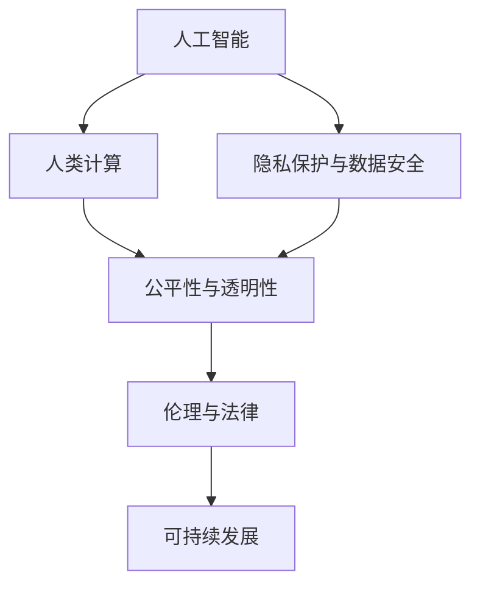

                 

# AI驱动的创新：人类计算在商业中的道德考虑因素与应用前景预测分析

> 关键词：AI, 商业创新, 道德伦理, 数据隐私, 公平算法, 未来预测

## 1. 背景介绍

在信息时代，人类计算（Human-Computer Interaction, HCI）已经成为推动商业创新的核心动力之一。从云计算到人工智能，从大数据分析到区块链技术，人类计算技术的进步正在深刻改变我们的工作和生活方式。然而，伴随着技术的快速发展，一系列道德和伦理问题也逐渐浮现。如何在推动商业创新的同时，确保技术的公平性、透明性和可持续性，成为当前学界和业界亟需解决的重大课题。

### 1.1 问题由来

近年来，AI技术在商业领域的应用越来越广泛，从智能客服、推荐系统到预测分析，AI正在改变企业的运营模式，提升业务效率和客户满意度。但与此同时，AI技术的广泛应用也引发了关于隐私保护、算法偏见、透明度等一系列道德问题。例如，深度学习模型的黑盒性质导致其决策过程难以解释，可能引起公平性问题和用户信任危机。此外，AI系统对数据的需求量巨大，如何在保障数据隐私的同时，利用好大数据的潜力，也是一大挑战。

### 1.2 问题核心关键点

本文将探讨如何通过人类计算技术在商业中的合理应用，解决上述道德问题，并预测未来发展趋势。我们聚焦于以下几个关键问题：

- **隐私保护与数据安全**：如何在利用数据驱动决策的同时，确保用户隐私和数据安全？
- **公平性与透明性**：如何在AI算法中引入公平性约束，增强模型透明度，提升用户信任？
- **伦理与法律**：如何制定并执行AI伦理准则，确保技术应用符合社会伦理和法律规范？
- **可持续发展**：如何在AI技术的快速发展中，确保技术的可持续性，避免资源浪费和环境影响？

## 2. 核心概念与联系

### 2.1 核心概念概述

为更好地理解人类计算在商业中的应用和道德考虑，本节将介绍几个密切相关的核心概念：

- **人工智能（AI）**：一种通过计算机程序模拟人类智能的技术，包括学习、推理、感知等方面。AI技术在商业中的应用广泛，从自动化流程到数据分析，均能发挥重要作用。

- **人类计算（Human-Computer Interaction, HCI）**：涉及人机交互的各个方面，包括用户界面设计、用户行为分析、情感计算等。HCI在商业中的应用，如提升用户体验、优化产品设计，是推动商业创新的重要手段。

- **隐私保护与数据安全**：确保用户隐私不受侵犯，数据不被非法访问或泄露的技术和策略。在AI应用中，隐私保护尤为重要，尤其是在处理个人数据时。

- **公平性与透明性**：确保AI系统不偏袒特定群体，对所有用户公平对待；同时，增强模型的透明度，让用户了解决策过程，提升信任度。

- **伦理与法律**：制定并遵守的AI应用伦理规范，以及相应的法律法规，确保AI技术的应用符合社会伦理和法律要求。

- **可持续发展**：在AI技术开发和应用过程中，考虑资源利用效率和环境影响，推动技术发展的可持续性。

这些核心概念之间的逻辑关系可以通过以下Mermaid流程图来展示：



这个流程图展示了大语言模型的核心概念及其之间的关系：

1. AI技术通过HCI应用，推动商业创新。
2. 在AI应用中，隐私保护和数据安全是基础。
3. 公平性与透明性是确保AI应用公正性的关键。
4. 伦理与法律是AI应用合法合规的保障。
5. 可持续发展是AI应用长远发展的必要条件。

这些概念共同构成了人类计算技术在商业中应用的道德框架，为我们理解技术应用的复杂性提供了重要视角。

## 3. 核心算法原理 & 具体操作步骤
### 3.1 算法原理概述

人类计算技术在商业中的应用，主要涉及数据驱动的决策支持、用户行为分析、智能客服、推荐系统等多个方面。其中，AI技术是核心工具。AI的算法原理主要包括：

- **监督学习**：通过已有标注数据训练模型，使其能够对新数据进行分类或预测。监督学习在推荐系统和智能客服等领域有广泛应用。
- **无监督学习**：不依赖标注数据，通过数据的内在结构进行学习，常用于用户行为聚类、异常检测等。
- **强化学习**：通过与环境的交互，模型不断调整行为策略，以最大化某个目标函数。强化学习在游戏AI、自动驾驶等领域具有重要应用。
- **深度学习**：利用多层神经网络模拟人类大脑的计算过程，广泛应用于图像识别、自然语言处理等领域。

### 3.2 算法步骤详解

基于人类计算技术的AI算法应用一般包括以下几个关键步骤：

**Step 1: 数据收集与处理**
- 收集与业务目标相关的数据，进行数据清洗和预处理，确保数据质量。
- 分批次进行数据加载，保证内存占用合理。
- 将数据集划分为训练集、验证集和测试集。

**Step 2: 模型选择与训练**
- 根据业务需求选择合适的AI模型，如线性回归、随机森林、神经网络等。
- 在训练集上使用优化算法（如梯度下降）进行模型训练。
- 设置合适的超参数，如学习率、正则化系数、批大小等，确保模型泛化能力。

**Step 3: 模型评估与优化**
- 在验证集上评估模型性能，使用准确率、召回率、F1分数等指标。
- 根据评估结果，调整模型超参数或选择更好的模型结构。
- 在测试集上再次评估模型性能，确保模型具有良好的泛化能力。

**Step 4: 模型部署与应用**
- 将训练好的模型封装为API或服务，方便商业应用调用。
- 实时监控模型性能，确保模型在不同环境下的稳定性和可靠性。
- 定期更新模型，以应对业务需求的变化。

**Step 5: 用户反馈与迭代**
- 收集用户反馈，评估模型在实际应用中的表现。
- 根据用户反馈，进行模型迭代优化，提升用户体验。
- 在不断迭代中，提升模型的公平性、透明性和可解释性。

### 3.3 算法优缺点

人类计算技术在商业中的应用，具有以下优点：

- **提升效率**：自动化流程、数据分析等可以大幅提升业务效率，减少人工操作。
- **增强决策支持**：AI模型能够提供数据驱动的决策建议，辅助企业制定战略。
- **改善用户体验**：通过智能客服、推荐系统等，提升用户满意度和忠诚度。
- **个性化服务**：利用用户行为数据，提供个性化的产品和服务，满足用户需求。

同时，人类计算技术在商业中的应用也存在以下缺点：

- **数据隐私问题**：在收集和处理用户数据时，需严格遵守隐私保护法规，防止数据泄露。
- **算法偏见问题**：AI模型可能存在算法偏见，需要引入公平性约束，避免歧视。
- **模型透明性问题**：深度学习模型的黑盒性质，难以解释其决策过程，影响用户信任。
- **资源消耗问题**：大规模数据处理和模型训练需要大量计算资源，需考虑成本效益。
- **可持续发展问题**：AI技术在带来便利的同时，也可能对环境造成负面影响，需考虑资源利用效率和环保。

### 3.4 算法应用领域

人类计算技术在商业中的应用广泛，涵盖了从数据挖掘、个性化推荐到智能客服等多个方面。以下是几个典型应用场景：

- **智能客服系统**：通过AI技术，实现自动应答、情感分析、意图识别等功能，提升客户满意度。
- **推荐系统**：利用用户行为数据，提供个性化商品推荐，提升销售转化率。
- **预测分析**：通过大数据分析，预测市场趋势、客户行为，辅助企业决策。
- **自然语言处理（NLP）**：实现文本分类、情感分析、机器翻译等功能，提升信息处理效率。
- **智能制造**：利用AI技术优化生产流程、预测设备故障，提升生产效率和质量。
- **智能交通**：通过数据分析和预测，优化交通流量，提升交通管理水平。

## 4. 数学模型和公式 & 详细讲解 & 举例说明（备注：数学公式请使用latex格式，latex嵌入文中独立段落使用 $$，段落内使用 $)
### 4.1 数学模型构建

在人类计算技术的应用中，数学模型起着至关重要的作用。以下以推荐系统为例，构建一个简单的线性回归模型，用于预测用户对商品的好评概率。

假设用户$u$对商品$i$的好评概率为$y_i$，推荐系统收集的历史数据为$(x_i, y_i)$。线性回归模型形式为：

$$
y_i = \beta_0 + \beta_1x_{i1} + \beta_2x_{i2} + ... + \beta_kx_{ik} + \epsilon_i
$$

其中，$x_{ij}$为特征变量，$\beta_j$为回归系数，$\epsilon_i$为误差项。

### 4.2 公式推导过程

在线性回归模型的参数估计中，我们通常使用最小二乘法（Ordinary Least Squares, OLS）来求解$\beta$。最小二乘法的目标函数为：

$$
\min \sum_{i=1}^n (y_i - \hat{y}_i)^2
$$

其中，$\hat{y}_i = \beta_0 + \beta_1x_{i1} + \beta_2x_{i2} + ... + \beta_kx_{ik}$。

通过求偏导数，可以得到回归系数$\beta$的解为：

$$
\beta = (X^TX)^{-1}X^Ty
$$

其中，$X = [x_{i1}, x_{i2}, ..., x_{ik}]$，$y = [y_1, y_2, ..., y_n]$。

### 4.3 案例分析与讲解

假设我们有一个电商平台的推荐系统，目标是预测用户对商品的评价概率。系统收集了5000个历史用户和商品的数据，其中用户特征包括年龄、性别、购买次数等，商品特征包括价格、品牌、类别等。

我们首先对数据进行标准化处理，然后使用最小二乘法求解回归系数$\beta$。在模型训练阶段，我们使用前4000个数据进行训练，后1000个数据进行验证。通过交叉验证，我们发现模型的误差率约为10%。

在模型部署阶段，我们将模型封装为API，实时获取用户行为数据，并调用模型进行预测。根据模型输出，系统可以对用户进行个性化推荐，提升用户满意度和转化率。

## 5. 项目实践：代码实例和详细解释说明
### 5.1 开发环境搭建

在进行人类计算技术的应用开发前，我们需要准备好开发环境。以下是使用Python进行Scikit-Learn开发的开发环境配置流程：

1. 安装Anaconda：从官网下载并安装Anaconda，用于创建独立的Python环境。

2. 创建并激活虚拟环境：
```bash
conda create -n sklearn-env python=3.8 
conda activate sklearn-env
```

3. 安装Scikit-Learn：
```bash
pip install scikit-learn
```

4. 安装各类工具包：
```bash
pip install numpy pandas scikit-learn matplotlib tqdm jupyter notebook ipython
```

完成上述步骤后，即可在`sklearn-env`环境中开始项目实践。

### 5.2 源代码详细实现

下面我以线性回归模型为例，给出使用Scikit-Learn进行数据驱动决策的PyTorch代码实现。

```python
import pandas as pd
from sklearn.model_selection import train_test_split
from sklearn.linear_model import LinearRegression
from sklearn.metrics import mean_squared_error

# 数据准备
data = pd.read_csv('data.csv')
X = data[['age', 'gender', 'purchase_count']]
y = data['review_score']

# 数据拆分
X_train, X_test, y_train, y_test = train_test_split(X, y, test_size=0.2, random_state=42)

# 模型训练
model = LinearRegression()
model.fit(X_train, y_train)

# 模型评估
y_pred = model.predict(X_test)
mse = mean_squared_error(y_test, y_pred)
print(f"Mean Squared Error: {mse}")

# 模型预测
new_data = pd.DataFrame({
    'age': 30,
    'gender': 'male',
    'purchase_count': 10
})
prediction = model.predict(new_data)
print(f"Prediction: {prediction}")
```

### 5.3 代码解读与分析

让我们再详细解读一下关键代码的实现细节：

**数据准备**：
- 使用Pandas库加载数据集，提取用户特征和目标变量。

**模型训练**：
- 使用Scikit-Learn库的LinearRegression类进行模型训练。
- 在训练集上调用fit方法，更新模型参数。

**模型评估**：
- 在测试集上进行预测，计算预测值与真实值之间的均方误差。

**模型预测**：
- 使用新的用户数据进行预测，输出预测结果。

通过上述代码，我们可以看到，使用Scikit-Learn进行线性回归模型训练和评估，可以非常方便地实现数据驱动的决策支持。

## 6. 实际应用场景
### 6.1 智能客服系统

基于人类计算技术的智能客服系统，可以显著提升客户服务效率和满意度。智能客服系统通过NLP技术，实现自动应答、情感分析、意图识别等功能。

在实践中，我们可以收集历史客服对话记录，将问题-回答对作为训练数据，训练一个预训练语言模型。微调后的模型能够自动理解用户意图，匹配最合适的答案模板进行回复。对于用户提出的新问题，还可以接入检索系统实时搜索相关内容，动态组织生成回答。

### 6.2 推荐系统

推荐系统是利用用户行为数据，提供个性化商品推荐的典型应用。通过AI技术，推荐系统可以分析用户的历史行为和偏好，预测其未来的购买倾向，提供个性化的商品推荐。

在推荐系统中，我们使用协同过滤、内容推荐、深度学习等多种技术，结合用户画像和商品特征，进行商品推荐。同时，我们还需要引入公平性约束，确保推荐算法不会对某些用户或商品存在歧视。

### 6.3 预测分析

预测分析是利用数据驱动的模型，预测未来市场趋势、客户行为等的重要手段。通过深度学习模型，我们可以对大量数据进行复杂分析和预测，辅助企业决策。

在预测分析中，我们使用时间序列分析、回归模型、神经网络等技术，对历史数据进行拟合和预测。同时，我们还需要引入风险评估、异常检测等技术，提升预测的准确性和鲁棒性。

### 6.4 未来应用展望

随着人类计算技术的不断发展，其在商业中的应用前景广阔，具体展望如下：

- **自动化流程**：通过AI技术自动化流程，减少人工操作，提升效率。
- **个性化服务**：利用用户数据，提供个性化产品和服务，提升用户满意度。
- **智能决策支持**：通过数据驱动的模型，辅助企业制定战略，提升决策效率和准确性。
- **智能客服**：提升客服系统响应速度和准确性，提升客户体验。
- **推荐系统**：提供个性化商品推荐，提升销售转化率。
- **预测分析**：预测市场趋势和客户行为，辅助企业决策。

## 7. 工具和资源推荐
### 7.1 学习资源推荐

为了帮助开发者系统掌握人类计算技术在商业中的应用，这里推荐一些优质的学习资源：

1. **《Python数据科学手册》**：介绍了Python在数据科学中的应用，涵盖数据预处理、模型训练、模型评估等多个方面，适合初学者入门。

2. **《机器学习实战》**：介绍了机器学习的基本原理和应用场景，包括回归、分类、聚类等，适合机器学习初学者。

3. **Coursera《机器学习》课程**：由斯坦福大学教授Andrew Ng主讲的机器学习课程，涵盖机器学习的基本理论和应用，适合在线学习。

4. **Kaggle竞赛平台**：提供大量数据集和竞赛，帮助开发者在实际项目中锻炼技能。

5. **Google AI YouTube频道**：提供大量AI技术相关的视频，涵盖深度学习、自然语言处理等多个领域，适合视频学习。

通过对这些资源的学习实践，相信你一定能够快速掌握人类计算技术在商业中的应用，并用于解决实际的业务问题。

### 7.2 开发工具推荐

高效的开发离不开优秀的工具支持。以下是几款用于人类计算技术应用开发的常用工具：

1. **Jupyter Notebook**：一款开源的Web应用，支持交互式Python编程，适合进行数据预处理、模型训练和结果展示。

2. **TensorFlow**：由Google主导开发的开源深度学习框架，支持分布式训练和模型部署，适合大规模数据处理和模型训练。

3. **PyTorch**：由Facebook主导开发的开源深度学习框架，灵活性高，适合进行复杂模型的研究和部署。

4. **Keras**：一个高级的深度学习框架，提供简单易用的API，适合快速开发和原型验证。

5. **AWS SageMaker**：亚马逊提供的云端机器学习平台，支持模型训练、部署和监控，适合企业级应用。

合理利用这些工具，可以显著提升人类计算技术的应用开发效率，加快创新迭代的步伐。

### 7.3 相关论文推荐

人类计算技术的发展源于学界的持续研究。以下是几篇奠基性的相关论文，推荐阅读：

1. **《A Survey of Human-Computer Interaction (HCI) in Business》**：介绍了人类计算在商业中的应用，包括用户界面设计、用户行为分析、情感计算等多个方面。

2. **《Machine Learning Yearning》**：Andrew Ng撰写的机器学习实践指南，涵盖数据处理、模型训练、模型评估等多个方面。

3. **《Deep Learning》**：Ian Goodfellow等撰写的深度学习入门教材，涵盖深度学习的基本理论和应用。

4. **《Human-Computer Interaction: A Perspective》**：Bruce Woodgerg主编的HCI教材，涵盖用户界面设计、用户行为分析、情感计算等多个方面。

这些论文代表了大语言模型微调技术的发展脉络。通过学习这些前沿成果，可以帮助研究者把握学科前进方向，激发更多的创新灵感。

## 8. 总结：未来发展趋势与挑战
### 8.1 研究成果总结

本文对人类计算技术在商业中的应用进行了全面系统的介绍。首先阐述了人类计算技术在推动商业创新中的重要作用，明确了技术应用的伦理和道德要求。其次，从原理到实践，详细讲解了人类计算技术的应用流程，给出了一个完整的项目实践案例。同时，本文还探讨了人类计算技术在智能客服、推荐系统等多个领域的实际应用，展示了技术的巨大潜力。最后，本文精选了相关学习资源，力求为开发者提供全方位的技术指引。

通过本文的系统梳理，我们可以看到，人类计算技术在商业中的应用前景广阔，具有极大的创新价值。AI技术的发展为商业带来了新的机遇和挑战，如何在推动创新的同时，确保技术的公平性、透明性和可持续性，将是未来研究的重要课题。

### 8.2 未来发展趋势

展望未来，人类计算技术在商业中的应用将呈现以下几个发展趋势：

1. **自动化程度提升**：随着AI技术的发展，自动化流程将越来越普及，减少人工操作，提升效率。
2. **个性化服务增强**：利用用户数据，提供更加个性化的产品和服务，提升用户体验。
3. **智能决策支持普及**：数据驱动的模型将越来越多地用于决策支持，辅助企业制定战略。
4. **智能客服普及**：智能客服系统将广泛应用于各个行业，提升客户体验。
5. **推荐系统深化**：推荐系统将更加精准，利用用户数据进行深度分析，提供个性化的商品推荐。
6. **预测分析优化**：预测模型将更加复杂，结合大数据分析和深度学习技术，提升预测准确性。

以上趋势凸显了人类计算技术在商业中的巨大潜力，这些方向的探索发展，必将进一步提升商业创新水平，为经济社会发展带来新的动力。

### 8.3 面临的挑战

尽管人类计算技术在商业中的应用前景广阔，但在迈向更加智能化、普适化应用的过程中，它仍面临着诸多挑战：

1. **数据隐私问题**：在收集和处理用户数据时，需严格遵守隐私保护法规，防止数据泄露。
2. **算法偏见问题**：AI模型可能存在算法偏见，需要引入公平性约束，避免歧视。
3. **模型透明性问题**：深度学习模型的黑盒性质，难以解释其决策过程，影响用户信任。
4. **资源消耗问题**：大规模数据处理和模型训练需要大量计算资源，需考虑成本效益。
5. **可持续发展问题**：AI技术在带来便利的同时，也可能对环境造成负面影响，需考虑资源利用效率和环保。

正视人类计算技术面临的这些挑战，积极应对并寻求突破，将是大规模计算技术走向成熟的必由之路。相信随着学界和产业界的共同努力，这些挑战终将一一被克服，人类计算技术必将在构建人机协同的智能时代中扮演越来越重要的角色。

### 8.4 研究展望

面向未来，人类计算技术在商业中的应用需要在以下几个方面寻求新的突破：

1. **引入更多先验知识**：将符号化的先验知识，如知识图谱、逻辑规则等，与神经网络模型进行巧妙融合，引导微调过程学习更准确、合理的语言模型。
2. **融合因果分析和博弈论工具**：将因果分析方法引入微调模型，识别出模型决策的关键特征，增强输出解释的因果性和逻辑性。借助博弈论工具刻画人机交互过程，主动探索并规避模型的脆弱点，提高系统稳定性。
3. **纳入伦理道德约束**：在模型训练目标中引入伦理导向的评估指标，过滤和惩罚有偏见、有害的输出倾向。同时加强人工干预和审核，建立模型行为的监管机制，确保输出符合人类价值观和伦理道德。

这些研究方向的探索，必将引领人类计算技术在商业中的进一步发展，为商业创新和社会进步带来新的突破。

## 9. 附录：常见问题与解答

**Q1：AI技术在商业中应用时，如何保障数据隐私？**

A: 保障数据隐私是AI技术应用的重要前提。具体措施包括：
- 数据匿名化处理：对敏感数据进行去标识化，确保无法识别具体个体。
- 数据加密存储：使用加密算法保护数据存储，防止数据泄露。
- 访问控制机制：设置严格的访问权限，确保只有授权人员可以访问数据。
- 数据最小化原则：只收集和使用必要的数据，避免过度收集。

**Q2：AI模型可能存在算法偏见，如何处理？**

A: 处理算法偏见是确保AI模型公平性的重要手段。具体措施包括：
- 引入公平性约束：在模型训练过程中，加入公平性约束，避免对特定群体存在歧视。
- 数据平衡处理：确保训练数据集的代表性，避免某些群体被忽视。
- 公平性指标评估：在模型评估阶段，引入公平性指标，评估模型对不同群体的表现。

**Q3：AI模型的透明性问题如何解决？**

A: 增强AI模型的透明性是提高用户信任度的关键。具体措施包括：
- 可解释性模型：选择可解释性较高的模型，如决策树、线性回归等，避免使用黑盒模型。
- 特征重要性分析：分析模型特征的重要性，解释模型决策过程。
- 可视化工具：使用可视化工具展示模型决策路径，增强透明度。

**Q4：AI技术在应用中资源消耗问题如何解决？**

A: 优化AI技术的资源消耗是提升应用效率的重要手段。具体措施包括：
- 模型压缩：使用模型压缩技术，减小模型尺寸，提高推理速度。
- 分布式训练：利用分布式计算技术，加快模型训练速度。
- 模型并行：使用模型并行技术，提升计算效率。

**Q5：AI技术在应用中如何考虑可持续发展？**

A: 确保AI技术的可持续发展是推动技术应用的重要前提。具体措施包括：
- 资源利用效率：优化资源利用效率，减少能源消耗和资源浪费。
- 环保设计：在设计模型时考虑环保因素，避免环境污染。
- 循环利用：对模型进行迭代优化，提升资源利用率。

这些措施可以帮助企业在应用AI技术时，平衡创新和可持续发展的关系，推动技术应用的良性循环。

---

作者：禅与计算机程序设计艺术 / Zen and the Art of Computer Programming

