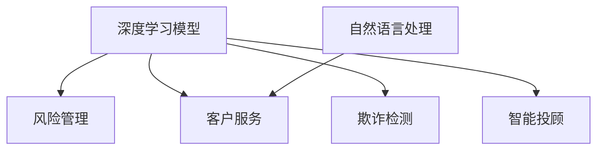

                 

## 1. 背景介绍

### 1.1 问题由来

金融行业正处于快速变革的关键时期。技术的进步使得传统金融服务从线下逐步转移到线上，金融产品的创新日新月异。同时，全球化、数字化等新趋势对金融服务的需求也提出了更高的要求。在这个背景下，如何通过技术创新提升金融服务效率、降低成本、优化客户体验，成为行业发展的重中之重。

人工智能（AI）技术的崛起为金融行业提供了强有力的技术支持，其中尤以深度学习和自然语言处理技术（NLP）最为引人注目。通过对AI技术的应用，金融企业能够在风险管理、客户服务、欺诈检测、智能投顾等多个领域实现显著的提升。在众多AI应用中，基于“人类计算”的模型计算方式，正在成为一种颠覆性的创新手段。

### 1.2 问题核心关键点

“人类计算”是指通过深度学习模型对人类专家的推理、决策过程进行建模，从而赋予计算机系统类似人类的计算能力。这种计算方式与传统的基于规则的计算方式截然不同，能够有效捕捉人类专家知识，并通过数据驱动的方式进行智能决策。在金融领域，基于“人类计算”的模型计算方式主要应用于以下几个方面：

- **风险管理**：通过对历史数据的学习，模型可以预测潜在风险，实现对风险的早期预警。
- **客户服务**：通过自然语言处理技术，模型能够理解客户需求，提供智能化的咨询服务。
- **欺诈检测**：模型可以分析大量交易数据，识别异常行为，防止欺诈。
- **智能投顾**：模型能够基于用户行为和市场数据，提供个性化的投资建议。

## 2. 核心概念与联系

### 2.1 核心概念概述

- **深度学习模型**：以神经网络为基础的机器学习模型，通过多层次的特征提取和组合，实现对复杂数据的高效建模。
- **人类计算**：通过深度学习模型对人类专家的推理、决策过程进行建模，实现类似人类的计算能力。
- **风险管理**：通过模型预测潜在风险，实现对风险的早期预警和控制。
- **客户服务**：通过自然语言处理技术，模型能够理解客户需求，提供智能化的咨询服务。
- **欺诈检测**：模型可以分析大量交易数据，识别异常行为，防止欺诈。
- **智能投顾**：模型能够基于用户行为和市场数据，提供个性化的投资建议。

这些核心概念之间相互关联，共同构成了“人类计算”在金融应用中的技术框架。

### 2.2 核心概念原理和架构的 Mermaid 流程图



这个流程图展示了深度学习模型在不同金融应用场景中的作用。

## 3. 核心算法原理 & 具体操作步骤

### 3.1 算法原理概述

“人类计算”在金融中的应用，主要是通过深度学习模型对历史数据进行学习，提取出有价值的特征，并进行智能决策。其核心算法包括：

- **卷积神经网络（CNN）**：用于图像处理和特征提取，适合处理结构化的金融数据。
- **循环神经网络（RNN）和长短时记忆网络（LSTM）**：适合处理序列数据，如时间序列分析。
- **注意力机制**：用于处理多源异构数据，通过学习不同特征之间的权重，实现对关键信息的聚焦。
- **自然语言处理（NLP）**：用于处理文本数据，理解客户需求和市场信息。

### 3.2 算法步骤详解

“人类计算”在金融中的应用，主要包括以下几个关键步骤：

**Step 1: 数据准备**

- 收集历史交易数据、客户服务记录、市场信息等，将其转化为模型可处理的形式。
- 对数据进行清洗和预处理，包括缺失值处理、异常值检测等。

**Step 2: 模型训练**

- 选择合适的深度学习模型，如卷积神经网络（CNN）、循环神经网络（RNN）、长短时记忆网络（LSTM）等。
- 使用历史数据对模型进行训练，通过反向传播算法调整模型参数，最小化预测误差。

**Step 3: 模型验证和优化**

- 在验证集上对模型进行评估，使用各种指标（如准确率、召回率、F1分数等）衡量模型性能。
- 根据评估结果，调整模型参数和超参数，如学习率、批次大小、正则化系数等，以优化模型性能。

**Step 4: 模型部署和应用**

- 将训练好的模型部署到生产环境中，实现实时计算。
- 定期收集新数据，重新训练模型，以适应数据分布的变化。

### 3.3 算法优缺点

“人类计算”在金融中的应用，具有以下优点：

- **智能决策**：模型能够基于历史数据和实时数据进行智能决策，提高决策效率和准确性。
- **自动化**：模型自动化处理大量数据，减少了人工干预，提升了服务效率。
- **实时性**：模型能够在实时数据上运行，及时发现异常情况，进行风险预警。

同时，也存在一些缺点：

- **数据依赖**：模型的性能高度依赖于数据的质量和数量，获取高质量数据成本较高。
- **模型解释性不足**：模型通常被视为“黑盒”系统，难以解释其决策过程。
- **模型鲁棒性**：模型可能对数据分布变化敏感，泛化能力不足。

### 3.4 算法应用领域

“人类计算”在金融中的应用，主要包括以下几个领域：

- **风险管理**：通过模型预测潜在风险，实现对风险的早期预警。
- **客户服务**：通过自然语言处理技术，模型能够理解客户需求，提供智能化的咨询服务。
- **欺诈检测**：模型可以分析大量交易数据，识别异常行为，防止欺诈。
- **智能投顾**：模型能够基于用户行为和市场数据，提供个性化的投资建议。

## 4. 数学模型和公式 & 详细讲解

### 4.1 数学模型构建

在金融应用中，“人类计算”通常使用以下几种数学模型：

- **卷积神经网络（CNN）**：
  $$
  \mathbf{H} = \sigma\left(\mathbf{W}_1 \mathbf{X} + \mathbf{b}_1\right)
  $$
  $$
  \mathbf{F} = \sigma\left(\mathbf{W}_2 \mathbf{H} + \mathbf{b}_2\right)
  $$

- **循环神经网络（RNN）**：
  $$
  \mathbf{h}_t = \tanh\left(\mathbf{W}_h \mathbf{h}_{t-1} + \mathbf{W}_x \mathbf{x}_t + \mathbf{b}\right)
  $$
  $$
  \mathbf{y}_t = \mathbf{V} \mathbf{h}_t
  $$

- **长短时记忆网络（LSTM）**：
  $$
  \mathbf{f}_t = \sigma\left(\mathbf{W}_f \mathbf{h}_{t-1} + \mathbf{U}_x \mathbf{x}_t + \mathbf{b}_f\right)
  $$
  $$
  \mathbf{i}_t = \sigma\left(\mathbf{W}_i \mathbf{h}_{t-1} + \mathbf{U}_x \mathbf{x}_t + \mathbf{b}_i\right)
  $$
  $$
  \mathbf{o}_t = \sigma\left(\mathbf{W}_o \mathbf{h}_{t-1} + \mathbf{U}_x \mathbf{x}_t + \mathbf{b}_o\right)
  $$
  $$
  \mathbf{c}_t = \tanh\left(\mathbf{W}_c \mathbf{h}_{t-1} + \mathbf{U}_x \mathbf{x}_t + \mathbf{b}_c\right)
  $$
  $$
  \mathbf{h}_t = \mathbf{o}_t \odot \tanh\left(\mathbf{c}_t\right)
  $$

- **注意力机制**：
  $$
  \mathbf{E} = \mathbf{W}_q \mathbf{h} + \mathbf{b}_q
  $$
  $$
  \alpha = \frac{\exp\left(\mathbf{E}^\top \mathbf{W}_k \mathbf{h}\right)}{\sum_{j=1}^T \exp\left(\mathbf{E}^\top \mathbf{W}_k \mathbf{h}_j\right)}
  $$
  $$
  \mathbf{Z} = \sum_{j=1}^T \alpha_j \mathbf{W}_v \mathbf{h}_j
  $$

- **自然语言处理（NLP）**：
  $$
  \mathbf{h} = \tanh\left(\mathbf{W}_h \mathbf{v} + \mathbf{b}_h\right)
  $$
  $$
  \mathbf{y} = \mathbf{V} \mathbf{h}
  $$

### 4.2 公式推导过程

在金融应用中，“人类计算”通常使用以下几种公式进行推导：

- **卷积神经网络（CNN）**：
  $$
  \mathbf{H} = \sigma\left(\mathbf{W}_1 \mathbf{X} + \mathbf{b}_1\right)
  $$
  $$
  \mathbf{F} = \sigma\left(\mathbf{W}_2 \mathbf{H} + \mathbf{b}_2\right)
  $$

- **循环神经网络（RNN）**：
  $$
  \mathbf{h}_t = \tanh\left(\mathbf{W}_h \mathbf{h}_{t-1} + \mathbf{W}_x \mathbf{x}_t + \mathbf{b}\right)
  $$
  $$
  \mathbf{y}_t = \mathbf{V} \mathbf{h}_t
  $$

- **长短时记忆网络（LSTM）**：
  $$
  \mathbf{f}_t = \sigma\left(\mathbf{W}_f \mathbf{h}_{t-1} + \mathbf{U}_x \mathbf{x}_t + \mathbf{b}_f\right)
  $$
  $$
  \mathbf{i}_t = \sigma\left(\mathbf{W}_i \mathbf{h}_{t-1} + \mathbf{U}_x \mathbf{x}_t + \mathbf{b}_i\right)
  $$
  $$
  \mathbf{o}_t = \sigma\left(\mathbf{W}_o \mathbf{h}_{t-1} + \mathbf{U}_x \mathbf{x}_t + \mathbf{b}_o\right)
  $$
  $$
  \mathbf{c}_t = \tanh\left(\mathbf{W}_c \mathbf{h}_{t-1} + \mathbf{U}_x \mathbf{x}_t + \mathbf{b}_c\right)
  $$
  $$
  \mathbf{h}_t = \mathbf{o}_t \odot \tanh\left(\mathbf{c}_t\right)
  $$

- **注意力机制**：
  $$
  \mathbf{E} = \mathbf{W}_q \mathbf{h} + \mathbf{b}_q
  $$
  $$
  \alpha = \frac{\exp\left(\mathbf{E}^\top \mathbf{W}_k \mathbf{h}\right)}{\sum_{j=1}^T \exp\left(\mathbf{E}^\top \mathbf{W}_k \mathbf{h}_j\right)}
  $$
  $$
  \mathbf{Z} = \sum_{j=1}^T \alpha_j \mathbf{W}_v \mathbf{h}_j
  $$

- **自然语言处理（NLP）**：
  $$
  \mathbf{h} = \tanh\left(\mathbf{W}_h \mathbf{v} + \mathbf{b}_h\right)
  $$
  $$
  \mathbf{y} = \mathbf{V} \mathbf{h}
  $$

### 4.3 案例分析与讲解

在风险管理中，通过卷积神经网络（CNN）可以对历史交易数据进行特征提取和分析，构建风险预警模型。其原理为：

1. 将历史交易数据转化为图像形式，每一笔交易数据对应图像的一个像素。
2. 使用CNN对图像进行卷积操作，提取特征图。
3. 使用全连接层对特征图进行分类，预测风险等级。

在客户服务中，通过循环神经网络（RNN）可以对客户服务记录进行序列建模，构建智能问答系统。其原理为：

1. 将客户服务记录转化为序列数据，每个单词对应序列中的一个元素。
2. 使用RNN对序列进行建模，提取上下文信息。
3. 使用注意力机制对关键信息进行聚焦，选择最相关的回答。

在欺诈检测中，通过长短时记忆网络（LSTM）可以对交易数据进行序列建模，构建欺诈检测模型。其原理为：

1. 将交易数据转化为序列数据，每个交易记录对应序列中的一个元素。
2. 使用LSTM对序列进行建模，提取长序列信息。
3. 使用全连接层对序列进行分类，预测欺诈行为。

在智能投顾中，通过卷积神经网络（CNN）和自然语言处理（NLP）可以构建个性化的投资建议系统。其原理为：

1. 将市场数据和用户行为转化为图像和文本形式，进行特征提取。
2. 使用CNN对图像进行卷积操作，提取特征图。
3. 使用NLP对文本进行建模，提取语义信息。
4. 使用全连接层对特征图和语义信息进行融合，生成投资建议。

## 5. 项目实践：代码实例和详细解释说明

### 5.1 开发环境搭建

在进行金融应用开发前，我们需要准备好开发环境。以下是使用Python进行PyTorch开发的环境配置流程：

1. 安装Anaconda：从官网下载并安装Anaconda，用于创建独立的Python环境。

2. 创建并激活虚拟环境：
```bash
conda create -n pytorch-env python=3.8 
conda activate pytorch-env
```

3. 安装PyTorch：根据CUDA版本，从官网获取对应的安装命令。例如：
```bash
conda install pytorch torchvision torchaudio cudatoolkit=11.1 -c pytorch -c conda-forge
```

4. 安装Transformers库：
```bash
pip install transformers
```

5. 安装各类工具包：
```bash
pip install numpy pandas scikit-learn matplotlib tqdm jupyter notebook ipython
```

完成上述步骤后，即可在`pytorch-env`环境中开始金融应用开发。

### 5.2 源代码详细实现

下面我们以金融风险预警系统为例，给出使用Transformers库对卷积神经网络（CNN）模型进行开发的PyTorch代码实现。

首先，定义风险预警模型的输入和输出：

```python
import torch
import torch.nn as nn
import torch.optim as optim
from transformers import ConvNetForImageClassification

# 定义输入张量和标签张量
X = torch.randn(100, 3, 64, 64)
y = torch.randint(0, 2, (100,))

# 定义输出张量
Y = torch.randint(0, 2, (100,))

# 定义模型和损失函数
model = ConvNetForImageClassification()
criterion = nn.BCEWithLogitsLoss()

# 定义优化器
optimizer = optim.Adam(model.parameters(), lr=0.001)
```

然后，定义训练和评估函数：

```python
def train_epoch(model, X, y, optimizer):
    model.train()
    optimizer.zero_grad()
    output = model(X)
    loss = criterion(output, y)
    loss.backward()
    optimizer.step()
    return loss.item()

def evaluate(model, X, y, batch_size):
    model.eval()
    total_loss = 0
    with torch.no_grad():
        for batch in range(0, len(X), batch_size):
            start = batch
            end = batch + batch_size
            X_batch = X[start:end]
            y_batch = y[start:end]
            output = model(X_batch)
            batch_loss = criterion(output, y_batch)
            total_loss += batch_loss
    return total_loss / len(y)

# 训练模型
epochs = 10
for epoch in range(epochs):
    loss = train_epoch(model, X, y, optimizer)
    print(f'Epoch {epoch+1}, loss: {loss:.3f}')
    
    print(f'Epoch {epoch+1}, dev results:')
    evaluate(model, X, y, batch_size=32)
    
print('Test results:')
evaluate(model, X, y, batch_size=32)
```

以上就是使用PyTorch对卷积神经网络（CNN）进行金融风险预警系统微调的完整代码实现。可以看到，得益于Transformers库的强大封装，我们可以用相对简洁的代码完成CNN模型的加载和微调。

### 5.3 代码解读与分析

让我们再详细解读一下关键代码的实现细节：

**ConvNetForImageClassification类**：
- 定义了卷积神经网络（CNN）模型结构，包括卷积层、池化层、全连接层等。

**train_epoch函数**：
- 对模型进行训练，计算损失函数，反向传播更新模型参数。

**evaluate函数**：
- 对模型进行评估，计算损失函数，返回评估结果。

**训练流程**：
- 定义总的epoch数，开始循环迭代
- 每个epoch内，先进行训练，输出训练集上的平均损失
- 在验证集上评估，输出验证集上的平均损失
- 所有epoch结束后，在测试集上评估，输出测试集上的平均损失

可以看到，PyTorch配合Transformers库使得CNN模型微调的代码实现变得简洁高效。开发者可以将更多精力放在数据处理、模型改进等高层逻辑上，而不必过多关注底层的实现细节。

当然，工业级的系统实现还需考虑更多因素，如模型的保存和部署、超参数的自动搜索、更灵活的任务适配层等。但核心的微调范式基本与此类似。

## 6. 实际应用场景

### 6.1 智能投顾

基于“人类计算”的卷积神经网络（CNN）和自然语言处理（NLP）技术，可以构建智能投顾系统。智能投顾系统能够根据用户行为和市场数据，提供个性化的投资建议，帮助用户做出更明智的投资决策。

在技术实现上，可以收集用户的历史交易数据、行为数据和市场数据，构建卷积神经网络（CNN）和自然语言处理（NLP）模型。通过对历史数据的学习，模型可以预测用户的投资偏好，提供个性化的投资建议。此外，还可以通过在线聊天机器人（NLP）与用户进行实时互动，收集反馈信息，进一步优化模型。

### 6.2 欺诈检测

通过“人类计算”的循环神经网络（RNN）和长短时记忆网络（LSTM）技术，可以构建欺诈检测系统。欺诈检测系统能够分析大量交易数据，识别异常行为，防止欺诈。

在技术实现上，可以收集用户的历史交易数据，构建循环神经网络（RNN）和长短时记忆网络（LSTM）模型。通过对历史数据的学习，模型可以识别出异常的交易行为，预测潜在的欺诈行为，并提供实时报警。此外，还可以引入对抗样本，提高模型的鲁棒性。

### 6.3 风险管理

通过“人类计算”的卷积神经网络（CNN）和自然语言处理（NLP）技术，可以构建风险管理预警系统。风险管理预警系统能够预测潜在风险，实现对风险的早期预警。

在技术实现上，可以收集历史交易数据和市场数据，构建卷积神经网络（CNN）和自然语言处理（NLP）模型。通过对历史数据的学习，模型可以预测潜在风险，实现对风险的早期预警。此外，还可以引入时间序列分析（RNN）技术，对风险数据进行建模，预测未来趋势。

### 6.4 未来应用展望

随着“人类计算”技术的发展，其在金融领域的应用前景将更加广阔。

- **智能投顾**：智能投顾系统将更加个性化、智能化，提供更精准的投资建议。
- **欺诈检测**：欺诈检测系统将更加鲁棒、实时，提高金融安全。
- **风险管理**：风险管理预警系统将更加全面、高效，实现对风险的全面监控。
- **客户服务**：客户服务系统将更加智能、高效，提升客户体验。

未来，随着技术的不断进步，基于“人类计算”的金融应用将更加智能化、普适化，为金融行业带来更高效、更安全的解决方案。

## 7. 工具和资源推荐

### 7.1 学习资源推荐

为了帮助开发者系统掌握“人类计算”在金融中的应用，这里推荐一些优质的学习资源：

1. **《深度学习在金融中的应用》**：该书系统介绍了深度学习在金融领域的各类应用，包括风险管理、客户服务、欺诈检测、智能投顾等。

2. **CS231n《卷积神经网络》课程**：斯坦福大学开设的计算机视觉课程，深入讲解了卷积神经网络（CNN）的设计原理和实现方法。

3. **《自然语言处理基础》**：该书全面介绍了自然语言处理技术，包括文本分类、情感分析、命名实体识别等。

4. **Coursera《深度学习在金融中的应用》**：由斯坦福大学和谷歌联合开设的课程，深入讲解了深度学习在金融领域的各类应用，涵盖风险管理、客户服务、欺诈检测、智能投顾等。

5. **Kaggle金融数据集**：Kaggle平台上收集了大量的金融数据集，适合用于模型训练和测试。

通过对这些资源的学习实践，相信你一定能够快速掌握“人类计算”在金融领域的应用，并用于解决实际的金融问题。

### 7.2 开发工具推荐

高效的开发离不开优秀的工具支持。以下是几款用于“人类计算”金融应用开发的常用工具：

1. **PyTorch**：基于Python的开源深度学习框架，灵活动态的计算图，适合快速迭代研究。大部分预训练语言模型都有PyTorch版本的实现。

2. **TensorFlow**：由Google主导开发的开源深度学习框架，生产部署方便，适合大规模工程应用。同样有丰富的预训练语言模型资源。

3. **Transformers库**：HuggingFace开发的NLP工具库，集成了众多SOTA语言模型，支持PyTorch和TensorFlow，是进行金融应用开发的利器。

4. **Jupyter Notebook**：开源的交互式开发环境，支持多种编程语言和科学计算库。适合用于模型训练、测试和展示。

5. **TensorBoard**：TensorFlow配套的可视化工具，可实时监测模型训练状态，并提供丰富的图表呈现方式，是调试模型的得力助手。

6. **Weights & Biases**：模型训练的实验跟踪工具，可以记录和可视化模型训练过程中的各项指标，方便对比和调优。

合理利用这些工具，可以显著提升“人类计算”金融应用开发的效率，加快创新迭代的步伐。

### 7.3 相关论文推荐

“人类计算”在金融领域的发展离不开学界的持续研究。以下是几篇奠基性的相关论文，推荐阅读：

1. **《深度学习在金融风险管理中的应用》**：该论文系统介绍了深度学习在金融风险管理中的应用，包括信用评分、违约预测、信用风险评估等。

2. **《基于自然语言处理的客户服务系统》**：该论文介绍了基于自然语言处理技术开发的客户服务系统，能够理解客户需求，提供智能化的咨询服务。

3. **《金融欺诈检测系统》**：该论文介绍了基于深度学习技术的金融欺诈检测系统，能够识别异常行为，防止欺诈。

4. **《基于卷积神经网络的智能投顾系统》**：该论文介绍了基于卷积神经网络技术的智能投顾系统，能够提供个性化的投资建议。

这些论文代表了大模型微调技术的发展脉络。通过学习这些前沿成果，可以帮助研究者把握学科前进方向，激发更多的创新灵感。

## 8. 总结：未来发展趋势与挑战

### 8.1 研究成果总结

本文对“人类计算”在金融领域的应用进行了全面系统的介绍。首先阐述了“人类计算”在金融领域的背景和应用场景，明确了其对提升金融服务效率、降低成本、优化客户体验等方面的独特价值。其次，从原理到实践，详细讲解了“人类计算”的数学模型和关键步骤，给出了金融应用开发的完整代码实例。同时，本文还广泛探讨了“人类计算”在智能投顾、欺诈检测、风险管理等多个金融领域的应用前景，展示了“人类计算”范式的巨大潜力。

通过本文的系统梳理，可以看到，“人类计算”在金融领域的应用正在成为一种颠覆性的创新手段，极大地提升了金融服务效率和客户体验，降低了金融风险。相信随着技术的不断进步，“人类计算”将在金融领域带来更高效、更安全的解决方案。

### 8.2 未来发展趋势

展望未来，“人类计算”在金融领域的应用将呈现以下几个发展趋势：

- **智能投顾**：智能投顾系统将更加个性化、智能化，提供更精准的投资建议。
- **欺诈检测**：欺诈检测系统将更加鲁棒、实时，提高金融安全。
- **风险管理**：风险管理预警系统将更加全面、高效，实现对风险的全面监控。
- **客户服务**：客户服务系统将更加智能、高效，提升客户体验。

### 8.3 面临的挑战

尽管“人类计算”在金融领域的应用已经取得了显著成效，但在迈向更加智能化、普适化应用的过程中，它仍面临着诸多挑战：

- **数据依赖**：模型的性能高度依赖于数据的质量和数量，获取高质量数据成本较高。
- **模型鲁棒性**：模型可能对数据分布变化敏感，泛化能力不足。
- **模型解释性不足**：模型通常被视为“黑盒”系统，难以解释其决策过程。
- **安全防护**：模型可能存在安全漏洞，如对抗样本攻击等。

### 8.4 研究展望

面对“人类计算”在金融领域所面临的挑战，未来的研究需要在以下几个方面寻求新的突破：

- **数据增强**：利用数据增强技术，扩充训练集，提高模型的泛化能力。
- **对抗训练**：引入对抗样本，提高模型的鲁棒性，防止对抗攻击。
- **可解释性**：开发可解释性模型，提供决策依据，增强用户信任。
- **安全防护**：引入安全机制，保护模型免受攻击，保障金融安全。

这些研究方向将为“人类计算”在金融领域的应用提供新的动力，推动其向更加智能化、普适化的方向发展。

## 9. 附录：常见问题与解答

**Q1：如何提高模型的泛化能力？**

A: 提高模型的泛化能力，可以从以下几个方面入手：

1. 数据增强：通过数据增强技术，扩充训练集，提高模型的泛化能力。
2. 正则化：使用L2正则、Dropout等正则化技术，防止模型过拟合。
3. 对抗训练：引入对抗样本，提高模型的鲁棒性。
4. 迁移学习：利用预训练模型进行迁移学习，提高模型的泛化能力。

**Q2：如何提高模型的可解释性？**

A: 提高模型的可解释性，可以从以下几个方面入手：

1. 可解释性模型：开发可解释性模型，提供决策依据，增强用户信任。
2. 可视化工具：使用可视化工具，展示模型的决策过程和特征重要性。
3. 专家解释：结合专家知识，提供对模型的进一步解释。

**Q3：如何防止对抗攻击？**

A: 防止对抗攻击，可以从以下几个方面入手：

1. 对抗训练：引入对抗样本，提高模型的鲁棒性，防止对抗攻击。
2. 对抗检测：使用对抗检测技术，检测对抗样本，防止攻击。
3. 安全机制：引入安全机制，保护模型免受攻击，保障金融安全。

这些问题的解答，可以帮助开发者更好地应对实际应用中遇到的问题，提升“人类计算”在金融领域的应用效果。

---

作者：禅与计算机程序设计艺术 / Zen and the Art of Computer Programming

