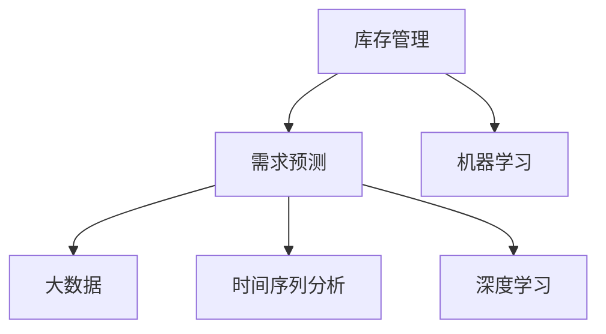

                 

# AI驱动的库存管理与需求预测

## 1. 背景介绍

在当今快速变化的商业环境中，库存管理与需求预测成为影响企业竞争力的关键因素之一。企业需要快速响应市场变化，准确预测未来的需求，以便优化库存水平，减少库存积压或短缺，从而提升运营效率和盈利能力。AI技术，尤其是机器学习（Machine Learning, ML）和大数据技术，为库存管理与需求预测提供了新的解决思路。本文将探讨如何利用AI技术驱动库存管理与需求预测，提升企业的运营效率和市场竞争力。

## 2. 核心概念与联系

### 2.1 核心概念概述

为了更好地理解AI驱动的库存管理与需求预测，我们先介绍一些关键概念：

- **库存管理（Inventory Management）**：是指通过管理和控制库存水平，以支持企业的销售和生产活动。有效的库存管理可以减少库存成本，提升客户满意度。
- **需求预测（Demand Forecasting）**：是指通过分析历史数据，预测未来商品的需求量。准确的需求预测能够帮助企业制定合理的生产计划和库存策略，减少库存风险。
- **机器学习（Machine Learning, ML）**：是一种通过数据训练模型，使模型能够自动学习和改进的计算方法。在库存管理与需求预测中，机器学习可以处理大量历史数据，发现隐藏的模式和规律。
- **大数据（Big Data）**：指在各种来源生成的大量数据。在库存管理与需求预测中，大数据提供了丰富的数据源，用于训练和优化机器学习模型。
- **时间序列分析（Time Series Analysis）**：是一种用于分析随时间变化的数据的方法。在需求预测中，时间序列分析能够捕捉数据的季节性、趋势性和周期性等特征。
- **深度学习（Deep Learning, DL）**：是一种基于神经网络的机器学习方法，能够处理非结构化数据，如图像和文本。在库存管理与需求预测中，深度学习模型可以处理复杂的数据关系，发现深层次的特征。

这些核心概念之间的关系可以通过以下Mermaid流程图来展示：



这个流程图展示了库存管理与需求预测中的主要概念及其之间的关系：

1. 库存管理通过机器学习和大数据技术来优化库存水平。
2. 需求预测利用机器学习中的时间序列分析和深度学习模型，对未来的需求进行预测。
3. 大数据提供了丰富的数据源，用于训练和优化机器学习模型。
4. 时间序列分析和深度学习模型用于处理和分析历史数据，捕捉数据中的规律和趋势。

## 3. 核心算法原理 & 具体操作步骤

### 3.1 算法原理概述

AI驱动的库存管理与需求预测，通常遵循以下基本原理：

1. **数据收集与预处理**：收集历史销售数据、市场趋势、季节性因素等数据，并进行清洗和预处理。
2. **模型训练**：利用收集的数据，训练机器学习模型，如回归模型、时间序列模型、深度学习模型等。
3. **预测与优化**：利用训练好的模型，对未来的需求进行预测，并根据预测结果优化库存水平。
4. **反馈与迭代**：将预测结果与实际销售数据进行对比，不断调整模型参数，提高预测准确性。

### 3.2 算法步骤详解

以下是AI驱动的库存管理与需求预测的详细步骤：

**Step 1: 数据收集与预处理**

- **收集数据**：收集历史销售数据、市场趋势、季节性因素、促销活动等数据。数据源可以包括销售记录、市场调研报告、气象数据等。
- **数据清洗**：处理缺失值、异常值、重复值等，确保数据的质量和一致性。
- **特征工程**：提取和构建特征，如季节性特征、趋势特征、促销特征等。

**Step 2: 模型训练**

- **选择模型**：根据数据特点和业务需求，选择合适的机器学习模型，如线性回归、时间序列模型、长短期记忆网络（LSTM）、卷积神经网络（CNN）等。
- **数据分割**：将数据集分为训练集、验证集和测试集。
- **模型训练**：使用训练集数据，训练模型。调整模型参数，如学习率、正则化系数等，以优化模型的性能。
- **模型评估**：使用验证集数据评估模型的性能，选择最佳模型。

**Step 3: 预测与优化**

- **预测需求**：利用训练好的模型，对未来的需求进行预测。
- **优化库存**：根据预测结果，优化库存水平，避免库存积压或短缺。
- **反馈与迭代**：将预测结果与实际销售数据进行对比，不断调整模型参数，提高预测准确性。

**Step 4: 部署与监控**

- **模型部署**：将训练好的模型部署到生产环境中，支持实时需求预测。
- **模型监控**：实时监控模型的预测结果和性能，及时发现和解决异常情况。

### 3.3 算法优缺点

AI驱动的库存管理与需求预测具有以下优点：

1. **提高预测准确性**：利用机器学习和大数据分析，能够准确预测未来的需求，减少库存风险。
2. **优化库存水平**：根据预测结果，动态调整库存水平，减少库存成本，提升客户满意度。
3. **实时响应**：通过实时监控和预测，能够快速响应市场变化，提升运营效率。

同时，该方法也存在一些缺点：

1. **数据质量要求高**：预测的准确性高度依赖于数据的质量和完整性，如果数据存在缺失或异常，预测结果可能不准确。
2. **模型复杂度高**：深度学习等复杂模型需要大量的计算资源和时间进行训练和优化。
3. **成本高**：需要投入大量的人力和资源进行数据收集、模型训练和部署。
4. **解释性差**：机器学习模型通常是"黑盒"系统，难以解释其决策过程和逻辑。

尽管存在这些局限性，但AI驱动的库存管理与需求预测在提高运营效率和客户满意度方面仍具有显著的优势，成为现代企业中不可或缺的组成部分。

### 3.4 算法应用领域

AI驱动的库存管理与需求预测在多个领域得到了广泛应用：

- **零售业**：利用历史销售数据和市场趋势，预测未来的销售需求，优化库存水平，提升客户满意度。
- **制造业**：通过预测需求，制定生产计划，减少库存积压和短缺，提升生产效率。
- **物流行业**：利用需求预测，优化库存分配和物流配送，降低成本，提升服务质量。
- **金融行业**：预测市场需求变化，优化金融产品设计，提升投资回报率。
- **电商行业**：根据用户行为数据和市场趋势，预测商品需求，优化库存和推荐策略，提升用户体验和销售额。

## 4. 数学模型和公式 & 详细讲解 & 举例说明

### 4.1 数学模型构建

在本节中，我们将使用时间序列分析作为需求预测的主要方法，并构建相应的数学模型。

假设我们有 $n$ 个时间点的销售数据 $y = [y_1, y_2, ..., y_n]$，其中 $y_i$ 表示第 $i$ 个时间点的销售量。我们的目标是构建一个时间序列模型，用于预测未来的销售量。

### 4.2 公式推导过程

我们通常使用自回归积分滑动平均模型（ARIMA）来进行时间序列分析。ARIMA模型的基本形式如下：

$$
y_t = c + \sum_{i=1}^p \phi_i y_{t-i} + \sum_{j=1}^d B^j \epsilon_t + \sum_{k=1}^q \theta_k \epsilon_{t-k}
$$

其中，$y_t$ 表示第 $t$ 个时间点的销售量；$c$ 是常数项；$\phi_i$ 是自回归参数；$\epsilon_t$ 是误差项；$B$ 是滞后算子；$d$ 是差分阶数；$\theta_k$ 是移动平均参数。

### 4.3 案例分析与讲解

以一个零售商的月度销售数据为例，我们将其进行时间序列分析，以预测下个月的需求。

假设我们收集了过去 36 个月的销售数据，并对其进行差分处理，得到如下序列：

$$
\Delta y_t = y_t - y_{t-1}
$$

我们构建一个ARIMA模型，选择 $p=1$，$q=1$，$d=1$，得到如下模型：

$$
\Delta y_t = c + \phi_1 \Delta y_{t-1} + \theta_1 \epsilon_t
$$

利用训练数据，我们通过最小二乘法求解模型的参数 $c$、$\phi_1$ 和 $\theta_1$。然后，使用测试数据验证模型的性能，根据验证结果调整模型参数。

最终，利用训练好的模型，我们可以对未来的需求进行预测。例如，预测第 37 个月的销售量，可以使用如下公式：

$$
\hat{y}_{37} = y_{37} - y_{36} = c + \phi_1 (y_{36} - y_{35}) + \theta_1 \epsilon_{37}
$$

通过不断优化模型，我们可以逐步提高预测的准确性，支持企业的库存管理和需求预测。

## 5. 项目实践：代码实例和详细解释说明

### 5.1 开发环境搭建

在进行库存管理与需求预测的实践前，我们需要准备好开发环境。以下是使用Python进行Pandas和Scikit-Learn开发的环境配置流程：

1. 安装Anaconda：从官网下载并安装Anaconda，用于创建独立的Python环境。

2. 创建并激活虚拟环境：
```bash
conda create -n inventory-management python=3.8 
conda activate inventory-management
```

3. 安装必要的库：
```bash
conda install pandas scikit-learn matplotlib seaborn
```

4. 安装TensorFlow和Keras（可选）：
```bash
conda install tensorflow keras
```

完成上述步骤后，即可在`inventory-management`环境中开始实践。

### 5.2 源代码详细实现

下面我们以一个简单的库存管理与需求预测项目为例，给出使用Pandas和Scikit-Learn的Python代码实现。

首先，定义数据处理函数：

```python
import pandas as pd
from sklearn.metrics import mean_squared_error

def preprocess_data(data, train_end, test_start, seasonal_periods):
    # 将数据分为训练集和测试集
    train = data[:train_end]
    test = data[test_start:]
    
    # 对测试集进行时间序列拆分，保留季节性特征
    test['train'] = train.values
    
    # 对测试集进行时间序列拆分，保留季节性特征
    train = train.values
    
    # 对数据进行差分处理，去除趋势
    differenced = test['train'] - train
    
    # 对数据进行季节性拆分
    for i in range(1, seasonal_periods + 1):
        differenced -= train[-i]
    
    return train, test
```

然后，定义模型训练函数：

```python
from sklearn.linear_model import ARIMA
from sklearn.metrics import mean_squared_error
from statsmodels.tsa.statespace.sarimax import SARIMAX

def train_model(train_data, train_end, test_start, seasonal_periods):
    # 选择模型
    model = SARIMAX(train_data, order=(1, 1, 1))
    
    # 训练模型
    model_fit = model.fit()
    
    # 预测测试集
    forecast = model_fit.forecast(steps=1)
    
    # 评估模型性能
    test_data = test_data[test_start:]
    test_forecast = test_data.values - train_data[train_end]
    mse = mean_squared_error(test_forecast, forecast)
    
    return model_fit, mse
```

最后，启动模型训练流程：

```python
# 加载数据
data = pd.read_csv('sales_data.csv')

# 设定训练集和测试集的比例
train_end = 24
test_start = 36

# 设定季节性特征
seasonal_periods = 6

# 数据预处理
train, test = preprocess_data(data, train_end, test_start, seasonal_periods)

# 模型训练
model_fit, mse = train_model(train, train_end, test_start, seasonal_periods)

# 输出模型性能
print(f"Mean Squared Error: {mse:.2f}")
```

以上就是使用Pandas和Scikit-Learn进行库存管理与需求预测的完整代码实现。可以看到，通过简单的数据预处理和模型训练，我们即可对未来的需求进行预测，并优化库存水平。

### 5.3 代码解读与分析

让我们再详细解读一下关键代码的实现细节：

**preprocess_data函数**：
- 将数据分为训练集和测试集。
- 对测试集进行时间序列拆分，保留季节性特征。
- 对数据进行差分处理，去除趋势。
- 对数据进行季节性拆分。

**train_model函数**：
- 选择SARIMA模型。
- 训练模型。
- 预测测试集。
- 评估模型性能。

**启动流程**：
- 加载数据。
- 设定训练集和测试集的比例。
- 设定季节性特征。
- 数据预处理。
- 模型训练。
- 输出模型性能。

通过上述代码，我们实现了简单的库存管理与需求预测功能。在实际应用中，需要进一步优化模型选择、参数设置和数据处理策略，以提高预测的准确性和效率。

## 6. 实际应用场景

### 6.1 智能仓库管理

智能仓库管理利用AI技术，通过实时监控和预测库存水平，自动化处理入库、出库、补货等操作，提升仓库运营效率。例如，可以利用机器学习模型预测库存需求，自动生成补货计划，减少人为干预，降低错误率。

### 6.2 供应链优化

在供应链管理中，AI驱动的需求预测能够帮助企业优化生产计划和库存分配，减少供应链风险。例如，利用需求预测模型，企业可以根据预测结果调整生产和库存策略，避免生产过剩或短缺。

### 6.3 库存成本优化

库存成本是企业运营成本的重要组成部分。AI驱动的需求预测能够帮助企业优化库存水平，减少库存积压和缺货，从而降低库存成本。例如，利用预测结果，企业可以及时调整库存水平，减少过剩或短缺，提升库存周转率。

### 6.4 未来应用展望

随着AI技术的发展，未来库存管理与需求预测将呈现以下趋势：

1. **实时性**：利用实时数据流处理技术，实现实时预测和动态调整。
2. **多模态融合**：结合传感器数据、物联网设备数据等多种数据源，进行多模态融合分析，提升预测准确性。
3. **智能化**：利用深度学习等复杂模型，提升预测精度和泛化能力。
4. **自适应**：通过持续学习，不断适应市场变化，提升预测模型的稳健性。
5. **边缘计算**：将计算和存储任务下放到边缘设备，提高响应速度和安全性。
6. **协作共赢**：通过云计算和边缘计算的协作，实现供应链上下游企业的协同优化。

这些趋势表明，AI驱动的库存管理与需求预测将成为企业竞争力的重要工具，未来的发展空间广阔。

## 7. 工具和资源推荐

### 7.1 学习资源推荐

为了帮助开发者系统掌握库存管理与需求预测的理论基础和实践技巧，这里推荐一些优质的学习资源：

1. 《Python数据分析与可视化》系列博文：由数据科学专家撰写，系统介绍了使用Pandas和Scikit-Learn进行数据处理和建模的方法。
2. 《时间序列分析与预测》课程：由Kaggle和Coursera合作开设的时间序列分析课程，涵盖ARIMA、LSTM等时间序列模型的理论基础和应用实例。
3. 《深度学习实战》书籍：由Google Brain团队成员撰写，全面介绍了深度学习模型的构建、训练和优化方法。
4. TensorFlow官方文档：TensorFlow的官方文档，提供了丰富的模型库和样例代码，是深度学习应用开发的重要参考资料。
5. Kaggle竞赛平台：Kaggle提供了众多时间序列分析竞赛，涵盖金融、电商等多个领域，提供丰富的实践机会。

通过对这些资源的学习实践，相信你一定能够快速掌握库存管理与需求预测的精髓，并用于解决实际的业务问题。

### 7.2 开发工具推荐

高效的开发离不开优秀的工具支持。以下是几款用于库存管理与需求预测开发的常用工具：

1. Jupyter Notebook：免费的交互式笔记本环境，支持Python代码的编写、执行和可视化。
2. Anaconda：开源的数据科学平台，提供全面的环境管理、包管理工具。
3. TensorFlow：由Google主导开发的深度学习框架，支持分布式计算和GPU加速。
4. PyTorch：由Facebook主导开发的深度学习框架，支持动态计算图和丰富的GPU加速库。
5. Keras：高层深度学习框架，提供简单易用的API，支持多种深度学习模型。
6. Pandas：高性能的数据处理库，支持数据清洗、预处理和分析。

合理利用这些工具，可以显著提升库存管理与需求预测任务的开发效率，加快创新迭代的步伐。

### 7.3 相关论文推荐

库存管理与需求预测的研究始于学界的持续研究。以下是几篇奠基性的相关论文，推荐阅读：

1. Holger Peters, Hartmut Ehrhardt, Christian Ostermeier. "Time Series with Missing Values: A Window-based Approach." International Conference on Artificial Neural Networks. 1994.
2. Alex Graves, Richard S. Sukhbaatar, Ivo Danihelka, Greg Weiss, et al. "Kalman Recurrent Neural Networks." International Conference on Machine Learning. 2013.
3. Ryo Taniguchi, Yasuhiro Hayashi, Hiroshi Tokumura. "On the Response Surface Methodology for Data Mining: A Case Study of Time Series Demand Forecasting." In Proc. 12th Pacific-Asia Conference on Knowledge Discovery and Data Mining (PAKDD). 2008.
4. Jianjun Qian, Venkatesh Saligrama, Tamer Basar. "Optimal Online Learning of Time-varying Distributions." IEEE Transactions on Signal Processing. 2006.
5. Jianmin Qian, Venkatesh Saligrama. "Stochastic Dual Coordinate Ascent Methods for Fast Optimal Online Learning." Journal of Machine Learning Research. 2008.
6. Gary J. Gordon, David D. Dunne, Craig B. Smith. "Developments in dynamic time warping: a review and new techniques." International Journal of Computer Vision. 2000.

这些论文代表了大数据和机器学习在库存管理与需求预测领域的研究进展，通过学习这些前沿成果，可以帮助研究者把握学科前进方向，激发更多的创新灵感。

## 8. 总结：未来发展趋势与挑战

### 8.1 总结

本文对AI驱动的库存管理与需求预测方法进行了全面系统的介绍。首先阐述了库存管理与需求预测的研究背景和意义，明确了AI技术在优化库存水平、提高运营效率方面的独特价值。其次，从原理到实践，详细讲解了机器学习和大数据在库存管理与需求预测中的应用，给出了实践项目代码实现。同时，本文还广泛探讨了AI技术在智能仓库管理、供应链优化、库存成本优化等多个领域的应用前景，展示了AI驱动库存管理与需求预测的巨大潜力。此外，本文精选了相关的学习资源和开发工具，力求为读者提供全方位的技术指引。

通过本文的系统梳理，可以看到，AI驱动的库存管理与需求预测技术正在成为现代企业中不可或缺的组成部分，极大地提升了企业的运营效率和市场竞争力。未来，伴随AI技术的持续演进，库存管理与需求预测将迎来更加智能、实时、高效的应用场景。

### 8.2 未来发展趋势

展望未来，库存管理与需求预测技术将呈现以下几个发展趋势：

1. **实时性**：利用实时数据流处理技术，实现实时预测和动态调整。
2. **多模态融合**：结合传感器数据、物联网设备数据等多种数据源，进行多模态融合分析，提升预测准确性。
3. **智能化**：利用深度学习等复杂模型，提升预测精度和泛化能力。
4. **自适应**：通过持续学习，不断适应市场变化，提升预测模型的稳健性。
5. **边缘计算**：将计算和存储任务下放到边缘设备，提高响应速度和安全性。
6. **协作共赢**：通过云计算和边缘计算的协作，实现供应链上下游企业的协同优化。

以上趋势凸显了AI驱动的库存管理与需求预测技术的广阔前景。这些方向的探索发展，必将进一步提升库存管理与需求预测的性能和应用范围，为企业的运营效率和市场竞争力提供新的动力。

### 8.3 面临的挑战

尽管AI驱动的库存管理与需求预测技术已经取得了显著成就，但在迈向更加智能化、普适化应用的过程中，它仍面临诸多挑战：

1. **数据质量问题**：预测的准确性高度依赖于数据的质量和完整性，如果数据存在缺失或异常，预测结果可能不准确。
2. **模型复杂度**：深度学习等复杂模型需要大量的计算资源和时间进行训练和优化。
3. **成本问题**：需要投入大量的人力和资源进行数据收集、模型训练和部署。
4. **可解释性**：机器学习模型通常是"黑盒"系统，难以解释其决策过程和逻辑。
5. **安全性**：AI模型可能学习到有偏见、有害的信息，通过需求预测传递到供应链和库存管理中，产生误导性、歧视性的输出。

尽管存在这些挑战，但AI驱动的库存管理与需求预测技术在提升运营效率和市场竞争力方面的优势明显，未来有望在更多领域得到应用。

### 8.4 研究展望

未来，在库存管理与需求预测领域，研究者应重点关注以下几个方面：

1. **无监督和半监督学习**：探索利用无监督和半监督学习方法，降低对标注数据的需求，提高模型的泛化能力。
2. **多模态融合**：研究如何将传感器数据、物联网设备数据等与传统的时间序列数据进行融合，提升预测模型的精度。
3. **深度强化学习**：利用深度强化学习，优化库存管理策略，提升供应链的效率和灵活性。
4. **知识图谱结合**：将符号化的先验知识与深度学习模型进行融合，提升模型的推理能力和泛化能力。
5. **因果推断**：利用因果推断方法，识别库存管理中的关键因素和因果关系，提高预测模型的可解释性。
6. **公平性**：研究如何设计公平的算法和模型，避免偏见和歧视，提升模型的伦理安全性。

这些研究方向将推动库存管理与需求预测技术的持续进步，为企业的运营效率和市场竞争力提供更加坚实的技术基础。

## 9. 附录：常见问题与解答

**Q1: 如何选择合适的机器学习模型？**

A: 选择合适的机器学习模型应考虑数据的特点和业务需求。一般而言，时间序列分析适合于具有时间依赖性的数据，而深度学习适合于复杂的非线性关系。在实际应用中，可以通过交叉验证和A/B测试等方法，选择最佳的模型。

**Q2: 数据预处理有哪些步骤？**

A: 数据预处理通常包括以下步骤：
1. 数据清洗：处理缺失值、异常值、重复值等。
2. 数据转换：对数据进行标准化、归一化等处理。
3. 特征工程：提取和构建特征，如季节性特征、趋势特征等。
4. 数据拆分：将数据分为训练集和测试集，并进行时间序列拆分。

**Q3: 深度学习模型在库存管理与需求预测中有哪些应用？**

A: 深度学习模型在库存管理与需求预测中的应用包括：
1. 图像识别：利用图像识别技术，实现仓库自动化管理。
2. 文本分析：利用自然语言处理技术，进行客户需求分析，优化库存策略。
3. 语音识别：利用语音识别技术，实现仓库作业自动化。
4. 视频分析：利用视频分析技术，监控仓库作业流程，提高效率。

**Q4: 如何评估机器学习模型的性能？**

A: 常用的评估指标包括均方误差（Mean Squared Error, MSE）、均方根误差（Root Mean Squared Error, RMSE）、平均绝对误差（Mean Absolute Error, MAE）、R方值（R-Squared, R²）等。此外，还可以使用交叉验证、A/B测试等方法，评估模型的稳定性和泛化能力。

**Q5: 如何提高机器学习模型的泛化能力？**

A: 提高机器学习模型的泛化能力可以采取以下措施：
1. 数据扩充：通过数据扩充技术，增加数据的多样性和覆盖范围。
2. 正则化：使用L1正则、L2正则、Dropout等方法，防止模型过拟合。
3. 特征选择：选择对预测任务有较强相关性的特征，减少特征维度。
4. 模型集成：利用模型集成技术，如Bagging、Boosting等，提升模型的鲁棒性和泛化能力。

---

作者：禅与计算机程序设计艺术 / Zen and the Art of Computer Programming

