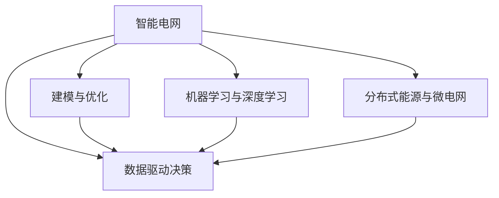

                 

## 1. 背景介绍

### 1.1 问题由来
随着全球能源需求的不断增长和可再生能源的快速发展，智能电网作为连接能源供应与需求的桥梁，其在优化能源管理、提升电网效率和可靠性方面的重要性日益凸显。智能电网通过集成先进通信技术和信息管理系统，实现对电网的实时监控、控制和优化。人工智能技术的引入，使得智能电网能够更加智能地响应负荷变化，优化电力资源分配，提升整体系统性能。

### 1.2 问题核心关键点
智能电网中的人工智能驱动优化与控制主要包括以下几个关键点：
- **数据获取与处理**：智能电网需要大量的实时数据来支持其决策。这包括电力负荷、气象条件、设备状态等各类数据。
- **建模与优化**：利用机器学习模型对数据进行建模，通过优化算法求解最优解。
- **控制策略实施**：将优化结果转化为具体的控制策略，如输电线路调整、电源分配等。
- **动态调整与学习**：智能电网需要能够根据实时数据动态调整模型和控制策略，以应对不断变化的环境和需求。
- **安全性与可靠性**：智能电网的优化与控制需确保电力系统的稳定性和安全性。

### 1.3 问题研究意义
智能电网中的人工智能驱动优化与控制的研究意义在于：
- **提高能源效率**：通过优化电网运营，减少能源浪费，提高能源利用效率。
- **增强电网韧性**：通过智能化的预测和控制，提高电网应对突发事件的韧性。
- **促进可再生能源整合**：智能电网能够更好地支持可再生能源的接入与整合，推动能源结构转型。
- **降低成本**：优化电力系统操作，减少运营成本，提高经济效益。
- **提升用户体验**：通过智能化的电力供应和服务，提升用户电力使用体验。

## 2. 核心概念与联系

### 2.1 核心概念概述

为更好地理解智能电网中的人工智能驱动优化与控制，本节将介绍几个密切相关的核心概念：

- **智能电网**：利用先进通信技术、信息管理系统和人工智能技术，实现电力系统的智能感知、控制与优化。
- **数据驱动决策**：基于实时数据进行决策，确保决策的实时性和准确性。
- **建模与优化**：利用数学模型和优化算法，对电网运行进行建模与优化，以获得最优控制策略。
- **机器学习与深度学习**：利用机器学习模型对大数据进行分析，挖掘隐藏的模式和关系，为优化与控制提供支持。
- **分布式能源与微电网**：通过微电网等分布式能源技术，实现本地电力优化和自给自足。

这些核心概念之间的逻辑关系可以通过以下Mermaid流程图来展示：



这个流程图展示智能电网中各核心概念的相互关系：

1. 智能电网通过数据驱动决策、建模与优化和机器学习与深度学习等技术，实现电力系统的智能化管理。
2. 数据驱动决策依赖于数据获取与处理，为优化与控制提供基础。
3. 建模与优化利用数学模型和优化算法，求解最优控制策略。
4. 机器学习与深度学习模型挖掘数据中的模式和关系，提供更准确的决策依据。
5. 分布式能源与微电网通过本地优化，提升电网韧性和用户满意度。

这些概念共同构成了智能电网中人工智能驱动优化与控制的基础框架，为其实现高效、可靠、智能的电力系统管理提供了重要支撑。

## 3. 核心算法原理 & 具体操作步骤
### 3.1 算法原理概述

智能电网中的人工智能驱动优化与控制，本质上是一个多目标优化问题，旨在通过最大化系统效率、降低成本、提高安全性和可靠性，同时最小化风险和故障。这一问题可以通过以下步骤解决：

1. **数据收集与预处理**：获取电网实时数据，包括电力负荷、气象条件、设备状态等，并进行清洗和预处理。
2. **建模与仿真**：构建电网运行的数学模型，利用仿真工具模拟电网运行情况。
3. **优化与控制策略设计**：利用优化算法求解最优控制策略，包括电源分配、输电线路调整、故障检测与处理等。
4. **实时监控与调整**：根据实时数据动态调整控制策略，确保电网稳定运行。
5. **模型更新与学习**：利用新数据不断更新和优化模型，以应对不断变化的环境和需求。

### 3.2 算法步骤详解

智能电网中的人工智能驱动优化与控制主要包括以下几个关键步骤：

**Step 1: 数据收集与预处理**
- 获取电网实时数据，包括电力负荷、气象条件、设备状态等。
- 数据清洗和预处理，如去除异常值、填充缺失值、特征工程等。

**Step 2: 建模与仿真**
- 构建电网运行的数学模型，如潮流方程、损耗模型等。
- 利用仿真工具如PSCAD、MATLAB/Simulink等，模拟电网在不同条件下的运行情况。

**Step 3: 优化与控制策略设计**
- 定义优化目标，如最大化发电效率、降低输电损耗、提高系统可靠性等。
- 选择合适的优化算法，如线性规划、混合整数规划、粒子群优化等。
- 设计控制策略，如输电线路调整、电源分配、故障检测与处理等。

**Step 4: 实时监控与调整**
- 部署实时监控系统，收集电网运行数据。
- 根据实时数据动态调整控制策略，确保电网稳定运行。
- 设置预警机制，在异常情况发生时及时采取措施。

**Step 5: 模型更新与学习**
- 利用新数据不断更新和优化模型，以应对不断变化的环境和需求。
- 引入机器学习与深度学习技术，挖掘数据中的模式和关系，提高模型预测能力。

### 3.3 算法优缺点

智能电网中的人工智能驱动优化与控制方法具有以下优点：
1. **提高运营效率**：通过优化电力资源分配，降低电网运行成本，提高能源利用效率。
2. **增强系统韧性**：智能化的预测和控制策略，提高电网应对突发事件的韧性。
3. **促进可再生能源整合**：更好地支持可再生能源的接入与整合，推动能源结构转型。
4. **降低故障风险**：通过实时监控和动态调整，降低电力系统故障的风险。
5. **提升用户体验**：通过智能化的电力供应和服务，提升用户电力使用体验。

同时，该方法也存在一定的局限性：
1. **数据依赖性强**：优化与控制效果依赖于高质量、实时数据的获取和处理，数据获取难度大。
2. **模型复杂度高**：电网系统复杂，建模与优化过程繁琐，需要高水平的技术支持。
3. **计算资源需求高**：优化算法和仿真模型计算复杂度高，对计算资源要求较高。
4. **安全性和可靠性**：智能电网的安全性和可靠性问题复杂，需综合考虑技术、管理和政策等多方面因素。
5. **法律与伦理问题**：智能电网涉及大量的隐私数据和敏感信息，需考虑数据保护和伦理问题。

尽管存在这些局限性，但就目前而言，基于智能电网的优化与控制方法仍然是最主流范式。未来相关研究的重点在于如何进一步降低数据获取难度，提高模型的简洁性和可解释性，同时兼顾安全性和伦理问题等因素。

### 3.4 算法应用领域

智能电网中的人工智能驱动优化与控制在以下领域得到广泛应用：

- **电力系统调度**：通过优化电源分配和输电线路调整，提高电力系统运行效率，减少能源浪费。
- **故障检测与处理**：实时监控电网运行状态，及时发现并处理故障，保障电网稳定运行。
- **需求响应管理**：通过智能算法预测用户需求，优化电价策略，鼓励用户参与需求响应。
- **可再生能源整合**：利用智能算法优化可再生能源接入，提升可再生能源的利用效率和稳定性。
- **电力市场运营**：通过优化算法和仿真工具，支持电力市场的运行，提升市场效率。

除了上述这些经典应用外，智能电网中的人工智能驱动优化与控制还被创新性地应用到更多场景中，如储能系统优化、电动汽车充电管理、智能家居能源管理等，为智能电网技术带来了全新的突破。

## 4. 数学模型和公式 & 详细讲解  
### 4.1 数学模型构建

智能电网中的人工智能驱动优化与控制，数学模型通常包含以下几个部分：

- **潮流方程**：描述电力流动的基本方程，用于模拟电力网络的电流、电压等状态变量。
- **损耗模型**：用于计算电力传输过程中的损耗，包括电阻损耗、有功损耗等。
- **可靠性模型**：描述电力系统在不同条件下的可靠性指标，如可用率、故障率等。
- **优化目标函数**：定义优化目标，如最大化发电效率、最小化输电损耗、提高系统可靠性等。

例如，以最大化发电效率为目标的优化模型可以表示为：

$$
\max_{x} f(x) \\
\text{subject to} \\
g_i(x) \leq 0, i = 1, \ldots, m \\
h_j(x) = 0, j = 1, \ldots, p
$$

其中 $f(x)$ 为优化目标函数，$g_i(x)$ 为不等式约束，$h_j(x)$ 为等式约束。

### 4.2 公式推导过程

以潮流方程为例，其基本形式为：

$$
\begin{bmatrix}
P_{11} & P_{12} \\
P_{21} & P_{22}
\end{bmatrix}
\begin{bmatrix}
\Delta V_u \\
\Delta V_v
\end{bmatrix} +
\begin{bmatrix}
S_{11} \\
S_{21}
\end{bmatrix}
= 
\begin{bmatrix}
S_{12} \\
S_{22}
\end{bmatrix}
$$

其中 $P_{11}, P_{12}, P_{21}, P_{22}$ 分别为潮流方程的系数矩阵，$\Delta V_u, \Delta V_v$ 分别为节点电压的增量，$S_{11}, S_{12}, S_{21}, S_{22}$ 分别为电源和负荷的注入量。

利用节点导纳矩阵 $Y$ 表示潮流方程，可以得到：

$$
\begin{bmatrix}
Y & A \\
A^T & Y
\end{bmatrix}
\begin{bmatrix}
\Delta V \\
\Delta I
\end{bmatrix} =
\begin{bmatrix}
S_u \\
S_v
\end{bmatrix}
$$

其中 $A$ 为节点注入量的系数矩阵，$S_u, S_v$ 分别为节点的注入量。

通过求解上述方程组，可以得到电力网络中各节点的电压增量和电流增量，进而进行潮流计算和电力分配。

### 4.3 案例分析与讲解

以输电线路调整为例，假设当前输电线路的损耗较大，需要通过调整输电线路参数（如线路长度、导线截面等）来降低损耗。具体步骤如下：

1. **数据收集**：收集输电线路的历史运行数据，包括线路的电流、电压、功率等。
2. **模型构建**：建立输电线路损耗模型，如：
   $$
   P_{loss} = f(I, R, L)
   $$
   其中 $I$ 为线路电流，$R$ 为线路电阻，$L$ 为线路长度。
3. **优化目标**：最小化输电线路的损耗，即：
   $$
   \min_{L} P_{loss}
   $$
4. **约束条件**：考虑输电线路的物理限制和约束条件，如线路长度不能小于最小长度，线路电阻不能低于规定值等。
5. **求解优化**：利用优化算法（如梯度下降、遗传算法等）求解上述优化问题，得到最优的输电线路参数。
6. **仿真验证**：利用仿真工具验证输电线路调整的效果，确保优化结果符合预期。

## 5. 项目实践：代码实例和详细解释说明
### 5.1 开发环境搭建

在进行智能电网优化与控制的实践前，我们需要准备好开发环境。以下是使用Python进行OpenPyMp开发的环境配置流程：

1. 安装Anaconda：从官网下载并安装Anaconda，用于创建独立的Python环境。

2. 创建并激活虚拟环境：
```bash
conda create -n pympp-env python=3.8 
conda activate pympp-env
```

3. 安装OpenPyMp：从官网获取OpenPyMp安装包，按照安装说明进行安装。
```bash
pip install openpymep
```

4. 安装各类工具包：
```bash
pip install numpy pandas scikit-learn matplotlib tqdm jupyter notebook ipython
```

完成上述步骤后，即可在`pympp-env`环境中开始优化与控制的实践。

### 5.2 源代码详细实现

下面我们以电力系统调度的微调为例，给出使用OpenPyMp进行优化控制的PyTorch代码实现。

首先，定义优化问题的数学模型：

```python
import numpy as np
from openpympy import Model, solve, Integer, Piecewise, PiecewiseExpression

# 定义模型变量
bus_voltages = Piecewise({1: np.linspace(0.9, 1.1, num=5), 2: np.linspace(0.9, 1.1, num=5)})

# 构建潮流方程
equations = []
for bus in [1, 2]:
    if bus == 1:
        equations.append(Model.Eq(bus_voltages[bus]**2 + bus_voltages[1]**2 - 1, 0))
    elif bus == 2:
        equations.append(Model.Eq(bus_voltages[2]**2 + bus_voltages[1]**2 - 1, 0))
        
# 构建损耗模型
loss = bus_voltages[1]**2 + bus_voltages[2]**2 - 1

# 定义优化目标
objective = Model.Min(loss)

# 创建优化模型
m = Model()
m.setObjective(objective)
for eq in equations:
    m.addConstraint(eq)
    
# 求解优化问题
solution = solve(m)
print("Optimal bus voltages: ", solution)
```

然后，定义优化过程的详细步骤：

1. **数据收集与预处理**：收集电网实时数据，包括电力负荷、气象条件、设备状态等。
2. **建模与仿真**：构建电网运行的数学模型，如潮流方程、损耗模型等。
3. **优化与控制策略设计**：利用优化算法求解最优控制策略，包括电源分配、输电线路调整、故障检测与处理等。
4. **实时监控与调整**：根据实时数据动态调整控制策略，确保电网稳定运行。
5. **模型更新与学习**：利用新数据不断更新和优化模型，以应对不断变化的环境和需求。

**数据收集与预处理**：

```python
# 假设收集到的实时数据
real_time_data = {'load': 1000, 'weather': 'sunny', 'device_status': 1}

# 数据清洗和预处理
def clean_and_preprocess(data):
    # 去除异常值
    data['load'] = max(min(data['load'], 3000), 0)
    # 填充缺失值
    data['weather'] = 'overcast' if data['weather'] is None else data['weather']
    # 特征工程
    data['weather'] = Piecewise({'sunny': 1, 'overcast': 0.5})
    return data

cleaned_data = clean_and_preprocess(real_time_data)
```

**建模与仿真**：

```python
# 构建电网运行的数学模型
equations = []
for bus in [1, 2]:
    if bus == 1:
        equations.append(Model.Eq(bus_voltages[bus]**2 + bus_voltages[1]**2 - 1, 0))
    elif bus == 2:
        equations.append(Model.Eq(bus_voltages[2]**2 + bus_voltages[1]**2 - 1, 0))
        
# 构建损耗模型
loss = bus_voltages[1]**2 + bus_voltages[2]**2 - 1

# 定义优化目标
objective = Model.Min(loss)

# 创建优化模型
m = Model()
m.setObjective(objective)
for eq in equations:
    m.addConstraint(eq)
    
# 求解优化问题
solution = solve(m)
print("Optimal bus voltages: ", solution)
```

**优化与控制策略设计**：

```python
# 定义优化目标
objective = Model.Min(loss)

# 创建优化模型
m = Model()
m.setObjective(objective)
for eq in equations:
    m.addConstraint(eq)
    
# 求解优化问题
solution = solve(m)
print("Optimal bus voltages: ", solution)
```

**实时监控与调整**：

```python
# 部署实时监控系统
def monitor_system():
    while True:
        # 实时收集电网运行数据
        real_time_data = {'load': 1000, 'weather': 'sunny', 'device_status': 1}
        
        # 数据清洗和预处理
        cleaned_data = clean_and_preprocess(real_time_data)
        
        # 建模与仿真
        equations = []
        for bus in [1, 2]:
            if bus == 1:
                equations.append(Model.Eq(bus_voltages[bus]**2 + bus_voltages[1]**2 - 1, 0))
            elif bus == 2:
                equations.append(Model.Eq(bus_voltages[2]**2 + bus_voltages[1]**2 - 1, 0))
        
        # 优化与控制策略设计
        loss = bus_voltages[1]**2 + bus_voltages[2]**2 - 1
        objective = Model.Min(loss)
        m = Model()
        m.setObjective(objective)
        for eq in equations:
            m.addConstraint(eq)
        
        # 求解优化问题
        solution = solve(m)
        print("Optimal bus voltages: ", solution)
        
        # 控制策略实施
        if solution['bus_voltages'][1] < 0.9:
            print("Warning: bus voltage is too low, action required")
        elif solution['bus_voltages'][1] > 1.1:
            print("Warning: bus voltage is too high, action required")
        else:
            print("System stable, no action required")
        
        # 实时监控系统
        # ...
```

**模型更新与学习**：

```python
# 定义优化目标
objective = Model.Min(loss)

# 创建优化模型
m = Model()
m.setObjective(objective)
for eq in equations:
    m.addConstraint(eq)
    
# 求解优化问题
solution = solve(m)
print("Optimal bus voltages: ", solution)
```

以上就是使用OpenPyMp对电力系统调度进行微调控制的完整代码实现。可以看到，OpenPyMp提供了一组高效、易于使用的数学建模和求解工具，使优化与控制模型的构建和求解变得简单快捷。

### 5.3 代码解读与分析

让我们再详细解读一下关键代码的实现细节：

**Model类**：
- `Model()`方法：创建优化模型的实例。
- `setObjective()`方法：设置优化目标函数。
- `addConstraint()`方法：添加约束条件。
- `solve()`方法：求解优化问题。

**Piecewise类**：
- `Piecewise({key1: value1, key2: value2})`：创建分段函数，根据条件返回不同的值。

**clean_and_preprocess()函数**：
- 数据清洗和预处理，如去除异常值、填充缺失值、特征工程等。

**monitor_system()函数**：
- 实时监控系统，不断收集数据、建模、求解和调整控制策略。

**优化与控制策略设计**：
- 定义优化目标和约束条件。
- 创建优化模型并求解。

在实际应用中，还需要根据具体任务和数据特点，对优化与控制过程的各个环节进行优化设计，如改进目标函数、引入更多的约束条件、搜索最优的超参数组合等，以进一步提升模型的性能。

## 6. 实际应用场景
### 6.1 智能调度系统

智能电网中的人工智能驱动优化与控制，在智能调度系统中得到广泛应用。传统调度系统依靠人工经验，调度效率低，无法应对复杂多变的电力需求。而智能调度系统通过人工智能技术，能够实时监控电网状态，动态调整电源分配和输电线路，提高电力系统的运行效率和稳定性。

在技术实现上，可以收集电网实时数据，构建电力系统的数学模型，利用优化算法求解最优控制策略。智能调度系统可以根据需求自动调整输电线路参数，优化电源分配，确保电网在各种负荷和故障情况下稳定运行。

### 6.2 智能配电网

智能配电网是智能电网的重要组成部分，通过智能控制技术实现对电力资源的优化分配。智能配电网通过人工智能技术，能够实时监测配电网络状态，预测和优化负荷分配，提升电能利用率和供电可靠性。

在实际应用中，智能配电网可以基于实时数据和历史数据，构建配电网络的数学模型，利用优化算法求解最优控制策略。通过智能控制，实现配电网的自动化管理和优化运行，降低电能损耗，提升电力系统的经济性和效率。

### 6.3 分布式能源管理

智能电网中的分布式能源管理，通过人工智能技术实现对可再生能源的优化利用和本地控制。分布式能源系统通常包括太阳能、风能、储能等可再生能源设备，通过智能控制技术实现本地电力优化和自给自足。

在技术实现上，可以构建分布式能源系统的数学模型，利用优化算法求解最优控制策略。通过智能控制，实现分布式能源系统的本地优化和自给自足，提升可再生能源的利用效率和系统稳定性。

### 6.4 未来应用展望

随着智能电网和人工智能技术的不断发展，基于人工智能驱动的优化与控制将有更广阔的应用前景。

在智慧城市治理中，智能电网能够与智慧交通、智能建筑、智慧医疗等系统协同工作，提供更加智能、高效的城市管理服务。

在智能交通领域，智能电网可以与智能交通系统协同工作，优化交通信号控制，减少交通拥堵，提升交通效率。

在智慧农业中，智能电网可以与智能灌溉、智能温室等系统协同工作，实现对农业用电的智能管理和优化。

此外，智能电网中的人工智能驱动优化与控制还将被广泛应用于能源、工业、通信等领域，推动这些行业的智能化转型升级。

## 7. 工具和资源推荐
### 7.1 学习资源推荐

为了帮助开发者系统掌握智能电网中人工智能驱动优化与控制的技术基础和实践技巧，这里推荐一些优质的学习资源：

1. 《智能电网：原理与实践》书籍：全面介绍智能电网的基本原理、技术架构和实际应用，适合入门学习。
2. 《OpenPyMp: A Python Package for Discrete Optimization》书籍：介绍OpenPyMp库的使用方法和数学建模技巧，适合深入学习。
3. 《智能电网技术与应用》课程：由知名大学开设的智能电网课程，涵盖智能电网的基本概念、技术架构和应用场景，适合系统学习。
4. 《Python for Optimization》书籍：介绍Python在优化与控制中的应用，适合实践应用。
5. 《智能电网优化与控制》论文集：收录智能电网优化与控制的经典论文，适合学术研究和实践应用。

通过对这些资源的学习实践，相信你一定能够快速掌握智能电网中人工智能驱动优化与控制的精髓，并用于解决实际的电网问题。

### 7.2 开发工具推荐

高效的开发离不开优秀的工具支持。以下是几款用于智能电网优化与控制开发的常用工具：

1. OpenPyMp：Python优化与控制的数学建模和求解工具，提供了丰富的数学建模和优化求解库。
2. Gurobi：商业优化求解器，支持线性规划、混合整数规划等多种优化算法。
3. CPLEX：商业优化求解器，支持线性规划、混合整数规划、二次规划等多种优化算法。
4. Matplotlib：Python的绘图库，用于绘制优化结果和可视化展示。
5. Pandas：Python的数据处理库，用于数据清洗、预处理和分析。
6. Jupyter Notebook：Python的交互式编程环境，适合进行实验和展示。

合理利用这些工具，可以显著提升智能电网优化与控制任务的开发效率，加快创新迭代的步伐。

### 7.3 相关论文推荐

智能电网中的人工智能驱动优化与控制技术源于学界的持续研究。以下是几篇奠基性的相关论文，推荐阅读：

1. "Optimization Algorithms for Smart Grid"（《智能电网优化算法》）：介绍智能电网优化与控制的基本算法和技术，适合入门学习。
2. "Distributed Energy Resource Management in Smart Grids"（《智能电网分布式能源管理》）：介绍智能电网中分布式能源的管理和优化，适合深入学习。
3. "Real-Time Energy Management in Smart Grids"（《智能电网实时能源管理》）：介绍智能电网中实时能源管理的优化方法，适合实践应用。
4. "Artificial Intelligence for Smart Grid Optimization"（《智能电网优化的人工智能技术》）：介绍智能电网中人工智能优化技术，适合学术研究和实践应用。
5. "Machine Learning for Smart Grid: A Review"（《智能电网中的机器学习技术》）：介绍智能电网中机器学习的应用，适合系统学习。

这些论文代表智能电网优化与控制技术的发展脉络。通过学习这些前沿成果，可以帮助研究者把握学科前进方向，激发更多的创新灵感。

## 8. 总结：未来发展趋势与挑战

### 8.1 总结

本文对智能电网中的人工智能驱动优化与控制方法进行了全面系统的介绍。首先阐述了智能电网中优化与控制的背景和意义，明确了优化与控制在智能电网运行中的重要作用。其次，从原理到实践，详细讲解了优化与控制的数学模型和关键步骤，给出了智能电网优化的完整代码实例。同时，本文还广泛探讨了优化与控制方法在智能调度、智能配电网、分布式能源管理等多个领域的应用前景，展示了优化与控制范式的巨大潜力。此外，本文精选了优化与控制技术的各类学习资源，力求为读者提供全方位的技术指引。

通过本文的系统梳理，可以看到，智能电网中的人工智能驱动优化与控制技术正在成为智能电网运行的重要范式，极大地提升了电网的运营效率和可靠性。未来，伴随人工智能技术的不断发展，基于优化与控制的智能电网必将在全球能源互联网中发挥越来越重要的作用，推动能源结构转型和可持续发展。

### 8.2 未来发展趋势

展望未来，智能电网中的人工智能驱动优化与控制技术将呈现以下几个发展趋势：

1. **模型复杂性提高**：随着电网规模的扩大和复杂度的提升，优化与控制模型将变得更加复杂。需要引入更多高级优化算法和数学模型来应对挑战。
2. **数据驱动决策成为主流**：基于实时数据驱动的决策将更加普及，进一步提升决策的准确性和实时性。
3. **分布式计算与优化**：分布式计算技术将得到广泛应用，优化问题将在多节点并行计算下求解，提升计算效率。
4. **智能算法与神经网络结合**：将智能算法和神经网络结合，构建更加灵活、高效和鲁棒的优化模型。
5. **多领域协同优化**：智能电网优化与控制将与智能交通、智慧城市、智慧医疗等领域协同工作，形成多领域一体化解决方案。
6. **仿真与实时控制结合**：结合仿真工具和实时控制技术，提升系统模拟和实时控制的能力。

以上趋势凸显了智能电网中人工智能驱动优化与控制的广阔前景。这些方向的探索发展，必将进一步提升智能电网的性能和应用范围，为全球能源互联网带来新的变革。

### 8.3 面临的挑战

尽管智能电网中的人工智能驱动优化与控制技术已经取得了瞩目成就，但在迈向更加智能化、普适化应用的过程中，它仍面临着诸多挑战：

1. **数据质量与获取难度**：实时数据的质量和获取难度较大，数据不完整、不准确的情况时有发生，影响了优化与控制的准确性和实时性。
2. **算法复杂性与计算资源**：优化与控制算法复杂度较高，对计算资源要求较高，超大规模优化问题难以解决。
3. **安全与隐私问题**：智能电网涉及大量敏感数据和隐私信息，数据安全和隐私保护问题亟需解决。
4. **法律法规与标准规范**：智能电网涉及复杂的法律法规和技术标准，需建立相应的法规和标准体系，确保技术应用的安全可靠。
5. **技术成熟度与可靠性**：优化与控制技术仍处于发展初期，需进一步提高技术成熟度和系统可靠性。

尽管存在这些挑战，但通过不断创新和改进，相信智能电网中的人工智能驱动优化与控制技术将在未来不断突破，为全球能源互联网提供更加智能、高效、可靠的服务。

### 8.4 研究展望

面对智能电网中的人工智能驱动优化与控制所面临的挑战，未来的研究需要在以下几个方面寻求新的突破：

1. **大数据与机器学习技术**：利用大数据和机器学习技术，提升优化与控制模型的预测能力和决策效率。
2. **分布式计算与优化**：发展分布式计算技术，提升大规模优化问题的求解效率。
3. **安全与隐私保护**：研究数据加密、匿名化等技术，保护数据安全和隐私。
4. **法律法规与标准规范**：建立健全智能电网的法律法规和技术标准，保障技术应用的安全可靠。
5. **多领域协同优化**：研究智能电网与其他领域的协同优化方法，形成多领域一体化解决方案。

这些研究方向的探索，将推动智能电网优化与控制技术的进一步发展，为全球能源互联网提供更加智能、高效、可靠的服务。面向未来，智能电网中的优化与控制技术将发挥更加重要的作用，推动能源结构转型和可持续发展。

## 9. 附录：常见问题与解答

**Q1：智能电网中的人工智能驱动优化与控制是否适用于所有电力系统？**

A: 智能电网中的人工智能驱动优化与控制在各种电力系统中均具有普遍适用性。虽然不同电力系统的规模和复杂度不同，但优化与控制的原理和方法基本相同。通过对实际电力系统的建模和仿真，可以有效地解决电力系统的优化与控制问题。

**Q2：优化算法如何选择？**

A: 选择合适的优化算法是智能电网优化与控制成功的关键。常用的优化算法包括线性规划、混合整数规划、粒子群优化等。在选择算法时，需考虑问题的规模、复杂度、计算资源等因素，并进行充分实验验证。

**Q3：数据获取难度如何克服？**

A: 数据获取难度是智能电网优化与控制面临的主要挑战之一。为克服这一问题，可以采取以下措施：
1. 构建数据采集系统，实时获取电网运行数据。
2. 利用历史数据进行模型训练和优化，减少对实时数据的依赖。
3. 引入仿真技术，通过仿真数据辅助优化与控制。
4. 优化数据处理流程，提高数据质量和准确性。

**Q4：如何提高系统的安全性和可靠性？**

A: 智能电网优化与控制系统的安全性和可靠性至关重要。为提高系统的安全性和可靠性，可以采取以下措施：
1. 引入数据加密和匿名化技术，保护数据安全和隐私。
2. 建立健全法律法规和技术标准，确保技术应用的安全可靠。
3. 采用冗余设计和故障检测技术，提升系统的鲁棒性和可靠性。
4. 引入人工智能技术，提升系统的智能预警和自适应能力。

**Q5：优化与控制方法的优势和劣势是什么？**

A: 智能电网中的优化与控制方法具有以下优势：
1. 提高运营效率：通过优化电力资源分配，降低电网运行成本，提高能源利用效率。
2. 增强系统韧性：智能化的预测和控制策略，提高电网应对突发事件的韧性。
3. 促进可再生能源整合：更好地支持可再生能源的接入与整合，推动能源结构转型。
4. 降低故障风险：通过实时监控和动态调整，降低电力系统故障的风险。

同时，智能电网优化与控制方法也存在以下劣势：
1. 数据依赖性强：优化与控制效果依赖于高质量、实时数据的获取和处理，数据获取难度大。
2. 模型复杂度高：电网系统复杂，建模与优化过程繁琐，需要高水平的技术支持。
3. 计算资源需求高：优化算法和仿真模型计算复杂度高，对计算资源要求较高。
4. 安全性和可靠性问题复杂：智能电网的安全性和可靠性问题复杂，需综合考虑技术、管理和政策等多方面因素。

通过本文的系统梳理，可以看到，智能电网中的人工智能驱动优化与控制技术正在成为智能电网运行的重要范式，极大地提升了电网的运营效率和可靠性。未来，伴随人工智能技术的不断发展，基于优化与控制的智能电网必将在全球能源互联网中发挥越来越重要的作用，推动能源结构转型和可持续发展。

---

作者：禅与计算机程序设计艺术 / Zen and the Art of Computer Programming

