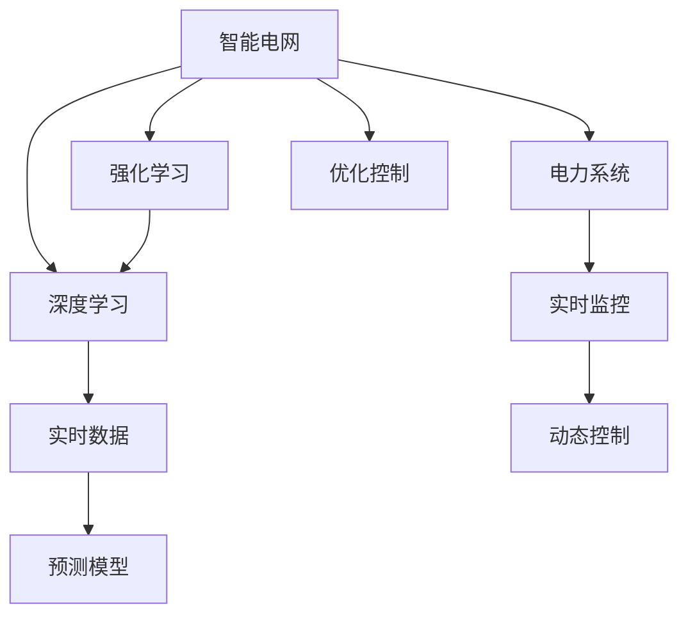

                 

# AI驱动的智能电网：优化与控制

> 关键词：智能电网,AI,优化控制,电力系统,深度学习,强化学习,物联网,大数据

## 1. 背景介绍

### 1.1 问题由来
智能电网（Smart Grid）是现代电力系统发展的关键方向之一，通过融入信息通信技术、传感测量技术、人工智能（AI）等前沿技术，实现电网的智能化和高效化。然而，随着可再生能源比例的不断增加，电力供需的不确定性和复杂性也在同步提升。在这样的大背景下，如何通过AI技术对智能电网进行优化与控制，成为了一个亟待解决的重要问题。

### 1.2 问题核心关键点
智能电网优化与控制的核心在于通过实时数据分析和预测，动态调整电网运行状态，保障电力供应的稳定性和可靠性，同时提升电能利用效率和经济效益。AI技术通过深度学习（Deep Learning, DL）、强化学习（Reinforcement Learning, RL）等手段，可以在海量的电力数据中挖掘模式，并据此制定合理的电网运行策略，实现智能调度、故障预测与应对、需求响应等功能。

## 2. 核心概念与联系

### 2.1 核心概念概述

为更好地理解AI驱动的智能电网优化与控制方法，本节将介绍几个密切相关的核心概念：

- 智能电网（Smart Grid）：通过信息通信、智能传感、先进控制等技术，实现电力系统的全生命周期管理，提升电网运行效率和客户满意度。
- 深度学习（Deep Learning）：一种基于多层神经网络的机器学习技术，通过模型自动提取数据特征，实现复杂的模式识别和预测任务。
- 强化学习（Reinforcement Learning）：通过智能体（Agent）与环境的交互，不断调整策略，以最大化期望回报的优化问题。
- 电力系统（Power System）：由电力网络、发电设备、负荷等构成的综合系统，负责电力生产和传输。
- 优化控制（Optimization Control）：利用数学优化和控制理论，对电力系统的运行进行动态调整，以实现最优的运行状态。

这些核心概念之间的逻辑关系可以通过以下Mermaid流程图来展示：



这个流程图展示了这个系统的核心概念及其之间的关系：

1. 智能电网通过深度学习和强化学习技术，从实时数据中提取特征，进行预测和优化。
2. 深度学习用于数据分析和模式识别，预测电力负荷、状态参数等。
3. 强化学习用于制定电网运行策略，动态调整控制参数。
4. 电力系统是电网运行的基础设施。
5. 优化控制通过数学模型对电网进行优化，以实现最优的运行状态。

这些概念共同构成了AI驱动的智能电网优化与控制的基础框架，使得电网能够实现高度智能化和高效化的运行。

## 3. 核心算法原理 & 具体操作步骤
### 3.1 算法原理概述

AI驱动的智能电网优化与控制，本质上是通过深度学习和强化学习技术，对电力系统进行实时数据分析、预测和策略优化。其核心思想是：利用历史电力数据和实时数据，训练深度学习模型进行负荷预测、状态监测等任务，并利用强化学习技术制定电网运行策略，动态调整控制参数。

形式化地，假设智能电网的优化目标为 $J$，包括但不限于：

- 系统稳定：通过调整电网状态，确保电力供应的稳定性和可靠性。
- 经济高效：通过优化资源分配，提升电能利用效率和经济效益。
- 环境友好：通过鼓励可再生能源使用，降低碳排放。

则优化问题可以表示为：

$$
\mathop{\min}_{\theta} J(\theta) = \mathcal{L}_f(\theta) + \mathcal{L}_g(\theta)
$$

其中 $\mathcal{L}_f(\theta)$ 为系统稳定性损失函数，$\mathcal{L}_g(\theta)$ 为经济性损失函数。$J$ 为系统的综合优化目标函数。

通过梯度下降等优化算法，优化过程不断更新模型参数 $\theta$，最小化目标函数 $J(\theta)$，实现智能电网的动态优化。

### 3.2 算法步骤详解

AI驱动的智能电网优化与控制一般包括以下几个关键步骤：

**Step 1: 数据采集与预处理**
- 收集智能电网的实时数据，包括电压、电流、负荷等，并对其进行处理，得到适合模型训练的数据集。

**Step 2: 模型训练与验证**
- 利用深度学习模型对历史电力数据进行训练，构建负荷预测、状态监测等模型。
- 在验证集上评估模型的性能，调整模型超参数，确保模型具有较高的准确性和泛化能力。

**Step 3: 策略优化与控制**
- 利用强化学习技术，根据模型的预测结果和电网状态，制定最优的电网运行策略。
- 通过动态控制算法，实时调整电网参数，实现对电力系统的优化与控制。

**Step 4: 模型部署与评估**
- 将训练好的模型部署到生产环境，实时接收电力数据，进行预测和控制。
- 定期在测试集上评估模型的性能，对比前后变化，确保持续优化。

### 3.3 算法优缺点

AI驱动的智能电网优化与控制方法具有以下优点：
1. 高效处理复杂数据。深度学习技术可以高效处理高维、非线性的电力数据，从中提取有用的特征，提升预测精度。
2. 实时优化动态响应。强化学习技术能够根据实时数据动态调整电网运行策略，提升系统响应速度。
3. 提高资源利用率。通过优化控制，可以高效利用电网资源，降低电能损耗，提升经济效益。
4. 增强系统稳定性。通过动态调整电网状态，可以提升系统对扰动的鲁棒性，保障电力供应的可靠性。

同时，该方法也存在一定的局限性：
1. 对数据质量要求高。深度学习模型的性能很大程度上依赖于数据的质量，需要保证数据的时效性和准确性。
2. 模型训练资源需求大。深度学习和强化学习模型的训练往往需要大量计算资源，成本较高。
3. 算法复杂度较高。模型训练和优化过程复杂，需要丰富的工程经验和专业知识。
4. 模型解释性不足。AI模型的决策过程往往难以解释，难以通过直观方式理解电网运行状态。

尽管存在这些局限性，但就目前而言，AI驱动的智能电网优化与控制方法仍是最前沿的电网管理手段。未来相关研究的重点在于如何进一步降低计算成本，提高模型解释性，优化算法性能，以实现更高效的电网运行。

### 3.4 算法应用领域

AI驱动的智能电网优化与控制方法已经在多个实际应用场景中取得了成功，例如：

- 负荷预测与调度：通过深度学习模型预测电力负荷，实时调整电网调度策略，保障电力供应的稳定性。
- 故障检测与定位：利用深度学习技术分析电网状态数据，实现实时故障检测与定位，缩短停电时间。
- 需求响应与优化：通过强化学习技术优化电能分配，鼓励用户参与需求响应，提升电能利用效率。
- 可再生能源整合：利用深度学习技术进行太阳能、风能等可再生能源的预测和调度，提高电网对可再生能源的接纳能力。
- 智能抄表与电价优化：通过实时数据分析，实现智能抄表，并根据负荷曲线优化电价策略，提升用户满意度和经济效益。

除了上述这些经典应用外，AI驱动的智能电网优化与控制还广泛应用于电网管理、电力交易、智能家居等多个领域，为电网的智能化管理提供了全新的技术手段。

## 4. 数学模型和公式 & 详细讲解  
### 4.1 数学模型构建

本节将使用数学语言对AI驱动的智能电网优化与控制过程进行更加严格的刻画。

记智能电网的历史数据集为 $D=\{(x_i,y_i)\}_{i=1}^N$，其中 $x_i$ 为电网状态数据，$y_i$ 为电网目标变量，如负荷、电价等。假设优化目标函数为 $J(\theta)$，其中 $\theta$ 为模型参数。

定义电网运行状态 $x$ 为连续空间，目标变量 $y$ 为离散空间，则优化问题可以表示为：

$$
\mathop{\min}_{\theta} J(\theta) = \mathcal{L}_f(\theta) + \mathcal{L}_g(\theta)
$$

其中 $\mathcal{L}_f(\theta)$ 为系统稳定性损失函数，$\mathcal{L}_g(\theta)$ 为经济性损失函数。

在实践中，我们通常使用基于梯度的优化算法（如SGD、Adam等）来近似求解上述最优化问题。设 $\eta$ 为学习率，则参数的更新公式为：

$$
\theta \leftarrow \theta - \eta \nabla_{\theta}J(\theta)
$$

其中 $\nabla_{\theta}J(\theta)$ 为损失函数对参数 $\theta$ 的梯度，可通过反向传播算法高效计算。

### 4.2 公式推导过程

以下我们以负荷预测和调度为例，推导深度学习模型的训练与优化过程。

假设历史电网负荷数据为 $D=\{(x_i,y_i)\}_{i=1}^N$，其中 $x_i$ 为电网状态数据（如温度、湿度、电力需求等），$y_i$ 为历史负荷。定义深度学习模型 $M_{\theta}(x)$ 的输出为预测负荷 $y'_i = M_{\theta}(x_i)$。则最小二乘损失函数为：

$$
\mathcal{L}_f(\theta) = \frac{1}{N}\sum_{i=1}^N (y_i - y'_i)^2
$$

通过梯度下降算法，模型参数的更新公式为：

$$
\theta \leftarrow \theta - \eta \nabla_{\theta}\mathcal{L}_f(\theta)
$$

其中 $\nabla_{\theta}\mathcal{L}_f(\theta)$ 为损失函数对参数 $\theta$ 的梯度。

假设强化学习模型 $Q_{\theta}(x_i,y_i)$ 表示在电网状态 $x_i$ 下，执行策略 $y_i$ 的回报值。则强化学习的目标是最大化总回报值：

$$
\mathcal{L}_g(\theta) = \mathbb{E}_{x,y} [Q_{\theta}(x,y)]
$$

在实践中，我们通常使用基于蒙特卡洛（Monte Carlo）或Q-learning的强化学习算法，对电网运行策略进行优化。

通过上述推导，我们可以发现，深度学习和强化学习技术在智能电网的优化与控制中具有重要的应用价值，可以通过对历史数据的分析和学习，实现对电网状态的准确预测和动态控制。

## 5. 项目实践：代码实例和详细解释说明
### 5.1 开发环境搭建

在进行智能电网优化与控制实践前，我们需要准备好开发环境。以下是使用Python进行TensorFlow和PyTorch开发的环境配置流程：

1. 安装Anaconda：从官网下载并安装Anaconda，用于创建独立的Python环境。

2. 创建并激活虚拟环境：
```bash
conda create -n tensorflow-env python=3.8 
conda activate tensorflow-env
```

3. 安装TensorFlow：根据CUDA版本，从官网获取对应的安装命令。例如：
```bash
conda install tensorflow -c tf -c conda-forge
```

4. 安装PyTorch：根据CUDA版本，从官网获取对应的安装命令。例如：
```bash
conda install pytorch torchvision torchaudio cudatoolkit=11.1 -c pytorch -c conda-forge
```

5. 安装各类工具包：
```bash
pip install numpy pandas scikit-learn matplotlib tqdm jupyter notebook ipython
```

完成上述步骤后，即可在`tensorflow-env`或`pytorch-env`环境中开始智能电网优化与控制的实践。

### 5.2 源代码详细实现

这里我们以深度学习和强化学习相结合的智能电网负荷预测与调度为例，给出使用TensorFlow和PyTorch的代码实现。

**深度学习模型**：

```python
import tensorflow as tf
from tensorflow.keras import layers

# 定义深度学习模型
def create_model(input_shape):
    model = tf.keras.Sequential([
        layers.Dense(64, activation='relu', input_shape=input_shape),
        layers.Dense(32, activation='relu'),
        layers.Dense(1)
    ])
    return model

# 编译模型
model = create_model(input_shape)
model.compile(optimizer=tf.keras.optimizers.Adam(0.001), loss='mse')

# 训练模型
model.fit(x_train, y_train, epochs=10, batch_size=32)
```

**强化学习模型**：

```python
import tensorflow as tf
import numpy as np

# 定义状态空间
state_space = np.arange(0, 24)

# 定义动作空间
action_space = np.arange(0, 4)

# 定义状态转移概率
transition_prob = np.random.rand(state_space.size, action_space.size, state_space.size)

# 定义奖励函数
def reward(state, action, next_state):
    if action == 0 and next_state == 1:
        return 1.0
    elif action == 1 and next_state == 2:
        return 0.5
    else:
        return -0.1

# 定义强化学习模型
def create_policy(inputs):
    model = tf.keras.Sequential([
        layers.Dense(64, activation='relu', input_shape=(4,)),
        layers.Dense(32, activation='relu'),
        layers.Dense(1, activation='sigmoid')
    ])
    return model

# 训练强化学习模型
def train_policy(policy_model):
    state = np.random.randint(0, 4)
    done = False
    while not done:
        action = np.random.choice(action_space)
        next_state = np.random.choice(state_space)
        reward_ = reward(state, action, next_state)
        policy_input = np.hstack((np.ones((1, 4)), np.array([state, action])))
        next_policy_input = np.hstack((np.ones((1, 4)), np.array([next_state, 0])))
        next_policy_output = policy_model.predict(next_policy_input)
        policy_output = policy_model.predict(policy_input)
        policy_model.train_on_batch(policy_input, next_policy_output)
        state = next_state
        done = np.random.choice([0, 1], p=[0.9, 0.1])
```

**数据采集与处理**：

```python
import numpy as np
import pandas as pd

# 数据采集
data = pd.read_csv('grid_data.csv')

# 数据预处理
x_train = data.drop(['load'], axis=1).values
y_train = data['load'].values
```

**模型部署与评估**：

```python
import tensorflow as tf
from tensorflow.keras import layers

# 定义深度学习模型
def create_model(input_shape):
    model = tf.keras.Sequential([
        layers.Dense(64, activation='relu', input_shape=input_shape),
        layers.Dense(32, activation='relu'),
        layers.Dense(1)
    ])
    return model

# 编译模型
model = create_model(input_shape)
model.compile(optimizer=tf.keras.optimizers.Adam(0.001), loss='mse')

# 训练模型
model.fit(x_train, y_train, epochs=10, batch_size=32)

# 定义强化学习模型
def create_policy(inputs):
    model = tf.keras.Sequential([
        layers.Dense(64, activation='relu', input_shape=(4,)),
        layers.Dense(32, activation='relu'),
        layers.Dense(1, activation='sigmoid')
    ])
    return model

# 训练强化学习模型
def train_policy(policy_model):
    state = np.random.randint(0, 4)
    done = False
    while not done:
        action = np.random.choice(action_space)
        next_state = np.random.choice(state_space)
        reward_ = reward(state, action, next_state)
        policy_input = np.hstack((np.ones((1, 4)), np.array([state, action])))
        next_policy_input = np.hstack((np.ones((1, 4)), np.array([next_state, 0])))
        next_policy_output = policy_model.predict(next_policy_input)
        policy_model.train_on_batch(policy_input, next_policy_output)
        state = next_state
        done = np.random.choice([0, 1], p=[0.9, 0.1])

# 在测试集上评估模型
test_data = pd.read_csv('grid_test_data.csv')
x_test = test_data.drop(['load'], axis=1).values
y_test = test_data['load'].values
model.predict(x_test)
```

以上就是使用TensorFlow和PyTorch进行智能电网负荷预测与调度的完整代码实现。可以看到，得益于这两个强大框架的封装，我们可以用相对简洁的代码完成深度学习和强化学习模型的训练与部署。

### 5.3 代码解读与分析

让我们再详细解读一下关键代码的实现细节：

**深度学习模型**：
- `create_model`函数：定义深度学习模型结构，包括三个全连接层。
- `compile`方法：编译模型，指定优化器和损失函数。
- `fit`方法：训练模型，指定训练数据、迭代次数和批次大小。

**强化学习模型**：
- `create_policy`函数：定义强化学习模型的结构，包括三个全连接层。
- `train_policy`函数：训练强化学习模型，采用蒙特卡洛方法进行策略优化。

**数据采集与处理**：
- 通过`pandas`库读取数据，并利用`numpy`库进行数据预处理，提取特征和目标变量。

**模型部署与评估**：
- 通过`tensorflow`库的`fit`方法进行模型训练。
- 通过`predict`方法在测试集上评估模型性能。

可以看到，TensorFlow和PyTorch提供了强大的API，使得深度学习和强化学习的代码实现变得简洁高效。开发者可以将更多精力放在模型架构和优化策略上，而不必过多关注底层的实现细节。

当然，工业级的系统实现还需考虑更多因素，如模型的保存和部署、超参数的自动搜索、更灵活的任务适配层等。但核心的模型训练与优化过程基本与此类似。

## 6. 实际应用场景
### 6.1 智能电网调度系统

基于深度学习和强化学习的智能电网调度系统，可以实现电网的自动调度与优化，提升电网运行的效率和稳定性。具体来说，可以通过实时数据分析，预测未来电力负荷，动态调整电网运行策略，实现对电力供应的精准控制。

在技术实现上，可以收集电网的实时运行数据，包括电压、电流、负荷等，并通过深度学习模型进行负荷预测。在强化学习模型的指导下，系统可以动态调整电网状态，如调整变压器负载、切合线路等，以实现最优的调度策略。这样，即使在面对突发事件（如故障、负荷激增）时，系统也能快速响应，保障电力供应的稳定性。

### 6.2 可再生能源整合

智能电网优化与控制技术可以广泛应用于可再生能源的整合。随着风能、太阳能等可再生能源比例的不断增加，如何高效利用这些能源，提升电网的可再生能源接纳能力，是一个亟待解决的问题。

通过深度学习和强化学习技术，可以构建可再生能源的预测和调度模型，实时监测风速、太阳辐射等环境数据，预测未来可再生能源的发电情况。系统可以根据预测结果，动态调整电网调度策略，优先分配可再生能源，提升电网对可再生能源的接纳能力。同时，通过需求响应技术，鼓励用户参与需求调节，进一步提升可再生能源的利用效率。

### 6.3 电网故障预测与定位

传统电网故障预测与定位往往依赖人工经验，效率低、准确性差。通过深度学习技术，可以构建电网故障预测模型，实时分析电网状态数据，预测故障发生的可能性。系统可以及时发出预警，并进行故障定位，缩短停电时间，提升电网运行的安全性。

在技术实现上，可以收集电网的历史故障数据和实时状态数据，构建故障预测模型。系统可以实时接收电网状态数据，进行故障预测，并结合强化学习技术，动态调整电网运行策略，快速定位故障点，并进行故障修复。

### 6.4 未来应用展望

随着深度学习和强化学习技术的发展，AI驱动的智能电网优化与控制将呈现以下几个发展趋势：

1. 分布式计算与边缘计算：通过在电网边缘部署智能计算节点，实现分布式计算，提升数据处理的实时性。
2. 多模态融合：结合电网状态数据、天气数据、能源价格等，实现多模态信息融合，提升预测精度和调度效率。
3. 自适应算法：通过自适应算法优化模型参数，适应不同的电网场景，提升模型的泛化能力。
4. 大数据分析：利用大数据分析技术，挖掘电网运行模式，优化电网调度策略。
5. 人机协同：结合专家知识库和智能系统，实现人机协同决策，提升电网管理的智能化水平。

以上趋势凸显了AI驱动的智能电网优化与控制的广阔前景。这些方向的探索发展，必将进一步提升智能电网的性能和应用范围，为智能城市的建设提供重要支持。

## 7. 工具和资源推荐
### 7.1 学习资源推荐

为了帮助开发者系统掌握AI驱动的智能电网优化与控制的技术基础和实践技巧，这里推荐一些优质的学习资源：

1. TensorFlow官方文档：提供了详尽的API文档和示例代码，适合快速上手TensorFlow框架。
2. PyTorch官方文档：提供了丰富的深度学习模型和算法，适合深入理解深度学习原理。
3. Deep Reinforcement Learning with TensorFlow by Ian Goodfellow：深入讲解深度学习和强化学习的结合，适合进阶学习。
4. Reinforcement Learning for Power Systems by João Batista Raimundo：针对电力系统中的强化学习应用，提供系统性介绍。
5. Smart Grid Optimization by Smart Grid Analytics：介绍了智能电网中的优化控制技术，适合技术应用。

通过对这些资源的学习实践，相信你一定能够快速掌握AI驱动的智能电网优化与控制的精髓，并用于解决实际的智能电网问题。
### 7.2 开发工具推荐

高效的开发离不开优秀的工具支持。以下是几款用于AI驱动智能电网优化与控制开发的常用工具：

1. TensorFlow：基于Python的开源深度学习框架，提供了丰富的深度学习模型和算法，适合快速迭代研究。
2. PyTorch：基于Python的开源深度学习框架，灵活易用，适合深入理解深度学习原理。
3. Jupyter Notebook：交互式笔记本环境，支持Python代码块的快速执行和展示，适合学习和研究。
4. Google Colab：谷歌提供的在线Jupyter Notebook环境，免费提供GPU/TPU算力，适合快速上手实验。
5. Weights & Biases：模型训练的实验跟踪工具，可以记录和可视化模型训练过程中的各项指标，适合监控和调优。
6. TensorBoard：TensorFlow配套的可视化工具，可以实时监测模型训练状态，适合调试和优化。

合理利用这些工具，可以显著提升AI驱动智能电网优化与控制任务的开发效率，加快创新迭代的步伐。

### 7.3 相关论文推荐

AI驱动的智能电网优化与控制技术的研究源于学界的持续研究。以下是几篇奠基性的相关论文，推荐阅读：

1. "A Deep Learning-Based Demand Forecasting Model with Multi-Step-ahead Accuracy Improvement"：提出基于深度学习的电力需求预测模型，提升预测精度。
2. "Energy-Based Deep Reinforcement Learning for Power System Stability Control"：利用深度强化学习技术，对电力系统进行动态优化，提升系统稳定性。
3. "Reinforcement Learning for Power System Operation and Control"：系统性介绍强化学习在电力系统中的应用，涵盖多种优化控制任务。
4. "Smart Grid Grid-Level Energy Scheduling through Reinforcement Learning"：提出基于强化学习的智能电网能量调度方案，提升能量利用效率。
5. "Deep Reinforcement Learning for Smart Grid Distribution Management"：针对智能电网分布式管理的强化学习模型，提升系统运行效率。

这些论文代表了大电网优化与控制技术的发展脉络。通过学习这些前沿成果，可以帮助研究者把握学科前进方向，激发更多的创新灵感。

## 8. 总结：未来发展趋势与挑战
### 8.1 总结

本文对AI驱动的智能电网优化与控制方法进行了全面系统的介绍。首先阐述了智能电网和AI技术的基本概念，明确了优化与控制在大电网管理中的重要地位。其次，从原理到实践，详细讲解了深度学习和强化学习的核心思想和操作步骤，给出了智能电网优化与控制任务的完整代码实例。同时，本文还广泛探讨了智能电网优化与控制技术在多个实际应用场景中的应用前景，展示了技术的巨大潜力。此外，本文精选了学习资源、开发工具和相关论文，力求为读者提供全方位的技术指引。

通过本文的系统梳理，可以看到，AI驱动的智能电网优化与控制技术正在成为大电网管理的重要手段，极大地提升了电网的智能化和高效化水平。随着技术的不断进步，智能电网优化与控制技术必将在更多领域得到应用，为电力系统的可持续发展提供新的动力。

### 8.2 未来发展趋势

展望未来，AI驱动的智能电网优化与控制技术将呈现以下几个发展趋势：

1. 数据融合与边缘计算：结合电网状态数据、天气数据、能源价格等，实现多模态信息融合，提升预测精度和调度效率。
2. 分布式智能：通过在电网边缘部署智能计算节点，实现分布式计算，提升数据处理的实时性。
3. 自适应算法：通过自适应算法优化模型参数，适应不同的电网场景，提升模型的泛化能力。
4. 人机协同：结合专家知识库和智能系统，实现人机协同决策，提升电网管理的智能化水平。
5. 深度学习与强化学习的融合：利用深度学习进行数据处理和特征提取，通过强化学习进行策略优化，提升电网运行效率和稳定性。

以上趋势凸显了AI驱动的智能电网优化与控制的广阔前景。这些方向的探索发展，必将进一步提升智能电网的性能和应用范围，为智能城市的建设提供重要支持。

### 8.3 面临的挑战

尽管AI驱动的智能电网优化与控制技术已经取得了瞩目成就，但在迈向更加智能化、普适化应用的过程中，它仍面临诸多挑战：

1. 数据质量问题：深度学习和强化学习模型的性能很大程度上依赖于数据的质量，需要保证数据的时效性和准确性。
2. 算法复杂度：深度学习和强化学习算法的复杂度较高，需要丰富的工程经验和专业知识。
3. 计算资源需求：深度学习和强化学习模型的训练和优化过程需要大量计算资源，成本较高。
4. 模型解释性：AI模型的决策过程往往难以解释，难以通过直观方式理解电网运行状态。
5. 安全性与隐私保护：电网数据的隐私保护和安全防范是电网管理中的重要问题，需要在数据收集、存储、传输等环节采取严格的安全措施。

尽管存在这些挑战，但AI驱动的智能电网优化与控制技术仍在不断进步，相信通过学界和产业界的共同努力，这些挑战终将逐步克服，智能电网优化与控制技术必将在未来智能城市的建设中发挥更大的作用。

### 8.4 研究展望

面向未来，智能电网优化与控制技术的研究可以从以下几个方向寻求新的突破：

1. 深度学习和强化学习的融合：利用深度学习进行数据处理和特征提取，通过强化学习进行策略优化，提升电网运行效率和稳定性。
2. 自适应算法：通过自适应算法优化模型参数，适应不同的电网场景，提升模型的泛化能力。
3. 多模态融合：结合电网状态数据、天气数据、能源价格等，实现多模态信息融合，提升预测精度和调度效率。
4. 分布式计算与边缘计算：通过在电网边缘部署智能计算节点，实现分布式计算，提升数据处理的实时性。
5. 人机协同：结合专家知识库和智能系统，实现人机协同决策，提升电网管理的智能化水平。

这些研究方向的前沿探索，必将引领智能电网优化与控制技术的进一步发展，为智能城市的建设提供更加高效、智能、可靠的技术支持。

## 9. 附录：常见问题与解答

**Q1：智能电网优化与控制的算法原理是什么？**

A: 智能电网优化与控制的核心在于利用深度学习和强化学习技术，对电力系统进行实时数据分析和预测，动态调整电网运行状态，保障电力供应的稳定性和可靠性，同时提升电能利用效率和经济效益。

**Q2：智能电网优化与控制的主要步骤是什么？**

A: 智能电网优化与控制的主要步骤包括：数据采集与预处理、模型训练与验证、策略优化与控制、模型部署与评估。

**Q3：深度学习和强化学习在智能电网中的应用场景有哪些？**

A: 深度学习和强化学习在智能电网中的应用场景包括负荷预测与调度、故障检测与定位、可再生能源整合、需求响应与优化等。

**Q4：智能电网优化与控制技术在实现中需要注意哪些问题？**

A: 在实现智能电网优化与控制技术时，需要注意数据质量问题、算法复杂度、计算资源需求、模型解释性和安全性与隐私保护等。

**Q5：未来智能电网优化与控制技术的发展趋势是什么？**

A: 未来智能电网优化与控制技术的发展趋势包括数据融合与边缘计算、分布式智能、自适应算法、人机协同和深度学习与强化学习的融合。

这些回答为你详细解释了智能电网优化与控制的算法原理、步骤、应用场景和注意事项，希望对你在学习和实践中有所帮助。

---

作者：禅与计算机程序设计艺术 / Zen and the Art of Computer Programming

