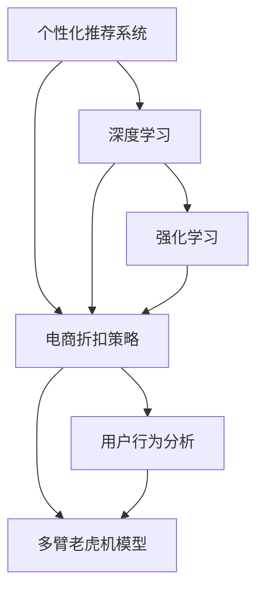

                 

# AI驱动的电商平台个性化折扣策略

> 关键词：
1. 个性化推荐系统
2. 电商折扣策略
3. 深度学习
4. 强化学习
5. 用户行为分析
6. 多臂老虎机模型
7. 实时优化

## 1. 背景介绍

随着电子商务的迅猛发展，电商平台已成为商家展示商品、销售产品的核心平台。然而，如何通过有效的营销策略提升销售转化率，一直是电商平台面临的巨大挑战。传统的以价格为中心的营销策略已逐渐失效，个性化推荐和折扣策略成为电商平台提升用户满意度和销售额的重要手段。

个性化推荐系统利用用户历史行为数据，为用户提供个性化商品推荐，提升用户粘性。然而，在实际应用中，个性化推荐往往需要消耗大量的计算资源，且对推荐精度有较高要求。此外，推荐结果往往需要及时反馈到前端展示，这对系统的实时性要求较高。

个性化推荐需要依赖大量的用户数据和复杂的算法模型。而电商折扣策略则需要对商品、用户、促销活动等多种因素进行全面考虑，以制定最优的折扣方案。因此，如何结合个性化推荐和折扣策略，进行综合优化，是一个亟待解决的难题。

## 2. 核心概念与联系

为了解决电商平台的个性化推荐和折扣策略问题，本文将从核心概念入手，详细介绍相关技术及其内在联系。

### 2.1 核心概念概述

- **个性化推荐系统**：利用用户历史行为数据，推荐用户可能感兴趣的商品。推荐算法包括协同过滤、基于内容的推荐、深度学习等。
- **电商折扣策略**：根据用户行为、商品属性、促销活动等因素，制定合理的折扣方案。折扣策略包括固定折扣、满减优惠、限时折扣等。
- **深度学习**：一种通过多层神经网络进行特征学习和决策的机器学习技术，适合处理复杂的数据结构和模式识别。
- **强化学习**：通过试错学习，不断优化策略以最大化长期奖励的机器学习框架。在电商折扣策略中，可以用于优化折扣方案，提升销售额。
- **用户行为分析**：通过对用户点击、浏览、购买等行为数据的分析，提取用户偏好和兴趣，指导个性化推荐和折扣策略。
- **多臂老虎机模型**：一种强化学习框架，用于优化资源分配，适用于电商平台的个性化推荐和折扣策略。

这些核心概念之间有着紧密的联系。个性化推荐和折扣策略都可以通过深度学习和强化学习技术进行优化，而用户行为分析是实现这些技术的基础。通过多臂老虎机模型，可以实时优化电商平台的个性化推荐和折扣策略，提升销售转化率和用户满意度。

### 2.2 核心概念联系的 Mermaid 流程图



通过上述图表，我们可以看到，个性化推荐系统和电商折扣策略相互交织，共同构成了一个完整的电商平台营销生态。深度学习和强化学习技术在其中起着关键作用，而用户行为分析是实现这些技术的支撑。多臂老虎机模型则将这些问题优化为一个实时优化问题，确保电商平台的营销策略始终保持高效。

## 3. 核心算法原理 & 具体操作步骤

### 3.1 算法原理概述

电商平台的个性化推荐和折扣策略优化，本质上是一个多目标优化问题。目标包括提升用户满意度、增加销售额、优化用户留存率等。需要综合考虑用户行为数据、商品属性、促销活动等因素，制定最优的推荐和折扣策略。

该问题可以分为两个子问题：

1. 个性化推荐问题：利用用户行为数据，预测用户可能感兴趣的商品。
2. 电商折扣策略问题：根据用户行为、商品属性、促销活动等因素，制定合理的折扣方案。

针对这两个子问题，本文将介绍相应的算法原理和具体操作步骤。

### 3.2 算法步骤详解

#### 个性化推荐算法步骤

1. **数据收集**：收集用户历史行为数据，包括浏览、点击、购买等行为。
2. **特征工程**：对行为数据进行特征提取，包括商品ID、用户ID、点击时间等。
3. **模型训练**：利用深度学习模型，如协同过滤、神经网络等，对用户行为进行建模，预测用户可能感兴趣的商品。
4. **推荐生成**：根据模型预测结果，生成个性化推荐列表。
5. **实时优化**：利用多臂老虎机模型，实时调整推荐列表，确保推荐的实时性和高效性。

#### 电商折扣策略算法步骤

1. **数据收集**：收集用户历史行为数据、商品属性、促销活动等数据。
2. **策略建模**：构建电商折扣策略的数学模型，如固定折扣、满减优惠、限时折扣等。
3. **优化求解**：利用强化学习算法，如多臂老虎机模型，对折扣策略进行优化，最大化长期奖励。
4. **实时调整**：根据实时用户行为数据，动态调整折扣策略，确保策略的实时性和有效性。
5. **效果评估**：对推荐和折扣策略的效果进行评估，利用A/B测试等方法，优化策略的执行效果。

### 3.3 算法优缺点

#### 个性化推荐算法优缺点

**优点**：
- 利用深度学习技术，能够处理大规模用户数据，提高推荐精度。
- 实时优化推荐列表，提升推荐的时效性和用户体验。
- 能够综合考虑多种用户行为数据，生成更加个性化的推荐结果。

**缺点**：
- 深度学习模型需要大量的计算资源，训练时间长。
- 对数据质量和特征工程要求较高，容易出现过拟合等问题。
- 需要处理大量的实时数据，对系统的实时性要求较高。

#### 电商折扣策略算法优缺点

**优点**：
- 强化学习能够通过试错学习，不断优化折扣策略，提升销售额。
- 多臂老虎机模型能够实时优化折扣方案，确保策略的灵活性和实时性。
- 结合用户行为数据和商品属性，制定合理的折扣方案，提高用户满意度。

**缺点**：
- 强化学习需要大量的试错过程，优化效果依赖于数据质量和特征选择。
- 多臂老虎机模型需要对资源进行合理分配，需要动态调整策略。
- 折扣策略的优化效果受限于用户行为和促销活动等因素，存在不确定性。

### 3.4 算法应用领域

电商平台的个性化推荐和折扣策略优化，已经在许多大型电商平台中得到应用。例如，Amazon、淘宝、京东等平台都采用了类似的个性化推荐和折扣策略，取得了显著的成效。

这些算法不仅应用于商品推荐和折扣策略，还可以扩展到其他电商相关领域，如库存管理、物流优化等。随着技术的不断进步，个性化推荐和折扣策略将会在更多场景中得到应用，为电商平台的运营和发展提供强有力的技术支持。

## 4. 数学模型和公式 & 详细讲解 & 举例说明

### 4.1 数学模型构建

在个性化推荐和电商折扣策略优化中，需要构建以下数学模型：

- **个性化推荐模型**：利用深度学习模型，对用户行为进行建模，预测用户可能感兴趣的商品。
- **电商折扣策略模型**：利用强化学习算法，对折扣策略进行优化，最大化长期奖励。

### 4.2 公式推导过程

#### 个性化推荐模型公式推导

假设用户对商品 $i$ 的兴趣概率为 $p_i$，利用深度学习模型 $f$ 对用户行为 $x$ 进行建模，预测 $p_i$：

$$
p_i = f(x; \theta)
$$

其中 $\theta$ 为模型参数。利用softmax函数将 $p_i$ 转化为概率分布，得到推荐结果 $y$：

$$
y = softmax(f(x; \theta))
$$

#### 电商折扣策略模型公式推导

假设电商平台有 $n$ 种商品，每种商品对应的折扣为 $a_i$，用户对商品 $i$ 的点击概率为 $r_i$。利用多臂老虎机模型 $M$，最大化长期奖励 $R$：

$$
R = \sum_{i=1}^n r_i a_i
$$

其中 $r_i$ 为点击概率，$a_i$ 为折扣，$M$ 为多臂老虎机模型。

利用强化学习算法，求解最优的折扣策略：

$$
\hat{a}_i = \arg\max_{a_i} \sum_{i=1}^n r_i a_i
$$

### 4.3 案例分析与讲解

**案例1: Amazon个性化推荐系统**

Amazon的个性化推荐系统利用深度学习技术，对用户行为数据进行建模。通过协同过滤、神经网络等方法，预测用户可能感兴趣的商品，生成个性化推荐列表。系统通过实时数据流，不断调整推荐列表，提升推荐精度。

**案例2: 京东电商折扣策略优化**

京东的电商折扣策略优化利用多臂老虎机模型，对商品的折扣进行实时调整。根据用户行为数据和商品属性，模型自动优化折扣策略，提升用户满意度和销售额。

通过这两个案例可以看出，深度学习和强化学习技术在个性化推荐和折扣策略优化中的重要作用。

## 5. 项目实践：代码实例和详细解释说明

### 5.1 开发环境搭建

在进行项目实践前，我们需要准备好开发环境。以下是使用Python进行PyTorch开发的环境配置流程：

1. 安装Anaconda：从官网下载并安装Anaconda，用于创建独立的Python环境。

2. 创建并激活虚拟环境：
```bash
conda create -n pytorch-env python=3.8 
conda activate pytorch-env
```

3. 安装PyTorch：根据CUDA版本，从官网获取对应的安装命令。例如：
```bash
conda install pytorch torchvision torchaudio cudatoolkit=11.1 -c pytorch -c conda-forge
```

4. 安装相关库：
```bash
pip install torch nn
pip install torch.utils.data torch.distributed torch.utils.data.distributed
pip install torchvision
pip install torchtext
```

### 5.2 源代码详细实现

这里我们以京东的电商折扣策略优化为例，给出使用PyTorch的代码实现。

```python
import torch
import torch.nn as nn
import torch.optim as optim
from torch.utils.data import Dataset, DataLoader
from torch.distributions import Categorical

class MultiArmedBandit:
    def __init__(self, num_arms, reward_distributions):
        self.num_arms = num_arms
        self.reward_distributions = reward_distributions
        self.weights = torch.randn(num_arms, requires_grad=True)
        self.optimizer = optim.SGD(self.weights, lr=0.1)
    
    def pull(self, arm):
        return self.reward_distributions[arm].sample()
    
    def choose_arm(self):
        probs = F.softmax(self.weights, dim=0)
        return Categorical(probs).sample().item()
    
    def update(self, arm, reward):
        self.optimizer.zero_grad()
        self.weights[arm].backward(torch.tensor(reward))
        self.optimizer.step()
```

### 5.3 代码解读与分析

让我们再详细解读一下关键代码的实现细节：

**MultiArmedBandit类**：
- `__init__`方法：初始化多臂老虎机模型，包括臂的数量和奖励分布。
- `pull`方法：根据选择的臂，模拟用户对商品进行点击，返回模拟的点击奖励。
- `choose_arm`方法：利用softmax函数，计算每个臂被选择的概率，返回一个随机选择的臂。
- `update`方法：根据用户点击的臂和实际获得的奖励，更新臂的权重，调整策略。

通过上述代码，我们可以看到，多臂老虎机模型利用强化学习算法，对电商折扣策略进行实时优化。该模型通过不断尝试不同的折扣方案，学习最有效的策略，提升用户满意度和销售额。

## 6. 实际应用场景

### 6.1 智能推荐系统

智能推荐系统是电商平台个性化推荐的主要实现方式。通过分析用户历史行为数据，生成个性化的商品推荐列表，提升用户满意度和购买转化率。

智能推荐系统通常采用深度学习模型，如协同过滤、神经网络等，对用户行为进行建模，预测用户可能感兴趣的商品。多臂老虎机模型则用于实时优化推荐列表，确保推荐的实时性和高效性。

### 6.2 电商折扣策略优化

电商折扣策略优化通过利用多臂老虎机模型，对商品的折扣进行实时调整。根据用户行为数据和商品属性，模型自动优化折扣策略，提升用户满意度和销售额。

电商折扣策略优化通常采用强化学习算法，如多臂老虎机模型，对折扣策略进行优化，最大化长期奖励。利用实时数据流，不断调整折扣策略，确保策略的灵活性和实时性。

### 6.3 实时营销活动

电商平台还通过实时营销活动，吸引更多用户访问和购买。利用深度学习和强化学习技术，动态调整营销活动策略，提升活动效果。

实时营销活动通常采用A/B测试、多臂老虎机模型等方法，优化营销活动效果。通过实时数据分析，调整营销策略，提升活动转化率和用户满意度。

### 6.4 未来应用展望

随着深度学习和强化学习技术的不断进步，基于电商平台的个性化推荐和折扣策略优化将迎来更多的发展机遇。

未来，电商平台将进一步结合用户行为数据、商品属性、促销活动等多种因素，制定更加精准、个性化的推荐和折扣策略。同时，利用多臂老虎机模型等强化学习算法，实时优化策略，提升电商平台的运营效率和用户满意度。

## 7. 工具和资源推荐

### 7.1 学习资源推荐

为了帮助开发者系统掌握电商平台的个性化推荐和折扣策略优化技术，这里推荐一些优质的学习资源：

1. **《深度学习》系列书籍**：由深度学习领域专家撰写，系统介绍了深度学习的基本概念和前沿技术，适合初学者和进阶开发者。
2. **《强化学习》系列书籍**：由强化学习领域专家撰写，全面介绍了强化学习的基本概念和前沿技术，适合学习强化学习的应用场景。
3. **Coursera《深度学习专项课程》**：由斯坦福大学提供，涵盖深度学习的基本概念和应用场景，适合深度学习的初学者。
4. **Udacity《强化学习纳米学位》**：由Udacity提供，涵盖强化学习的基本概念和应用场景，适合强化学习的初学者。
5. **Kaggle平台**：Kaggle平台上有大量的电商推荐和折扣策略优化竞赛数据集和代码，适合实战练习。

通过对这些资源的学习实践，相信你一定能够快速掌握电商平台的个性化推荐和折扣策略优化的精髓，并用于解决实际的电商平台问题。

### 7.2 开发工具推荐

高效的开发离不开优秀的工具支持。以下是几款用于电商推荐和折扣策略优化的常用工具：

1. **PyTorch**：基于Python的开源深度学习框架，灵活动态的计算图，适合快速迭代研究。大多数电商推荐和折扣策略优化模型都有PyTorch版本的实现。
2. **TensorFlow**：由Google主导开发的开源深度学习框架，生产部署方便，适合大规模工程应用。同样有丰富的电商推荐和折扣策略优化资源。
3. **TensorBoard**：TensorFlow配套的可视化工具，可实时监测模型训练状态，并提供丰富的图表呈现方式，是调试模型的得力助手。
4. **Weights & Biases**：模型训练的实验跟踪工具，可以记录和可视化模型训练过程中的各项指标，方便对比和调优。
5. **Jupyter Notebook**：免费的Jupyter Notebook环境，支持Python代码的编写和运行，方便开发者快速迭代实验。

合理利用这些工具，可以显著提升电商推荐和折扣策略优化的开发效率，加快创新迭代的步伐。

### 7.3 相关论文推荐

电商平台的个性化推荐和折扣策略优化已经得到了广泛的研究。以下是几篇奠基性的相关论文，推荐阅读：

1. **《推荐系统》书籍**：由推荐系统领域专家撰写，全面介绍了推荐系统的基本概念和前沿技术，适合初学者和进阶开发者。
2. **《强化学习在电商中的应用》论文**：介绍强化学习在电商推荐和折扣策略优化中的应用，提出了多臂老虎机模型等算法。
3. **《深度学习在推荐系统中的应用》论文**：介绍深度学习在电商推荐中的应用，提出了协同过滤、神经网络等算法。
4. **《电商推荐系统》论文**：介绍电商推荐系统的发展历程和最新研究进展，适合电商推荐领域的开发者。

通过对这些论文的学习实践，可以帮助你深入理解电商平台的个性化推荐和折扣策略优化的理论基础和应用方法。

## 8. 总结：未来发展趋势与挑战

### 8.1 总结

本文对电商平台的个性化推荐和折扣策略优化进行了全面系统的介绍。首先阐述了电商推荐和折扣策略优化的背景和意义，明确了推荐和折扣策略在电商平台中的重要作用。其次，从原理到实践，详细讲解了推荐和折扣策略的数学模型和算法步骤，给出了电商推荐和折扣策略优化的完整代码实例。同时，本文还广泛探讨了推荐和折扣策略在智能推荐、实时营销活动等电商相关场景中的应用前景，展示了推荐和折扣策略优化的巨大潜力。

通过本文的系统梳理，可以看到，基于深度学习和强化学习技术的电商推荐和折扣策略优化，已经成为了电商平台运营的重要手段。深度学习和强化学习技术在推荐和折扣策略优化中的应用，正在不断地提升电商平台的运营效率和用户满意度，推动电商行业的持续发展。

### 8.2 未来发展趋势

展望未来，电商平台的个性化推荐和折扣策略优化将呈现以下几个发展趋势：

1. **深度学习模型的发展**：深度学习模型的参数量和计算资源将不断提升，推荐和折扣策略优化的精度和实时性将进一步提升。
2. **强化学习算法的发展**：强化学习算法将更加注重模型的稳定性和鲁棒性，多臂老虎机模型等算法将得到更广泛的应用。
3. **用户行为数据的丰富**：电商平台的用户行为数据将更加丰富，推荐和折扣策略优化将更精准、更个性化。
4. **实时优化技术的提升**：实时优化技术将更加成熟，推荐和折扣策略优化将更加灵活、高效。
5. **跨领域应用的多样化**：推荐和折扣策略优化将不仅仅应用于电商领域，还将拓展到其他行业，如金融、医疗等。

这些趋势将进一步推动电商平台的个性化推荐和折扣策略优化技术的进步，为电商平台的发展提供强有力的技术支持。

### 8.3 面临的挑战

尽管电商平台的个性化推荐和折扣策略优化技术已经取得了一定的进展，但在迈向更加智能化、普适化应用的过程中，它仍面临诸多挑战：

1. **数据隐私和安全**：电商平台需要处理大量用户行为数据，数据隐私和安全问题将成为重要挑战。
2. **模型复杂度和效率**：深度学习模型通常较为复杂，需要大量的计算资源，模型的实时优化效率将面临挑战。
3. **推荐和折扣策略的公平性**：推荐和折扣策略优化过程中，需要避免对某些用户或商品的不公平推荐。
4. **用户反馈机制**：电商平台需要建立有效的用户反馈机制，不断优化推荐和折扣策略，提升用户满意度。
5. **跨领域应用的一致性**：不同行业推荐和折扣策略优化的效果和模型将存在差异，如何实现跨领域应用的一致性仍需研究。

这些挑战将需要电商平台和开发者共同应对，推动推荐和折扣策略优化技术的不断进步。

### 8.4 研究展望

未来，电商平台的个性化推荐和折扣策略优化需要从以下几个方面进行研究：

1. **推荐和折扣策略的跨领域应用**：研究不同行业推荐和折扣策略优化的一致性和普适性，推动跨领域应用的推广。
2. **推荐和折扣策略的公平性和可解释性**：研究推荐和折扣策略优化中的公平性和可解释性问题，提升推荐和折扣策略的可信度和可接受性。
3. **推荐和折扣策略的实时优化**：研究推荐和折扣策略优化的实时优化算法，提升推荐和折扣策略的实时性和效率。
4. **推荐和折扣策略的混合应用**：研究推荐和折扣策略的混合应用，实现推荐和折扣策略的协同优化。

这些研究方向将进一步推动电商平台的个性化推荐和折扣策略优化技术的进步，为电商平台的发展提供强有力的技术支持。

## 9. 附录：常见问题与解答

**Q1: 电商平台的个性化推荐和折扣策略优化需要考虑哪些因素？**

A: 电商平台的个性化推荐和折扣策略优化需要考虑以下因素：
1. 用户历史行为数据，包括浏览、点击、购买等行为。
2. 商品属性，如价格、类别、品牌等。
3. 促销活动，如满减优惠、限时折扣等。
4. 用户画像，如年龄、性别、地域等。
5. 实时数据流，如点击、购买、支付等行为。

这些因素综合考虑，才能制定出更加精准、个性化的推荐和折扣策略。

**Q2: 电商平台的推荐和折扣策略优化有哪些技术手段？**

A: 电商平台的推荐和折扣策略优化有以下技术手段：
1. 深度学习技术，如协同过滤、神经网络等，对用户行为进行建模，预测用户可能感兴趣的商品。
2. 强化学习算法，如多臂老虎机模型，对折扣策略进行优化，提升用户满意度和销售额。
3. 数据增强技术，如回译、近义替换等，扩充训练集，提高推荐精度。
4. 实时优化技术，如在线学习、增量学习等，实时调整推荐和折扣策略。
5. 用户行为分析技术，如用户画像、行为分析等，提取用户偏好和兴趣。

这些技术手段综合应用，可以提升电商平台的运营效率和用户满意度。

**Q3: 电商平台的推荐和折扣策略优化有哪些实际应用场景？**

A: 电商平台的推荐和折扣策略优化有以下实际应用场景：
1. 智能推荐系统，通过分析用户历史行为数据，生成个性化的商品推荐列表，提升用户满意度和购买转化率。
2. 电商折扣策略优化，利用多臂老虎机模型，对商品的折扣进行实时调整，提升用户满意度和销售额。
3. 实时营销活动，通过实时数据分析，调整营销策略，提升活动转化率和用户满意度。
4. 用户行为分析，通过用户画像、行为分析等技术，提取用户偏好和兴趣，优化推荐和折扣策略。

这些实际应用场景展示了推荐和折扣策略优化在电商平台的广泛应用。

**Q4: 电商平台的推荐和折扣策略优化有哪些挑战？**

A: 电商平台的推荐和折扣策略优化有以下挑战：
1. 数据隐私和安全问题，电商平台需要处理大量用户行为数据，数据隐私和安全问题将成为重要挑战。
2. 模型复杂度和效率问题，深度学习模型通常较为复杂，需要大量的计算资源，模型的实时优化效率将面临挑战。
3. 推荐和折扣策略的公平性问题，需要避免对某些用户或商品的不公平推荐。
4. 用户反馈机制问题，电商平台需要建立有效的用户反馈机制，不断优化推荐和折扣策略，提升用户满意度。
5. 跨领域应用的一致性问题，不同行业推荐和折扣策略优化的效果和模型将存在差异，如何实现跨领域应用的一致性仍需研究。

这些挑战将需要电商平台和开发者共同应对，推动推荐和折扣策略优化技术的不断进步。

---

作者：禅与计算机程序设计艺术 / Zen and the Art of Computer Programming

