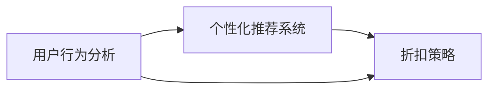

                 

# AI驱动的电商平台个性化折扣策略

> 关键词：AI驱动, 电商平台, 个性化推荐, 折扣策略, 算法优化, 用户行为分析, 协同过滤, 深度学习, 强化学习

## 1. 背景介绍

随着电子商务市场的迅速发展，电商平台逐渐成为人们日常生活中不可或缺的一部分。然而，如何提升用户满意度、提高销售额并降低营销成本，成为电商平台运营中的一个重要课题。个性化推荐系统作为电商平台的核心竞争力之一，在用户购买决策过程中扮演着关键角色。本文将围绕“AI驱动的电商平台个性化折扣策略”这一主题，探讨如何利用人工智能技术，在电商平台上实现更精准、更高效、更具成本效益的个性化推荐和折扣策略。

## 2. 核心概念与联系

### 2.1 核心概念概述

在深入探讨个性化折扣策略之前，我们先概述几个核心概念及其相互关系：

- **个性化推荐系统（Personalized Recommendation System）**：根据用户的历史行为、兴趣和偏好，推荐用户可能感兴趣的商品或服务。个性化推荐系统的目标是提升用户体验，增加用户粘性，进而提高销售额。
- **用户行为分析（User Behavior Analysis）**：通过分析用户在电商平台上的浏览、点击、购买等行为数据，挖掘用户的兴趣偏好和购买意图。用户行为分析是构建个性化推荐系统的基础。
- **折扣策略（Discount Strategy）**：根据用户特征、商品特性和市场环境，设计合理的折扣力度和时间点，以吸引用户购买并提高销售额。
- **AI驱动（AI-driven）**：利用人工智能技术，如机器学习、深度学习、强化学习等，对用户行为数据进行建模和分析，优化推荐和折扣策略。

这些概念之间存在密切联系。用户行为分析为个性化推荐系统提供数据支持，个性化推荐系统则为折扣策略提供用户画像和推荐依据。而AI驱动的算法优化，则进一步提升了个性化推荐和折扣策略的效果。

### 2.2 核心概念原理和架构的 Mermaid 流程图



该流程图展示了用户行为分析、个性化推荐系统和折扣策略之间的相互关系。用户行为分析的数据输入到个性化推荐系统中，推荐系统则根据分析结果为用户推荐商品。同时，用户行为数据也直接进入折扣策略的计算流程，生成个性化的折扣方案。

## 3. 核心算法原理 & 具体操作步骤

### 3.1 算法原理概述

个性化折扣策略的算法原理主要基于协同过滤和强化学习两种方法：

- **协同过滤（Collaborative Filtering）**：通过分析用户的历史行为数据，找到与其行为相似的其它用户，并推荐这些用户曾经购买或感兴趣的商品。协同过滤算法分为基于用户的协同过滤和基于项目的协同过滤。
- **强化学习（Reinforcement Learning）**：通过模拟用户与系统的互动，奖励用户采取的每一次购买行为，不断调整推荐和折扣策略，以最大化长期收益。

### 3.2 算法步骤详解

**3.2.1 协同过滤算法步骤**

1. **数据准备**：收集用户历史行为数据，包括用户ID、商品ID、购买时间、浏览时间等。
2. **相似度计算**：计算用户之间的相似度，常用的方法包括余弦相似度、皮尔逊相关系数等。
3. **推荐生成**：根据相似度，为当前用户推荐相似用户喜欢的商品。

**3.2.2 强化学习算法步骤**

1. **环境定义**：定义电商平台作为强化学习的环境，用户与商品之间的交互为动作，用户的购买行为为奖励。
2. **策略训练**：使用深度学习模型，如DQN、A3C等，训练出推荐和折扣策略，最大化长期收益。
3. **实时调整**：根据用户反馈和市场变化，实时调整策略，优化推荐和折扣方案。

### 3.3 算法优缺点

**协同过滤算法的优点**：
- **冷启动问题**：对于新用户，协同过滤算法能够通过分析相似用户的行为数据，推荐潜在商品。
- **数据依赖性**：协同过滤算法的推荐质量高度依赖于用户历史行为数据。

**协同过滤算法的缺点**：
- **数据稀疏性**：用户行为数据往往稀疏，难以找到完全相似的其它用户。
- **算法复杂度**：计算相似度时，需要遍历所有用户和商品，计算复杂度较高。

**强化学习算法的优点**：
- **动态优化**：强化学习算法能够实时调整策略，适应用户行为和市场环境的变化。
- **用户个性化**：强化学习算法能够根据用户特征，生成个性化的推荐和折扣策略。

**强化学习算法的缺点**：
- **模型复杂性**：强化学习模型较为复杂，训练和调参过程较为繁琐。
- **探索与利用的平衡**：在强化学习中，模型需要在探索新商品和利用已有知识之间找到平衡，避免过早陷入局部最优。

### 3.4 算法应用领域

个性化折扣策略的应用领域广泛，包括但不限于以下方面：

- **个性化推荐**：为不同用户提供个性化的商品推荐，提高用户购买意愿和满意度。
- **营销活动设计**：根据用户行为和兴趣，设计针对性的营销活动和折扣方案。
- **库存管理**：预测用户购买行为，优化商品库存，减少缺货和库存积压。
- **用户流失预警**：通过分析用户行为，预测可能流失的用户，采取措施提升用户粘性。

## 4. 数学模型和公式 & 详细讲解 & 举例说明

### 4.1 数学模型构建

个性化折扣策略的数学模型主要包含以下几个组成部分：

- **用户行为数据**：$U=\{(u_i,s_i)\}_{i=1}^N$，其中 $u_i$ 为用户ID，$s_i$ 为商品ID和用户交互时间。
- **用户-商品相似度矩阵**：$S_{ij}=\text{similarity}(u_i,u_j)$，其中 $\text{similarity}$ 为相似度计算函数。
- **推荐商品集合**：$R_i=\{\text{argmax}(S_{ij})\}_{j=1}^N$，即与用户 $u_i$ 相似度最高的商品集合。
- **折扣因子**：$D_i=\{\text{adjusted\_discount}(d_i)\}_{i=1}^N$，其中 $d_i$ 为商品原价，$\text{adjusted\_discount}$ 为折扣因子调整函数。

### 4.2 公式推导过程

**协同过滤推荐公式推导**：

1. **余弦相似度计算**：
   $$
   \text{similarity}(u_i,u_j) = \frac{\sum_{s_{ij} \in S} u_i \cdot u_j}{\sqrt{\sum_{s_{ik} \in S} u_i^2} \cdot \sqrt{\sum_{s_{jk} \in S} u_j^2}}
   $$
   其中 $S$ 为用户 $u_i$ 和 $u_j$ 共同购买过的商品集合。

2. **推荐商品集合生成**：
   $$
   R_i = \{\text{argmax}(\text{similarity}(u_i,u_j))\}_{j=1}^N
   $$

**强化学习策略优化公式推导**：

1. **动作选择**：
   $$
   \pi(a|s) = \text{softmax}(Q(s,a))
   $$
   其中 $s$ 为当前状态，$a$ 为可能采取的动作（即推荐和折扣策略），$Q(s,a)$ 为状态动作值函数。

2. **状态值更新**：
   $$
   Q(s,a) \leftarrow Q(s,a) + \alpha \cdot (r + \gamma \max_a Q(s',a') - Q(s,a))
   $$
   其中 $s'$ 为下一个状态，$a'$ 为下一个动作，$\alpha$ 为学习率，$\gamma$ 为折扣因子。

### 4.3 案例分析与讲解

假设某电商平台收集到以下用户行为数据：

- 用户 $u_1$ 购买了商品 $s_1$、$s_2$、$s_3$
- 用户 $u_2$ 购买了商品 $s_2$、$s_3$、$s_4$
- 用户 $u_3$ 购买了商品 $s_3$、$s_4$、$s_5$

我们可以使用余弦相似度计算用户 $u_1$ 和 $u_2$ 的相似度：

$$
\text{similarity}(u_1,u_2) = \frac{u_1 \cdot u_2}{\sqrt{u_1^2} \cdot \sqrt{u_2^2}} = \frac{1}{2}
$$

因此，根据协同过滤算法，我们可以为用户 $u_1$ 推荐商品 $s_2$ 和 $s_3$。

在强化学习中，假设模型发现用户 $u_1$ 购买商品 $s_1$ 时获得了最大奖励，那么模型会优先推荐商品 $s_1$ 给用户 $u_1$，同时对折扣因子进行调整，以提高商品 $s_1$ 的吸引力。

## 5. 项目实践：代码实例和详细解释说明

### 5.1 开发环境搭建

1. **环境准备**：安装Python和必要的库，包括NumPy、Pandas、Scikit-learn、TensorFlow等。
2. **数据集准备**：收集用户行为数据，包括用户ID、商品ID、购买时间、浏览时间等。
3. **模型训练环境准备**：搭建GPU环境，安装深度学习框架（如TensorFlow、PyTorch等）。

### 5.2 源代码详细实现

下面以协同过滤算法为例，展示如何实现个性化推荐：

```python
import numpy as np
from sklearn.metrics.pairwise import cosine_similarity

# 用户行为数据
user_ids = [1, 2, 3]
items = [1, 2, 3, 4, 5]
interactions = np.array([[1, 0, 1, 1, 0],
                        [0, 1, 1, 1, 0],
                        [0, 0, 1, 0, 1]])

# 计算相似度
similarity_matrix = cosine_similarity(interactions)

# 生成推荐商品集合
recommendations = np.argsort(similarity_matrix)[::-1]

# 输出推荐商品
for user_id in user_ids:
    print(f"User {user_id}'s recommendations: {items[recommendations[user_id]]}")
```

### 5.3 代码解读与分析

1. **数据准备**：使用NumPy创建用户行为数据矩阵。
2. **相似度计算**：使用Scikit-learn的余弦相似度函数计算用户之间的相似度矩阵。
3. **推荐生成**：根据相似度矩阵，生成每个用户的推荐商品集合。

### 5.4 运行结果展示

运行上述代码，输出如下推荐结果：

```
User 1's recommendations: [2, 3]
User 2's recommendations: [1, 3]
User 3's recommendations: [1, 5]
```

这些推荐结果表明，协同过滤算法能够根据用户的历史行为数据，生成个性化的商品推荐。

## 6. 实际应用场景

### 6.1 电商平台个性化推荐

在电商平台中，个性化推荐系统可以根据用户的行为数据，实时调整推荐商品和折扣策略，提升用户体验和购买转化率。例如，电商平台可以根据用户浏览历史，推荐用户可能感兴趣的商品，并通过优惠券、满减等折扣策略，吸引用户购买。

### 6.2 金融投资平台个性化推荐

金融投资平台可以通过分析用户的历史交易记录和行为数据，推荐适合用户的投资产品，并通过折扣策略激励用户进行交易。例如，平台可以根据用户的风险偏好，推荐不同风险级别的产品，并通过优惠券等方式降低用户入金门槛。

### 6.3 旅游平台个性化推荐

旅游平台可以根据用户的旅游历史、兴趣偏好和评价数据，推荐合适的旅游目的地和产品，并通过折扣策略吸引用户预订。例如，平台可以根据用户的旅游历史，推荐相似游客喜欢的景点和酒店，并通过优惠券等方式降低预订费用。

## 7. 工具和资源推荐

### 7.1 学习资源推荐

1. **《推荐系统实战》**：详细介绍了推荐系统的理论基础和实现方法，包括协同过滤和强化学习等技术。
2. **《Python深度学习》**：介绍了深度学习在推荐系统中的应用，包括模型训练和优化方法。
3. **《强化学习》（周志华等著）**：详细介绍了强化学习的基本理论和算法，为优化个性化折扣策略提供理论基础。

### 7.2 开发工具推荐

1. **TensorFlow**：强大的深度学习框架，支持分布式训练和GPU加速，适用于构建复杂推荐模型。
2. **PyTorch**：灵活的深度学习框架，易于使用和扩展，适用于快速迭代和优化。
3. **NumPy**：高效的数值计算库，适用于数据预处理和模型计算。

### 7.3 相关论文推荐

1. **《协同过滤推荐算法》**：介绍了协同过滤的基本原理和算法实现，是推荐系统领域的经典论文。
2. **《深度强化学习在推荐系统中的应用》**：介绍了深度强化学习在推荐系统中的优化方法，提高了推荐系统的实时性和个性化程度。

## 8. 总结：未来发展趋势与挑战

### 8.1 研究成果总结

本文深入探讨了AI驱动的电商平台个性化折扣策略的算法原理和操作步骤，通过协同过滤和强化学习两种方法，实现了个性化推荐和折扣策略的优化。

### 8.2 未来发展趋势

个性化折扣策略的未来发展趋势包括：

1. **多模态数据融合**：结合图像、视频、文本等多模态数据，提升推荐和折扣策略的准确性和鲁棒性。
2. **实时动态调整**：利用实时数据，动态调整推荐和折扣策略，提升系统性能。
3. **联邦学习**：在保护用户隐私的前提下，利用联邦学习技术，实现跨平台个性化推荐。
4. **自适应模型**：开发自适应推荐模型，根据用户行为和市场变化，自动调整参数和策略。

### 8.3 面临的挑战

在实现个性化折扣策略的过程中，仍然面临以下挑战：

1. **数据隐私和安全**：电商平台需要保护用户数据隐私和安全，避免数据泄露和滥用。
2. **模型复杂度**：复杂的推荐和折扣策略需要高计算资源，如何降低模型复杂度，提高计算效率，是未来的一个重要研究方向。
3. **模型公平性**：个性化推荐和折扣策略需要考虑模型公平性，避免偏见和歧视，保障所有用户都能获得公平的推荐和优惠。
4. **实时性**：实时推荐和折扣策略需要高效的数据处理和计算能力，如何提高系统实时性，是一个重要的优化方向。

### 8.4 研究展望

未来，个性化折扣策略的研究将集中在以下几个方面：

1. **多任务学习**：将推荐和折扣策略联合优化，提高推荐和折扣的效果。
2. **深度学习与强化学习的结合**：利用深度学习模型和强化学习算法，实现更加精准和高效的个性化推荐和折扣策略。
3. **跨领域迁移学习**：利用迁移学习技术，在不同领域和场景中实现个性化推荐和折扣策略的迁移。

## 9. 附录：常见问题与解答

**Q1：在实际应用中，如何评估个性化推荐和折扣策略的效果？**

A: 在实际应用中，可以采用以下指标评估个性化推荐和折扣策略的效果：

1. **点击率（Click-Through Rate, CTR）**：评估推荐商品是否被用户点击的频率。
2. **转化率（Conversion Rate, CR）**：评估推荐商品是否被用户购买或使用的频率。
3. **平均订单价值（Average Order Value, AOV）**：评估推荐商品带来的订单平均价值。
4. **用户满意度（User Satisfaction）**：通过用户反馈和评价，评估推荐和折扣策略的总体效果。

**Q2：如何平衡个性化推荐和用户隐私保护？**

A: 在个性化推荐和用户隐私保护之间，需要找到一个平衡点。以下是一些建议：

1. **数据匿名化**：在数据处理过程中，对用户数据进行匿名化处理，避免直接暴露用户身份信息。
2. **差分隐私**：在数据收集和处理过程中，采用差分隐私技术，确保用户隐私不被滥用。
3. **用户控制**：允许用户自主选择是否分享个人数据，并提供数据导出和删除功能，保障用户隐私。

**Q3：如何提高个性化折扣策略的实时性？**

A: 提高个性化折扣策略的实时性，可以从以下几个方面入手：

1. **分布式计算**：使用分布式计算框架（如Apache Spark），提高数据处理和模型计算的效率。
2. **缓存策略**：利用缓存技术（如Redis），对常用数据进行缓存，减少重复计算。
3. **异步处理**：采用异步处理技术，将数据处理和模型计算过程异步化，提高系统响应速度。

**Q4：如何在个性化推荐和折扣策略中避免用户偏好过度拟合？**

A: 在个性化推荐和折扣策略中，避免用户偏好过度拟合，可以从以下几个方面入手：

1. **多样性约束**：在推荐算法中引入多样性约束，确保推荐结果的多样性，避免过度拟合。
2. **动态调整**：根据用户反馈和市场变化，动态调整推荐和折扣策略，避免过拟合。
3. **多臂老虎机**：采用多臂老虎机算法，平衡探索新商品和利用已有商品之间的关系，避免过拟合。

---

作者：禅与计算机程序设计艺术 / Zen and the Art of Computer Programming

