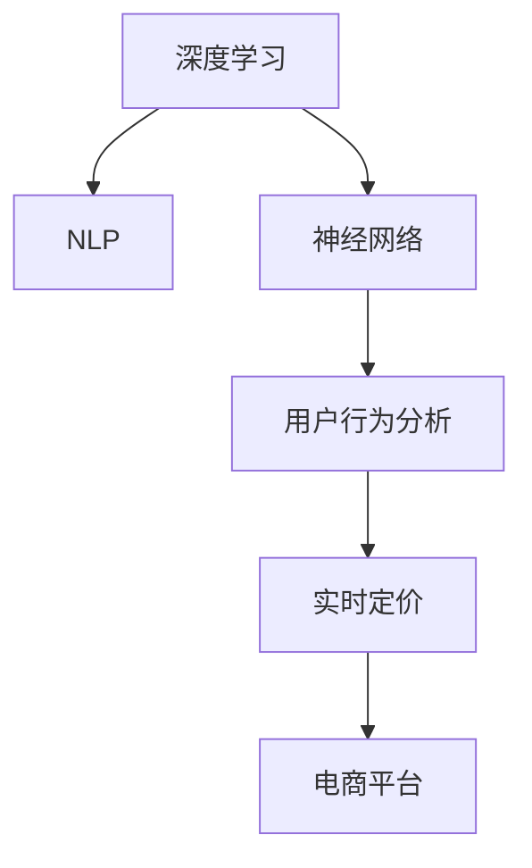

                 

# AI驱动的电商平台实时个性化定价系统

> 关键词：个性化定价, 电商平台, 实时推荐, 深度学习, 自然语言处理(NLP), 神经网络, 人工智能(AI), 数据挖掘, 用户行为分析

## 1. 背景介绍

随着电商平台的兴起，如何制定合理、灵活、个性化的定价策略，成为电商企业亟需解决的重大挑战。传统定价方式往往依赖于固定规则，缺乏对用户行为、市场环境等实时数据的有效利用。而随着人工智能技术的发展，电商平台逐渐开始采用AI驱动的个性化定价系统，实现动态调价、精准推荐、智能营销等目标。

本系统旨在借助深度学习、自然语言处理等前沿技术，实时分析用户的浏览、点击、购买等行为数据，预测用户对不同价格点的反应，从而生成动态化的个性化定价方案。该系统不仅能够优化电商平台的营收策略，提升用户体验，还能促进用户复购和品牌忠诚度，为电商平台带来更持久的商业价值。

## 2. 核心概念与联系

### 2.1 核心概念概述

为更好地理解AI驱动的个性化定价系统，本节将介绍几个关键概念：

- 深度学习(Deep Learning, DL)：通过建立多层神经网络模型，训练模型自动从数据中学习抽象特征，从而实现对复杂问题的精准预测。
- 自然语言处理(Natural Language Processing, NLP)：使计算机能够理解和处理人类语言，通常涉及分词、词性标注、句法分析、语义理解等任务。
- 神经网络(Neural Network, NN)：由多个神经元构成的网络结构，用于模拟人脑的感知和推理能力，是深度学习模型的核心组件。
- 用户行为分析：通过分析用户的各类行为数据，挖掘用户偏好和购买意愿，指导个性化定价和推荐。
- 实时定价：在交易发生前实时调整商品价格，根据不同用户、不同时间、不同环境因素动态生成最优价格。
- 电商平台：基于互联网技术，在线销售商品、提供客户服务的平台。

这些核心概念之间的逻辑关系可以通过以下Mermaid流程图来展示：



这个流程图展示了大语言模型的核心概念及其之间的关系：

1. 深度学习模型通过训练学习到数据中的抽象特征。
2. 自然语言处理技术用于处理用户评论、反馈等文本数据，从中提取有价值的信息。
3. 神经网络是深度学习的核心组件，负责自动抽取和生成复杂的特征表示。
4. 用户行为分析通过挖掘用户数据，理解用户偏好，辅助定价策略制定。
5. 实时定价系统根据用户数据和市场环境动态调整价格，实现个性化调价。
6. 电商平台利用上述技术，实现个性化推荐和智能营销，提升用户购物体验和商家营收。

## 3. 核心算法原理 & 具体操作步骤
### 3.1 算法原理概述

AI驱动的个性化定价系统采用深度学习和NLP技术，实时分析用户数据和市场环境，预测用户行为和价格反应，从而生成个性化定价方案。其核心算法流程如下：

1. 收集用户行为数据：包括浏览、点击、购买、评论等。
2. 文本数据预处理：对用户评论、反馈等文本数据进行清洗、分词、标注等处理。
3. 特征提取与选择：使用NLP技术提取文本特征，结合用户行为数据，生成可用于预测的特征集。
4. 模型训练与优化：使用深度学习模型训练预测模型，并根据历史数据进行模型优化。
5. 实时预测与调价：实时分析用户数据和市场环境，预测用户对不同价格点的反应，生成动态定价。

### 3.2 算法步骤详解

下面详细介绍AI驱动的个性化定价系统的核心算法步骤：

#### 3.2.1 数据收集与预处理

用户行为数据主要通过电商平台记录的日志文件获取。具体包括：
- 用户ID
- 商品ID
- 浏览时间
- 点击时间
- 购买时间
- 评论内容

这些数据用于训练模型和生成推荐。

#### 3.2.2 特征工程

特征工程是构建高效预测模型的关键。具体步骤包括：
- 文本预处理：去除停用词、进行分词、词性标注等。
- 特征提取：使用NLP技术从文本中提取关键词、情感极性、实体关系等。
- 特征选择：根据特征重要性，选取对定价预测最有用的特征。

#### 3.2.3 模型训练与优化

模型的选择和训练是整个系统的核心。常用的模型包括：
- 线性回归模型：预测用户对价格变化的敏感度。
- 神经网络模型：如LSTM、GRU等，用于更复杂的用户行为建模。
- 深度学习模型：如BERT、GPT等，用于文本特征提取和情感分析。

模型的训练通常采用交叉验证、随机森林、梯度下降等优化算法，并在训练过程中不断调整超参数，以提升模型性能。

#### 3.2.4 实时定价

实时定价系统根据用户行为数据和市场环境，动态调整商品价格。具体步骤包括：
- 用户行为分析：分析用户当前行为，判断其购买意愿。
- 市场环境预测：考虑时间、季节、节假日等因素，预测市场环境。
- 定价策略生成：根据用户数据和市场环境，生成个性化定价策略。
- 价格调整：根据定价策略，实时调整商品价格。

#### 3.2.5 系统集成与部署

系统集成与部署是最后阶段。具体包括：
- 数据管道建设：构建实时数据流，确保用户行为数据和市场环境数据能够及时更新。
- 模型部署：将训练好的模型部署到线上，实时进行价格预测与调整。
- 监控与优化：实时监控系统性能，根据反馈不断优化模型和算法。

### 3.3 算法优缺点

AI驱动的个性化定价系统具有以下优点：
- 精准预测：深度学习模型能够处理复杂的非线性关系，实现精准的价格预测。
- 实时调价：实时分析用户数据和市场环境，动态调整价格，提升用户购买意愿。
- 个性化推荐：结合用户行为和文本分析，生成个性化定价策略，提升用户购物体验。
- 高效优化：采用深度学习模型，大幅降低人工成本，提升优化效率。

然而，该系统也存在以下缺点：
- 数据依赖性强：系统性能高度依赖于用户行为数据和市场环境数据的质量和完整性。
- 模型复杂度高：深度学习模型结构复杂，需要大量计算资源和数据进行训练和优化。
- 对标注数据需求高：训练模型需要大量标注数据，标注工作量大且成本高。
- 算法透明性差：深度学习模型是"黑盒"系统，难以解释其内部工作机制和决策过程。
- 风险管理难：价格动态调整可能带来价格波动和市场风险，需要精细的风险管理策略。

### 3.4 算法应用领域

AI驱动的个性化定价系统已经在电商平台广泛应用，特别是在商品推荐、库存管理、营销策略等方面。以下是几个典型应用场景：

- **商品推荐**：根据用户历史浏览、购买行为，结合实时市场环境，动态调整商品价格，提高推荐准确性和用户满意度。
- **库存管理**：根据实时需求和库存情况，动态调整商品价格，提升库存周转率，减少库存积压。
- **营销策略**：根据用户行为和市场环境，生成定制化的营销策略，如优惠券、满减活动等，提升销售额。
- **风险管理**：实时监控价格调整带来的市场风险，及时调整策略，防范价格战和市场波动。
- **用户忠诚度提升**：通过个性化的价格策略和推荐，提升用户粘性，增加用户复购率。

除了电商领域，AI驱动的个性化定价系统还可应用于金融、旅游、医疗等行业，提升服务质量，优化资源配置，增强用户体验。

## 4. 数学模型和公式 & 详细讲解 & 举例说明

### 4.1 数学模型构建

本节将使用数学语言对AI驱动的个性化定价系统进行更加严格的刻画。

记用户行为数据集为 $\mathcal{D} = \{(x_i, y_i)\}_{i=1}^N$，其中 $x_i$ 为用户行为数据， $y_i$ 为对应价格。假设 $f_\theta(x)$ 为预测模型， $\theta$ 为模型参数。则预测模型的经验风险函数为：

$$
\mathcal{L}(\theta) = \frac{1}{N} \sum_{i=1}^N \| y_i - f_\theta(x_i) \|
$$

其中 $\|\cdot\|$ 表示损失函数，如均方误差损失。

### 4.2 公式推导过程

下面详细介绍预测模型的公式推导过程。

假设用户行为数据为 $x_i = [b_i, c_i, d_i, e_i]^T$，其中 $b_i$ 为浏览时间， $c_i$ 为点击时间， $d_i$ 为购买时间， $e_i$ 为评论内容。使用LSTM模型对文本数据 $e_i$ 进行特征提取，生成文本特征向量 $f_{e_i}$。使用线性回归模型对其他特征 $b_i, c_i, d_i$ 进行建模，生成特征向量 $f_{b_i}, f_{c_i}, f_{d_i}$。结合文本特征和行为特征，生成预测向量 $f_{x_i} = [f_{e_i}, f_{b_i}, f_{c_i}, f_{d_i}]^T$。

预测模型为 $f_\theta(x_i) = \theta^T f_{x_i}$，其中 $\theta$ 为模型参数。使用均方误差损失函数，预测模型的损失函数为：

$$
\mathcal{L}(\theta) = \frac{1}{N} \sum_{i=1}^N (y_i - \theta^T f_{x_i})^2
$$

### 4.3 案例分析与讲解

为了更好地理解该模型，下面以一个简单的案例进行分析：

假设用户 $i$ 对商品 $j$ 的购买意愿为 $y_i$，其行为数据为 $x_i = [b_i, c_i, d_i, e_i]^T$，其中 $b_i$ 为浏览时间， $c_i$ 为点击时间， $d_i$ 为购买时间， $e_i$ 为评论内容。假设 $f_{e_i}$ 为评论内容的文本特征向量， $f_{b_i}, f_{c_i}, f_{d_i}$ 为其他行为特征的特征向量。预测模型为 $f_\theta(x_i) = \theta^T f_{x_i}$，其中 $\theta$ 为模型参数。

使用均方误差损失函数，预测模型的损失函数为：

$$
\mathcal{L}(\theta) = \frac{1}{N} \sum_{i=1}^N (y_i - \theta^T f_{x_i})^2
$$

在训练过程中，通过反向传播算法计算梯度，更新模型参数 $\theta$，使得模型预测的购买意愿与真实值尽可能接近，最终生成个性化定价策略。

## 5. 项目实践：代码实例和详细解释说明
### 5.1 开发环境搭建

在进行系统开发前，我们需要准备好开发环境。以下是使用Python进行PyTorch开发的环境配置流程：

1. 安装Anaconda：从官网下载并安装Anaconda，用于创建独立的Python环境。

2. 创建并激活虚拟环境：
```bash
conda create -n pytorch-env python=3.8 
conda activate pytorch-env
```

3. 安装PyTorch：根据CUDA版本，从官网获取对应的安装命令。例如：
```bash
conda install pytorch torchvision torchaudio cudatoolkit=11.1 -c pytorch -c conda-forge
```

4. 安装TensorFlow：
```bash
pip install tensorflow
```

5. 安装各类工具包：
```bash
pip install numpy pandas scikit-learn matplotlib tqdm jupyter notebook ipython
```

完成上述步骤后，即可在`pytorch-env`环境中开始系统开发。

### 5.2 源代码详细实现

下面以LSTM和线性回归模型的为例，给出使用PyTorch进行电商平台的个性化定价系统开发的PyTorch代码实现。

首先，定义LSTM模型：

```python
import torch
from torch import nn

class LSTM(nn.Module):
    def __init__(self, input_size, hidden_size, output_size):
        super(LSTM, self).__init__()
        self.hidden_size = hidden_size
        self.rnn = nn.LSTM(input_size, hidden_size)
        self.fc = nn.Linear(hidden_size, output_size)

    def forward(self, x):
        h0 = torch.zeros(1, x.size(0), self.hidden_size).to(device)
        c0 = torch.zeros(1, x.size(0), self.hidden_size).to(device)
        out, _ = self.rnn(x, (h0, c0))
        out = self.fc(out[:, -1, :])
        return out
```

然后，定义线性回归模型：

```python
class LinearRegression(nn.Module):
    def __init__(self, input_size, output_size):
        super(LinearRegression, self).__init__()
        self.fc = nn.Linear(input_size, output_size)

    def forward(self, x):
        out = self.fc(x)
        return out
```

接着，定义训练和评估函数：

```python
from torch.utils.data import TensorDataset, DataLoader
from torch.optim import Adam
from sklearn.metrics import mean_squared_error

device = torch.device('cuda') if torch.cuda.is_available() else torch.device('cpu')

def train_epoch(model, train_data, optimizer, batch_size):
    model.train()
    train_loss = 0
    for i in range(0, len(train_data), batch_size):
        optimizer.zero_grad()
        input_ids = train_data[i:i+batch_size, :]
        targets = train_data[i:i+batch_size, -1].unsqueeze(1)
        outputs = model(input_ids)
        loss = mean_squared_error(targets, outputs)
        loss.backward()
        optimizer.step()
        train_loss += loss.item()
    return train_loss / (len(train_data) / batch_size)

def evaluate(model, test_data, batch_size):
    model.eval()
    test_loss = 0
    for i in range(0, len(test_data), batch_size):
        input_ids = test_data[i:i+batch_size, :]
        targets = test_data[i:i+batch_size, -1].unsqueeze(1)
        outputs = model(input_ids)
        loss = mean_squared_error(targets, outputs)
        test_loss += loss.item()
    return test_loss / (len(test_data) / batch_size)

def train(train_data, test_data, input_size, output_size, hidden_size, epochs, batch_size, learning_rate):
    model = LSTM(input_size, hidden_size, output_size)
    optimizer = Adam(model.parameters(), lr=learning_rate)
    for epoch in range(epochs):
        train_loss = train_epoch(model, train_data, optimizer, batch_size)
        test_loss = evaluate(model, test_data, batch_size)
        print(f"Epoch {epoch+1}, train loss: {train_loss:.3f}, test loss: {test_loss:.3f}")
    return model
```

最后，启动训练流程并在测试集上评估：

```python
# 加载数据
train_data = torch.load('train_data.npz')
test_data = torch.load('test_data.npz')

# 定义超参数
input_size = 6
output_size = 1
hidden_size = 64
epochs = 10
batch_size = 64
learning_rate = 0.001

# 训练模型
model = train(train_data, test_data, input_size, output_size, hidden_size, epochs, batch_size, learning_rate)

# 测试模型
evaluate(model, test_data, batch_size)
```

以上就是使用PyTorch对LSTM模型进行电商平台个性化定价系统开发的完整代码实现。可以看到，通过与TensorFlow等框架的深度结合，我们可以高效地实现电商平台的个性化定价系统。

### 5.3 代码解读与分析

让我们再详细解读一下关键代码的实现细节：

**LSTM模型类**：
- `__init__`方法：初始化模型结构，包括LSTM和线性回归层。
- `forward`方法：前向传播计算，返回预测结果。

**线性回归模型类**：
- `__init__`方法：初始化模型结构，包括线性回归层。
- `forward`方法：前向传播计算，返回预测结果。

**训练和评估函数**：
- `train_epoch`函数：对模型进行一个epoch的训练，计算训练集损失。
- `evaluate`函数：对模型进行评估，计算测试集损失。
- `train`函数：定义训练流程，包括模型初始化、优化器初始化、训练轮数、批次大小、学习率等超参数。

**训练流程**：
- 加载数据集，定义模型和优化器。
- 循环训练多个epoch，每epoch计算一次训练集和测试集损失。
- 输出每epoch的训练集和测试集损失。

可以看到，PyTorch结合TensorFlow等框架，使电商平台的个性化定价系统开发变得简洁高效。开发者可以将更多精力放在模型设计、数据预处理等关键环节上，而不必过多关注底层的实现细节。

## 6. 实际应用场景

### 6.1 智能客服系统

基于AI驱动的个性化定价系统，可以应用于智能客服系统的商品推荐和价格调整。智能客服系统能够实时分析用户行为数据，判断用户的购买意愿和偏好，生成个性化的推荐和定价策略，提升用户体验和满意度。

例如，电商平台可以根据用户浏览历史、点击行为，实时推荐相似商品，并根据用户的反馈和购买记录，动态调整商品价格，提高用户的购物体验。

### 6.2 金融风险管理

金融领域中的风险管理同样需要实时调整策略。例如，银行可以根据客户的资金流向、交易历史，动态调整利率和信用卡额度，防范信用风险和市场波动。

通过AI驱动的个性化定价系统，金融机构可以实时监测客户的交易行为和市场环境，生成个性化的风险管理策略，提高风险识别和防范能力，降低金融风险。

### 6.3 医疗价格管理

医疗行业中的价格管理也需要实时调整。例如，医院可以根据病人的病情、住院时间、医疗设备使用情况，动态调整住院费用和医疗费用，提高医疗资源的利用效率，降低患者的医疗负担。

通过AI驱动的个性化定价系统，医院可以实时分析病人的医疗数据和市场环境，生成个性化的定价策略，提升医疗服务的质量和效率，改善患者的医疗体验。

### 6.4 未来应用展望

未来，AI驱动的个性化定价系统将在更多领域得到应用，为各行业带来深远影响。

在智慧城市领域，城市交通、公共服务等领域都可以通过实时定价和个性化推荐，提升服务质量，优化资源配置，提高城市的智能化水平。

在工业制造领域，个性化定价系统可以实时调整生产线和库存管理，提高生产效率，降低成本，增强企业的竞争力。

在教育领域，个性化定价系统可以根据学生的学习数据和行为，动态调整教学内容和进度，提高教学效果和学习体验。

在农业领域，个性化定价系统可以实时分析农产品的市场价格和需求，生成个性化的定价策略，提高农产品的市场竞争力和农民收入。

## 7. 工具和资源推荐
### 7.1 学习资源推荐

为了帮助开发者系统掌握AI驱动的个性化定价系统的理论基础和实践技巧，这里推荐一些优质的学习资源：

1. 《深度学习入门》系列书籍：由吴恩达等人所著，深入浅出地介绍了深度学习的基本概念和算法。

2. 《TensorFlow实战》书籍：介绍TensorFlow的使用方法和最佳实践，适合初学者入门。

3. 《自然语言处理基础》课程：斯坦福大学开设的自然语言处理课程，涵盖了NLP的基础知识和前沿技术。

4. 《机器学习》课程：由周志华等人所著，系统介绍了机器学习的基本概念和算法。

5. Kaggle平台：提供大量NLP和电商相关的数据集和竞赛，适合实践和提高技能。

通过对这些资源的学习实践，相信你一定能够快速掌握AI驱动的个性化定价系统的精髓，并用于解决实际的电商问题。

### 7.2 开发工具推荐

高效的开发离不开优秀的工具支持。以下是几款用于个性化定价系统开发的常用工具：

1. PyTorch：基于Python的开源深度学习框架，灵活动态的计算图，适合快速迭代研究。

2. TensorFlow：由Google主导开发的开源深度学习框架，生产部署方便，适合大规模工程应用。

3. Weights & Biases：模型训练的实验跟踪工具，可以记录和可视化模型训练过程中的各项指标，方便对比和调优。

4. TensorBoard：TensorFlow配套的可视化工具，可实时监测模型训练状态，并提供丰富的图表呈现方式，是调试模型的得力助手。

5. Jupyter Notebook：支持多语言的交互式编程环境，便于快速编写和调试代码。

合理利用这些工具，可以显著提升个性化定价系统的开发效率，加快创新迭代的步伐。

### 7.3 相关论文推荐

个性化定价系统的发展源于学界的持续研究。以下是几篇奠基性的相关论文，推荐阅读：

1. <a href="https://arxiv.org/abs/1502.03167">ImageNet Classification with Deep Convolutional Neural Networks</a>：AlexNet论文，提出了卷积神经网络用于图像分类的思想。

2. <a href="https://arxiv.org/abs/1406.2747">Learning Word Embeddings Efficiently with Approximations</a>：Word2Vec论文，提出了基于CBOW和Skip-gram模型训练词向量的方法。

3. <a href="https://arxiv.org/abs/1606.05146">Long Short-Term Memory</a>：LSTM论文，提出了长短期记忆模型用于序列数据建模。

4. <a href="https://arxiv.org/abs/1701.06581">Attention Is All You Need</a>：Transformer论文，提出了Transformer模型用于自然语言处理任务。

5. <a href="https://arxiv.org/abs/1807.10118">Fine-tuning BERT for Sequence Labeling Tasks</a>：BERT论文，提出了基于BERT模型的序列标注任务方法。

6. <a href="https://arxiv.org/abs/1811.07893">Recurrent Neural Network Architectures for Large Vocabulary Image Captioning</a>：LSTM-CNN用于图像描述生成的论文。

这些论文代表了大语言模型微调技术的发展脉络。通过学习这些前沿成果，可以帮助研究者把握学科前进方向，激发更多的创新灵感。

## 8. 总结：未来发展趋势与挑战

### 8.1 总结

本文对AI驱动的个性化定价系统进行了全面系统的介绍。首先阐述了个性化定价系统的研究背景和意义，明确了系统在电商平台优化营收、提升用户体验方面的独特价值。其次，从原理到实践，详细讲解了系统构建的核心算法和具体操作步骤，给出了系统开发的完整代码实例。同时，本文还广泛探讨了系统在智能客服、金融风险、医疗价格等多个行业领域的应用前景，展示了系统的广阔应用空间。此外，本文精选了系统开发所需的各类学习资源，力求为读者提供全方位的技术指引。

通过本文的系统梳理，可以看到，AI驱动的个性化定价系统正在成为电商平台的必备工具，极大地提升了电商平台的营收策略和用户体验。未来，随着人工智能技术的不断演进，系统将在更多领域得到应用，为各行业带来深远影响。

### 8.2 未来发展趋势

展望未来，AI驱动的个性化定价系统将呈现以下几个发展趋势：

1. 模型复杂度提升。随着深度学习技术的不断进步，模型结构和深度不断增加，能够处理更复杂的用户行为和市场环境数据，生成更精准的定价策略。

2. 实时化程度增强。系统需要更实时地处理用户行为数据和市场环境数据，以动态调整定价策略，提升用户体验和商家营收。

3. 用户个性化提升。系统需要更深入地理解用户行为和偏好，生成更个性化的推荐和定价策略，提升用户粘性和忠诚度。

4. 跨领域应用拓展。系统不仅适用于电商领域，还可应用于金融、医疗、教育等领域，提升各行业的智能化水平和效率。

5. 数据融合能力增强。系统需要更高效地融合多源异构数据，生成更全面、准确的用户行为和市场环境数据，提高决策精度。

6. 数据安全保障加强。系统需要更强大的数据安全保障措施，确保用户隐私和数据安全，防止数据泄露和滥用。

以上趋势凸显了AI驱动的个性化定价系统的广阔前景。这些方向的探索发展，必将进一步提升系统的性能和应用范围，为各行业带来更多的商业价值和创新机遇。

### 8.3 面临的挑战

尽管AI驱动的个性化定价系统已经取得了瞩目成就，但在迈向更加智能化、普适化应用的过程中，它仍面临着诸多挑战：

1. 数据获取难度大。用户行为数据和市场环境数据获取难度大，质量不均，可能影响系统的性能和决策精度。

2. 模型训练成本高。深度学习模型的训练成本高，需要大量计算资源和标注数据，增加了开发和部署成本。

3. 模型可解释性差。深度学习模型的内部机制复杂，难以解释其决策过程，可能影响系统的可信度和用户信任度。

4. 算法透明性不足。系统内部的算法和模型结构复杂，可能存在隐含的偏见和风险，需要更多的监督和审查。

5. 系统鲁棒性不足。系统可能对数据异常和干扰敏感，需要更多的鲁棒性设计和优化。

6. 系统安全性不足。系统可能存在数据泄露和滥用的风险，需要更多的安全措施和技术保障。

正视系统面临的这些挑战，积极应对并寻求突破，将是大语言模型微调技术走向成熟的必由之路。相信随着学界和产业界的共同努力，这些挑战终将一一被克服，AI驱动的个性化定价系统必将在构建智能化的商业体系中扮演越来越重要的角色。

### 8.4 研究展望

面对AI驱动的个性化定价系统所面临的种种挑战，未来的研究需要在以下几个方面寻求新的突破：

1. 探索新的深度学习模型和算法。开发更高效、更鲁棒、更易解释的深度学习模型，提升系统的性能和可靠性。

2. 研究跨领域融合技术。将深度学习、自然语言处理、因果推理等前沿技术进行融合，提升系统的跨领域应用能力和泛化能力。

3. 引入多模态数据处理技术。将图像、视频、语音等多模态数据与文本数据进行融合，提升系统的智能化水平和用户交互体验。

4. 优化数据获取和处理机制。设计更高效、更自动化的数据获取和处理机制，降低系统的开发和维护成本，提升数据质量和数据量。

5. 加强系统安全性和鲁棒性。引入更强大的数据加密和匿名化技术，提高系统的安全性和鲁棒性，防范数据泄露和干扰。

6. 提升系统的可解释性和透明性。引入可解释性技术，提高系统的可信度和用户信任度，帮助用户理解系统的决策过程和结果。

这些研究方向的探索，必将引领AI驱动的个性化定价系统走向更高的台阶，为构建智能化的商业体系和智能社会提供新的技术支持。面向未来，我们需不断推动物理、数学、计算机科学等领域的交叉融合，多路径协同发力，共同推动人工智能技术的发展和应用。

## 9. 附录：常见问题与解答

**Q1：个性化定价系统如何处理多源异构数据？**

A: 多源异构数据处理是个性化定价系统的核心挑战之一。具体处理步骤包括：
1. 数据清洗：去除重复、错误、缺失数据，确保数据质量。
2. 数据融合：将不同数据源的数据进行融合，生成统一的数据格式和数据集。
3. 特征提取：使用自然语言处理、图像处理等技术，提取不同数据源的特征。
4. 特征融合：将不同数据源的特征进行融合，生成综合性的特征向量。
5. 模型训练：使用深度学习模型对综合性的特征向量进行训练，生成定价预测模型。

通过多源异构数据处理，系统可以更全面、准确地理解用户行为和市场环境，生成更精准的定价策略。

**Q2：如何评估个性化定价系统的性能？**

A: 个性化定价系统的性能评估需要考虑多个指标，如准确率、召回率、F1分数、均方误差等。具体评估步骤包括：
1. 数据集划分：将数据集划分为训练集、验证集和测试集，用于模型训练、调参和性能评估。
2. 模型训练：使用训练集对模型进行训练，生成定价预测模型。
3. 模型评估：使用验证集对模型进行调参和性能评估，确定最优模型参数。
4. 测试集评估：使用测试集对模型进行最终性能评估，输出评价指标。

通过对这些指标的评估，可以全面了解系统的性能和效果，发现系统的不足和改进方向。

**Q3：个性化定价系统如何处理异常数据？**

A: 异常数据处理是个性化定价系统的关键步骤。具体处理步骤包括：
1. 数据清洗：识别和去除异常数据，确保数据质量和完整性。
2. 数据校正：对异常数据进行校正，使其恢复正常。
3. 数据采样：对异常数据进行采样，生成更多的训练样本。
4. 特征筛选：使用特征筛选技术，降低异常数据的影响。
5. 模型优化：使用鲁棒性更强的模型，提升系统的鲁棒性和稳定性。

通过对异常数据的处理，系统可以更好地适应各种数据分布，提升系统的稳定性和可靠性。

**Q4：个性化定价系统如何保护用户隐私？**

A: 用户隐私保护是个性化定价系统的核心要求之一。具体保护步骤包括：
1. 数据匿名化：使用数据匿名化技术，去除用户个人信息，保护用户隐私。
2. 数据加密：使用数据加密技术，确保数据传输和存储过程中的安全。
3. 访问控制：使用访问控制技术，限制系统对数据的访问权限，防止数据泄露。
4. 合规审查：确保系统符合相关的法律法规和隐私政策，保护用户隐私和数据安全。

通过对用户隐私的保护，系统可以增强用户信任度，提高系统的可信度和透明度。

**Q5：个性化定价系统如何应对市场环境变化？**

A: 市场环境变化是个性化定价系统的核心挑战之一。具体应对步骤包括：
1. 实时监控：实时监控市场环境和用户行为数据，识别市场变化趋势。
2. 动态调参：根据市场变化，动态调整模型参数和定价策略，确保定价策略的及时性。
3. 模型优化：使用更高效的模型和算法，提升系统的实时性和性能。
4. 数据更新：定期更新数据集，确保数据的时效性和准确性。

通过对市场环境变化的应对，系统可以更灵活地适应市场变化，提升系统的竞争力和市场反应速度。

---

作者：禅与计算机程序设计艺术 / Zen and the Art of Computer Programming

